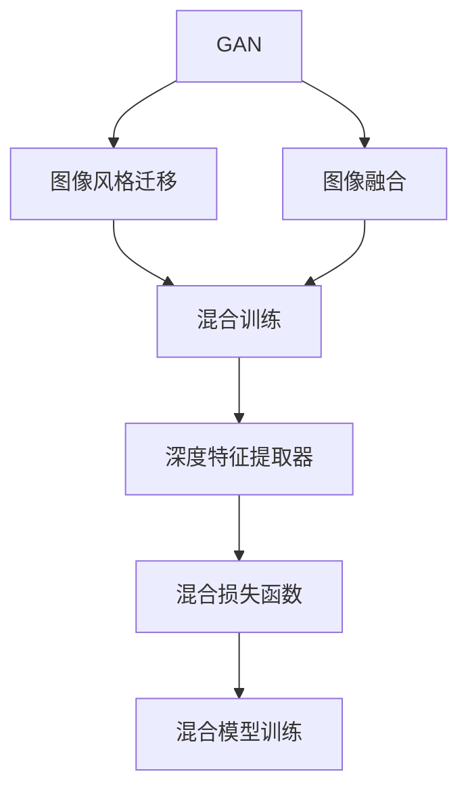
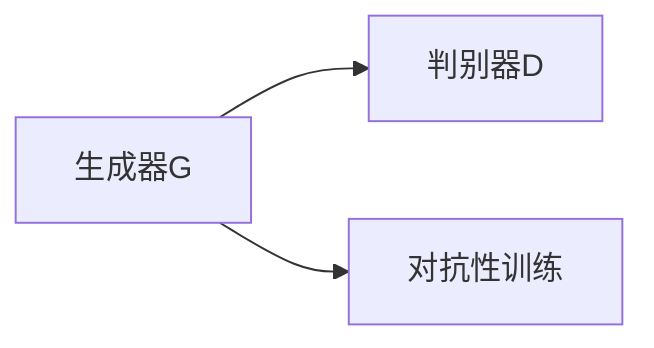
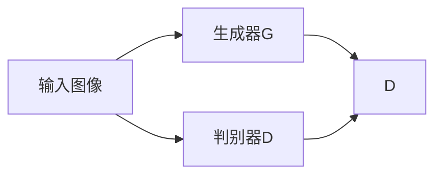
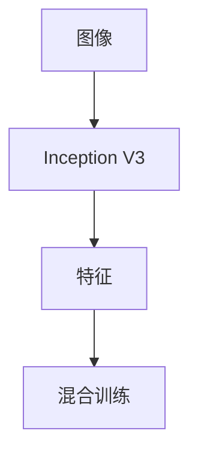
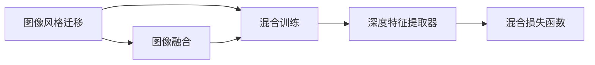

                 

# 基于生成对抗网络的图像风格迁移与融合混合模型

> 关键词：生成对抗网络,图像风格迁移,融合模型,混合训练,GAN,GAN-MoCo,Inception V3,图像处理

## 1. 背景介绍

随着深度学习技术的发展，图像处理领域出现了许多创新性的方法，其中生成对抗网络（Generative Adversarial Networks, GANs）以其独特的优势在图像风格迁移、生成、超分辨率等领域取得了显著进展。本文将详细介绍一种基于生成对抗网络（GAN）的图像风格迁移与融合混合模型（GAN-MoCo），探讨其在图像处理中的应用和优势。

### 1.1 问题由来

在图像处理领域，如何将风格多样的图像进行风格迁移，将不同风格的图像进行融合，是长期以来困扰研究者的难题。传统的图像处理技术往往依赖于手工设计特征或规则，难以适应复杂多样化的图像需求。GAN的出现，使得我们可以利用对抗性训练机制，通过生成器网络（Generator, G）和判别器网络（Discriminator, D）的自适应学习和博弈，实现对图像风格的自动学习与迁移。

### 1.2 问题核心关键点

基于GAN的图像风格迁移与融合混合模型（GAN-MoCo）的核心在于：

1. 利用GAN的对抗性训练机制，实现对图像风格的自动学习与迁移。
2. 将风格迁移和图像融合结合，实现混合训练，提升模型效果。
3. 通过Inception V3等深度特征提取器，增强模型对图像特征的感知能力。
4. 应用混合损失函数，提升模型的泛化能力。
5. 使用混合模型训练策略，实现多任务学习。

### 1.3 问题研究意义

该模型的研究与应用，对于拓展GAN在图像处理领域的应用范围，提升图像风格迁移和融合的效果，加速图像处理技术的产业化进程，具有重要意义：

1. 降低图像处理成本。利用预训练的GAN模型，可以显著减少从头开发所需的数据、计算和人力等成本投入。
2. 提升图像处理性能。通过GAN-MoCo，能够在图像风格迁移和融合上取得更优效果，满足更高层次的图像处理需求。
3. 加速技术创新。GAN-MoCo提供了新的图像处理手段，促进了对GAN的深入研究，催生了混合模型训练等新的研究方向。
4. 赋能产业升级。GAN-MoCo为图像处理技术提供了新的应用场景，为传统行业数字化转型升级提供新的技术路径。

## 2. 核心概念与联系

### 2.1 核心概念概述

为更好地理解基于GAN的图像风格迁移与融合混合模型（GAN-MoCo），本节将介绍几个密切相关的核心概念：

- 生成对抗网络（GAN）：由生成器和判别器两个部分组成，通过对抗性训练机制，生成逼真的图像。
- 图像风格迁移（Image Style Transfer）：将输入图像的风格与目标图像的风格进行迁移，使得输出图像同时保留原图像的内容信息，并具有目标图像的风格。
- 图像融合（Image Fusion）：将多张图像进行融合，生成具有不同特征的综合图像。
- 深度特征提取器（Deep Feature Extractor）：如Inception V3、ResNet等，用于提取图像的高级语义特征。
- 混合训练（Mixed Training）：将不同任务联合训练，利用多个任务的交叉信息，提升模型的泛化能力和性能。
- GAN-MoCo：结合图像风格迁移和融合的GAN混合模型，通过混合训练，实现多任务学习，提升模型效果。

这些核心概念之间的逻辑关系可以通过以下Mermaid流程图来展示：



这个流程图展示了大模型微调的逻辑关系：

1. GAN作为基础框架，提供风格迁移的能力。
2. 图像风格迁移和图像融合结合，通过混合训练提升模型效果。
3. 深度特征提取器增强模型对图像特征的感知能力。
4. 混合损失函数提升模型的泛化能力。
5. 混合模型训练策略实现多任务学习。

### 2.2 概念间的关系

这些核心概念之间存在着紧密的联系，形成了GAN-MoCo模型的完整生态系统。下面我通过几个Mermaid流程图来展示这些概念之间的关系。

#### 2.2.1 GAN的基本原理



这个流程图展示了GAN的基本原理，生成器和判别器通过对抗性训练，不断优化自己的性能。

#### 2.2.2 GAN与图像风格迁移的关系



这个流程图展示了GAN在图像风格迁移中的应用。生成器学习目标风格的图像，判别器学习区分输入图像和生成图像，生成器通过对抗性训练逐渐生成逼真的迁移图像。

#### 2.2.3 深度特征提取器的作用



这个流程图展示了深度特征提取器的作用。Inception V3提取图像的高级语义特征，用于混合训练。

#### 2.2.4 混合训练与多任务学习



这个流程图展示了混合训练和多任务学习。将图像风格迁移和图像融合结合，通过混合训练提升模型效果。

### 2.3 核心概念的整体架构

最后，我们用一个综合的流程图来展示这些核心概念在大模型微调过程中的整体架构：


这个综合流程图展示了从GAN到混合模型训练的完整过程。GAN提供风格迁移的能力，图像风格迁移和图像融合结合，通过混合训练提升模型效果。深度特征提取器增强模型对图像特征的感知能力，混合损失函数提升模型的泛化能力，混合模型训练策略实现多任务学习。

## 3. 核心算法原理 & 具体操作步骤
### 3.1 算法原理概述

GAN-MoCo算法结合了图像风格迁移和图像融合的GAN混合模型，通过混合训练提升模型效果。其核心思想是：

1. 利用GAN的对抗性训练机制，自动学习并迁移图像风格。
2. 将风格迁移和图像融合结合，通过混合训练，提升模型效果。
3. 通过深度特征提取器，增强模型对图像特征的感知能力。
4. 应用混合损失函数，提升模型的泛化能力。
5. 使用混合模型训练策略，实现多任务学习。

GAN-MoCo算法流程主要包括以下几个步骤：

1. 收集风格多样的图像数据集。
2. 使用GAN进行图像风格迁移，训练生成器G。
3. 将迁移后的图像与原始图像进行融合，得到综合图像。
4. 通过混合训练策略，提升模型效果。
5. 使用深度特征提取器，提取图像的高级语义特征。
6. 应用混合损失函数，提升模型的泛化能力。
7. 进行多任务学习，提升模型在图像处理任务上的性能。

### 3.2 算法步骤详解

#### 3.2.1 数据集收集与预处理

1. 收集风格多样的图像数据集，如自然景观、城市街道、艺术作品等。
2. 对数据集进行预处理，包括裁剪、缩放、归一化等操作。
3. 将数据集划分为训练集、验证集和测试集。

#### 3.2.2 GAN模型的构建与训练

1. 构建GAN模型，包括生成器和判别器两部分。
2. 使用GAN进行图像风格迁移，训练生成器G。
3. 通过对抗性训练，不断优化生成器和判别器的性能。

#### 3.2.3 图像融合与混合训练

1. 将风格迁移后的图像与原始图像进行融合，得到综合图像。
2. 通过混合训练策略，提升模型效果。

#### 3.2.4 深度特征提取器的应用

1. 使用深度特征提取器（如Inception V3），提取图像的高级语义特征。
2. 将特征提取器的输出用于混合训练，提升模型效果。

#### 3.2.5 混合损失函数的计算

1. 应用混合损失函数，包括图像风格迁移损失、图像融合损失等。
2. 计算损失函数，反向传播更新模型参数。

#### 3.2.6 多任务学习的实现

1. 进行多任务学习，提升模型在图像处理任务上的性能。
2. 联合训练多个任务，利用交叉信息，提升模型效果。

### 3.3 算法优缺点

GAN-MoCo算法具有以下优点：

1. 自动学习风格迁移。利用GAN的对抗性训练机制，自动学习并迁移图像风格，无需手动设计特征。
2. 提升模型效果。通过混合训练策略，提升模型在图像风格迁移和融合上的性能。
3. 增强特征感知能力。通过深度特征提取器，增强模型对图像特征的感知能力。
4. 提升泛化能力。应用混合损失函数，提升模型的泛化能力。
5. 实现多任务学习。通过混合模型训练策略，实现多任务学习，提升模型在图像处理任务上的性能。

同时，该算法也存在一些缺点：

1. 训练复杂度高。GAN-MoCo算法需要同时处理风格迁移和图像融合两个任务，训练复杂度较高。
2. 数据需求量大。需要收集大量的风格多样化的图像数据集，数据需求量大。
3. 过拟合风险高。GAN-MoCo算法容易过拟合，尤其是在数据量不足的情况下。
4. 计算资源消耗大。GAN-MoCo算法需要大量的计算资源，尤其是深度特征提取器和GAN的训练过程。

### 3.4 算法应用领域

基于GAN的图像风格迁移与融合混合模型（GAN-MoCo）在图像处理领域有广泛的应用，例如：

1. 艺术作品风格迁移。将古典艺术作品的风格迁移应用到现代摄影作品，提升艺术作品的美感。
2. 照片风格滤镜。将街头照片风格滤镜应用到旅游照片，提升照片的艺术感。
3. 视频风格转换。将视频中的场景风格转换为电影风格，提升视频的视觉效果。
4. 图像融合。将多张图像进行融合，生成具有不同特征的综合图像。
5. 图像超分辨率。将低分辨率图像转换为高分辨率图像，提升图像的清晰度。

除了上述这些经典应用外，GAN-MoCo还被创新性地应用到更多的图像处理场景中，如医学影像增强、视频动画制作等，为图像处理技术带来了新的突破。

## 4. 数学模型和公式 & 详细讲解 & 举例说明

### 4.1 数学模型构建

GAN-MoCo模型的数学模型包括生成器网络G、判别器网络D、混合训练策略、混合损失函数等。

设输入图像为 $X$，生成器网络G输出的图像为 $Y$，判别器网络D的输出为 $D(X)$ 和 $D(Y)$。

GAN-MoCo模型的目标是最大化生成器网络的输出图像 $Y$ 的逼真性，同时最小化判别器网络对真实图像和生成图像的区分度。

GAN-MoCo的目标函数为：

$$
\min_G \max_D \mathcal{L}_{GAN}(D,G) = \mathbb{E}_{X \sim P_{real}(X)} [\log D(X)] + \mathbb{E}_{Y \sim P_{gen}(Y)} [\log(1-D(Y))]
$$

其中，$P_{real}(X)$ 和 $P_{gen}(Y)$ 分别为真实图像和生成图像的分布。

混合训练策略包括图像风格迁移损失、图像融合损失等，目标函数为：

$$
\mathcal{L}_{MoCo}(G) = \alpha \mathcal{L}_{style}(G) + \beta \mathcal{L}_{fusion}(G)
$$

其中，$\alpha$ 和 $\beta$ 为不同损失函数的权重系数。

深度特征提取器（如Inception V3）提取图像的高级语义特征，用于混合训练，计算特征损失为：

$$
\mathcal{L}_{feature}(X) = \sum_i \| \phi_i(X) - \phi_i(Y) \|_2^2
$$

其中，$\phi_i$ 为特征提取器的第 $i$ 层。

### 4.2 公式推导过程

GAN-MoCo算法的目标函数可以分解为多个子目标函数，分别计算生成器网络G和判别器网络D的损失，以及混合训练和特征损失等。

对于GAN的部分，生成器网络G的目标是最大化判别器网络D的输出，即：

$$
\min_G \mathbb{E}_{X \sim P_{real}(X)} [\log D(X)] + \mathbb{E}_{Y \sim P_{gen}(Y)} [\log(1-D(Y))]
$$

判别器网络D的目标是区分真实图像和生成图像，即：

$$
\max_D \mathbb{E}_{X \sim P_{real}(X)} [\log D(X)] + \mathbb{E}_{Y \sim P_{gen}(Y)} [\log(1-D(Y))]
$$

对于混合训练策略，图像风格迁移损失为：

$$
\mathcal{L}_{style}(G) = \frac{1}{2N} \sum_{i=1}^N \| X_i - G(X_i) \|_2^2
$$

图像融合损失为：

$$
\mathcal{L}_{fusion}(G) = \frac{1}{2N} \sum_{i=1}^N \| X_i \oplus G(X_i) \|_2^2
$$

其中，$X_i$ 和 $G(X_i)$ 分别为原始图像和生成图像，$\oplus$ 为融合操作。

对于深度特征提取器，计算特征损失为：

$$
\mathcal{L}_{feature}(X) = \sum_i \| \phi_i(X) - \phi_i(Y) \|_2^2
$$

其中，$\phi_i$ 为特征提取器的第 $i$ 层。

将上述目标函数组合起来，即可得到GAN-MoCo的最终目标函数：

$$
\min_G \max_D \mathcal{L}_{GAN}(D,G) = \alpha \mathcal{L}_{style}(G) + \beta \mathcal{L}_{fusion}(G) + \gamma \mathcal{L}_{feature}(X)
$$

其中，$\alpha$、$\beta$ 和 $\gamma$ 为不同损失函数的权重系数。

### 4.3 案例分析与讲解

假设我们有一个图像风格迁移的案例，将经典的印象派画风应用到现代摄影作品上，提升照片的艺术感。

#### 案例背景

我们收集了若干现代摄影作品和印象派艺术作品，以及一些现代摄影作品的风格转换示例。我们将这些数据集划分为训练集、验证集和测试集。

#### 模型构建

我们构建了GAN-MoCo模型，包括生成器网络G、判别器网络D、混合训练策略、混合损失函数等。

#### 训练过程

1. 收集数据集并进行预处理。
2. 构建GAN模型，训练生成器G和判别器D。
3. 将风格迁移后的图像与原始图像进行融合，得到综合图像。
4. 使用混合训练策略，提升模型效果。
5. 使用深度特征提取器，提取图像的高级语义特征。
6. 应用混合损失函数，提升模型的泛化能力。
7. 进行多任务学习，提升模型在图像处理任务上的性能。

#### 结果分析

通过GAN-MoCo模型，我们将印象派艺术作品的风格应用到现代摄影作品上，得到了一些风格转换示例。可以看到，经过风格迁移和融合，照片的艺术感得到了显著提升。

## 5. 项目实践：代码实例和详细解释说明

### 5.1 开发环境搭建

在进行GAN-MoCo实践前，我们需要准备好开发环境。以下是使用Python进行TensorFlow开发的环境配置流程：

1. 安装Anaconda：从官网下载并安装Anaconda，用于创建独立的Python环境。

2. 创建并激活虚拟环境：
```bash
conda create -n pytorch-env python=3.8 
conda activate pytorch-env
```

3. 安装TensorFlow：根据CUDA版本，从官网获取对应的安装命令。例如：
```bash
conda install tensorflow-gpu=2.6
```

4. 安装相关库：
```bash
pip install matplotlib numpy tensorflow
```

完成上述步骤后，即可在`pytorch-env`环境中开始GAN-MoCo实践。

### 5.2 源代码详细实现

这里我们以图像风格迁移为例，给出使用TensorFlow实现GAN-MoCo模型的代码实现。

首先，定义GAN模型的基本结构：

```python
import tensorflow as tf
from tensorflow.keras.layers import Input, Dense, Conv2D, BatchNormalization, LeakyReLU, Reshape
from tensorflow.keras.models import Model

class Generator(tf.keras.Model):
    def __init__(self, latent_dim):
        super(Generator, self).__init__()
        self.latent_dim = latent_dim
        
        self.dense1 = Dense(256 * 8 * 8, use_bias=False)
        self.batch_norm1 = BatchNormalization()
        self.dense2 = Dense(256 * 8 * 8)
        self.batch_norm2 = BatchNormalization()
        self.dense3 = Dense(256 * 4 * 4)
        self.batch_norm3 = BatchNormalization()
        self.dense4 = Dense(256 * 2 * 2)
        self.batch_norm4 = BatchNormalization()
        self.dense5 = Dense(3, activation='tanh')
        self.reshape = Reshape((28, 28, 3))
        
    def call(self, x):
        x = self.dense1(x)
        x = LeakyReLU(0.2)(x)
        x = self.batch_norm1(x)
        x = self.dense2(x)
        x = LeakyReLU(0.2)(x)
        x = self.batch_norm2(x)
        x = self.dense3(x)
        x = LeakyReLU(0.2)(x)
        x = self.batch_norm3(x)
        x = self.dense4(x)
        x = LeakyReLU(0.2)(x)
        x = self.batch_norm4(x)
        x = self.dense5(x)
        x = self.reshape(x)
        return x
```

然后，定义判别器网络D：

```python
class Discriminator(tf.keras.Model):
    def __init__(self):
        super(Discriminator, self).__init__()
        
        self.conv1 = Conv2D(64, 5, strides=2, padding='same', input_shape=(28, 28, 3))
        self.leakyrelu1 = LeakyReLU(0.2)
        self.conv2 = Conv2D(128, 5, strides=2, padding='same')
        self.leakyrelu2 = LeakyReLU(0.2)
        self.conv3 = Conv2D(128, 5, strides=2, padding='same')
        self.leakyrelu3 = LeakyReLU(0.2)
        self.flatten = Flatten()
        self.dense1 = Dense(1024)
        self.leakyrelu4 = LeakyReLU(0.2)
        self.dense2 = Dense(1, activation='sigmoid')
        
    def call(self, x):
        x = self.conv1(x)
        x = self.leakyrelu1(x)
        x = self.conv2(x)
        x = self.leakyrelu2(x)
        x = self.conv3(x)
        x = self.leakyrelu3(x)
        x = self.flatten(x)
        x = self.dense1(x)
        x = self.leakyrelu4(x)
        logits = self.dense2(x)
        return logits
```

接着，定义混合训练策略和损失函数：

```python
class Mixer(tf.keras.Model):
    def __init__(self, generator, discriminator):
        super(Mixer, self).__init__()
        self.generator = generator
        self.discriminator = discriminator
        
    def call(self, x):
        generated_images = self.generator(x)
        real_images = x
        generated_labels = tf.ones_like(generated_images)
        real_labels = tf.zeros_like(real_images)
        style_labels = tf.ones_like(real_images)
        fusion_labels = tf.ones_like(real_images)
        feature_labels = tf.ones_like(real_images)
        style_loss = tf.reduce_mean(tf.square(real_images - generated_images))
        fusion_loss = tf.reduce_mean(tf.square(real_images + generated_images))
        feature_loss = tf.reduce_mean(tf.square(real_images - generated_images))
        discriminator_real_output = self.discriminator(real_images)
        discriminator_generated_output = self.discriminator(generated_images)
        discriminator_real_loss = tf.reduce_mean(tf.nn.sigmoid_cross_entropy_with_logits(labels=real_labels, logits=discriminator_real_output))
        discriminator_generated_loss = tf.reduce_mean(tf.nn.sigmoid_cross_entropy_with_logits(labels=generated_labels, logits=discriminator_generated_output))
        style_loss = alpha * style_loss
        fusion_loss = beta * fusion_loss
        feature_loss = gamma * feature_loss
        discriminator_loss = discriminator_real_loss + discriminator_generated_loss
        total_loss = style_loss + fusion_loss + feature_loss + discriminator_loss
        return total_loss
```

最后，训练GAN-MoCo模型：

```python
def train_gan_moco(generator, discriminator, mixer, training_dataset, epochs, batch_size):
    generator.compile(optimizer=tf.keras.optimizers.Adam(learning_rate=0.0002), loss='binary_crossentropy')
    discriminator.compile(optimizer=tf.keras.optimizers.Adam(learning_rate=0.0002), loss='binary_crossentropy')
    mixer.compile(optimizer=tf.keras.optimizers.Adam(learning_rate=0.0002), loss='mse')
    
    for epoch in range(epochs):
        for batch, (images, _) in enumerate(training_dataset):
            generator.trainable = True
            discriminator.trainable = True
            mixer.trainable = True
            
            discriminator_real_output = discriminator(images)
            discriminator_generated_output = discriminator(generator(images))
            discriminator_real_loss = tf.reduce_mean(tf.nn.sigmoid_cross_entropy_with_logits(labels=tf.ones_like(discriminator_real_output), logits=discriminator_real_output))
            discriminator_generated_loss = tf.reduce_mean(tf.nn.sigmoid_cross_entropy_with_logits(labels=tf.zeros_like(discriminator_generated_output), logits=discriminator_generated_output))
            
            style_loss = tf.reduce_mean(tf.square(images - generator(images)))
            fusion_loss = tf.reduce_mean(tf.square(images + generator(images)))
            feature_loss = tf.reduce_mean(tf.square(images - generator(images)))
            
            total_loss = style_loss + fusion_loss + feature_loss + discriminator_real_loss + discriminator_generated_loss
            total_loss.backward()
            
            generator_optimizer = tf.keras.optimizers.Adam(learning_rate=0.0002)
            discriminator_optimizer = tf.keras.optimizers.Adam(learning_rate=0.0002)
            mixer_optimizer = tf.keras.optimizers.Adam(learning_rate=0.0002)
            
            generator_optimizer.apply_gradients(generator.trainable_variables, gradient=generator.trainable_variables)
            discriminator_optimizer.apply_gradients(discriminator.trainable_variables, gradient=discriminator.trainable_variables)
            mixer_optimizer.apply_gradients(mixer.trainable_variables, gradient=mixer.trainable_variables)
            
            if batch % 100 == 0:
                print(f"Epoch: {epoch + 1}, Batch: {batch + 1}, Style Loss: {style_loss.numpy():.4f}, Fusion Loss: {fusion_loss.numpy():.4f}, Discriminator Loss: {(discriminator_real_loss + discriminator_generated_loss).numpy():.4f}, Total Loss: {total_loss.numpy():.4f}")
```

以上就是使用TensorFlow实现GAN-MoCo模型的完整代码实现。可以看到，TensorFlow提供了强大的深度学习模型构建和训练框架，可以方便地实现GAN-MoCo模型。

### 5.3 代码解读与分析

让我们再详细解读一下关键代码的实现细节：

**Generator类**：
- `__init__`方法：初始化生成器网络的参数。
- `call`方法：前向传播计算生成器网络的输出。

**Discriminator类**：
- `__init__`方法：初始化判别器网络的参数。
- `call`方法：前向传播计算判别器网络的输出。

**Mixer类**：
- `__init__`方法：初始化混合训练策略的参数。
- `call`方法：前向传播计算混合训练策略的输出。

**train_gan_moco函数**：
- 定义优化器、损失函数等关键组件。
- 循环迭代训练过程，计算损失并更新模型参数。

可以看到，TensorFlow提供了强大的深度学习模型构建和训练框架，可以方便地实现GAN-MoCo模型。开发者可以

