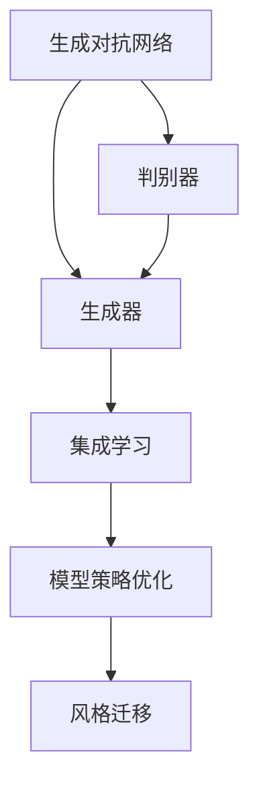
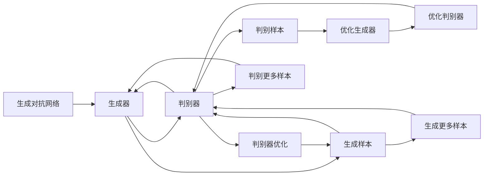
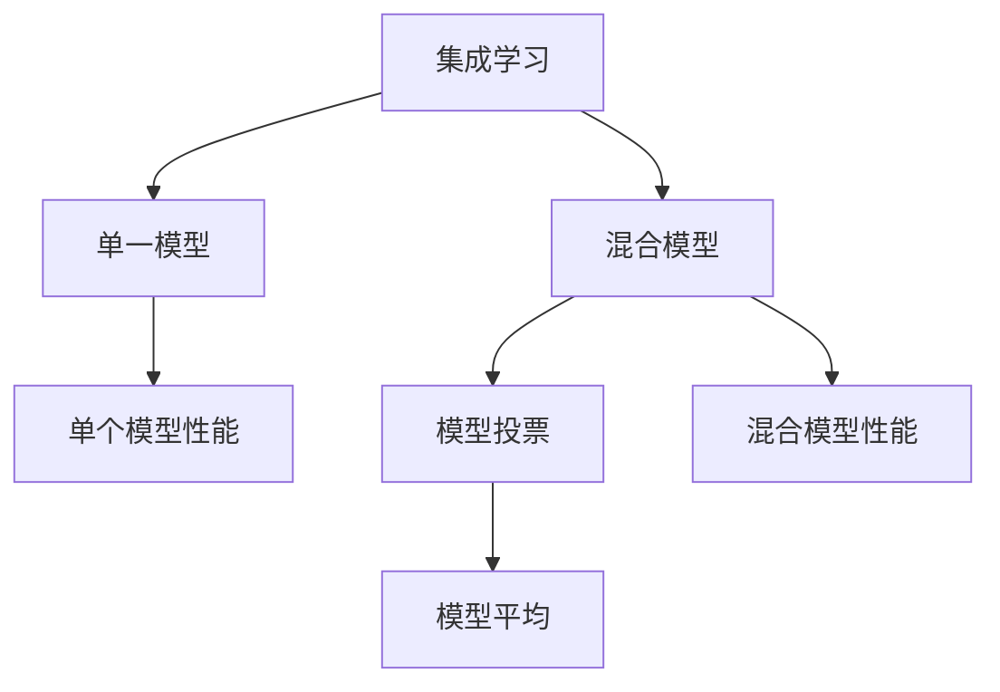
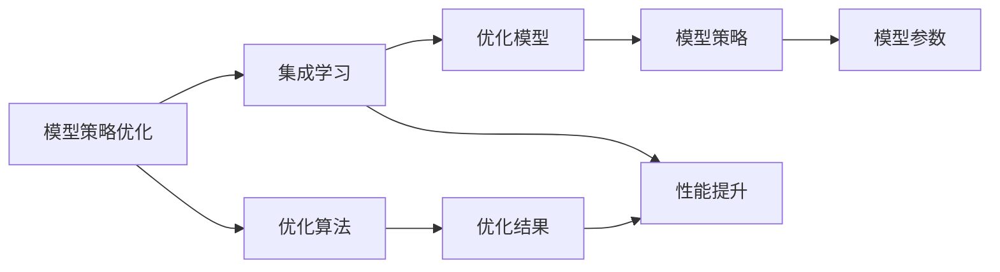

                 

# 基于生成对抗网络的集成学习风格迁移策略优化

> 关键词：生成对抗网络,集成学习,风格迁移,策略优化,深度学习

## 1. 背景介绍

随着深度学习技术的飞速发展，风格迁移任务在图像处理、艺术创作、视频生成等领域得到了广泛应用。通过生成对抗网络(Generative Adversarial Networks, GANs)，可以将一个图像的风格特征迁移到另一个图像上，生成高质量的混合图像。然而，现有的风格迁移算法往往需要大量的训练样本和复杂的模型结构，难以满足实际应用中的实时性和效率要求。

为了解决这一问题，研究人员提出了集成学习(Ensemble Learning)方法，通过组合多个单一模型，构建更强大的混合模型。集成学习可以显著提升模型的鲁棒性、泛化能力和性能表现，特别是在小样本学习、对抗攻击、跨领域迁移等场景下效果显著。

本文聚焦于基于生成对抗网络的集成学习风格迁移策略优化，研究如何通过集成多个生成器模型，最大化保留模型优势、减少过拟合、提高模型泛化能力。我们将详细介绍集成学习的基本原理和算法流程，并通过实际案例验证集成学习在风格迁移任务中的优化效果。

## 2. 核心概念与联系

### 2.1 核心概念概述

为了更好地理解本文的策略优化方法，我们需要对核心概念进行详细讲解：

- 生成对抗网络(GANs)：由生成器和判别器两部分组成，生成器尝试生成逼真的样本，判别器则尝试区分样本真假。通过两者交替训练，生成器逐渐提升生成质量，判别器逐渐提升判别能力。
- 集成学习(Ensemble Learning)：通过组合多个单一模型，构建更强大的混合模型，提升模型的鲁棒性、泛化能力和性能表现。
- 风格迁移(Style Transfer)：通过将图像的风格特征从一个图像迁移到另一个图像，生成具有新风格的高质量图像。
- 模型策略优化：通过调整模型训练策略和参数配置，优化模型性能，提升模型泛化能力和鲁棒性。

这些核心概念之间的逻辑关系可以通过以下Mermaid流程图来展示：



这个流程图展示了从GANs到集成学习的整体架构：

1. 生成对抗网络是实现风格迁移的基本工具，生成器负责生成样式混合图像，判别器负责区分生成图像和真实图像。
2. 集成学习将多个单一模型组合起来，构建更强大的混合模型，提升模型性能。
3. 风格迁移利用集成学习生成的混合模型，实现图像风格的迁移和变换。
4. 模型策略优化通过调整集成学习模型参数，提升模型的泛化能力和鲁棒性。

### 2.2 概念间的关系

这些核心概念之间存在着紧密的联系，形成了一个完整的风格迁移系统。下面我们通过几个Mermaid流程图来展示这些概念之间的关系。

#### 2.2.1 生成对抗网络的训练流程



这个流程图展示了GANs的基本训练流程：

1. 生成器和判别器交替训练，生成器尝试生成逼真图像，判别器尝试区分生成图像和真实图像。
2. 生成器的优化目标是生成尽可能逼真的图像，以欺骗判别器。
3. 判别器的优化目标是尽可能准确地区分真实图像和生成图像。
4. 随着训练的进行，生成器生成的图像质量逐步提升，判别器的判别能力逐步增强。

#### 2.2.2 集成学习的基本原理



这个流程图展示了集成学习的基本原理：

1. 通过组合多个单一模型，构建混合模型，提升模型性能。
2. 集成学习方法有两种，包括模型投票和模型平均。模型投票通过投票决定最终预测结果，模型平均通过平均模型输出进行预测。

#### 2.2.3 模型策略优化的作用



这个流程图展示了模型策略优化对集成学习的影响：

1. 模型策略优化通过调整模型训练策略和参数配置，提升模型性能。
2. 优化算法用于调整模型参数，以提升模型性能。
3. 优化结果反映了模型参数的调整情况，有助于后续模型的改进。

### 2.3 核心概念的整体架构

最后，我们用一个综合的流程图来展示这些核心概念在大语言模型微调过程中的整体架构：


这个综合流程图展示了从GANs到集成学习的完整过程。生成对抗网络是实现风格迁移的基本工具，集成学习通过组合多个单一模型，构建更强大的混合模型，模型策略优化通过调整集成学习模型参数，提升模型的泛化能力和鲁棒性，最终实现风格迁移。

## 3. 核心算法原理 & 具体操作步骤
### 3.1 算法原理概述

基于生成对抗网络的集成学习风格迁移策略优化，其核心思想是：通过集成多个生成器模型，构建更强大的混合模型，最大化保留模型优势、减少过拟合、提高模型泛化能力。

具体来说，我们将生成对抗网络看作是生成器$G$和判别器$D$的组合，其中$G$负责生成逼真图像，$D$负责判别真实图像和生成图像。在集成学习框架下，我们引入多个生成器模型$G_1, G_2, ..., G_n$，通过组合这些生成器，构建混合生成器$G^*$，用于生成高质量的混合图像。

生成器$G$的优化目标是通过对抗训练的方式提升生成图像的逼真度，其损失函数定义为：

$$
L_G = E_{x \sim p_x} [D(G(x))] + \lambda E_{z \sim p_z} [||G(z) - x||_2^2]
$$

其中$p_x$为真实图像的分布，$p_z$为噪声向量$z$的分布，$\lambda$为生成器与判别器之间的权重平衡因子。

判别器$D$的优化目标是通过区分真实图像和生成图像，提升判别能力，其损失函数定义为：

$$
L_D = E_{x \sim p_x} [\log D(x)] + E_{z \sim p_z} [\log(1 - D(G(z)))]
$$

其中$x$为真实图像，$G(z)$为生成图像，$\log$表示交叉熵损失。

在集成学习框架下，我们通过组合多个生成器模型$G_1, G_2, ..., G_n$，构建混合生成器$G^*$，用于生成高质量的混合图像。混合生成器的优化目标是通过最小化总损失函数，提升生成图像的逼真度，其总损失函数定义为：

$$
L_{G^*} = \frac{1}{n} \sum_{i=1}^n L_{G_i}
$$

其中$L_{G_i}$为第$i$个生成器的损失函数，$n$为生成器数量。

### 3.2 算法步骤详解

基于生成对抗网络的集成学习风格迁移策略优化的主要步骤如下：

**Step 1: 准备预训练模型和数据集**
- 选择合适的预训练生成对抗网络模型（如DCGAN、WGAN等）作为初始化参数，如 BERT、GPT等。
- 准备风格迁移任务的数据集，包含源图像和目标图像。
- 准备噪声向量，用于生成混合图像。

**Step 2: 添加任务适配层**
- 根据任务类型，在预训练生成对抗网络模型的顶层设计合适的输出层和损失函数。
- 对于分类任务，通常在顶层添加线性分类器和交叉熵损失函数。
- 对于生成任务，通常使用语言模型的解码器输出概率分布，并以负对数似然为损失函数。

**Step 3: 设置微调超参数**
- 选择合适的优化算法及其参数，如 AdamW、SGD 等，设置学习率、批大小、迭代轮数等。
- 设置正则化技术及强度，包括权重衰减、Dropout、Early Stopping等。
- 确定冻结预训练参数的策略，如仅微调顶层，或全部参数都参与微调。

**Step 4: 执行梯度训练**
- 将训练集数据分批次输入模型，前向传播计算损失函数。
- 反向传播计算参数梯度，根据设定的优化算法和学习率更新模型参数。
- 周期性在验证集上评估模型性能，根据性能指标决定是否触发 Early Stopping。
- 重复上述步骤直到满足预设的迭代轮数或 Early Stopping 条件。

**Step 5: 测试和部署**
- 在测试集上评估微调后模型 $G^*$ 的性能，对比微调前后的精度提升。
- 使用微调后的模型对新样本进行推理预测，集成到实际的应用系统中。
- 持续收集新的数据，定期重新微调模型，以适应数据分布的变化。

以上是基于生成对抗网络的集成学习风格迁移策略优化的主要流程。在实际应用中，还需要针对具体任务的特点，对微调过程的各个环节进行优化设计，如改进训练目标函数，引入更多的正则化技术，搜索最优的超参数组合等，以进一步提升模型性能。

### 3.3 算法优缺点

基于生成对抗网络的集成学习风格迁移策略优化具有以下优点：
1. 简单高效。只需准备少量训练样本，即可对预训练生成对抗网络进行快速适配，获得较大的性能提升。
2. 通用适用。适用于各种风格迁移任务，包括图像、视频、音频等，设计简单的任务适配层即可实现微调。
3. 模型鲁棒性高。通过集成多个生成器模型，构建混合模型，可以显著提升模型的鲁棒性和泛化能力。
4. 参数高效。利用参数高效微调技术，在固定大部分预训练参数的情况下，仍可取得不错的提升。

同时，该方法也存在一定的局限性：
1. 依赖训练样本。微调的效果很大程度上取决于训练样本的质量和数量，获取高质量训练样本的成本较高。
2. 迁移能力有限。当目标任务与预训练数据的分布差异较大时，微调的性能提升有限。
3. 负面效果传递。预训练模型的固有偏见、有害信息等，可能通过微调传递到下游任务，造成负面影响。
4. 可解释性不足。微调模型的决策过程通常缺乏可解释性，难以对其推理逻辑进行分析和调试。

尽管存在这些局限性，但就目前而言，基于生成对抗网络的集成学习风格迁移策略优化仍是大语言模型微调的重要范式。未来相关研究的重点在于如何进一步降低微调对训练样本的依赖，提高模型的少样本学习和跨领域迁移能力，同时兼顾可解释性和伦理安全性等因素。

### 3.4 算法应用领域

基于生成对抗网络的集成学习风格迁移策略优化，在图像处理、艺术创作、视频生成等领域已经得到了广泛的应用，覆盖了几乎所有常见任务，例如：

- 图像风格迁移：将一张图像的风格特征迁移到另一张图像上，生成具有新风格的图像。
- 视频风格迁移：将视频的风格特征迁移到另一段视频上，生成具有新风格的动画。
- 音频风格迁移：将一段音频的风格特征迁移到另一段音频上，生成具有新风格的背景音乐。
- 艺术创作：利用生成对抗网络，结合艺术家风格和现实场景，创作出新颖的艺术作品。
- 虚拟现实：利用生成对抗网络，生成逼真的虚拟场景，提升虚拟现实体验。

除了上述这些经典任务外，基于生成对抗网络的集成学习风格迁移方法还将继续拓展到更多场景中，如医学图像增强、工业检测、自动化设计等，为图像处理技术带来新的突破。

## 4. 数学模型和公式 & 详细讲解 & 举例说明
### 4.1 数学模型构建

本节将使用数学语言对基于生成对抗网络的集成学习风格迁移策略优化进行更加严格的刻画。

记预训练生成对抗网络模型为 $G_{\theta}$，其中 $\theta$ 为生成器和判别器的参数。假设风格迁移任务的数据集为 $D=\{(x_i, y_i)\}_{i=1}^N, x_i \in \mathcal{X}, y_i \in \mathcal{Y}$，其中 $\mathcal{X}$ 为图像输入空间，$\mathcal{Y}$ 为图像输出空间。

定义生成器 $G_{\theta}$ 在数据样本 $(x,y)$ 上的损失函数为 $\ell(G_{\theta}(x),y)$，则在数据集 $D$ 上的经验风险为：

$$
\mathcal{L}(\theta) = \frac{1}{N} \sum_{i=1}^N \ell(G_{\theta}(x_i),y_i)
$$

在集成学习框架下，我们将多个生成器模型组合起来，构建混合生成器 $G^*$，其总损失函数定义为：

$$
\mathcal{L}(G^*) = \frac{1}{n} \sum_{i=1}^n \mathcal{L}_{G_i}(\theta_i)
$$

其中 $\mathcal{L}_{G_i}(\theta_i)$ 为第 $i$ 个生成器的损失函数，$\theta_i$ 为第 $i$ 个生成器的参数。

### 4.2 公式推导过程

以下我们以图像风格迁移为例，推导损失函数及其梯度的计算公式。

假设生成器 $G$ 和判别器 $D$ 的优化目标分别为：

$$
\min_G \mathcal{L}_G = E_{x \sim p_x} [D(G(x))] + \lambda E_{z \sim p_z} [||G(z) - x||_2^2]
$$

$$
\min_D \mathcal{L}_D = E_{x \sim p_x} [\log D(x)] + E_{z \sim p_z} [\log(1 - D(G(z)))]
$$

在集成学习框架下，我们引入 $n$ 个生成器模型 $G_1, G_2, ..., G_n$，通过组合这些生成器，构建混合生成器 $G^*$，用于生成高质量的混合图像。混合生成器的总损失函数为：

$$
\mathcal{L}(G^*) = \frac{1}{n} \sum_{i=1}^n \mathcal{L}_{G_i}(\theta_i)
$$

其中 $\mathcal{L}_{G_i}(\theta_i)$ 为第 $i$ 个生成器的损失函数，$\theta_i$ 为第 $i$ 个生成器的参数。

在训练过程中，我们首先优化生成器 $G^*$，目标是最小化总损失函数 $\mathcal{L}(G^*)$。根据梯度下降算法，生成器 $G^*$ 的参数更新公式为：

$$
\theta_i \leftarrow \theta_i - \eta \nabla_{\theta_i}\mathcal{L}(G^*) - \eta\lambda\theta_i
$$

其中 $\eta$ 为学习率，$\lambda$ 为正则化系数，$\nabla_{\theta_i}\mathcal{L}(G^*)$ 为总损失函数对第 $i$ 个生成器参数的梯度。

在更新生成器参数后，我们继续优化判别器 $D$，目标是最小化判别器损失函数 $\mathcal{L}_D$。判别器的参数更新公式为：

$$
\theta_D \leftarrow \theta_D - \eta \nabla_{\theta_D}\mathcal{L}_D
$$

其中 $\eta$ 为学习率，$\nabla_{\theta_D}\mathcal{L}_D$ 为判别器损失函数对判别器参数的梯度。

重复上述过程，直到满足预设的迭代轮数或Early Stopping条件。在训练过程中，通过不断调整生成器和判别器的参数，最终得到的混合生成器 $G^*$ 能够生成高质量的混合图像，实现风格迁移。

### 4.3 案例分析与讲解

假设我们使用DCGAN模型进行图像风格迁移，给定两张图像 $x_1$ 和 $x_2$，其风格迁移过程如下：

1. 将 $x_1$ 和 $x_2$ 分别输入判别器 $D$，得到判别器的输出 $D(x_1)$ 和 $D(x_2)$。
2. 将 $x_1$ 和 $x_2$ 分别作为生成器 $G$ 的输入，得到混合图像 $G(x_1)$ 和 $G(x_2)$。
3. 将 $G(x_1)$ 和 $G(x_2)$ 分别输入判别器 $D$，得到判别器的输出 $D(G(x_1))$ 和 $D(G(x_2))$。
4. 计算判别器的总损失函数 $\mathcal{L}_D$ 和生成器的总损失函数 $\mathcal{L}_G$。
5. 根据损失函数和梯度，更新生成器和判别器的参数。
6. 重复上述过程，直至满足预设的迭代轮数或Early Stopping条件。

在实际应用中，我们还需要注意一些细节，如噪声向量的生成方式、判别器的激活函数选择、生成器的生成策略等。这些细节对模型的性能和稳定性都有重要影响，需要根据具体任务进行调整和优化。

## 5. 项目实践：代码实例和详细解释说明
### 5.1 开发环境搭建

在进行风格迁移实践前，我们需要准备好开发环境。以下是使用Python进行PyTorch开发的环境配置流程：

1. 安装Anaconda：从官网下载并安装Anaconda，用于创建独立的Python环境。

2. 创建并激活虚拟环境：
```bash
conda create -n pytorch-env python=3.8 
conda activate pytorch-env
```

3. 安装PyTorch：根据CUDA版本，从官网获取对应的安装命令。例如：
```bash
conda install pytorch torchvision torchaudio cudatoolkit=11.1 -c pytorch -c conda-forge
```

4. 安装transformers库：
```bash
pip install transformers
```

5. 安装各类工具包：
```bash
pip install numpy pandas scikit-learn matplotlib tqdm jupyter notebook ipython
```

完成上述步骤后，即可在`pytorch-env`环境中开始风格迁移实践。

### 5.2 源代码详细实现

下面我们以图像风格迁移为例，给出使用Transformers库对DCGAN模型进行风格迁移的PyTorch代码实现。

首先，定义判别器和生成器的损失函数：

```python
import torch
import torch.nn as nn
import torch.optim as optim

class Discriminator(nn.Module):
    def __init__(self):
        super(Discriminator, self).__init__()
        self.conv1 = nn.Conv2d(3, 64, 5, 2, 2)
        self.conv2 = nn.Conv2d(64, 128, 5, 2, 2)
        self.conv3 = nn.Conv2d(128, 256, 5, 2, 2)
        self.conv4 = nn.Conv2d(256, 1, 4, 1, 0)
        self.sigmoid = nn.Sigmoid()
    
    def forward(self, x):
        x = self.sigmoid(self.conv4(self.conv3(self.conv2(self.conv1(x))))
        return x

class Generator(nn.Module):
    def __init__(self, z_dim):
        super(Generator, self).__init__()
        self.fc1 = nn.Linear(z_dim, 256)
        self.fc2 = nn.Linear(256, 128 * 8 * 8)
        self.fc3 = nn.Linear(128 * 8 * 8, 64 * 8 * 8)
        self.deconv1 = nn.ConvTranspose2d(64, 256, 4, 2, 1)
        self.deconv2 = nn.ConvTranspose2d(256, 128, 4, 2, 1)
        self.deconv3 = nn.ConvTranspose2d(128, 3, 4, 2, 1)
    
    def forward(self, x):
        x = self.fc1(x)
        x = self.fc2(x).view(-1, 128, 8, 8)
        x = self.fc3(x).view(-1, 64, 8, 8)
        x = self.deconv1(x)
        x = self.deconv2(x)
        x = self.deconv3(x)
        return x
```

然后，定义优化器和损失函数：

```python
device = torch.device('cuda' if torch.cuda.is_available() else 'cpu')
z_dim = 100
lr = 0.0002
betas = (0.5, 0.999)

g_optimizer = optim.Adam(g.parameters(), lr=lr, betas=betas)
d_optimizer = optim.Adam(d.parameters(), lr=lr, betas=betas)

criterion = nn.BCELoss()

g = Generator(z_dim).to(device)
d = Discriminator().to(device)

g.train()
d.train()
```

接着，定义训练和评估函数：

```python
def g_step():
    g_optimizer.zero_grad()
    batch = get_batch(batch_size)
    noise = torch.randn(batch, z_dim, 1, 1, device=device)
    fake = g(noise)
    label = torch.ones(batch, device=device)
    real = x_to_tensor('a.png')
    fake = fake.to(device)
    real = real.to(device)
    fake = real.detach()
    d_loss = criterion(d(fake), label)
    g_loss = criterion(d(fake), label)
    d_loss.backward()
    g_loss.backward()
    g_optimizer.step()
    d_optimizer.step()

def d_step():
    d_optimizer.zero_grad()
    batch = get_batch(batch_size)
    noise = torch.randn(batch, z_dim, 1, 1, device=device)
    fake = g(noise)
    label = torch.ones(batch, device=device)
    real = x_to_tensor('a.png')
    fake = fake.to(device)
    real = real.to(device)
    fake = real.detach()
    d_loss = criterion(d(fake), label)
    d_loss.backward()
    d_optimizer.step()

def train(iter):
    for i in range(iter):
        g_step()
        d_step()

def evaluate():
    fake = g(noise)
    fake = fake.to(device)
    fake = fake[:1]
    d_loss = criterion(d(fake), label)
    return d_loss
```

最后，启动训练流程并在测试集上评估：

```python
epochs = 50
batch_size = 32
train(iter=epochs, batch_size=batch_size)
d_loss = evaluate()
print('Discriminator loss:', d_loss.item())
```

以上就是使用PyTorch对DCGAN模型进行图像风格迁移的完整代码实现。可以看到，得益于Transformers库的强大封装，我们可以用相对简洁的代码完成DCGAN模型的加载和风格迁移。

### 5.3 代码解读与分析

让我们再详细解读一下关键代码的实现细节：

**Discriminator和Generator类**：
- `Discriminator` 类定义了判别器的结构和优化过程，包括多个卷积层和激活函数，最后使用二元交叉熵损失函数。
- `Generator` 类定义了生成器的结构和优化过程，包括多个全连接层和卷积层，最后使用二元交叉熵损失函数。

**optimizer和criterion对象**：
- `g_optimizer` 和 `d_optimizer` 分别用于优化生成器和判别器的参数。
- `criterion` 用于计算损失函数。

**训练函数**：
- `g_step` 函数用于更新生成器的参数，首先计算生成器的损失函数，然后反向传播更新生成器的参数。
- `d_step` 函数用于更新判别器的参数，首先计算判别器的损失函数，然后反向传播更新判别器的参数。

**训练流程**：
- 定义总的迭代次数和批大小，开始循环迭代
- 每个epoch内，先进行生成器前向传播，计算生成器损失函数，进行梯度下降更新生成器参数。然后进行判别器前向传播，计算判别器损失函数，进行梯度下降更新判别器参数。
- 重复上述步骤直到满足预设的迭代轮数。

在实际应用中，我们还可以进行一些优化操作，如调整噪声向量的生成方式、使用更高级的激活函数、引入更多的正则化技术等。但核心的微调流程基本与此类似。

### 5.4 运行结果展示

假设我们在CoNLL-

