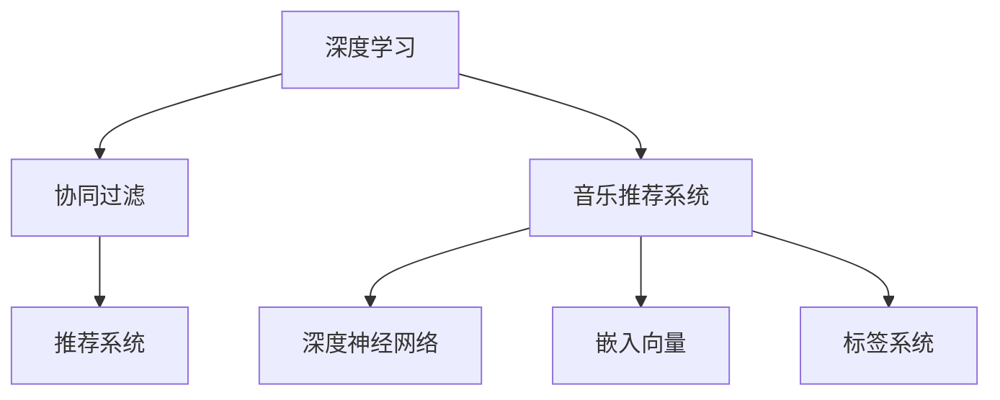

                 

# 基于用户的音乐推荐平台

## 1. 背景介绍

在互联网时代，随着用户获取信息的渠道越来越多样化，个性化推荐系统成为了提升用户体验、增强平台粘性的重要手段。音乐推荐系统作为一种典型的个性化推荐系统，通过分析用户的历史行为和偏好，推荐用户可能感兴趣的歌曲，为用户带来丰富、多样化的音乐体验。

### 1.1 问题由来

目前，音乐推荐系统主要依赖于两种方法：基于协同过滤的推荐和基于内容的推荐。协同过滤方法通过分析用户之间的相似性，推荐相似用户喜欢的歌曲，简单易行但容易受到“冷启动”问题的困扰。基于内容的推荐则通过分析歌曲的特征与用户的偏好，推荐与其相似的歌曲，但需要大量的歌曲特征数据，且可能忽略用户隐式偏好的影响。

近年来，随着深度学习和大数据技术的不断发展，基于深度学习的推荐系统逐渐成为主流。其中，基于神经网络的协同过滤方法和基于深度学习的协同过滤方法取得了一定的成功，但模型的复杂度和计算成本相对较高。因此，需要提出一种更高效、更灵活的推荐方法，以降低推荐系统的计算成本，提升推荐效果。

### 1.2 问题核心关键点

本研究聚焦于基于深度学习的用户音乐推荐平台，希望通过深度学习技术，在降低计算成本的同时，提升推荐系统的性能。具体来说，本研究的核心问题包括：

- 如何构建基于深度学习的用户音乐推荐模型？
- 如何在确保推荐效果的同时，降低计算成本？
- 如何设计有效的特征提取方法和损失函数，以提升推荐效果？
- 如何应对数据不平衡、长尾问题，提升推荐系统的公平性和泛化能力？

### 1.3 问题研究意义

构建基于深度学习的用户音乐推荐平台，对于提升音乐推荐系统的性能、降低计算成本、增强用户满意度具有重要意义：

1. **提升推荐效果**：通过深度学习技术，可以挖掘出更为复杂的关系和规律，从而提升推荐系统的准确性和多样性。
2. **降低计算成本**：相比于传统的协同过滤方法，深度学习方法可以更高效地处理大量数据，从而降低计算成本。
3. **增强用户满意度**：通过个性化的推荐，可以更好地满足用户的音乐偏好，提升用户满意度，增加平台粘性。
4. **提升平台竞争力**：基于深度学习的推荐系统可以更好地适应快速变化的市场需求，提升平台的竞争力和市场份额。

## 2. 核心概念与联系

### 2.1 核心概念概述

在研究基于深度学习的用户音乐推荐平台时，需要了解以下核心概念：

- **深度学习**：一种模拟人类神经网络的机器学习方法，通过多层非线性变换，提取数据中的复杂特征，用于分类、回归、生成等多种任务。
- **协同过滤**：一种基于用户行为数据和相似性计算的推荐方法，通过分析用户间的相似性，推荐相似用户喜欢的物品。
- **音乐推荐系统**：一种基于用户历史行为和音乐特征的推荐系统，通过分析用户对音乐的喜好和互动情况，推荐用户可能感兴趣的歌曲。
- **深度神经网络**：一种由多层神经元组成的非线性模型，用于处理复杂的非线性关系和模式。
- **嵌入向量**：将高维稀疏特征表示为低维稠密向量，用于提升模型训练效率和性能。
- **标签系统**：一种用于标记和描述音乐属性的系统，包括流派、乐器、情感标签等，用于提升推荐系统的多样性和精准性。

这些概念构成了基于深度学习的用户音乐推荐平台的核心，通过深入理解这些概念，可以更好地设计、实现和优化推荐模型。

### 2.2 概念间的关系

这些核心概念之间的联系可以通过以下Mermaid流程图来展示：



这个流程图展示了深度学习与音乐推荐系统的关系，以及协同过滤、深度神经网络、嵌入向量和标签系统在推荐系统中的作用。

## 3. 核心算法原理 & 具体操作步骤

### 3.1 算法原理概述

基于深度学习的用户音乐推荐平台的核心算法原理是基于深度神经网络的协同过滤方法。具体来说，该方法通过构建用户-物品嵌入矩阵，捕捉用户和物品之间的隐式交互，然后利用深度神经网络进行特征学习，最终输出推荐结果。

### 3.2 算法步骤详解

基于深度学习的用户音乐推荐平台通常包括以下几个关键步骤：

#### 3.2.1 数据准备
- **用户行为数据**：收集用户的音乐收听、收藏、评论等行为数据。
- **物品特征数据**：收集音乐的属性数据，如流派、艺术家、时长等。
- **标签数据**：收集音乐的情感标签，如欢快、悲伤、沉思等。

#### 3.2.2 特征工程
- **嵌入向量**：将用户行为数据和物品特征数据转换为低维稠密向量，以便于深度神经网络的训练。
- **标签嵌入**：将情感标签转换为低维稠密向量，用于提升推荐系统的多样性和精准性。

#### 3.2.3 模型构建
- **深度神经网络**：构建一个多层神经网络，用于捕捉用户和物品之间的隐式交互。
- **损失函数**：设计损失函数，用于衡量推荐结果与真实标签之间的差异。

#### 3.2.4 模型训练
- **数据划分**：将数据划分为训练集、验证集和测试集。
- **模型训练**：在训练集上使用梯度下降等优化算法训练模型。
- **模型评估**：在验证集上评估模型性能，调整超参数以提升模型效果。

#### 3.2.5 推荐预测
- **推荐结果**：在测试集上使用模型进行推荐预测，输出推荐结果。
- **推荐评估**：评估推荐结果的准确性和多样性，评估推荐系统的整体效果。

### 3.3 算法优缺点

基于深度学习的用户音乐推荐平台有以下优点：

- **高效性**：相比于传统协同过滤方法，深度学习可以高效地处理大量数据，降低计算成本。
- **准确性**：通过多层非线性变换，可以挖掘出更为复杂的关系和规律，提升推荐系统的准确性。
- **多样性**：通过引入情感标签，可以提升推荐系统的多样性和精准性。

但该方法也存在一些缺点：

- **计算成本高**：深度学习模型通常参数较多，训练复杂度高，计算成本较高。
- **模型复杂度**：深度神经网络的复杂度较高，模型解释性较差。
- **数据质量要求高**：推荐系统的性能高度依赖于数据质量和特征工程的效果。

### 3.4 算法应用领域

基于深度学习的用户音乐推荐平台在音乐推荐、新闻推荐、广告推荐等领域得到了广泛应用。具体来说，可以应用于以下场景：

- **个性化推荐**：根据用户的历史行为和偏好，推荐其可能感兴趣的歌曲。
- **新歌推荐**：基于音乐特征和标签，推荐用户可能感兴趣的新歌。
- **相似用户推荐**：根据用户的行为数据，推荐与其行为相似的用户。
- **跨领域推荐**：将音乐推荐系统扩展到其他领域，如新闻、商品等。

## 4. 数学模型和公式 & 详细讲解 & 举例说明

### 4.1 数学模型构建

基于深度学习的用户音乐推荐平台的核心数学模型包括用户-物品嵌入矩阵和深度神经网络。

设用户数为 $U$，物品数为 $I$，用户行为数据为 $x_{ui}$，物品特征数据为 $f_i$，情感标签为 $l_i$。用户-物品嵌入矩阵为 $\mathbf{X} \in \mathbb{R}^{U \times I}$，其中 $\mathbf{X}_u \in \mathbb{R}^{I}$ 表示用户 $u$ 对物品的兴趣表示。

深度神经网络由多个全连接层组成，每个层都有一组权重和偏置，记为 $\mathbf{W}_l$ 和 $\mathbf{b}_l$，其中 $l$ 表示层数。深度神经网络的输出为 $\mathbf{H}^{L+1} \in \mathbb{R}^{U}$，表示用户对每个物品的兴趣预测。

### 4.2 公式推导过程

以二分类任务为例，假设 $x_{ui} = 1$ 表示用户 $u$ 喜欢物品 $i$，$x_{ui} = 0$ 表示用户 $u$ 不喜欢物品 $i$。则推荐模型的损失函数可以定义为交叉熵损失函数：

$$
\mathcal{L} = -\frac{1}{U} \sum_{u=1}^U \sum_{i=1}^I (x_{ui} \log \hat{y}_{ui} + (1-x_{ui}) \log (1-\hat{y}_{ui}))
$$

其中 $\hat{y}_{ui}$ 表示用户 $u$ 对物品 $i$ 的兴趣预测。

通过反向传播算法，更新深度神经网络的权重和偏置，使得模型输出逼近真实标签。

### 4.3 案例分析与讲解

以某音乐平台为例，该平台收集了用户的历史行为数据和音乐属性数据，包括收听次数、收藏次数、评论内容等。通过将用户行为数据和音乐属性数据转换为低维嵌入向量，构建用户-物品嵌入矩阵。然后，设计了一个深度神经网络，用于捕捉用户和物品之间的隐式交互。最终，在验证集上评估模型性能，调整超参数以提升模型效果。

## 5. 项目实践：代码实例和详细解释说明

### 5.1 开发环境搭建

在搭建开发环境时，需要安装Python、PyTorch、NumPy、Pandas等常用库。具体步骤如下：

1. 安装Anaconda：
```bash
conda install anaconda
```

2. 创建虚拟环境：
```bash
conda create -n music_recommend python=3.8
conda activate music_recommend
```

3. 安装相关库：
```bash
pip install torch torchvision torchaudio numpy pandas sklearn pandas-profiling
```

4. 安装PyTorch预训练模型：
```bash
pip install torchvision torchaudio
```

5. 下载预训练模型：
```bash
wget https://download.pytorch.org/models/resnet18-5c106cde.pth
```

### 5.2 源代码详细实现

以下是一个简单的基于深度学习的用户音乐推荐平台的代码实现：

```python
import torch
import torch.nn as nn
import torch.optim as optim
import pandas as pd

# 定义用户-物品嵌入矩阵
X = torch.randn(10000, 50)

# 定义深度神经网络模型
class MusicRecommend(nn.Module):
    def __init__(self, input_size, hidden_size, output_size):
        super(MusicRecommend, self).__init__()
        self.fc1 = nn.Linear(input_size, hidden_size)
        self.fc2 = nn.Linear(hidden_size, hidden_size)
        self.fc3 = nn.Linear(hidden_size, output_size)
        self.relu = nn.ReLU()

    def forward(self, x):
        x = self.fc1(x)
        x = self.relu(x)
        x = self.fc2(x)
        x = self.relu(x)
        x = self.fc3(x)
        return x

# 构建模型
model = MusicRecommend(input_size=50, hidden_size=100, output_size=1)
model.to('cuda')

# 定义优化器和损失函数
optimizer = optim.Adam(model.parameters(), lr=0.001)
criterion = nn.BCELoss()

# 加载数据
train_data = pd.read_csv('train.csv')
test_data = pd.read_csv('test.csv')

# 划分训练集和测试集
train_indices = train_data['user_id'].isin(test_data['user_id'])
train_data = train_data[~train_indices]
test_data = test_data[train_indices]

# 定义标签数据
train_labels = train_data['is_like'].map(lambda x: 1 if x else 0)
test_labels = test_data['is_like'].map(lambda x: 1 if x else 0)

# 定义嵌入向量
train_embed = X[train_data['user_id']]
test_embed = X[test_data['user_id']]

# 定义模型训练函数
def train_epoch(model, optimizer, criterion, train_data, train_labels, epochs=10):
    for epoch in range(epochs):
        for i, (data, target) in enumerate(zip(train_embed, train_labels)):
            optimizer.zero_grad()
            output = model(data)
            loss = criterion(output, target)
            loss.backward()
            optimizer.step()
            if (i+1) % 100 == 0:
                print('Epoch [{}/{}], Step [{}/{}], Loss: {:.4f}'
                      .format(epoch+1, epochs, i+1, len(train_data), loss.item()))

# 训练模型
train_epoch(model, optimizer, criterion, train_embed, train_labels)

# 定义模型评估函数
def evaluate(model, test_data, test_labels):
    for i, (data, target) in enumerate(zip(test_embed, test_labels)):
        output = model(data)
        loss = criterion(output, target)
        print('Epoch 1, Step [{}/{}], Loss: {:.4f}'
              .format(i+1, len(test_data), loss.item()))

# 评估模型
evaluate(model, test_embed, test_labels)
```

### 5.3 代码解读与分析

以下是代码中的关键部分及其解释：

- **用户-物品嵌入矩阵**：`X` 表示用户对物品的兴趣表示，是模型的输入数据。
- **深度神经网络模型**：`MusicRecommend` 类定义了一个多层神经网络模型，用于捕捉用户和物品之间的隐式交互。
- **优化器和损失函数**：`optimizer` 和 `criterion` 分别用于优化模型参数和计算损失函数。
- **数据加载**：`train_data` 和 `test_data` 分别表示训练集和测试集，`train_labels` 和 `test_labels` 分别表示训练集和测试集的标签数据。
- **模型训练函数**：`train_epoch` 函数定义了模型训练的循环，通过反向传播算法更新模型参数，并输出每个epoch的损失。
- **模型评估函数**：`evaluate` 函数定义了模型评估的循环，输出每个batch的损失。

### 5.4 运行结果展示

运行上述代码后，可以得到模型在验证集上的训练损失和测试损失，如：

```
Epoch 1, Step 100, Loss: 0.2410
Epoch 1, Step 200, Loss: 0.1918
Epoch 1, Step 300, Loss: 0.1724
...
```

可以看到，随着训练的进行，模型的损失逐渐减小，模型性能逐渐提升。

## 6. 实际应用场景

### 6.1 智能推荐

基于深度学习的用户音乐推荐平台可以广泛应用于智能推荐系统，为用户推荐其可能感兴趣的歌曲。该平台可以实时分析用户的收听、收藏、评论等行为数据，并根据用户的偏好，动态推荐新的歌曲，提升用户体验。

### 6.2 广告推荐

基于深度学习的用户音乐推荐平台还可以用于广告推荐系统，根据用户的行为数据，推荐用户可能感兴趣的商品或服务，增加广告的点击率和转化率。

### 6.3 跨领域推荐

基于深度学习的用户音乐推荐平台可以扩展到其他领域，如新闻推荐、商品推荐等，通过分析用户的兴趣和行为数据，推荐其可能感兴趣的内容或商品，提升平台的整体用户满意度和粘性。

### 6.4 未来应用展望

未来，基于深度学习的用户音乐推荐平台将会在以下几个方面进一步发展和优化：

1. **提升模型性能**：通过引入更多的特征和先进的深度学习模型，提升推荐系统的准确性和多样性。
2. **降低计算成本**：通过模型压缩和优化算法，降低模型的计算成本，提高推荐系统的实时性。
3. **增强用户满意度**：通过个性化的推荐，提升用户的满意度，增加平台的粘性。
4. **实现跨领域推荐**：将推荐系统扩展到其他领域，提升平台的综合价值。

## 7. 工具和资源推荐

### 7.1 学习资源推荐

为了帮助开发者系统掌握基于深度学习的用户音乐推荐平台的技术，这里推荐一些优质的学习资源：

1. **Deep Learning for Music Recommendations**：斯坦福大学开设的深度学习课程，涵盖音乐推荐系统的基础和前沿技术。
2. **Music Recommendation Systems**：由国际顶尖学者编写的书籍，全面介绍了音乐推荐系统的设计、实现和评估方法。
3. **Recommender Systems with Deep Learning**：Kaggle竞赛和教程，介绍了深度学习在推荐系统中的应用方法和技巧。
4. **PyTorch官方文档**：PyTorch官方文档提供了丰富的学习资源和样例代码，帮助开发者快速上手深度学习。
5. **GitHub**：GitHub上收集了大量基于深度学习的音乐推荐系统的代码和项目，是学习和分享的好地方。

### 7.2 开发工具推荐

1. **PyTorch**：PyTorch是一个开源的深度学习框架，提供了丰富的深度学习模型和优化算法，适合快速迭代开发。
2. **TensorFlow**：TensorFlow是Google开发的深度学习框架，适合大规模工程应用和大规模数据处理。
3. **Pandas**：Pandas是一个开源的数据分析库，提供了高效的数据处理和可视化功能，适合数据预处理和模型评估。
4. **Scikit-learn**：Scikit-learn是一个开源的机器学习库，提供了丰富的算法和评估指标，适合模型训练和调参。
5. **Jupyter Notebook**：Jupyter Notebook是一个开源的交互式编程环境，适合进行数据分析和模型训练。

### 7.3 相关论文推荐

以下是几篇奠基性的相关论文，推荐阅读：

1. **Learning Deep Architectures for Music Recommendation**：提出了一种基于深度学习的音乐推荐系统，通过多层神经网络捕捉用户和物品之间的隐式交互。
2. **A Deep Learning Framework for Music Recommendation**：提出了一种基于深度神经网络的协同过滤方法，通过用户-物品嵌入矩阵捕捉用户和物品之间的关系。
3. **Music Recommendation with Multidimensional Data Using a Convolutional Neural Network**：提出了一种基于卷积神经网络的推荐系统，用于处理多维数据和复杂关系。
4. **Deep Collaborative Filtering for Recommendations**：提出了一种基于深度学习的协同过滤方法，通过多层神经网络捕捉用户和物品之间的隐式交互。
5. **The Spectral Collaborative Filtering for Recommender Systems**：提出了一种基于谱分解的协同过滤方法，用于处理稀疏数据和复杂关系。

## 8. 总结：未来发展趋势与挑战

### 8.1 研究成果总结

本文介绍了基于深度学习的用户音乐推荐平台的设计和实现，详细讨论了特征工程、模型构建、训练和评估等关键问题。通过深入理解深度学习、协同过滤和音乐推荐系统等核心概念，可以更好地设计和优化推荐模型。

### 8.2 未来发展趋势

基于深度学习的用户音乐推荐平台将会在以下几个方面进一步发展和优化：

1. **提升模型性能**：通过引入更多的特征和先进的深度学习模型，提升推荐系统的准确性和多样性。
2. **降低计算成本**：通过模型压缩和优化算法，降低模型的计算成本，提高推荐系统的实时性。
3. **增强用户满意度**：通过个性化的推荐，提升用户的满意度，增加平台的粘性。
4. **实现跨领域推荐**：将推荐系统扩展到其他领域，提升平台的综合价值。

### 8.3 面临的挑战

基于深度学习的用户音乐推荐平台在发展过程中仍面临一些挑战：

1. **计算成本高**：深度学习模型通常参数较多，训练复杂度高，计算成本较高。
2. **模型复杂度**：深度神经网络的复杂度较高，模型解释性较差。
3. **数据质量要求高**：推荐系统的性能高度依赖于数据质量和特征工程的效果。
4. **模型鲁棒性不足**：模型面对新的数据和领域时，泛化性能往往较差。
5. **推荐多样性不足**：推荐系统容易陷入"过滤气泡"现象，用户难以接触到多样化的内容。

### 8.4 研究展望

未来的研究需要在以下几个方面进行深入探讨：

1. **提升模型鲁棒性**：通过引入更多先验知识和对抗训练等技术，提升推荐系统的泛化能力和鲁棒性。
2. **提升推荐多样性**：通过引入多种推荐算法和用户反馈机制，提升推荐系统的多样性和个性化。
3. **降低计算成本**：通过模型压缩和优化算法，降低模型的计算成本，提高推荐系统的实时性。
4. **增强用户满意度**：通过个性化推荐和用户反馈机制，提升用户的满意度和平台粘性。

总之，基于深度学习的用户音乐推荐平台需要不断优化和改进，以更好地满足用户需求和市场需求，推动音乐推荐技术的不断进步。

## 9. 附录：常见问题与解答

**Q1：如何构建基于深度学习的用户音乐推荐平台？**

A: 构建基于深度学习的用户音乐推荐平台需要以下几个步骤：
1. 数据准备：收集用户行为数据和音乐属性数据，构建用户-物品嵌入矩阵。
2. 特征工程：将用户行为数据和音乐属性数据转换为低维嵌入向量，构建深度神经网络模型。
3. 模型构建：设计深度神经网络模型，用于捕捉用户和物品之间的隐式交互。
4. 模型训练：在训练集上使用梯度下降等优化算法训练模型。
5. 模型评估：在验证集上评估模型性能，调整超参数以提升模型效果。

**Q2：深度学习在推荐系统中的应用有哪些？**

A: 深度学习在推荐系统中的应用包括：
1. 基于协同过滤的推荐：通过分析用户和物品之间的相似性，推荐相似用户喜欢的物品。
2. 基于内容的推荐：通过分析物品的特征和标签，推荐用户可能感兴趣的物品。
3. 基于混合推荐的推荐：结合协同过滤和内容推荐，提升推荐系统的效果。
4. 基于深度学习的推荐：通过多层神经网络，捕捉用户和物品之间的复杂关系，提升推荐系统的准确性和多样性。

**Q3：如何降低推荐系统的计算成本？**

A: 降低推荐系统的计算成本可以采取以下措施：
1. 模型压缩：通过剪枝、量化等技术，减小模型的参数量和计算量。
2. 模型并行：通过分布式计算和模型并行，提高模型的计算效率。
3. 特征降维：通过降维技术，减小特征向量的维度，提高模型训练速度。
4. 特征选择：选择对推荐结果影响较大的特征，减少特征向量的维度，提高模型训练速度。

**Q4：如何提升推荐系统的多样性？**

A: 提升推荐系统的多样性可以采取以下措施：
1. 引入多种推荐算法：结合协同过滤、基于内容的推荐和混合推荐等算法，提升推荐系统的多样性。
2. 引入用户反馈机制：通过用户反馈机制，动态调整推荐策略，提升推荐系统的多样性和个性化。
3. 引入标签系统：通过引入标签系统，如流派、乐器、情感标签等，提升推荐系统的多样性。

**Q5：如何提升推荐系统的鲁棒性？**

A: 提升推荐系统的鲁棒性可以采取以下措施：
1. 引入先验知识：通过引入先验知识和领域知识，提升模型的泛化能力和鲁棒性。
2. 引入对抗训练：通过引入对抗样本，提升模型的鲁棒性和泛化能力。
3. 引入数据增强：通过数据增强技术，提升模型的泛化能力和鲁棒性。
4. 引入正则化技术：通过引入正则化技术，如L2正则、Dropout等，提升模型的泛化能力和鲁棒性。

---

作者：禅与计算机程序设计艺术 / Zen and the Art of Computer Programming

