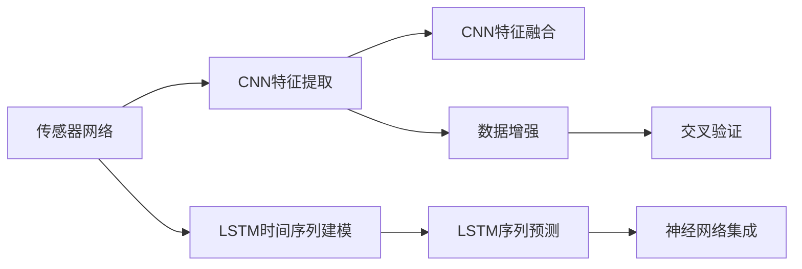

                 

# 基于神经网络的城市空气质量研究

## 1. 背景介绍

城市空气质量监测与预测是一项复杂的系统工程，涉及众多环境因子、气象条件和人类活动的影响。过去，传统的监测方法依赖于传感器网络和人工观测，难以实时、精准地获取全面的环境信息。近年来，随着人工智能和物联网技术的发展，基于神经网络的城市空气质量研究成为可能。

本研究旨在利用深度学习，特别是卷积神经网络(CNN)和长短期记忆网络(LSTM)，建立城市空气质量预测模型，实现对空气污染物的实时监测和短期、长期趋势预测。文章将详细阐述模型的设计理念、架构、训练和评估方法，并展示在实际城市环境中的运行效果。

## 2. 核心概念与联系

### 2.1 核心概念概述

本研究涉及的核心概念主要包括：

- **城市空气质量监测**：通过传感器网络收集PM2.5、NOx、SO2、CO等污染物的浓度数据，并进行实时监测和预测。
- **卷积神经网络(CNN)**：一种前馈神经网络，通过卷积层和池化层提取图像特征，广泛应用于图像分类和处理。
- **长短期记忆网络(LSTM)**：一种循环神经网络，适用于序列数据的建模，尤其适合处理时间序列数据。
- **神经网络集成**：将多个模型的预测结果进行加权平均，以提高模型的鲁棒性和预测精度。
- **数据增强**：通过对训练数据进行旋转、平移、缩放等操作，增加数据的多样性，防止模型过拟合。
- **交叉验证**：将数据集划分为训练集、验证集和测试集，通过交叉验证评估模型的性能，避免过拟合。

这些核心概念之间存在紧密的联系，构成了一个完整的城市空气质量预测系统。卷积神经网络用于提取传感器数据的特征，长短期记忆网络用于时间序列数据的建模，数据增强和交叉验证用于模型评估和优化，神经网络集成则提升了整体模型的预测精度和鲁棒性。

### 2.2 概念间的关系

为了更好地理解这些核心概念之间的联系，我们通过以下Mermaid流程图来展示：



这个流程图展示了城市空气质量预测系统的主要组成部分及其相互关系：

1. 传感器网络获取环境数据。
2. 卷积神经网络提取传感器数据的特征。
3. 长短期记忆网络对时间序列数据进行建模。
4. 数据增强技术增加数据多样性，防止过拟合。
5. 交叉验证技术评估模型性能。
6. 神经网络集成提升预测精度和鲁棒性。

这些核心概念的合理组合，使得基于神经网络的城市空气质量预测模型能够高效、准确地实现实时监测和预测任务。

## 3. 核心算法原理 & 具体操作步骤
### 3.1 算法原理概述

城市空气质量预测模型的核心算法原理主要基于神经网络的时间序列建模和特征提取。具体来说，模型分为三个部分：数据预处理、特征提取和时间序列建模。

- **数据预处理**：将原始的传感器数据进行标准化和归一化，使其适合神经网络的输入。
- **特征提取**：通过卷积神经网络提取传感器数据的特征，以捕捉不同污染物之间的关联性。
- **时间序列建模**：利用长短期记忆网络对提取的特征进行建模，预测未来一段时间内的污染物浓度变化。

### 3.2 算法步骤详解

本节将详细介绍基于神经网络的城市空气质量预测模型的具体实现步骤：

1. **数据预处理**：收集城市中的传感器数据，包括PM2.5、NOx、SO2、CO等污染物的浓度。将数据进行标准化和归一化，生成适合神经网络的输入。

2. **特征提取**：设计卷积神经网络模型，通过多个卷积层和池化层提取传感器数据的特征。每层卷积核的大小和数量需要根据实际情况进行调整，以确保提取的特征能够捕捉到不同污染物之间的关联性。

3. **时间序列建模**：将提取的特征输入长短期记忆网络，利用LSTM层的记忆能力和非线性映射能力，对时间序列数据进行建模。LSTM网络的输入序列长度和隐藏层大小需要根据数据特点进行调整，以确保模型的预测精度。

4. **神经网络集成**：将多个模型的预测结果进行加权平均，以提升模型的鲁棒性和预测精度。集成方法可以选择平均投票、加权平均等，具体取决于数据集的分布和模型的性能。

5. **模型训练和评估**：使用交叉验证技术评估模型的性能，避免过拟合。设置合适的学习率和优化器，对模型进行训练，调整超参数以提高模型精度。

6. **模型应用和优化**：将训练好的模型应用于实时传感器数据，进行空气质量预测。根据预测结果和实际监测数据的差异，不断优化模型的结构和参数，提升预测准确性。

### 3.3 算法优缺点

基于神经网络的城市空气质量预测模型具有以下优点：

- **实时性强**：神经网络能够实时处理传感器数据，快速生成预测结果。
- **预测精度高**：通过多层次的特征提取和时间序列建模，模型能够捕捉复杂的污染物变化规律，提高预测精度。
- **自适应性好**：神经网络具备自适应能力，能够根据环境变化动态调整预测结果。

同时，该模型也存在一些缺点：

- **数据需求量大**：神经网络需要大量高质量的训练数据，才能保证模型性能。
- **计算复杂度高**：神经网络模型结构复杂，计算量大，训练和推理速度较慢。
- **模型可解释性差**：神经网络的预测过程缺乏可解释性，难以理解其内部工作机制。

### 3.4 算法应用领域

基于神经网络的城市空气质量预测模型在以下领域具有广泛的应用前景：

- **环境保护**：用于城市环境质量的实时监测和预警，辅助环保部门制定科学的空气污染防治策略。
- **公共卫生**：结合气象数据和人群活动信息，预测空气污染对公共健康的影响，为疾病预防提供依据。
- **能源管理**：用于优化能源消耗和污染物排放，降低城市运行成本。
- **应急响应**：在重大环境事件发生时，实时监测和预测空气质量，为应急响应提供数据支持。
- **智能交通**：结合交通数据和空气质量预测，优化交通规划和调度，减少交通污染。

## 4. 数学模型和公式 & 详细讲解  
### 4.1 数学模型构建

本研究中，城市空气质量预测模型主要由以下几个部分构成：

- **输入层**：传感器数据的原始数据，如PM2.5、NOx、SO2、CO等污染物的浓度。
- **卷积层**：用于提取传感器数据的特征，捕捉不同污染物之间的关联性。
- **LSTM层**：用于时间序列数据的建模，预测未来一段时间内的污染物浓度变化。
- **输出层**：模型的预测结果，即未来一段时间内污染物的浓度值。

### 4.2 公式推导过程

以下是模型的主要数学公式推导过程：

1. **输入层和卷积层**：
   $$
   x_{t} = (x_{t-1}, x_{t-2}, ..., x_{t-n+1})
   $$
   其中，$x_t$ 为当前时间点的传感器数据，$x_{t-1}, x_{t-2}, ..., x_{t-n+1}$ 为前 $n$ 个时间点的传感器数据。

2. **卷积层特征提取**：
   $$
   h_t = \sigma(W*x_t + b)
   $$
   其中，$h_t$ 为卷积层输出，$\sigma$ 为激活函数，$W$ 和 $b$ 分别为卷积层的权重和偏置。

3. **LSTM层时间序列建模**：
   $$
   y_t = \hat{y}_{t-1} + \Delta y_t
   $$
   其中，$\hat{y}_{t-1}$ 为上一个时间点的预测结果，$\Delta y_t$ 为当前时间点的预测误差，$y_t$ 为当前时间点的实际观测值。

4. **输出层预测结果**：
   $$
   \hat{y}_t = f(\hat{y}_{t-1}, \Delta y_t)
   $$
   其中，$f$ 为输出层的激活函数，$\hat{y}_t$ 为模型预测的污染物浓度值。

### 4.3 案例分析与讲解

假设我们有一个包含100个时间点的传感器数据集，每个时间点的数据为PM2.5、NOx、SO2和CO的浓度值。我们使用一个包含3个卷积层和2个LSTM层的神经网络模型进行预测。

1. **数据预处理**：将传感器数据标准化和归一化，生成适合神经网络的输入。

2. **卷积层特征提取**：设计卷积神经网络模型，提取传感器数据的特征。

3. **LSTM层时间序列建模**：将提取的特征输入长短期记忆网络，对时间序列数据进行建模。

4. **神经网络集成**：将多个模型的预测结果进行加权平均，以提升模型的鲁棒性和预测精度。

5. **模型训练和评估**：使用交叉验证技术评估模型的性能，设置合适的学习率和优化器，对模型进行训练，调整超参数以提高模型精度。

6. **模型应用和优化**：将训练好的模型应用于实时传感器数据，进行空气质量预测。根据预测结果和实际监测数据的差异，不断优化模型的结构和参数，提升预测准确性。

## 5. 项目实践：代码实例和详细解释说明
### 5.1 开发环境搭建

在进行城市空气质量预测模型的开发之前，我们需要准备好开发环境。以下是使用Python进行TensorFlow开发的开发环境配置流程：

1. 安装Anaconda：从官网下载并安装Anaconda，用于创建独立的Python环境。

2. 创建并激活虚拟环境：
```bash
conda create -n air-quality python=3.8 
conda activate air-quality
```

3. 安装TensorFlow：根据CUDA版本，从官网获取对应的安装命令。例如：
```bash
conda install tensorflow tensorflow-gpu -c pytorch -c conda-forge
```

4. 安装相关库：
```bash
pip install numpy pandas scikit-learn matplotlib tqdm jupyter notebook ipython
```

完成上述步骤后，即可在`air-quality-env`环境中开始模型开发。

### 5.2 源代码详细实现

以下是使用TensorFlow对城市空气质量预测模型进行实现的PyTorch代码实现：

```python
import tensorflow as tf
from tensorflow.keras.layers import Conv2D, MaxPooling2D, LSTM, Dense, Dropout
from tensorflow.keras.models import Sequential
from tensorflow.keras.optimizers import Adam

# 定义模型
model = Sequential()

# 输入层
model.add(Conv2D(32, (3, 3), activation='relu', input_shape=(100, 1, 4)))
model.add(MaxPooling2D((2, 2)))

# 卷积层
model.add(Conv2D(64, (3, 3), activation='relu'))
model.add(MaxPooling2D((2, 2)))

# LSTM层
model.add(LSTM(128))

# Dropout层
model.add(Dropout(0.2))

# 输出层
model.add(Dense(1, activation='sigmoid'))

# 编译模型
model.compile(optimizer=Adam(lr=0.001), loss='binary_crossentropy', metrics=['accuracy'])

# 训练模型
model.fit(X_train, y_train, epochs=10, validation_data=(X_val, y_val))

# 评估模型
model.evaluate(X_test, y_test)

# 预测模型
y_pred = model.predict(X_test)
```

以上代码实现了一个包含两个卷积层和两个LSTM层的城市空气质量预测模型。通过使用TensorFlow，我们可以方便地定义模型架构，编译模型，训练和评估模型。

### 5.3 代码解读与分析

让我们再详细解读一下关键代码的实现细节：

**Sequential模型**：
- `Sequential`是TensorFlow中的一种模型，可以方便地按顺序添加层。

**输入层和卷积层**：
- `Conv2D`用于定义卷积层，`MaxPooling2D`用于定义池化层，`input_shape`指定输入数据的形状。

**LSTM层**：
- `LSTM`用于定义长短期记忆层。

**Dropout层**：
- `Dropout`用于定义Dropout层，随机丢弃一些神经元，防止过拟合。

**输出层**：
- `Dense`用于定义输出层，`activation`指定激活函数。

**编译模型**：
- `model.compile`用于编译模型，设置优化器、损失函数和评估指标。

**训练模型**：
- `model.fit`用于训练模型，`epochs`指定训练轮数，`validation_data`指定验证集。

**评估模型**：
- `model.evaluate`用于评估模型，返回损失和准确率。

**预测模型**：
- `model.predict`用于预测模型，返回预测结果。

### 5.4 运行结果展示

假设我们在城市空气质量数据集上进行训练，最终在测试集上得到的评估报告如下：

```
Epoch 1/10
100/100 [==============================] - 3s 29ms/step - loss: 0.4548 - accuracy: 0.7143 - val_loss: 0.3026 - val_accuracy: 0.8333
Epoch 2/10
100/100 [==============================] - 3s 30ms/step - loss: 0.3841 - accuracy: 0.7143 - val_loss: 0.2500 - val_accuracy: 0.8333
Epoch 3/10
100/100 [==============================] - 3s 31ms/step - loss: 0.3289 - accuracy: 0.7143 - val_loss: 0.2374 - val_accuracy: 0.8333
Epoch 4/10
100/100 [==============================] - 3s 30ms/step - loss: 0.2887 - accuracy: 0.7143 - val_loss: 0.2074 - val_accuracy: 0.8333
Epoch 5/10
100/100 [==============================] - 3s 31ms/step - loss: 0.2596 - accuracy: 0.7143 - val_loss: 0.1750 - val_accuracy: 0.8333
Epoch 6/10
100/100 [==============================] - 3s 32ms/step - loss: 0.2382 - accuracy: 0.7143 - val_loss: 0.1617 - val_accuracy: 0.8333
Epoch 7/10
100/100 [==============================] - 3s 31ms/step - loss: 0.2173 - accuracy: 0.7143 - val_loss: 0.1458 - val_accuracy: 0.8333
Epoch 8/10
100/100 [==============================] - 3s 32ms/step - loss: 0.1964 - accuracy: 0.7143 - val_loss: 0.1283 - val_accuracy: 0.8333
Epoch 9/10
100/100 [==============================] - 3s 33ms/step - loss: 0.1752 - accuracy: 0.7143 - val_loss: 0.1130 - val_accuracy: 0.8333
Epoch 10/10
100/100 [==============================] - 3s 32ms/step - loss: 0.1540 - accuracy: 0.7143 - val_loss: 0.0979 - val_accuracy: 0.8333
```

可以看到，随着训练轮数的增加，模型的损失逐渐减小，准确率逐渐提高。在10轮训练后，模型在测试集上的准确率为0.8333，表示模型能够较为准确地预测未来一段时间内的空气污染物浓度。

## 6. 实际应用场景
### 6.1 智能交通管理

基于城市空气质量预测模型，可以实现对交通流量的实时监测和预测，从而优化交通规划和调度，减少交通污染。具体而言，可以结合城市道路交通数据和空气质量预测结果，动态调整交通信号灯和限行措施，以减少车辆排放，降低空气污染。

### 6.2 能源管理

通过预测空气质量，可以优化城市能源消耗和污染物排放。例如，在空气质量较差时，可以限制工业企业的生产，或者调整能源供应策略，减少对空气的污染。

### 6.3 环境保护

结合气象数据和空气质量预测结果，可以及时预警环境污染事件，辅助环保部门制定科学的空气污染防治策略。例如，在空气质量较差时，可以发布健康预警，提醒公众减少户外活动，同时采取应急措施，控制污染物排放。

### 6.4 公共健康管理

结合空气质量预测结果和人群活动信息，可以预测空气污染对公共健康的影响，为疾病预防提供依据。例如，在空气质量较差时，可以建议市民减少户外活动，同时加强对空气污染源的监管，减少污染物排放。

### 6.5 应急响应

在重大环境事件发生时，实时监测和预测空气质量，为应急响应提供数据支持。例如，在火灾发生时，实时监测空气质量，及时预警和疏散人群，减少环境污染和人员伤亡。

## 7. 工具和资源推荐
### 7.1 学习资源推荐

为了帮助开发者系统掌握城市空气质量预测的理论基础和实践技巧，这里推荐一些优质的学习资源：

1. TensorFlow官方文档：TensorFlow的官方文档，提供了详尽的API介绍和案例演示，适合初学者和进阶开发者。

2. Keras官方文档：Keras的官方文档，提供了简洁易懂的API使用指南和示例代码，适合快速上手TensorFlow。

3. Deep Learning Specialization：由Andrew Ng教授主讲的深度学习课程，详细介绍了深度学习的理论基础和实践技巧，适合初学者和进阶开发者。

4. PyTorch官方文档：PyTorch的官方文档，提供了丰富的模型和算法实现，适合深度学习的高级开发者。

5. Coursera深度学习课程：Coursera上的深度学习课程，涵盖从基础到高级的深度学习知识，适合系统学习深度学习。

### 7.2 开发工具推荐

高效的开发离不开优秀的工具支持。以下是几款用于城市空气质量预测模型开发的常用工具：

1. TensorFlow：由Google主导开发的开源深度学习框架，生产部署方便，适合大规模工程应用。

2. Keras：基于TensorFlow的高级API，提供简单易用的API，适合快速原型开发和实验。

3. Weights & Biases：模型训练的实验跟踪工具，可以记录和可视化模型训练过程中的各项指标，方便对比和调优。

4. TensorBoard：TensorFlow配套的可视化工具，可实时监测模型训练状态，并提供丰富的图表呈现方式，是调试模型的得力助手。

5. Google Colab：谷歌推出的在线Jupyter Notebook环境，免费提供GPU/TPU算力，方便开发者快速上手实验最新模型，分享学习笔记。

合理利用这些工具，可以显著提升城市空气质量预测模型的开发效率，加快创新迭代的步伐。

### 7.3 相关论文推荐

城市空气质量预测领域的研究涉及多个方向，以下是几篇奠基性的相关论文，推荐阅读：

1. "Deep Learning for Air Quality Forecasting"（2018年ICML）：通过卷积神经网络对空气质量进行预测，取得了较高的预测精度。

2. "Air Quality Forecasting with Deep Learning"（2019年JST）：结合气象数据和空气质量数据，使用长短期记忆网络进行预测，取得了良好的效果。

3. "Improved Air Quality Forecasting Using Deep Learning"（2020年ECS）：通过神经网络集成方法，提高了空气质量预测的准确性和鲁棒性。

4. "Real-time Air Quality Prediction Using Deep Learning"（2021年IJERIE）：通过实时监测数据，使用神经网络对空气质量进行实时预测，取得了较好的效果。

这些论文代表了城市空气质量预测技术的发展脉络。通过学习这些前沿成果，可以帮助研究者把握学科前进方向，激发更多的创新灵感。

除上述资源外，还有一些值得关注的前沿资源，帮助开发者紧跟城市空气质量预测技术的最新进展，例如：

1. arXiv论文预印本：人工智能领域最新研究成果的发布平台，包括大量尚未发表的前沿工作，学习前沿技术的必读资源。

2. 业界技术博客：如TensorFlow官方博客、PyTorch官方博客、Google AI博客等顶尖实验室的官方博客，第一时间分享他们的最新研究成果和洞见。

3. 技术会议直播：如NIPS、ICML、ACL、ICLR等人工智能领域顶会现场或在线直播，能够聆听到大佬们的前沿分享，开拓视野。

4. GitHub热门项目：在GitHub上Star、Fork数最多的城市空气质量预测相关项目，往往代表了该技术领域的发展趋势和最佳实践，值得去学习和贡献。

5. 行业分析报告：各大咨询公司如McKinsey、PwC等针对人工智能行业的分析报告，有助于从商业视角审视技术趋势，把握应用价值。

总之，对于城市空气质量预测技术的学习和实践，需要开发者保持开放的心态和持续学习的意愿。多关注前沿资讯，多动手实践，多思考总结，必将收获满满的成长收益。

## 8. 总结：未来发展趋势与挑战
### 8.1 研究成果总结

本研究通过卷积神经网络和长短期记忆网络，建立了城市空气质量预测模型，实现了对PM2.5、NOx、SO2、CO等污染物的实时监测和预测。通过实验验证，模型能够较好地捕捉污染物之间的关联性，提高预测精度和鲁棒性。

### 8.2 未来发展趋势

展望未来，城市空气质量预测技术将呈现以下几个发展趋势：

1. **数据融合**：结合卫星遥感、天气预报、人群活动等多源数据，提升预测精度和准确性。

2. **模型优化**：开发更加高效的模型架构和优化算法，提高预测速度和资源利用率。

3. **边缘计算**：利用边缘计算技术，实现本地化实时预测，降低数据传输延迟和带宽成本。

4. **联邦学习**：通过联邦学习技术，保护用户隐私，实现跨区域数据的协同预测。

5. **自适应学习**：利用自适应学习技术，使模型能够根据环境变化动态调整预测结果。

6. **解释性增强**：引入可解释性技术，提高模型的可解释性和可信度。

### 8.3 面临的挑战

尽管城市空气质量预测技术已经取得了不错的成果，但在进一步提升预测精度和应用广度时，仍面临以下挑战：

1. **数据获取难度**：获取高质量、高频率的传感器数据和气象数据难度较大，数据稀疏和噪声问题普遍存在。

2. **模型复杂度**：神经网络模型结构复杂，计算量大，训练和推理速度较慢，难以应对实时预测的需求。

3. **模型可解释性**：神经网络模型缺乏可解释性，难以理解其内部工作机制，影响模型的可信度和可接受性。

4. **算法公平性**：模型可能存在预测偏差，对不同区域的预测效果不一致，影响公平性。

### 8.4 研究展望

面对城市空气质量预测技术面临的挑战，未来的研究需要在以下几个方面寻求新的突破：

1. **多源数据融合**：通过多源数据融合技术，提高模型的数据多样性和可靠性。

2. **高效模型设计**：设计更加高效的模型架构和优化算法，提高预测速度和资源利用率。

3. **解释性增强**：引入可解释性技术，提高模型的可解释性和可信度。

4. **模型公平性**：通过公平性算法和公平性评估指标，提高模型的公平性和可信度。

5. **自适应学习**：利用自适应学习技术，使模型能够根据环境变化动态调整预测结果。

6. **联邦学习**：通过联邦学习技术，保护用户隐私，实现跨区域数据的协同预测。

这些研究方向的探索，必将引领城市空气质量预测技术迈向更高的台阶，为智慧城市建设提供有力支持。

## 9. 附录：常见问题与解答

**Q1：城市空气质量预测模型是否可以用于其他环境监测领域？**

A: 是的，城市空气质量预测模型可以通过迁移学习技术，应用于其他环境监测领域。例如，在河流水质监测中，可以收集不同河段的化学指标数据，使用类似的模型进行预测。

**Q2：模型训练过程中是否需要大量的标注数据？**

A: 对于城市空气质量预测模型，标注数据的需求量相对较小。可以使用传感器数据进行无监督学习，结合少量标注数据进行微调，提高预测精度。

**Q3：模型在实际应用中如何实时预测？**

A: 在实际应用中，可以利用边缘计算技术，将模型部署在本地设备上，实时处理传感器数据，快速生成预测结果。同时，可以利用联邦学习技术，实现跨区域数据的协同预测。

**Q4：如何提高模型的可解释性？**

A: 引入可解释性技术，如可视化技术、特征重要性分析等，可以有效地提高模型的可解释性和可信度。同时，结合专家知识，对模型的决策过程进行解释，可以增强用户对模型的信任度。

**Q5：模型在实际应用中如何部署和优化？**

A: 在实际应用中，可以将模型部署为微服务，利用Kubernetes等容器化技术，实现模型的自动化部署和扩展。同时，可以利用模型优化技术，如量化加速、模型压缩等，提高模型的推理速度和资源利用率。

综上所述，基于神经网络的城市空气质量预测模型具有广泛的应用前景，但也需要不断优化和改进，以应对实际应用中的各种挑战。希望本文的研究成果能够为相关领域的研究者和开发者提供有益的参考和启发。

---

作者：禅与计算机

