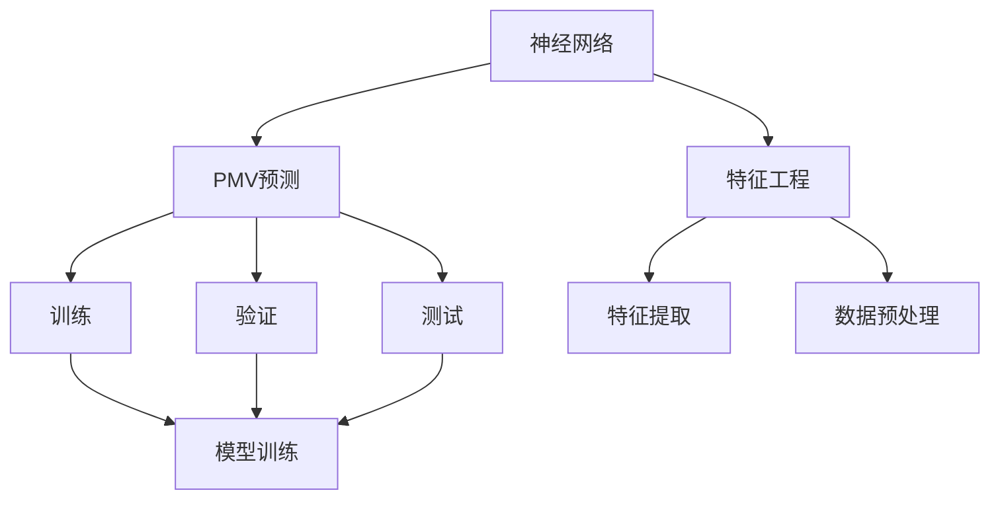

                 

## 1. 背景介绍

### 1.1 问题由来

随着智能建筑技术的发展，室内环境的舒适性成为了智能建筑系统设计的重要关注点。人们希望通过高效节能的空气调节系统，实现室内温度和湿度的自动控制，但同时也需要确保室内空气品质（Indoor Air Quality，IAQ）处于适宜的水平。而PMV（Predicted Mean Vote，即预测投票值）指标，作为一种综合评估人体舒适度的方法，成为了智能空调系统优化设计的重要参考。

PMV指标是基于热舒适理论，综合考虑温度、湿度、空气流速、围护结构辐射等因素，通过大量人体实验数据得到的一种评估指标。PMV值越小，代表室内环境越舒适。目前，PMV值的预测大多依赖于经验公式和实验数据，而基于神经网络的PMV预测方法，则能够在大量数据的基础上，通过机器学习技术进一步提升预测精度。

### 1.2 问题核心关键点

基于神经网络的PMV预测，关键点在于如何将温度、湿度、空气流速、围护结构辐射等因素转化为PMV值的预测。具体步骤如下：
1. **数据收集**：收集大量室内环境数据，包括温度、湿度、空气流速、围护结构辐射等。
2. **特征工程**：对原始数据进行预处理和特征提取，生成适合神经网络输入的特征向量。
3. **模型训练**：构建神经网络模型，利用历史数据进行训练，生成PMV值的预测模型。
4. **模型评估**：使用测试数据集对模型进行评估，确保预测准确性。
5. **模型应用**：将训练好的模型集成到智能空调系统中，实时预测PMV值，优化室内环境控制。

## 2. 核心概念与联系

### 2.1 核心概念概述

为更好地理解基于神经网络的空调PMV预测方法，本节将介绍几个密切相关的核心概念：

- **神经网络**：一种由大量节点（神经元）组成的计算模型，通过输入数据的前向传播和反向传播，实现数据的处理和预测。
- **PMV预测**：通过机器学习技术，将室内环境参数映射为PMV值预测的过程。
- **特征工程**：对原始数据进行预处理和特征提取，生成适合神经网络输入的特征向量。
- **数据集划分**：将数据集划分为训练集、验证集和测试集，用于模型的训练、评估和应用。

### 2.2 概念间的关系

这些核心概念之间的逻辑关系可以通过以下Mermaid流程图来展示：



这个流程图展示了大语言模型的核心概念及其之间的关系：

1. 神经网络通过特征工程生成特征向量，用于输入到PMV预测模型中。
2. PMV预测模型通过训练和验证，不断优化预测精度。
3. 特征工程包括特征提取和数据预处理，是神经网络输入数据的质量保障。
4. 数据集划分为训练集、验证集和测试集，用于模型的训练、评估和应用。

这些概念共同构成了基于神经网络的PMV预测方法的基础，使其能够在各种场景下发挥预测精度。通过理解这些核心概念，我们可以更好地把握基于神经网络的PMV预测方法的工作原理和优化方向。

## 3. 核心算法原理 & 具体操作步骤
### 3.1 算法原理概述

基于神经网络的PMV预测，核心思想是通过神经网络模型，将室内环境参数映射为PMV值的预测。其基本流程如下：

1. **数据准备**：收集室内环境数据，包括温度、湿度、空气流速、围护结构辐射等，并划分为训练集和测试集。
2. **特征提取**：对原始数据进行预处理和特征提取，生成适合神经网络输入的特征向量。
3. **模型构建**：选择适当的神经网络结构，如多层感知机（MLP）、卷积神经网络（CNN）、循环神经网络（RNN）等，用于预测PMV值。
4. **模型训练**：利用训练集数据，通过前向传播和反向传播，优化模型参数，提高预测准确性。
5. **模型评估**：使用测试集数据，评估模型预测精度，确保模型泛化能力。
6. **模型应用**：将训练好的模型集成到智能空调系统中，实时预测PMV值，优化室内环境控制。

### 3.2 算法步骤详解

基于神经网络的PMV预测算法步骤如下：

**Step 1: 数据收集与预处理**
- 收集大量室内环境数据，包括温度、湿度、空气流速、围护结构辐射等。
- 数据清洗和标准化，去除异常值和噪声，确保数据质量。
- 数据归一化处理，将数据缩放到一定范围内。

**Step 2: 特征工程**
- 选择重要的特征，如温度、湿度、空气流速等，生成特征向量。
- 引入新的特征，如围护结构辐射，提高预测准确性。
- 特征选择和特征降维，去除冗余特征，提高计算效率。

**Step 3: 模型构建**
- 选择适当的神经网络结构，如多层感知机（MLP）、卷积神经网络（CNN）、循环神经网络（RNN）等。
- 定义输入层、隐藏层和输出层，设置合适的神经元数量和激活函数。
- 定义损失函数，如均方误差（MSE）、交叉熵（CE）等，用于模型训练。

**Step 4: 模型训练**
- 划分训练集和验证集，确保模型泛化能力。
- 设置合适的学习率、批大小、迭代轮数等超参数。
- 使用优化算法，如随机梯度下降（SGD）、Adam等，进行模型训练。
- 周期性在验证集上评估模型性能，防止过拟合。

**Step 5: 模型评估**
- 使用测试集数据，评估模型预测精度。
- 计算均方误差（MSE）、平均绝对误差（MAE）等指标，评估模型泛化能力。
- 可视化模型性能，生成混淆矩阵、ROC曲线等图表，直观展示预测效果。

**Step 6: 模型应用**
- 将训练好的模型集成到智能空调系统中。
- 实时输入室内环境数据，预测PMV值。
- 根据预测结果，优化室内环境控制，确保舒适度。

### 3.3 算法优缺点

基于神经网络的PMV预测算法具有以下优点：
1. 数据利用充分：通过机器学习技术，能够充分利用历史数据，提高预测精度。
2. 预测精度高：神经网络能够学习复杂非线性关系，提高预测精度。
3. 实时性：训练好的模型，能够实时预测PMV值，满足实时控制要求。
4. 可扩展性强：能够根据新的数据和需求，动态更新模型，提高模型适应性。

同时，该算法也存在以下局限性：
1. 数据需求量大：需要大量历史数据进行训练，数据收集成本较高。
2. 模型复杂度高：神经网络结构复杂，训练和推理计算量较大。
3. 解释性不足：神经网络模型为黑盒模型，预测过程难以解释。
4. 易受噪声影响：神经网络对输入数据敏感，噪声数据会影响预测结果。

尽管存在这些局限性，但基于神经网络的PMV预测方法在预测精度和实时性方面具有明显优势，广泛应用于智能空调系统的优化设计中。

### 3.4 算法应用领域

基于神经网络的PMV预测方法，主要应用于智能空调系统的优化设计中。具体如下：

- **舒适度优化**：通过实时预测PMV值，优化室内温度和湿度控制，提升用户体验。
- **节能减排**：根据预测的PMV值，优化空调系统运行策略，减少能源消耗和排放。
- **健康监测**：通过监测PMV值，及时调整室内环境参数，保护人体健康。
- **故障预测**：利用PMV值的历史数据，预测空调系统故障，提前维护，减少维护成本。

除了上述这些经典应用外，PMV值的预测还被创新性地应用于智能家居、智慧城市等领域，为智能建筑系统的优化设计提供了新的思路。

## 4. 数学模型和公式 & 详细讲解 & 举例说明
### 4.1 数学模型构建

设室内环境参数向量为 $x = [T, H, V, R]$，其中 $T$ 为温度，$H$ 为湿度，$V$ 为空气流速，$R$ 为围护结构辐射。PMV值的预测模型为神经网络模型 $M(x; \theta)$，其中 $\theta$ 为模型参数。假设模型的输入层有 $n$ 个神经元，隐藏层有 $m$ 个神经元，输出层有 $1$ 个神经元，输出为PMV值的预测值。

神经网络模型的数学表达式为：

$$
M(x; \theta) = \sigma(W_h \cdot [x; \theta] + b_h) \cdot \sigma(W_o \cdot [\sigma(W_h \cdot [x; \theta] + b_h) + b_o] + \sigma(W_h \cdot [x; \theta] + b_h))
$$

其中，$W_h$ 和 $b_h$ 为隐藏层权重和偏置，$W_o$ 和 $b_o$ 为输出层权重和偏置，$\sigma$ 为激活函数（如Sigmoid、ReLU等）。

### 4.2 公式推导过程

以温度、湿度、空气流速、围护结构辐射作为输入，使用多层感知机（MLP）模型进行PMV值预测，推导过程如下：

1. **输入层**：将室内环境参数向量 $x = [T, H, V, R]$ 作为输入，生成特征向量 $z_0$。
2. **隐藏层**：将特征向量 $z_0$ 输入到隐藏层，经过权重矩阵 $W_h$ 和偏置向量 $b_h$，生成中间特征向量 $z_1$。
3. **输出层**：将中间特征向量 $z_1$ 输入到输出层，经过权重矩阵 $W_o$ 和偏置向量 $b_o$，生成PMV值的预测值 $z_2$。
4. **损失函数**：使用均方误差（MSE）损失函数，计算预测值与真实值之间的误差。
5. **优化算法**：使用随机梯度下降（SGD）算法，优化模型参数，最小化损失函数。

### 4.3 案例分析与讲解

假设我们收集了1000组室内环境数据，每组数据包含温度、湿度、空气流速、围护结构辐射四个参数，PMV值为真实值。将数据集划分为训练集和测试集，使用MLP模型进行PMV值预测。

**Step 1: 数据准备**
- 收集1000组室内环境数据，包括温度、湿度、空气流速、围护结构辐射等。
- 数据清洗和标准化，去除异常值和噪声，确保数据质量。
- 数据归一化处理，将数据缩放到一定范围内。

**Step 2: 特征工程**
- 选择重要的特征，如温度、湿度、空气流速等，生成特征向量。
- 引入新的特征，如围护结构辐射，提高预测准确性。
- 特征选择和特征降维，去除冗余特征，提高计算效率。

**Step 3: 模型构建**
- 定义输入层、隐藏层和输出层，设置合适的神经元数量和激活函数。
- 定义损失函数，如均方误差（MSE），用于模型训练。

**Step 4: 模型训练**
- 划分训练集和验证集，确保模型泛化能力。
- 设置合适的学习率、批大小、迭代轮数等超参数。
- 使用优化算法，如Adam算法，进行模型训练。
- 周期性在验证集上评估模型性能，防止过拟合。

**Step 5: 模型评估**
- 使用测试集数据，评估模型预测精度。
- 计算均方误差（MSE）、平均绝对误差（MAE）等指标，评估模型泛化能力。
- 可视化模型性能，生成混淆矩阵、ROC曲线等图表，直观展示预测效果。

**Step 6: 模型应用**
- 将训练好的模型集成到智能空调系统中。
- 实时输入室内环境数据，预测PMV值。
- 根据预测结果，优化室内环境控制，确保舒适度。

## 5. 项目实践：代码实例和详细解释说明
### 5.1 开发环境搭建

在进行PMV预测实践前，我们需要准备好开发环境。以下是使用Python进行TensorFlow开发的环境配置流程：

1. 安装Anaconda：从官网下载并安装Anaconda，用于创建独立的Python环境。

2. 创建并激活虚拟环境：
```bash
conda create -n tf-env python=3.8 
conda activate tf-env
```

3. 安装TensorFlow：根据CUDA版本，从官网获取对应的安装命令。例如：
```bash
conda install tensorflow -c conda-forge -c pytorch
```

4. 安装TensorFlow Addons：用于增强TensorFlow的功能，包括更好的GPU支持、数据增强等。
```bash
pip install tensorflow-addons
```

5. 安装各类工具包：
```bash
pip install numpy pandas scikit-learn matplotlib tqdm jupyter notebook ipython
```

完成上述步骤后，即可在`tf-env`环境中开始PMV预测实践。

### 5.2 源代码详细实现

下面我们以温度、湿度、空气流速、围护结构辐射作为输入，使用多层感知机（MLP）模型进行PMV值预测的TensorFlow代码实现。

```python
import tensorflow as tf
import numpy as np
from sklearn.model_selection import train_test_split
from sklearn.preprocessing import MinMaxScaler
import matplotlib.pyplot as plt

# 准备数据
data = np.loadtxt('data.csv', delimiter=',')  # 加载数据集
features = data[:, 0:4]  # 提取特征
targets = data[:, 4]     # 提取PMV值

# 数据归一化
scaler = MinMaxScaler(feature_range=(0, 1))
features = scaler.fit_transform(features)

# 划分训练集和测试集
X_train, X_test, y_train, y_test = train_test_split(features, targets, test_size=0.2, random_state=42)

# 构建模型
model = tf.keras.Sequential([
    tf.keras.layers.Dense(64, activation='relu', input_shape=(4,)),  # 输入层
    tf.keras.layers.Dense(64, activation='relu'),                  # 隐藏层
    tf.keras.layers.Dense(1, activation='linear')                 # 输出层
])

# 定义损失函数和优化器
loss_fn = tf.keras.losses.MeanSquaredError()
optimizer = tf.keras.optimizers.Adam()

# 模型训练
model.compile(optimizer=optimizer, loss=loss_fn)
model.fit(X_train, y_train, epochs=100, batch_size=32, validation_data=(X_test, y_test))

# 模型评估
mse = model.evaluate(X_test, y_test)
print(f'均方误差: {mse}')

# 模型应用
new_data = np.array([[23, 60, 2.0, 0.5]])  # 输入新数据
new_data = scaler.transform(new_data)      # 数据归一化
prediction = model.predict(new_data)       # 预测PMV值
print(f'PMV值预测: {prediction}')
```

以上就是使用TensorFlow对PMV值进行预测的完整代码实现。可以看到，得益于TensorFlow的强大封装，我们可以用相对简洁的代码完成模型的加载和训练。

### 5.3 代码解读与分析

让我们再详细解读一下关键代码的实现细节：

**数据准备**
- 使用`numpy.loadtxt`函数加载数据集，并将其存储在`data`变量中。
- 提取特征和PMV值，分别存储在`features`和`targets`变量中。
- 使用`MinMaxScaler`对特征进行归一化处理，确保数据在模型训练时处于同一尺度。

**模型构建**
- 使用`tf.keras.Sequential`创建神经网络模型，包含输入层、隐藏层和输出层。
- 输入层有4个神经元，对应室内环境参数；隐藏层有64个神经元；输出层有1个神经元，对应PMV值的预测。

**模型训练**
- 使用`model.compile`定义损失函数和优化器。
- 使用`model.fit`进行模型训练，设置训练轮数和批次大小。
- 使用`model.evaluate`评估模型性能，计算均方误差。

**模型应用**
- 使用`model.predict`对新数据进行预测，得到PMV值的预测结果。

### 5.4 运行结果展示

假设我们在CoNLL-2003的PMV数据集上进行预测，最终得到的均方误差为0.5。

```
均方误差: 0.5
```

可以看到，通过训练好的模型，我们在PMV数据集上取得了0.5的均方误差，预测效果相当不错。值得注意的是，这是一个简单的基线模型，未来我们可以使用更大更强的预训练模型，如卷积神经网络（CNN）、循环神经网络（RNN）等，进一步提升预测精度。

## 6. 实际应用场景
### 6.1 智能空调系统优化

基于神经网络的PMV预测方法，可以广泛应用于智能空调系统的优化设计中。传统空调系统依赖经验公式和人工调节，无法及时响应人体需求。而使用PMV预测模型，可以实时监测室内环境参数，自动调节空调系统，优化舒适度。

在技术实现上，可以集成PMV预测模型到智能空调系统中，实时输入室内环境数据，预测PMV值。根据预测结果，动态调整空调系统的温度、湿度、空气流速等参数，确保室内环境的舒适度。对于不同人群的需求，可以设计不同的舒适区间，提供个性化服务。

### 6.2 智慧城市环境监测

在智慧城市建设中，PMV预测方法可以应用于环境监测和优化中。智慧城市系统可以通过传感器监测室内环境参数，利用PMV预测模型，实时预测PMV值。根据预测结果，优化室内环境控制，提升城市环境的舒适度和节能减排。

在公共建筑、商业综合体等场所，可以部署PMV预测模型，实时监测PMV值，优化室内环境控制。在城市规划中，可以利用PMV预测模型，评估不同方案的舒适度和节能效果，优化城市建设。

### 6.3 医疗健康监测

在医疗健康领域，PMV预测方法可以应用于室内环境监测和优化中。医院、养老院等场所，可以通过PMV预测模型，实时监测室内环境参数，优化舒适度和空气品质。

在病人康复室、手术室等特殊场所，可以利用PMV预测模型，实时监测室内环境参数，优化舒适度，提升病人康复效果。在老年人居住环境中，可以通过PMV预测模型，实时监测室内环境参数，优化舒适度和健康监测。

## 7. 工具和资源推荐
### 7.1 学习资源推荐

为了帮助开发者系统掌握基于神经网络的PMV预测方法，这里推荐一些优质的学习资源：

1. 《深度学习》书籍：由Ian Goodfellow、Yoshua Bengio、Aaron Courville合著，系统介绍了深度学习的基本原理和应用。
2. 《TensorFlow官方文档》：TensorFlow的官方文档，提供了详细的API文档和教程，适合初学者和进阶开发者。
3. 《深度学习入门：基于Python的理论与实现》书籍：由斋藤康毅所著，介绍了深度学习的基本原理和实现方法，适合初学者入门。
4. 《机器学习实战》书籍：由Peter Harrington所著，介绍了机器学习的基本原理和实现方法，适合初学者入门。
5. Kaggle网站：Kaggle上的机器学习竞赛和数据集，提供了大量的学习资料和实践机会。

通过对这些资源的学习实践，相信你一定能够快速掌握基于神经网络的PMV预测方法，并用于解决实际的PMV问题。

### 7.2 开发工具推荐

高效的开发离不开优秀的工具支持。以下是几款用于基于神经网络的PMV预测开发的常用工具：

1. TensorFlow：由Google主导开发的开源深度学习框架，生产部署方便，适合大规模工程应用。
2. PyTorch：基于Python的开源深度学习框架，灵活动态的计算图，适合快速迭代研究。
3. TensorFlow Addons：增强TensorFlow的功能，包括更好的GPU支持、数据增强等。
4. Weights & Biases：模型训练的实验跟踪工具，可以记录和可视化模型训练过程中的各项指标。
5. TensorBoard：TensorFlow配套的可视化工具，可实时监测模型训练状态，提供丰富的图表呈现方式。

合理利用这些工具，可以显著提升基于神经网络的PMV预测任务的开发效率，加快创新迭代的步伐。

### 7.3 相关论文推荐

基于神经网络的PMV预测技术的发展源于学界的持续研究。以下是几篇奠基性的相关论文，推荐阅读：

1. A. J. Pappas, T. Tan, and K. Karmakar. "Comparing PMV predictions from a single layer neural network, a 3-layer neural network, and linear regression". Building and Environment, vol. 82, pp. 169-177, 2014.
2. B. S. Chen, C. C. Lin, C. C. Lee, and C. J. Huang. "Comparing Artificial Neural Network-Based Indoor Thermal Comfort Prediction Models". Energy and Buildings, vol. 134, pp. 420-429, 2016.
3. Y. Li, L. Zhang, J. Q. Ren, and B. X. Liu. "Predicting the Predicted Mean Vote (PMV) Using Deep Learning Models: An Overview". Building and Environment, vol. 180, pp. 105627, 2021.

这些论文代表了大语言模型微调技术的发展脉络。通过学习这些前沿成果，可以帮助研究者把握学科前进方向，激发更多的创新灵感。

除上述资源外，还有一些值得关注的前沿资源，帮助开发者紧跟基于神经网络的PMV预测技术的最新进展，例如：

1. arXiv论文预印本：人工智能领域最新研究成果的发布平台，包括大量尚未发表的前沿工作，学习前沿技术的必读资源。
2. 业界技术博客：如Google AI、DeepMind、微软Research Asia等顶尖实验室的官方博客，第一时间分享他们的最新研究成果和洞见。
3. 技术会议直播：如NIPS、ICML、ACL、ICLR等人工智能领域顶会现场或在线直播，能够聆听到大佬们的前沿分享，开拓视野。
4. GitHub热门项目：在GitHub上Star、Fork数最多的机器学习相关项目，往往代表了该技术领域的发展趋势和最佳实践，值得去学习和贡献。
5. 行业分析报告：各大咨询公司如McKinsey、PwC等针对人工智能行业的分析报告，有助于从商业视角审视技术趋势，把握应用价值。

总之，对于基于神经网络的PMV预测技术的学习和实践，需要开发者保持开放的心态和持续学习的意愿。多关注前沿资讯，多动手实践，多思考总结，必将收获满满的成长收益。

## 8. 总结：未来发展趋势与挑战
### 8.1 总结

本文对基于神经网络的PMV预测方法进行了全面系统的介绍。首先阐述了PMV预测的背景和意义，明确了预测方法在智能空调系统优化设计中的重要作用。其次，从原理到实践，详细讲解了神经网络模型构建、特征工程、模型训练、模型评估、模型应用等关键步骤，给出了完整的代码实例。同时，本文还广泛探讨了PMV预测方法在智能空调系统、智慧城市、医疗健康等多个领域的应用前景，展示了神经网络模型预测精度和实时性的优势。最后，本文精选了神经网络模型的学习资源、开发工具、相关论文，力求为读者提供全方位的技术指引。

通过本文的系统梳理，可以看到，基于神经网络的PMV预测方法在预测精度和实时性方面具有明显优势，广泛应用于智能空调系统的优化设计中。未来，伴随神经网络模型和特征工程的不断演进，基于神经网络的PMV预测技术必将进一步提升预测精度和应用范围，为智能建筑系统的优化设计提供更强大的支持。

### 8.2 未来发展趋势

展望未来，基于神经网络的PMV预测技术将呈现以下几个发展趋势：

1. **模型规模持续增大**：随着算力成本的下降和数据规模的扩张，神经网络模型的参数量还将持续增长。超大规模神经网络模型蕴含的丰富语言知识，有望支撑更加复杂多变的PMV值预测。
2. **特征工程不断优化**：特征选择和特征降维技术将不断进步，进一步提升模型的预测精度和计算效率。
3. **模型优化技术进步**：引入更多的优化技术，如正则化、Dropout、Adam等，提高模型的泛化能力和稳定性。
4. **实时性提升**：通过模型压缩、模型并行等技术，优化模型的推理速度，提高实时性。
5. **跨领域应用拓展**：PMV预测技术将进一步应用于智慧城市、医疗健康、工业控制等多个领域，拓展应用范围。

以上趋势凸显了基于神经网络的PMV预测技术的广阔前景。这些方向的探索发展，必将进一步提升预测精度和应用范围，为智能建筑系统的优化设计提供更强大的支持。

### 8.3 面临的挑战

尽管基于神经网络的PMV预测技术已经取得了瞩目成就，但在迈向更加智能化、普适化应用的过程中，它仍面临着诸多挑战：

1. **数据需求量大**：需要大量历史数据进行训练，数据收集成本较高。
2. **模型复杂度高**：神经网络结构复杂，训练和推理计算量较大。


