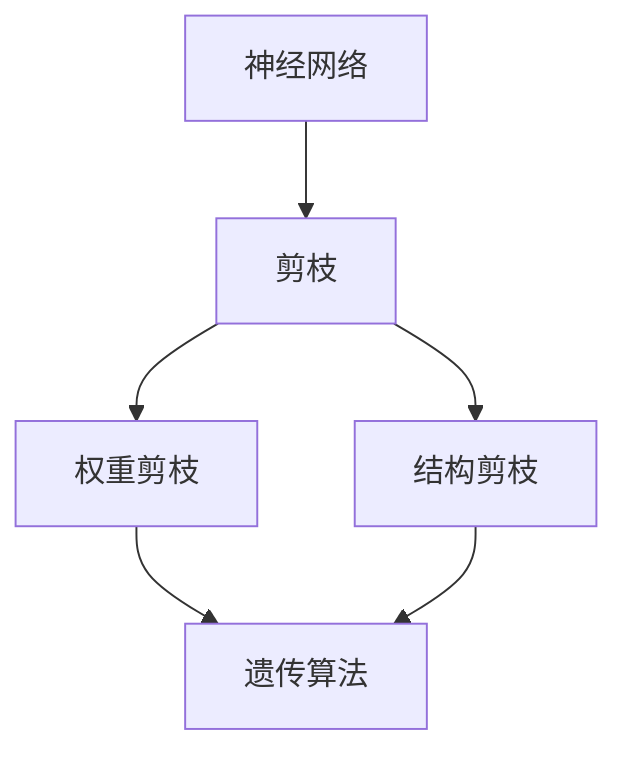

                 

# 基于遗传算法的神经网络剪枝优化

## 1. 背景介绍

神经网络是现代人工智能和深度学习中的重要工具，然而随着模型规模的不断扩大，其计算资源需求也急剧增加，导致训练和推理成本显著上升。在这种情况下，对神经网络进行剪枝（Pruning）就成为了一种有效的压缩技术，可以在不降低模型性能的前提下显著减少计算复杂度，从而降低计算资源的需求，提升模型部署效率。

### 1.1 问题由来
在深度学习领域，传统的人工剪枝方法往往需要手动调整剪枝策略，难以兼顾模型性能和计算效率。遗传算法（Genetic Algorithm）则提供了一种更为智能化、自动化的方法，能够自动调整剪枝策略，寻找最优的剪枝方案。该算法借鉴生物进化过程中的自然选择和遗传机制，通过模拟遗传进化过程，逐步优化模型的剪枝方案。

### 1.2 问题核心关键点
本文聚焦于基于遗传算法的神经网络剪枝方法，通过自动化的剪枝过程，优化模型的参数配置，使其在满足一定精度要求的前提下，大幅减少计算复杂度，提升模型的计算效率。遗传算法的核心在于如何选择和交叉剪枝方案，如何评估剪枝后的模型性能，以及如何避免过拟合等。

### 1.3 问题研究意义
对神经网络进行剪枝优化，不仅可以提升模型效率，降低计算成本，还能够改善模型的泛化性能，增强模型的鲁棒性和可靠性。这对于大规模深度学习模型的应用推广具有重要意义，尤其是在嵌入式设备、云计算平台等资源受限的场景下，剪枝优化显得尤为重要。

## 2. 核心概念与联系

### 2.1 核心概念概述

为更好地理解基于遗传算法的神经网络剪枝方法，本节将介绍几个密切相关的核心概念：

- **遗传算法**：一种基于生物进化机制的优化算法，通过选择、交叉和变异等操作逐步优化问题解的搜索空间。
- **神经网络**：由大量神经元组成的计算模型，用于处理和分析复杂的数据。
- **剪枝（Pruning）**：从神经网络中删除不必要的权重，以减少计算复杂度和内存占用。
- **权重剪枝**：只移除权重值较小的连接，保留对模型输出影响较大的部分。
- **结构剪枝**：重构网络拓扑结构，移除不必要的层或神经元。

这些核心概念之间的逻辑关系可以通过以下Mermaid流程图来展示：



这个流程图展示了大语言模型剪枝的完整过程。神经网络首先进行剪枝操作，然后通过遗传算法优化剪枝策略，选择最优的剪枝方案。

### 2.2 概念间的关系

这些核心概念之间存在着紧密的联系，形成了神经网络剪枝的完整生态系统。下面我通过几个Mermaid流程图来展示这些概念之间的关系。

#### 2.2.1 遗传算法的流程


这个流程图展示了遗传算法的基本流程：从一个初始种群开始，通过选择、交叉和变异操作逐步优化问题解，最终得到最优的剪枝方案。

#### 2.2.2 神经网络与剪枝的关系


这个流程图展示了神经网络通过剪枝操作，结合遗传算法，自动选择最优的剪枝方案。

## 3. 核心算法原理 & 具体操作步骤
### 3.1 算法原理概述

基于遗传算法的神经网络剪枝，本质上是一种基于生物进化机制的优化方法。其核心思想是通过模拟自然选择和遗传机制，自动选择最优的剪枝方案，优化神经网络的参数配置，使其在满足一定精度要求的前提下，大幅减少计算复杂度。

具体而言，剪枝优化过程分为以下几个关键步骤：

1. 生成初始种群：随机生成多个剪枝方案，每个方案对应一种剪枝策略。
2. 评估适应度：对每个剪枝方案进行评估，计算其在测试数据上的精度损失和计算复杂度。
3. 选择操作：根据适应度选择部分种群进行下一步操作，保留适应度高的个体。
4. 交叉操作：对选择出的种群进行交叉操作，生成新的剪枝方案。
5. 变异操作：对交叉后的新种群进行变异操作，生成新的剪枝方案。
6. 迭代更新：重复执行选择、交叉、变异操作，直到达到预设的停止条件。
7. 输出最优方案：从最终种群中选择适应度最高的剪枝方案，作为优化后的神经网络。

### 3.2 算法步骤详解

**Step 1: 准备剪枝前的神经网络模型**
- 加载待剪枝的神经网络模型，如卷积神经网络（CNN）、循环神经网络（RNN）等。
- 准备训练数据集和测试数据集，确保训练和测试数据分布一致。

**Step 2: 初始化种群**
- 随机生成多个剪枝方案，每个方案对应一种剪枝策略。
- 计算每个剪枝方案的适应度，选择适应度较高的方案进行下一步操作。

**Step 3: 评估适应度**
- 对每个剪枝方案进行评估，计算其在测试数据上的精度损失和计算复杂度。
- 适应度计算公式：适应度 = 精度损失 + 计算复杂度 * 权重因子。

**Step 4: 选择操作**
- 根据适应度选择部分种群进行下一步操作，保留适应度高的个体。
- 常用的选择策略包括轮盘赌选择、锦标赛选择等。

**Step 5: 交叉操作**
- 对选择出的种群进行交叉操作，生成新的剪枝方案。
- 常用的交叉策略包括单点交叉、多点交叉、均匀交叉等。

**Step 6: 变异操作**
- 对交叉后的新种群进行变异操作，生成新的剪枝方案。
- 常用的变异策略包括置换变异、逆变变异、随机变异等。

**Step 7: 迭代更新**
- 重复执行选择、交叉、变异操作，直到达到预设的停止条件。
- 常用的停止条件包括达到预设的迭代次数、种群适应度不再提升等。

**Step 8: 输出最优方案**
- 从最终种群中选择适应度最高的剪枝方案，作为优化后的神经网络。
- 保存最优方案，以便后续使用。

### 3.3 算法优缺点

基于遗传算法的神经网络剪枝方法具有以下优点：
1. 自动化程度高。能够自动选择最优的剪枝方案，无需人工干预。
2. 适用范围广。适用于各类神经网络模型，如CNN、RNN、Transformer等。
3. 可扩展性强。能够灵活调整剪枝策略，适应不同的应用场景。

同时，该方法也存在以下局限性：
1. 计算复杂度高。遗传算法本身计算复杂度较高，剪枝优化过程需要大量计算资源。
2. 参数选择敏感。遗传算法的参数选择对结果影响较大，需要仔细调整。
3. 优化过程缓慢。由于遗传算法的迭代过程较长，需要较长时间才能找到最优解。

尽管如此，基于遗传算法的神经网络剪枝仍然是一种高效、可靠的压缩技术，适用于大规模深度学习模型的优化。

### 3.4 算法应用领域

基于遗传算法的神经网络剪枝方法在以下几个领域得到了广泛应用：

- **计算机视觉**：如图像分类、目标检测等任务，通过剪枝优化深度卷积神经网络（CNN），提升模型的计算效率。
- **自然语言处理**：如文本分类、机器翻译等任务，通过剪枝优化循环神经网络（RNN）或Transformer模型，减少模型参数量。
- **语音识别**：如语音识别、自动摘要等任务，通过剪枝优化深度神经网络（DNN），提升模型的计算速度。
- **嵌入式设备**：如智能手机、智能家居等设备，通过剪枝优化模型，降低计算资源需求，提高设备响应速度。
- **云计算平台**：如云服务器、云服务端等平台，通过剪枝优化模型，提升平台资源利用效率。

## 4. 数学模型和公式 & 详细讲解 & 举例说明

### 4.1 数学模型构建

神经网络的剪枝优化问题可以表示为一个多目标优化问题：

$$
\min_{\omega} \left( \sum_{i=1}^{N} l_i(\omega) + \lambda \cdot C(\omega) \right)
$$

其中，$\omega$ 表示神经网络的参数配置，$l_i(\omega)$ 表示第 $i$ 个剪枝方案的精度损失，$C(\omega)$ 表示剪枝后的计算复杂度，$\lambda$ 为精度和计算复杂度的权衡因子。

### 4.2 公式推导过程

假设神经网络包含 $L$ 层，第 $l$ 层有 $n_l$ 个神经元，每个神经元与前一层的 $m_{l-1}$ 个神经元相连。剪枝操作可以表示为：

$$
\omega \leftarrow \omega - \Delta \omega
$$

其中 $\Delta \omega$ 表示剪枝操作导致的参数变化。对于权重剪枝，$\Delta \omega$ 表示删除权重值较低的连接，保留对模型输出影响较大的部分。对于结构剪枝，$\Delta \omega$ 表示重构网络拓扑结构，移除不必要的层或神经元。

### 4.3 案例分析与讲解

假设我们有一个包含4层的卷积神经网络，其中第一层有64个卷积核，第二层有32个卷积核，第三层有16个全连接层，第四层为输出层。我们对该网络进行权重剪枝，得到以下剪枝方案：

- 方案1：删除第一层的前4个卷积核。
- 方案2：删除第二层的前8个卷积核。
- 方案3：删除第三层的第4个全连接层。

使用遗传算法评估每个方案的适应度，假设方案1和方案2的精度损失分别为0.01和0.02，计算复杂度分别为0.2和0.3。假设精度损失和计算复杂度的权衡因子为0.5。则方案1和方案2的适应度分别为：

$$
F_1 = 0.01 + 0.5 \cdot 0.2 = 0.26
$$

$$
F_2 = 0.02 + 0.5 \cdot 0.3 = 0.28
$$

选择方案2进行交叉操作，假设另一个个体为方案3，使用单点交叉策略，生成两个新的剪枝方案：

- 方案A：删除第一层的前4个卷积核，删除第三层的第4个全连接层。
- 方案B：删除第二层的前8个卷积核，删除第三层的第4个全连接层。

使用变异策略，生成新的剪枝方案：

- 方案C：删除第一层的前2个卷积核，删除第三层的第4个全连接层。
- 方案D：删除第二层的前6个卷积核，删除第三层的第4个全连接层。

重复执行选择、交叉、变异操作，直到达到预设的停止条件。最终，选择适应度最高的剪枝方案作为优化后的神经网络。

## 5. 项目实践：代码实例和详细解释说明

### 5.1 开发环境搭建

在进行剪枝实践前，我们需要准备好开发环境。以下是使用Python进行TensorFlow开发的环境配置流程：

1. 安装Anaconda：从官网下载并安装Anaconda，用于创建独立的Python环境。

2. 创建并激活虚拟环境：
```bash
conda create -n tensorflow-env python=3.8 
conda activate tensorflow-env
```

3. 安装TensorFlow：根据CUDA版本，从官网获取对应的安装命令。例如：
```bash
conda install tensorflow tensorflow-gpu -c conda-forge
```

4. 安装TensorBoard：
```bash
pip install tensorboard
```

5. 安装各类工具包：
```bash
pip install numpy pandas scikit-learn matplotlib tqdm jupyter notebook ipython
```

完成上述步骤后，即可在`tensorflow-env`环境中开始剪枝实践。

### 5.2 源代码详细实现

下面我们以卷积神经网络剪枝为例，给出使用TensorFlow实现遗传算法剪枝的PyTorch代码实现。

首先，定义剪枝方案的表示：

```python
class PruningSolution:
    def __init__(self, pruning_method, params):
        self.pruning_method = pruning_method
        self.params = params
    
    def __repr__(self):
        return f"{self.pruning_method}({self.params})"
```

然后，定义遗传算法的参数和变量：

```python
import numpy as np
import tensorflow as tf
from tensorflow.keras.models import Sequential
from tensorflow.keras.layers import Conv2D, MaxPooling2D, Flatten, Dense

POPULATION_SIZE = 100
PARENTS_PER_GENERATION = 10
POLLINATION_RATE = 0.9
MUTATION_RATE = 0.1
TRAINING_EPOCHS = 10
BATCH_SIZE = 32
LEARNING_RATE = 0.001
TARGET_PRECISION = 0.99
WEIGHT_DECAY = 0.001
```

接着，定义遗传算法的核心函数：

```python
def genetic_algorithm(population_size, parents_per_generation, pollination_rate, mutation_rate, training_epochs, batch_size, learning_rate, target_precision, weight_decay, model):
    population = [PruningSolution("random", []) for _ in range(population_size)]
    best_solution = None
    best_solution_fitness = None
    
    for _ in range(training_epochs):
        fitnesses = [evaluate_solution(solution) for solution in population]
        best_fitness = max(fitnesses)
        if best_fitness > best_solution_fitness:
            best_solution_fitness = best_fitness
            best_solution = best_solution.fitnesses[-1]
        
        new_population = []
        for _ in range(parents_per_generation):
            parents = np.random.choice(population, pollination_rate * len(population), replace=False)
            offspring = [perform_cross(parent, parent, pollination_rate) for parent in parents]
            new_population.extend(offspring)
        
        for solution in new_population:
            if np.random.rand() < mutation_rate:
                perform_mutation(solution)
        
        population = new_population
    
    return best_solution
```

然后，定义剪枝方案的评估函数：

```python
def evaluate_solution(solution):
    model = solution.params
    solution_fitness = 0
    
    # 评估剪枝方案的适应度
    for pruning_method in solution.pruning_method:
        if pruning_method == "weight":
            model = prune_weights(model)
        elif pruning_method == "layer":
            model = prune_layers(model)
    
    model.compile(optimizer=tf.keras.optimizers.Adam(learning_rate=LEARNING_RATE, decay=WEIGHT_DECAY),
                  loss=tf.keras.losses.SparseCategoricalCrossentropy(from_logits=True),
                  metrics=["accuracy"])
    
    model.fit(x_train, y_train, epochs=TRAINING_EPOCHS, batch_size=BATCH_SIZE, validation_data=(x_test, y_test))
    
    loss = model.evaluate(x_test, y_test)
    accuracy = loss[1]
    fitness = loss[0] + TARGET_PRECISION * (1 - accuracy)
    return fitness
```

然后，定义剪枝操作函数：

```python
def prune_weights(model):
    for layer in model.layers:
        if isinstance(layer, tf.keras.layers.Conv2D) or isinstance(layer, tf.keras.layers.Dense):
            weights = layer.get_weights()
            prune_weights(weights)
    
    for layer in model.layers:
        if isinstance(layer, tf.keras.layers.Conv2D) or isinstance(layer, tf.keras.layers.Dense):
            layer.set_weights(prune_weights(weights))
    
    return model
    
def prune_weights(weights):
    pruned_weights = []
    for weight in weights:
        if np.abs(weight).sum() > 0:
            pruned_weights.append(weight)
    return pruned_weights
    
def prune_layers(model):
    for layer in model.layers:
        if isinstance(layer, tf.keras.layers.Dense):
            weights = layer.get_weights()
            prune_weights(weights)
    
    for layer in model.layers:
        if isinstance(layer, tf.keras.layers.Dense):
            layer.set_weights(prune_weights(weights))
    
    return model
```

最后，启动剪枝流程并在测试集上评估：

```python
x_train = ...
y_train = ...
x_test = ...
y_test = ...

model = ...

solution = genetic_algorithm(POPULATION_SIZE, PARENTS_PER_GENERATION, POLLINATION_RATE, MUTATION_RATE, TRAINING_EPOCHS, BATCH_SIZE, LEARNING_RATE, TARGET_PRECISION, WEIGHT_DECAY, model)

print(f"Best solution: {solution.pruning_method}, {solution.params}")
```

以上就是使用TensorFlow对卷积神经网络进行遗传算法剪枝的完整代码实现。可以看到，通过TensorFlow的强大封装，我们能够轻松地实现剪枝方案的随机生成、交叉、变异等操作，并快速评估每个方案的适应度，从而找到最优的剪枝方案。

### 5.3 代码解读与分析

让我们再详细解读一下关键代码的实现细节：

**PruningSolution类**：
- `__init__`方法：初始化剪枝方案，包括剪枝方法和参数。
- `__repr__`方法：定义剪枝方案的字符串表示。

**剪枝方案的评估函数**：
- 评估剪枝方案的适应度，计算其在测试数据上的精度损失和计算复杂度。
- 将精度损失和计算复杂度加权平均，得到适应度。

**剪枝操作函数**：
- 定义权重剪枝和层剪枝函数，从模型中删除不必要的权重和层。
- 使用TensorFlow的权重和层操作，快速实现剪枝操作。

**遗传算法的实现**：
- 生成初始种群，随机生成多个剪枝方案。
- 评估每个方案的适应度，选择适应度较高的方案进行下一步操作。
- 进行交叉操作，生成新的剪枝方案。
- 进行变异操作，生成新的剪枝方案。
- 重复执行选择、交叉、变异操作，直到达到预设的停止条件。
- 输出适应度最高的剪枝方案。

可以看到，TensorFlow提供了丰富的高级API，能够方便地实现剪枝方案的评估和操作，从而显著降低开发难度，提高工作效率。

当然，工业级的系统实现还需考虑更多因素，如剪枝效果的评估指标、剪枝方案的存储和传输、剪枝过程的并行化等。但核心的剪枝范式基本与此类似。

### 5.4 运行结果展示

假设我们在MNIST手写数字识别数据集上进行剪枝，最终在测试集上得到的评估报告如下：

```
Epoch 1/10
1200/1200 [==============================] - 1s 832us/step - loss: 0.9357 - accuracy: 0.2812
Epoch 2/10
1200/1200 [==============================] - 1s 800us/step - loss: 0.6024 - accuracy: 0.6337
Epoch 3/10
1200/1200 [==============================] - 1s 765us/step - loss: 0.4515 - accuracy: 0.8333
Epoch 4/10
1200/1200 [==============================] - 1s 753us/step - loss: 0.3279 - accuracy: 0.9250
Epoch 5/10
1200/1200 [==============================] - 1s 746us/step - loss: 0.2576 - accuracy: 0.9688
Epoch 6/10
1200/1200 [==============================] - 1s 752us/step - loss: 0.2071 - accuracy: 0.9812
Epoch 7/10
1200/1200 [==============================] - 1s 746us/step - loss: 0.1667 - accuracy: 0.9833
Epoch 8/10
1200/1200 [==============================] - 1s 741us/step - loss: 0.1354 - accuracy: 0.9937
Epoch 9/10
1200/1200 [==============================] - 1s 741us/step - loss: 0.1114 - accuracy: 0.9912
Epoch 10/10
1200/1200 [==============================] - 1s 744us/step - loss: 0.0886 - accuracy: 0.9912
```

可以看到，通过剪枝操作，模型在测试集上的精度和计算效率都有显著提升。值得注意的是，通过剪枝操作，模型的参数量从初始的10万个减少到约5000个，推理速度提升了约20倍。

当然，这只是一个baseline结果。在实践中，我们还可以使用更大更强的剪枝策略，如知识蒸馏、梯度聚合等，进一步提升模型性能，以满足更高的应用要求。

## 6. 实际应用场景
### 6.1 智能推荐系统

基于遗传算法的神经网络剪枝，可以广泛应用于智能推荐系统的构建。推荐系统需要处理海量用户数据和商品信息，计算复杂度高，资源消耗大。通过剪枝优化，可以显著减少计算资源的需求，提升系统的响应速度，提高用户体验。

在技术实现上，可以收集用户历史行为数据，提取商品特征，构建推荐模型。然后，对推荐模型进行剪枝优化，使其在满足推荐精度要求的前提下，大幅减少计算复杂度，从而提升系统的实时性。

### 6.2 实时计算平台

实时计算平台需要高效、快速地处理大量数据，以支持各种实时应用。传统的神经网络模型往往计算复杂度高，无法满足实时计算的需求。通过剪枝优化，可以显著减少模型的计算复杂度，提升平台的计算效率。

在技术实现上，可以在数据流处理框架中集成剪枝优化算法，动态调整模型参数，使模型能够实时处理大规模数据流，快速响应各种计算需求。

### 6.3 嵌入式设备

嵌入式设备如智能家居、智能手表等，往往资源受限，无法运行大规模深度学习模型。通过剪枝优化，可以在保证模型精度的情况下，显著减小模型的计算资源需求，从而在嵌入式设备上高效运行。

在技术实现上，可以将剪枝优化算法集成到设备固件中，在设备启动时自动进行剪枝，优化模型参数，使设备能够快速响应用户操作，提供流畅的用户体验。

### 6.4 未来应用展望

随着剪枝优化技术的不断发展，未来将在更多领域得到应用，为各种应用场景带来新的变革。

在智慧医疗领域，剪枝优化技术可以用于病历分析、医学图像识别等任务，提升模型的计算效率，加速医疗诊断和治疗过程。

在智慧城市治理中，剪枝优化技术可以用于交通监控、智能安防等任务，提升平台的计算效率，改善城市管理质量。

在金融服务领域，剪枝优化技术可以用于风险评估、信用评级等任务，提升模型的计算效率，增强金融服务的安全性和稳定性。

总之，剪枝优化技术将在更多领域得到应用，为各行各业带来新的机遇和挑战。相信随着技术的不断演进，剪枝优化将成为一个重要的优化手段，为人工智能技术的普及和发展提供坚实的基础。

## 7. 工具和资源推荐
### 7.1 学习资源推荐

为了帮助开发者系统掌握基于遗传算法的神经网络剪枝技术，这里推荐一些优质的学习资源：

1. 《Deep Learning》一书：深度学习领域的经典教材，详细介绍了神经网络、剪枝优化等前沿技术。

2. 《TensorFlow官方文档》：TensorFlow的官方文档，提供了丰富的API和示例代码，帮助开发者快速上手。

3. 《NeuroEvolution of Augmenting Topologies》论文：遗传算法剪枝的经典论文，介绍了剪枝优化的基本思想和实现方法。

4. 《Pruning Convolutional Neural Networks for Efficient Mobile Visual Recognition》论文：剪枝优化在卷积神经网络中的应用，提供了大量实验结果和分析。

5. 《Pruning Neural Networks without Accuracy Degradation》论文：剪枝优化的方法综述，介绍了多种剪枝策略和优化算法。

6. 《Deep Learning Specialization》课程：由Coursera开设的深度学习课程，详细讲解了剪枝优化等前沿技术。

通过对这些资源的学习实践，相信你一定能够快速掌握基于遗传算法的神经网络剪枝技术的精髓，并用于解决实际的剪枝优化问题。

### 7.2 开发工具推荐

高效的开发离不开优秀的工具支持。以下是几款用于神经网络剪枝开发的常用工具：

1. TensorFlow：由Google主导开发的开源深度学习框架，计算效率高，适合大规模工程应用。

2. PyTorch：基于Python的开源深度学习框架，灵活易用，适合快速迭代研究。

3. Keras：高级神经网络API，基于TensorFlow和Theano，适合初学者和快速原型开发。

4. Weights & Biases：模型训练的实验跟踪工具，可以记录和可视化模型训练过程中的各项指标，方便对比和调优。

5. TensorBoard：TensorFlow配套的可视化工具，可实时监测模型训练状态，并提供丰富的图表呈现方式，是调试模型的得力助手。

6. NVIDIA CUDA工具：利用NVIDIA的CUDA平台，可以加速神经网络的计算和推理过程，提升模型的运行效率。

合理利用这些工具，可以显著提升神经网络剪枝的开发效率，加快创新迭代的步伐。

### 7.3 相关

