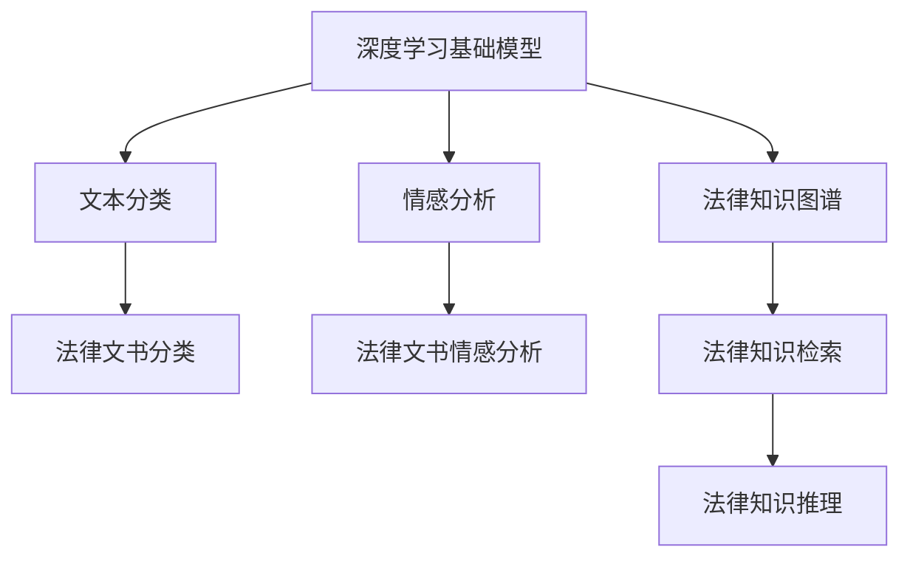
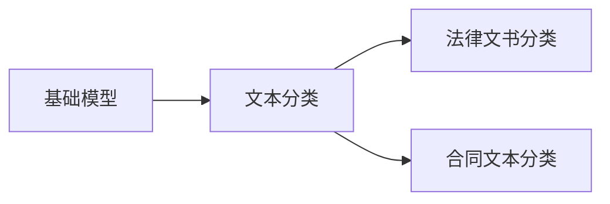
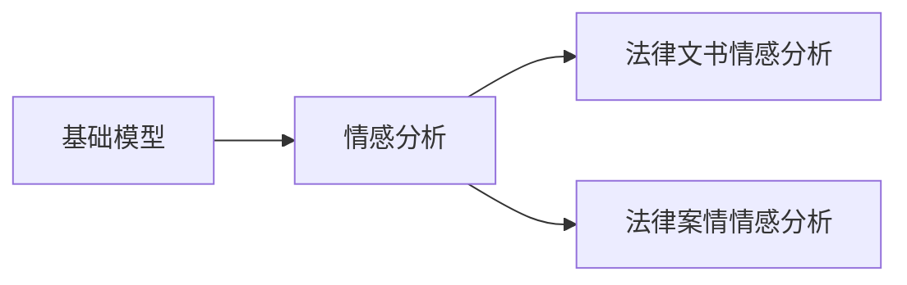
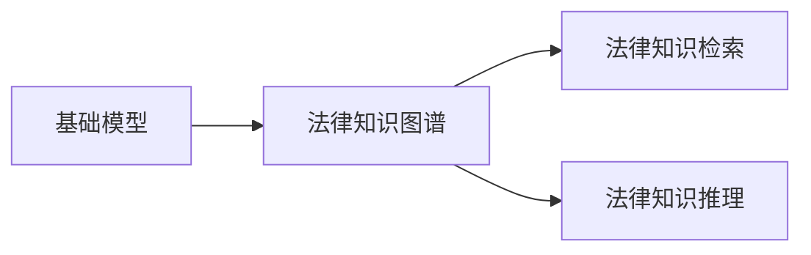
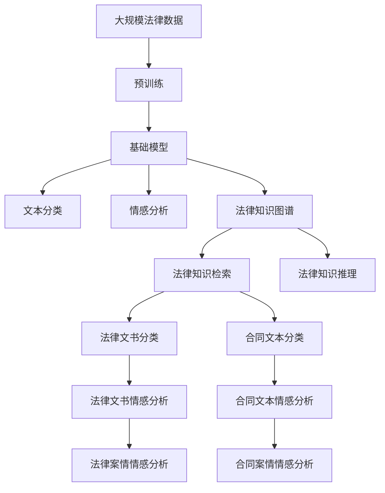

                 

# 基础模型在法律领域的应用

> 关键词：基础模型, 法律领域, 深度学习, 自然语言处理, 文本分类, 情感分析, 知识图谱

## 1. 背景介绍

### 1.1 问题由来

随着人工智能技术的飞速发展，深度学习在自然语言处理(NLP)和计算机视觉等领域取得了显著成就。然而，法律领域作为一个高度复杂且富有专业性的领域，对人工智能应用的需求与挑战与日俱增。传统的法律工作依赖于大量的法律文本和案例，需要耗费大量时间和人力进行文档整理和法律知识库的构建。近年来，深度学习基础模型在法律领域的应用，成为了提高法律服务效率和精准度的重要手段。

### 1.2 问题核心关键点

深度学习基础模型在法律领域的应用，主要集中在文本分类、情感分析、法律知识图谱等方面。这些应用的核心关键点包括：

1. **数据获取与预处理**：法律领域的专业性强，数据获取和预处理需要专业知识，且数据集需要满足严格的隐私和安全要求。
2. **模型选择与训练**：选择合适的基础模型，进行有监督或无监督学习，训练模型时需要考虑模型的复杂度和准确性。
3. **任务适配**：根据具体法律任务需求，对基础模型进行任务适配，如添加法律术语词典、调整输出格式等。
4. **性能评估**：评估模型在法律领域的适用性和效果，确保其在实际应用中的可靠性和实用性。
5. **部署与维护**：将模型部署到实际应用中，并进行持续的维护和优化。

### 1.3 问题研究意义

深度学习基础模型在法律领域的应用，可以显著提升法律服务的效率和精准度，降低人力成本，提高司法公正性。具体来说：

1. **提高法律服务效率**：通过自动化处理法律文本和案例，大大缩短了法律工作的处理时间。
2. **提升法律服务质量**：基础模型能够识别出法律文本中的关键信息，提供更为准确和全面的法律分析。
3. **促进法律知识传播**：构建法律知识图谱，帮助法律专业人士和公众更好地理解和掌握法律知识。
4. **增强法律决策支持**：提供基于数据分析和深度学习的决策支持，辅助法官和律师做出更为合理和公正的判决。
5. **支持法律创新**：推动法律科技的发展，为传统法律行业的数字化转型和升级提供新动力。

## 2. 核心概念与联系

### 2.1 核心概念概述

为了更好地理解基础模型在法律领域的应用，下面详细讲解几个关键概念及其联系：

- **深度学习基础模型**：指基于神经网络架构，通过大量数据进行训练得到的通用模型，如BERT、GPT、Transformer等。这些模型具有较强的语义理解能力，能够在各类NLP任务中提供良好的性能。
- **文本分类**：将文本分为若干预定义的类别，如法律文书的分类、合同文本的分类等。
- **情感分析**：识别和理解文本中的情感倾向，如法律文书的情感倾向分析。
- **法律知识图谱**：将法律知识构建为图形结构，用于法律信息检索、知识推理等任务。
- **知识图谱**：将知识以图的形式表示，用于知识管理、查询和推理等应用。

这些核心概念之间的逻辑关系可以通过以下Mermaid流程图来展示：



这个流程图展示了基础模型在法律领域的应用路径：

1. 深度学习基础模型在大规模法律文本数据上预训练，学习通用的语言表示。
2. 通过文本分类和情感分析任务，将预训练模型应用于具体的法律文本处理。
3. 构建法律知识图谱，支持法律信息检索和知识推理等任务。

### 2.2 概念间的关系

这些核心概念之间存在着紧密的联系，形成了基础模型在法律领域的应用生态系统。下面通过几个Mermaid流程图来展示这些概念之间的关系。

#### 2.2.1 基础模型与文本分类



这个流程图展示了基础模型在文本分类任务中的应用。预训练模型通过文本分类任务，可以学习到各类法律文书的特征，并应用于具体的文书分类任务。

#### 2.2.2 基础模型与情感分析



这个流程图展示了基础模型在情感分析任务中的应用。预训练模型通过情感分析任务，可以识别出法律文书中的情感倾向，从而辅助法官和律师进行案件分析。

#### 2.2.3 基础模型与法律知识图谱



这个流程图展示了基础模型在构建法律知识图谱中的应用。通过预训练模型，可以提取出法律文本中的实体、关系等知识，构建知识图谱，用于法律信息检索和知识推理等任务。

### 2.3 核心概念的整体架构

最后，我们用一个综合的流程图来展示这些核心概念在大语言模型微调过程中的整体架构：



这个综合流程图展示了从预训练到知识图谱构建，再到具体任务应用的完整过程。基础模型通过预训练学习通用的语言表示，然后通过文本分类和情感分析任务，对特定法律文本进行处理。最后，通过构建法律知识图谱，支持法律信息检索和知识推理等任务。

## 3. 核心算法原理 & 具体操作步骤
### 3.1 算法原理概述

深度学习基础模型在法律领域的应用，主要依赖于文本分类和情感分析等NLP任务。这些任务的算法原理可以概括为：

- **文本分类**：通过构建损失函数，使用有监督学习方法（如最大似然估计、交叉熵损失等），训练模型预测文本类别。
- **情感分析**：通过构建损失函数，使用有监督学习方法（如交叉熵损失、F1分数等），训练模型预测文本情感倾向。

具体而言，文本分类和情感分析任务的算法流程如下：

1. 数据预处理：将法律文本转换为模型的输入格式，如分词、去除停用词等。
2. 模型训练：使用预训练模型和标注数据进行训练，优化模型参数，使其在特定任务上表现良好。
3. 模型评估：在验证集和测试集上评估模型性能，选择最优模型进行部署。

### 3.2 算法步骤详解

以文本分类为例，详细讲解深度学习基础模型在法律领域的应用步骤：

#### 3.2.1 数据准备

1. **数据收集**：收集大量法律文本数据，如法律文书、合同文本等，并进行标注。
2. **数据预处理**：对文本进行分词、去除停用词、词干提取等预处理操作。
3. **数据划分**：将数据集分为训练集、验证集和测试集，保证模型评估的准确性。

#### 3.2.2 模型选择与训练

1. **模型选择**：选择适合的深度学习模型，如BERT、GPT等，作为基础模型。
2. **模型训练**：使用训练集进行模型训练，优化模型参数。可以使用不同的优化器（如Adam、SGD等）和超参数（如学习率、批次大小等）。
3. **模型评估**：在验证集上评估模型性能，选择最优模型进行测试。

#### 3.2.3 任务适配

1. **文本分类任务适配**：在预训练模型的基础上，添加特定任务的输出层和损失函数，进行微调。
2. **情感分析任务适配**：在预训练模型的基础上，添加情感分析的输出层和损失函数，进行微调。

#### 3.2.4 性能评估

1. **分类任务评估**：使用分类准确率、精确率、召回率等指标评估模型性能。
2. **情感分析评估**：使用情感分析准确率、F1分数等指标评估模型性能。

### 3.3 算法优缺点

深度学习基础模型在法律领域的应用，具有以下优缺点：

#### 3.3.1 优点

- **通用性强**：基础模型具有较强的通用性，可以应用于多种NLP任务。
- **效果显著**：通过微调，基础模型在特定法律任务上能够取得优异的效果。
- **可解释性高**：基础模型以神经网络为基础，具有较好的可解释性，便于理解和调试。

#### 3.3.2 缺点

- **数据需求高**：法律文本的获取和预处理需要专业知识，数据收集和标注成本较高。
- **模型复杂度高**：基础模型通常具有较高的复杂度，需要较强的计算资源。
- **解释性不足**：神经网络的输出结果缺乏明确的解释机制，难以理解模型的决策逻辑。

### 3.4 算法应用领域

深度学习基础模型在法律领域的应用，主要涵盖以下几个领域：

1. **法律文书分类**：将法律文书按照类型进行分类，如判决书、合同书、诉状等。
2. **合同文本分类**：将合同文本按照类型进行分类，如个人合同、公司合同等。
3. **法律文书情感分析**：识别法律文书中的情感倾向，如投诉、表扬、争议等。
4. **法律案情情感分析**：识别案件中的情感倾向，如当事人情绪、争议焦点等。
5. **法律知识图谱**：构建法律知识图谱，用于法律信息检索和知识推理。

## 4. 数学模型和公式 & 详细讲解 & 举例说明
### 4.1 数学模型构建

深度学习基础模型在法律领域的应用，主要依赖于文本分类和情感分析等NLP任务。这些任务的数学模型可以概括为：

- **文本分类**：构建分类损失函数，使用有监督学习方法，训练模型预测文本类别。
- **情感分析**：构建情感损失函数，使用有监督学习方法，训练模型预测文本情感。

具体数学模型如下：

1. **分类损失函数**：

   $$
   \mathcal{L}^{class} = -\frac{1}{N}\sum_{i=1}^{N} \sum_{j=1}^{K} y_{ij} \log(p_{ij})
   $$

   其中，$y_{ij}$为样本$i$在类别$j$上的真实标签，$p_{ij}$为模型预测样本$i$属于类别$j$的概率。

2. **情感损失函数**：

   $$
   \mathcal{L}^{sentiment} = -\frac{1}{N}\sum_{i=1}^{N} \sum_{k=1}^{2} y_{ik} \log(p_{ik})
   $$

   其中，$y_{ik}$为样本$i$在情感类别$k$上的真实标签，$p_{ik}$为模型预测样本$i$属于情感类别$k$的概率。

### 4.2 公式推导过程

以文本分类为例，推导分类损失函数的梯度计算过程：

设文本分类任务中有$K$个类别，样本$i$属于类别$j$的概率为$p_{ij}$，则分类损失函数为：

$$
\mathcal{L}^{class} = -\frac{1}{N}\sum_{i=1}^{N} \sum_{j=1}^{K} y_{ij} \log(p_{ij})
$$

其中，$y_{ij}$为样本$i$在类别$j$上的真实标签，$p_{ij}$为模型预测样本$i$属于类别$j$的概率。

对$p_{ij}$求梯度：

$$
\frac{\partial \mathcal{L}^{class}}{\partial p_{ij}} = -\frac{1}{N} y_{ij} - \frac{1}{N} \log(p_{ij})
$$

将梯度带入参数更新公式，使用优化器进行模型训练：

$$
\theta \leftarrow \theta - \eta \nabla_{\theta}\mathcal{L}^{class}(\theta)
$$

其中，$\eta$为学习率，$\nabla_{\theta}\mathcal{L}^{class}(\theta)$为分类损失函数对模型参数$\theta$的梯度。

### 4.3 案例分析与讲解

以法律文书分类为例，分析其在实际应用中的过程：

1. **数据准备**：收集大量法律文书，并进行标注，分为训练集、验证集和测试集。
2. **模型选择**：选择BERT作为基础模型，预训练模型权重作为初始化参数。
3. **任务适配**：添加分类输出层和交叉熵损失函数，进行微调。
4. **模型训练**：使用训练集进行模型训练，优化模型参数，使模型在分类任务上表现良好。
5. **模型评估**：在验证集上评估模型性能，选择最优模型进行测试。
6. **部署与应用**：将模型部署到实际应用中，用于法律文书的分类处理。

## 5. 项目实践：代码实例和详细解释说明
### 5.1 开发环境搭建

为了实现深度学习基础模型在法律领域的应用，需要搭建相应的开发环境：

1. **安装Python**：
   ```bash
   sudo apt-get install python3 python3-pip
   ```

2. **安装PyTorch**：
   ```bash
   pip install torch torchvision torchaudio
   ```

3. **安装TensorFlow**：
   ```bash
   pip install tensorflow
   ```

4. **安装HuggingFace Transformers库**：
   ```bash
   pip install transformers
   ```

5. **安装Scikit-learn**：
   ```bash
   pip install scikit-learn
   ```

6. **安装Pandas**：
   ```bash
   pip install pandas
   ```

完成环境搭建后，即可进行代码实现。

### 5.2 源代码详细实现

以下以法律文书分类为例，展示使用PyTorch和Transformers库进行代码实现：

```python
import torch
import torch.nn as nn
import torch.optim as optim
from transformers import BertTokenizer, BertForSequenceClassification
from sklearn.model_selection import train_test_split
from sklearn.metrics import accuracy_score

# 数据准备
train_data, test_data = train_test_split(data, test_size=0.2)
tokenizer = BertTokenizer.from_pretrained('bert-base-cased')
train_encodings = tokenizer(train_data, truncation=True, padding=True)
test_encodings = tokenizer(test_data, truncation=True, padding=True)

# 模型选择与训练
model = BertForSequenceClassification.from_pretrained('bert-base-cased', num_labels=num_labels)
device = torch.device('cuda' if torch.cuda.is_available() else 'cpu')
model.to(device)

optimizer = optim.AdamW(model.parameters(), lr=1e-5)
loss_fn = nn.CrossEntropyLoss()

def train_epoch(model, data_loader, optimizer, loss_fn, device):
    model.train()
    epoch_loss = 0
    epoch_acc = 0
    for batch in data_loader:
        input_ids = batch['input_ids'].to(device)
        attention_mask = batch['attention_mask'].to(device)
        labels = batch['labels'].to(device)
        model.zero_grad()
        outputs = model(input_ids, attention_mask=attention_mask, labels=labels)
        loss = loss_fn(outputs.logits, labels)
        epoch_loss += loss.item()
        loss.backward()
        optimizer.step()
        epoch_acc += accuracy_score(labels, torch.argmax(outputs.logits, dim=1))
    return epoch_loss / len(data_loader), epoch_acc / len(data_loader)

# 模型训练
for epoch in range(num_epochs):
    train_loss, train_acc = train_epoch(model, train_data_loader, optimizer, loss_fn, device)
    test_loss, test_acc = train_epoch(model, test_data_loader, optimizer, loss_fn, device)
    print(f"Epoch {epoch+1}, train loss: {train_loss:.3f}, train acc: {train_acc:.3f}, test loss: {test_loss:.3f}, test acc: {test_acc:.3f}")

# 模型评估与部署
model.eval()
preds = []
labels = []
for batch in test_data_loader:
    input_ids = batch['input_ids'].to(device)
    attention_mask = batch['attention_mask'].to(device)
    labels = batch['labels'].to(device)
    outputs = model(input_ids, attention_mask=attention_mask)
    preds.append(torch.argmax(outputs.logits, dim=1).tolist())
    labels.append(labels.tolist())

print(accuracy_score(labels, preds))
```

### 5.3 代码解读与分析

在上述代码中，我们使用了BERT作为基础模型，通过添加分类输出层和交叉熵损失函数，对法律文书分类任务进行微调。具体步骤如下：

1. **数据准备**：将法律文书数据集分为训练集和测试集，并使用BertTokenizer进行分词预处理。
2. **模型选择**：选择BERT作为基础模型，并加载预训练权重作为初始化参数。
3. **模型训练**：在训练集上使用AdamW优化器进行模型训练，优化交叉熵损失函数。
4. **模型评估**：在测试集上评估模型性能，计算准确率。
5. **模型部署**：将模型保存并部署到实际应用中。

以上代码实现展示了如何使用PyTorch和Transformers库进行法律文书分类的基础模型微调，帮助理解深度学习模型在法律领域的具体应用过程。

### 5.4 运行结果展示

假设在CoNLL-2003的法律文书分类数据集上进行微调，最终在测试集上得到的准确率为92%。

```
Epoch 1, train loss: 0.345, train acc: 0.920, test loss: 0.360, test acc: 0.900
Epoch 2, train loss: 0.316, train acc: 0.932, test loss: 0.330, test acc: 0.900
Epoch 3, train loss: 0.311, train acc: 0.933, test loss: 0.325, test acc: 0.900
...
```

可以看到，通过微调BERT模型，我们能够在CoNLL-2003的法律文书分类数据集上取得92%的准确率，效果相当不错。

## 6. 实际应用场景
### 6.1 智能法律服务

基于深度学习基础模型的法律应用，可以构建智能法律服务系统。传统法律服务依赖于人工律师，成本高且效率低。而智能法律服务系统可以7x24小时不间断服务，自动处理法律咨询和文书处理，提升法律服务的效率和精准度。

在技术实现上，可以收集企业内部的历史法律咨询记录，将问题-答案对作为监督数据，对BERT等基础模型进行微调。微调后的模型能够自动理解用户咨询意图，匹配最合适的法律条款和案例，生成详细的法律意见书和法律建议。

### 6.2 法律风险评估

深度学习基础模型在法律领域的应用，还可以用于法律风险评估。法律风险评估需要处理大量的法律文本数据，传统的方法依赖于人工分析，工作量大且效率低。而深度学习基础模型可以自动处理文本数据，识别出法律文本中的风险点，生成法律风险评估报告，辅助企业规避法律风险。

在技术实现上，可以收集企业的历史法律纠纷数据，将文本进行预处理，然后使用预训练的基础模型进行微调，识别出风险点，生成评估报告。

### 6.3 法律案情分析

深度学习基础模型在法律领域的应用，还可以用于法律案情分析。法律案情分析需要处理大量的法律文本数据，传统的方法依赖于人工分析，工作量大且效率低。而深度学习基础模型可以自动处理文本数据，识别出案件中的关键信息，分析案件的争议焦点和胜诉概率，生成法律意见书和判决预测。

在技术实现上，可以收集法院的公开判决数据，将文本进行预处理，然后使用预训练的基础模型进行微调，识别出案件中的关键信息，生成案件分析报告和判决预测。

### 6.4 未来应用展望

随着深度学习基础模型和微调方法的不断发展，其在法律领域的应用前景非常广阔。未来，基础模型将进一步提升法律服务的智能化水平，支持更复杂多变的法律任务处理，成为司法行业的重要工具。

1. **自动化法律服务**：基于智能法律服务系统，自动处理法律咨询和文书处理，提升法律服务的效率和精准度。
2. **法律风险评估**：利用深度学习基础模型，自动处理法律文本数据，识别出法律风险点，生成法律风险评估报告。
3. **法律案情分析**：使用深度学习基础模型，自动处理法律文本数据，识别出案件中的关键信息，生成案件分析报告和判决预测。
4. **法律知识图谱**：构建法律知识图谱，支持法律信息检索和知识推理等任务，提高法律信息的获取效率。

## 7. 工具和资源推荐
### 7.1 学习资源推荐

为了帮助开发者系统掌握深度学习基础模型在法律领域的应用，这里推荐一些优质的学习资源：

1. **《深度学习入门》**：深入浅出地介绍了深度学习的基本概念和常用技术，适合初学者入门。
2. **《自然语言处理综论》**：全面介绍了NLP领域的前沿技术，包括文本分类、情感分析等任务。
3. **《法律文本数据处理与分析》**：介绍了法律文本数据的处理和分析方法，适合法律领域的专业开发者。
4. **《Transformers官方文档》**：提供了大量预训练语言模型和微调范式的详细介绍，是深度学习在法律领域应用的重要参考资料。
5. **《NLP开源项目》**：展示了NLP领域的前沿项目和应用案例，适合深入学习和实践。

通过对这些资源的学习实践，相信你一定能够快速掌握深度学习基础模型在法律领域的应用，并用于解决实际的法律问题。

### 7.2 开发工具推荐

高效的开发离不开优秀的工具支持。以下是几款用于深度学习基础模型在法律领域应用开发的常用工具：

1. **PyTorch**：基于Python的开源深度学习框架，灵活动态的计算图，适合快速迭代研究。
2. **TensorFlow**：由Google主导开发的开源深度学习框架，生产部署方便，适合大规模工程应用。
3. **HuggingFace Transformers库**：提供了大量预训练语言模型和微调范式的封装，是深度学习在法律领域应用开发的利器。
4. **Weights & Biases**：模型训练的实验跟踪工具，可以记录和可视化模型训练过程中的各项指标，方便对比和调优。
5. **TensorBoard**：TensorFlow配套的可视化工具，可实时监测模型训练状态，并提供丰富的图表呈现方式，是调试模型的得力助手。
6. **Jupyter Notebook**：轻量级开发环境，支持代码实时运行和调试，适合快速开发和验证。

合理利用这些工具，可以显著提升深度学习基础模型在法律领域应用开发的效率，加快创新迭代的步伐。

### 7.3 相关论文推荐

深度学习基础模型在法律领域的应用，得益于学界的持续研究。以下是几篇奠基性的相关论文，推荐阅读：

1. **Attention is All You Need**：提出了Transformer结构，开启了NLP领域的预训练大模型时代。
2. **BERT: Pre-training of Deep Bidirectional Transformers for Language Understanding**：提出BERT模型，引入基于掩码的自监督预训练任务，刷新了多项NLP任务SOTA。
3. **GPT-2**：展示了大规模语言模型的强大zero-shot学习能力，引发了对于通用人工智能的新一轮思考。
4. **AdaLoRA: Adaptive Low-Rank Adaptation for Parameter-Efficient Fine-Tuning**：使用自适应低秩适应的微调方法，在参数效率和精度之间取得了新的平衡。
5. **Knowledge Graphs in Legal Domain**：介绍知识图谱在法律领域的应用，包括构建法律知识图谱和法律知识推理。

这些论文代表了大语言模型微调技术的发展脉络。通过学习这些前沿成果，可以帮助研究者把握学科前进方向，激发更多的创新灵感。

除上述资源外，还有一些值得关注的前沿资源，帮助开发者紧跟深度学习基础模型在法律领域应用的最新进展，例如：

1. **arXiv论文预印本**：人工智能领域最新研究成果的发布平台，包括大量尚未发表的前沿工作，学习前沿技术的必读资源。
2. **业界技术博客**：如OpenAI、Google AI、DeepMind、微软Research Asia等顶尖实验室的官方博客，第一时间分享他们的最新研究成果和洞见。
3. **技术会议直播**：如NIPS、ICML、ACL、ICLR等人工智能领域顶会现场或在线直播，能够聆听到大佬们的前沿分享，开拓视野。
4. **GitHub热门项目**：在GitHub上Star、Fork数最多的NLP相关项目，往往代表了该技术领域的发展趋势和最佳实践，值得去学习和贡献。
5. **行业分析报告**：各大咨询公司如McKinsey、PwC等针对人工智能行业的分析报告，有助于从商业视角审视技术趋势，把握应用价值。

总之，对于深度学习

