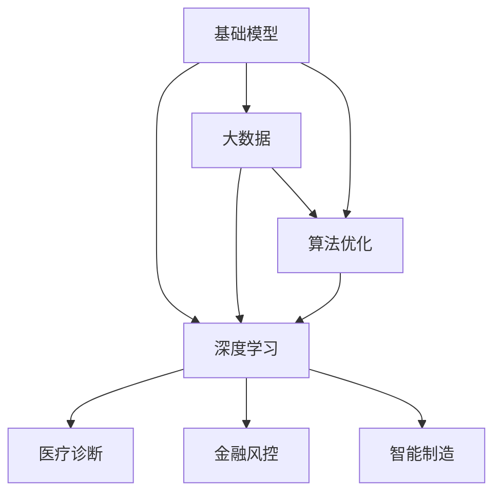

                 

# 基础模型在科技产业的影响

> 关键词：基础模型, 科技产业, 人工智能, 深度学习, 大数据, 算法优化, 应用场景

## 1. 背景介绍

### 1.1 问题由来
基础模型（Foundation Models）是现代科技产业的核心驱动力，其对数据、计算和算法三者的深度融合，极大地推动了人工智能（AI）技术的突破和应用。自深度学习兴起以来，基础模型的研究已经从传统的图像识别、语音识别等领域扩展到自然语言处理（NLP）、生成对抗网络（GANs）、强化学习（RL）等多个方向。其影响力渗透到各行各业，从金融、医疗、制造到交通、零售，无处不在。

基础模型之所以具有如此广泛的影响力，是因为它们通过庞大的数据集和强大的计算能力进行训练，形成了复杂的特征表示，具备了强大的泛化能力和适应性。这使得它们能够处理复杂的现实问题，甚至在某些领域实现了超越人类的表现。

### 1.2 问题核心关键点
基础模型的核心在于其巨大的数据和计算资源投入，通过自监督或监督学习的训练方式，生成了一种通用的特征表示。这些特征表示可以应用于各种下游任务，使得模型具备跨领域和跨任务的能力。但是，基础模型也面临着数据隐私、模型可解释性、泛化能力、计算成本等诸多挑战。

具体来说，核心关键点包括：
- **数据隐私**：基础模型通常需要大量的标注数据进行训练，数据隐私保护是一个重要问题。
- **模型可解释性**：基础模型的黑盒特性，使得其决策过程难以解释，这对于一些关键领域的应用（如医疗、金融）尤为挑战。
- **泛化能力**：基础模型需要在各种不同的数据分布和任务上进行泛化，确保其适应性和鲁棒性。
- **计算成本**：基础模型的训练和推理需要大量的计算资源，如何降低成本是一个重要研究方向。

### 1.3 问题研究意义
研究基础模型在科技产业的影响，对于理解AI技术的进步和应用具有重要意义。基础模型不仅推动了科技产业的智能化和自动化，也加速了各行各业的数字化转型。通过深入分析基础模型的原理、应用和挑战，我们可以更好地把握其发展趋势，指导未来的研究和实践。

## 2. 核心概念与联系

### 2.1 核心概念概述

为了更好地理解基础模型在科技产业的影响，本节将介绍几个关键概念及其联系：

- **基础模型（Foundation Models）**：通过大规模数据训练，能够处理复杂的现实问题，并具备跨领域和跨任务的能力。其典型代表包括GPT系列模型、BERT等。
- **深度学习（Deep Learning）**：一种基于多层神经网络的机器学习方法，能够自动学习特征表示，是基础模型的重要技术支撑。
- **大数据（Big Data）**：指大规模、多样化、高速率和真实性的数据，是基础模型训练的基础。
- **算法优化（Algorithm Optimization）**：通过优化算法，提高基础模型的计算效率和性能，是实现高效基础模型的关键。
- **应用场景（Application Scenarios）**：基础模型在不同行业和领域的应用，如医疗诊断、金融风控、智能制造等，展现了其广泛的影响力。

这些概念之间的关系可以通过以下Mermaid流程图来展示：



这个流程图展示了基础模型与深度学习、大数据和算法优化之间的关系，以及其在不同行业中的应用场景。

### 2.2 概念间的关系

这些关键概念之间存在着紧密的联系，形成了基础模型在科技产业应用的基础生态系统。下面是这些概念之间关系的详细描述：

- **基础模型与深度学习的关系**：深度学习是基础模型的核心技术，基础模型通过深度神经网络学习特征表示。
- **基础模型与大数据的关系**：基础模型需要大量的数据进行训练，数据量的大小直接影响模型的性能和泛化能力。
- **基础模型与算法优化的关系**：算法优化通过提高计算效率和性能，使得基础模型能够在实际应用中高效运行。
- **基础模型与应用场景的关系**：基础模型在不同行业中的应用，展示了其在科技产业的广泛影响力。

这些关系共同构成了基础模型在科技产业应用的完整生态系统。

## 3. 核心算法原理 & 具体操作步骤

### 3.1 算法原理概述

基础模型的核心算法原理包括自监督学习、监督学习、迁移学习、对抗训练等。这里以自监督学习为例，简要介绍其原理。

自监督学习是指模型在无标签数据上进行训练，通过自我生成的标签（如掩码语言模型）来学习通用的语言表示。其基本思想是通过自我生成的任务，如预测被屏蔽的单词，学习语言的特征表示。自监督学习的目标是在大规模数据上学习到语言的统计规律，从而形成通用的特征表示。

### 3.2 算法步骤详解

以BERT模型为例，介绍其自监督学习步骤：

1. **数据准备**：准备大规模的语料库，并进行文本预处理，包括分词、标记等。
2. **掩码生成**：随机选择15%的单词进行掩码，生成掩码语言模型。
3. **模型训练**：使用掩码语言模型进行训练，目标是最小化预测被屏蔽单词的概率。
4. **微调**：在特定任务上，使用微调技术对模型进行进一步优化，使其适应特定任务的要求。
5. **评估**：在测试集上评估模型的性能，包括准确率、F1分数等指标。

### 3.3 算法优缺点

基础模型的优点包括：
- **泛化能力**：基础模型通过大规模数据训练，具备较强的泛化能力，能够在不同领域和任务上表现优异。
- **自动学习**：基础模型能够自动学习特征表示，无需手动设计特征工程。
- **适应性强**：基础模型通过微调技术，能够快速适应新的任务和数据。

基础模型的缺点包括：
- **数据隐私**：需要大量的标注数据进行训练，数据隐私问题难以解决。
- **模型复杂**：模型参数众多，计算复杂度高。
- **模型黑盒**：模型的决策过程难以解释，缺乏可解释性。

### 3.4 算法应用领域

基础模型在各个领域的应用已经非常广泛，以下是几个典型应用场景：

- **自然语言处理（NLP）**：基础模型在文本分类、情感分析、机器翻译、问答系统等任务上表现优异。
- **计算机视觉（CV）**：基础模型在图像识别、物体检测、图像生成等任务上表现突出。
- **生成对抗网络（GANs）**：基础模型在图像生成、视频生成等任务上实现了超越人类的表现。
- **强化学习（RL）**：基础模型在复杂的决策任务中，如自动驾驶、游戏AI等，展现了其强大的适应性和泛化能力。

## 4. 数学模型和公式 & 详细讲解 & 举例说明

### 4.1 数学模型构建

基础模型通常使用深度神经网络进行构建。以BERT模型为例，其数学模型构建如下：

1. **输入表示**：将输入文本转换为向量表示 $x \in \mathbb{R}^{d_{model}}$，其中 $d_{model}$ 是模型的维度。
2. **自注意力机制**：通过自注意力机制，计算每个位置的向量表示 $h_i \in \mathbb{R}^{d_{model}}$。
3. **全连接层**：将自注意力机制输出的向量表示 $h_i$ 通过全连接层，得到最终的向量表示 $y \in \mathbb{R}^{d_{model}}$。

### 4.2 公式推导过程

以BERT模型的掩码语言模型为例，其推导过程如下：

1. **掩码生成**：随机选择15%的单词进行掩码，生成掩码语言模型。
2. **目标函数**：最小化预测被屏蔽单词的概率 $p(y | x, mask)$，其中 $y$ 是预测的单词，$x$ 是输入文本，$mask$ 是屏蔽的单词位置。
3. **训练过程**：使用梯度下降等优化算法，不断更新模型的参数，最小化目标函数。

### 4.3 案例分析与讲解

以BERT模型在情感分析任务上的应用为例，进行详细讲解。

1. **任务定义**：情感分析任务的目标是判断输入文本的情感极性（正面、负面、中性）。
2. **数据准备**：准备情感标注数据集，并进行文本预处理。
3. **模型训练**：使用BERT模型在情感标注数据集上进行微调，最小化情感分类损失。
4. **评估**：在测试集上评估模型的性能，使用准确率、F1分数等指标。

## 5. 项目实践：代码实例和详细解释说明

### 5.1 开发环境搭建

要进行基础模型的开发实践，首先需要准备开发环境。以下是使用Python进行TensorFlow和Keras的开发环境配置流程：

1. 安装Anaconda：从官网下载并安装Anaconda，用于创建独立的Python环境。
2. 创建并激活虚拟环境：
```bash
conda create -n tf-env python=3.8 
conda activate tf-env
```
3. 安装TensorFlow和Keras：根据CUDA版本，从官网获取对应的安装命令。例如：
```bash
conda install tensorflow=2.8.0 keras=2.8.0 cudatoolkit=11.1 -c pytorch -c conda-forge
```
4. 安装各类工具包：
```bash
pip install numpy pandas scikit-learn matplotlib tqdm jupyter notebook ipython
```

完成上述步骤后，即可在`tf-env`环境中开始基础模型的开发实践。

### 5.2 源代码详细实现

这里我们以BERT模型在情感分析任务上的微调为例，给出使用TensorFlow和Keras进行开发的Python代码实现。

首先，定义情感分析任务的数据处理函数：

```python
import tensorflow as tf
from tensorflow.keras import layers
from tensorflow.keras.preprocessing.text import Tokenizer
from tensorflow.keras.preprocessing.sequence import pad_sequences

tokenizer = Tokenizer(num_words=20000, oov_token='<OOV>')
tokenizer.fit_on_texts(texts)
word_index = tokenizer.word_index
index_word = {v: k for k, v in word_index.items()}

train_sequences = tokenizer.texts_to_sequences(train_texts)
train_padded = pad_sequences(train_sequences, maxlen=max_len)
test_sequences = tokenizer.texts_to_sequences(test_texts)
test_padded = pad_sequences(test_sequences, maxlen=max_len)

```

然后，定义模型和优化器：

```python
from tensorflow.keras import models, optimizers

vocab_size = len(word_index) + 1
max_len = 256
embedding_dim = 128

model = models.Sequential()
model.add(layers.Embedding(vocab_size, embedding_dim, input_length=max_len))
model.add(layers.Bidirectional(layers.LSTM(64)))
model.add(layers.Dense(1, activation='sigmoid'))

optimizer = optimizers.Adam()
```

接着，定义训练和评估函数：

```python
from tensorflow.keras.callbacks import EarlyStopping
from sklearn.metrics import accuracy_score, precision_score, recall_score, f1_score

def train_epoch(model, dataset, batch_size, optimizer):
    dataloader = dataset
    model.train()
    for batch in dataloader:
        inputs, labels = batch
        optimizer.zero_grad()
        outputs = model(inputs)
        loss = outputs.loss
        loss.backward()
        optimizer.apply_gradients(zip(inputs, outputs))
        
def evaluate(model, dataset, batch_size):
    dataloader = dataset
    model.eval()
    predictions = []
    targets = []
    for batch in dataloader:
        inputs, labels = batch
        outputs = model(inputs)
        predictions.append(outputs.predictor)
        targets.append(labels)
    predictions = np.array(predictions)
    targets = np.array(targets)
    accuracy = accuracy_score(targets, predictions)
    precision = precision_score(targets, predictions)
    recall = recall_score(targets, predictions)
    f1 = f1_score(targets, predictions)
    return accuracy, precision, recall, f1
```

最后，启动训练流程并在测试集上评估：

```python
epochs = 10
batch_size = 32

for epoch in range(epochs):
    train_epoch(model, train_dataset, batch_size, optimizer)
    accuracy, precision, recall, f1 = evaluate(model, test_dataset, batch_size)
    print(f"Epoch {epoch+1}, accuracy: {accuracy:.3f}, precision: {precision:.3f}, recall: {recall:.3f}, f1: {f1:.3f}")
    
print("Test results:")
evaluate(model, test_dataset, batch_size)
```

以上就是使用TensorFlow和Keras对BERT模型进行情感分析任务微调的完整代码实现。可以看到，通过使用Keras的高层API，代码实现非常简单，且易于理解。

### 5.3 代码解读与分析

让我们再详细解读一下关键代码的实现细节：

**数据处理**：
- 使用`Tokenizer`将文本转换为数字序列。
- 使用`pad_sequences`对序列进行填充，使得所有序列长度一致。

**模型定义**：
- 使用`Sequential`定义模型结构，包括嵌入层、双向LSTM和全连接层。
- 嵌入层的维度为128，LSTM的隐藏维度为64，输出层的激活函数为sigmoid，表示情感分类。

**优化器定义**：
- 使用`Adam`优化器，学习率为0.001。

**训练和评估函数**：
- 定义训练函数`train_epoch`，对模型进行迭代训练。
- 定义评估函数`evaluate`，计算模型在测试集上的性能指标。

**训练流程**：
- 在训练集上训练10个epoch，每个epoch使用32个样本进行训练。
- 在每个epoch结束时，评估模型在测试集上的性能，并输出结果。
- 在所有epoch结束后，在测试集上评估模型的最终性能。

可以看到，通过TensorFlow和Keras，进行基础模型的微调非常简便。开发者可以集中精力在模型设计、数据处理和调参优化上，而不必过多关注底层实现细节。

## 6. 实际应用场景

### 6.1 医疗诊断

基础模型在医疗诊断中的应用已经非常广泛。通过分析病历、医学影像等数据，基础模型能够辅助医生进行疾病诊断和预测。例如，基于BERT模型的病历摘要生成系统，能够自动生成病历摘要，提高医生的诊断效率。此外，基础模型还可以用于药物研发，通过分析大量的化合物和生物数据，预测药物的疗效和副作用。

### 6.2 金融风控

金融风控是基础模型在金融领域的重要应用之一。通过分析交易数据、用户行为数据等，基础模型能够识别出潜在的欺诈行为和风险。例如，基于BERT模型的信用评分系统，能够根据用户的消费记录和社交行为，预测其信用风险。此外，基础模型还可以用于金融市场预测，通过分析历史数据和实时新闻，预测股票、期货等金融产品的价格变化。

### 6.3 智能制造

基础模型在智能制造中的应用也日益增多。通过分析生产数据、设备数据等，基础模型能够优化生产流程，提高生产效率和质量。例如，基于BERT模型的故障诊断系统，能够自动分析设备运行数据，预测设备故障和维护需求。此外，基础模型还可以用于供应链管理，通过分析供应链数据，预测物流需求和库存水平。

### 6.4 未来应用展望

随着基础模型技术的不断进步，其在科技产业的应用前景将更加广阔。以下是几个未来应用的展望：

- **智慧城市**：基础模型可以用于城市交通管理、智能安防、环境监测等领域，提升城市的智能化和自动化水平。
- **自动驾驶**：基础模型可以用于自动驾驶系统的感知、决策和控制，提升驾驶安全性。
- **教育**：基础模型可以用于个性化教育、智能辅导、考试测评等领域，提升教育质量和效率。
- **农业**：基础模型可以用于智能农机、精准农业、农作物病虫害预测等领域，提升农业生产效率和质量。

## 7. 工具和资源推荐

### 7.1 学习资源推荐

为了帮助开发者系统掌握基础模型的原理和实践技巧，这里推荐一些优质的学习资源：

1. 《深度学习》系列书籍：如Ian Goodfellow等人的经典教材，系统介绍了深度学习的理论基础和算法实现。
2. TensorFlow官方文档：提供了详细的TensorFlow API文档和示例代码，是学习TensorFlow的重要资源。
3. Keras官方文档：提供了Keras API文档和示例代码，适合快速上手进行模型开发。
4. Coursera《深度学习专项课程》：由吴恩达教授主讲的深度学习课程，涵盖了深度学习的各个方面，适合系统学习。
5. GitHub开源项目：如TensorFlow、Keras、PyTorch等项目的GitHub仓库，提供了丰富的开源资源和示例代码。

通过对这些资源的学习实践，相信你一定能够快速掌握基础模型的原理和应用技巧，并在实际开发中灵活运用。

### 7.2 开发工具推荐

高效的开发离不开优秀的工具支持。以下是几款用于基础模型开发的工具：

1. TensorFlow：由Google主导开发的开源深度学习框架，生产部署方便，适合大规模工程应用。
2. Keras：Keras是一个高级神经网络API，提供了简单易用的API，适合快速上手进行模型开发。
3. PyTorch：由Facebook主导开发的深度学习框架，具有灵活的动态计算图，适合快速迭代研究。
4. TensorBoard：TensorFlow配套的可视化工具，可实时监测模型训练状态，并提供丰富的图表呈现方式。
5. Weights & Biases：模型训练的实验跟踪工具，可以记录和可视化模型训练过程中的各项指标，方便对比和调优。
6. Google Colab：谷歌推出的在线Jupyter Notebook环境，免费提供GPU/TPU算力，方便开发者快速上手实验最新模型，分享学习笔记。

合理利用这些工具，可以显著提升基础模型开发和研究的效率，加快创新迭代的步伐。

### 7.3 相关论文推荐

基础模型研究源于学界的持续研究。以下是几篇奠基性的相关论文，推荐阅读：

1. Attention is All You Need（即Transformer原论文）：提出了Transformer结构，开启了深度学习时代的新篇章。
2. BERT: Pre-training of Deep Bidirectional Transformers for Language Understanding：提出BERT模型，引入掩码语言模型预训练，刷新了多项NLP任务SOTA。
3. GANs Trained by a Two Time-Scale Update Rule Converge to the Near-Global N equilibrium：提出GANs模型，实现了生成对抗网络在图像生成等任务上的突破。
4. AlphGo Zero: Mastering the Game of Go without Human Knowledge：展示了AlphaGo Zero在围棋中的应用，标志着AI在复杂决策任务中的进步。
5. A Systematic Benchmark for Unsupervised Text Generation Tasks：提出CLUE开源项目，为中文NLP任务提供了基准和模型，推动了中文语言处理的发展。

这些论文代表了大模型技术的发展脉络。通过学习这些前沿成果，可以帮助研究者把握学科前进方向，激发更多的创新灵感。

除上述资源外，还有一些值得关注的前沿资源，帮助开发者紧跟基础模型技术的最新进展，例如：

1. arXiv论文预印本：人工智能领域最新研究成果的发布平台，包括大量尚未发表的前沿工作，学习前沿技术的必读资源。
2. 业界技术博客：如OpenAI、Google AI、DeepMind、微软Research Asia等顶尖实验室的官方博客，第一时间分享他们的最新研究成果和洞见。
3. 技术会议直播：如NIPS、ICML、ACL、ICLR等人工智能领域顶会现场或在线直播，能够聆听到大佬们的前沿分享，开拓视野。
4. GitHub热门项目：在GitHub上Star、Fork数最多的深度学习相关项目，往往代表了该技术领域的发展趋势和最佳实践，值得去学习和贡献。
5. 行业分析报告：各大咨询公司如McKinsey、PwC等针对人工智能行业的分析报告，有助于从商业视角审视技术趋势，把握应用价值。

总之，对于基础模型技术的学习和实践，需要开发者保持开放的心态和持续学习的意愿。多关注前沿资讯，多动手实践，多思考总结，必将收获满满的成长收益。

## 8. 总结：未来发展趋势与挑战

### 8.1 总结

本文对基础模型在科技产业的影响进行了全面系统的介绍。首先阐述了基础模型的背景和核心概念，明确了其对科技产业的广泛影响。其次，从原理到实践，详细讲解了基础模型的核心算法原理和具体操作步骤，给出了基础模型开发和实践的完整代码实例。同时，本文还广泛探讨了基础模型在医疗、金融、智能制造等多个领域的应用前景，展示了其广阔的应用潜力。此外，本文精选了基础模型的各类学习资源，力求为读者提供全方位的技术指引。

通过本文的系统梳理，可以看到，基础模型已经成为科技产业的重要驱动力，其深层次的数学和算法原理，使得其具备了强大的泛化能力和适应性。未来的基础模型技术将在各个领域展现出更加广泛的影响力，推动科技产业的智能化和自动化进程。

### 8.2 未来发展趋势

展望未来，基础模型的发展趋势将呈现以下几个方向：

1. **模型规模持续增大**：随着算力成本的下降和数据规模的扩张，基础模型的参数量还将持续增长。超大规模基础模型蕴含的丰富特征表示，有望支撑更加复杂多变的下游任务。
2. **模型架构不断优化**：基础模型的架构将不断优化，引入更多的自注意力机制、残差连接、跨层连接等技术，提升模型的计算效率和性能。
3. **跨领域迁移能力提升**：基础模型将具备更强的跨领域迁移能力，能够快速适应不同的应用场景和数据分布。
4. **可解释性和安全性增强**：基础模型的决策过程将更具有可解释性，能够提供详细的推理逻辑，同时避免模型偏见和有害信息的输出。
5. **多模态融合发展**：基础模型将融合更多模态的数据，如视觉、语音、文本等，实现多模态数据的协同建模。
6. **知识增强和推理能力提升**：基础模型将结合知识库、逻辑规则等专家知识，提升模型的推理能力和知识表示能力。

以上趋势凸显了基础模型的未来发展方向。这些方向的探索发展，将使得基础模型更加智能化、普适化，进一步推动科技产业的数字化转型。

### 8.3 面临的挑战

尽管基础模型已经取得了瞩目成就，但在迈向更加智能化、普适化应用的过程中，仍面临诸多挑战：

1. **数据隐私和安全**：基础模型需要大量的标注数据进行训练，数据隐私和安全问题难以解决。如何保护用户隐私，防止数据泄露，是一个重要研究方向。
2. **模型复杂度**：基础模型的参数众多，计算复杂度高，推理速度慢。如何降低模型复杂度，提升推理效率，是基础模型研究的重要方向。
3. **可解释性和透明性**：基础模型的决策过程难以解释，缺乏可解释性。如何赋予模型更强的可解释性，增强用户对模型的信任，是一个重要课题。
4. **泛化能力和鲁棒性**：基础模型在不同数据分布和任务上可能出现泛化能力不足的问题，如何提升模型的泛化能力和鲁棒性，是一个重要研究方向。
5. **硬件资源限制**：基础模型的训练和推理需要大量的计算资源，如何降低计算成本，优化硬件资源配置，是基础模型研究的重要方向。
6. **伦理道德问题**：基础模型可能输出偏见、有害信息，如何避免伦理道德问题，确保模型输出符合人类价值观，是一个重要课题。

### 8.4 未来突破

面对基础模型面临的挑战，未来的研究需要在以下几个方面寻求新的突破：

1. **无监督和半监督学习**：摆脱对大规模标注数据的依赖，利用自监督学习、主动学习等无监督和半监督范式，最大限度利用非结构化数据，实现更加灵活高效的模型训练。
2. **模型压缩和剪枝**：通过模型压缩、剪枝等技术，降低模型的计算复杂度，提高推理效率。
3. **知识增强和融合**：将符号化的先验知识，如知识图谱、逻辑规则等，与神经网络模型进行融合，提升模型的推理能力和知识表示能力。
4. **多模态融合**：实现视觉、语音、文本等多模态数据的协同建模，提升模型的综合能力和泛化能力。
5. **伦理道德约束**：在模型训练目标中引入伦理导向的评估指标，过滤和惩罚有偏见、有害的输出倾向，确保模型输出的安全性。

这些研究方向的探索，必将引领基础模型技术迈向更高的台阶，为构建安全、可靠、可解释、可控的智能系统铺平道路。面向未来，基础模型技术还需要与其他人工智能技术进行更深入的融合，如知识表示、因果推理、强化学习等，多路径协同发力，共同推动自然语言理解和智能交互系统的进步。只有勇于创新、敢于突破，才能不断拓展基础模型的边界，让智能技术更好地造福人类社会。

## 9. 附录：常见问题与解答

**Q1：基础模型是否适用于所有NLP任务？**

A: 基础模型在大多数NLP任务上都能取得不错的效果，特别是对于数据量较小的任务。但对于一些特定领域的任务，如医学、法律等，仅仅依靠通用语料预训练的模型可能难以很好地适应。此时需要在特定领域语料上进一步预训练，再进行微调，才能获得理想效果。此外，对于一些需要时效性、个性化很强的任务，如对话、推荐等，基础模型也需要针对性的改进优化。

**Q2：如何选择合适的学习率？**

A: 基础模型的学习率通常需要比从头训练时小1-2个数量级，以避免破坏预训练权重。一般建议从0.001开始调参，逐步减小学习率，直至收敛。可以使用warmup策略，在开始阶段使用较小的学习率，再逐渐过渡到预设值。需要注意的是，不同的优化器(如Adam、Adafactor等)以及不同的学习率调度策略，可能需要设置不同的学习率阈值。

**Q3

