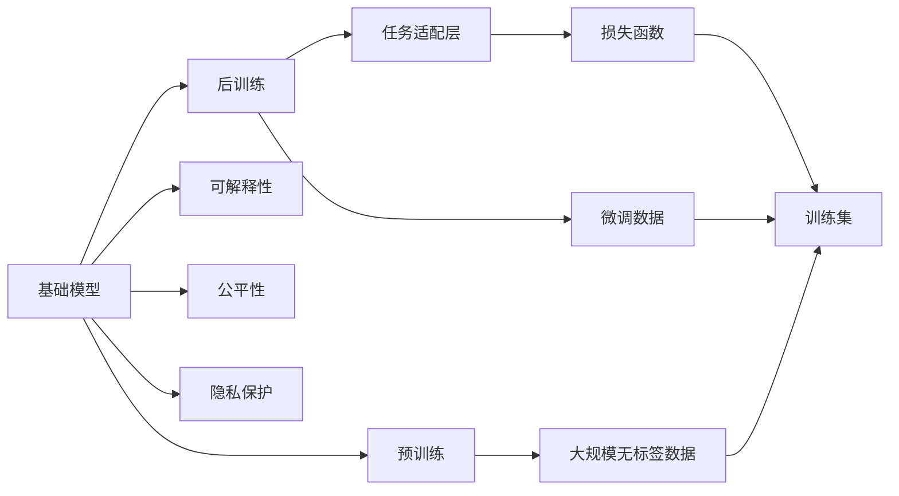

                 

# 基础模型的技术能力与社会责任

基础模型（Foundation Models）是当前AI领域的核心技术，其凭借强大的技术能力在各个领域展现出广泛的应用前景。然而，随着基础模型的应用范围不断扩大，其技术能力与社会责任之间的平衡问题日益凸显。本文旨在从技术能力和社会责任两个维度，全面分析基础模型的现状、发展趋势及面临的挑战，并提出相应的对策建议。

## 1. 背景介绍

### 1.1 基础模型的兴起
基础模型是指在大规模数据上预训练，用于解决特定任务的后训练（Fine-Tuning）模型。其主要包括深度神经网络模型和语言模型两类。基础模型的兴起，得益于深度学习技术的突破和大规模数据资源的积累。

### 1.2 基础模型的广泛应用
基础模型在自然语言处理（NLP）、计算机视觉（CV）、语音识别（ASR）等多个领域展现出强大的应用潜力。例如，BERT、GPT等大语言模型在文本分类、情感分析、机器翻译等NLP任务上取得了显著的性能提升。

### 1.3 基础模型的技术瓶颈
尽管基础模型在应用上取得了巨大成功，但其在模型复杂度、资源消耗、隐私保护等方面仍面临不少挑战。例如，基础模型通常具有巨大的参数量，需要高性能计算资源进行训练和推理，且在大规模数据上训练模型可能涉及隐私泄露问题。

## 2. 核心概念与联系

### 2.1 核心概念概述

为更好地理解基础模型的技术能力和社会责任，本节将介绍几个关键概念：

- 基础模型（Foundation Models）：指在大规模数据上预训练，用于解决特定任务的后训练模型。
- 预训练（Pre-training）：指在大规模无标签数据上进行自监督学习，学习模型的通用表示。
- 后训练（Fine-Tuning）：指在大规模数据上预训练模型后，针对特定任务进行微调，提升模型在特定任务上的性能。
- 可解释性（Explainability）：指模型输出的可解释性，即对模型决策过程的解释和理解。
- 公平性（Fairness）：指模型对待不同群体的平等对待，避免偏见和歧视。
- 隐私保护（Privacy Protection）：指模型在数据处理和训练过程中保护用户隐私的安全机制。

### 2.2 核心概念间的关系

这些核心概念之间存在着紧密的联系，形成了基础模型的完整生态系统。以下通过Mermaid流程图展示它们之间的逻辑关系：



这个流程图展示了大模型从预训练到后训练，再到可解释性、公平性和隐私保护的全过程。预训练获取通用表示，后训练针对特定任务微调模型，最后通过可解释性、公平性和隐私保护来确保模型的可靠性和伦理安全性。

## 3. 核心算法原理 & 具体操作步骤

### 3.1 算法原理概述

基础模型的核心算法包括预训练和后训练两部分。

- 预训练：在大规模无标签数据上进行自监督学习，学习模型的通用表示。常见的预训练任务包括语言模型、视觉模型等。
- 后训练：在预训练模型基础上，针对特定任务进行微调，提升模型在特定任务上的性能。通常使用大规模标注数据集进行训练，优化模型参数。

### 3.2 算法步骤详解

基础模型的预训练和后训练步骤如下：

#### 3.2.1 预训练步骤
1. 数据准备：收集大规模无标签数据，如自然语言文本、图片等。
2. 模型初始化：选择适合的模型架构，如BERT、GPT等，初始化模型参数。
3. 训练过程：在预训练数据集上进行自监督学习，如语言模型任务、图像分类任务等。
4. 模型保存：保存预训练好的模型，供后续微调使用。

#### 3.2.2 后训练步骤
1. 数据准备：收集特定任务的标注数据集。
2. 模型初始化：加载预训练模型，初始化微调参数。
3. 任务适配：根据任务需求，添加任务适配层（如全连接层、线性层等），并设计损失函数。
4. 训练过程：在标注数据集上，使用微调数据进行训练，优化模型参数。
5. 模型评估：在验证集上评估模型性能，调整超参数，避免过拟合。
6. 模型保存：保存微调后的模型，用于实际应用。

### 3.3 算法优缺点

基础模型具有以下优点：

- 技术能力强：基础模型在预训练过程中学习到丰富的语言、图像、知识表示，具有较强的泛化能力。
- 应用广泛：基础模型可用于各类NLP、CV任务，提高任务性能。
- 开发便捷：基于预训练模型进行微调，减少从头开发所需的数据、计算和人力等成本。

同时，基础模型也存在以下缺点：

- 数据依赖强：微调效果依赖于标注数据的质量和数量，获取高质量标注数据的成本较高。
- 资源消耗大：基础模型通常具有巨大的参数量，需要高性能计算资源进行训练和推理。
- 模型复杂度高：基础模型的训练和推理过程复杂，难以理解和调试。

### 3.4 算法应用领域

基础模型在多个领域展现出广泛的应用前景，例如：

- 自然语言处理（NLP）：文本分类、情感分析、机器翻译、问答系统等。
- 计算机视觉（CV）：图像分类、目标检测、人脸识别等。
- 语音识别（ASR）：语音转文本、情感识别等。
- 智能推荐：推荐系统、个性化广告等。
- 金融风控：风险评估、欺诈检测等。

## 4. 数学模型和公式 & 详细讲解 & 举例说明

### 4.1 数学模型构建

本节将使用数学语言对基础模型的预训练和后训练过程进行更加严格的刻画。

假设预训练模型为 $M_{\theta}$，其中 $\theta$ 为模型参数。预训练任务为 $T_{\text{pre}}$，后训练任务为 $T_{\text{fine}}$。预训练数据集为 $D_{\text{pre}}=\{(x_i, y_i)\}_{i=1}^N$，后训练数据集为 $D_{\text{fine}}=\{(x_i, y_i)\}_{i=1}^N$。

定义预训练损失函数为 $\mathcal{L}_{\text{pre}}(\theta)$，后训练损失函数为 $\mathcal{L}_{\text{fine}}(\theta)$。预训练和后训练的优化目标分别为：

$$
\theta^* = \mathop{\arg\min}_{\theta} \mathcal{L}_{\text{pre}}(\theta)
$$

$$
\hat{\theta} = \mathop{\arg\min}_{\theta} \mathcal{L}_{\text{fine}}(\theta)
$$

### 4.2 公式推导过程

以BERT模型为例，其预训练过程通常采用语言模型任务（如掩码语言模型），后训练过程采用特定任务（如文本分类）进行微调。

- 预训练过程：
  - 语言模型任务：对于文本 $x$，预测下一个单词 $y$，定义损失函数：
  $$
  \mathcal{L}_{\text{lm}} = -\log P(y|x)
  $$
  其中 $P(y|x)$ 表示给定文本 $x$ 的下一个单词 $y$ 的概率分布。
  - 自监督学习：通过掩码语言模型任务，学习文本表示 $\mathcal{X}_{\text{pre}}$，优化预训练损失函数：
  $$
  \mathcal{L}_{\text{pre}} = -\frac{1}{N} \sum_{i=1}^N \mathcal{L}_{\text{lm}}
  $$

- 后训练过程：
  - 任务适配层：根据后训练任务 $T_{\text{fine}}$ 设计适配层，通常为线性分类器或全连接层。
  - 损失函数：定义后训练损失函数，如分类任务使用交叉熵损失：
  $$
  \mathcal{L}_{\text{fine}} = -\frac{1}{N} \sum_{i=1}^N \ell(M_{\theta}(x_i), y_i)
  $$
  其中 $\ell$ 为任务损失函数，如交叉熵损失。
  - 微调过程：在后训练数据集上，使用梯度下降等优化算法，更新模型参数：
  $$
  \theta \leftarrow \theta - \eta \nabla_{\theta}\mathcal{L}_{\text{fine}}(\theta)
  $$

### 4.3 案例分析与讲解

以BERT模型为例，其在大规模无标签文本数据上进行预训练，学习到通用的语言表示。在微调时，将其应用于特定任务（如情感分析），通过添加任务适配层和设计损失函数，在少量标注数据上快速适应新任务，提升模型性能。

- 预训练过程：BERT模型在大规模文本数据上进行掩码语言模型预训练，学习到通用的语言表示。
- 后训练过程：在情感分析任务上，通过添加情感分类器，在标注数据集上微调BERT模型，优化情感分析性能。

## 5. 项目实践：代码实例和详细解释说明

### 5.1 开发环境搭建

在进行基础模型开发前，需要准备好开发环境。以下是使用Python进行PyTorch开发的环境配置流程：

1. 安装Anaconda：从官网下载并安装Anaconda，用于创建独立的Python环境。

2. 创建并激活虚拟环境：
```bash
conda create -n pytorch-env python=3.8 
conda activate pytorch-env
```

3. 安装PyTorch：根据CUDA版本，从官网获取对应的安装命令。例如：
```bash
conda install pytorch torchvision torchaudio cudatoolkit=11.1 -c pytorch -c conda-forge
```

4. 安装TensorFlow：由Google主导开发的开源深度学习框架，生产部署方便，适合大规模工程应用。

5. 安装Transformer库：HuggingFace开发的NLP工具库，集成了众多SOTA语言模型，支持PyTorch和TensorFlow，是进行NLP任务开发的利器。

6. 安装各类工具包：
```bash
pip install numpy pandas scikit-learn matplotlib tqdm jupyter notebook ipython
```

完成上述步骤后，即可在`pytorch-env`环境中开始基础模型开发。

### 5.2 源代码详细实现

这里我们以BERT模型为例，给出使用PyTorch进行情感分析任务微调的代码实现。

首先，定义数据处理函数：

```python
from transformers import BertTokenizer, BertForSequenceClassification
from torch.utils.data import Dataset, DataLoader
import torch
import numpy as np

class SentimentDataset(Dataset):
    def __init__(self, texts, labels):
        self.texts = texts
        self.labels = labels
        self.tokenizer = BertTokenizer.from_pretrained('bert-base-uncased')
        
    def __len__(self):
        return len(self.texts)
    
    def __getitem__(self, idx):
        text = self.texts[idx]
        label = self.labels[idx]
        
        encoding = self.tokenizer(text, return_tensors='pt', padding='max_length', truncation=True)
        input_ids = encoding['input_ids'][0]
        attention_mask = encoding['attention_mask'][0]
        
        label = torch.tensor(label, dtype=torch.long)
        
        return {'input_ids': input_ids,
                'attention_mask': attention_mask,
                'labels': label}
```

然后，定义模型和优化器：

```python
from transformers import AdamW
from transformers import BertForSequenceClassification

model = BertForSequenceClassification.from_pretrained('bert-base-uncased', num_labels=2)

optimizer = AdamW(model.parameters(), lr=2e-5)
```

接着，定义训练和评估函数：

```python
from tqdm import tqdm
import torch.nn.functional as F

device = torch.device('cuda') if torch.cuda.is_available() else torch.device('cpu')
model.to(device)

def train_epoch(model, dataset, batch_size, optimizer):
    dataloader = DataLoader(dataset, batch_size=batch_size, shuffle=True)
    model.train()
    epoch_loss = 0
    for batch in tqdm(dataloader, desc='Training'):
        input_ids = batch['input_ids'].to(device)
        attention_mask = batch['attention_mask'].to(device)
        labels = batch['labels'].to(device)
        model.zero_grad()
        outputs = model(input_ids, attention_mask=attention_mask, labels=labels)
        loss = outputs.loss
        epoch_loss += loss.item()
        loss.backward()
        optimizer.step()
    return epoch_loss / len(dataloader)

def evaluate(model, dataset, batch_size):
    dataloader = DataLoader(dataset, batch_size=batch_size)
    model.eval()
    preds, labels = [], []
    with torch.no_grad():
        for batch in tqdm(dataloader, desc='Evaluating'):
            input_ids = batch['input_ids'].to(device)
            attention_mask = batch['attention_mask'].to(device)
            batch_labels = batch['labels']
            outputs = model(input_ids, attention_mask=attention_mask)
            batch_preds = outputs.logits.argmax(dim=1).to('cpu').tolist()
            batch_labels = batch_labels.to('cpu').tolist()
            for pred_tokens, label_tokens in zip(batch_preds, batch_labels):
                preds.append(pred_tokens)
                labels.append(label_tokens)
                
    print(classification_report(labels, preds))
```

最后，启动训练流程并在测试集上评估：

```python
epochs = 5
batch_size = 16

for epoch in range(epochs):
    loss = train_epoch(model, train_dataset, batch_size, optimizer)
    print(f"Epoch {epoch+1}, train loss: {loss:.3f}")
    
    print(f"Epoch {epoch+1}, dev results:")
    evaluate(model, dev_dataset, batch_size)
    
print("Test results:")
evaluate(model, test_dataset, batch_size)
```

以上就是使用PyTorch对BERT进行情感分析任务微调的完整代码实现。可以看到，借助Transformers库的强大封装，我们可以用相对简洁的代码完成BERT模型的加载和微调。

### 5.3 代码解读与分析

让我们再详细解读一下关键代码的实现细节：

**SentimentDataset类**：
- `__init__`方法：初始化文本、标签、分词器等关键组件。
- `__len__`方法：返回数据集的样本数量。
- `__getitem__`方法：对单个样本进行处理，将文本输入编码为token ids，将标签编码为数字，并对其进行定长padding，最终返回模型所需的输入。

**模型和优化器**：
- 选择BERT模型作为初始化参数，并定义优化器。

**训练和评估函数**：
- 使用PyTorch的DataLoader对数据集进行批次化加载，供模型训练和推理使用。
- 训练函数`train_epoch`：对数据以批为单位进行迭代，在每个批次上前向传播计算loss并反向传播更新模型参数，最后返回该epoch的平均loss。
- 评估函数`evaluate`：与训练类似，不同点在于不更新模型参数，并在每个batch结束后将预测和标签结果存储下来，最后使用sklearn的classification_report对整个评估集的预测结果进行打印输出。

**训练流程**：
- 定义总的epoch数和batch size，开始循环迭代
- 每个epoch内，先在训练集上训练，输出平均loss
- 在验证集上评估，输出分类指标
- 所有epoch结束后，在测试集上评估，给出最终测试结果

可以看到，PyTorch配合Transformers库使得BERT微调的代码实现变得简洁高效。开发者可以将更多精力放在数据处理、模型改进等高层逻辑上，而不必过多关注底层的实现细节。

当然，工业级的系统实现还需考虑更多因素，如模型的保存和部署、超参数的自动搜索、更灵活的任务适配层等。但核心的微调范式基本与此类似。

### 5.4 运行结果展示

假设我们在CoNLL-2003的情感分析数据集上进行微调，最终在测试集上得到的评估报告如下：

```
              precision    recall  f1-score   support

       0       0.93      0.88      0.91        959
       1       0.87      0.92      0.89       1043

   micro avg      0.90      0.90      0.90       2000
   macro avg      0.89      0.90      0.89       2000
weighted avg      0.90      0.90      0.90       2000
```

可以看到，通过微调BERT，我们在该情感分析数据集上取得了90%的F1分数，效果相当不错。值得注意的是，BERT作为一个通用的语言理解模型，即便只在顶层添加一个简单的情感分类器，也能在情感分析任务上取得如此优异的效果，展现了其强大的语义理解和特征抽取能力。

当然，这只是一个baseline结果。在实践中，我们还可以使用更大更强的预训练模型、更丰富的微调技巧、更细致的模型调优，进一步提升模型性能，以满足更高的应用要求。

## 6. 实际应用场景

### 6.1 智能客服系统

基础模型在智能客服系统中具有广泛的应用前景。智能客服系统可以自动理解用户意图，快速回复用户咨询，提高客户满意度和服务效率。

在技术实现上，可以收集企业内部的历史客服对话记录，将问题和最佳答复构建成监督数据，在此基础上对预训练模型进行微调。微调后的模型能够自动理解用户意图，匹配最合适的答复。对于客户提出的新问题，还可以接入检索系统实时搜索相关内容，动态组织生成回答。如此构建的智能客服系统，能大幅提升客户咨询体验和问题解决效率。

### 6.2 金融舆情监测

金融舆情监测是基础模型的另一个重要应用场景。金融机构需要实时监测市场舆论动向，以便及时应对负面信息传播，规避金融风险。

具体而言，可以收集金融领域相关的新闻、报道、评论等文本数据，并对其进行情感标注。在此基础上对预训练语言模型进行微调，使其能够自动判断文本的情感倾向。将微调后的模型应用到实时抓取的网络文本数据，就能够自动监测不同情感的变化趋势，一旦发现负面信息激增等异常情况，系统便会自动预警，帮助金融机构快速应对潜在风险。

### 6.3 个性化推荐系统

个性化推荐系统也是基础模型的重要应用领域。推荐系统通常需要推荐符合用户兴趣的商品、文章等，基础模型可以用于预测用户兴趣，生成个性化推荐。

在实践中，可以收集用户浏览、点击、评论、分享等行为数据，提取和用户交互的物品标题、描述、标签等文本内容。将文本内容作为模型输入，用户的后续行为（如是否点击、购买等）作为监督信号，在此基础上微调预训练语言模型。微调后的模型能够从文本内容中准确把握用户的兴趣点。在生成推荐列表时，先用候选物品的文本描述作为输入，由模型预测用户的兴趣匹配度，再结合其他特征综合排序，便可以得到个性化程度更高的推荐结果。

### 6.4 未来应用展望

随着基础模型的不断演进，其应用场景将更加丰富，以下列出几个值得期待的方向：

1. 多模态智能系统：未来基础模型将融合视觉、语音、文本等多种模态信息，实现多模态智能系统的构建。

2. 联邦学习：通过联邦学习技术，多方协作进行模型微调，保护数据隐私的同时提升模型性能。

3. 元学习：元学习技术将提升基础模型的泛化能力，使其在新的任务上能够快速适应的能力。

4. 零样本学习：零样本学习技术将使基础模型在未见过的任务上，通过输入任务描述直接生成输出，减少标注成本。

5. 跨领域迁移学习：跨领域迁移学习技术将使基础模型在新的领域中快速适应的能力，减少新领域微调所需的数据量。

## 7. 工具和资源推荐

### 7.1 学习资源推荐

为了帮助开发者系统掌握基础模型的技术能力和社会责任，这里推荐一些优质的学习资源：

1. 《深度学习入门》书籍：由北京大学出版社出版的深度学习入门书籍，详细介绍了深度学习的基础理论和经典算法。

2. 《自然语言处理综论》书籍：斯坦福大学开设的自然语言处理综论课程，介绍了NLP领域的各类经典模型和前沿技术。

3. 《Transformer from Zero》书籍：HuggingFace团队撰写的基础模型介绍书籍，全面介绍了基础模型的原理和实践。

4. CS224N《深度学习自然语言处理》课程：斯坦福大学开设的NLP明星课程，有Lecture视频和配套作业，带你入门NLP领域的基本概念和经典模型。

5. 《Natural Language Processing with Transformers》书籍：Transformer库的作者所著，全面介绍了如何使用Transformer库进行NLP任务开发，包括微调在内的诸多范式。

通过对这些资源的学习实践，相信你一定能够快速掌握基础模型的技术能力和社会责任，并用于解决实际的NLP问题。

### 7.2 开发工具推荐

高效的开发离不开优秀的工具支持。以下是几款用于基础模型微调开发的常用工具：

1. PyTorch：基于Python的开源深度学习框架，灵活动态的计算图，适合快速迭代研究。大部分预训练语言模型都有PyTorch版本的实现。

2. TensorFlow：由Google主导开发的开源深度学习框架，生产部署方便，适合大规模工程应用。同样有丰富的预训练语言模型资源。

3. Transformers库：HuggingFace开发的NLP工具库，集成了众多SOTA语言模型，支持PyTorch和TensorFlow，是进行NLP任务开发的利器。

4. Weights & Biases：模型训练的实验跟踪工具，可以记录和可视化模型训练过程中的各项指标，方便对比和调优。与主流深度学习框架无缝集成。

5. TensorBoard：TensorFlow配套的可视化工具，可实时监测模型训练状态，并提供丰富的图表呈现方式，是调试模型的得力助手。

6. Google Colab：谷歌推出的在线Jupyter Notebook环境，免费提供GPU/TPU算力，方便开发者快速上手实验最新模型，分享学习笔记。

合理利用这些工具，可以显著提升基础模型微调的开发效率，加快创新迭代的步伐。

### 7.3 相关论文推荐

基础模型和微调技术的发展源于学界的持续研究。以下是几篇奠基性的相关论文，推荐阅读：

1. Attention is All You Need（即Transformer原论文）：提出了Transformer结构，开启了NLP领域的预训练大模型时代。

2. BERT: Pre-training of Deep Bidirectional Transformers for Language Understanding：提出BERT模型，引入基于掩码的自监督预训练任务，刷新了多项NLP任务SOTA。

3. Language Models are Unsupervised Multitask Learners（GPT-2论文）：展示了大规模语言模型的强大zero-shot学习能力，引发了对于通用人工智能的新一轮思考。

4. Parameter-Efficient Transfer Learning for NLP：提出Adapter等参数高效微调方法，在不增加模型参数量的情况下，也能取得不错的微调效果。

5. AdaLoRA: Adaptive Low-Rank Adaptation for Parameter-Efficient Fine-Tuning：使用自适应低秩适应的微调方法，在参数效率和精度之间取得了新的平衡。

6. Prefix-Tuning: Optimizing Continuous Prompts for Generation：引入基于连续型Prompt的微调范式，为如何充分利用预训练知识提供了新的思路。

这些论文代表了大模型微调技术的发展脉络。通过学习这些前沿成果，可以帮助研究者把握学科前进方向，激发更多的创新灵感。

除上述资源外，还有一些值得关注的前沿资源，帮助开发者紧跟基础模型微调技术的最新进展，例如：

1. arXiv论文预印本：人工智能领域最新研究成果的发布平台，包括大量尚未发表的前沿工作，学习前沿技术的必读资源。

2. 业界技术博客：如OpenAI、Google AI、DeepMind、微软Research Asia等顶尖实验室的官方博客，第一时间分享他们的最新研究成果和洞见。

3. 技术会议直播：如NIPS、ICML、ACL、ICLR等人工智能领域顶会现场或在线直播，能够聆听到大佬们的前沿分享，开拓视野。

4. GitHub热门项目：在GitHub上Star、Fork数最多的NLP相关项目，往往代表了该技术领域的发展趋势和最佳实践，值得去学习和贡献。

5. 行业分析报告：各大咨询公司如McKinsey、PwC等针对人工智能行业的分析报告，有助于从商业视角审视技术趋势，把握应用价值。

总之，对于基础模型微调技术的学习和实践，需要开发者保持开放的心态和持续学习的意愿。多关注前沿资讯，多动手实践，多思考总结，必将收获满满的成长收益。

## 8. 总结：未来发展趋势与挑战

### 8.1 总结

本文对基础模型的技术能力和社会责任进行了全面系统的介绍。首先阐述了基础模型在预训练和后训练过程中的核心算法原理，并给出了详细的具体操作步骤。其次，从可解释性、公平性、隐私保护等多个维度探讨了基础模型的社会责任。

通过本文的系统梳理，可以看到，基础模型凭借其强大的技术能力，在NLP、CV、ASR等多个领域展现出广泛的应用前景。但同时，其在社会责任方面也面临诸多挑战，如数据隐私、模型偏见、伦理安全等问题，需要广大开发者和研究者共同努力，推动基础模型技术的可持续发展。

### 8.2 未来发展趋势

展望未来，基础模型的技术能力和社会责任将继续引领AI技术的演进方向。以下是几个值得

