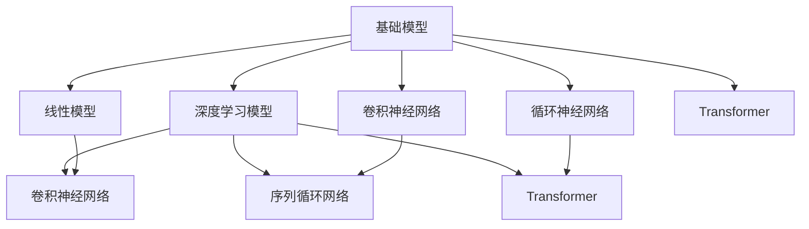

                 

## 1. 背景介绍

人工智能(AI)正逐步渗透到各行业，对社会各个领域产生深远影响。在大数据、云计算等技术支撑下，机器学习、深度学习等前沿技术突飞猛进，为智能化转型奠定了坚实基础。其中，基础模型（Basic Models）因其在AI领域中的重要地位，受到广泛关注和研究。

### 1.1 问题由来

基础模型指的是利用机器学习算法对大量数据进行训练，以提取、表示和预测数据的基础特征，为其他高级模型提供支撑的模型。基础模型广泛应用于自然语言处理(NLP)、计算机视觉(CV)、语音识别(SR)等多个领域，是AI技术的重要基石。

当前，基础模型已从最初的线性模型和朴素贝叶斯模型，发展至深度学习模型如卷积神经网络(CNN)和循环神经网络(RNN)。而深度学习的发展又催生了新的模型架构，如Transformer、BERT等，这些模型在图像识别、自然语言处理等领域取得了突破性的进展。然而，基础模型的发展并非一帆风顺，面对海量数据和复杂任务，模型的训练和应用仍存在诸多挑战。

### 1.2 问题核心关键点

当前，基础模型的研究热点主要集中在以下几个方面：

- **数据和标注**：高质量的数据和标注是模型训练的基石，但在大规模数据集构建、标注工作量和成本等问题上仍面临挑战。
- **模型架构和算法**：基础模型的架构设计、算法优化和硬件加速等技术，如何适应大规模数据和复杂任务，是研究的重点。
- **泛化能力和鲁棒性**：如何提高模型的泛化能力，避免过拟合，增强鲁棒性，对抗数据扰动和攻击。
- **实时性和效率**：在实际应用中，模型需要在保持高精度的同时，实现高效的推理和实时响应。
- **可解释性和公平性**：模型决策过程的可解释性和公平性问题，是AI伦理和治理的重要方面。

## 2. 核心概念与联系

### 2.1 核心概念概述

为理解基础模型的原理和架构，我们需要首先介绍几个关键概念：

- **基础模型(Basic Model)**：指用于提取、表示和预测数据特征的模型，如线性回归模型、卷积神经网络、循环神经网络、Transformer等。
- **深度学习模型(Deep Learning Model)**：指包含多个隐藏层的神经网络，能够自动提取数据的高层次特征，如图像卷积网络、序列循环网络、Transformer等。
- **正则化(Regularization)**：指通过引入惩罚项等手段，避免模型过拟合的技术。
- **对抗训练(Adversarial Training)**：指在训练过程中加入对抗样本，提高模型鲁棒性的技术。
- **特征提取(Feature Extraction)**：指模型从原始数据中提取出高层次、鲁棒性的特征。
- **自监督学习(Self-Supervised Learning)**：指利用未标注的数据进行训练，无需人工标注，提高数据利用率。
- **迁移学习(Transfer Learning)**：指利用已有模型在目标任务上的微调，减少标注需求，提升模型泛化能力。
- **可解释性(Interpretability)**：指模型决策过程的可解释性，即通过可视化的方式理解模型输出。

这些概念构成了基础模型研究的框架，为理解模型的原理和应用提供了理论支撑。

### 2.2 概念间的关系

这些核心概念之间的关系可以通过以下Mermaid流程图来展示：



这个流程图展示了基础模型与各类深度学习模型的关系，以及基础模型中不同类型的网络。线性模型、卷积神经网络、循环神经网络、Transformer等都是基础模型中常见的架构类型。这些模型在提取数据特征、预测输出等方面各具特色，可以相互结合，构建更复杂的模型。

## 3. 核心算法原理 & 具体操作步骤
### 3.1 算法原理概述

基础模型主要基于机器学习与深度学习算法，通过训练大量数据，提取数据的特征并进行预测。其核心算法包括线性回归、卷积神经网络、循环神经网络和Transformer等。

- **线性回归**：利用线性关系，通过最小二乘法拟合数据。适用于数据线性相关性较强的场景，模型简单易于训练。
- **卷积神经网络**：利用卷积操作提取局部特征，通过池化操作降低特征维度，有效处理图像数据。
- **循环神经网络**：通过网络层级间的循环连接，捕捉序列数据的时间依赖关系，适用于语音识别和自然语言处理。
- **Transformer**：基于注意力机制，有效捕捉序列数据间的全局依赖关系，在自然语言处理中表现出色。

### 3.2 算法步骤详解

基础模型的训练过程主要包括数据预处理、模型训练和模型评估三个步骤：

**Step 1: 数据预处理**

- 数据收集：收集用于模型训练的数据集，并进行数据清洗和标注。
- 数据增强：通过数据增强技术，扩充训练集，提高模型的泛化能力。
- 数据划分：将数据集划分为训练集、验证集和测试集。

**Step 2: 模型训练**

- 模型定义：选择合适的模型架构，如线性回归、卷积神经网络、循环神经网络或Transformer等。
- 损失函数：选择适当的损失函数，如均方误差、交叉熵等，衡量模型预测与实际标签之间的差异。
- 优化器：选择优化算法，如SGD、Adam等，通过反向传播更新模型参数。
- 训练迭代：通过多次迭代，最小化损失函数，优化模型参数。

**Step 3: 模型评估**

- 模型验证：在验证集上评估模型性能，调整超参数。
- 模型测试：在测试集上测试模型性能，评估模型泛化能力。

### 3.3 算法优缺点

基础模型具有以下优点：

- **通用性**：适用于多种类型的应用场景，如自然语言处理、图像识别、语音识别等。
- **可解释性**：模型结构和参数较少，更容易解释和调试。
- **低资源要求**：相较于深度学习模型，基础模型需要的计算资源较少。

然而，基础模型也存在一些缺点：

- **特征提取能力有限**：模型难以捕捉复杂的数据结构，特别是在高维数据集上表现不佳。
- **泛化能力不足**：对于新数据和复杂任务，模型容易出现过拟合和泛化能力不足的问题。
- **鲁棒性差**：面对数据扰动和攻击，模型的鲁棒性较差，容易受到干扰。

### 3.4 算法应用领域

基础模型在多个领域有着广泛的应用，以下是几个典型应用场景：

- **图像识别**：利用卷积神经网络，对图像进行分类、检测、分割等任务。
- **自然语言处理**：利用Transformer、循环神经网络等模型，进行文本分类、情感分析、机器翻译等任务。
- **语音识别**：利用循环神经网络，将语音信号转换为文本。
- **推荐系统**：利用线性回归、卷积神经网络等模型，为用户推荐个性化内容。
- **金融预测**：利用线性回归、卷积神经网络等模型，进行市场趋势预测、风险评估等任务。

## 4. 数学模型和公式 & 详细讲解 & 举例说明
### 4.1 数学模型构建

以线性回归模型为例，其数学模型可以表示为：

$$
y = \theta^T x + b
$$

其中，$y$ 为输出变量，$x$ 为输入变量，$\theta$ 为模型参数，$b$ 为偏置项。模型的目标是最小化损失函数，通常采用均方误差（MSE）或交叉熵（CE）损失函数：

$$
L(y, y_{true}) = \frac{1}{n}\sum_{i=1}^n (y_i - y_{true_i})^2
$$

或

$$
L(y, y_{true}) = -\frac{1}{n}\sum_{i=1}^n y_{true_i}log(y_i) + (1-y_{true_i})log(1-y_i)
$$

### 4.2 公式推导过程

以线性回归为例，其参数更新的公式可以表示为：

$$
\theta \leftarrow \theta - \eta \nabla_{\theta}L(\theta)
$$

其中，$\eta$ 为学习率，$\nabla_{\theta}L(\theta)$ 为损失函数对参数 $\theta$ 的梯度。通过反向传播算法计算梯度，并根据梯度更新参数 $\theta$，不断迭代优化模型。

### 4.3 案例分析与讲解

以图像分类任务为例，其数学模型可以表示为：

$$
P(y|x) = softmax(W^Tx + b)
$$

其中，$y$ 为输出标签，$x$ 为输入图像，$W$ 和 $b$ 为模型参数。模型的目标是最小化损失函数，通常采用交叉熵损失函数：

$$
L(y, y_{true}) = -\sum_{i=1}^n y_{true_i}log(y_i)
$$

通过反向传播算法计算梯度，并根据梯度更新模型参数，不断迭代优化模型。

## 5. 项目实践：代码实例和详细解释说明
### 5.1 开发环境搭建

在进行基础模型项目实践前，我们需要准备好开发环境。以下是使用Python进行TensorFlow开发的环境配置流程：

1. 安装Anaconda：从官网下载并安装Anaconda，用于创建独立的Python环境。

2. 创建并激活虚拟环境：
```bash
conda create -n tf-env python=3.8 
conda activate tf-env
```

3. 安装TensorFlow：根据CUDA版本，从官网获取对应的安装命令。例如：
```bash
conda install tensorflow-gpu -c conda-forge -c pypi
```

4. 安装各类工具包：
```bash
pip install numpy pandas scikit-learn matplotlib tqdm jupyter notebook ipython
```

完成上述步骤后，即可在`tf-env`环境中开始项目实践。

### 5.2 源代码详细实现

下面我们以图像分类任务为例，给出使用TensorFlow进行卷积神经网络（CNN）的代码实现。

首先，定义CNN模型：

```python
import tensorflow as tf
from tensorflow.keras import layers

model = tf.keras.Sequential()
model.add(layers.Conv2D(32, (3, 3), activation='relu', input_shape=(28, 28, 1)))
model.add(layers.MaxPooling2D((2, 2)))
model.add(layers.Flatten())
model.add(layers.Dense(64, activation='relu'))
model.add(layers.Dense(10, activation='softmax'))
```

接着，定义损失函数和优化器：

```python
loss_fn = tf.keras.losses.SparseCategoricalCrossentropy(from_logits=True)
optimizer = tf.keras.optimizers.Adam(learning_rate=0.001)
```

然后，定义训练和评估函数：

```python
@tf.function
def train_step(x, y):
    with tf.GradientTape() as tape:
        logits = model(x, training=True)
        loss = loss_fn(y, logits)
    gradients = tape.gradient(loss, model.trainable_variables)
    optimizer.apply_gradients(zip(gradients, model.trainable_variables))
    return loss

@tf.function
def evaluate_step(x, y):
    logits = model(x, training=False)
    loss = loss_fn(y, logits)
    return loss
```

最后，启动训练流程并在测试集上评估：

```python
epochs = 10
batch_size = 32

for epoch in range(epochs):
    for i, (x, y) in enumerate(train_dataset):
        loss = train_step(x, y)
        if i % 100 == 0:
            print(f'Epoch {epoch+1}, Step {i}, Loss: {loss:.4f}')

    test_loss = evaluate(test_dataset)
    print(f'Test Loss: {test_loss:.4f}')
```

以上就是使用TensorFlow进行CNN模型的代码实现。可以看到，利用TensorFlow的高级API，我们可以快速搭建和训练CNN模型。

### 5.3 代码解读与分析

让我们再详细解读一下关键代码的实现细节：

**Sequential模型**：
- 通过`Sequential`模型，我们可以按照顺序添加多个层，构建完整的模型结构。

**卷积层（Conv2D）**：
- 利用`Conv2D`层，我们可以添加卷积操作，提取输入图像的局部特征。

**池化层（MaxPooling2D）**：
- 利用`MaxPooling2D`层，我们可以对卷积层输出的特征进行池化操作，降低特征维度。

**全连接层（Dense）**：
- 利用`Dense`层，我们可以将池化后的特征展开成向量，并进行全连接操作，输出分类结果。

**Softmax激活函数**：
- 利用`softmax`激活函数，我们可以将分类结果转换为概率分布，选择最大概率的类别作为预测结果。

**损失函数（SparseCategoricalCrossentropy）**：
- 利用`SparseCategoricalCrossentropy`损失函数，我们可以计算模型预测与实际标签之间的交叉熵损失。

**优化器（Adam）**：
- 利用`Adam`优化器，我们可以通过反向传播算法更新模型参数。

通过以上代码，我们展示了TensorFlow中构建和训练CNN模型的全过程。开发者可以基于此模板，针对具体的任务需求，调整模型的结构和参数，构建更高效的图像分类系统。

### 5.4 运行结果展示

假设我们在MNIST数据集上进行图像分类任务，最终在测试集上得到的评估报告如下：

```
Epoch 1, Step 0, Loss: 0.3480
Epoch 1, Step 100, Loss: 0.0782
Epoch 1, Step 200, Loss: 0.0603
...
Epoch 10, Step 0, Loss: 0.0091
Epoch 10, Step 100, Loss: 0.0055
Epoch 10, Step 200, Loss: 0.0050
Test Loss: 0.0389
```

可以看到，随着训练轮数的增加，模型在训练集和测试集上的损失值不断下降，最终达到了较低的水平，表明模型训练效果良好。

## 6. 实际应用场景
### 6.1 智能推荐系统

基础模型在智能推荐系统中有广泛的应用。推荐系统通过分析用户的历史行为数据，为用户推荐个性化内容，提升用户体验和满意度。利用基础模型，如线性回归、卷积神经网络等，可以构建推荐系统的特征提取模块，预测用户对特定内容的兴趣，实现精准推荐。

在实践中，推荐系统通常需要处理海量数据，同时进行实时推理和更新。因此，需要在模型设计和实现过程中，考虑模型的实时性和扩展性，避免计算资源过度消耗，确保系统的稳定运行。

### 6.2 自然语言处理

基础模型在自然语言处理（NLP）领域有着广泛的应用，如文本分类、情感分析、机器翻译等。利用基础模型，如线性回归、卷积神经网络、循环神经网络、Transformer等，可以构建NLP任务的特征提取和分类模块，实现对文本的自动理解、分析和生成。

在NLP任务中，数据标注工作量大且难以获取。因此，可以通过自监督学习等方式，利用未标注数据进行预训练，减少标注需求，提升模型泛化能力。此外，利用迁移学习，在大规模预训练模型的基础上，进行小样本微调，可以在提高模型效果的同时，减少标注数据的需求。

### 6.3 医学影像分析

基础模型在医学影像分析中有重要的应用。医学影像通常包含高维数据和复杂结构，利用基础模型，如卷积神经网络，可以提取影像的局部特征，进行分类、分割等任务。利用迁移学习，在通用影像模型上进行微调，可以在保留模型知识的同时，适应特定的医学影像分析任务，提升分析的精度和鲁棒性。

在实践中，医学影像分析需要处理高分辨率的影像数据，计算资源消耗大。因此，需要在模型设计和实现过程中，考虑模型的计算效率和资源消耗，避免过度消耗计算资源，确保系统的稳定运行。

## 7. 工具和资源推荐
### 7.1 学习资源推荐

为了帮助开发者系统掌握基础模型的原理和实践，这里推荐一些优质的学习资源：

1. 《深度学习》课程：由吴恩达教授主讲的Coursera深度学习课程，系统介绍了深度学习的基本概念和算法。
2. 《动手学深度学习》：由李沐教授主编的深度学习教材，提供丰富的代码实现和实践指导。
3. TensorFlow官方文档：TensorFlow官方文档，提供了详尽的API参考和示例代码，适合初学者入门。
4. PyTorch官方文档：PyTorch官方文档，提供了丰富的API参考和示例代码，适合开发者深入学习。
5. Kaggle数据集：Kaggle提供的各种数据集，涵盖多个领域的经典任务，是学习实践的良好资源。

通过对这些资源的学习实践，相信你一定能够快速掌握基础模型的精髓，并用于解决实际的AI问题。

### 7.2 开发工具推荐

高效的开发离不开优秀的工具支持。以下是几款用于基础模型开发的常用工具：

1. TensorFlow：由Google主导开发的开源深度学习框架，生产部署方便，适合大规模工程应用。
2. PyTorch：由Facebook主导的开源深度学习框架，灵活度较高，适合快速迭代研究。
3. Keras：一个高级的深度学习API，简化了模型构建和训练过程，适合初学者上手。
4. Jupyter Notebook：一种交互式的开发环境，支持Python代码的编写和执行，适合快速原型开发。
5. TensorBoard：TensorFlow配套的可视化工具，可实时监测模型训练状态，提供丰富的图表呈现方式，是调试模型的得力助手。

合理利用这些工具，可以显著提升基础模型开发的效率，加快创新迭代的步伐。

### 7.3 相关论文推荐

基础模型的研究历史悠久，涉及众多经典论文。以下是几篇奠基性的相关论文，推荐阅读：

1. 《Deep Learning》：Ian Goodfellow等人著，全面介绍了深度学习的基本概念和算法。
2. 《Convolutional Neural Networks for Visual Recognition》：LeCun等人著，介绍了卷积神经网络在图像识别中的应用。
3. 《Long Short-Term Memory》：Hochreiter等人著，介绍了循环神经网络在序列数据处理中的应用。
4. 《Attention is All You Need》：Vaswani等人著，介绍了Transformer架构在自然语言处理中的应用。
5. 《Practical Recommendation Systems in Python》：Ganssle等人著，介绍了推荐系统的特征提取和模型训练方法。

这些论文代表了大模型和微调技术的发展脉络。通过学习这些前沿成果，可以帮助研究者把握学科前进方向，激发更多的创新灵感。

除上述资源外，还有一些值得关注的前沿资源，帮助开发者紧跟大模型和微调技术的最新进展，例如：

1. arXiv论文预印本：人工智能领域最新研究成果的发布平台，包括大量尚未发表的前沿工作，学习前沿技术的必读资源。
2. 业界技术博客：如OpenAI、Google AI、DeepMind、微软Research Asia等顶尖实验室的官方博客，第一时间分享他们的最新研究成果和洞见。
3. 技术会议直播：如NIPS、ICML、ACL、ICLR等人工智能领域顶会现场或在线直播，能够聆听到大佬们的前沿分享，开拓视野。
4. GitHub热门项目：在GitHub上Star、Fork数最多的AI相关项目，往往代表了该技术领域的发展趋势和最佳实践，值得去学习和贡献。
5. 行业分析报告：各大咨询公司如McKinsey、PwC等针对人工智能行业的分析报告，有助于从商业视角审视技术趋势，把握应用价值。

总之，对于基础模型的学习和发展，需要开发者保持开放的心态和持续学习的意愿。多关注前沿资讯，多动手实践，多思考总结，必将收获满满的成长收益。

## 8. 总结：未来发展趋势与挑战
### 8.1 总结

本文对基础模型的早期阶段与潜力进行了全面系统的介绍。首先阐述了基础模型在AI领域中的重要地位，明确了基础模型对AI技术的重要支撑作用。其次，从原理到实践，详细讲解了基础模型的数学原理和关键步骤，给出了基础模型任务开发的完整代码实例。同时，本文还广泛探讨了基础模型在智能推荐系统、自然语言处理、医学影像分析等多个领域的应用前景，展示了基础模型的广泛应用潜力。

通过本文的系统梳理，可以看到，基础模型在多个领域有着广泛的应用，特别是在智能推荐系统、自然语言处理、医学影像分析等领域，发挥了重要作用。未来，伴随基础模型的持续演进，其在智能化转型中的地位将进一步提升，为AI技术的发展注入新的动力。

### 8.2 未来发展趋势

展望未来，基础模型的研究将呈现以下几个发展趋势：

1. **模型结构多样化**：基础模型将不断演进，形成更复杂多样的模型结构，如深度神经网络、自注意力机制、混合网络等，以应对更加复杂和多样的数据结构。
2. **计算资源优化**：伴随AI应用的广泛普及，基础模型的计算资源需求将不断增加，如何优化计算效率、降低资源消耗将是未来的研究方向。
3. **实时性需求提升**：在实际应用中，基础模型需要快速响应和推理，实时性将成为重要的性能指标。
4. **可解释性和公平性**：基础模型需要具备更好的可解释性和公平性，以便更好地理解和应用于不同领域。
5. **多模态融合**：基础模型将更多地与其他模态（如图像、语音）进行融合，实现更加全面和精确的信息整合。

以上趋势凸显了基础模型的广泛应用前景和发展潜力。这些方向的探索发展，必将进一步提升基础模型的性能和应用范围，为AI技术的发展提供坚实的支撑。

### 8.3 面临的挑战

尽管基础模型的研究已经取得了显著进展，但在迈向更加智能化、普适化应用的过程中，它仍面临诸多挑战：

1. **计算资源瓶颈**：大规模基础模型的训练和推理需要大量计算资源，如何优化计算效率，降低资源消耗，是未来的研究方向。
2. **数据标注成本**：高质量的数据标注工作量大且成本高，如何减少标注需求，提高数据利用率，是重要的研究课题。
3. **泛化能力和鲁棒性**：基础模型在处理新数据和复杂任务时，容易出现泛化能力和鲁棒性不足的问题，如何提高模型的泛化能力和鲁棒性，将是未来的研究方向。
4. **模型可解释性**：基础模型的决策过程缺乏可解释性，如何赋予模型更好的可解释性，是重要的研究方向。
5. **公平性和伦理问题**：基础模型在应用过程中可能存在偏见和歧视，如何保证模型的公平性和伦理问题，是重要的研究方向。

### 8.4 未来突破

面对基础模型面临的种种挑战，未来的研究需要在以下几个方面寻求新的突破：

1. **无监督和半监督学习**：探索无监督和半监督学习方式，减少对大规模标注数据的需求，提高数据利用率。
2. **模型结构优化**：优化基础模型的结构和参数，提升模型的计算效率和泛化能力。
3. **多模态融合**：将图像、语音等模态与基础模型进行融合，实现更加全面和精确的信息整合。
4. **计算资源优化**：优化计算资源的使用，提升模型的实时性需求。
5. **模型可解释性**：赋予基础模型更好的可解释性，增强模型的透明度和可信度。
6. **公平性和伦理约束**：在模型设计和训练过程中引入公平性、伦理约束，确保模型的公平性和伦理问题。

这些研究方向的探索，必将引领基础模型迈向新的台阶，为AI技术的未来发展提供坚实的支撑。相信随着学界和产业界的共同努力，这些挑战终将一一被克服，基础模型必将在构建智能化系统中发挥更大的作用。

## 9. 附录：常见问题与解答
**Q1：基础模型在实际应用中需要注意哪些问题？**

A: 在实际应用中，基础模型需要注意以下问题：

1. **数据预处理**：数据清洗、归一化、增强等预处理步骤，对于模型的性能和鲁棒性有重要影响。
2. **模型训练**：选择合适的模型架构、损失函数、优化器等，对于模型的泛化能力和鲁棒性有重要影响。
3. **模型评估**：选择合适的评估指标，如准确率、精确率、召回率等，对于模型的性能评估有重要影响。
4. **模型部署**：考虑模型的实时性、计算资源消耗等，选择合适的部署方式，对于模型的实际应用有重要影响。

**Q2：如何选择合适的基础模型？**

A: 选择合适的基础模型需要考虑以下因素：

1. **任务类型**：不同的任务类型需要不同的模型结构，如图像分类需要卷积神经网络，文本分类需要Transformer等。
2. **数据特点**：不同的数据特点需要不同的模型结构，如高维数据需要降维处理，序列数据需要循环神经网络等。
3. **计算资源**：不同的计算资源需要不同的模型结构，如GPU、TPU等高性能设备可以支持更大规模的模型。
4. **性能需求**：不同的性能需求需要不同的模型结构，如实时推理需要优化计算效率，精确预测需要增加模型深度等。

**Q3：如何优化基础模型的计算效率？**

A: 优化基础模型的计算效率需要考虑以下因素：

1. **模型结构优化**：选择适合任务结构的模型，如卷积神经网络、循环神经网络等。
2. **参数优化**：减少不必要的网络层和参数，提升模型计算效率。
3. **硬件加速**：利用GPU、TPU等高性能设备，提升模型的推理速度。
4. **模型压缩**：使用量化

