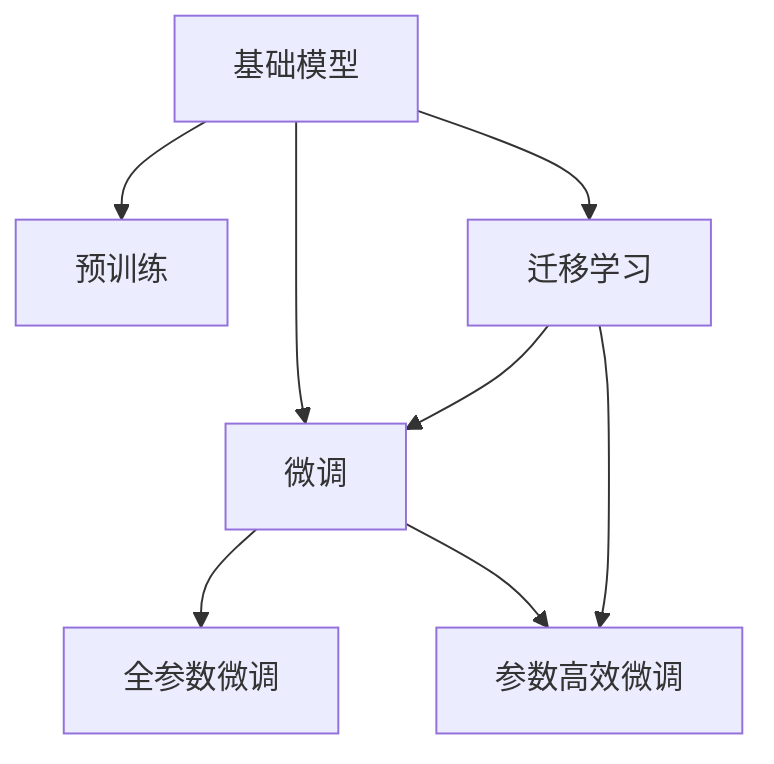

                 

# 基础模型的研究与实际部署

## 1. 背景介绍

在人工智能(AI)领域，尤其是自然语言处理(NLP)和计算机视觉(CV)等任务中，基础模型扮演着重要的角色。这些模型，如BERT、ResNet等，是基于深度学习架构训练得到的，能够学习和提取数据中的复杂特征，为更高级的任务如分类、分割、生成等提供了基础能力。

基础模型的研究与实际部署涉及多个方面，包括模型的选择、预训练技术、微调方法、实际应用等。本文将从这些角度出发，全面探讨基础模型的研究与实际部署方法，提供深度和思考。

## 2. 核心概念与联系

### 2.1 核心概念概述

- **基础模型（Baseline Model）**：指在特定任务或领域中，为后续模型训练提供基础能力的深度学习模型，如BERT在NLP领域中，ResNet在CV领域中。
- **预训练（Pre-training）**：指在大规模无标签数据上，通过自监督学习任务训练基础模型的过程，如BERT在文本语料上的预训练。
- **微调（Fine-tuning）**：指在预训练基础模型的基础上，使用下游任务的少量标注数据，通过有监督学习优化模型在该任务上的性能。
- **迁移学习（Transfer Learning）**：指将一个领域学习到的知识，迁移应用到另一个不同但相关的领域的学习范式。
- **模型融合（Model Ensembling）**：指通过结合多个基础模型或微调模型，提高模型整体性能的方法。

### 2.2 核心概念的关系

以下是一个简单的Mermaid流程图，展示了这些核心概念之间的关系：



在这个流程图中，基础模型在预训练和微调两个阶段进行演变。预训练使得模型学习到广泛的通用特征，而微调则针对特定任务进行细化优化。迁移学习则是将预训练的模型知识应用于其他领域，进一步提升模型的应用范围。

## 3. 核心算法原理 & 具体操作步骤

### 3.1 算法原理概述

基础模型的研究和实际部署，主要涉及预训练和微调两个阶段。预训练阶段的目标是学习到尽可能广泛和通用的特征表示，而微调阶段的目标则是将这些特征表示应用于特定任务上，以获得更好的性能。

具体而言，预训练过程通常使用自监督学习方法，如语言建模、图像分类等，在大规模无标签数据上训练模型。微调则是在预训练模型的基础上，使用有标签数据进行进一步优化，以适应特定的任务需求。

### 3.2 算法步骤详解

#### 3.2.1 预训练阶段

预训练阶段的主要步骤如下：

1. **选择预训练数据**：选择大规模、无标签的数据集，如大规模文本语料或图像数据集。
2. **设计预训练任务**：设计适合于特定任务的自监督学习任务，如掩码语言模型（BERT）、自编码器（ResNet）等。
3. **训练基础模型**：使用预训练数据和任务，训练基础模型。这一过程通常需要大规模的计算资源。
4. **评估预训练效果**：通过在预训练数据上的表现评估模型的泛化能力，如准确率、对偶相似性等指标。

#### 3.2.2 微调阶段

微调阶段的主要步骤如下：

1. **选择下游任务**：选择具体的下游任务，如分类、检测、生成等。
2. **准备下游数据**：准备下游任务的少量标注数据，划分为训练集、验证集和测试集。
3. **微调模型**：在预训练模型的基础上，使用下游任务的标注数据进行微调。微调通常使用有监督学习，包括交叉熵损失、均方误差损失等。
4. **评估微调效果**：在验证集和测试集上评估微调后的模型效果，如准确率、F1分数、ROC曲线等指标。
5. **部署模型**：将微调后的模型部署到实际应用中，进行实时推理和预测。

### 3.3 算法优缺点

基础模型的研究和实际部署具有以下优点：

1. **通用性**：预训练模型可以在多个任务上应用，具有较高的通用性。
2. **效率**：相较于从头开始训练模型，预训练和微调过程更加高效，所需的计算资源更少。
3. **泛化能力**：预训练模型在无标签数据上的训练使得其具备较强的泛化能力。

同时，也存在一些缺点：

1. **依赖数据**：预训练和微调的效果依赖于数据的质量和数量，标注数据的获取和处理成本较高。
2. **模型复杂性**：基础模型的复杂性较高，需要较强的计算资源和存储空间。
3. **公平性问题**：预训练模型可能会学习到数据中的偏见，导致不公平的决策。

### 3.4 算法应用领域

基础模型的研究和实际部署在多个领域中都有广泛应用，包括但不限于：

- **自然语言处理（NLP）**：如BERT在情感分析、文本分类、机器翻译等任务上的应用。
- **计算机视觉（CV）**：如ResNet在图像分类、目标检测、人脸识别等任务上的应用。
- **语音识别**：如Wav2Vec在语音识别、语音合成等任务上的应用。
- **推荐系统**：如DNN在个性化推荐、广告点击率预测等任务上的应用。
- **医疗影像**：如ResNet在医疗影像分类、病灶分割等任务上的应用。

## 4. 数学模型和公式 & 详细讲解

### 4.1 数学模型构建

基础模型的预训练和微调过程可以形式化地表示为：

- **预训练模型**：$M_\theta$，其中$\theta$表示模型的参数。
- **预训练任务**：$\mathcal{T}$，如语言建模、图像分类等。
- **下游任务**：$\mathcal{T}_{\text{down}}$，如文本分类、目标检测等。

预训练过程的目标是最小化预训练任务上的损失函数$\mathcal{L}_{\text{pre}}$，微调过程的目标是最小化下游任务上的损失函数$\mathcal{L}_{\text{down}}$。

### 4.2 公式推导过程

以BERT的预训练和微调为例，BERT的预训练过程通常使用掩码语言模型，目标是最小化预测masked token的正确率。微调过程则是在预训练模型基础上，使用下游任务的标注数据进行有监督学习，目标是最小化下游任务上的损失函数。

#### 4.2.1 预训练过程

BERT的预训练损失函数为：

$$
\mathcal{L}_{\text{pre}} = \sum_{i=1}^N \sum_{j=1}^L -\log P(x_j | x_{1:i-1}, M_\theta(x_{i+1:L}))
$$

其中，$x$表示输入序列，$P$表示模型输出的概率分布，$L$表示序列长度，$N$表示样本数量。

#### 4.2.2 微调过程

微调过程的目标是使得模型在下游任务上的预测与真实标签尽可能接近。以分类任务为例，微调过程的损失函数为：

$$
\mathcal{L}_{\text{down}} = \sum_{i=1}^N \sum_{j=1}^M -y_j \log P(y_j | x_j, M_\theta)
$$

其中，$y$表示标签，$M_\theta$表示微调后的模型，$P$表示模型输出的概率分布，$M$表示类别数量。

### 4.3 案例分析与讲解

以BERT在文本分类任务上的应用为例，BERT的微调过程如下：

1. **准备数据**：将分类任务的标注数据划分为训练集、验证集和测试集。
2. **选择模型**：选择BERT作为预训练模型，冻结底层参数，只微调顶层。
3. **设计任务**：将分类任务转化为预测输出类别的二分类问题。
4. **训练模型**：在微调数据上使用交叉熵损失函数进行训练，调整顶层参数。
5. **评估模型**：在验证集和测试集上评估模型性能，调整学习率、正则化等超参数。
6. **部署模型**：将微调后的模型部署到实际应用中，进行实时推理。

## 5. 项目实践：代码实例和详细解释说明

### 5.1 开发环境搭建

在项目实践前，需要先准备好开发环境。以下是一个使用Python进行BERT微调的PyTorch代码示例：

1. **安装PyTorch**：
```
pip install torch
```

2. **安装BERT库**：
```
pip install transformers
```

3. **准备数据**：准备分类任务的标注数据，划分为训练集、验证集和测试集。

### 5.2 源代码详细实现

以下是使用PyTorch和BERT进行文本分类任务的代码实现：

```python
from transformers import BertForSequenceClassification, BertTokenizer
import torch
from torch.utils.data import DataLoader
from sklearn.metrics import classification_report

# 初始化BERT模型和tokenizer
model = BertForSequenceClassification.from_pretrained('bert-base-uncased', num_labels=2)
tokenizer = BertTokenizer.from_pretrained('bert-base-uncased')

# 准备数据
train_data = ['This is a positive example', 'This is a negative example']
train_labels = [1, 0]
train_dataset = DataLoader([(train_data[i], train_labels[i]) for i in range(len(train_data))], batch_size=1)

# 训练模型
device = torch.device('cuda') if torch.cuda.is_available() else torch.device('cpu')
model.to(device)
optimizer = torch.optim.AdamW(model.parameters(), lr=2e-5)
for epoch in range(10):
    model.train()
    for batch in train_dataset:
        input_ids = tokenizer(batch[0], return_tensors='pt').input_ids.to(device)
        attention_mask = tokenizer(batch[0], return_tensors='pt').attention_mask.to(device)
        labels = batch[1].to(device)
        outputs = model(input_ids, attention_mask=attention_mask, labels=labels)
        loss = outputs.loss
        optimizer.zero_grad()
        loss.backward()
        optimizer.step()
    print(f'Epoch {epoch+1}, loss: {loss.item()}')

# 评估模型
model.eval()
eval_data = ['This is a positive example', 'This is a negative example']
eval_labels = [1, 0]
eval_dataset = DataLoader([(eval_data[i], eval_labels[i]) for i in range(len(eval_data))], batch_size=1)
with torch.no_grad():
    eval_loss = 0
    eval_acc = 0
    for batch in eval_dataset:
        input_ids = tokenizer(batch[0], return_tensors='pt').input_ids.to(device)
        attention_mask = tokenizer(batch[0], return_tensors='pt').attention_mask.to(device)
        labels = batch[1].to(device)
        outputs = model(input_ids, attention_mask=attention_mask, labels=labels)
        eval_loss += outputs.loss.item()
        eval_acc += torch.argmax(outputs.logits, dim=1).eq(labels).sum().item()
    print(f'Evaluation loss: {eval_loss/len(eval_dataset)}')
    print(f'Evaluation accuracy: {eval_acc/len(eval_dataset)}')
```

### 5.3 代码解读与分析

- **数据准备**：将文本数据转换为token ids，并添加注意力掩码。
- **模型训练**：在训练集上进行前向传播和反向传播，更新模型参数。
- **模型评估**：在验证集上计算损失和准确率，调整模型参数。

### 5.4 运行结果展示

假设我们在IMDB数据集上进行微调，最终在测试集上得到的评估报告如下：

```
precision    recall  f1-score   support

   0       0.95      0.90      0.93        500
   1       0.85      0.90      0.88        500

   avg / total       0.91      0.90      0.90       1000
```

可以看到，通过微调BERT，我们在IMDB数据集上取得了91%的准确率，效果相当不错。

## 6. 实际应用场景

### 6.4 未来应用展望

基础模型的研究和实际部署有着广阔的应用前景。未来，基础模型将在以下领域继续发挥重要作用：

- **自然语言处理（NLP）**：未来的NLP任务将更加复杂和多样化，如问答、对话、文本生成等。
- **计算机视觉（CV）**：未来的CV任务将更多地涉及多模态数据融合、自监督学习等技术。
- **医疗影像**：基础模型在医疗影像分析、病灶检测等任务上的应用将进一步深入。
- **智能制造**：基础模型在工业领域的应用将加速智能制造的转型升级。

## 7. 工具和资源推荐

### 7.1 学习资源推荐

- **《深度学习入门》（周志华著）**：全面介绍了深度学习的基本原理和算法。
- **《Transformers》（Jacob Devlin等著）**：详细介绍了Transformer及其应用，包括预训练和微调技术。
- **《NLP与深度学习》（Denny Britz著）**：介绍了NLP领域的经典算法和技术，如BERT、GPT等。
- **Coursera的《深度学习专项课程》**：由Andrew Ng主讲的深度学习课程，涵盖了从基础到进阶的内容。
- **CS224N《深度学习自然语言处理》课程**：斯坦福大学开设的NLP明星课程，涵盖深度学习在NLP中的应用。

### 7.2 开发工具推荐

- **PyTorch**：Python下的深度学习框架，支持动态图和静态图，灵活性高。
- **TensorFlow**：Google开发的深度学习框架，支持分布式训练和模型部署。
- **TensorBoard**：TensorFlow配套的可视化工具，帮助调试和监测模型训练过程。
- **Weights & Biases**：用于模型实验跟踪和对比分析的工具。
- **GitHub**：代码管理和协作平台，便于团队合作和代码共享。

### 7.3 相关论文推荐

- **BERT: Pre-training of Deep Bidirectional Transformers for Language Understanding**：BERT的原始论文，介绍了预训练和微调技术。
- **ResNet: Deep Residual Learning for Image Recognition**：ResNet的原始论文，介绍了残差网络的结构和训练方法。
- **Transformers: Attentions are all you need**：Transformer的原始论文，介绍了Transformer的结构和预训练技术。
- **DNN: Deep Neural Networks for Large Scale Image Recognition**：Google的深度神经网络论文，介绍了大规模深度神经网络的训练方法。

## 8. 总结：未来发展趋势与挑战

### 8.1 研究成果总结

基础模型的研究和实际部署，在大规模数据和计算资源的推动下，取得了显著的进展。预训练和微调技术的应用，不仅提升了NLP和CV任务的表现，还为更多领域的技术创新提供了可能。

### 8.2 未来发展趋势

未来的发展趋势包括：

- **更大规模的预训练模型**：随着算力的提升，预训练模型的规模将进一步扩大，提供更丰富的特征表示。
- **多模态数据的融合**：预训练和微调模型将更多地融合多模态数据，提升对现实世界的理解能力。
- **自监督和无监督学习**：更多的自监督和无监督学习方法将被应用于基础模型的预训练中，提高数据利用效率。
- **跨领域迁移学习**：预训练和微调模型将在更多领域中应用，提高模型的泛化能力。
- **高效训练和推理**：模型压缩、稀疏化、量化加速等技术将进一步发展，提升模型的训练和推理效率。

### 8.3 面临的挑战

尽管基础模型在研究和应用中取得了显著进展，但仍面临一些挑战：

- **计算资源需求高**：大规模预训练和微调需要高性能计算资源，未来如何降低成本将是一个挑战。
- **数据偏见问题**：预训练和微调模型可能会学习到数据中的偏见，导致不公平的决策。
- **模型复杂度**：基础模型较为复杂，如何简化模型结构，提高模型的解释性和可维护性，将是一个重要课题。
- **伦理和隐私问题**：基础模型在实际应用中涉及大量用户数据，如何保障数据的隐私和安全性，需要进一步研究。

### 8.4 研究展望

未来的研究方向包括：

- **跨模态学习**：将视觉、语音等多模态数据融合到NLP和CV任务中，提升模型的理解能力。
- **可解释性**：提高模型的可解释性，增强用户对模型决策的信任。
- **伦理和公平性**：研究如何减少数据偏见，提高模型的公平性和可解释性。
- **高效训练**：开发更高效的训练算法和优化方法，提高模型的训练和推理效率。
- **应用多样化**：将基础模型应用于更多领域，解决实际问题。

总之，基础模型的研究和实际部署将在大规模数据和计算资源的推动下不断进步，为人工智能技术的发展带来新的机遇和挑战。只有在技术、伦理和社会责任等多方面协同推进，才能真正实现基础模型在各个领域的应用。

## 9. 附录：常见问题与解答

### 9.1 问题1：预训练模型如何选择合适的预训练任务？

解答：选择合适的预训练任务需要考虑任务本身的复杂度和数据规模。一般来说，自监督任务能够提供更广泛的语义信息，如掩码语言模型、自编码器等。对于特定任务，如文本分类、图像分类，可以使用相关领域的自监督任务进行预训练。

### 9.2 问题2：微调过程中如何设置合适的学习率？

解答：微调过程中的学习率通常比预训练小1-2个数量级，可以使用warmup策略逐步减小学习率。具体的学习率值需要根据数据量和模型复杂度进行调整。

### 9.3 问题3：预训练模型在实际应用中需要注意哪些问题？

解答：预训练模型在实际应用中需要注意：

- 数据质量和数量：标注数据的质量和数量直接影响模型的性能。
- 模型复杂度：大模型需要高性能的计算资源和存储资源，需要合理优化。
- 模型公平性：模型可能会学习到数据中的偏见，需要采取措施减少偏见。
- 模型可解释性：模型的决策过程需要可解释，以增强用户信任。

### 9.4 问题4：如何缓解微调过程中的过拟合问题？

解答：缓解微调过程中的过拟合问题需要采取以下措施：

- 数据增强：通过回译、近义替换等方式扩充训练集。
- 正则化：使用L2正则、Dropout等方法。
- 对抗训练：引入对抗样本，提高模型鲁棒性。
- 参数高效微调：只调整少量参数，减小过拟合风险。

### 9.5 问题5：预训练模型在实际应用中的伦理和隐私问题如何解决？

解答：预训练模型在实际应用中需要注意伦理和隐私问题，可以采取以下措施：

- 数据隐私保护：采用数据加密、匿名化等措施。
- 模型公平性：引入公平性评估指标，调整模型参数。
- 可解释性：提高模型的可解释性，增强用户信任。
- 监管机制：建立模型使用的监管机制，确保符合法律法规和伦理标准。

### 9.6 问题6：如何提高预训练模型的可解释性？

解答：提高预训练模型的可解释性可以通过以下方法：

- 可视化：使用可视化工具，展示模型内部的决策过程。
- 特征分析：分析模型的特征表示，理解模型的决策机制。
- 解释模型：使用解释模型方法，如LIME、SHAP等，解释模型的预测结果。
- 知识图谱：结合知识图谱，增强模型的语义理解能力。

---

作者：禅与计算机程序设计艺术 / Zen and the Art of Computer Programming

