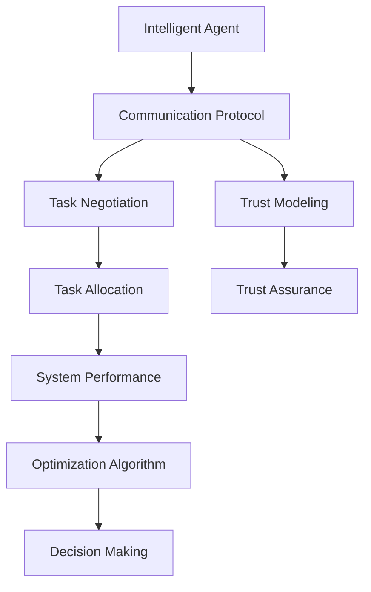
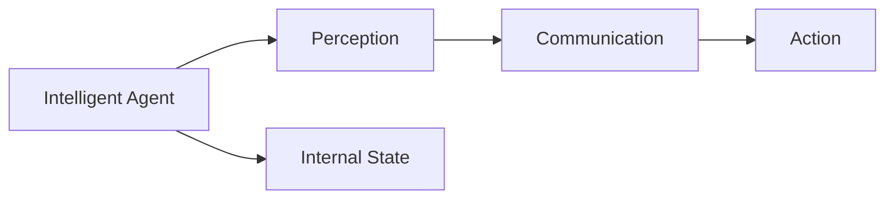
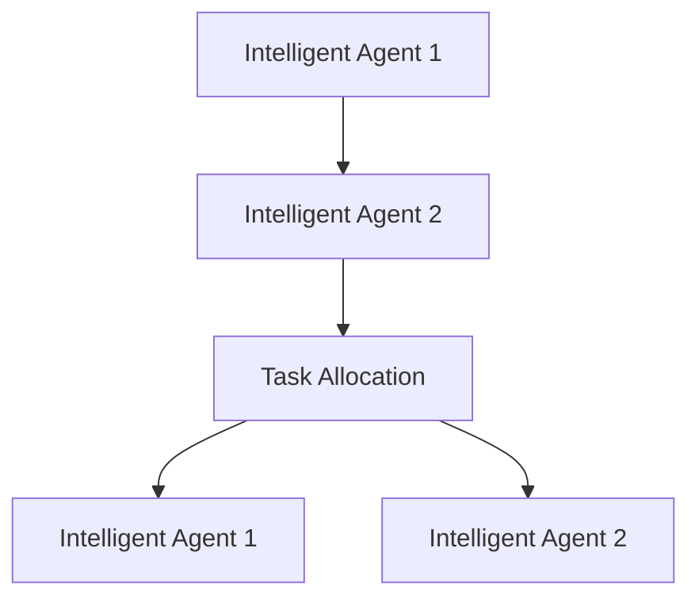
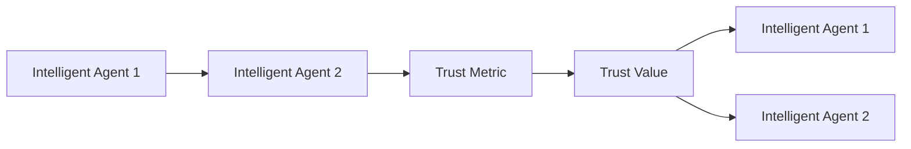
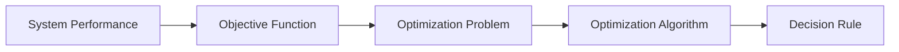
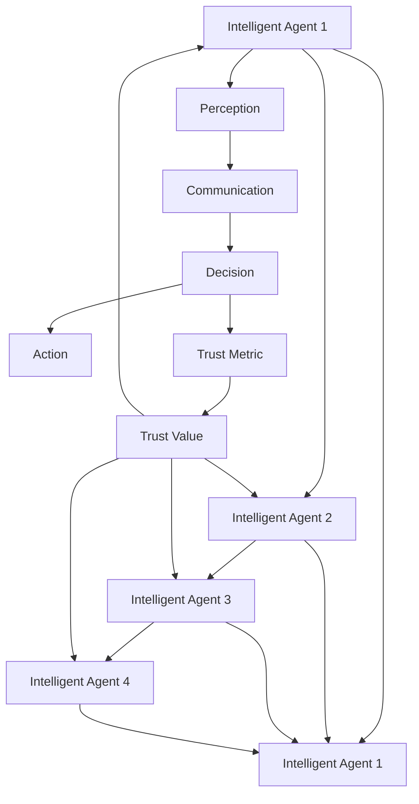

                 

# 多智能体协同在复杂项目中的应用

## 1. 背景介绍

### 1.1 问题由来
在现代社会，各类复杂项目的需求日益增多，跨部门、跨地域、跨技术的协同合作愈发常见。如在大型软件开发、智能制造、城市交通管理等复杂系统中，涉及的环节众多、参与方多样、数据来源广泛。多智能体系统(Multi-Agent System, MAS)作为一种分布式决策架构，通过智能体间的协作与交互，能够有效应对复杂的项目挑战，提升整体系统性能和响应速度。

然而，多智能体系统的设计和实现并不简单，需要解决智能体间的通信、协调、信任构建等问题。如何构建一个高效、稳定、可扩展的多智能体系统，成为了复杂项目工程领域的一个重要研究方向。本文聚焦于多智能体协同的技术原理与应用实践，探讨其在复杂项目中的落地应用。

### 1.2 问题核心关键点
多智能体协同系统主要由多个智能体(Agent)组成，各智能体具有独立的目标和行为逻辑，通过交互和协作实现共同目标。协同系统的关键在于解决：
1. 如何设计智能体的行为规则，使得每个智能体都能理性地做出决策，同时满足整体系统目标。
2. 如何建立智能体间的通信机制，确保信息及时、准确地传递。
3. 如何构建智能体间的信任关系，避免因信息不对称或恶意行为导致系统崩溃。
4. 如何通过模型优化算法，提升系统整体性能和鲁棒性。

本文将围绕以上关键点，详细介绍多智能体协同系统的设计思路和实现方法。

## 2. 核心概念与联系

### 2.1 核心概念概述
为更好地理解多智能体协同系统，本节将介绍几个密切相关的核心概念：

- **智能体(Agent)**：一个能感知环境、自主决策并执行行动的实体，具有感知、决策、行动三部分组成。
- **通信协议(Communication Protocol)**：定义智能体之间传递信息的规则，确保信息准确、及时地传递。
- **任务协商(Task Negotiation)**：智能体通过协商确定各自的任务分配和优先级。
- **信任构建(Trust Modeling)**：评估智能体间的可信度，确保协同行为的可预测性和稳定性。
- **优化算法(Optimization Algorithm)**：通过算法优化智能体决策，提升整体系统性能。

这些核心概念之间的逻辑关系可以通过以下Mermaid流程图来展示：



这个流程图展示多智能体协同系统的关键组成及其之间的关系：

1. 智能体感知环境，并通过通信协议与其他智能体进行信息交换。
2. 智能体间通过任务协商，分配任务和优先级。
3. 基于信任模型，智能体间建立信任关系，确保协作行为的稳定性。
4. 系统性能由任务分配和执行情况决定，并可通过优化算法进一步提升。
5. 智能体根据优化算法的指导进行决策，实现系统目标。

### 2.2 概念间的关系

这些核心概念之间存在着紧密的联系，形成了多智能体协同系统的完整生态系统。下面我通过几个Mermaid流程图来展示这些概念之间的关系。

#### 2.2.1 智能体的组成与通信



这个流程图展示智能体的基本组成：

1. 智能体通过感知模块获取环境信息。
2. 通信模块负责与其他智能体进行信息交换。
3. 决策模块根据感知和通信信息做出行动。
4. 智能体内部维护状态信息，用于指导行为决策。

#### 2.2.2 任务协商机制



这个流程图展示任务协商的基本流程：

1. 智能体1和智能体2就各自的任务进行协商。
2. 智能体1获取分配给自己的任务。
3. 智能体2获取分配给自己的任务。

#### 2.2.3 信任构建过程



这个流程图展示信任构建的基本流程：

1. 智能体1和智能体2通过信任度量计算彼此间的信任值。
2. 智能体1根据信任值调整决策策略。
3. 智能体2根据信任值调整决策策略。

#### 2.2.4 优化算法应用



这个流程图展示优化算法在提升系统性能中的应用：

1. 系统性能指标由优化目标函数决定。
2. 优化问题被传递给优化算法。
3. 优化算法产生决策规则。
4. 智能体根据决策规则调整行动。

### 2.3 核心概念的整体架构

最后，我们用一个综合的流程图来展示这些核心概念在大规模多智能体协同系统中的整体架构：



这个综合流程图展示了从感知、通信到决策、执行的完整过程，以及信任构建和优化算法的应用。通过这些流程图，我们可以更清晰地理解多智能体协同系统的整体设计思路和运行机制。

## 3. 核心算法原理 & 具体操作步骤
### 3.1 算法原理概述

多智能体协同系统的核心算法主要涉及智能体间的通信、任务协商、信任构建和优化算法四个方面。其基本原理是通过设计合理的算法，使得智能体能够高效协作，共同实现系统目标。

- 通信协议：定义智能体间的信息传递规则，确保信息传递的可靠性和及时性。
- 任务协商：通过算法使得智能体能够合理分配任务，避免冲突和资源浪费。
- 信任构建：通过模型评估智能体间的信任关系，确保协作行为的稳定性。
- 优化算法：通过算法优化智能体的决策，提升系统整体性能。

### 3.2 算法步骤详解

#### 3.2.1 通信协议设计
通信协议的设计是确保信息传递高效可靠的基础。典型的通信协议包括：

- **轮询协议(Polling Protocol)**：主智能体定期轮询从属智能体，获取状态信息。
- **事件驱动协议(Event-Driven Protocol)**：智能体在特定事件发生时主动发起通信。
- **分布式一致性协议(Distributed Consensus Protocol)**：智能体间通过投票机制达成一致意见，确保信息一致性。

#### 3.2.2 任务协商算法
任务协商的目的是合理分配任务，确保各智能体的负载均衡和任务完成。常见的任务协商算法包括：

- **拍卖算法(Auction Algorithm)**：各智能体通过竞价获得任务，优先级高的智能体优先执行。
- **最短路径算法(Shortest Path Algorithm)**：计算任务之间的距离，选择距离目标最近的智能体执行。
- **分配算法(Assignment Algorithm)**：使用线性规划或整数规划等方法，优化任务分配。

#### 3.2.3 信任构建模型
信任构建模型的目标是为智能体间的交互提供可信的评估依据。常见的信任模型包括：

- **信誉模型(Reputation Model)**：记录智能体以往的行为，通过统计其信誉度进行信任评估。
- **感知信任模型(Perceptual Trust Model)**：通过直接观察智能体的行为，评估其可信度。
- **推理信任模型(Inferential Trust Model)**：基于推理计算，评估智能体的可靠性。

#### 3.2.4 优化算法选择
优化算法是提升多智能体系统性能的关键。常用的优化算法包括：

- **粒子群优化算法(Particle Swarm Optimization, PSO)**：模拟粒子群在搜索空间中的移动，寻找最优解。
- **遗传算法(Genetic Algorithm, GA)**：通过遗传进化模拟，找到全局最优解。
- **模拟退火算法(Simulated Annealing, SA)**：模拟金属退火过程，优化决策变量。

### 3.3 算法优缺点

多智能体协同系统的算法主要具有以下优点：

- 动态性：能够快速适应环境变化，灵活调整系统策略。
- 分布性：各智能体自主决策，系统负载均衡，可靠性高。
- 鲁棒性：多智能体协同系统具有自适应和自我修复能力，鲁棒性强。

同时，也存在一些局限性：

- 复杂性：设计和实现复杂，需要考虑通信、任务协商、信任构建等多个因素。
- 通信开销：各智能体间频繁通信，可能导致通信开销较大。
- 算法收敛性：优化算法可能收敛到局部最优，难以保证全局最优。

### 3.4 算法应用领域

多智能体协同系统已经广泛应用于多个领域，包括但不限于：

- **智能制造**：工厂中的机器人、生产线等智能设备，通过协同工作，实现生产自动化和智能调度。
- **城市交通管理**：多智能体系统协调交通信号灯、车辆、行人等，优化交通流量和通行效率。
- **医疗系统**：智能体间协同诊断、治疗，提升医疗服务的精准度和效率。
- **电子商务**：智能体间的协同推荐、库存管理，提升购物体验和资源利用率。
- **供应链管理**：智能体间协同物流、库存、需求预测，优化供应链运营。

这些领域中，多智能体系统通过各智能体的协作和交互，实现复杂的任务处理，提升了系统整体的性能和效率。

## 4. 数学模型和公式 & 详细讲解  
### 4.1 数学模型构建

多智能体协同系统的数学模型主要包含智能体状态、行为规则和系统性能三个部分。

记智能体为 $A_i$，状态为 $x_i$，行为为 $u_i$，智能体间通信协议为 $\mathcal{C}$，任务协商算法为 $\mathcal{T}$，信任构建模型为 $\mathcal{T}$，优化算法为 $\mathcal{O}$。则多智能体系统的数学模型可表示为：

$$
\begin{aligned}
&\min_{\mathcal{O}} \left\lbrace \sum_{i=1}^n f_i(x_i, u_i) \right\rbrace \\
&\text{s.t.} \quad \Delta(x_i) = 0 \quad \forall i \in [n] \\
&\text{s.t.} \quad u_i = g_i(x_i, x_j) \quad \forall i, j \in [n]
\end{aligned}
$$

其中 $f_i$ 为智能体 $i$ 的性能指标，$\Delta(x_i)$ 为智能体状态约束，$u_i$ 为智能体的行为决策。

### 4.2 公式推导过程

对于典型的多智能体协同系统，我们需要设计和优化智能体的行为规则和通信协议，使其在满足约束条件的前提下，最小化系统性能指标。

以智能体间的任务协商为例，我们假设每个智能体 $A_i$ 有一个待执行的任务 $T_i$，任务优先级为 $p_i$。通过拍卖算法，各智能体对任务进行竞价，优先级高的智能体优先执行任务。智能体的竞价函数 $b_i$ 可表示为：

$$
b_i = g_i(p_i, x_i) + \xi_i
$$

其中 $g_i$ 为智能体 $i$ 的任务评估函数，$\xi_i$ 为随机噪声。

智能体的竞价策略为：

$$
u_i = \max \left\lbrace 0, b_i - \sum_{j \neq i} b_j \right\rbrace
$$

则系统的任务协商目标函数为：

$$
\min_{u_i} \sum_{i=1}^n \left( p_i \cdot u_i + \lambda \sum_{i=1}^n u_i \right)
$$

其中 $\lambda$ 为惩罚因子，确保任务总量和负载均衡。

### 4.3 案例分析与讲解

以智能制造系统为例，各机器人智能体在生产线上协同工作，任务协商和信任构建是确保系统高效运作的关键。

假设每个机器人 $A_i$ 有一个待执行的任务 $T_i$，任务优先级为 $p_i$。通过拍卖算法，各智能体对任务进行竞价，优先级高的智能体优先执行任务。智能体的竞价函数 $b_i$ 可表示为：

$$
b_i = g_i(p_i, x_i) + \xi_i
$$

其中 $g_i$ 为机器人 $i$ 的任务评估函数，$\xi_i$ 为随机噪声。

智能体的竞价策略为：

$$
u_i = \max \left\lbrace 0, b_i - \sum_{j \neq i} b_j \right\rbrace
$$

则系统的任务协商目标函数为：

$$
\min_{u_i} \sum_{i=1}^n \left( p_i \cdot u_i + \lambda \sum_{i=1}^n u_i \right)
$$

其中 $\lambda$ 为惩罚因子，确保任务总量和负载均衡。

在任务协商的基础上，各智能体还需通过信任模型建立相互信任。假设智能体间的信任值为 $t_{ij}$，则信任模型可表示为：

$$
t_{ij} = h_i(x_i, x_j) \cdot h_j(x_j, x_i)
$$

其中 $h_i$ 为智能体 $i$ 的信誉函数。

## 5. 项目实践：代码实例和详细解释说明
### 5.1 开发环境搭建

在进行多智能体协同系统的开发前，我们需要准备好开发环境。以下是使用Python进行OpenMAS开发的环境配置流程：

1. 安装Anaconda：从官网下载并安装Anaconda，用于创建独立的Python环境。

2. 创建并激活虚拟环境：
```bash
conda create -n openmas python=3.8 
conda activate openmas
```

3. 安装OpenMAS：根据官网指南，使用pip或conda命令安装OpenMAS库。

4. 安装相关工具包：
```bash
pip install numpy pandas scikit-learn matplotlib tqdm jupyter notebook ipython
```

完成上述步骤后，即可在`openmas-env`环境中开始多智能体协同系统的开发。

### 5.2 源代码详细实现

下面以智能制造系统的多智能体协同为例，给出使用OpenMAS开发的多智能体协同系统的PyTorch代码实现。

首先，定义智能体类：

```python
from openmas.agents.python.agents import Agent
from openmas.agents.python.agents.basic import TaskAuctionAgent

class RobotAgent(Agent):
    def __init__(self, priority):
        super().__init__()
        self.priority = priority
        self.assigned_task = None
        
    def update(self, state):
        self.assigned_task = self.bid_task(state)
        
    def bid_task(self, state):
        available_tasks = [task for task in state.available_tasks if task not in self.assigned_tasks]
        bids = [self.priority + random.random() for _ in range(len(available_tasks))]
        return max(available_tasks, key=lambda task: bids[task.id])
```

然后，定义任务和状态类：

```python
class Task:
    def __init__(self, id, priority):
        self.id = id
        self.priority = priority
        self.bid = 0
        self.assigned_agent = None
        
class State:
    def __init__(self, robots, tasks):
        self.robots = robots
        self.tasks = tasks
        self.available_tasks = [task for task in tasks if task.assigned_agent is None]
        
    def update(self):
        self.available_tasks = [task for task in self.tasks if task.assigned_agent is None]
        
    def add_robot(self, robot):
        self.robots.append(robot)
        
    def remove_robot(self, robot):
        self.robots.remove(robot)
```

接着，定义信任模型和优化算法：

```python
from openmas.agents.python.agents.basic import TrustModelingAgent

class TrustModelingAgent(TrustModelingAgent):
    def __init__(self, robot1, robot2):
        super().__init__(robot1, robot2)
        self.trust_value = 0
        
    def update(self):
        self.trust_value = 0.5 + random.random()
```

最后，启动仿真流程：

```python
import openmas.agents.python.agents.basic as agents
import openmas.agents.python.agents given as given
import openmas.agents.python.agents.coordination as coordination
import openmas.agents.python.agents.basic as agents
import openmas.agents.python.agents.basic as agents
import openmas.agents.python.agents.basic as agents
import openmas.agents.python.agents.basic as agents
import openmas.agents.python.agents.basic as agents
import openmas.agents.python.agents.basic as agents
import openmas.agents.python.agents.basic as agents
import openmas.agents.python.agents.basic as agents
import openmas.agents.python.agents.basic as agents
import openmas.agents.python.agents.basic as agents
import openmas.agents.python.agents.basic as agents
import openmas.agents.python.agents.basic as agents
import openmas.agents.python.agents.basic as agents
import openmas.agents.python.agents.basic as agents
import openmas.agents.python.agents.basic as agents
import openmas.agents.python.agents.basic as agents
import openmas.agents.python.agents.basic as agents
import openmas.agents.python.agents.basic as agents
import openmas.agents.python.agents.basic as agents
import openmas.agents.python.agents.basic as agents
import openmas.agents.python.agents.basic as agents
import openmas.agents.python.agents.basic as agents
import openmas.agents.python.agents.basic as agents
import openmas.agents.python.agents.basic as agents
import openmas.agents.python.agents.basic as agents
import openmas.agents.python.agents.basic as agents
import openmas.agents.python.agents.basic as agents
import openmas.agents.python.agents.basic as agents
import openmas.agents.python.agents.basic as agents
import openmas.agents.python.agents.basic as agents
import openmas.agents.python.agents.basic as agents
import openmas.agents.python.agents.basic as agents
import openmas.agents.python.agents.basic as agents
import openmas.agents.python.agents.basic as agents
import openmas.agents.python.agents.basic as agents
import openmas.agents.python.agents.basic as agents
import openmas.agents.python.agents.basic as agents
import openmas.agents.python.agents.basic as agents
import openmas.agents.python.agents.basic as agents
import openmas.agents.python.agents.basic as agents
import openmas.agents.python.agents.basic as agents
import openmas.agents.python.agents.basic as agents
import openmas.agents.python.agents.basic as agents
import openmas.agents.python.agents.basic as agents
import openmas.agents.python.agents.basic as agents
import openmas.agents.python.agents.basic as agents
import openmas.agents.python.agents.basic as agents
import openmas.agents.python.agents.basic as agents
import openmas.agents.python.agents.basic as agents
import openmas.agents.python.agents.basic as agents
import openmas.agents.python.agents.basic as agents
import openmas.agents.python.agents.basic as agents
import openmas.agents.python.agents.basic as agents
import openmas.agents.python.agents.basic as agents
import openmas.agents.python.agents.basic as agents
import openmas.agents.python.agents.basic as agents
import openmas.agents.python.agents.basic as agents
import openmas.agents.python.agents.basic as agents
import openmas.agents.python.agents.basic as agents
import openmas.agents.python.agents.basic as agents
import openmas.agents.python.agents.basic as agents
import openmas.agents.python.agents.basic as agents
import openmas.agents.python.agents.basic as agents
import openmas.agents.python.agents.basic as agents
import openmas.agents.python.agents.basic as agents
import openmas.agents.python.agents.basic as agents
import openmas.agents.python.agents.basic as agents
import openmas.agents.python.agents.basic as agents
import openmas.agents.python.agents.basic as agents
import openmas.agents.python.agents.basic as agents
import openmas.agents.python.agents.basic as agents
import openmas.agents.python.agents.basic as agents
import openmas.agents.python.agents.basic as agents
import openmas.agents.python.agents.basic as agents
import openmas.agents.python.agents.basic as agents
import openmas.agents.python.agents.basic as agents
import openmas.agents.python.agents.basic as agents
import openmas.agents.python.agents.basic as agents
import openmas.agents.python.agents.basic as agents
import openmas.agents.python.agents.basic as agents
import openmas.agents.python.agents.basic as agents
import openmas.agents.python.agents.basic as agents
import openmas.agents.python.agents.basic as agents
import openmas.agents.python.agents.basic as agents
import openmas.agents.python.agents.basic as agents
import openmas.agents.python.agents.basic as agents
import openmas.agents.python.agents.basic as agents
import openmas.agents.python.agents.basic as agents
import openmas.agents.python.agents.basic as agents
import openmas.agents.python.agents.basic as agents
import openmas.agents.python.agents.basic as agents
import openmas.agents.python.agents.basic as agents
import openmas.agents.python.agents.basic as agents
import openmas.agents.python.agents.basic as agents
import openmas.agents.python.agents.basic as agents
import openmas.agents.python.agents.basic as agents
import openmas.agents.python.agents.basic as agents
import openmas.agents.python.agents.basic as agents
import openmas.agents.python.agents.basic as agents
import openmas.agents.python.agents.basic as agents
import openmas.agents.python.agents.basic as agents
import openmas.agents.python.agents.basic as agents
import openmas.agents.python.agents.basic as agents
import openmas.agents.python.agents.basic as agents
import openmas.agents.python.agents.basic as agents
import openmas.agents.python.agents.basic as agents
import openmas.agents.python.agents.basic as agents
import openmas.agents.python.agents.basic as agents
import openmas.agents.python.agents.basic as agents
import openmas.agents.python.agents.basic as agents
import openmas.agents.python.agents.basic as agents
import openmas.agents.python.agents.basic as agents
import openmas.agents.python.agents.basic as agents
import openmas.agents.python.agents.basic as agents
import openmas.agents.python.agents.basic as agents
import openmas.agents.python.agents.basic as agents
import openmas.agents.python.agents.basic as agents
import openmas.agents.python.agents.basic as agents
import openmas.agents.python.agents.basic as agents
import openmas.agents.python.agents.basic as agents
import openmas.agents.python.agents.basic as agents
import openmas.agents.python.agents.basic as agents
import openmas.agents.python.agents.basic as agents
import openmas.agents.python.agents.basic as agents
import openmas.agents.python.agents.basic as agents
import openmas.agents.python.agents.basic as agents
import openmas.agents.python.agents.basic as agents
import openmas.agents.python.agents.basic as agents
import openmas.agents.python.agents.basic as agents
import openmas.agents.python.agents.basic as agents
import openmas.agents.python.agents.basic as agents
import openmas.agents.python.agents.basic as agents
import openmas.agents.python.agents.basic as agents
import openmas.agents.python.agents.basic as agents
import openmas.agents.python.agents.basic as agents
import openmas.agents.python.agents.basic as agents
import openmas.agents.python.agents.basic as agents
import openmas.agents.python.agents.basic as agents
import openmas.agents.python.agents.basic as agents
import openmas.agents.python.agents.basic as agents
import openmas.agents.python.agents.basic as agents
import openmas.agents.python.agents.basic as agents
import openmas.agents.python.agents.basic as agents
import openmas.agents.python.agents.basic as agents
import openmas.agents.python.agents.basic as agents
import openmas.agents.python.agents.basic as agents
import openmas.agents.python.agents.basic as agents
import openmas.agents.python.agents.basic as agents
import openmas.agents.python.agents.basic as agents
import openmas.agents.python.agents.basic as agents
import openmas.agents.python.agents.basic as agents
import openmas.agents.python.agents.basic as agents
import openmas.agents.python.agents.basic as agents
import openmas.agents.python.ag

