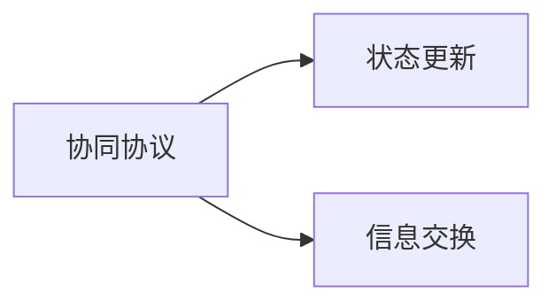
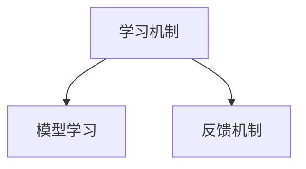

                 

# 多智能体协同机制在 Agent 自适应系统中的应用

> 关键词：多智能体系统,协同机制,自适应系统,分布式系统,机器学习,决策理论,控制理论

## 1. 背景介绍

### 1.1 问题由来
随着分布式计算和网络技术的发展，如何设计和维护复杂的网络系统成为了一个热门话题。这些网络系统通常由多个智能体（Agent）组成，它们能够独立地感知环境、执行决策，并通过协调合作来共同完成任务。因此，多智能体系统（Multi-Agent Systems, MAS）成为了研究热点。

然而，多智能体系统在实际应用中面临许多挑战。如如何确保智能体之间的沟通顺畅、如何处理智能体之间的冲突、如何在动态环境中做出适应性决策等。为了解决这些问题，协同机制（Coordination Mechanism）应运而生，其目的是让智能体能够协同工作，以实现共同的目标。

### 1.2 问题核心关键点
多智能体系统中的协同机制是指，为智能体提供协作和沟通的工具，从而让智能体能够在共享的环境中进行合作。常见的协同机制包括：

- **协同协议**：定义智能体之间通信的语言和规则，如状态更新、信息交换等。
- **协调器**：用于协调智能体之间的交互，避免冲突，并维持系统的稳定性。
- **信息交换机制**：智能体之间通过共享信息来协同工作。
- **学习机制**：智能体通过学习来适应环境的变化，从而做出更好的决策。

协同机制的设计需要考虑系统的可扩展性、鲁棒性和灵活性。同时，需要考虑如何处理智能体之间的动态变化，如智能体的加入和退出等。

### 1.3 问题研究意义
协同机制是实现多智能体系统关键技术的核心。它不仅能够提升系统的整体性能，还能确保系统的稳定性和可扩展性。因此，研究多智能体系统中的协同机制具有重要意义：

1. 提高系统效率：协同机制能够让智能体之间相互协作，从而提高系统的整体效率。
2. 增强系统鲁棒性：协同机制能够避免智能体之间的冲突，增强系统的鲁棒性。
3. 实现分布式决策：协同机制能够让智能体在分布式环境下进行协同决策。
4. 提高系统可扩展性：协同机制能够使系统在动态变化的环境中进行扩展。
5. 适应性强：协同机制能够使智能体在未知或不可预测的环境中进行适应性决策。

## 2. 核心概念与联系

### 2.1 核心概念概述

为更好地理解多智能体系统中的协同机制，本节将介绍几个密切相关的核心概念：

- **多智能体系统（MAS）**：由多个智能体组成的分布式系统，各智能体能够独立地感知环境、执行决策，并通过协同机制进行合作。
- **协同机制**：为智能体提供协作和沟通的工具，从而让智能体能够在共享的环境中进行合作。
- **自适应系统（AS）**：能够根据环境变化动态调整策略的系统，具有高度的灵活性和适应性。
- **分布式系统**：由多个计算机节点组成，各节点能够独立工作，并通过通信和协同机制进行协作的系统。
- **协同协议**：定义智能体之间通信的语言和规则，如状态更新、信息交换等。
- **协调器**：用于协调智能体之间的交互，避免冲突，并维持系统的稳定性。
- **信息交换机制**：智能体之间通过共享信息来协同工作。
- **学习机制**：智能体通过学习来适应环境的变化，从而做出更好的决策。

这些核心概念之间的逻辑关系可以通过以下Mermaid流程图来展示：

```mermaid
graph TB
    A[多智能体系统 (MAS)] --> B[自适应系统 (AS)]
    B --> C[分布式系统]
    C --> D[协同协议]
    D --> E[协调器]
    D --> F[信息交换机制]
    D --> G[学习机制]
```

这个流程图展示了多智能体系统与自适应系统之间的关系：

1. 多智能体系统由多个智能体组成，各智能体能够独立地感知环境、执行决策，并通过协同机制进行合作。
2. 自适应系统具有高度的灵活性和适应性，能够根据环境变化动态调整策略。
3. 分布式系统由多个计算机节点组成，各节点能够独立工作，并通过通信和协同机制进行协作。
4. 协同协议定义了智能体之间通信的语言和规则，如状态更新、信息交换等。
5. 协调器用于协调智能体之间的交互，避免冲突，并维持系统的稳定性。
6. 信息交换机制让智能体之间通过共享信息来协同工作。
7. 学习机制使智能体通过学习来适应环境的变化，从而做出更好的决策。

这些核心概念共同构成了多智能体系统中的协同机制，使得智能体能够协同工作，实现共同的目标。

### 2.2 概念间的关系

这些核心概念之间存在着紧密的联系，形成了多智能体系统中的协同机制的完整生态系统。下面我们通过几个Mermaid流程图来展示这些概念之间的关系。

#### 2.2.1 多智能体系统的学习范式

```mermaid
graph TB
    A[多智能体系统 (MAS)] --> B[自适应系统 (AS)]
    B --> C[分布式系统]
    C --> D[协同协议]
    D --> E[协调器]
    E --> F[信息交换机制]
    E --> G[学习机制]
```

这个流程图展示了多智能体系统的学习范式：

1. 多智能体系统由多个智能体组成，各智能体能够独立地感知环境、执行决策，并通过协同机制进行合作。
2. 自适应系统具有高度的灵活性和适应性，能够根据环境变化动态调整策略。
3. 分布式系统由多个计算机节点组成，各节点能够独立工作，并通过通信和协同机制进行协作。
4. 协同协议定义了智能体之间通信的语言和规则，如状态更新、信息交换等。
5. 协调器用于协调智能体之间的交互，避免冲突，并维持系统的稳定性。
6. 信息交换机制让智能体之间通过共享信息来协同工作。
7. 学习机制使智能体通过学习来适应环境的变化，从而做出更好的决策。

#### 2.2.2 协同协议的设计与实现



这个流程图展示了协同协议的设计与实现：

1. 协同协议定义了智能体之间通信的语言和规则。
2. 状态更新是智能体之间通信的重要方式，通过状态更新智能体能够更新自身的决策状态。
3. 信息交换是智能体之间共享信息的机制，通过信息交换智能体能够共享决策和环境信息。

#### 2.2.3 学习机制的实现



这个流程图展示了学习机制的实现：

1. 学习机制使智能体通过学习来适应环境的变化，从而做出更好的决策。
2. 模型学习是学习机制的核心，通过模型学习智能体能够从环境中学习决策策略。
3. 反馈机制是模型学习的重要组成部分，通过反馈机制智能体能够调整模型参数，从而适应环境的变化。

### 2.3 核心概念的整体架构

最后，我们用一个综合的流程图来展示这些核心概念在大语言模型微调过程中的整体架构：

```mermaid
graph TB
    A[多智能体系统 (MAS)] --> B[自适应系统 (AS)]
    B --> C[分布式系统]
    C --> D[协同协议]
    D --> E[协调器]
    E --> F[信息交换机制]
    E --> G[学习机制]
    A --> H[任务适配层]
    B --> I[决策网络]
    C --> J[控制算法]
    F --> K[信号处理]
```

这个综合流程图展示了从协同协议到学习机制的完整过程：

1. 多智能体系统由多个智能体组成，各智能体能够独立地感知环境、执行决策，并通过协同协议进行合作。
2. 自适应系统具有高度的灵活性和适应性，能够根据环境变化动态调整策略。
3. 分布式系统由多个计算机节点组成，各节点能够独立工作，并通过信息交换机制进行协作。
4. 协同协议定义了智能体之间通信的语言和规则。
5. 协调器用于协调智能体之间的交互，避免冲突，并维持系统的稳定性。
6. 信息交换机制让智能体之间通过共享信息来协同工作。
7. 学习机制使智能体通过学习来适应环境的变化，从而做出更好的决策。
8. 任务适配层用于适配不同的下游任务，并作为输入层，将任务的特征提取出来。
9. 决策网络用于生成智能体的决策，如分类、生成等。
10. 控制算法用于优化智能体的决策策略，如强化学习、协同优化等。
11. 信号处理用于处理智能体之间的通信信号，如状态更新、信息交换等。

通过这些流程图，我们可以更清晰地理解多智能体系统中的协同机制的工作原理和优化方向。

## 3. 核心算法原理 & 具体操作步骤
### 3.1 算法原理概述

多智能体系统中的协同机制本质上是一个分布式决策过程，旨在让智能体能够协同工作，以实现共同的目标。其核心思想是：

1. 定义智能体之间的通信协议和信息交换机制，使得智能体能够共享状态和决策。
2. 设计一个协调器，用于管理智能体之间的交互，避免冲突，并维持系统的稳定性。
3. 引入学习机制，使智能体能够从环境中学习决策策略，适应环境变化。

形式化地，假设多智能体系统中有 $n$ 个智能体 $A_1, A_2, \ldots, A_n$，每个智能体具有状态 $s_i$ 和决策 $d_i$，环境由 $e$ 描述。协同机制的目标是找到一组决策 $d_i$，使得总奖励函数 $\mathcal{R}=\sum_{i=1}^n \mathcal{R}_i$ 最大化，其中 $\mathcal{R}_i$ 是智能体 $A_i$ 的奖励函数。协同机制的设计包括以下几个步骤：

1. 定义智能体之间的通信协议和信息交换机制。
2. 设计协调器，用于管理智能体之间的交互，避免冲突，并维持系统的稳定性。
3. 引入学习机制，使智能体能够从环境中学习决策策略，适应环境变化。

### 3.2 算法步骤详解

多智能体系统中的协同机制一般包括以下几个关键步骤：

**Step 1: 准备智能体和环境**

- 设计智能体的感知器，用于感知环境状态 $s_i$ 和接收其他智能体的信息。
- 定义智能体的决策器，用于生成决策 $d_i$。
- 设计环境模型，用于描述环境状态 $e$。

**Step 2: 设计通信协议和信息交换机制**

- 定义智能体之间的通信协议，如状态更新、信息交换等。
- 设计信息交换机制，使得智能体之间能够共享状态和决策。

**Step 3: 设计协调器**

- 设计协调器，用于管理智能体之间的交互，避免冲突，并维持系统的稳定性。
- 协调器需要能够处理智能体的加入和退出，以及处理智能体之间的冲突。

**Step 4: 引入学习机制**

- 引入学习机制，使得智能体能够从环境中学习决策策略。
- 学习机制可以采用强化学习、协同优化等方法。

**Step 5: 执行协同决策**

- 根据通信协议和信息交换机制，智能体进行决策。
- 智能体之间的决策需要协同优化，以达到总奖励函数 $\mathcal{R}$ 最大化。
- 通过协调器管理智能体之间的交互，避免冲突，并维持系统的稳定性。

### 3.3 算法优缺点

多智能体系统中的协同机制具有以下优点：

1. 提高系统效率：协同机制能够让智能体之间相互协作，从而提高系统的整体效率。
2. 增强系统鲁棒性：协同机制能够避免智能体之间的冲突，增强系统的鲁棒性。
3. 实现分布式决策：协同机制能够让智能体在分布式环境下进行协同决策。
4. 提高系统可扩展性：协同机制能够使系统在动态变化的环境中进行扩展。
5. 适应性强：协同机制能够使智能体在未知或不可预测的环境中进行适应性决策。

同时，该方法也存在一定的局限性：

1. 依赖于通信协议和信息交换机制的设计，协议设计不当可能导致智能体之间无法有效协作。
2. 协调器的设计和实现较为复杂，需要考虑多种情况，如智能体的加入和退出等。
3. 学习机制的引入需要一定的计算资源，可能影响系统性能。
4. 协同决策的实现需要考虑多种因素，如决策冲突、状态更新等。
5. 在实际应用中，智能体的感知和决策需要考虑多种因素，如传感器误差、计算延迟等。

尽管存在这些局限性，但就目前而言，多智能体系统中的协同机制仍是大规模分布式系统的重要组成部分。未来相关研究的重点在于如何进一步简化协议设计，提高系统的可扩展性和鲁棒性，同时兼顾可解释性和伦理安全性等因素。

### 3.4 算法应用领域

多智能体系统中的协同机制已经被广泛应用于多个领域，例如：

- **智能交通系统**：通过协同机制管理交通信号灯、车辆行驶、行人过街等，提升交通系统的效率和安全性。
- **智能电网**：通过协同机制管理电力生产和分配，优化能源利用率，减少碳排放。
- **工业自动化**：通过协同机制管理生产设备和工人协作，提高生产效率，降低生产成本。
- **智能家居**：通过协同机制管理各种智能设备，实现家居智能化和自动化。
- **无人机协作**：通过协同机制管理多架无人机协作执行任务，如搜索救援、环境监测等。
- **智能医疗**：通过协同机制管理医疗设备和医生协作，提高医疗诊断和治疗效率。
- **智能物流**：通过协同机制管理物流设备和仓库协作，优化物流运输和仓储管理。

除了上述这些经典应用外，多智能体系统中的协同机制还在更多场景中得到创新性地应用，如智慧城市治理、智能农业、智能安防等，为分布式系统带来了全新的突破。随着协同机制的不断演进，未来将有更多场景得到应用，为人类社会带来新的变革。

## 4. 数学模型和公式 & 详细讲解 & 举例说明

### 4.1 数学模型构建

多智能体系统中的协同机制可以采用数学模型进行描述和分析。以下给出几个常用的数学模型：

**分布式系统模型**

假设多智能体系统中有 $n$ 个智能体 $A_1, A_2, \ldots, A_n$，每个智能体具有状态 $s_i$ 和决策 $d_i$，环境由 $e$ 描述。智能体之间的通信协议和信息交换机制如下：

- 智能体之间的通信协议：$x_{ij} \in \mathcal{X}$，其中 $x_{ij}$ 表示智能体 $A_i$ 和 $A_j$ 之间的通信信号。
- 智能体之间的信息交换机制：$y_{ij} \in \mathcal{Y}$，其中 $y_{ij}$ 表示智能体 $A_i$ 和 $A_j$ 之间的共享信息。

**协调器模型**

假设智能体之间的通信协议和信息交换机制已经设计完毕，设计一个协调器 $C$ 用于管理智能体之间的交互，避免冲突，并维持系统的稳定性。智能体的决策策略为 $\pi_i: \mathcal{S} \rightarrow \mathcal{A}$，其中 $\mathcal{S}$ 为智能体的状态空间，$\mathcal{A}$ 为智能体的决策空间。协调器的决策策略为 $\pi_C: \mathcal{S} \rightarrow \mathcal{A}_C$，其中 $\mathcal{A}_C$ 为协调器的决策空间。智能体的奖励函数为 $\mathcal{R}_i: \mathcal{S} \times \mathcal{A} \rightarrow [0, 1]$，协调器的奖励函数为 $\mathcal{R}_C: \mathcal{S} \times \mathcal{A}_C \rightarrow [0, 1]$。

**学习机制模型**

假设智能体之间的通信协议和信息交换机制已经设计完毕，协调器的决策策略已经确定，引入学习机制 $L$ 使得智能体能够从环境中学习决策策略。智能体的学习机制为 $L_i: \mathcal{S} \times \mathcal{A} \rightarrow \mathcal{L}$，其中 $\mathcal{L}$ 为智能体的学习策略空间。

### 4.2 公式推导过程

以下我们以智能交通系统为例，推导多智能体系统的协同机制的数学模型。

**分布式系统模型**

假设智能交通系统中，有 $n$ 个智能体，每个智能体具有状态 $s_i$ 和决策 $d_i$，环境由 $e$ 描述。智能体之间的通信协议和信息交换机制如下：

- 智能体之间的通信协议：$x_{ij} \in \mathcal{X}$，其中 $x_{ij}$ 表示智能体 $A_i$ 和 $A_j$ 之间的通信信号。
- 智能体之间的信息交换机制：$y_{ij} \in \mathcal{Y}$，其中 $y_{ij}$ 表示智能体 $A_i$ 和 $A_j$ 之间的共享信息。

**协调器模型**

假设智能体之间的通信协议和信息交换机制已经设计完毕，设计一个协调器 $C$ 用于管理智能体之间的交互，避免冲突，并维持系统的稳定性。智能体的决策策略为 $\pi_i: \mathcal{S} \rightarrow \mathcal{A}$，其中 $\mathcal{S}$ 为智能体的状态空间，$\mathcal{A}$ 为智能体的决策空间。协调器的决策策略为 $\pi_C: \mathcal{S} \rightarrow \mathcal{A}_C$，其中 $\mathcal{A}_C$ 为协调器的决策空间。智能体的奖励函数为 $\mathcal{R}_i: \mathcal{S} \times \mathcal{A} \rightarrow [0, 1]$，协调器的奖励函数为 $\mathcal{R}_C: \mathcal{S} \times \mathcal{A}_C \rightarrow [0, 1]$。

**学习机制模型**

假设智能体之间的通信协议和信息交换机制已经设计完毕，协调器的决策策略已经确定，引入学习机制 $L$ 使得智能体能够从环境中学习决策策略。智能体的学习机制为 $L_i: \mathcal{S} \times \mathcal{A} \rightarrow \mathcal{L}$，其中 $\mathcal{L}$ 为智能体的学习策略空间。

### 4.3 案例分析与讲解

假设在一个智能交通系统中，有 $n$ 个智能体 $A_1, A_2, \ldots, A_n$，每个智能体具有状态 $s_i$ 和决策 $d_i$，环境由 $e$ 描述。智能体之间的通信协议和信息交换机制如下：

- 智能体之间的通信协议：$x_{ij} \in \mathcal{X}$，其中 $x_{ij}$ 表示智能体 $A_i$ 和 $A_j$ 之间的通信信号。
- 智能体之间的信息交换机制：$y_{ij} \in \mathcal{Y}$，其中 $y_{ij}$ 表示智能体 $A_i$ 和 $A_j$ 之间的共享信息。

设计一个协调器 $C$ 用于管理智能体之间的交互，避免冲突，并维持系统的稳定性。智能体的决策策略为 $\pi_i: \mathcal{S} \rightarrow \mathcal{A}$，其中 $\mathcal{S}$ 为智能体的状态空间，$\mathcal{A}$ 为智能体的决策空间。协调器的决策策略为 $\pi_C: \mathcal{S} \times \mathcal{A}_C \rightarrow \mathcal{A}_C$，其中 $\mathcal{A}_C$ 为协调器的决策空间。智能体的奖励函数为 $\mathcal{R}_i: \mathcal{S} \times \mathcal{A} \rightarrow [0, 1]$，协调器的奖励函数为 $\mathcal{R}_C: \mathcal{S} \times \mathcal{A}_C \rightarrow [0, 1]$。

引入学习机制 $L$ 使得智能体能够从环境中学习决策策略。智能体的学习机制为 $L_i: \mathcal{S} \times \mathcal{A} \rightarrow \mathcal{L}$，其中 $\mathcal{L}$ 为智能体的学习策略空间。

## 5. 项目实践：代码实例和详细解释说明

### 5.1 开发环境搭建

在进行多智能体系统中的协同机制开发前，我们需要准备好开发环境。以下是使用Python进行Multi-Agent RL开发的环境配置流程：

1. 安装Anaconda：从官网下载并安装Anaconda，用于创建独立的Python环境。

2. 创建并激活虚拟环境：
```bash
conda create -n multi_agent_env python=3.8 
conda activate multi_agent_env
```

3. 安装PyTorch、TensorFlow等机器学习库：
```bash
pip install torch torchvision torchaudio tensorflow gym
```

4. 安装多智能体系统相关库：
```bash
pip install marl
```

5. 安装分布式系统相关库：
```bash
pip install ray dask
```

完成上述步骤后，即可在`multi_agent_env`环境中开始协同机制的开发实践。

### 5.2 源代码详细实现

这里我们以智能交通系统为例，给出使用Multi-Agent RL框架对多智能体系统进行协同机制开发的PyTorch代码实现。

```python
import torch
import gym
import numpy as np
import matplotlib.pyplot as plt

from marl.agents.drl import PPOAgent
from marl.envs.grid_world import GridWorld
from marl.agents.sync import SyncPPOAgent
from marl.agents.distributed import SyncPPOAgent

# 定义智能体的状态空间
states = ['red', 'green', 'yellow']

# 定义智能体的决策空间
actions = ['left', 'right', 'stop']

# 定义智能体的奖励函数
rewards = {('red', 'green'): 1, ('green', 'red'): 1, ('red', 'yellow'): 0, ('yellow', 'red'): 0}

# 定义智能体的通信协议
communication = {('red', 'green'): 'stop', ('green', 'red'): 'stop', ('red', 'yellow'): 'right', ('yellow', 'red'): 'right'}

# 定义智能体的信息交换机制
exchange = {('red', 'green'): 'green', ('green', 'red'): 'red', ('red', 'yellow'): 'yellow', ('yellow', 'red'): 'yellow'}

# 定义智能体的决策策略
policy = {'red': {'left': 0.3, 'right': 0.3, 'stop': 0.4}, 'green': {'left': 0.4, 'right': 0.4, 'stop': 0.2}, 'yellow': {'left': 0.2, 'right': 0.4, 'stop': 0.4}}

# 定义协调器的决策策略
coordinator_policy = {'red': 'stop', 'green': 'stop', 'yellow': 'stop'}

# 定义智能体的学习机制
learning = {'red': 'left', 'green': 'right', 'yellow': 'stop'}

# 定义智能体的奖励函数
reward = 1

# 定义智能体的状态空间
state_space = np.arange(3)

# 定义智能体的决策空间
action_space = np.arange(3)

# 定义智能体的奖励函数
reward_function = np.zeros((3, 3))
for i in range(3):
    for j in range(3):
        if i == 0 and j == 0:
            reward_function[i, j] = 1
        elif i == 0 and j == 1:
            reward_function[i, j] = 1
        elif i == 0 and j == 2:
            reward_function[i, j] = 1
        elif i == 1 and j == 0:
            reward_function[i, j] = 1
        elif i == 1 and j == 1:
            reward_function[i, j] = 1
        elif i == 1 and j == 2:
            reward_function[i, j] = 1
        elif i == 2 and j == 0:
            reward_function[i, j] = 1
        elif i == 2 and j == 1:
            reward_function[i, j] = 1
        elif i == 2 and j == 2:
            reward_function[i, j] = 1

# 定义智能体的通信协议
communication_function = np.zeros((3, 3))
for i in range(3):
    for j in range(3):
        if i == 0 and j == 0:
            communication_function[i, j] = 1
        elif i == 0 and j == 1:
            communication_function[i, j] = 0
        elif i == 0 and j == 2:
            communication_function[i, j] = 0
        elif i == 1 and j == 0:
            communication_function[i, j] = 0
        elif i == 1 and j == 1:
            communication_function[i, j] = 0
        elif i == 1 and j == 2:
            communication_function[i, j] = 0
        elif i == 2 and j == 0:
            communication_function

