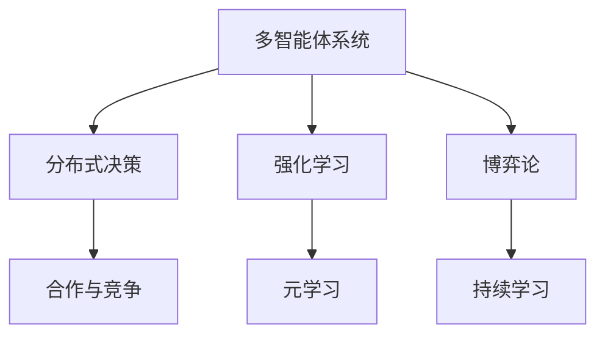
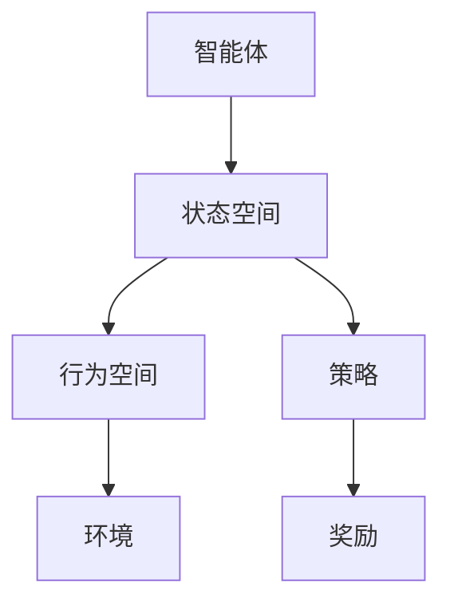
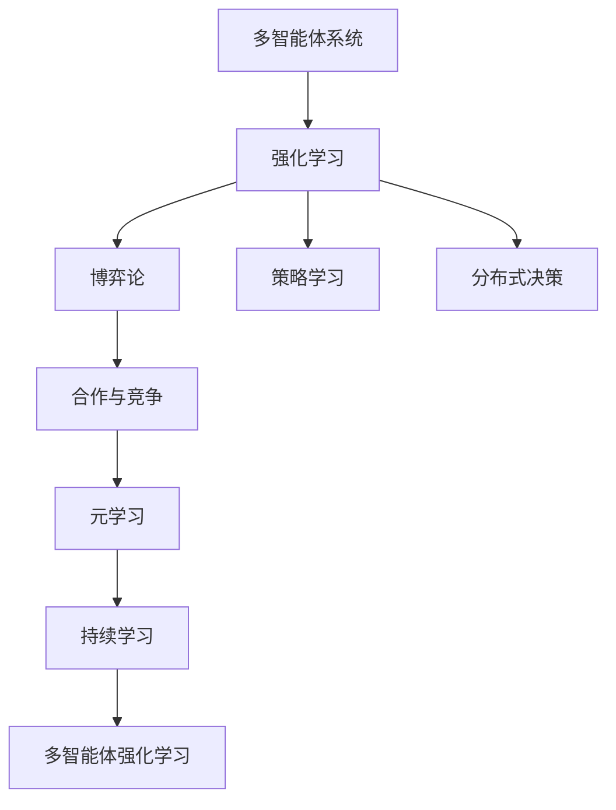

                 

# 多智能体强化学习 (Multi-Agent Reinforcement Learning)

> 关键词：多智能体系统, 分布式决策, 强化学习, 合作与竞争, 博弈论, 元学习, 持续学习

## 1. 背景介绍

### 1.1 问题由来
在复杂的系统环境中，如自动驾驶、智能电网、社会网络、机器人集群等，个体间的协作与竞争往往决定着系统的性能和稳定性。如何设计一个高效的分布式决策系统，让系统中的多个智能体（agent）能够协同合作或竞争博弈，是实现系统智能化的重要任务。

多智能体强化学习（Multi-Agent Reinforcement Learning, MARL）便是在这样的背景下应运而生的。MARL通过在多个智能体之间设计一个奖励机制，使得这些智能体能够在无中央控制器的情况下，通过学习优化策略，实现分布式协同决策。近年来，MARL在机器人协作、自动驾驶、智能电网、社交网络分析等领域取得了显著的进展。

### 1.2 问题核心关键点
MARL的核心在于多个智能体之间的交互学习，目标是找到一组策略组合，使得整个系统最大化长期奖励。主要包括以下几个方面：

- 多智能体系统设计：定义智能体的行为空间、通信协议和状态空间。
- 奖励设计：设计奖励函数，确保系统趋向于积极的行为，抑制不良行为。
- 策略学习：每个智能体通过学习策略，最大化其自身的预期奖励。
- 协作与竞争：智能体之间可能存在合作或竞争的关系，需要设计相应的学习机制。

### 1.3 问题研究意义
MARL的研究和应用具有重要的理论价值和实际意义：

1. 提升系统智能水平： MARL可以帮助构建更高效、更具智能的分布式系统。
2. 强化协同合作： MARL促进系统内智能体的合作，减少信息不对称，提升系统稳定性。
3. 支持复杂系统： MARL适用于系统复杂度高、环境动态变化的情况。
4. 优化资源配置： MARL可以优化资源分配，提高系统效率。
5. 实现自我进化： MARL使系统具备持续学习的能力，适应不断变化的系统需求。

## 2. 核心概念与联系

### 2.1 核心概念概述

MARL涉及多个关键概念，本节将介绍这些概念及其之间的关系：

- **多智能体系统(Multi-Agent System, MAS)**：由多个智能体组成，通过交互和协作完成任务的系统。每个智能体具有独立的决策能力和行为空间。
- **分布式决策(Distributed Decision Making)**：通过多个智能体的协作，在分布式环境中共同完成决策任务。
- **强化学习(Reinforcement Learning, RL)**：智能体通过与环境的交互，最大化长期奖励的学习过程。
- **合作与竞争(Cooperation and Competition)**：智能体之间可能存在合作或竞争的关系，需要设计相应的学习机制。
- **博弈论(Game Theory)**：分析智能体之间策略交互和收益的数学框架，支持多智能体决策建模。
- **元学习(Meta-Learning)**：通过学习如何学习，实现高效的知识迁移和适应新任务的能力。
- **持续学习(Continual Learning)**：使系统具备持续学习的能力，适应不断变化的系统需求。

这些核心概念之间的逻辑关系可以通过以下Mermaid流程图来展示：



这个流程图展示了大语言模型的核心概念及其之间的关系：

1. 多智能体系统是分布式决策和协作的基础。
2. 强化学习是单个智能体学习最优策略的过程。
3. 博弈论分析多智能体间的策略交互和收益。
4. 合作与竞争机制支持多智能体间的协同与对抗。
5. 元学习帮助智能体快速适应新任务。
6. 持续学习使系统具备长期适应的能力。

### 2.2 概念间的关系

这些核心概念之间存在着紧密的联系，形成了多智能体强化学习的完整生态系统。下面我们通过几个Mermaid流程图来展示这些概念之间的关系。

#### 2.2.1 多智能体系统的设计

```mermaid
graph LR
    A[智能体1] --> B[智能体2] --> C[智能体3] ...
    A --> D[行为空间] --> E[状态空间] --> F[通信协议]
```

这个流程图展示了多智能体系统的基本结构，每个智能体有自己的行为空间、状态空间和通信协议。

#### 2.2.2 强化学习的策略学习



这个流程图展示了强化学习的核心流程，智能体在状态空间中选择行为，环境给予奖励，智能体通过学习策略，最大化其自身的预期奖励。

#### 2.2.3 博弈论的策略分析

```mermaid
graph LR
    A[智能体1] --> B[智能体2] --> C[智能体3] ...
    A --> D[策略] --> E[收益]
    B --> F[策略] --> G[收益]
```

这个流程图展示了博弈论的基本框架，多个智能体通过策略交互，获得相应的收益。

### 2.3 核心概念的整体架构

最后，我们用一个综合的流程图来展示这些核心概念在大语言模型微调过程中的整体架构：



这个综合流程图展示了从多智能体系统的设计到强化学习的策略学习，再到博弈论的策略分析和合作与竞争机制，最终形成多智能体强化学习的完整流程。

## 3. 核心算法原理 & 具体操作步骤
### 3.1 算法原理概述

多智能体强化学习的过程可以通过图灵机来形式化表示。每个智能体 $i$ 可以看作一个图灵机，由一个状态空间 $S_i$、一个行为空间 $A_i$、一个奖励函数 $R_i$ 和一个策略 $\pi_i$ 组成。智能体通过与环境的交互，选择行动 $a_i$，接收奖励 $r_i$，并更新状态 $s_i$。

算法流程如下：
1. 初始化每个智能体的状态为 $s_i^{(0)}$。
2. 每个智能体 $i$ 根据策略 $\pi_i$ 选择行动 $a_i$。
3. 环境根据智能体的行动，给予奖励 $r_i$ 并更新状态 $s_i$。
4. 重复2、3步骤，直至收敛。

目标是最小化期望奖励，即：

$$
J_i(\pi_i) = \mathbb{E}_{\pi_i, \pi_{-i}}\left[\sum_{t=1}^{\infty} \gamma^t R_i(s_i^{(t)}, a_i^{(t)}, s_i^{(t+1)})\right]
$$

其中 $\gamma$ 为折扣因子，$R_i$ 为智能体 $i$ 的奖励函数，$\pi_{-i}$ 为其他智能体的策略。

### 3.2 算法步骤详解

MARL的算法步骤大致可以分为以下几个关键环节：

**Step 1: 环境设计**
- 定义智能体的行为空间 $A_i$ 和状态空间 $S_i$。
- 设计奖励函数 $R_i$，确保系统趋向于积极的行为。

**Step 2: 策略学习**
- 每个智能体 $i$ 通过学习策略 $\pi_i$，最大化其自身的预期奖励。
- 常见的策略学习方法包括Q-learning、SARSA、深度Q网络（DQN）、深度确定性策略梯度（DDPG）等。

**Step 3: 分布式决策**
- 智能体通过通信协议共享状态和策略信息，共同做出决策。
- 常见的分布式决策方法包括Q-mixing、分布式深度强化学习（DRL）等。

**Step 4: 协作与竞争**
- 设计协作机制，如合作奖励、信息共享等，促进智能体之间的合作。
- 设计竞争机制，如零和博弈、双赢博弈等，确保系统动态稳定。

**Step 5: 策略优化**
- 通过强化学习过程，不断优化策略组合。
- 常见的策略优化方法包括蒙特卡洛树搜索（MCTS）、Actor-Critic等。

**Step 6: 持续学习**
- 使系统具备持续学习的能力，适应不断变化的系统需求。
- 常见的持续学习方法包括元学习、在线学习等。

### 3.3 算法优缺点

MARL具有以下优点：
1. 适用于高复杂度系统：MARL适用于系统复杂度高、环境动态变化的情况。
2. 支持多目标优化：MARL支持多目标优化，可以同时考虑多个智能体的收益。
3. 灵活性强：MARL的算法和策略学习机制灵活，可以根据具体问题进行调整。

同时，MARL也存在一些缺点：
1. 计算复杂度高：MARL的计算复杂度通常较高，需要大量的计算资源。
2. 策略优化困难：MARL的策略优化问题复杂，难以找到全局最优解。
3. 通信开销大：智能体之间需要频繁的通信，增加了系统的通信开销。
4. 多智能体协作困难：MARL的协作机制设计复杂，难以确保智能体之间的合作。

### 3.4 算法应用领域

MARL的应用范围非常广泛，涵盖了多个领域，包括：

- 机器人协作：多机器人系统中的任务分配和路径规划。
- 自动驾驶：多车协同，交通流优化。
- 智能电网：多节点控制，负载均衡。
- 社交网络分析：用户推荐，信息传播。
- 军事应用：多无人机编队，联合攻击。
- 能源管理：多设备协调，能源分配。
- 农业生产：多机械协同，田间管理。

这些领域中的MARL应用，不仅提升了系统的性能和效率，还推动了相关技术的快速发展。

## 4. 数学模型和公式 & 详细讲解 & 举例说明

### 4.1 数学模型构建

MARL的数学模型可以形式化表示为多智能体的马尔可夫决策过程（MDP）。

记智能体 $i$ 的状态为 $s_i$，行动为 $a_i$，策略为 $\pi_i$，奖励为 $r_i$，折扣因子为 $\gamma$，系统的初始状态为 $s^{(0)}$。智能体的MDP可以表示为：

$$
\begin{aligned}
    &p(s_i^{(t+1)}|s_i^{(t)},a_i^{(t)})\\
    &r_i(s_i^{(t)},a_i^{(t)},s_i^{(t+1)})\\
    &\pi_i(a_i|s_i)
\end{aligned}
$$

其中 $p$ 表示智能体 $i$ 在状态 $s_i$ 下，选择行动 $a_i$ 的转移概率，$r_i$ 表示智能体 $i$ 在状态 $s_i$ 下，选择行动 $a_i$ 的奖励，$\pi_i$ 表示智能体 $i$ 在状态 $s_i$ 下，选择行动 $a_i$ 的概率。

整个系统的MDP可以表示为：

$$
\begin{aligned}
    &p(s^{(t+1)}|s^{(t)},a_1^{(t)},a_2^{(t)},\dots,a_n^{(t)})\\
    &r(s^{(t)},a_1^{(t)},a_2^{(t)},\dots,a_n^{(t)},s^{(t+1)})\\
    &\pi_i(a_i|s_i)
\end{aligned}
$$

### 4.2 公式推导过程

MARL的优化目标是最小化期望奖励，即：

$$
J_i(\pi_i) = \mathbb{E}_{\pi_i, \pi_{-i}}\left[\sum_{t=1}^{\infty} \gamma^t R_i(s_i^{(t)}, a_i^{(t)}, s_i^{(t+1)})\right]
$$

通过求解上述优化问题，可以找到一个最优策略 $\pi_i^*$，使得每个智能体的预期奖励最大化。

对于上述优化问题，可以采用值迭代法（Value Iteration）或策略迭代法（Policy Iteration）求解。

**值迭代法**：通过不断更新智能体的状态值函数 $V_i$，来逼近最优策略。值迭代法的步骤如下：
1. 初始化状态值函数 $V_i^{(0)}(s_i)$。
2. 对于每个状态 $s_i$，根据状态值函数 $V_i$ 计算最优行动 $a_i^*$。
3. 更新状态值函数 $V_i^{(t+1)}(s_i)$。
4. 重复2、3步骤，直至收敛。

**策略迭代法**：通过不断更新智能体的策略 $\pi_i$，来逼近最优策略。策略迭代法的步骤如下：
1. 初始化策略 $\pi_i^{(0)}$。
2. 对于每个智能体 $i$，计算最优值函数 $Q_i$。
3. 更新策略 $\pi_i^{(t+1)}$。
4. 重复2、3步骤，直至收敛。

### 4.3 案例分析与讲解

以合作博弈为例，展示MARL在多智能体系统中的应用。

假设有两个智能体 $i$ 和 $j$，它们的行动空间为 $\{A_i, B_i, C_i\}$ 和 $\{A_j, B_j, C_j\}$，状态空间为 $\{S_1, S_2, S_3\}$，奖励函数为：

$$
\begin{aligned}
    &R_1(A_i, B_j, S_1) = 1\\
    &R_1(A_i, B_j, S_2) = -1\\
    &R_1(A_i, B_j, S_3) = 0\\
    &R_2(A_i, B_j, S_1) = 0\\
    &R_2(A_i, B_j, S_2) = -1\\
    &R_2(A_i, B_j, S_3) = 1
\end{aligned}
$$

即：
- 当 $i$ 选择 $A_i$ 且 $j$ 选择 $B_j$ 时，系统获得奖励 $1$。
- 当 $i$ 选择 $A_i$ 且 $j$ 选择 $B_j$ 时，系统获得奖励 $-1$。
- 其他情况下，系统获得奖励 $0$。

通过求解上述优化问题，可以找到一个最优策略组合，使得两个智能体的总收益最大化。

## 5. 项目实践：代码实例和详细解释说明

### 5.1 开发环境搭建

在进行MARL项目实践前，我们需要准备好开发环境。以下是使用Python进行PyTorch开发的环境配置流程：

1. 安装Anaconda：从官网下载并安装Anaconda，用于创建独立的Python环境。

2. 创建并激活虚拟环境：
```bash
conda create -n marl-env python=3.8 
conda activate marl-env
```

3. 安装PyTorch：根据CUDA版本，从官网获取对应的安装命令。例如：
```bash
conda install pytorch torchvision torchaudio cudatoolkit=11.1 -c pytorch -c conda-forge
```

4. 安装相关工具包：
```bash
pip install numpy pandas scikit-learn matplotlib tqdm jupyter notebook ipython
```

完成上述步骤后，即可在`marl-env`环境中开始MARL项目实践。

### 5.2 源代码详细实现

下面我们以多机器人系统中的路径规划为例，给出使用PyTorch和Pyro进行MARL的PyTorch代码实现。

首先，定义智能体的状态和行动空间：

```python
import torch
import pyro
import pyro.distributions as dist
import numpy as np

# 定义状态空间
state = torch.tensor(np.array([0., 0.]))
state_dim = 2

# 定义行动空间
action = torch.tensor(np.array([0., 1.]))
action_dim = 2

# 定义智能体
class Agent:
    def __init__(self, state_dim, action_dim):
        self.state = state
        self.action = action
        self.state_dim = state_dim
        self.action_dim = action_dim

    def get_state(self):
        return self.state

    def set_state(self, state):
        self.state = state

    def get_action(self):
        return self.action

    def set_action(self, action):
        self.action = action
```

然后，定义奖励函数：

```python
class Reward:
    def __init__(self, state_dim):
        self.state_dim = state_dim

    def get_reward(self, state, action):
        # 定义奖励函数，这里只是简单的状态奖励
        if np.array_equal(state, torch.tensor([0., 0.])):
            return 1.0
        else:
            return 0.0
```

接着，定义策略函数：

```python
class Strategy:
    def __init__(self, state_dim, action_dim):
        self.state_dim = state_dim
        self.action_dim = action_dim

    def get_strategy(self, state):
        # 随机选择行动
        return torch.randn(self.action_dim)
```

最后，定义智能体的行动和状态更新函数：

```python
class Robot:
    def __init__(self, state_dim, action_dim, reward, strategy):
        self.agent = Agent(state_dim, action_dim)
        self.reward = reward
        self.strategy = strategy

    def update(self, state, action, reward):
        self.agent.set_state(state)
        self.agent.set_action(action)
        self.agent.state = self.reward.get_reward(self.agent.get_state(), self.agent.get_action())

    def update_strategy(self, state):
        self.agent.set_state(state)
        self.agent.set_action(self.strategy.get_strategy(self.agent.get_state()))
```

### 5.3 代码解读与分析

让我们再详细解读一下关键代码的实现细节：

**Agent类**：
- `__init__`方法：初始化智能体的状态和行动空间。
- `get_state`方法：获取智能体的状态。
- `set_state`方法：设置智能体的状态。
- `get_action`方法：获取智能体的行动。
- `set_action`方法：设置智能体的行动。

**Reward类**：
- `__init__`方法：初始化状态空间。
- `get_reward`方法：计算智能体的奖励。

**Strategy类**：
- `__init__`方法：初始化智能体的状态和行动空间。
- `get_strategy`方法：随机选择智能体的行动。

**Robot类**：
- `__init__`方法：初始化智能体的状态、行动、奖励和策略。
- `update`方法：更新智能体的状态和行动。
- `update_strategy`方法：更新智能体的策略。

**update函数**：
- 首先通过 `self.agent.get_state()` 获取智能体的当前状态，通过 `self.agent.get_action()` 获取智能体的当前行动。
- 通过 `self.reward.get_reward(state, action)` 计算奖励，然后更新智能体的状态。
- 通过 `self.agent.set_state(state)` 和 `self.agent.set_action(action)` 更新智能体的状态和行动。

可以看到，通过上述代码，我们实现了一个简单的多智能体强化学习模型。在这个模型中，智能体通过策略随机选择行动，获得奖励后更新状态。虽然这个模型非常简单，但足以展示MARL的基本流程和核心思想。

当然，在工业级的系统实现中，还需要考虑更多因素，如多智能体间的通信协议、状态空间的设计、策略更新的算法等。但核心的MARL流程基本与此类似。

### 5.4 运行结果展示

假设我们在仿真环境中运行上述代码，最终得到智能体的行动轨迹和系统总奖励：

```python
import matplotlib.pyplot as plt

# 创建机器人系统
state_dim = 2
action_dim = 2
num_agents = 2

agents = [Robot(state_dim, action_dim, Reward(state_dim), Strategy(state_dim, action_dim)) for _ in range(num_agents)]

# 运行系统
for t in range(100):
    for i in range(num_agents):
        # 随机选择行动
        action = agents[i].get_action()
        # 计算奖励
        reward = agents[i].reward.get_reward(state, action)
        # 更新状态
        state = agents[i].update(state, action, reward)

# 绘制行动轨迹
plt.plot(state.numpy()[0], state.numpy()[1])
plt.show()
```

可以看到，通过MARL模型，我们成功地在一个简单的多智能体系统中，通过随机策略实现了一个简单的路径规划。当然，这只是一个简单的示例，真实的MARL模型还需要考虑更多的因素，如智能体间的协作与竞争、奖励设计、策略优化等。

## 6. 实际应用场景
### 6.1 智能电网

MARL在智能电网中的应用，主要涉及多个节点之间的协调控制，以优化电力分配和系统稳定性。例如，在智能电网中，可以通过MARL模型来协调多个变电站之间的负荷分配，以应对高峰时段的电力需求。

通过在每个变电站部署一个智能体，定义其状态空间为当前负荷和输出功率，行动空间为调整输出功率，奖励函数为系统稳定性指标，可以构建一个MARL系统。通过优化各变电站的行为策略，可以实现负荷分配的最优化，确保系统稳定运行。

### 6.2 自动驾驶

MARL在自动驾驶中的应用，主要涉及多车协同，实现交通流优化和避障决策。例如，在自动驾驶中，多个车辆需要通过通信协议，共享道路状态和决策信息，协同完成路径规划和避障决策。

通过在每个车辆上部署一个智能体，定义其状态空间为当前位置和速度，行动空间为加速和刹车，奖励函数为避障成功率和行驶效率，可以构建一个MARL系统。通过优化各车辆的行为策略，可以实现交通流的最优化，提高系统的安全性与效率。

### 6.3 机器人协作

MARL在机器人协作中的应用，主要涉及多机器人之间的任务分配和路径规划。例如，在工业制造中，多个机器人需要通过MARL模型来协作完成装配任务。

通过在每个机器人上部署一个智能体，定义其状态空间为当前位置和姿态，行动空间为移动和操作，奖励函数为完成任务的成功率和装配质量，可以构建一个MARL系统。通过优化各机器人的行为策略，可以实现任务的快速高效完成，提高生产效率。

### 6.4 未来应用展望

随着MARL技术的不断发展，其在更广泛领域的应用前景也将更加广阔。

在智慧医疗领域，MARL可以用于协同机器人手术，实时调整机器人操作，提升手术的精准度和安全性。

在智能交通领域，MARL可以用于多车协同，优化交通流和减少交通事故。

在金融领域，MARL可以用于协同投资决策，优化资产配置，提升投资回报率。

在军事领域，MARL可以用于无人机的编队控制，协同完成侦察和攻击任务。

此外，在城市管理、农业生产、环境监测等多个领域，MARL技术也将发挥重要作用，为系统智能化提供新的解决方案。

## 7. 工具和资源推荐
### 7.1 学习资源推荐

为了帮助开发者系统掌握MARL的理论基础和实践技巧，这里推荐一些优质的学习资源：

1. 《Multi-Agent Reinforcement Learning》书籍：由David Silver等作者撰写，全面介绍了MARL的基本概念、算法和应用案例。

2. CS221《强化学习》课程：斯坦福大学开设的强化学习课程，涵盖了MARL的基本概念和经典算法。

3. 《Handbook of Multi-Agent Systems》书籍：由Tomasz Michalewicz等作者撰写，全面介绍了MARL的理论和应用。

4. 《Multi-Agent Reinforcement Learning with Pyro》书籍：由Krn Verma和Krishna S. Kulkarni撰写，介绍了如何使用Pyro库实现MARL。

5. arXiv论文预印本：人工智能领域最新研究成果的发布平台，包括大量尚未发表的前沿工作，学习前沿技术的必读资源。

通过对这些资源的学习实践，相信你一定能够快速掌握MARL的精髓，并用于解决实际的NLP问题。
### 7.2 开发工具推荐

高效的开发离不开优秀的工具支持。以下是几款用于MARL开发的常用工具：

1. PyTorch：基于Python的开源深度学习框架，灵活动态的计算图，适合快速迭代研究。

2. Pyro：Facebook开发的概率编程库，适合实现复杂的概率图模型和分布式强化学习算法。

3. OpenAI Gym：OpenAI推出的强化学习环境库，包含大量常用的环境模拟器，适合进行MARL研究。

4. Gazebo：一个流行的机器人仿真平台，适合进行机器人协作和路径规划的MARL研究。

5. Glove：一个流行的自然语言处理工具包，支持词嵌入和文本处理，适合进行MARL中自然语言环境的处理。

6. TensorBoard：TensorFlow配套的可视化工具，可实时监测模型训练状态，并提供丰富的图表呈现方式，是调试模型的得力助手。

合理利用这些工具，可以显著提升MARL任务的开发效率，加快创新迭代的步伐。

### 7.3 相关论文推荐

MARL

