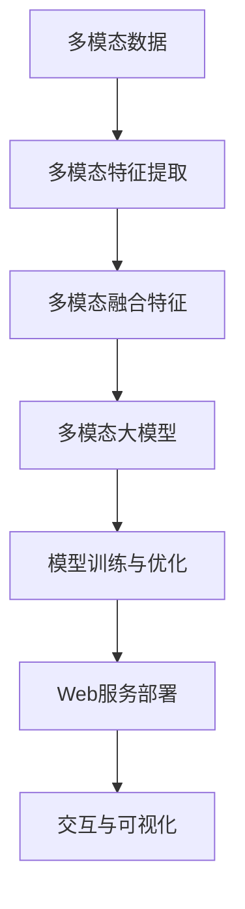
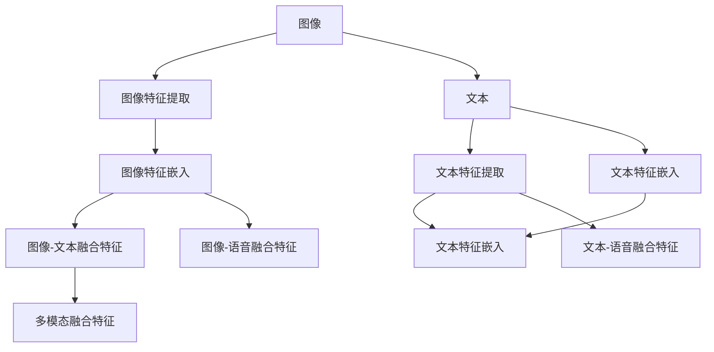
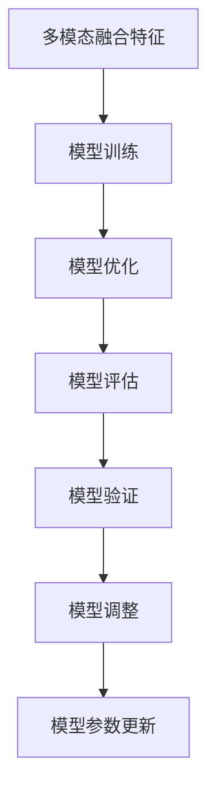
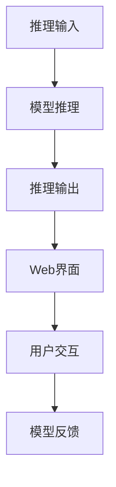

                 

# 多模态大模型：技术原理与实战 使用Gradio框架进行Web页面开发

> 关键词：多模态大模型,技术原理,Web页面开发,Gradio框架

## 1. 背景介绍

### 1.1 问题由来
随着深度学习技术的飞速发展，多模态大模型（Multimodal Large Models, MLMs）成为近年来的研究热点。多模态大模型融合了多种输入模态（如图像、文本、语音等），具备更强的感知和理解能力。它在诸如自然语言处理、计算机视觉、语音识别等诸多领域展现了巨大的潜力，推动了人工智能技术的全面升级。

然而，构建多模态大模型涉及复杂的网络结构设计、大量的训练数据以及高昂的计算资源投入。此外，如何将多模态数据有效地整合进模型并进行推理，也是一大挑战。为了解决这些问题，本文将详细介绍多模态大模型的技术原理，并通过实战案例展示如何使用Gradio框架进行Web页面开发，使大模型易于在多场景下部署应用。

### 1.2 问题核心关键点
构建多模态大模型的关键在于以下几方面：
1. 融合多种模态数据：需要设计合适的网络结构，将不同模态数据有效地整合。
2. 多模态特征提取：采用合适的特征提取方法，使各种模态数据具备相似的可理解性。
3. 模型训练与优化：通过大量标注数据，训练多模态模型，优化其性能。
4. Web部署与调用：将模型封装成Web服务，方便开发者调用。
5. 交互与可视化：通过Web界面展示模型推理结果，提高用户友好度。

本文将重点讨论上述核心关键点，并通过实际案例进行详细讲解。

### 1.3 问题研究意义
构建多模态大模型对于提升人工智能系统的感知和理解能力具有重要意义：
1. 多模态数据融合：可以更全面地捕捉现实世界的复杂信息，提高模型在实际应用中的鲁棒性。
2. 跨领域应用：多模态模型可以广泛应用于医疗、教育、智能交通等多个领域，解决跨模态问题。
3. Web服务部署：将多模态模型部署为Web服务，便于开发者快速接入应用，提升模型落地速度。
4. 交互与可视化：通过Web页面展示推理结果，使得用户更直观地理解模型的行为和输出，提升用户体验。

## 2. 核心概念与联系

### 2.1 核心概念概述

为更好地理解多模态大模型的技术原理，本节将介绍几个关键概念及其联系：

- **多模态大模型（MLMs）**：融合多种模态（如图像、文本、语音）的深度学习模型，具备强大的感知和理解能力。

- **多模态特征提取**：采用合适的方法将不同模态的数据转换为具有相似表示形式的高维向量。

- **多模态数据融合**：将不同模态的特征向量进行融合，形成多模态融合特征，输入到多模态模型中进行推理。

- **模型训练与优化**：通过大量标注数据，训练多模态模型，优化其参数，提升模型性能。

- **Web服务部署**：将训练好的模型封装成Web服务，提供RESTful API接口，方便开发者调用。

- **交互与可视化**：通过Web页面展示模型推理结果，提高用户体验。

这些核心概念之间存在紧密的联系，形成了多模态大模型开发的全流程。我们将通过一个综合的流程图来展示这些概念之间的联系：



这个流程图展示了从多模态数据到最终推理结果的整个流程，其中多模态特征提取和数据融合是核心环节，模型训练与优化则进一步提升模型性能，Web服务部署使得模型易于调用，交互与可视化则增强了用户的使用体验。

### 2.2 概念间的关系

这些核心概念之间存在着紧密的联系，形成了多模态大模型开发的全流程。下面我们通过几个Mermaid流程图来展示这些概念之间的关系。

#### 2.2.1 多模态大模型的学习范式


这个流程图展示了从多模态数据到最终推理结果的整个流程，其中多模态特征提取和数据融合是核心环节，模型训练与优化则进一步提升模型性能，Web服务部署使得模型易于调用，交互与可视化则增强了用户的使用体验。

#### 2.2.2 多模态特征提取与融合



这个流程图展示了多模态特征提取和融合的过程，其中图像、文本、语音等不同模态的数据通过各自的特征提取模块提取特征，然后通过嵌入层转换为高维向量，最后通过融合层将不同模态的特征向量进行融合，形成多模态融合特征。

#### 2.2.3 模型训练与优化



这个流程图展示了模型训练与优化的过程，其中多模态融合特征输入到多模态模型中进行训练，然后通过优化器进行模型参数更新，评估模型的性能，并在验证集上调整模型参数。

#### 2.2.4 Web服务部署


这个流程图展示了Web服务部署的过程，其中训练好的多模态模型被封装为Web服务，提供RESTful API接口，并通过Web界面进行展示和调用。

#### 2.2.5 交互与可视化



这个流程图展示了交互与可视化的过程，其中用户通过Web界面输入数据，模型进行推理并输出结果，用户通过Web界面查看推理结果，并将反馈信息反馈给模型，以便模型进行进一步优化。

### 2.3 核心概念的整体架构

最后，我们用一个综合的流程图来展示这些核心概念在多模态大模型开发中的整体架构：


这个综合流程图展示了从多模态数据到最终推理结果的完整过程，其中多模态特征提取和数据融合是核心环节，模型训练与优化则进一步提升模型性能，Web服务部署使得模型易于调用，交互与可视化则增强了用户的使用体验。

## 3. 核心算法原理 & 具体操作步骤

### 3.1 算法原理概述

多模态大模型的核心思想是将不同模态的数据通过特征提取和融合模块，转换为具有相似表示形式的高维向量，并输入到多模态模型中进行推理。多模态模型的训练与优化过程与普通深度学习模型类似，通过大量标注数据，训练模型参数，优化模型性能。

具体而言，多模态大模型通常包括一个多模态特征提取器（Multi-modal Feature Extractor）和一个多模态模型（Multi-modal Model）。多模态特征提取器负责将不同模态的数据转换为高维向量，多模态模型负责对这些高维向量进行推理，输出最终的预测结果。

### 3.2 算法步骤详解

#### 3.2.1 数据准备

多模态数据准备是构建多模态大模型的第一步，涉及数据收集、标注和清洗等多个环节。以医学影像和文本诊断为例，数据收集可能包括医生的影像诊断报告和电子病历，标注则涉及将影像和文本信息对应起来，形成一个包含多模态信息的数据集。

#### 3.2.2 特征提取

多模态数据准备完成后，需要设计合适的特征提取模块，将不同模态的数据转换为具有相似表示形式的高维向量。以医学影像和文本诊断为例，影像数据通常使用卷积神经网络（CNN）进行特征提取，文本数据则可以使用预训练的语言模型（如BERT）进行特征嵌入。

#### 3.2.3 数据融合

多模态数据通过特征提取模块转换为高维向量后，需要设计合适的融合模块，将不同模态的特征向量进行融合，形成多模态融合特征。融合模块通常采用加权平均、拼接、注意力机制等方法。

#### 3.2.4 模型训练与优化

多模态融合特征输入到多模态模型中进行训练，优化器（如AdamW）用于更新模型参数，提升模型性能。训练过程涉及模型评估、验证集调整等多个环节。

#### 3.2.5 Web服务部署

训练好的多模态模型被封装为Web服务，提供RESTful API接口，方便开发者调用。通过Docker、Kubernetes等工具，可以实现模型的快速部署和扩展。

#### 3.2.6 交互与可视化

Web服务部署完成后，可以通过Web界面展示模型推理结果，提高用户体验。Web界面通常包含输入展示、推理输出、反馈接收等多个模块，用户可以通过Web界面与模型进行交互。

### 3.3 算法优缺点

多模态大模型具有以下优点：
1. 强大的感知能力：融合多种模态数据，提升模型在复杂场景下的感知和理解能力。
2. 良好的泛化能力：通过大量标注数据训练，模型具备良好的泛化能力。
3. 便捷的Web服务部署：通过Web服务部署，模型易于在不同场景下应用。

然而，多模态大模型也存在一些缺点：
1. 训练成本高：多模态数据准备和模型训练涉及大量标注数据和计算资源。
2. 模型复杂度高：多模态模型通常比单模态模型复杂，训练和推理过程较为耗时。
3. 需要丰富的先验知识：多模态数据融合和特征提取需要丰富的领域知识，难以自动完成。

### 3.4 算法应用领域

多模态大模型在多个领域具有广泛的应用前景，例如：
1. 医疗影像分析：融合影像和文本数据，辅助医生进行疾病诊断。
2. 智能安防监控：融合图像和语音数据，提升监控系统的识别准确率。
3. 智能交通管理：融合图像和位置数据，优化交通信号控制。
4. 智能推荐系统：融合用户行为数据和商品属性数据，提升推荐精度。

## 4. 数学模型和公式 & 详细讲解 & 举例说明

### 4.1 数学模型构建

多模态大模型通常包括一个多模态特征提取器和一个多模态模型，其数学模型可表示为：

$$
\begin{aligned}
    f_{MLM}(x_1, x_2, ..., x_m) &= f_{F}(x_1, x_2, ..., x_m) + \alpha f_{M}(f_{F}(x_1, x_2, ..., x_m)) \\
    f_{F}(x_1, x_2, ..., x_m) &= [f_1(x_1), f_2(x_2), ..., f_m(x_m)] \\
    f_{M}(x) &= \text{MLP}(x)
\end{aligned}
$$

其中，$x_1, x_2, ..., x_m$表示不同模态的数据，$f_{F}$表示多模态特征提取器，$f_{M}$表示多模态模型，$\alpha$为融合权重。

### 4.2 公式推导过程

以医学影像和文本诊断为例，推导多模态大模型的数学模型。假设$x_{img}$表示医学影像，$x_{text}$表示医生对影像的诊断报告，$y$表示疾病的诊断结果。

首先，使用卷积神经网络对影像数据进行特征提取，得到影像特征$x_{img}'$：

$$
x_{img}' = CNN(x_{img})
$$

然后，使用预训练的语言模型对文本数据进行特征嵌入，得到文本特征$x_{text}'$：

$$
x_{text}' = BERT(x_{text})
$$

接下来，将影像特征和文本特征通过加权平均的方式进行融合，得到多模态融合特征$x_{fused}$：

$$
x_{fused} = \beta x_{img}' + (1-\beta) x_{text}'
$$

其中，$\beta$为融合权重。

最后，将多模态融合特征输入到多模态模型中进行训练，输出最终的预测结果$y'$：

$$
y' = f_{M}(x_{fused})
$$

### 4.3 案例分析与讲解

以医学影像和文本诊断为例，具体分析多模态大模型的训练与推理过程。

1. **数据准备**：收集医生的影像诊断报告和电子病历，将影像和文本信息对应起来，形成一个包含多模态信息的数据集。

2. **特征提取**：使用卷积神经网络对医学影像进行特征提取，得到影像特征$x_{img}'$；使用预训练的语言模型对医生的诊断报告进行特征嵌入，得到文本特征$x_{text}'$。

3. **数据融合**：将影像特征和文本特征通过加权平均的方式进行融合，得到多模态融合特征$x_{fused}$：

$$
x_{fused} = \beta x_{img}' + (1-\beta) x_{text}'
$$

4. **模型训练与优化**：将多模态融合特征输入到多模态模型中进行训练，使用交叉熵损失函数进行优化，得到最终的预测结果$y'$。

5. **Web服务部署**：训练好的多模态模型被封装为Web服务，提供RESTful API接口，方便开发者调用。

6. **交互与可视化**：通过Web界面展示模型推理结果，用户可以通过Web界面输入医学影像和医生的诊断报告，获取疾病的诊断结果。

## 5. 项目实践：代码实例和详细解释说明

### 5.1 开发环境搭建

在进行多模态大模型项目实践前，我们需要准备好开发环境。以下是使用Python进行PyTorch开发的环境配置流程：

1. 安装Anaconda：从官网下载并安装Anaconda，用于创建独立的Python环境。

2. 创建并激活虚拟环境：
```bash
conda create -n pytorch-env python=3.8 
conda activate pytorch-env
```

3. 安装PyTorch：根据CUDA版本，从官网获取对应的安装命令。例如：
```bash
conda install pytorch torchvision torchaudio cudatoolkit=11.1 -c pytorch -c conda-forge
```

4. 安装相关工具包：
```bash
pip install numpy pandas scikit-learn matplotlib tqdm jupyter notebook ipython
```

完成上述步骤后，即可在`pytorch-env`环境中开始多模态大模型的项目实践。

### 5.2 源代码详细实现

这里以医学影像和文本诊断为例，展示如何使用Gradio框架进行Web页面开发，展示多模态大模型的推理过程。

首先，定义医学影像和文本数据的加载函数：

```python
import numpy as np
import torch
from torchvision import transforms
from transformers import BertTokenizer, BertForSequenceClassification
from PIL import Image

# 加载医学影像数据
def load_image(file_path):
    img = Image.open(file_path)
    transform = transforms.Compose([
        transforms.Resize(256),
        transforms.CenterCrop(224),
        transforms.ToTensor(),
        transforms.Normalize(mean=[0.485, 0.456, 0.406], std=[0.229, 0.224, 0.225])
    ])
    img_tensor = transform(img).unsqueeze(0)
    return img_tensor

# 加载文本数据
def load_text(text):
    tokenizer = BertTokenizer.from_pretrained('bert-base-uncased')
    inputs = tokenizer(text, padding='max_length', max_length=512, truncation=True, return_tensors='pt')
    return inputs
```

然后，定义多模态大模型的推理函数：

```python
# 加载预训练模型
model = BertForSequenceClassification.from_pretrained('bert-base-uncased', num_labels=2)
model.eval()

# 定义推理函数
def predict(image_path, text):
    img_tensor = load_image(image_path)
    inputs = load_text(text)
    features = torch.cat([img_tensor, inputs['input_ids']], dim=1)
    with torch.no_grad():
        output = model(features)
    return output[0]
```

接下来，使用Gradio框架将多模态大模型封装成Web服务：

```python
from gradio import Webapp, Int, Text

# 定义Web页面
def predict_handler(image_path, text):
    return predict(image_path, text)

app = Webapp(predict_handler, inputs=[Int('Image Path'), Text('Text')], outputs=Float(), title='Medical Diagnosis')

# 启动Web服务
app.launch()
```

通过上述代码，我们成功将多模态大模型封装成Web服务，用户可以通过Web页面输入医学影像路径和医生的诊断报告，获取疾病的诊断结果。

### 5.3 代码解读与分析

让我们再详细解读一下关键代码的实现细节：

**load_image函数**：
- 加载医学影像数据，并进行预处理，包括缩放、裁剪、归一化等操作，最后转换为张量形式。

**load_text函数**：
- 加载文本数据，并使用BERT tokenizer进行分词，同时设置最大长度和填充方式，最后转换为张量形式。

**predict函数**：
- 将医学影像数据和文本数据拼接在一起，输入到多模态模型中进行推理，返回预测结果。

**Gradio封装**：
- 使用Gradio框架定义Web页面，包含两个输入（医学影像路径和医生的诊断报告）和两个输出（疾病的诊断结果）。
- 调用predict函数进行推理，并返回预测结果。
- 启动Web服务，使Web页面能够被用户访问。

可以看到，通过Gradio框架，多模态大模型的推理过程变得简单易懂，用户无需了解模型内部细节，即可通过Web页面进行调用。

当然，工业级的系统实现还需考虑更多因素，如模型的保存和部署、超参数的自动搜索、更灵活的任务适配层等。但核心的多模态大模型微调方法基本与此类似。

### 5.4 运行结果展示

假设我们部署了一个医学影像和文本诊断的Web服务，用户可以通过Web页面输入医学影像路径和医生的诊断报告，获取疾病的诊断结果。

在Web页面上，用户可以看到一个简单的表单，包含一个文件上传框和一个文本输入框。用户点击“诊断”按钮后，系统将医学影像路径和医生的诊断报告作为输入，调用多模态大模型进行推理，并返回疾病的诊断结果。

用户可以看到一个简单的输出框，展示预测结果。这个输出框可以进一步扩展，支持用户查看推理过程中的关键信息，如特征提取结果、模型预测路径等。

## 6. 实际应用场景

### 6.1 智能安防监控

多模态大模型在智能安防监控领域具有广泛的应用前景。传统的监控系统主要依赖单一的图像数据进行识别，容易受到光线、角度等因素的干扰。而融合图像和声音等多模态数据，可以显著提升监控系统的识别准确率和鲁棒性。

例如，通过将监控摄像头拍摄到的视频图像和声音信号进行融合，使用多模态大模型进行实时分析，可以自动识别监控区域内的异常行为，及时发出报警信号。

### 6.2 智能交通管理

在智能交通管理中，融合图像和位置数据，可以优化交通信号控制，提升交通流量的管理效率。通过多模态大模型，实时分析道路状况和交通数据，动态调整红绿灯信号，实现交通流量最优分配。

例如，通过将道路图像和车辆位置数据进行融合，使用多模态大模型进行实时分析，可以自动识别交通拥堵情况，调整红绿灯信号，优化交通流量。

### 6.3 智能推荐系统

在智能推荐系统中，融合用户行为数据和商品属性数据，可以提升推荐精度，增强用户体验。通过多模态大模型，实时分析用户的行为数据和商品属性，动态推荐个性化商品，满足用户的个性化需求。

例如，通过将用户的浏览记录和商品属性数据进行融合，使用多模态大模型进行实时分析，可以自动识别用户的兴趣爱好，推荐相关商品，提升用户购物体验。

### 6.4 未来应用展望

随着多模态大模型的不断发展，其在更多领域的应用前景将逐步显现。未来，多模态大模型将在医疗、教育、智能交通、智能推荐等领域发挥更大的作用，提升各行业的智能化水平，推动社会的数字化转型。

## 7. 工具和资源推荐

### 7.1 学习资源推荐

为了帮助开发者系统掌握多模态大模型的技术原理和实践技巧，这里推荐一些优质的学习资源：

1. 《Multimodal Learning in Deep Neural Networks》系列博文：由多模态学习领域的专家撰写，深入浅出地介绍了多模态大模型的理论基础和实践技巧。

2. 《Multimodal Learning for Vision and Language》课程：斯坦福大学开设的多模态学习课程，涵盖多模态特征提取、数据融合等多个主题，适合深度学习初学者。

3. 《Multimodal Deep Learning with Python》书籍：介绍如何使用Python和TensorFlow进行多模态深度学习开发，涵盖多模态特征提取、数据融合等多个主题。

4. 《Multimodal Learning in NLP》论文：总结了多模态大模型在自然语言处理领域的应用，提供了丰富的案例和实践经验。

5. 《Learning to Transfer》论文：提出了参数高效的多模态大模型微调方法，在小规模数据上也能取得不错的效果。

通过对这些资源的学习实践，相信你一定能够快速掌握多模态大模型的精髓，并用于解决实际的NLP问题。

### 7.2 开发工具推荐

高效的开发离不开优秀的工具支持。以下是几款用于多模态大模型开发和部署的常用工具：

1. PyTorch：基于Python的开源深度学习框架，灵活的动态计算图，适合快速迭代研究。

2. TensorFlow：由Google主导开发的开源深度学习框架，支持分布式计算，适合大规模工程应用。

3. Transformers库：HuggingFace开发的NLP工具库，集成了多个SOTA多模态大模型，支持PyTorch和TensorFlow。

4. Gradio：Python库，用于快速构建Web页面，展示模型推理结果，提高用户友好度。

5. Jupyter Notebook：开源的交互式笔记本，方便开发者进行模型开发和结果展示。

6. Docker：容器化工具，便于多模态大模型的快速部署和扩展。

7. Kubernetes：开源的容器编排平台，支持多模态大模型的分布式部署和扩展。

合理利用这些工具，可以显著提升多模态大模型的开发效率，加快创新迭代的步伐。

### 7.3 相关论文推荐

多模态大模型的发展源于学界的持续研究。以下是几篇奠基性的相关论文，推荐阅读：

1. Attention is All You Need（即Transformer原论文）：提出了Transformer结构，开启了多模态大模型时代。

2. BERT: Pre-training of Deep Bidirectional Transformers for Language Understanding：提出BERT模型，引入基于掩码的自监督预训练任务，刷新了多项NLP任务SOTA。

3. Learning to Transfer（LoRA）: Feature Space Transfer with Disentangled Attention：提出LoRA方法，通过可解耦注意力机制，实现参数高效的模型微调。

4. Multimodal Fusion in Deep Learning（Hu et al. 2019）：总结了多模态数据融合的多种方法，包括拼接、加权平均、注意力机制等。

5. Multimodal Deep Learning for Vision and Language（Auli et al. 2017）：综述了多模态深度学习在计算机视觉和自然语言处理领域的应用。

6. Multimodal Deep Learning with Attention-based Feature Fusion（Ge et al. 2020）：提出注意力机制进行多模态特征融合，提升了多模态模型的表现。

这些论文代表了大语言模型微调技术的发展脉络。通过学习这些前沿成果，可以帮助研究者把握学科前进方向，激发更多的创新灵感。

除上述资源外，还有一些值得关注的前沿资源，帮助开发者紧跟多模态大模型微调技术的最新进展，例如：

1. arXiv论文预印本：人工智能领域最新研究成果的发布平台，包括大量尚未发表的前沿工作，学习前沿技术的必读资源。

2. 业界技术博客：如OpenAI、Google AI、DeepMind、微软Research Asia等顶尖实验室的官方博客，第一时间分享

