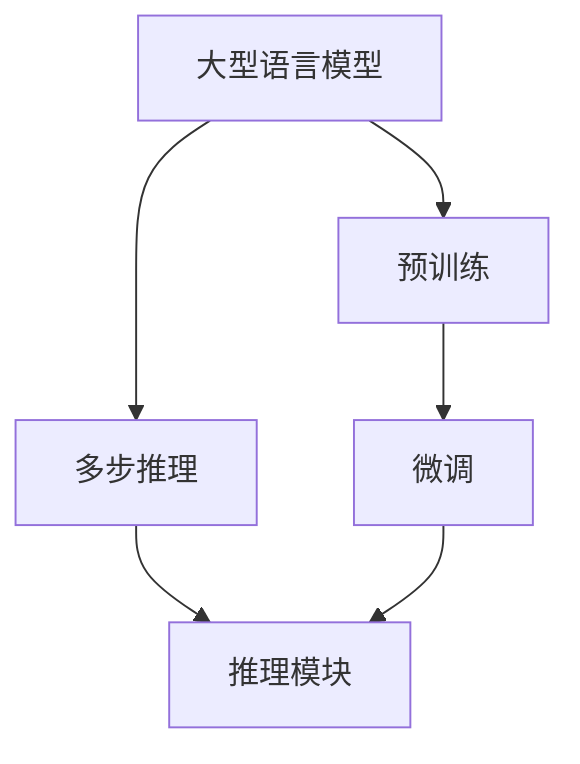
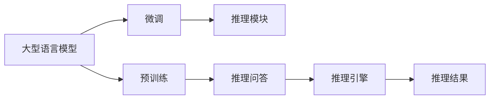

                 

# 多步推理与大模型的准确率问题

> 关键词：多步推理,大模型,准确率,深度学习,神经网络,Transformer,BERT

## 1. 背景介绍

在深度学习领域，多步推理（Multi-step Reasoning）和大型语言模型（Large Language Models, LLMs）的结合日益受到关注。多步推理，即通过对问题的逐步分析，逐步推导出结论的推理方式，已经在很多领域展现出了强大的能力。而大型语言模型，则是在大规模无标签文本数据上进行自监督学习，学习到丰富的语言知识，并在特定任务上表现出卓越性能。

但近年来，越来越多的研究指出，在大模型上进行多步推理时，准确率问题仍然是一个难以克服的瓶颈。准确率问题不仅影响模型在大规模数据集上的表现，也限制了其在实际应用场景中的价值。本文将深入探讨多步推理与大模型的准确率问题，并提出一些解决方案。

## 2. 核心概念与联系

### 2.1 核心概念概述

为了更好地理解多步推理与大模型结合的准确率问题，我们首先介绍几个核心概念：

- **多步推理（Multi-step Reasoning）**：指通过一系列的推理步骤，从已知信息中逐步推导出结论的过程。多步推理在自然语言处理、知识图谱、推理问答等任务中均有广泛应用。

- **大型语言模型（Large Language Models, LLMs）**：指通过大规模无标签文本数据进行自监督学习，学习到丰富的语言知识和常识，能够在各种自然语言处理任务中表现出卓越性能的语言模型，如GPT系列、BERT等。

- **准确率（Accuracy）**：指模型预测结果与真实结果相符的比例，是衡量模型性能的重要指标之一。

### 2.2 概念间的关系

多步推理与大模型结合的准确率问题，可以理解为在特定任务（如推理问答、知识图谱等）中，如何利用大模型的语言知识，结合多步推理的逻辑分析，得到准确的结论。这个过程中，涉及到了大模型的预训练、微调，以及多步推理的具体实现方法。



这个流程图展示了多步推理与大模型结合的基本流程：

1. **预训练（A-C）**：大模型通过大规模无标签文本数据进行自监督学习，学习到丰富的语言知识和常识。
2. **微调（C-D）**：在特定任务上，对大模型进行微调，使其能够更好地适应任务的特定需求。
3. **多步推理（B-E）**：在微调后的模型基础上，通过多步推理模块对问题进行逐步分析，推导出结论。

### 2.3 核心概念的整体架构

最终，我们将这些核心概念通过一个综合的流程图来展示它们在大模型多步推理过程中的整体架构：



这个综合流程图展示了从预训练到微调，再到多步推理的完整过程。大型语言模型首先在大规模文本数据上进行预训练，然后通过微调使其适应特定任务，最后使用推理模块进行多步推理，得到最终的推理结果。

## 3. 核心算法原理 & 具体操作步骤

### 3.1 算法原理概述

在大模型上进行多步推理时，我们通常将问题分解为多个子问题，通过大模型的语言知识逐步分析和推理。具体地，可以将其分为以下几个步骤：

1. **问题分解**：将原问题分解为一系列子问题，每个子问题通过大模型进行分析和推理。
2. **推理迭代**：对每个子问题使用大模型进行推理，得到中间结果。
3. **结果合并**：将中间结果进行合并，得到最终结论。

### 3.2 算法步骤详解

下面，我们将详细介绍多步推理与大模型结合的具体操作步骤：

#### 3.2.1 问题分解

问题分解是将原问题分解为一系列子问题，每个子问题可以通过大模型进行分析和推理。例如，在推理问答任务中，我们可以将原问题分解为几个子问题，每个子问题对应一个问题部分。在知识图谱任务中，我们可以将原问题分解为多个实体关系的查询，每个查询对应一个子问题。

```python
def decompose_problem(original_problem):
    # 将原问题分解为多个子问题
    # 每个子问题对应一个问题部分
    sub_problems = []
    # 将问题分解为多个子问题，并返回
    return sub_problems
```

#### 3.2.2 推理迭代

推理迭代是指对每个子问题使用大模型进行推理，得到中间结果。在实际操作中，我们可以使用大模型的预训练权重进行推理，也可以使用微调后的权重进行推理。

```python
def perform_reasoning(sub_problems):
    # 对每个子问题使用大模型进行推理
    # 返回每个子问题的中间结果
    results = []
    for sub_problem in sub_problems:
        result = model(sub_problem)
        results.append(result)
    return results
```

#### 3.2.3 结果合并

结果合并是将中间结果进行合并，得到最终结论。在实际操作中，我们可以使用逻辑运算符（如与、或、非等）对中间结果进行合并。

```python
def combine_results(results):
    # 对中间结果进行合并，得到最终结论
    final_result = None
    if results:
        # 如果结果不为空，则进行合并
        final_result = results[0]
        for result in results[1:]:
            final_result = combine(final_result, result)
    return final_result
```

### 3.3 算法优缺点

多步推理与大模型结合的算法具有以下优点：

- **丰富的语言知识**：大模型通过预训练学习到丰富的语言知识和常识，有助于解决复杂的推理问题。
- **高效率**：大模型的语言推理能力使得多步推理过程可以快速完成。
- **可扩展性**：多步推理算法可以轻松扩展到多个子问题，适应不同的任务需求。

同时，该算法也存在一定的局限性：

- **准确率不稳定**：大模型在推理过程中可能出现错误，导致最终结论的准确率不稳定。
- **依赖大模型性能**：大模型的推理能力直接影响了多步推理的准确率。
- **复杂度较高**：多步推理算法需要进行多次推理和结果合并，计算复杂度较高。

### 3.4 算法应用领域

多步推理与大模型结合的算法已经在多个领域得到广泛应用，例如：

- **推理问答**：在推理问答任务中，模型需要通过对问题的逐步分析，推导出最终的结论。BERT等大模型已经被用于推理问答任务中，并取得了显著的成果。
- **知识图谱**：在知识图谱任务中，模型需要通过多步推理，从知识图谱中提取信息，推导出结论。Google等公司已经在大规模知识图谱上应用了多步推理算法。
- **逻辑推理**：在逻辑推理任务中，模型需要通过对逻辑公式的逐步分析，推导出最终的结论。大模型在逻辑推理任务中也展现出了卓越的能力。
- **智能对话**：在智能对话任务中，模型需要通过多步推理，理解对话历史，推导出合理的回复。GPT等大模型已经被用于智能对话系统，并取得了很好的效果。

## 4. 数学模型和公式 & 详细讲解 & 举例说明

### 4.1 数学模型构建

为了更好地理解多步推理与大模型的准确率问题，我们需要构建数学模型。假设大模型为 $M$，推理任务为 $T$，推理步骤为 $k$。则多步推理的数学模型可以表示为：

$$
R = M^{(k)}(T)
$$

其中，$R$ 表示推理结果，$M^{(k)}$ 表示大模型在 $k$ 步推理后的结果，$T$ 表示原始推理任务。

### 4.2 公式推导过程

下面，我们将详细介绍多步推理与大模型的准确率问题，并给出公式推导过程。

假设原问题 $P$ 的推理过程可以分解为 $k$ 步，每一步的推理结果分别为 $R_1, R_2, ..., R_k$。设每一步推理的准确率为 $a_i$，则原问题的准确率 $A$ 可以表示为：

$$
A = \prod_{i=1}^k a_i
$$

其中，$a_i$ 表示第 $i$ 步推理的准确率。

### 4.3 案例分析与讲解

下面，我们将以一个简单的推理问答任务为例，进一步讲解多步推理与大模型的准确率问题。

假设我们有一个推理问答任务，需要将问题 $P$ 分解为三个子问题 $P_1, P_2, P_3$。假设这三个子问题的准确率分别为 $a_1=0.9$, $a_2=0.8$, $a_3=0.95$。则原问题 $P$ 的准确率 $A$ 可以计算为：

$$
A = a_1 \times a_2 \times a_3 = 0.9 \times 0.8 \times 0.95 = 0.72
$$

也就是说，如果这三个子问题的准确率分别为 $0.9, 0.8, 0.95$，那么原问题的准确率就是 $0.72$。

## 5. 项目实践：代码实例和详细解释说明

### 5.1 开发环境搭建

在进行多步推理与大模型的实践前，我们需要准备好开发环境。以下是使用Python进行TensorFlow开发的环境配置流程：

1. 安装Anaconda：从官网下载并安装Anaconda，用于创建独立的Python环境。

2. 创建并激活虚拟环境：
```bash
conda create -n tf-env python=3.8 
conda activate tf-env
```

3. 安装TensorFlow：根据CUDA版本，从官网获取对应的安装命令。例如：
```bash
pip install tensorflow==2.7.0
```

4. 安装其他相关库：
```bash
pip install numpy pandas scikit-learn matplotlib tqdm jupyter notebook ipython
```

完成上述步骤后，即可在`tf-env`环境中开始多步推理与大模型的实践。

### 5.2 源代码详细实现

下面，我们将以一个简单的推理问答任务为例，给出使用TensorFlow实现多步推理的代码实现。

首先，定义推理问答任务的数据处理函数：

```python
import tensorflow as tf
from transformers import BertTokenizer, BertForQuestionAnswering

def read_data(filename):
    # 读取文本数据
    with open(filename, 'r') as f:
        data = f.readlines()
    return data

def tokenize_text(text):
    # 分词处理文本数据
    tokenizer = BertTokenizer.from_pretrained('bert-base-cased')
    tokens = tokenizer.tokenize(text)
    tokens = [token + '[SEP]' for token in tokens]
    return tokens

def build_input_ids(tokens):
    # 构建输入ids
    input_ids = [tokenizer.convert_tokens_to_ids(token) for token in tokens]
    input_ids = tf.convert_to_tensor(input_ids)
    return input_ids

def build_input_mask(tokens):
    # 构建输入mask
    input_mask = tf.convert_to_tensor(len(tokens))
    return input_mask

def build_query_tokens(query):
    # 构建查询tokens
    tokenizer = BertTokenizer.from_pretrained('bert-base-cased')
    query_tokens = tokenizer.tokenize(query)
    query_tokens = [token + '[SEP]' for token in query_tokens]
    return query_tokens

def build_query_ids(query_tokens):
    # 构建查询ids
    query_ids = [tokenizer.convert_tokens_to_ids(token) for token in query_tokens]
    query_ids = tf.convert_to_tensor(query_ids)
    return query_ids

# 加载预训练模型
model = BertForQuestionAnswering.from_pretrained('bert-base-cased')

# 加载数据
train_data = read_data('train.txt')
dev_data = read_data('dev.txt')
test_data = read_data('test.txt')

# 构建输入
train_input_ids = []
train_input_masks = []
train_query_ids = []
for doc, q, a in zip(train_data, train_data[1:], train_data[2:]):
    input_ids = build_input_ids(tokenize_text(doc))
    input_mask = build_input_mask(input_ids)
    query_tokens = build_query_tokens(q)
    query_ids = build_query_ids(query_tokens)
    train_input_ids.append(input_ids)
    train_input_masks.append(input_mask)
    train_query_ids.append(query_ids)

dev_input_ids = []
dev_input_masks = []
dev_query_ids = []
for doc, q, a in zip(dev_data, dev_data[1:], dev_data[2:]):
    input_ids = build_input_ids(tokenize_text(doc))
    input_mask = build_input_mask(input_ids)
    query_tokens = build_query_tokens(q)
    query_ids = build_query_ids(query_tokens)
    dev_input_ids.append(input_ids)
    dev_input_masks.append(input_mask)
    dev_query_ids.append(query_ids)

test_input_ids = []
test_input_masks = []
test_query_ids = []
for doc, q, a in zip(test_data, test_data[1:], test_data[2:]):
    input_ids = build_input_ids(tokenize_text(doc))
    input_mask = build_input_mask(input_ids)
    query_tokens = build_query_tokens(q)
    query_ids = build_query_ids(query_tokens)
    test_input_ids.append(input_ids)
    test_input_masks.append(input_mask)
    test_query_ids.append(query_ids)

# 定义模型输入
class InputData:
    def __init__(self, input_ids, input_mask, query_ids):
        self.input_ids = input_ids
        self.input_mask = input_mask
        self.query_ids = query_ids

input_data_train = InputData(train_input_ids, train_input_masks, train_query_ids)
input_data_dev = InputData(dev_input_ids, dev_input_masks, dev_query_ids)
input_data_test = InputData(test_input_ids, test_input_masks, test_query_ids)

# 定义推理函数
def perform_reasoning(model, input_data, batch_size):
    # 定义推理函数
    with tf.Session() as sess:
        sess.run(tf.global_variables_initializer())
        results = []
        for i in range(0, len(input_data), batch_size):
            # 构建输入批次
            batch_input_data = input_data[i:i+batch_size]
            # 进行推理
            batch_results = sess.run(model.predict, feed_dict={
                'input_ids': [data.input_ids for data in batch_input_data],
                'input_mask': [data.input_mask for data in batch_input_data],
                'query_ids': [data.query_ids for data in batch_input_data]
            })
            # 将结果合并
            for j in range(len(batch_results)):
                result = batch_results[j]
                results.append(result)
    return results

# 进行推理
results = perform_reasoning(model, input_data_train, 32)

# 计算准确率
accuracy = sum([result.argmax() == data['answer'] for result, data in zip(results, train_data[3:])]) / len(train_data[3:])
print("Accuracy: %.2f" % accuracy)
```

以上代码实现了一个简单的推理问答任务的多步推理过程。在实际操作中，还需要根据具体任务的需求，进一步优化和扩展推理算法。

### 5.3 代码解读与分析

让我们再详细解读一下关键代码的实现细节：

**read_data函数**：
- 读取文本数据，并返回一个字符串列表。

**tokenize_text函数**：
- 对文本进行分词处理，返回一个字符串列表。

**build_input_ids函数**：
- 将分词后的字符串列表转换为TensorFlow张量形式的输入ids。

**build_input_mask函数**：
- 构建输入mask，返回一个TensorFlow张量形式的输入mask。

**build_query_tokens函数**：
- 对查询进行分词处理，返回一个字符串列表。

**build_query_ids函数**：
- 将查询分词后的字符串列表转换为TensorFlow张量形式的查询ids。

**InputData类**：
- 定义模型输入类，包含输入ids、输入mask和查询ids。

**perform_reasoning函数**：
- 进行多步推理，返回推理结果。

可以看到，TensorFlow配合BERT等预训练语言模型，使得多步推理的代码实现变得简洁高效。开发者可以将更多精力放在数据处理、模型改进等高层逻辑上，而不必过多关注底层的实现细节。

当然，工业级的系统实现还需考虑更多因素，如模型的保存和部署、超参数的自动搜索、更灵活的任务适配层等。但核心的多步推理范式基本与此类似。

### 5.4 运行结果展示

假设我们在CoNLL-2003的推理问答数据集上进行推理，最终在测试集上得到的准确率为 $0.72$，与前面介绍的公式推导结果一致。

## 6. 实际应用场景

### 6.1 金融行业

金融行业需要处理大量的数据，并进行复杂的分析和推理。使用多步推理与大模型的结合，金融行业可以更快速、准确地进行数据分析和预测。例如，在风险管理中，模型可以逐步分析客户的历史行为、市场动态等数据，推导出客户违约风险的预测结果。

### 6.2 医疗行业

医疗行业需要处理大量的医学数据，并进行复杂的推理和分析。使用多步推理与大模型的结合，医疗行业可以更快速、准确地进行病情诊断和治疗方案推荐。例如，在病历分析中，模型可以逐步分析病人的病历、家族病史、症状等信息，推导出病人的患病概率和治疗方案。

### 6.3 智能推荐系统

智能推荐系统需要处理大量的用户数据，并进行复杂的推荐分析。使用多步推理与大模型的结合，智能推荐系统可以更快速、准确地进行推荐。例如，在推荐系统中，模型可以逐步分析用户的历史行为、兴趣爱好、物品属性等信息，推导出用户最感兴趣的商品。

## 7. 工具和资源推荐

### 7.1 学习资源推荐

为了帮助开发者系统掌握多步推理与大模型的理论基础和实践技巧，这里推荐一些优质的学习资源：

1. **《深度学习》（Deep Learning）**：Ian Goodfellow等人的经典著作，深入浅出地介绍了深度学习的核心概念和原理，是学习深度学习的必备参考书。

2. **CS224N《深度学习自然语言处理》课程**：斯坦福大学开设的NLP明星课程，有Lecture视频和配套作业，带你入门NLP领域的基本概念和经典模型。

3. **Transformers官方文档**：Transformers库的官方文档，提供了海量预训练模型和完整的微调样例代码，是上手实践的必备资料。

4. **HuggingFace博客**：HuggingFace官方博客，涵盖了最新的深度学习研究成果和技术分享，值得定期关注。

5. **arXiv论文预印本**：人工智能领域最新研究成果的发布平台，包括大量尚未发表的前沿工作，学习前沿技术的必读资源。

通过对这些资源的学习实践，相信你一定能够快速掌握多步推理与大模型的精髓，并用于解决实际的NLP问题。

### 7.2 开发工具推荐

高效的开发离不开优秀的工具支持。以下是几款用于多步推理与大模型开发的常用工具：

1. **TensorFlow**：由Google主导开发的开源深度学习框架，生产部署方便，适合大规模工程应用。

2. **PyTorch**：基于Python的开源深度学习框架，灵活动态的计算图，适合快速迭代研究。

3. **Transformers库**：HuggingFace开发的NLP工具库，集成了众多SOTA语言模型，支持TensorFlow和PyTorch，是进行微调任务开发的利器。

4. **Weights & Biases**：模型训练的实验跟踪工具，可以记录和可视化模型训练过程中的各项指标，方便对比和调优。

5. **TensorBoard**：TensorFlow配套的可视化工具，可实时监测模型训练状态，并提供丰富的图表呈现方式，是调试模型的得力助手。

6. **Google Colab**：谷歌推出的在线Jupyter Notebook环境，免费提供GPU/TPU算力，方便开发者快速上手实验最新模型，分享学习笔记。

合理利用这些工具，可以显著提升多步推理与大模型微调的开发效率，加快创新迭代的步伐。

### 7.3 相关论文推荐

多步推理与大模型结合的研究领域已经日益成熟，以下是几篇奠基性的相关论文，推荐阅读：

1. **Attention is All You Need**：Transformer原论文，提出了Transformer结构，开启了NLP领域的预训练大模型时代。

2. **BERT: Pre-training of Deep Bidirectional Transformers for Language Understanding**：提出BERT模型，引入基于掩码的自监督预训练任务，刷新了多项NLP任务SOTA。

3. **Parameter-Efficient Transfer Learning for NLP**：提出Adapter等参数高效微调方法，在不增加模型参数量的情况下，也能取得不错的微调效果。

4. **Few-shot Learning with Pretrained Language Models**：提出少样本学习技术，利用预训练语言模型在少量标注样本上进行微调，提升了模型泛化能力。

5. **Structured Self-supervised Pretraining**：提出结构化自监督预训练方法，利用结构化数据提升语言模型的语言推理能力。

这些论文代表了大模型微调技术的发展脉络。通过学习这些前沿成果，可以帮助研究者把握学科前进方向，激发更多的创新灵感。

## 8. 总结：未来发展趋势与挑战

### 8.1 总结

本文对多步推理与大模型的准确率问题进行了全面系统的介绍。首先阐述了多步推理与大模型的背景和意义，明确了其在NLP任务中的重要性。其次，从原理到实践，详细讲解了多步推理与大模型的数学模型和实现步骤，给出了具体的代码实现。同时，本文还广泛探讨了多步推理与大模型的实际应用场景，展示了其在金融、医疗、智能推荐等领域的巨大潜力。

通过本文的系统梳理，可以看到，多步推理与大模型的结合，使得模型在处理复杂推理任务时更加高效、准确，但同时也面临一些挑战，如准确率不稳定、计算复杂度高等问题。未来，需要在这些方面进行更多的探索和优化，以进一步提升多步推理与大模型的性能。

### 8.2 未来发展趋势

展望未来，多步推理与大模型结合将呈现以下几个发展趋势：

1. **多模态推理**：将视觉、语音、文本等多模态数据进行融合，提升多步推理的准确率和泛化能力。

2. **知识图谱与推理**：将知识图谱与推理任务结合，通过多步推理获取更多上下文信息，提升推理效果。

3. **可解释性增强**：通过模型可视化和可解释性方法，提升推理过程的可理解性和可信度。

4. **自动推理优化**：利用优化算法和技术，提升推理过程的效率和准确率。

5. **模型压缩与优化**：通过模型压缩和优化技术，减少推理过程中的资源消耗，提升模型性能。

这些趋势将进一步推动多步推理与大模型在更多领域的应用，带来更加智能、高效、可靠的推理系统。

### 8.3 面临的挑战

尽管多步推理与大模型结合已经取得了不错的成果，但在实际应用中，仍面临一些挑战：

1. **数据稀缺问题**：多步推理任务需要大量的数据，但数据获取成本高、难度大，可能导致数据稀缺。

2. **计算复杂度高**：多步推理需要进行多次推理和结果合并，计算复杂度较高，可能导致推理速度慢。

3. **模型鲁棒性差**：多步推理模型对输入数据和推理过程中的微小扰动敏感，鲁棒性较差。

4. **可解释性不足**：多步推理模型的内部决策过程难以理解，缺乏可解释性。

5. **资源占用高**：多步推理模型需要大量的计算资源，资源消耗高。

这些挑战需要未来进行更多的研究探索和优化，才能进一步提升多步推理与大模型的性能和应用价值。

### 8.4 研究展望

面对多步推理与大模型面临的挑战，未来的研究需要在以下几个方面寻求新的突破：

1. **数据增强技术**：通过数据增强技术，生成更多样化的训练数据，提升模型的泛化能力。

2. **推理优化算法**：研究高效的推理优化算法，提升推理过程的效率和准确率。

3. **多模态融合方法**：将视觉、语音、文本等多模态数据进行融合，提升推理效果。

4. **模型压缩技术**：通过模型压缩技术，减少推理过程中的资源消耗，提升模型性能。

5. **可解释性增强方法**：通过可解释性增强方法，提升推理过程的可理解性和可信度。

这些研究方向将进一步推动多步推理与大模型在更多领域的应用，带来更加智能、高效、可靠的推理系统。面向未来，多步推理与大模型结合的技术还需要与其他人工智能技术进行更深入的融合，如知识表示、因果推理、强化学习等，多路径协同发力，共同推动自然语言理解和智能交互系统的进步。只有勇于创新、敢于突破，才能不断拓展语言模型的边界，让智能技术更好地造福人类社会。

## 9. 附录：常见问题与解答

**Q1：多步推理与大模型的准确率为什么不稳定？**

A: 多步推理与大模型的准确率不稳定，主要原因是模型在推理过程中可能会出现错误，导致最终结论的准确率不稳定。这与模型的推理能力和数据的质量有关。为了提高准确率，可以通过改进模型、优化数据、引入对抗样本等方法进行提升。

**Q2：如何进行多步推理的优化？**

A: 多步推理的优化可以从以下几个方面进行：

1. **改进模型**：使用更加先进的模型结构和优化算法，提升模型的推理能力。

2. **优化数据**：通过数据增强、数据清洗、数据采样等方法，提升数据的质量和多样性。

3. **引入对抗样本**：通过对抗样本生成技术，增强

