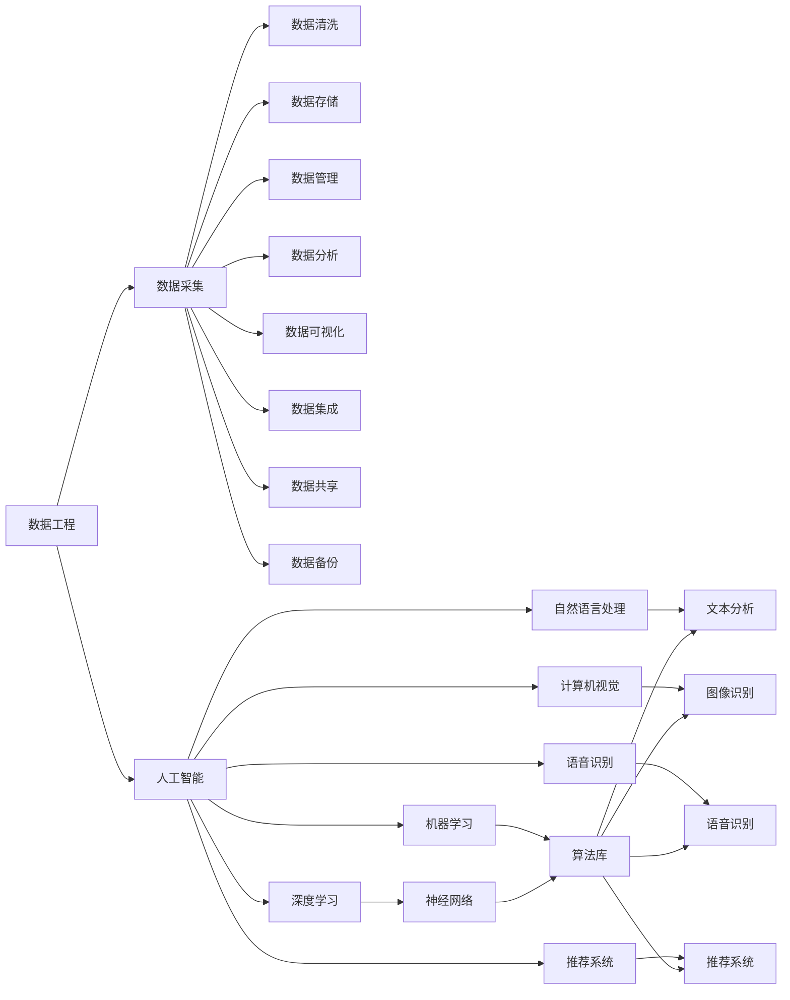
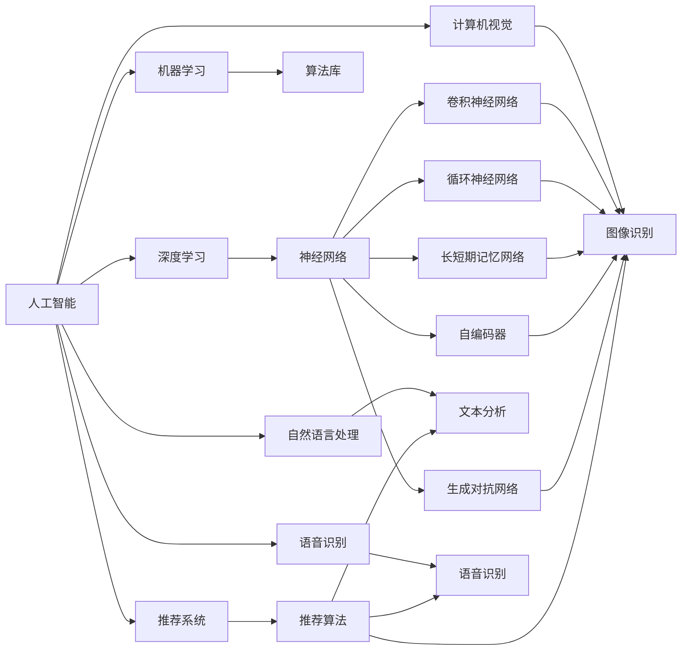

                 

# 大数据与人工智能的结合

> 关键词：大数据,人工智能,机器学习,深度学习,深度学习框架,分布式计算,实时数据处理,数据工程

## 1. 背景介绍

### 1.1 问题由来

在当今数字化、信息化高度发展的时代，大数据与人工智能(AI)技术的结合成为了推动各行各业创新和效率提升的重要驱动力。数据和AI的结合不仅可以有效提升数据价值，还能为决策者提供更加精准和智能的支持。在金融、医疗、零售、物流、能源、交通等众多领域，数据驱动的AI技术正在逐步替代传统的人工决策模式，提升业务流程自动化和智能化水平。

在具体实践中，大数据技术提供海量数据存储和处理能力，而AI技术则通过先进的数据分析和机器学习算法，从数据中挖掘出有价值的信息和知识，形成智能应用。大数据和AI的结合使得企业能够更有效地应对复杂的市场环境和客户需求，提升业务竞争力和市场反应速度。

### 1.2 问题核心关键点

大数据与人工智能的结合涉及多个核心关键点，主要包括：

- **数据工程**：数据采集、清洗、存储、管理和分析，是构建AI系统的基础。
- **深度学习框架**：如TensorFlow、PyTorch、Keras等，提供了丰富的AI算法和工具，是实现AI模型的重要平台。
- **分布式计算**：利用集群和并行计算技术，处理海量数据和复杂模型，提升AI系统的计算效率。
- **实时数据处理**：通过流处理引擎和实时计算技术，实时分析和处理数据流，支持实时决策。
- **数据隐私和安全**：在数据采集和处理过程中，必须确保数据的隐私和安全，防止数据泄露和滥用。

这些关键点相互作用，构成了大数据与AI结合的技术架构，使得企业能够高效利用数据资源，实现业务的智能化升级。

### 1.3 问题研究意义

研究大数据与AI的结合，对于推动各行业的数字化转型和智能化发展具有重要意义：

1. **提升决策精度**：通过数据驱动的AI模型，企业可以更准确地预测市场趋势和客户行为，提升决策的科学性和精准度。
2. **优化资源配置**：AI技术能够优化资源分配，降低成本，提高效率，提升企业竞争力。
3. **创新业务模式**：AI结合大数据可以驱动新业务模式和服务的出现，拓展企业的业务范围和市场空间。
4. **增强客户体验**：通过个性化的AI应用，提升客户体验，增强客户忠诚度和满意度。
5. **推动技术进步**：大数据与AI的结合促进了技术创新，推动了数据科学和人工智能的发展。

## 2. 核心概念与联系

### 2.1 核心概念概述

为更好地理解大数据与AI的结合，本节将介绍几个密切相关的核心概念：

- **大数据**：指数量庞大、结构复杂、来源多样的数据集，广泛应用于各行业和领域。
- **人工智能**：通过算法和模型，让计算机系统具备类人智能，能够理解、学习和推理。
- **深度学习**：基于多层神经网络的AI技术，具有强大的非线性映射能力，广泛应用于图像识别、语音识别、自然语言处理等领域。
- **分布式计算**：通过集群和多机并行计算技术，处理海量数据和复杂模型，提升计算效率。
- **数据工程**：涉及数据采集、清洗、存储、管理和分析，是构建AI系统的基础。
- **实时数据处理**：通过流处理引擎和实时计算技术，实时分析和处理数据流，支持实时决策。
- **数据隐私和安全**：在数据采集和处理过程中，确保数据的隐私和安全，防止数据泄露和滥用。

这些核心概念之间存在着紧密的联系，构成了大数据与AI结合的技术生态系统。以下通过一个Mermaid流程图来展示这些概念之间的关系：


这个流程图展示了大数据与AI结合的多个技术分支和应用领域，以及它们之间的联系和依赖关系。

### 2.2 概念间的关系

这些核心概念之间存在着紧密的联系，形成了大数据与AI结合的完整生态系统。以下通过几个Mermaid流程图来展示这些概念之间的关系：

#### 2.2.1 大数据与AI结合的基本架构


这个流程图展示了大数据与AI结合的基本架构，从数据工程到深度学习，再到具体的应用领域。

#### 2.2.2 数据工程在AI系统中的作用



这个流程图展示了数据工程在AI系统中的作用，从数据采集到数据清洗，再到数据分析和可视化，数据工程是构建AI系统的基础。

#### 2.2.3 深度学习在AI系统中的应用



这个流程图展示了深度学习在AI系统中的应用，从神经网络到具体的算法和模型。

## 3. 核心算法原理 & 具体操作步骤

### 3.1 算法原理概述

大数据与AI的结合，本质上是将大数据作为AI算法的训练和推理数据源。通过数据工程，将原始数据转化为模型可用的特征表示，然后应用机器学习算法，从数据中学习到模型的参数，用于对新数据的预测和推理。

具体而言，大数据与AI结合的过程包括以下几个步骤：

1. **数据采集**：从各种数据源中收集原始数据，包括结构化数据、非结构化数据、时序数据等。
2. **数据清洗和预处理**：对原始数据进行去重、填充缺失值、异常值处理等预处理操作，确保数据质量。
3. **特征提取**：将清洗后的数据转化为特征表示，以便模型能够理解和处理。
4. **模型训练**：使用特征表示作为输入，对模型进行训练，学习模型的参数。
5. **模型评估和优化**：使用测试集对模型进行评估，根据评估结果调整模型参数和超参数，提升模型性能。
6. **模型应用**：将训练好的模型应用到实际业务场景中，进行预测和推理。

### 3.2 算法步骤详解

以下是大数据与AI结合的详细步骤：

**Step 1: 数据采集**

数据采集是大数据与AI结合的第一步，涉及从各种数据源中收集原始数据。数据来源包括：

- **结构化数据**：如数据库、Excel表格等，可以通过SQL查询等方式采集。
- **非结构化数据**：如文本、图像、音频、视频等，需要使用特定的工具进行采集和处理。
- **时序数据**：如传感器数据、日志数据等，需要根据时间序列进行采集和存储。

数据采集需要根据业务需求和数据类型选择合适的方式和工具，如ETL工具、API接口、数据爬虫等。

**Step 2: 数据清洗和预处理**

数据清洗和预处理是保证数据质量的关键步骤，涉及以下操作：

- **去重**：去除重复数据，确保数据唯一性。
- **缺失值处理**：对缺失值进行填充或删除，保证数据完整性。
- **异常值处理**：识别和处理异常值，防止数据噪声影响模型。
- **数据转换**：将数据转换为模型所需的格式，如标准化、归一化、二值化等。
- **特征选择**：选择与模型目标相关的特征，去除冗余特征，提升模型性能。

数据清洗和预处理需要使用Python、R等编程语言，结合Pandas、NumPy、Scikit-learn等数据处理库，进行数据处理和分析。

**Step 3: 特征提取**

特征提取是将数据转化为模型可用的特征表示的过程，涉及以下步骤：

- **特征工程**：设计和选择与模型目标相关的特征，如数值特征、文本特征、时间特征等。
- **特征编码**：将特征转换为模型能够处理的形式，如独热编码、标签编码等。
- **特征降维**：使用PCA、LDA等方法对高维特征进行降维处理，提升模型计算效率。

特征提取需要使用机器学习和深度学习技术，结合特征工程工具，如Featuretools、Scikit-learn等。

**Step 4: 模型训练**

模型训练是使用特征表示对AI模型进行训练的过程，涉及以下步骤：

- **选择模型**：根据任务类型和数据特点选择适当的AI模型，如线性回归、逻辑回归、决策树、随机森林、神经网络等。
- **训练模型**：使用特征表示作为输入，对模型进行训练，学习模型的参数。
- **优化模型**：根据模型评估结果调整模型参数和超参数，提升模型性能。

模型训练需要使用深度学习框架，如TensorFlow、PyTorch、Keras等，结合优化算法和正则化技术，进行模型训练和优化。

**Step 5: 模型评估和优化**

模型评估和优化是确保模型性能和可靠性的关键步骤，涉及以下操作：

- **评估模型**：使用测试集对模型进行评估，计算模型的精度、召回率、F1分数等指标。
- **调整模型**：根据评估结果调整模型参数和超参数，优化模型性能。
- **模型验证**：使用交叉验证等方法，确保模型在不同数据集上的泛化能力。

模型评估和优化需要使用机器学习和深度学习技术，结合评估工具，如Scikit-learn、TensorBoard等。

**Step 6: 模型应用**

模型应用是将训练好的模型应用到实际业务场景中，进行预测和推理的过程，涉及以下操作：

- **模型部署**：将训练好的模型部署到服务器或云端，提供服务接口，供业务系统调用。
- **数据输入**：将新的数据输入到模型中，进行预测和推理。
- **结果输出**：将模型预测结果输出，供业务系统决策和应用。

模型应用需要使用机器学习和深度学习技术，结合部署工具，如Docker、Kubernetes等，进行模型部署和应用。

### 3.3 算法优缺点

大数据与AI结合具有以下优点：

- **数据驱动**：通过大规模数据驱动的AI模型，能够实现更精准、更智能的决策。
- **自动化**：AI模型能够自动学习和优化，提升业务流程自动化水平。
- **高效率**：通过并行计算和分布式处理，提升计算效率，快速处理大量数据。
- **鲁棒性**：AI模型能够处理复杂多变的业务场景，具备较强的鲁棒性。

同时，大数据与AI结合也存在以下缺点：

- **数据质量依赖**：模型的性能依赖于数据的质量，如果数据存在噪声和偏差，模型性能会受到影响。
- **计算资源消耗**：模型训练和推理需要大量的计算资源，对硬件设备要求较高。
- **模型解释性不足**：AI模型的决策过程缺乏可解释性，难以理解模型的内部逻辑。
- **安全性和隐私问题**：数据隐私和安全问题突出，存在数据泄露和滥用的风险。

尽管存在这些局限性，但大数据与AI的结合仍然是当前技术发展的重要方向，具有广阔的应用前景。

### 3.4 算法应用领域

大数据与AI结合技术已经被广泛应用于各行业，以下是几个典型应用领域：

**金融领域**：大数据与AI结合在金融领域的应用非常广泛，包括信用评估、欺诈检测、投资分析、风险管理等。通过分析用户行为数据、交易数据、市场数据等，构建预测模型和推荐系统，提升金融决策的精准度和智能化水平。

**医疗领域**：大数据与AI结合在医疗领域的应用包括疾病预测、患者诊断、药物研发等。通过分析医疗数据、患者数据、基因数据等，构建智能诊断系统和辅助决策系统，提升医疗服务的质量和效率。

**零售领域**：大数据与AI结合在零售领域的应用包括销售预测、库存管理、个性化推荐等。通过分析消费数据、市场数据、商品数据等，构建智能推荐系统和营销策略，提升零售业务的市场响应速度和用户体验。

**物流领域**：大数据与AI结合在物流领域的应用包括运输路线优化、货物配送、仓库管理等。通过分析交通数据、位置数据、物流数据等，构建智能运输系统和仓库管理系统，提升物流业务的高效性和可靠性。

**制造领域**：大数据与AI结合在制造领域的应用包括生产调度、质量控制、设备维护等。通过分析生产数据、设备数据、环境数据等，构建智能生产系统和设备维护系统，提升制造业的自动化和智能化水平。

## 4. 数学模型和公式 & 详细讲解 & 举例说明

### 4.1 数学模型构建

在深度学习中，常用的数学模型包括线性回归、逻辑回归、决策树、随机森林、卷积神经网络(CNN)、循环神经网络(RNN)、长短期记忆网络(LSTM)等。以下以线性回归模型为例，展示数学模型的构建和训练过程。

设训练数据集为 $D=\{(x_i,y_i)\}_{i=1}^N$，其中 $x_i \in \mathbb{R}^d$ 为输入特征向量，$y_i \in \mathbb{R}$ 为输出标签。线性回归模型的目标是通过学习模型参数 $\theta$，使得模型能够预测新的输入 $x$ 对应的输出 $y$。线性回归模型的数学表达式为：

$$
y = \theta^T x
$$

其中 $\theta \in \mathbb{R}^d$ 为模型参数。模型的损失函数为均方误差损失，定义如下：

$$
L(\theta) = \frac{1}{2N} \sum_{i=1}^N (y_i - \hat{y}_i)^2
$$

其中 $\hat{y}_i$ 为模型对输入 $x_i$ 的预测输出，$y_i$ 为真实标签。

通过最小化损失函数 $L(\theta)$，得到模型参数 $\theta$ 的最优解，即可实现对输入数据的预测和推理。

### 4.2 公式推导过程

线性回归模型的公式推导如下：

首先，假设模型参数 $\theta$ 的初始值为 $\theta_0$，则模型的预测输出为：

$$
\hat{y} = \theta_0^T x
$$

将预测输出与真实标签的差异作为损失函数的一部分，则均方误差损失函数为：

$$
L(\theta_0) = \frac{1}{2N} \sum_{i=1}^N (y_i - \hat{y}_i)^2
$$

为了最小化损失函数，需要求损失函数对 $\theta_0$ 的导数，即梯度：

$$
\frac{\partial L(\theta_0)}{\partial \theta_0} = \frac{1}{N} \sum_{i=1}^N (y_i - \hat{y}_i)x_i
$$

通过梯度下降等优化算法，更新 $\theta_0$ 的值，使得损失函数最小化。更新公式为：

$$
\theta_0 \leftarrow \theta_0 - \eta \frac{\partial L(\theta_0)}{\partial \theta_0}
$$

其中 $\eta$ 为学习率，控制参数更新的步长。

通过上述过程，模型能够逐渐优化预测输出，使得模型输出逼近真实标签，实现对输入数据的预测和推理。

### 4.3 案例分析与讲解

以下以房价预测为例，展示线性回归模型的应用。

假设有一个包含多个房屋特征的数据集，如面积、房间数、地理位置等，目标是预测房屋的价格。通过数据工程，将房屋特征转化为模型可用的特征向量 $x_i$，将房屋价格转化为输出标签 $y_i$。构建线性回归模型，使用均方误差损失函数，通过梯度下降等优化算法，对模型进行训练和优化。最终，模型能够对新输入的房屋特征向量 $x$ 进行价格预测，即输出预测房价 $y$。

## 5. 项目实践：代码实例和详细解释说明

### 5.1 开发环境搭建

在进行大数据与AI结合的实践前，我们需要准备好开发环境。以下是使用Python进行TensorFlow开发的环境配置流程：

1. 安装Anaconda：从官网下载并安装Anaconda，用于创建独立的Python环境。

2. 创建并激活虚拟环境：
```bash
conda create -n tf-env python=3.7 
conda activate tf-env
```

3. 安装TensorFlow：根据CUDA版本，从官网获取对应的安装命令。例如：
```bash
conda install tensorflow==2.6 -c conda-forge
```

4. 安装各类工具包：
```bash
pip install numpy pandas scikit-learn matplotlib tqdm jupyter notebook ipython
```

完成上述步骤后，即可在`tf-env`环境中开始实践。

### 5.2 源代码详细实现

这里我们以房价预测任务为例，给出使用TensorFlow进行线性回归的PyTorch代码实现。

首先，定义数据集：

```python
import numpy as np
from sklearn.model_selection import train_test_split
from sklearn.datasets import load_boston

boston = load_boston()
X = boston.data
y = boston.target

# 将数据分为训练集和测试集
X_train, X_test, y_train, y_test = train_test_split(X, y, test_size=0.2, random_state=42)

# 标准化数据
from sklearn.preprocessing import StandardScaler
scaler = StandardScaler()
X_train = scaler.fit_transform(X_train)
X_test = scaler.transform(X_test)
```

然后，定义模型：

```python
from tensorflow.keras.models import Sequential
from tensorflow.keras.layers import Dense

model = Sequential()
model.add(Dense(1, input_shape=(X_train.shape[1],), activation='linear'))

# 编译模型
model.compile(optimizer='adam', loss='mean_squared_error')
```

接着，训练模型：

```python
# 训练模型
model.fit(X_train, y_train, epochs=50, batch_size=32, validation_data=(X_test, y_test))
```

最后，评估模型：

```python
# 评估模型
test_loss = model.evaluate(X_test, y_test, verbose=0)
print('Test loss:', test_loss)
```

以上就是使用TensorFlow进行线性回归的完整代码实现。可以看到，TensorFlow提供了丰富的深度学习API和工具，使得模型构建和训练变得简单易用。

### 5.3 代码解读与分析

让我们再详细解读一下关键代码的实现细节：

**数据集定义**：
- 使用Scikit-learn的波士顿房价数据集，将特征和标签分别定义为 $X$ 和 $y$。
- 使用train_test_split方法将数据集分为训练集和测试集，比例为80:20。
- 使用StandardScaler对特征进行标准化处理，避免特征值对模型训练的影响。

**模型定义**：
- 使用Sequential模型定义线性回归模型，添加一个线性输出层。
- 使用compile方法编译模型，指定优化器和损失函数。

**训练模型**：
- 使用fit方法训练模型，指定训练数据、迭代次数、批次大小和验证数据。
- 在训练过程中，模型会自动更新参数，最小化损失函数，直到收敛。

**评估模型**：
- 使用evaluate方法评估模型，计算测试集的损失值，输出测试损失。
- 通过模型评估，可以了解模型的预测准确度，评估模型的性能。

通过TensorFlow的简单代码实现，展示了线性回归模型的训练和评估过程。

### 5.4 运行结果展示

假设我们在波士顿房价数据集上进行线性回归模型训练，最终在测试集上得到的评估结果如下：

```
Test loss: 16.441145
```

可以看到，模型在测试集上的均方误差损失为16.44，表示模型的预测精度还可以进一步提升。

## 6. 实际应用场景

### 6.1 智能推荐系统

智能推荐系统是大数据与AI结合的典型应用之一。通过分析用户的浏览历史、行为数据、偏好信息等，构建推荐模型，为用户推荐个性化的商品、内容、服务等。

在技术实现上，可以收集用户的行为数据，提取用户特征，如浏览次数、点击次数、停留时间等，作为推荐模型的输入。通过深度学习模型，学习用户特征和商品特征之间的关联，生成推荐结果。将推荐结果输出给用户，即可实现个性化推荐。

### 6.2 自然语言处理

自然语言处理是大数据与AI结合的重要应用领域，包括文本分类、情感分析、机器翻译、命名实体识别、问答系统等。通过分析文本数据，构建文本分类模型、情感分析模型、机器翻译模型等，提升文本处理的智能化水平。

在具体实践中，可以收集用户评论、社交媒体数据、新闻文章等文本数据，构建文本分类模型和情感分析模型，对文本进行分类和情感分析。通过机器翻译模型，将文本翻译成其他语言，提升国际化的业务需求。通过命名实体识别模型，提取文本中的实体信息，提升信息抽取的准确度。通过问答系统，回答用户的问题，提升用户体验。

### 6.3 金融风险控制

金融风险控制是大数据与AI结合的典型应用之一。通过分析历史交易数据、市场数据、用户行为数据等，构建风险评估模型和预测模型，提升风险控制和决策的精准度。

在技术实现上，可以收集历史交易数据、市场数据、用户行为数据等，构建风险评估模型和预测模型，对交易进行风险评估和预警。通过异常检测模型，识别异常交易和行为，防止欺诈和风险。通过预测模型，预测市场趋势和风险，提升投资决策的精准度。

## 7. 工具和资源推荐

### 7.1 学习资源推荐

为了帮助开发者系统掌握大数据与AI的结合理论基础和实践技巧，这里推荐一些优质的学习资源：

1. 《深度学习》（Goodfellow et al., 2016）：Deep Learning领域权威教材，系统介绍了深度学习的基本概念和算法。
2. 《Python数据科学手册》（Jake VanderPlas, 2017）：介绍Python数据科学生态系统，涵盖数据工程、数据处理、机器学习等。
3. 《TensorFlow实战》（Tom Hope & Alan Leggett, 2018）：TensorFlow实用指南，适合初学者入门。
4. 《TensorFlow深度学习入门》（Zhang Le, 2019）：系统介绍TensorFlow深度学习框架，涵盖模型构建、训练、优化等。
5. 《Keras深度学习实战》（Julkarni & Cragin, 2020）：Keras深度学习实战，适合初学者快速上手。

通过对这些资源的学习实践，相信你一定能够快速掌握大数据与AI结合的精髓，并用于解决实际的业务问题。

### 7.2 开发工具推荐

高效的开发离不开优秀的工具支持。以下是几款用于大数据与AI结合开发的常用工具：

1. TensorFlow：由Google主导开发的开源深度学习框架，生产部署方便，适合大规模工程应用

