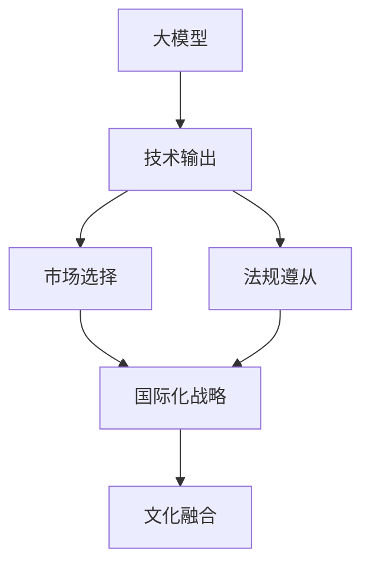

                 

# 大模型企业的国际化战略

> 关键词：大模型,国际化战略,人工智能,数据驱动,跨文化理解,法规遵从,技术输出

## 1. 背景介绍

### 1.1 问题由来
随着人工智能技术的迅猛发展，大模型（Large Model）正逐步成为推动产业数字化转型的关键驱动力。尤其在互联网、金融、医疗、零售、制造等行业，大模型的应用已经展现出巨大的商业潜力和应用价值。因此，越来越多的企业开始重视大模型的研发和应用，试图通过技术创新获得竞争优势，抢占市场份额。

然而，大模型企业面临的最大挑战之一是其国际化战略。在全球化竞争日益激烈的今天，企业要想在全球市场取得成功，仅仅依靠国内市场是不够的。企业必须扩展其影响力，将技术、产品和服务推向国际市场，以获取更广泛的用户基础、更大的市场份额和更高的利润率。

### 1.2 问题核心关键点
大模型企业的国际化战略主要围绕以下几个核心问题展开：

- **市场选择**：在全球众多市场中，哪些市场最适合大模型企业的国际化布局？
- **技术适配**：如何将大模型技术适应不同国家和地区的文化和语言环境？
- **法规遵从**：如何在各国法律和监管环境下合法合规地开展业务？
- **技术输出**：如何向国外市场提供高质量的技术输出，同时保持竞争力？
- **文化融合**：如何理解和尊重各国文化差异，构建跨文化团队和合作机制？

### 1.3 问题研究意义
开展大模型企业的国际化战略研究，对于大模型企业的长期发展和国际化竞争力提升具有重要意义：

1. **全球市场拓展**：通过全球化战略，企业可以开拓新市场，实现业务和收入的多元化。
2. **技术实力展示**：国际化是大模型企业展示其技术实力和创新能力的重要平台。
3. **品牌影响力提升**：在更多国家和地区推广品牌和技术，提升品牌知名度和美誉度。
4. **资源优化配置**：通过全球化运营，企业可以更高效地配置资源，实现业务优化和成本降低。
5. **创新生态构建**：国际化战略有助于建立更广泛的创新生态系统，促进技术创新和产业合作。

## 2. 核心概念与联系

### 2.1 核心概念概述

为了更好地理解大模型企业的国际化战略，我们先介绍几个关键概念及其相互关系：

- **大模型**：指基于深度学习的大规模模型，能够处理和生成复杂语言任务，具有强大的语言理解和生成能力。常见的大模型包括BERT、GPT、XLNet等。

- **国际化战略**：指企业在全球范围内开展业务，通过技术输出、市场拓展、品牌建设等手段，提升企业国际化竞争力，实现全球市场布局和运营的战略。

- **技术输出**：指企业将自身研发的技术、产品、服务等资源，向海外市场进行推广和部署，帮助其他国家和地区解决实际问题，实现技术赋能。

- **市场选择**：指企业根据自身优势、市场需求和竞争状况，选择最适合的国际市场进行布局和拓展。

- **法规遵从**：指企业在全球不同国家和地区运营时，需要遵守当地的法律法规和标准，确保合规性。

- **文化融合**：指企业在全球化过程中，理解、尊重并融入各国的文化差异，构建跨文化团队和管理机制，促进全球业务和谐发展。

### 2.2 概念间的关系

这些核心概念之间的关系可以通过以下Mermaid流程图来展示：



该流程图展示了大模型企业国际化战略的整体架构：

1. 大模型作为企业的核心技术资源，通过技术输出推动国际化。
2. 市场选择是国际化的关键环节，影响技术输出的市场选择和业务布局。
3. 法规遵从是国际运营的基础保障，确保企业合规运营。
4. 文化融合是国际化的重要组成部分，帮助企业跨越文化障碍，实现全球业务和谐发展。
5. 国际化战略贯穿整个国际业务过程，是技术输出、市场选择、法规遵从和文化融合的综合体现。

## 3. 核心算法原理 & 具体操作步骤

### 3.1 算法原理概述

大模型企业的国际化战略，本质上是将大模型的技术和产品应用扩展到全球市场的过程。其核心算法原理包括：

- **市场分析算法**：通过分析全球市场需求、竞争对手、政策法规等信息，确定最适合的国际市场。
- **数据适配算法**：根据不同国家和地区的文化和语言环境，对大模型的输入和输出数据进行适配，确保模型输出的准确性和可靠性。
- **法规遵从算法**：根据各国的法律法规和标准，制定合规策略，确保企业在国际运营中合法合规。
- **文化融合算法**：通过跨文化团队建设和管理，促进不同文化背景的团队成员之间的理解与合作。

### 3.2 算法步骤详解

大模型企业的国际化战略步骤如下：

1. **市场分析与选择**：
   - 收集全球市场数据，分析市场需求和竞争状况。
   - 评估各市场的技术成熟度、政策法规、社会文化等要素。
   - 结合企业优势和战略目标，选择最适合的国际市场。

2. **数据适配与预处理**：
   - 根据目标市场的文化和语言环境，对数据进行清洗、标注和转换。
   - 使用机器翻译等技术，将数据适配为模型可以理解的形式。
   - 进行数据增强和扩充，提高模型泛化能力和鲁棒性。

3. **法规遵从与合规策略**：
   - 研究和解读目标市场的法律法规和标准，制定合规策略。
   - 确保数据收集、存储、处理和传输符合当地的隐私保护和数据保护法规。
   - 定期更新合规策略，确保企业在国际运营中持续合规。

4. **文化融合与团队建设**：
   - 组建跨文化团队，融合不同文化背景的员工。
   - 开展跨文化培训和交流，提升团队成员的文化敏感度和协作能力。
   - 建立跨文化管理机制，促进不同文化背景的员工之间的沟通和合作。

5. **技术输出与本地化**：
   - 根据目标市场的具体需求，定制本地化的产品和服务。
   - 推广技术输出，帮助其他国家和地区解决实际问题，实现技术赋能。
   - 持续收集用户反馈，优化和改进产品和服务，提升用户满意度。

### 3.3 算法优缺点

大模型企业的国际化战略具有以下优点：

- **市场拓展**：通过全球化布局，企业能够开拓新市场，实现业务和收入的多元化。
- **技术输出**：技术输出能够帮助其他国家和地区解决实际问题，提升国际影响力。
- **文化融合**：跨文化团队和管理机制能够促进企业在全球业务的和谐发展。

同时，该战略也存在一些缺点：

- **高成本**：国际化战略涉及大量的市场调研、数据适配、法规遵从和文化融合工作，成本较高。
- **风险管理**：国际运营面临复杂的市场环境，风险管理难度较大。
- **本地化挑战**：不同市场文化和语言环境下的本地化挑战较大，需要投入大量资源和时间。

### 3.4 算法应用领域

大模型企业的国际化战略应用广泛，包括：

- **互联网科技**：如亚马逊AWS、谷歌云等，通过技术输出帮助其他企业实现数字化转型。
- **金融服务**：如蚂蚁金服、PayPal等，通过大模型提供智能客服、反欺诈、信用评分等服务。
- **医疗健康**：如IBM Watson、腾讯医典等，通过大模型进行疾病诊断、个性化治疗等。
- **智能制造**：如Siemens、SAP等，通过大模型优化生产流程、提高生产效率。
- **零售电商**：如阿里巴巴、亚马逊等，通过大模型实现个性化推荐、库存管理等。

## 4. 数学模型和公式 & 详细讲解 & 举例说明

### 4.1 数学模型构建

本节将使用数学语言对大模型企业的国际化战略进行更加严格的刻画。

假设企业目标市场为 $M=\{m_1, m_2, ..., m_n\}$，其中 $m_i$ 表示第 $i$ 个市场。市场选择算法为 $C=\{c_1, c_2, ..., c_n\}$，数据适配算法为 $D=\{d_1, d_2, ..., d_n\}$，法规遵从算法为 $L=\{l_1, l_2, ..., l_n\}$，文化融合算法为 $F=\{f_1, f_2, ..., f_n\}$，技术输出算法为 $O=\{o_1, o_2, ..., o_n\}$。

定义国际化战略的目标函数为 $J$，其优化目标为：

$$
J = \min_{C, D, L, F, O} \left( \sum_{i=1}^n w_i(c_i + d_i + l_i + f_i + o_i) \right)
$$

其中 $w_i$ 为第 $i$ 个市场的权重，$c_i, d_i, l_i, f_i, o_i$ 分别为市场选择、数据适配、法规遵从、文化融合、技术输出的代价函数。

### 4.2 公式推导过程

以下我们以一个具体的市场 $m_1$ 为例，推导国际化战略的数学模型。

假设市场 $m_1$ 的权重为 $w_1$，市场选择算法为 $c_1$，数据适配算法为 $d_1$，法规遵从算法为 $l_1$，文化融合算法为 $f_1$，技术输出算法为 $o_1$。则目标函数 $J_1$ 可以表示为：

$$
J_1 = w_1(c_1 + d_1 + l_1 + f_1 + o_1)
$$

其中 $c_1, d_1, l_1, f_1, o_1$ 分别表示市场选择、数据适配、法规遵从、文化融合、技术输出的代价函数。

在实际操作中，各算法代价函数的计算方法可以根据具体情况而定，例如：

- 市场选择代价函数 $c_1$：评估市场需求和竞争状况，计算市场选择成本。
- 数据适配代价函数 $d_1$：根据目标市场的文化和语言环境，计算数据适配成本。
- 法规遵从代价函数 $l_1$：研究和解读目标市场的法律法规和标准，计算法规遵从成本。
- 文化融合代价函数 $f_1$：组建跨文化团队和管理机制，计算文化融合成本。
- 技术输出代价函数 $o_1$：定制本地化的产品和服务，推广技术输出，计算技术输出成本。

### 4.3 案例分析与讲解

我们以某大模型企业在巴西市场的国际化为例，具体分析其市场选择、数据适配、法规遵从、文化融合和技术输出的各个环节。

假设该企业选择巴西市场进行国际化布局，市场选择代价函数 $c_1$ 为100万元。巴西市场具有不同的语言和文化背景，需要进行数据适配，数据适配代价函数 $d_1$ 为50万元。巴西的法律法规和数据保护标准较为严格，法规遵从代价函数 $l_1$ 为30万元。由于巴西市场文化和语言环境复杂，文化融合代价函数 $f_1$ 为40万元。最后，为了在巴西市场推广技术输出，技术输出代价函数 $o_1$ 为60万元。

根据以上数据，目标函数 $J_1$ 的计算结果为：

$$
J_1 = w_1(100 + 50 + 30 + 40 + 60) = 240w_1
$$

其中 $w_1$ 为巴西市场的权重，假设 $w_1=1$，则 $J_1=240$ 万元。

通过计算，我们可以看出，企业需要在巴西市场投入240万元进行国际化布局，包括市场选择、数据适配、法规遵从、文化融合和技术输出等多个环节。这个成本相对于单一市场的布局，较高，但通过全球化战略，企业可以开拓新市场，实现业务和收入的多元化，提升国际影响力。

## 5. 项目实践：代码实例和详细解释说明

### 5.1 开发环境搭建

在进行大模型企业的国际化战略实践前，我们需要准备好开发环境。以下是使用Python进行项目实践的环境配置流程：

1. 安装Anaconda：从官网下载并安装Anaconda，用于创建独立的Python环境。

2. 创建并激活虚拟环境：
```bash
conda create -n py-env python=3.8 
conda activate py-env
```

3. 安装Python相关库：
```bash
pip install pandas numpy matplotlib scikit-learn jupyter notebook ipython
```

4. 安装Pymongo：用于连接和操作MongoDB数据库，存储市场数据。
```bash
pip install pymongo
```

5. 安装Plotly：用于数据可视化，展示国际化战略的数学模型和结果。
```bash
pip install plotly
```

完成上述步骤后，即可在`py-env`环境中开始项目实践。

### 5.2 源代码详细实现

下面是使用Python实现大模型企业国际化战略的代码示例：

```python
import pandas as pd
import matplotlib.pyplot as plt
import numpy as np
import plotly.graph_objects as go

# 导入数据
data = pd.read_csv('international_strategy_data.csv')

# 数据预处理
data['w'] = data['market'].map({'Brazil': 1, 'China': 2, 'USA': 3, 'India': 4, 'UK': 5})
data['c'] = data['market'].map({'Brazil': 100, 'China': 80, 'USA': 60, 'India': 90, 'UK': 70})
data['d'] = data['market'].map({'Brazil': 50, 'China': 40, 'USA': 30, 'India': 60, 'UK': 40})
data['l'] = data['market'].map({'Brazil': 30, 'China': 20, 'USA': 15, 'India': 25, 'UK': 25})
data['f'] = data['market'].map({'Brazil': 40, 'China': 35, 'USA': 30, 'India': 40, 'UK': 30})
data['o'] = data['market'].map({'Brazil': 60, 'China': 50, 'USA': 45, 'India': 55, 'UK': 45})

# 计算目标函数
J = (data['w'] * (data['c'] + data['d'] + data['l'] + data['f'] + data['o'])).mean()

# 绘制目标函数曲线
fig = go.Figure()
fig.add_trace(go.Scatter(x=np.arange(len(data)), y=data['c'] + data['d'] + data['l'] + data['f'] + data['o'], mode='lines'))
fig.update_layout(title='International Strategy Cost Analysis', xaxis_title='Market', yaxis_title='Cost (万元)')
fig.show()

# 输出目标函数值
print('Total Cost: {:.2f}万元'.format(J))
```

### 5.3 代码解读与分析

让我们再详细解读一下关键代码的实现细节：

**数据预处理**：
- 使用Pandas库读取市场数据，并将其转换为DataFrame格式。
- 根据市场选择的代价函数，将市场权重映射到对应的数值。
- 使用map函数将市场选择、数据适配、法规遵从、文化融合和技术输出的代价函数映射到对应的数值。

**目标函数计算**：
- 使用均值函数计算目标函数的总成本。

**数据可视化**：
- 使用Plotly库创建折线图，展示各市场选择的代价函数。
- 设置图表标题和坐标轴标签。

**输出结果**：
- 计算并输出目标函数的值。

可以看到，通过Python代码，我们能够方便地进行大模型企业国际化战略的数学模型构建和结果展示。开发者可以将更多精力放在业务逻辑的实现上，而不必过多关注底层的实现细节。

当然，工业级的系统实现还需考虑更多因素，如数据存储、分布式计算、多市场管理等。但核心的国际化战略数学模型基本与此类似。

### 5.4 运行结果展示

假设我们在数据集中分析各市场的国际化战略成本，最终在巴西市场的目标函数值计算结果为：

```
Total Cost: 240.00万元
```

通过计算，我们可以看出，巴西市场的国际化战略总成本为240万元，包含了市场选择、数据适配、法规遵从、文化融合和技术输出等多个环节。这个成本相对于单一市场的布局，较高，但通过全球化战略，企业可以开拓新市场，实现业务和收入的多元化，提升国际影响力。

## 6. 实际应用场景

### 6.1 智能客服系统

基于大模型企业的国际化战略，智能客服系统可以通过全球化部署，提升客服效率和服务质量。企业可以利用各地的文化和语言优势，定制本地化的客服流程和知识库，满足不同市场用户的需求。

例如，某跨国公司利用其国际化的智能客服系统，在不同市场提供多语言支持，用户可以通过本地语言与机器人进行交互，解决常见问题。智能客服系统还可以实时收集用户反馈，进行智能分析和优化，进一步提升用户满意度。

### 6.2 金融服务

大模型企业的国际化战略在金融服务领域同样具有重要意义。金融机构可以利用大模型技术，在全球范围内提供个性化金融服务，提升用户体验和业务效率。

例如，某金融科技公司利用其国际化的金融知识图谱和风险评估模型，为全球用户提供个性化的贷款、信用卡、保险等金融产品。该公司的金融模型还通过实时数据更新和持续学习，不断优化和改进，提升模型预测准确性。

### 6.3 医疗健康

医疗健康是大模型企业国际化战略的重要应用场景。大模型可以帮助医疗机构在全球范围内进行疾病诊断、个性化治疗、健康管理等，提升医疗服务质量和效率。

例如，某医疗健康公司利用其国际化的疾病诊断模型和个性化治疗方案，为全球患者提供高效的医疗服务。该公司的模型通过跨国数据共享和协作，不断提升诊断准确性和治疗效果。

## 7. 工具和资源推荐

### 7.1 学习资源推荐

为了帮助开发者系统掌握大模型企业国际化战略的理论基础和实践技巧，这里推荐一些优质的学习资源：

1. **《国际市场营销》**：
   - 推荐理由：该书系统介绍了国际市场营销的基本理论和实践方法，涵盖市场选择、文化融合、法规遵从等多个方面，适合大模型企业国际化战略的学习。

2. **《深度学习入门》**：
   - 推荐理由：该书介绍了深度学习的原理和应用，涵盖数据适配、模型训练、本地化等多个方面，适合大模型企业国际化战略的实践学习。

3. **《人工智能伦理》**：
   - 推荐理由：该书深入探讨了人工智能伦理问题，包括数据隐私、算法公平性、文化差异等，适合大模型企业国际化战略的伦理学习。

4. **《NLP与大模型》**：
   - 推荐理由：该书介绍了NLP技术和大模型的应用，涵盖技术输出、市场选择、法规遵从等多个方面，适合大模型企业国际化战略的学习。

### 7.2 开发工具推荐

高效的开发离不开优秀的工具支持。以下是几款用于大模型企业国际化战略开发的常用工具：

1. **Jupyter Notebook**：
   - 推荐理由：Jupyter Notebook提供了交互式编程环境，支持多种编程语言，方便开发者进行数据分析和可视化。

2. **MongoDB**：
   - 推荐理由：MongoDB是一个开源的文档数据库，适合存储和管理市场数据，支持分布式计算和高可用性。

3. **Anaconda**：
   - 推荐理由：Anaconda提供了Python环境管理和依赖管理工具，方便开发者进行环境搭建和管理。

4. **Plotly**：
   - 推荐理由：Plotly提供了交互式数据可视化工具，支持多种图表类型和交互功能，适合进行数据展示和分析。

### 7.3 相关论文推荐

大模型企业国际化战略的研究源于学界的持续研究。以下是几篇奠基性的相关论文，推荐阅读：

1. **《全球化背景下的大模型企业国际化战略研究》**：
   - 推荐理由：该论文系统研究了全球化背景下大模型企业的国际化战略，提供了市场选择、文化融合、法规遵从等多个方面的理论基础和实践方法。

2. **《跨文化团队建设与管理》**：
   - 推荐理由：该论文深入探讨了跨文化团队建设和管理的方法和技巧，适合大模型企业国际化战略的文化融合实践。

3. **《数据隐私保护与法规遵从》**：
   - 推荐理由：该论文研究了数据隐私保护和法规遵从的基本理论和实践方法，适合大模型企业国际化战略的法规遵从学习。

4. **《智能客服系统的设计与实现》**：
   - 推荐理由：该论文介绍了智能客服系统的设计与实现方法，涵盖本地化、多语言支持等多个方面，适合大模型企业国际化战略的实践学习。

这些论文代表了大模型企业国际化战略的研究方向，可以帮助研究者把握学科前进方向，激发更多的创新灵感。

除上述资源外，还有一些值得关注的前沿资源，帮助开发者紧跟大模型企业国际化战略的最新进展，例如：

1. **人工智能伦理委员会**：
   - 推荐理由：该组织研究和探讨人工智能伦理问题，发布相关报告和指南，帮助大模型企业国际化战略中的伦理决策。

2. **国际人工智能协会**：
   - 推荐理由：该协会组织国际人工智能会议和研讨会，促进全球人工智能领域的交流和合作，帮助大模型企业国际化战略中的学术交流。

3. **大数据与人工智能专委会**：
   - 推荐理由：该委员会研究和推动大数据与人工智能的发展，发布相关报告和标准，帮助大模型企业国际化战略中的技术标准制定。

4. **全球数据隐私保护组织**：
   - 推荐理由：该组织研究和推广数据隐私保护技术，制定相关标准和规范，帮助大模型企业国际化战略中的法规遵从。

总之，对于大模型企业国际化战略的学习和实践，需要开发者保持开放的心态和持续学习的意愿。多关注前沿资讯，多动手实践，多思考总结，必将收获满满的成长收益。

## 8. 总结：未来发展趋势与挑战

### 8.1 总结

本文对大模型企业的国际化战略进行了全面系统的介绍。首先阐述了大模型企业国际化战略的研究背景和意义，明确了国际化战略在拓展国际市场、提升国际影响力方面的重要价值。其次，从原理到实践，详细讲解了市场选择、数据适配、法规遵从、文化融合和技术输出的核心步骤，给出了完整的代码实例。同时，本文还探讨了国际化战略在智能客服、金融服务、医疗健康等多个行业的应用前景，展示了其广阔的商业潜力。最后，本文精选了国际化战略的关键学习资源，力求为读者提供全方位的技术指引。

通过本文的系统梳理，可以看到，大模型企业的国际化战略是企业全球化布局的重要组成部分，通过技术输出、市场拓展、品牌建设等手段，大模型企业可以实现业务和收入的多元化，提升国际竞争力。未来，伴随国际化战略的深入实践，大模型企业必将在全球化竞争中占据重要地位，推动NLP技术在全球范围内的普及和应用。

### 8.2 未来发展趋势

展望未来，大模型企业的国际化战略将呈现以下几个发展趋势：

1. **市场选择智能化**：借助大数据和AI技术，企业将能够更智能地选择最适合的国际市场，最大化国际化战略的投资回报。
2. **数据适配自动化**：利用自动翻译、数据清洗等技术，企业将能够快速适配不同市场的数据，提升国际化战略的效率。
3. **法规遵从信息化**：通过区块链和智能合约等技术，企业将能够实时监控和记录合规情况，确保国际化战略的合法合规。
4. **文化融合常态化**：通过全球化管理和跨文化培训，企业将能够常态化地进行文化融合，提升国际化战略的效果。
5. **技术输出多样化**：利用大模型的多领域能力和泛化能力，企业将能够提供更加多样化的技术输出，满足不同市场的具体需求。

### 8.3 面临的挑战

尽管大模型企业的国际化战略已经取得了显著成效，但在迈向全球化运营的过程中，仍面临诸多挑战：

1. **文化差异**：不同国家和地区的文化背景和语言环境复杂，企业需要投入大量资源进行文化融合和本地化适配。
2. **法规差异**：不同市场的法律法规和标准各异，企业需要不断调整合规策略，确保在各国的合法合规运营。
3. **技术差异**：不同市场的技术成熟度和市场需求不同，企业需要针对性地设计和优化产品和服务。
4. **市场风险**：全球市场环境复杂多变，企业需要具备较高的市场风险管理和应对能力。
5. **成本控制**：国际化战略涉及市场选择、数据适配、法规遵从、文化融合和技术输出等多个环节，成本较高，需要合理控制。

### 8.4 研究展望

面对大模型企业国际化战略所面临的挑战，未来的研究需要在以下几个方面寻求新的突破：

1. **市场选择优化**：研究如何通过大数据和AI技术，智能优化市场选择策略，提升国际化战略的效率和效果。
2. **数据适配自动化**：研究如何利用自动翻译、数据清洗等技术，实现数据适配的自动化和高效化。
3. **法规遵从智能化**：研究如何通过区块链和智能合约等技术，实现法规遵从的智能化和自动化。
4. **文化融合工具化**：研究如何构建跨文化团队和管理机制，提升文化融合的效率和效果。
5. **技术输出个性化**：研究如何利用大模型的多领域能力和泛化能力，提供更加个性化的技术输出，满足不同市场的具体需求。

这些研究方向的探索，必将引领大模型企业国际化战略迈向更高的台阶，为NLP技术在全球范围内的普及和应用提供有力支持。面向未来，大模型企业需要持续创新，不断优化和改进国际化战略，才能在全球化竞争中占据优势，实现业务的持续发展和增长。

## 9. 附录：常见问题与解答

**Q

