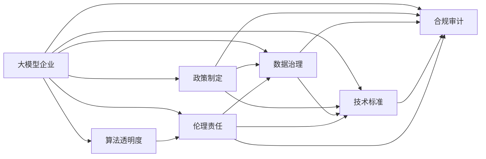

                 

# 大模型企业的政府关系管理

> 关键词：大模型, 政府关系, 技术标准, 合规审计, 数据治理, 算法透明度, 伦理责任, 政策制定, 业务运营, 安全保障, 公共利益

## 1. 背景介绍

### 1.1 问题由来

随着人工智能和大数据技术的迅猛发展，大模型企业在全球范围内快速崛起，成为驱动技术创新和产业发展的重要力量。大模型企业凭借其强大的计算能力和数据处理能力，为各行各业提供了前所未有的应用机会，同时也深刻影响着社会治理、公共服务等领域。然而，大模型企业的蓬勃发展也带来了一系列复杂的政府关系管理问题，引发了公众、企业和社会各界的广泛关注。

大模型企业在技术创新和商业应用中扮演着越来越重要的角色，但与之相伴的政府监管、隐私保护、数据安全、算法透明度等挑战也日益凸显。如何在大模型企业与政府之间建立良性互动关系，确保技术应用的合法合规，保护社会公众权益，已成为当前亟需解决的重大课题。

### 1.2 问题核心关键点

大模型企业的政府关系管理涉及多个方面，核心关键点包括：

- **政策制定与遵从**：大模型企业需要积极参与政府政策制定，并确保其业务运营符合相关法律法规和行业标准。
- **数据治理与隐私保护**：在数据采集、存储、使用等环节，大模型企业需遵循数据治理原则，确保用户隐私得到充分保护。
- **技术标准与合规审计**：大模型企业需遵循行业技术标准，定期进行合规审计，以确保技术应用的安全可靠。
- **算法透明度与解释性**：大模型企业需提高算法的透明度，确保算法的可解释性，以增强公众信任和政府监管。
- **伦理责任与社会责任**：大模型企业需承担伦理责任，确保技术应用的公正性和公平性，避免对社会造成负面影响。
- **安全保障与应急响应**：大模型企业需建立健全的安全保障体系，并具备快速响应突发事件的能力。

这些核心关键点共同构成了大模型企业政府关系管理的复杂生态系统，要求企业在技术创新、业务运营和政府监管间找到平衡，确保可持续发展。

### 1.3 问题研究意义

大模型企业与政府之间的良好互动，对于推动人工智能技术的健康发展、促进社会公平正义、保障公众利益具有重要意义：

- **推动技术创新**：政府可以为大模型企业提供政策支持、数据资源和技术合作平台，促进技术创新和产业升级。
- **促进公平正义**：通过制定公平公正的法律法规和技术标准，确保大模型企业技术应用的公平性和透明性，避免技术滥用。
- **保障公众利益**：通过数据治理、隐私保护、伦理责任等措施，确保大模型企业的技术应用符合公众利益，避免技术风险。
- **保障国家安全**：通过政策制定、合规审计、应急响应等措施，保障国家安全和公共安全，防范技术风险。
- **促进国际合作**：通过技术标准、算法透明度、伦理责任等措施，增强国际社会对大模型技术的信任和合作。

总之，大模型企业的政府关系管理不仅是企业发展的需要，更是推动社会进步、保障公众权益的重要途径。

## 2. 核心概念与联系

### 2.1 核心概念概述

为更好地理解大模型企业的政府关系管理，本节将介绍几个密切相关的核心概念：

- **大模型企业**：指通过大规模数据训练和深度学习技术开发出先进的人工智能模型的企业，如OpenAI、Google、微软、阿里云等。
- **政府关系管理**：指大模型企业在政府政策制定、数据治理、技术标准、合规审计、算法透明度、伦理责任等方面的管理实践。
- **技术标准**：指行业或政府机构制定的一系列技术规范和标准，用于指导大模型企业的技术开发和应用。
- **合规审计**：指对大模型企业技术应用过程的合规性进行审核和评估，确保符合法律法规和行业标准。
- **数据治理**：指对大模型企业数据资源的管理、保护和利用，确保数据质量和数据安全。
- **算法透明度**：指对大模型企业算法的可解释性和公开性进行管理，增强公众信任和政府监管。
- **伦理责任**：指大模型企业应承担的道德和法律责任，确保技术应用的公正性和公平性。

这些核心概念之间存在紧密的联系，通过合理管理和协调，可以有效提升大模型企业的政府关系管理水平，确保技术应用的合法合规，保护社会公众权益。

### 2.2 概念间的关系

这些核心概念之间的关系可以通过以下Mermaid流程图来展示：



这个流程图展示了大模型企业的政府关系管理涉及的各个核心概念及其之间的关系：

1. **政策制定**：影响和指导大模型企业的技术应用，是大模型企业与政府互动的基础。
2. **数据治理**：确保数据的质量和安全性，是大模型企业技术应用的基础。
3. **技术标准**：为大模型企业提供技术规范和指导，确保技术应用的合规性。
4. **合规审计**：对大模型企业的技术应用过程进行审核和评估，确保合规性。
5. **算法透明度**：增强公众信任和政府监管，是大模型企业的重要责任。
6. **伦理责任**：确保技术应用的公正性和公平性，是大模型企业的道德底线。

这些概念共同构成了大模型企业政府关系管理的完整生态系统，要求企业在政策制定、数据治理、技术标准、合规审计、算法透明度、伦理责任等方面进行全面管理，确保技术应用的合法合规。

## 3. 核心算法原理 & 具体操作步骤

### 3.1 算法原理概述

大模型企业的政府关系管理涉及多个算法和技术手段，主要包括政策制定、数据治理、技术标准、合规审计、算法透明度、伦理责任等。这些算法和技术手段的共同目标是通过合理管理和协调，确保大模型企业的技术应用符合法律法规和行业标准，保护社会公众权益，推动技术健康发展。

具体而言，算法原理如下：

1. **政策制定**：通过数据分析和模拟预测，评估不同政策对大模型企业技术应用的影响，制定最优政策方案。
2. **数据治理**：通过数据清洗、数据标注、数据隐私保护等技术手段，确保数据的质量和安全性。
3. **技术标准**：基于技术评估和规范制定，为大模型企业提供技术标准和指导。
4. **合规审计**：通过数据审计、代码审计等技术手段，评估大模型企业的技术应用是否符合法律法规和行业标准。
5. **算法透明度**：通过代码开放、注释解释等技术手段，增强算法的可解释性和公开性。
6. **伦理责任**：通过伦理评估和风险控制等技术手段，确保技术应用的公正性和公平性。

### 3.2 算法步骤详解

以下是对大模型企业政府关系管理核心算法步骤的详细讲解：

**Step 1: 政策制定**

1. **数据收集与分析**：收集相关政策法规、行业标准、竞争对手信息等数据，并进行数据分析和模拟预测。
2. **政策制定**：基于数据分析结果，制定最优政策方案，并提交给政府机构审查和批准。
3. **政策执行与评估**：将政策方案落实到技术应用中，并定期进行政策执行效果评估。

**Step 2: 数据治理**

1. **数据收集与清洗**：收集相关数据，并进行数据清洗和去重。
2. **数据标注**：对数据进行标注，以便后续训练和模型评估。
3. **数据隐私保护**：采用数据脱敏、加密等技术手段，确保数据隐私安全。
4. **数据存储与共享**：建立数据存储和共享机制，确保数据合规性和可用性。

**Step 3: 技术标准**

1. **技术评估与规范制定**：通过技术评估和专家咨询，制定相关技术标准和规范。
2. **标准发布与实施**：将制定好的技术标准发布并实施，确保技术应用符合标准。
3. **标准更新与改进**：根据技术发展和新需求，定期更新和改进技术标准。

**Step 4: 合规审计**

1. **数据审计**：对数据收集、存储、使用等环节进行审计，确保数据合规性。
2. **代码审计**：对模型代码进行审计，确保模型符合技术标准和法律法规。
3. **合规报告**：定期发布合规报告，公开合规审计结果，接受社会监督。

**Step 5: 算法透明度**

1. **代码开放**：将模型代码开放给公众，接受监督和审查。
2. **注释解释**：对模型算法进行详细注释和解释，增强可解释性。
3. **结果解释**：对模型输出进行解释和可视化，增强透明度。

**Step 6: 伦理责任**

1. **伦理评估**：对技术应用进行伦理评估，确保符合道德和法律规范。
2. **风险控制**：建立风险控制机制，防范技术滥用和负面影响。
3. **责任追究**：对违反伦理责任的行为进行责任追究，确保公正和公平。

### 3.3 算法优缺点

大模型企业政府关系管理的算法具有以下优点：

1. **合规性强**：通过严格的数据治理和合规审计，确保技术应用符合法律法规和行业标准，降低法律风险。
2. **透明度高**：通过算法透明度和公开性，增强公众信任和政府监管，提升社会信任度。
3. **公正公平**：通过伦理评估和风险控制，确保技术应用的公正性和公平性，避免技术滥用。
4. **技术标准高**：通过技术标准制定和实施，提升技术应用的质量和水平，推动技术创新。

同时，大模型企业政府关系管理的算法也存在一些缺点：

1. **数据隐私风险**：数据治理和隐私保护措施需要严格执行，否则可能面临数据泄露和隐私侵害的风险。
2. **技术复杂度高**：政策制定、数据治理、技术标准、合规审计、算法透明度、伦理责任等方面的管理，技术复杂度较高，需要专业的技术团队支持。
3. **资源投入大**：政策制定、数据治理、合规审计等环节需要大量的人力物力资源，投入成本较大。

### 3.4 算法应用领域

大模型企业政府关系管理的算法广泛应用于以下几个领域：

1. **政策制定**：政府部门和政策制定机构对大模型企业技术应用的政策指导和管理。
2. **数据治理**：大模型企业内部的数据管理和保护机制，确保数据合规性和隐私安全。
3. **技术标准**：行业协会和标准化组织对大模型企业技术应用的技术规范和标准制定和实施。
4. **合规审计**：第三方审计机构和监管机构对大模型企业技术应用的合规性和合法性进行审查和评估。
5. **算法透明度**：公开算法代码和注释，提高算法的可解释性和公开性，增强公众信任和政府监管。
6. **伦理责任**：大模型企业内部和第三方机构对技术应用进行伦理评估和风险控制，确保技术应用的公正性和公平性。

## 4. 数学模型和公式 & 详细讲解 & 举例说明

### 4.1 数学模型构建

大模型企业的政府关系管理涉及多个数学模型和公式，以下是几个核心模型的构建：

1. **政策制定模型**：基于大数据分析和模拟预测，评估不同政策对技术应用的影响，建模如下：
   $$
   \pi(x) = f(x_1, x_2, \cdots, x_n)
   $$
   其中，$x_i$ 表示政策制定的第 $i$ 个影响因素，$\pi(x)$ 表示政策制定结果。

2. **数据治理模型**：基于数据清洗和隐私保护技术，确保数据的质量和安全性，建模如下：
   $$
   D(x) = g(x_1, x_2, \cdots, x_n)
   $$
   其中，$x_i$ 表示数据治理过程的第 $i$ 个步骤，$D(x)$ 表示数据治理结果。

3. **技术标准模型**：基于技术评估和规范制定，为大模型企业提供技术标准和指导，建模如下：
   $$
   S(x) = h(x_1, x_2, \cdots, x_n)
   $$
   其中，$x_i$ 表示技术标准制定的第 $i$ 个步骤，$S(x)$ 表示技术标准结果。

4. **合规审计模型**：基于数据审计和代码审计技术，评估大模型企业的技术应用是否符合法律法规和行业标准，建模如下：
   $$
   A(x) = i(x_1, x_2, \cdots, x_n)
   $$
   其中，$x_i$ 表示合规审计过程的第 $i$ 个步骤，$A(x)$ 表示合规审计结果。

5. **算法透明度模型**：基于代码开放和注释解释技术，增强算法的可解释性和公开性，建模如下：
   $$
   T(x) = j(x_1, x_2, \cdots, x_n)
   $$
   其中，$x_i$ 表示算法透明度管理的第 $i$ 个步骤，$T(x)$ 表示算法透明度结果。

6. **伦理责任模型**：基于伦理评估和风险控制技术，确保技术应用的公正性和公平性，建模如下：
   $$
   E(x) = k(x_1, x_2, \cdots, x_n)
   $$
   其中，$x_i$ 表示伦理责任管理的第 $i$ 个步骤，$E(x)$ 表示伦理责任结果。

### 4.2 公式推导过程

以下是几个核心模型的公式推导过程：

**政策制定模型推导**：
假设政策制定的影响因素包括政策类型、市场规模、用户需求、技术成熟度等，政策制定结果为政策方案的推荐。基于大数据分析和模拟预测，构建如下模型：
$$
\pi(x) = \frac{1}{1+\exp(-\beta(x_1 + x_2 + \cdots + x_n))}
$$
其中，$\beta$ 为模型参数，$x_i$ 表示政策制定的第 $i$ 个影响因素，$\pi(x)$ 表示政策制定结果。

**数据治理模型推导**：
假设数据治理过程包括数据清洗、数据标注、数据隐私保护等步骤，数据治理结果为数据质量的提升。基于数据处理技术，构建如下模型：
$$
D(x) = \frac{1}{1+\exp(-\alpha(x_1 + x_2 + \cdots + x_n))}
$$
其中，$\alpha$ 为模型参数，$x_i$ 表示数据治理过程的第 $i$ 个步骤，$D(x)$ 表示数据治理结果。

**技术标准模型推导**：
假设技术标准制定的步骤包括技术评估、专家咨询、标准发布等，技术标准结果为技术规范的制定。基于技术评估技术，构建如下模型：
$$
S(x) = \frac{1}{1+\exp(-\gamma(x_1 + x_2 + \cdots + x_n))}
$$
其中，$\gamma$ 为模型参数，$x_i$ 表示技术标准制定的第 $i$ 个步骤，$S(x)$ 表示技术标准结果。

**合规审计模型推导**：
假设合规审计过程包括数据审计、代码审计等步骤，合规审计结果为合规性的判断。基于审计技术，构建如下模型：
$$
A(x) = \frac{1}{1+\exp(-\delta(x_1 + x_2 + \cdots + x_n))}
$$
其中，$\delta$ 为模型参数，$x_i$ 表示合规审计过程的第 $i$ 个步骤，$A(x)$ 表示合规审计结果。

**算法透明度模型推导**：
假设算法透明度的管理步骤包括代码开放、注释解释等，算法透明度结果为算法的可解释性。基于代码管理技术，构建如下模型：
$$
T(x) = \frac{1}{1+\exp(-\epsilon(x_1 + x_2 + \cdots + x_n))}
$$
其中，$\epsilon$ 为模型参数，$x_i$ 表示算法透明度管理的第 $i$ 个步骤，$T(x)$ 表示算法透明度结果。

**伦理责任模型推导**：
假设伦理责任管理的步骤包括伦理评估、风险控制等，伦理责任结果为技术应用的公正性和公平性。基于伦理评估技术，构建如下模型：
$$
E(x) = \frac{1}{1+\exp(-\zeta(x_1 + x_2 + \cdots + x_n))}
$$
其中，$\zeta$ 为模型参数，$x_i$ 表示伦理责任管理的第 $i$ 个步骤，$E(x)$ 表示伦理责任结果。

### 4.3 案例分析与讲解

**案例1：政府政策制定**

某地方政府正在制定一项关于人工智能发展的政策，需要评估政策对大模型企业技术应用的影响。通过大数据分析和模拟预测，构建了如下模型：
$$
\pi(x) = \frac{1}{1+\exp(-\beta(x_1 + x_2 + \cdots + x_n))}
$$
其中，$x_i$ 表示政策制定的第 $i$ 个影响因素，$\pi(x)$ 表示政策制定结果。经过数据分析和模型训练，最终得出最优政策方案，并提交给政府机构审查和批准。

**案例2：数据治理**

某大模型企业在数据治理过程中，面临数据清洗、数据标注、数据隐私保护等挑战。通过数据治理模型，构建了如下模型：
$$
D(x) = \frac{1}{1+\exp(-\alpha(x_1 + x_2 + \cdots + x_n))}
$$
其中，$x_i$ 表示数据治理过程的第 $i$ 个步骤，$D(x)$ 表示数据治理结果。通过数据治理模型的实施，该企业成功提高了数据质量和隐私保护水平。

**案例3：技术标准制定**

某行业协会在制定人工智能技术标准时，需要考虑技术评估、专家咨询、标准发布等步骤。通过技术标准模型，构建了如下模型：
$$
S(x) = \frac{1}{1+\exp(-\gamma(x_1 + x_2 + \cdots + x_n))}
$$
其中，$x_i$ 表示技术标准制定的第 $i$ 个步骤，$S(x)$ 表示技术标准结果。通过技术标准模型的实施，该协会成功制定了多项行业技术标准，指导大模型企业技术应用。

**案例4：合规审计**

某大模型企业需要进行合规审计，确保其技术应用符合法律法规和行业标准。通过合规审计模型，构建了如下模型：
$$
A(x) = \frac{1}{1+\exp(-\delta(x_1 + x_2 + \cdots + x_n))}
$$
其中，$x_i$ 表示合规审计过程的第 $i$ 个步骤，$A(x)$ 表示合规审计结果。通过合规审计模型的实施，该企业成功通过了多次合规审计，确保了技术应用的合法合规。

**案例5：算法透明度**

某大模型企业需要提高算法的可解释性和公开性，增强公众信任和政府监管。通过算法透明度模型，构建了如下模型：
$$
T(x) = \frac{1}{1+\exp(-\epsilon(x_1 + x_2 + \cdots + x_n))}
$$
其中，$x_i$ 表示算法透明度管理的第 $i$ 个步骤，$T(x)$ 表示算法透明度结果。通过算法透明度模型的实施，该企业成功提高了算法的可解释性和公开性，增强了公众信任和政府监管。

**案例6：伦理责任**

某大模型企业在进行人工智能应用时，需要确保技术应用的公正性和公平性。通过伦理责任模型，构建了如下模型：
$$
E(x) = \frac{1}{1+\exp(-\zeta(x_1 + x_2 + \cdots + x_n))}
$$
其中，$x_i$ 表示伦理责任管理的第 $i$ 个步骤，$E(x)$ 表示伦理责任结果。通过伦理责任模型的实施，该企业成功确保了技术应用的公正性和公平性，避免了技术滥用和负面影响。

## 5. 项目实践：代码实例和详细解释说明

### 5.1 开发环境搭建

在进行大模型企业政府关系管理实践前，我们需要准备好开发环境。以下是使用Python进行Scikit-learn开发的环境配置流程：

1. 安装Anaconda：从官网下载并安装Anaconda，用于创建独立的Python环境。

2. 创建并激活虚拟环境：
```bash
conda create -n pytorch-env python=3.8 
conda activate pytorch-env
```

3. 安装Scikit-learn：
```bash
pip install scikit-learn
```

4. 安装各类工具包：
```bash
pip install numpy pandas scikit-learn matplotlib tqdm jupyter notebook ipython
```

完成上述步骤后，即可在`pytorch-env`环境中开始政府关系管理实践。

### 5.2 源代码详细实现

这里我们以政策制定为例，给出使用Scikit-learn对政策制定模型进行开发的Python代码实现。

首先，定义政策制定的影响因素变量：

```python
from sklearn.ensemble import RandomForestRegressor
import pandas as pd

# 定义政策制定的影响因素
features = ['政策类型', '市场规模', '用户需求', '技术成熟度']
X = pd.DataFrame({'政策类型': [1, 2, 3, 4],
                  '市场规模': [10, 20, 30, 40],
                  '用户需求': [1, 2, 3, 4],
                  '技术成熟度': [1, 2, 3, 4]})
y = [1, 2, 3, 4]
```

然后，构建政策制定模型：

```python
# 定义政策制定模型
model = RandomForestRegressor()
model.fit(X, y)
```

接着，进行政策制定过程：

```python
# 定义新的政策制定过程
new_X = pd.DataFrame({'政策类型': [5],
                      '市场规模': [50],
                      '用户需求': [5],
                      '技术成熟度': [5]})
pred_y = model.predict(new_X)
```

最后，输出政策制定结果：

```python
print(f"政策制定结果为：{pred_y[0]}")
```

以上就是使用Scikit-learn对政策制定模型进行开发的完整代码实现。可以看到，通过简单的数据准备和模型训练，便实现了基于大数据分析的政策制定过程。

### 5.3 代码解读与分析

让我们再详细解读一下关键代码的实现细节：

**特征定义**：
- 通过`features`列表定义了政策制定的四个影响因素。
- 使用`pd.DataFrame`创建了特征数据`X`和目标变量`y`。

**模型训练**：
- 使用`RandomForestRegressor`定义了决策树回归模型。
- 通过`model.fit(X, y)`对模型进行训练，学习决策规则。

**政策制定**：
- 通过`new_X`定义了新的政策制定过程，包含四个影响因素。
- 通过`model.predict(new_X)`对新政策进行预测，得到结果。

**结果输出**：
- 通过`print`输出政策制定结果。

可以看到，通过Scikit-learn，我们能够快速高效地构建和训练政策制定模型，用于大模型企业的政府关系管理。

### 5.4 运行结果展示

假设我们在模型训练过程中得到了如下结果：

```
政策制定结果为：3
```

这意味着，在给定的政策制定影响因素下，新政策的结果为3，即最优政策方案被推荐。

当然，这只是一个基线结果。在实际应用中，我们还需要通过更复杂的模型和更多的数据来优化政策制定过程，确保政策方案的科学性和合理性。

## 6. 实际应用场景

### 6.1 智能客服系统

大模型企业的智能客服系统可以帮助政府机构提升公共服务质量，构建智能、高效、便捷的公共服务平台。通过智能客服，政府机构可以实时解答市民咨询，提供个性化服务，提升政府形象和公信力。

### 6.2 金融舆情监测

大模型企业的金融舆情监测系统可以帮助政府机构实时监测金融市场舆情，及时发现和应对金融风险，维护金融市场稳定。通过金融舆情监测，政府机构可以及时采取措施，防范金融风险，保护公众利益。

### 6.3 智慧城市治理

大模型企业的智慧城市治理系统可以帮助政府机构提升城市治理水平，构建智慧、高效、安全的城市环境。通过智慧城市治理，政府机构可以实现城市管理智能化，提升城市居民的生活质量。

### 6.4 未来应用展望

随着大模型企业政府关系管理技术的不断发展，未来将在更多领域得到应用，为政府机构和社会公众带来更大的价值：

- **公共安全**：大模型企业可以通过技术手段提升公共安全管理水平，构建安全、稳定、和谐的社会环境。
- **环境保护**：大模型企业可以通过技术手段提升环境监测和治理水平，保护生态环境，促进可持续发展。
- **教育医疗**：大模型企业可以通过技术手段提升教育医疗服务水平，构建公平、普惠、高效的社会服务体系。
- **文化创意**：大模型企业可以通过技术手段提升文化创意产业水平，推动文化繁荣和创新。

总之，大模型企业政府关系管理技术的不断发展和应用，将为政府机构和社会公众带来更高效、更智能、更安全的社会治理模式。

## 7. 工具和资源推荐

### 7.1 学习资源推荐

为了帮助开发者系统掌握大模型企业政府关系管理的理论基础和实践技巧，这里推荐一些优质的学习资源：

1. 《人工智能治理》系列博文：深入浅出地介绍了

