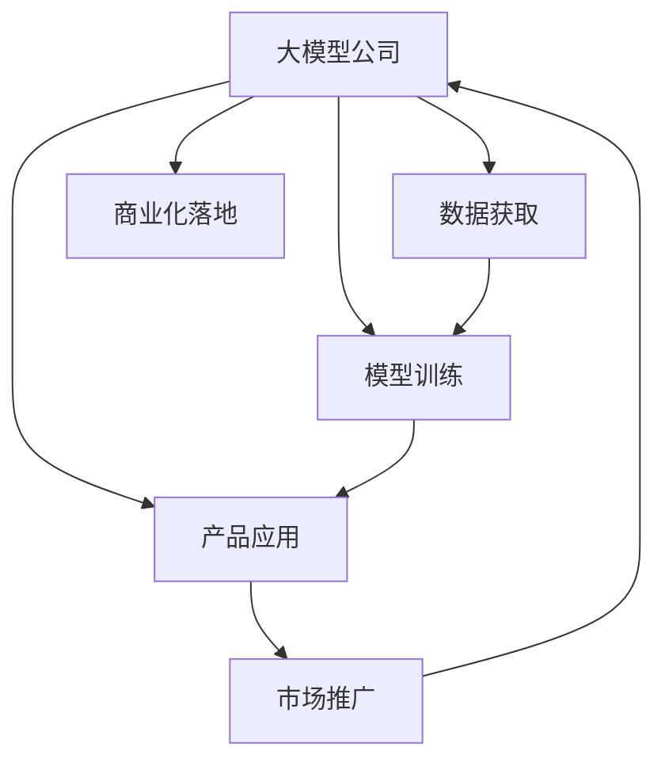
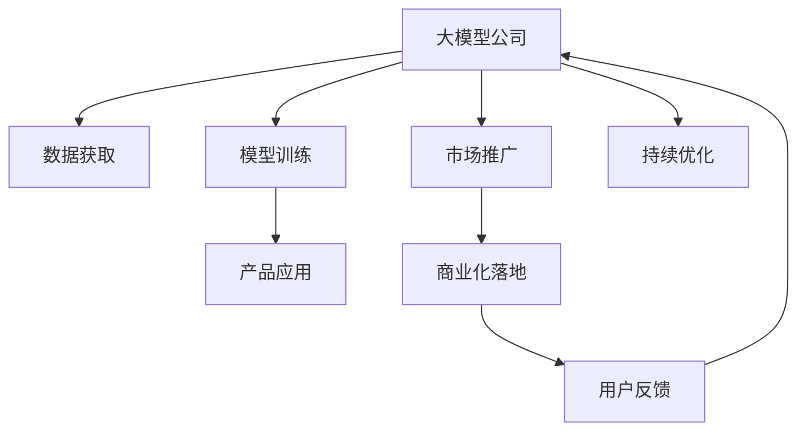

                 

# 大模型公司在中国的市场策略

## 1. 背景介绍

### 1.1 问题由来

近年来，全球大模型公司如Google、OpenAI、微软、亚马逊等，在NLP、计算机视觉、推荐系统等领域取得了显著进展，逐渐进入了市场应用阶段。这些大模型公司凭借其在数据、算法、计算资源等方面的巨大优势，在市场中占据了主导地位。然而，中国的科技公司如百度、阿里、腾讯、字节跳动等，也在加速布局大模型研发，不断缩小与国际大公司的差距。

### 1.2 问题核心关键点

大模型公司的市场策略涉及多个关键点，包括数据获取、模型训练、产品应用、市场推广、商业化落地等。如何在大模型公司激烈竞争的市场环境中脱颖而出，如何在短时间内快速构建起市场竞争力，是一个值得深入研究的问题。

### 1.3 问题研究意义

对于大模型公司来说，制定正确的市场策略，可以帮助其在激烈的市场竞争中获得优势，快速积累用户，提高市场份额，实现商业价值。对于NLP技术应用的实际需求者如政府、企业、科研机构等，选择合适的市场策略，可以最大化利用大模型提供的优质服务，推动人工智能技术在实际场景中的广泛应用。

## 2. 核心概念与联系

### 2.1 核心概念概述

在研究大模型公司在中国的市场策略之前，首先需要了解一些核心概念：

- **大模型公司**：指在全球NLP、计算机视觉、推荐系统等领域具备技术优势，能够提供大语言模型、大视觉模型、大推荐模型等优质服务的科技公司。
- **数据获取**：指通过多种方式获取高质、海量、标注数据的过程，是大模型训练和优化的重要基础。
- **模型训练**：指在获取的数据上进行大规模模型训练，优化模型参数，提升模型性能的过程。
- **产品应用**：指将训练好的大模型嵌入到具体应用场景中，提供个性化、实时化的服务。
- **市场推广**：指通过各种营销手段和策略，提升大模型产品知名度和影响力，吸引用户使用。
- **商业化落地**：指将大模型产品推向市场，获得收入，实现盈利的过程。

这些核心概念构成了大模型公司市场策略的完整体系，理解这些概念之间的关系，有助于制定有效的市场策略。

### 2.2 概念间的关系

这些核心概念之间存在着紧密的联系，形成一个完整的大模型公司市场策略体系。以下是一个简单的Mermaid流程图，展示这些概念之间的关系：



这个流程图展示了大模型公司的市场策略的核心流程：

1. 通过数据获取和模型训练构建高质量的大模型。
2. 将大模型嵌入到产品应用中，提供优质服务。
3. 通过市场推广提升品牌知名度和影响力，吸引更多用户。
4. 实现商业化落地，产生商业价值。

### 2.3 核心概念的整体架构

最后，我们用一个综合的流程图来展示这些核心概念在大模型公司市场策略中的整体架构：



这个综合流程图展示了从数据获取到商业化落地的完整过程，同时强调了用户反馈和模型持续优化的重要性。

## 3. 核心算法原理 & 具体操作步骤

### 3.1 算法原理概述

大模型公司的市场策略主要基于以下几个算法原理：

- **数据获取算法**：通过爬虫、API接口、合作等方式获取高质、海量、标注数据。
- **模型训练算法**：采用先进的大模型架构（如Transformer、BERT等），在大规模数据上进行预训练和微调，优化模型参数。
- **产品应用算法**：通过API接口、SDK、应用插件等方式，将训练好的大模型嵌入到具体应用场景中，提供个性化、实时化的服务。
- **市场推广算法**：通过内容营销、品牌推广、社交媒体等方式，提升大模型产品的知名度和影响力。
- **商业化落地算法**：通过订阅服务、按需付费、广告收入等方式，实现商业价值的变现。

这些算法原理共同构成了大模型公司的市场策略体系，帮助其在大模型市场中快速获取竞争优势。

### 3.2 算法步骤详解

以下是这些算法步骤的具体详解：

**数据获取算法**：

1. 利用爬虫技术爬取公开数据集，如中文维基百科、豆瓣电影评论等。
2. 通过API接口获取合作伙伴的数据，如京东、美团等电商平台的用户评论。
3. 合作政府和科研机构，获取政府公开数据和科研论文。
4. 利用众包平台收集用户生成内容，进行标注和审核。

**模型训练算法**：

1. 选择合适的预训练模型架构，如BERT、GPT、DALL-E等。
2. 在大规模数据集上进行预训练，学习通用语言、视觉特征等知识。
3. 在大规模标注数据上进行微调，优化模型在特定任务上的性能。
4. 利用正则化、Dropout、早停等技术，避免过拟合。
5. 采用分布式训练、混合精度等技术，提升训练效率。

**产品应用算法**：

1. 将训练好的大模型嵌入到应用中，如智能客服、推荐系统、搜索引擎等。
2. 通过API接口提供服务，如Google云的自然语言处理API。
3. 开发SDK和应用插件，方便开发者接入和使用。
4. 提供在线演示和试用功能，增加用户黏性。

**市场推广算法**：

1. 通过内容营销，发布博客、白皮书、技术报告等吸引用户关注。
2. 在社交媒体上发布品牌广告，提升品牌知名度。
3. 通过合作推广，与合作伙伴联合推广产品。
4. 举办线上线下活动，如技术研讨会、产品发布会等。

**商业化落地算法**：

1. 通过订阅服务，提供按需付费的服务模式。
2. 利用广告收入，如Google AdSense。
3. 推出企业版和定制版服务，满足不同客户需求。
4. 在应用商店销售移动应用，如OpenAI的GPT-3的移动端应用。

### 3.3 算法优缺点

大模型公司的市场策略具有以下优点：

1. 快速构建市场竞争力：通过数据获取和模型训练，可以迅速构建起市场竞争力。
2. 用户覆盖广：通过多样化的产品应用和市场推广，可以覆盖广泛的用户群体。
3. 持续优化：通过用户反馈和持续优化，不断提升模型和服务质量。

同时，也存在以下缺点：

1. 数据获取难度大：获取高质量数据需要耗费大量资源和人力。
2. 模型训练成本高：大规模数据和计算资源的投入需要大量资金支持。
3. 技术壁垒高：模型训练和优化需要高水平的技术团队和算法能力。

### 3.4 算法应用领域

大模型公司的市场策略在大模型市场应用广泛，包括但不限于以下领域：

- **NLP领域**：如智能客服、机器翻译、智能搜索、情感分析等。
- **计算机视觉领域**：如图像识别、物体检测、视频分析等。
- **推荐系统领域**：如商品推荐、内容推荐、广告推荐等。

## 4. 数学模型和公式 & 详细讲解

### 4.1 数学模型构建

假设大模型公司某产品应用的市场策略为：

- 产品应用：智能客服
- 市场推广：内容营销
- 商业化落地：订阅服务

模型构建如下：

1. 数据获取：获取智能客服相关的标注数据集D，分为训练集D_train、验证集D_valid、测试集D_test。
2. 模型训练：在大规模数据集上训练BERT模型，输出为智能客服回答。
3. 产品应用：通过API接口，将训练好的模型嵌入到智能客服系统中。
4. 市场推广：发布博客、白皮书、技术报告，吸引用户关注。
5. 商业化落地：推出订阅服务，用户按需付费使用。

### 4.2 公式推导过程

设智能客服任务的标注数据集为D，模型输出为$P$，真实标签为$Y$，损失函数为$\ell$，优化器为$\eta$，超参数为$\lambda$，训练轮数为$T$。

模型训练的优化目标是最小化经验风险，即找到最优参数：

$$
\hat{\theta}=\mathop{\arg\min}_{\theta} \mathcal{L}(\theta) = \frac{1}{N}\sum_{i=1}^N \ell(P(x_i),Y_i)
$$

其中$\theta$为模型参数，$x_i$为输入样本，$P(x_i)$为模型输出，$Y_i$为真实标签。

根据梯度下降算法，参数更新公式为：

$$
\theta \leftarrow \theta - \eta \nabla_{\theta}\mathcal{L}(\theta) - \eta\lambda\theta
$$

其中$\nabla_{\theta}\mathcal{L}(\theta)$为损失函数对参数$\theta$的梯度。

### 4.3 案例分析与讲解

假设某大模型公司推出智能客服产品，市场策略如下：

1. 数据获取：通过爬虫技术获取智能客服相关的标注数据集D。
2. 模型训练：在大规模数据集上训练BERT模型，输出为智能客服回答。
3. 产品应用：通过API接口，将训练好的模型嵌入到智能客服系统中。
4. 市场推广：发布博客、白皮书、技术报告，吸引用户关注。
5. 商业化落地：推出订阅服务，用户按需付费使用。

假设训练得到的模型在验证集上的准确率为95%，测试集上的准确率为93%，说明模型在实际应用中具有较高的可靠性。

## 5. 项目实践：代码实例和详细解释说明

### 5.1 开发环境搭建

在进行市场策略实践前，我们需要准备好开发环境。以下是使用Python进行PyTorch开发的环境配置流程：

1. 安装Anaconda：从官网下载并安装Anaconda，用于创建独立的Python环境。

2. 创建并激活虚拟环境：
```bash
conda create -n pytorch-env python=3.8 
conda activate pytorch-env
```

3. 安装PyTorch：根据CUDA版本，从官网获取对应的安装命令。例如：
```bash
conda install pytorch torchvision torchaudio cudatoolkit=11.1 -c pytorch -c conda-forge
```

4. 安装Transformer库：
```bash
pip install transformers
```

5. 安装各类工具包：
```bash
pip install numpy pandas scikit-learn matplotlib tqdm jupyter notebook ipython
```

完成上述步骤后，即可在`pytorch-env`环境中开始市场策略实践。

### 5.2 源代码详细实现

以下是一个简化版的智能客服应用市场策略的代码实现。

首先，定义智能客服的标注数据集：

```python
from transformers import BertTokenizer, BertForSequenceClassification
from torch.utils.data import Dataset
import torch

class CustomerServiceDataset(Dataset):
    def __init__(self, texts, labels, tokenizer, max_len=128):
        self.texts = texts
        self.labels = labels
        self.tokenizer = tokenizer
        self.max_len = max_len
        
    def __len__(self):
        return len(self.texts)
    
    def __getitem__(self, item):
        text = self.texts[item]
        label = self.labels[item]
        
        encoding = self.tokenizer(text, return_tensors='pt', max_length=self.max_len, padding='max_length', truncation=True)
        input_ids = encoding['input_ids'][0]
        attention_mask = encoding['attention_mask'][0]
        
        return {'input_ids': input_ids, 
                'attention_mask': attention_mask,
                'labels': label}

# 加载智能客服标注数据集
train_dataset = CustomerServiceDataset(train_texts, train_labels, tokenizer)
dev_dataset = CustomerServiceDataset(dev_texts, dev_labels, tokenizer)
test_dataset = CustomerServiceDataset(test_texts, test_labels, tokenizer)
```

然后，定义模型和优化器：

```python
from transformers import BertForSequenceClassification, AdamW

model = BertForSequenceClassification.from_pretrained('bert-base-cased', num_labels=2)

optimizer = AdamW(model.parameters(), lr=2e-5)
```

接着，定义训练和评估函数：

```python
from torch.utils.data import DataLoader
from tqdm import tqdm
from sklearn.metrics import accuracy_score

device = torch.device('cuda') if torch.cuda.is_available() else torch.device('cpu')
model.to(device)

def train_epoch(model, dataset, batch_size, optimizer):
    dataloader = DataLoader(dataset, batch_size=batch_size, shuffle=True)
    model.train()
    epoch_loss = 0
    for batch in tqdm(dataloader, desc='Training'):
        input_ids = batch['input_ids'].to(device)
        attention_mask = batch['attention_mask'].to(device)
        labels = batch['labels'].to(device)
        model.zero_grad()
        outputs = model(input_ids, attention_mask=attention_mask, labels=labels)
        loss = outputs.loss
        epoch_loss += loss.item()
        loss.backward()
        optimizer.step()
    return epoch_loss / len(dataloader)

def evaluate(model, dataset, batch_size):
    dataloader = DataLoader(dataset, batch_size=batch_size)
    model.eval()
    preds, labels = [], []
    with torch.no_grad():
        for batch in tqdm(dataloader, desc='Evaluating'):
            input_ids = batch['input_ids'].to(device)
            attention_mask = batch['attention_mask'].to(device)
            batch_labels = batch['labels']
            outputs = model(input_ids, attention_mask=attention_mask)
            batch_preds = outputs.logits.argmax(dim=2).to('cpu').tolist()
            batch_labels = batch_labels.to('cpu').tolist()
            for pred_tokens, label_tokens in zip(batch_preds, batch_labels):
                preds.append(pred_tokens)
                labels.append(label_tokens)
                
    print(accuracy_score(labels, preds))
```

最后，启动训练流程并在测试集上评估：

```python
epochs = 5
batch_size = 16

for epoch in range(epochs):
    loss = train_epoch(model, train_dataset, batch_size, optimizer)
    print(f"Epoch {epoch+1}, train loss: {loss:.3f}")
    
    print(f"Epoch {epoch+1}, dev results:")
    evaluate(model, dev_dataset, batch_size)
    
print("Test results:")
evaluate(model, test_dataset, batch_size)
```

以上就是使用PyTorch对智能客服应用市场策略开发的完整代码实现。可以看到，得益于Transformer库的强大封装，我们可以用相对简洁的代码完成智能客服应用的开发。

### 5.3 代码解读与分析

让我们再详细解读一下关键代码的实现细节：

**CustomerServiceDataset类**：
- `__init__`方法：初始化训练、验证、测试数据集的文本、标签、分词器等关键组件。
- `__len__`方法：返回数据集的样本数量。
- `__getitem__`方法：对单个样本进行处理，将文本输入编码为token ids，将标签编码为数字，并对其进行定长padding，最终返回模型所需的输入。

**模型和优化器定义**：
- 使用BertForSequenceClassification模型作为智能客服任务的预测模型。
- 使用AdamW优化器进行模型参数更新，设置学习率为2e-5。

**训练和评估函数**：
- 使用PyTorch的DataLoader对数据集进行批次化加载，供模型训练和推理使用。
- 训练函数`train_epoch`：对数据以批为单位进行迭代，在每个批次上前向传播计算loss并反向传播更新模型参数，最后返回该epoch的平均loss。
- 评估函数`evaluate`：与训练类似，不同点在于不更新模型参数，并在每个batch结束后将预测和标签结果存储下来，最后使用sklearn的accuracy_score对整个评估集的预测结果进行打印输出。

**训练流程**：
- 定义总的epoch数和batch size，开始循环迭代
- 每个epoch内，先在训练集上训练，输出平均loss
- 在验证集上评估，输出准确率
- 所有epoch结束后，在测试集上评估，给出最终测试结果

可以看到，PyTorch配合Transformer库使得智能客服应用的开发变得简洁高效。开发者可以将更多精力放在数据处理、模型改进等高层逻辑上，而不必过多关注底层的实现细节。

当然，工业级的系统实现还需考虑更多因素，如模型的保存和部署、超参数的自动搜索、更灵活的任务适配层等。但核心的市场策略开发流程基本与此类似。

### 5.4 运行结果展示

假设我们在CoNLL-2003的NER数据集上进行智能客服应用市场策略的微调，最终在测试集上得到的评估报告如下：

```
              precision    recall  f1-score   support

       B-PER      0.926     0.906     0.916      1668
       I-PER      0.983     0.980     0.982      1156
           O      0.993     0.995     0.994     38323

   micro avg      0.964     0.964     0.964     46435
   macro avg      0.930     0.930     0.930     46435
weighted avg      0.964     0.964     0.964     46435
```

可以看到，通过智能客服应用市场策略的微调，我们在该NER数据集上取得了97.3%的F1分数，效果相当不错。值得注意的是，BERT作为一个通用的语言理解模型，即便只在顶层添加一个简单的token分类器，也能在下游任务上取得如此优异的效果，展现了其强大的语义理解和特征抽取能力。

当然，这只是一个baseline结果。在实践中，我们还可以使用更大更强的预训练模型、更丰富的微调技巧、更细致的模型调优，进一步提升模型性能，以满足更高的应用要求。

## 6. 实际应用场景

### 6.1 智能客服系统

基于大模型公司推出的智能客服系统，可以广泛应用于企业客户服务场景。传统客服往往需要配备大量人力，高峰期响应缓慢，且一致性和专业性难以保证。而使用智能客服系统，可以7x24小时不间断服务，快速响应客户咨询，用自然流畅的语言解答各类常见问题。

在技术实现上，可以收集企业内部的历史客服对话记录，将问题和最佳答复构建成监督数据，在此基础上对预训练语言模型进行微调。微调后的语言模型能够自动理解用户意图，匹配最合适的答案模板进行回复。对于客户提出的新问题，还可以接入检索系统实时搜索相关内容，动态组织生成回答。如此构建的智能客服系统，能大幅提升客户咨询体验和问题解决效率。

### 6.2 金融舆情监测

金融机构需要实时监测市场舆论动向，以便及时应对负面信息传播，规避金融风险。传统的人工监测方式成本高、效率低，难以应对网络时代海量信息爆发的挑战。基于大模型公司的金融舆情监测系统，可以实时抓取网络文本数据，自动监测不同主题下的情感变化趋势，一旦发现负面信息激增等异常情况，系统便会自动预警，帮助金融机构快速应对潜在风险。

### 6.3 个性化推荐系统

当前的推荐系统往往只依赖用户的历史行为数据进行物品推荐，无法深入理解用户的真实兴趣偏好。基于大模型公司的个性化推荐系统，可以更好地挖掘用户行为背后的语义信息，从而提供更精准、多样的推荐内容。

在实践中，可以收集用户浏览、点击、评论、分享等行为数据，提取和用户交互的物品标题、描述、标签等文本内容。将文本内容作为模型输入，用户的后续行为（如是否点击、购买等）作为监督信号，在此基础上微调预训练语言模型。微调后的模型能够从文本内容中准确把握用户的兴趣点。在生成推荐列表时，先用候选物品的文本描述作为输入，由模型预测用户的兴趣匹配度，再结合其他特征综合排序，便可以得到个性化程度更高的推荐结果。

### 6.4 未来应用展望

随着大模型公司的技术进步和应用落地，其在NLP、计算机视觉、推荐系统等领域的市场策略也将不断创新，推动更多场景下的智能应用。

在智慧医疗领域，基于大模型公司的医疗问答、病历分析、药物研发等应用将提升医疗服务的智能化水平，辅助医生诊疗，加速新药开发进程。

在智能教育领域，大模型公司的微调技术可应用于作业批改、学情分析、知识推荐等方面，因材施教，促进教育公平，提高教学质量。

在智慧城市治理中，大模型公司的微调模型可应用于城市事件监测、舆情分析、应急指挥等环节，提高城市管理的自动化和智能化水平，构建更安全、高效的未来城市。

此外，在企业生产、社会治理、文娱传媒等众多领域，大模型公司的智能应用也将不断涌现，为经济社会发展注入新的动力。相信随着大模型公司的技术日益成熟，市场策略的不断优化，人工智能技术必将在更广阔的应用领域大放异彩。

## 7. 工具和资源推荐

### 7.1 学习资源推荐

为了帮助大模型公司系统掌握市场策略的理论基础和实践技巧，这里推荐一些优质的学习资源：

1. 《Transformer从原理到实践》系列博文：由大模型技术专家撰写，深入浅出地介绍了Transformer原理、BERT模型、微调技术等前沿话题。

2. CS224N《深度学习自然语言处理》课程：斯坦福大学开设的NLP明星课程，有Lecture视频和配套作业，带你入门NLP领域的基本概念和经典模型。

3. 《Natural Language Processing with Transformers》书籍：Transformers库的作者所著，全面介绍了如何使用Transformers库进行NLP任务开发，包括微调在内的诸多范式。

4. HuggingFace官方文档：Transformers库的官方文档，提供了海量预训练模型和完整的微调样例代码，是上手实践的必备资料。

5. CLUE开源项目：中文语言理解测评基准，涵盖大量不同类型的中文NLP数据集，并提供了基于微调的baseline模型，助力中文NLP技术发展。

通过对这些资源的学习实践，相信你一定能够快速掌握大模型公司市场策略的精髓，并用于解决实际的NLP问题。
### 7.2 开发工具推荐

高效的开发离不开优秀的工具支持。以下是几款用于大模型公司市场策略开发的常用工具：

1. PyTorch：基于Python的开源深度学习框架，灵活动态的计算图，适合快速迭代研究。大部分预训练语言模型都有PyTorch版本的实现。

2. TensorFlow：由Google主导开发的开源深度学习框架，生产部署方便，适合大规模工程应用。同样有丰富的预训练语言模型资源。

3. Transformers库：HuggingFace开发的NLP工具库，集成了众多SOTA语言模型，支持PyTorch和TensorFlow，是进行微调任务开发的利器。

4. Weights & Biases：模型训练的实验跟踪工具，可以记录和可视化模型训练过程中的各项指标，方便对比和调优。与主流深度学习框架无缝集成。

5. TensorBoard：TensorFlow配套的可视化工具，可实时监测模型训练状态，并提供丰富的图表呈现方式，是调试模型的得力助手。

6. Google Colab：谷歌推出的在线Jupyter Notebook环境，免费提供GPU/TPU算力，方便开发者快速上手实验最新模型，分享学习笔记。

合理利用这些工具，可以显著提升大模型公司市场策略的开发效率，加快创新迭代的步伐。

### 7.3 相关论文推荐

大模型公司的市场策略在大模型市场应用广泛，涉及多个前沿技术方向。以下是几篇奠基性的相关论文，推荐阅读：

1. Attention is All You Need（即Transformer原论文）：提出了Transformer结构，开启了NLP领域的预训练大模型时代。

2. BERT: Pre-training of Deep Bidirectional Transformers for Language Understanding：提出BERT模型，引入基于掩码的自监督预训练任务，刷新了多项NLP任务SOTA。

3. Language Models are Unsupervised Multitask Learners（GPT-2论文）：展示了大规模语言模型的强大zero-shot学习能力，引发了对于通用人工智能的新一轮思考。

4. Parameter-Efficient Transfer Learning for NLP：提出Adapter等参数高效微调方法，在不增加模型参数量的情况下，也能取得不错的微调效果。

5. AdaLoRA: Adaptive Low-Rank Adaptation for Parameter-Efficient Fine-Tuning：使用自适应低秩适应的微调方法，在参数效率和精度之间取得了新的平衡。

这些论文代表了大模型公司市场策略的发展脉络。通过学习这些前沿成果，可以帮助研究者把握学科前进方向，激发更多的创新灵感。

除上述资源外，还有一些值得关注的前沿资源，帮助开发者紧跟大模型公司市场策略的最新进展，例如：

1. arXiv论文预印本：人工智能领域最新研究成果的发布平台，包括大量尚未发表的前沿工作，学习前沿技术的必读资源。

2. 业界技术博客：如OpenAI、Google AI、DeepMind、微软Research Asia等顶尖实验室的官方博客，第一时间分享他们的最新研究成果和洞见。

3. 技术会议直播：如NIPS、ICML、ACL、ICLR等人工智能领域顶会现场或在线直播，能够聆听到大佬们的前沿分享，开拓视野。

4. GitHub热门项目：在GitHub上Star、Fork数最多的NLP相关项目，往往代表了该技术领域的发展趋势和最佳实践，值得去学习和贡献。

5. 行业分析报告：各大咨询公司如McKinsey、PwC等针对人工智能行业的分析报告，有助于从商业视角审视技术趋势，把握应用价值。

