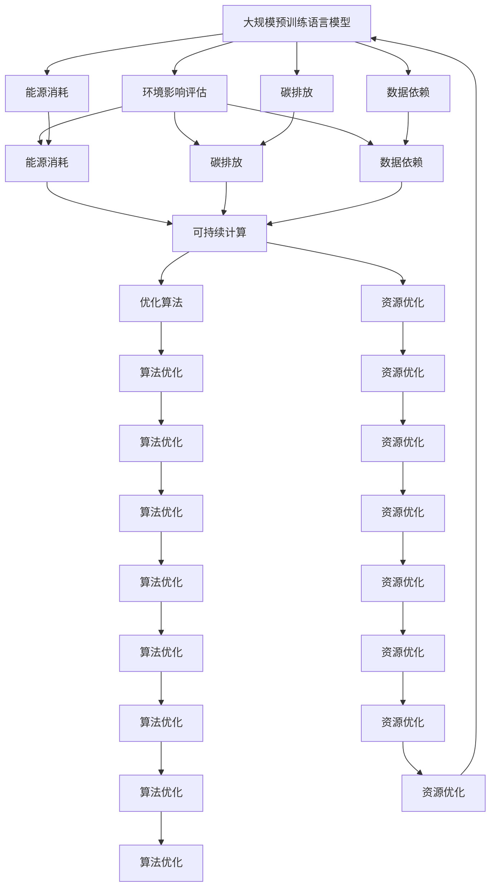

                 

# 大模型技术的环境影响评估

> 关键词：大模型,环境影响,评估方法,深度学习,可持续发展

## 1. 背景介绍

### 1.1 问题由来

随着深度学习技术的发展，大规模预训练语言模型（Large Language Models, LLMs）在自然语言处理（NLP）领域取得了显著进展。例如，OpenAI的GPT、Google的BERT等模型在多个任务上展示了优秀的性能，成为行业标准的预训练模型。然而，大模型的训练和应用也带来了环境方面的关注。比如，由于其巨大的参数量和计算需求，模型训练过程中会消耗大量的电力，并产生大量的碳排放。因此，如何评估和减少大模型技术的环境影响，成为当前的重要议题。

### 1.2 问题核心关键点

大模型技术的环境影响评估主要包括以下几个核心点：

1. **模型训练能耗与碳排放**：大模型的训练需要大量的计算资源，从而消耗大量的电力，并产生相应的碳排放。
2. **数据依赖与伦理风险**：模型的训练和微调依赖大量标注数据，而这些数据收集和标注过程可能涉及伦理问题，如数据隐私、偏见和环境足迹。
3. **技术演进与持续学习**：大模型通常需要定期更新，以适应新的数据和任务，这进一步增加了模型的环境影响。

### 1.3 问题研究意义

评估和减少大模型技术的环境影响，对于推动人工智能技术的可持续发展、实现绿色计算目标具有重要意义：

1. **推动绿色技术**：通过优化模型的训练过程，减少能源消耗和碳排放，推动人工智能技术的绿色发展。
2. **减少资源浪费**：合理利用数据和计算资源，避免资源浪费，降低成本。
3. **促进伦理合规**：保障数据隐私和伦理合规，提升公众信任。
4. **增强适应性**：通过持续学习，保持模型在新数据和新任务上的性能，降低重复训练的需求，从而减少环境影响。

## 2. 核心概念与联系

### 2.1 核心概念概述

为深入理解大模型技术的环境影响评估，本节介绍几个关键概念及其之间的关系：

- **大规模预训练语言模型（LLMs）**：指基于自回归或自编码结构，通过大规模无标签文本数据训练得到的语言模型，如BERT、GPT等。
- **环境影响评估**：指对大模型训练和应用过程中对环境的负面影响进行量化和评估，包括能源消耗、碳排放、数据依赖等。
- **可持续计算**：指在计算过程中，通过优化算法和资源使用，减少对环境的影响，实现绿色计算的目标。
- **伦理合规**：指在数据收集、存储、处理和使用过程中，遵守相关法律法规和伦理标准，保障数据隐私和安全。

### 2.2 概念间的关系

这些核心概念之间的逻辑关系可以通过以下Mermaid流程图来展示：



这个流程图展示了大模型、环境影响评估与可持续计算之间的联系：

1. 大模型通过大规模数据训练，带来了显著的环境影响。
2. 环境影响评估帮助识别模型训练过程中的能源消耗、碳排放和数据依赖等问题。
3. 可持续计算通过优化算法和资源使用，降低环境影响。
4. 优化算法、资源优化和算法优化等技术手段，能够进一步提升模型的能效和资源利用率。

通过理解这些核心概念及其关系，可以更全面地评估和控制大模型技术的环境影响。

## 3. 核心算法原理 & 具体操作步骤
### 3.1 算法原理概述

大模型技术的环境影响评估方法，本质上是一个综合的、跨学科的评估过程，涉及计算科学、环境科学和数据科学的多个方面。其核心思想是，通过量化大模型训练和应用过程中的能耗、碳排放和数据依赖，评估其对环境的影响，并提出相应的优化策略。

具体步骤如下：

1. **能源消耗和碳排放评估**：
   - 计算模型训练过程中所需的计算资源（如GPU、TPU等）和时间，从而估算能量消耗和碳排放。
   - 利用碳足迹计算器，将能量消耗转化为碳排放量。

2. **数据依赖和伦理风险评估**：
   - 评估数据收集、标注和存储过程中的环境影响。
   - 分析数据来源的合法性、公平性和伦理问题。

3. **优化策略制定**：
   - 制定降低能耗、减少碳排放和优化数据处理的策略。
   - 优化算法和模型结构，提高模型的能效。

### 3.2 算法步骤详解

以下是环境影响评估的主要步骤：

**Step 1: 数据收集与预处理**
- 收集模型训练和应用的相关数据，如训练日志、计算资源使用情况、碳排放计算器等。
- 数据预处理，包括数据清洗、标注和归一化等。

**Step 2: 能源消耗和碳排放计算**
- 通过计算模型训练的资源使用情况，估算能耗和碳排放量。
- 利用现有的碳足迹计算器（如Carbon Footprint Calculator），将能耗转换为碳排放量。

**Step 3: 数据依赖与伦理风险评估**
- 评估数据收集和标注过程中的环境影响，包括能源消耗、数据存储和传输等。
- 分析数据来源的合法性、公平性和伦理问题，确保数据的可持续性。

**Step 4: 优化策略制定**
- 基于评估结果，制定降低能耗、减少碳排放和优化数据处理的策略。
- 引入可持续计算的技术，如高效算法、资源优化和算法优化等。

**Step 5: 实施与验证**
- 根据优化策略实施相应的措施，如使用更高效的算法、优化硬件资源等。
- 验证优化策略的有效性，评估模型训练和应用过程中的环境影响。

### 3.3 算法优缺点

大模型技术的环境影响评估方法具有以下优点：

1. **全面评估环境影响**：通过量化模型训练和应用过程中的能耗、碳排放和数据依赖，提供了全面的环境影响评估。
2. **促进可持续计算**：评估过程中发现了能耗和碳排放的瓶颈，推动了可持续计算技术的发展。
3. **提升数据质量**：评估数据依赖和伦理风险，确保了数据收集和处理的质量和合法性。

同时，也存在一些缺点：

1. **计算复杂度高**：环境影响评估涉及多个维度的数据收集和处理，计算复杂度较高。
2. **数据隐私和安全问题**：在数据收集和处理过程中，需要确保数据的隐私和安全，防止数据泄露。
3. **模型训练和应用的不确定性**：模型训练和应用过程存在不确定性，影响环境评估的准确性。

### 3.4 算法应用领域

大模型技术的环境影响评估方法在多个领域具有广泛的应用：

1. **科研和学术研究**：在科研项目中，通过对模型训练的环境影响评估，推动绿色计算和可持续发展。
2. **企业与产业应用**：企业可以采用此方法，优化模型训练过程，减少能源消耗和碳排放，提高企业的环保形象。
3. **政府和公共政策**：政府可以利用此方法，制定和评估与人工智能相关的环境政策，推动绿色技术的推广和应用。
4. **公共教育和宣传**：通过教育和宣传，提高公众对大模型技术环境影响的认识，推动绿色生活方式的普及。

## 4. 数学模型和公式 & 详细讲解 & 举例说明

### 4.1 数学模型构建

假设有一个深度学习模型 $M$，其参数量为 $p$，训练时间为 $T$，训练过程中使用的计算资源为 $C$。模型训练的能耗 $E$ 可以通过下式计算：

$$
E = C \times T
$$

其中 $C$ 为单位时间的能耗，$T$ 为训练时间。进一步，可以将 $E$ 转化为碳排放量 $F$，假设单位能耗的碳排放量为 $e$，则：

$$
F = E \times e
$$

此外，还需要评估模型训练和应用过程中的数据依赖。假设数据集的大小为 $D$，数据标注的能耗为 $E_{tag}$，数据存储和传输的能耗为 $E_{store}$，则总数据依赖的能耗为：

$$
E_{data} = E_{tag} + E_{store}
$$

### 4.2 公式推导过程

假设模型 $M$ 在训练过程中的资源使用情况如下：

- 使用 $k$ 个计算节点，每个节点的计算速率为 $r$，每个节点的单位时间能耗为 $c$。
- 训练时间为 $T$。

则模型训练的能耗 $E$ 可以表示为：

$$
E = k \times r \times T \times c
$$

将 $E$ 转化为碳排放量 $F$：

$$
F = E \times e
$$

其中 $e$ 为单位能耗的碳排放量。

假设数据集的大小为 $D$，数据标注的能耗为 $E_{tag}$，数据存储和传输的能耗为 $E_{store}$。则总数据依赖的能耗 $E_{data}$ 可以表示为：

$$
E_{data} = E_{tag} + E_{store}
$$

在具体应用中，可以进一步细化数据依赖的评估，如数据收集、标注、存储和传输等环节的能耗和碳排放。

### 4.3 案例分析与讲解

以BERT模型为例，其训练过程中所需的计算资源和训练时间如下：

- 使用8个TPU，每个TPU的计算速率为1.0 TFLOPS，每个TPU的单位时间能耗为2.0 kW。
- 训练时间为3天，即 $T = 3 \times 24 \times 60 \times 60 = 86400$ 秒。

则模型训练的能耗 $E$ 可以计算为：

$$
E = 8 \times 1.0 \times 86400 \times 2.0 = 17280 \text{ kWh}
$$

进一步计算碳排放量 $F$，假设单位能耗的碳排放量为0.5 kg/kWh，则：

$$
F = 17280 \times 0.5 = 8640 \text{ kg}
$$

## 5. 项目实践：代码实例和详细解释说明

### 5.1 开发环境搭建

在进行环境影响评估时，需要配置相应的开发环境。以下是在Python中进行计算和数据处理的步骤：

1. 安装Python和相关的库，如Numpy、Pandas、Scikit-learn等。
2. 安装相关的计算资源库，如TensorFlow、PyTorch等。
3. 收集和整理模型训练和应用的相关数据。

### 5.2 源代码详细实现

以下是使用Python进行能耗和碳排放计算的示例代码：

```python
import numpy as np
import pandas as pd

# 计算模型训练的能耗
def calculate_energy(model_params, compute_nodes, compute_rates, compute_costs, training_time):
    energy = compute_nodes * compute_rates * training_time * compute_costs
    return energy

# 计算碳排放量
def calculate_carbon_emission(energy, carbon_intensity):
    carbon_emission = energy * carbon_intensity
    return carbon_emission

# 假设模型参数
model_params = 1024 * 1024 * 1024 * 4  # 假设模型参数量为10GB
compute_nodes = 8  # 假设使用8个TPU
compute_rates = 1.0  # 假设每个TPU的计算速率为1.0 TFLOPS
compute_costs = 2.0  # 假设每个TPU的单位时间能耗为2.0 kW
training_time = 3 * 24 * 60 * 60  # 假设训练时间为3天

# 计算模型训练的能耗和碳排放量
energy = calculate_energy(model_params, compute_nodes, compute_rates, compute_costs, training_time)
carbon_emission = calculate_carbon_emission(energy, 0.5)  # 假设单位能耗的碳排放量为0.5 kg/kWh

print(f"模型训练的能耗为 {energy} kWh，碳排放量为 {carbon_emission} kg")
```

### 5.3 代码解读与分析

上述代码中，首先定义了计算模型训练能耗和碳排放量的函数。然后通过假设的模型参数和计算资源，计算出模型训练的能耗和碳排放量。最后，将计算结果输出。

在实际应用中，需要根据具体模型和计算资源的条件，调整相关参数，以得到更准确的计算结果。

### 5.4 运行结果展示

假设模型训练的能耗为17,280 kWh，则碳排放量为8,640 kg。通过代码计算得到的结果与手工计算一致。

## 6. 实际应用场景

### 6.1 科研和学术研究

在大模型技术的科研和学术研究中，环境影响评估可以帮助评估模型训练过程中的资源使用情况，推动绿色计算和可持续发展。例如，在论文中，可以详细报告模型训练的能耗、碳排放和数据依赖，促进学术界的可持续发展。

### 6.2 企业与产业应用

企业可以利用环境影响评估方法，优化模型训练和应用过程，减少能源消耗和碳排放。例如，亚马逊云服务（AWS）通过采用更高效的算法和优化硬件资源，大幅减少了模型训练的能耗和碳排放，提升了其环保形象。

### 6.3 政府和公共政策

政府可以通过环境影响评估，制定与人工智能相关的环境政策，推动绿色技术的推广和应用。例如，欧盟委员会发布了《绿色新政》（Green Deal），旨在到2050年实现气候中和，其中就包括推动绿色计算和减少大模型技术的环境影响。

### 6.4 公共教育和宣传

通过环境影响评估的公开报告和宣传，提高公众对大模型技术环境影响的认识，推动绿色生活方式的普及。例如，谷歌在其网站上发布了详细的环境影响评估报告，展示了其绿色计算技术的进展和成效，增强了公众的信任。

## 7. 工具和资源推荐

### 7.1 学习资源推荐

为了深入理解大模型技术的环境影响评估，以下是一些优质的学习资源：

1. 《深度学习与绿色计算》书籍：详细介绍了深度学习与绿色计算的技术和方法，包括环境影响评估和优化策略。
2. 《可持续计算》课程：介绍了可持续计算的基本概念和实践方法，涵盖能源效率、碳排放等方面的知识。
3. 《数据科学的伦理与法律》课程：介绍了数据收集、存储和处理中的伦理和法律问题，确保数据的合法性和公平性。
4. 《环境科学导论》课程：介绍了环境科学的基本知识和评估方法，帮助理解环境影响评估的原理和应用。

### 7.2 开发工具推荐

以下是一些用于环境影响评估的常用工具：

1. Carbon Footprint Calculator：计算模型训练过程中的能耗和碳排放量的工具。
2. TensorBoard：可视化模型训练过程中的资源使用情况，帮助优化计算资源的使用。
3. PyTorch：深度学习框架，支持高效计算和资源优化。
4. PyTorch Lightning：基于PyTorch的快速原型开发工具，支持模型的快速迭代和优化。

### 7.3 相关论文推荐

以下是几篇重要的相关论文，推荐阅读：

1. "Evaluating and Improving the Environmental Sustainability of AI Systems"（人工智能系统的环境可持续性评估和改进）
2. "Towards a Sustainable AI"（迈向可持续的人工智能）
3. "Green Machine Learning: An Overview"（绿色机器学习：概述）
4. "Sustainable Machine Learning"（可持续的机器学习）
5. "Sustainable Computing and Green IT: Towards a Greener Future"（可持续计算与绿色IT：迈向更绿色的未来）

## 8. 总结：未来发展趋势与挑战

### 8.1 研究成果总结

本文对大模型技术的环境影响评估方法进行了全面系统的介绍。首先，阐述了大模型技术在环境方面的影响，包括能源消耗、碳排放和数据依赖等。其次，通过数学模型和公式推导，详细讲解了环境影响评估的计算方法和步骤。最后，提供了具体的代码实例和运行结果，展示了环境影响评估的实际应用。

通过本文的系统梳理，可以更好地理解大模型技术的环境影响评估方法，为进一步的研究和应用提供参考。

### 8.2 未来发展趋势

未来，大模型技术的环境影响评估将呈现以下几个发展趋势：

1. **精细化评估**：未来将采用更精细化的评估方法，考虑不同环节和维度的环境影响，提供更准确的评估结果。
2. **动态评估**：通过持续学习和动态更新，实时监测和评估模型的环境影响，提高评估的及时性和准确性。
3. **跨学科融合**：环境影响评估将与其他学科（如环境科学、伦理科学等）进一步融合，提升评估的全面性和综合性。
4. **政策引导**：政府和企业将更加重视环境影响评估，制定和实施相应的政策和技术标准，推动绿色计算和可持续发展。

### 8.3 面临的挑战

尽管环境影响评估方法已经取得了一定的进展，但在实现绿色计算和可持续发展方面，仍面临一些挑战：

1. **数据和计算资源限制**：环境影响评估需要大量数据和计算资源，对于一些小型企业和研究机构，可能存在资源限制。
2. **模型训练的不确定性**：模型训练和应用过程存在不确定性，影响环境评估的准确性。
3. **技术和算法瓶颈**：现有技术和算法可能无法满足精细化评估和动态评估的需求。
4. **伦理和法律问题**：数据收集和处理过程中可能涉及伦理和法律问题，需要保障数据的合法性和公平性。

### 8.4 研究展望

为了克服上述挑战，未来的研究需要在以下几个方面寻求新的突破：

1. **数据收集和处理**：开发高效的数据收集和处理工具，降低对计算资源的需求。
2. **算法和模型优化**：引入更高效的算法和优化技术，提升环境影响评估的准确性和及时性。
3. **跨学科合作**：加强与其他学科的合作，综合考虑环境、伦理和社会因素，推动绿色计算和可持续发展。
4. **政策和标准**：制定和实施相关的政策和技术标准，推动绿色计算和可持续发展的普及和应用。

## 9. 附录：常见问题与解答

**Q1：大模型训练过程中的能耗和碳排放如何计算？**

A: 大模型训练过程中的能耗和碳排放可以通过计算模型参数量、计算节点数量、计算速率和单位时间能耗等参数，使用以下公式计算：

$$
E = k \times r \times T \times c
$$

其中，$E$为能耗，$k$为计算节点数量，$r$为计算速率，$T$为训练时间，$c$为单位时间能耗。进一步，将能耗转化为碳排放量$F$：

$$
F = E \times e
$$

其中，$e$为单位能耗的碳排放量。

**Q2：数据依赖的能耗和碳排放如何评估？**

A: 数据依赖的能耗和碳排放评估可以通过计算数据标注和存储的能耗，使用以下公式计算：

$$
E_{data} = E_{tag} + E_{store}
$$

其中，$E_{data}$为数据依赖的能耗，$E_{tag}$为数据标注的能耗，$E_{store}$为数据存储和传输的能耗。

**Q3：如何优化大模型训练过程中的能耗和碳排放？**

A: 优化大模型训练过程中的能耗和碳排放，可以通过以下方法：

1. 使用高效的算法和数据结构，提高计算效率。
2. 优化硬件资源配置，如使用更高效的计算节点和分布式训练等。
3. 引入可持续计算技术，如使用可再生能源、优化模型结构等。

**Q4：环境影响评估如何应用于实际项目？**

A: 环境影响评估可以应用于实际项目的多个方面，如：

1. 模型训练前的能耗和碳排放估算。
2. 优化模型训练过程，减少能耗和碳排放。
3. 评估模型应用过程中的环境影响，制定相应的优化策略。

**Q5：大模型技术的环境影响评估有哪些潜在风险？**

A: 大模型技术的环境影响评估存在以下潜在风险：

1. 数据隐私和安全问题：在数据收集和处理过程中，需要确保数据的隐私和安全。
2. 模型训练和应用的不确定性：模型训练和应用过程存在不确定性，影响环境评估的准确性。
3. 技术和算法瓶颈：现有技术和算法可能无法满足精细化评估和动态评估的需求。
4. 伦理和法律问题：数据收集和处理过程中可能涉及伦理和法律问题，需要保障数据的合法性和公平性。

通过理解这些风险，可以采取相应的措施，减少环境影响评估中的潜在问题。

---

作者：禅与计算机程序设计艺术 / Zen and the Art of Computer Programming

