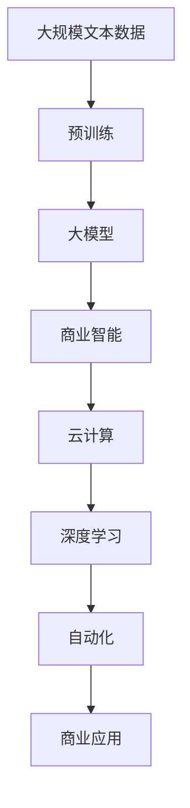
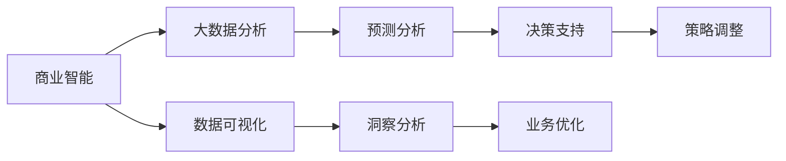
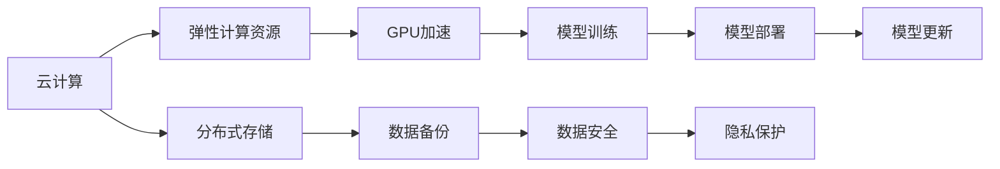
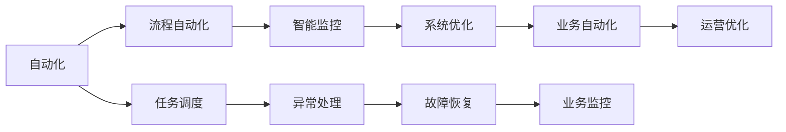

                 

# 大模型时代下的新型商业模式

> 关键词：大模型,商业模式,人工智能,商业智能,深度学习,自动化,云计算

## 1. 背景介绍

### 1.1 问题由来
在当今这个数据驱动的时代，人工智能（AI）技术正以指数级速度发展，尤其是在深度学习和大规模预训练模型（如BERT、GPT-3等）的推动下，AI正在进入一个崭新的大模型时代。大模型凭借其强大的数据处理和复杂问题解决能力，逐渐成为各行各业数字化转型的重要推动力。然而，伴随着大模型的快速发展，传统的商业模式也面临着前所未有的挑战和变革。

### 1.2 问题核心关键点
大模型时代下的新型商业模式主要包括以下几个核心问题：
1. **数据与算力需求**：大模型训练和部署需要庞大的数据集和强大的计算资源，这对传统的商业数据管理、云计算和边缘计算提出了新的要求。
2. **成本与收益**：高昂的算力成本和数据获取成本如何合理分配，以及如何在短时间内获得可观的商业回报，是大模型商业化过程中需要解决的关键问题。
3. **模型可解释性**：随着模型规模的扩大，如何确保模型的决策过程透明，以及如何将其解释给非技术用户，是保证商业成功的重要因素。
4. **安全与隐私**：大模型处理的数据通常包含敏感信息，如何在确保模型性能的同时，保护用户隐私和数据安全，成为大模型商业应用中的重大挑战。
5. **跨领域应用**：大模型在金融、医疗、零售等领域的广泛应用，如何结合特定行业特点，开发定制化解决方案，是大模型商业化的重要方向。

### 1.3 问题研究意义
理解并构建大模型时代下的新型商业模式，对于推动AI技术的商业化应用，促进各行各业的数字化转型，具有重要意义：

1. **加速行业数字化**：通过大模型技术，各行各业能够快速获取数据洞察，优化业务流程，提升决策效率。
2. **提高竞争优势**：利用大模型的强大能力，企业可以突破传统技术壁垒，实现技术领先。
3. **降低运营成本**：自动化和智能化的业务流程将大幅降低人力和运营成本，提升企业竞争力。
4. **创新产品与服务**：结合大模型技术，企业可以开发出更多创新的产品和服务，满足消费者不断变化的需求。
5. **开拓新市场**：大模型技术的应用，为企业进入新市场提供了新的机遇。

## 2. 核心概念与联系

### 2.1 核心概念概述

为更好地理解大模型时代下的新型商业模式，本节将介绍几个密切相关的核心概念：

- **大模型(Large Model)**：指基于深度学习架构，参数量达到数十亿甚至数百亿的预训练模型，如BERT、GPT-3等。大模型通过大规模无标签数据的预训练，具备强大的数据处理能力和泛化能力。
- **商业智能(Business Intelligence, BI)**：利用数据挖掘、数据可视化和预测分析等技术，帮助企业更好地理解市场动态、优化决策过程，提升业务效率。
- **云计算(Cloud Computing)**：通过互联网提供按需计算资源和服务，使企业能够灵活、高效地使用计算资源，无需自行购买和管理硬件设备。
- **深度学习(Deep Learning)**：一种基于多层神经网络的人工智能技术，通过模拟人脑神经系统，实现对复杂数据的学习和处理。
- **自动化(Automation)**：利用AI和机器人技术，自动化执行重复性高、耗时长的工作，提高工作效率，减少人为错误。
- **商业应用(Business Application)**：指将AI技术应用于实际业务场景中的产品和服务，如智能客服、推荐系统、金融预测等。

这些核心概念之间存在着紧密的联系，形成了大模型时代新型商业模式的完整生态系统。

### 2.2 概念间的关系

这些核心概念之间存在着紧密的联系，形成了大模型时代新型商业模式的完整生态系统。

#### 2.2.1 大模型的学习范式



这个流程图展示了大模型在大规模数据预训练的基础上，通过商业智能、云计算、深度学习和自动化等技术，最终应用于实际商业场景的全过程。

#### 2.2.2 商业智能与大模型的关系



这个流程图展示了商业智能在大模型时代的应用。通过数据挖掘、可视化、预测分析和洞察分析，商业智能帮助企业从大模型中获取有价值的信息，辅助决策和优化业务流程。

#### 2.2.3 云计算与大模型的关系



这个流程图展示了云计算在大模型训练和部署中的作用。云计算提供了弹性计算资源、分布式存储和数据备份，支持大模型的高效训练和灵活部署。同时，云计算还通过GPU加速和隐私保护等技术，保障大模型的安全性和高效性。

#### 2.2.4 自动化与大模型的关系



这个流程图展示了自动化在大模型应用中的作用。通过流程自动化、任务调度和智能监控，自动化确保了大模型在商业应用中的高效性和稳定性。同时，自动化还通过异常处理和故障恢复等机制，保障大模型的稳定运行和业务连续性。

## 3. 核心算法原理 & 具体操作步骤

### 3.1 算法原理概述

大模型时代下的新型商业模式主要基于深度学习和大规模预训练模型技术。以下是几种常见的商业模式及其算法原理：

1. **SaaS模式(Software as a Service)**：通过云端服务提供大模型API，用户无需自行安装和维护，只需通过API调用即可获取模型服务。
2. **PaaS模式(Platform as a Service)**：提供定制化的平台，用户可以在平台上训练和部署自己的大模型，并通过平台提供的工具和资源进行管理和优化。
3. **BaaS模式(Blockchain as a Service)**：利用区块链技术，确保模型训练和部署的透明性和安全性，为用户提供可靠的大模型服务。
4. **API-first模式**：通过开放API，提供大模型API接口，允许开发者直接调用模型进行应用开发和创新。
5. **微服务架构**：将大模型拆分为多个独立服务模块，每个模块负责特定功能，通过微服务架构实现高效协同和灵活扩展。

### 3.2 算法步骤详解

以下是几种常见商业模式的详细步骤：

**SaaS模式**：
1. **数据采集**：用户通过API接口向SaaS平台提交数据。
2. **预训练模型调用**：SaaS平台调用大模型API，进行预训练。
3. **商业智能分析**：利用商业智能工具，对预训练结果进行分析，生成报告和洞察。
4. **决策支持**：企业根据商业智能报告，进行业务决策和优化。

**PaaS模式**：
1. **平台搭建**：用户在PaaS平台上搭建专属环境，部署大模型。
2. **数据上传**：用户将数据上传至平台，进行预训练和微调。
3. **模型优化**：利用平台提供的工具和资源，进行模型优化和调整。
4. **商业应用部署**：将优化后的模型部署至应用中，进行商业化运营。

**BaaS模式**：
1. **模型训练**：用户利用区块链技术进行模型训练，确保训练过程透明、可追溯。
2. **模型验证**：在区块链上验证模型的性能和安全，确保模型可靠。
3. **模型部署**：用户将验证后的模型部署至区块链上，提供服务。
4. **用户交互**：用户通过区块链平台调用大模型API，获取服务。

**API-first模式**：
1. **API设计**：提供标准化的API接口，方便开发者调用。
2. **模型训练**：开发者在本地或云端训练大模型。
3. **模型验证**：开发者进行模型验证和调优。
4. **API集成**：开发者将模型集成到应用中，提供服务。

**微服务架构**：
1. **模块拆分**：将大模型拆分为多个独立服务模块。
2. **独立部署**：每个模块独立部署，减少耦合。
3. **协同运行**：通过微服务架构，实现各模块的高效协同和灵活扩展。
4. **统一接口**：提供统一的API接口，方便开发者调用。

### 3.3 算法优缺点

1. **SaaS模式**：
   - **优点**：降低用户入门门槛，无需维护硬件设备，提供即插即用的服务。
   - **缺点**：依赖网络，可能受网络延迟和带宽限制影响。

2. **PaaS模式**：
   - **优点**：提供定制化服务，满足用户特定需求，提供丰富的工具和资源。
   - **缺点**：需要用户自行维护和管理，可能存在技术门槛。

3. **BaaS模式**：
   - **优点**：确保模型训练和部署的透明性和安全性，提供高可靠性的服务。
   - **缺点**：技术复杂度高，可能存在性能瓶颈。

4. **API-first模式**：
   - **优点**：灵活度高，开发者可以根据需求自由调用模型，提升创新速度。
   - **缺点**：需要开发者自行进行模型训练和优化，可能存在技术门槛。

5. **微服务架构**：
   - **优点**：模块独立，易于扩展和维护，支持高效协同。
   - **缺点**：架构复杂度增加，需要团队协同开发和维护。

### 3.4 算法应用领域

大模型时代下的新型商业模式广泛应用在以下几个领域：

- **金融领域**：利用大模型进行风险预测、信用评估、交易预测等，提升金融决策效率和准确性。
- **医疗领域**：利用大模型进行疾病诊断、治疗方案推荐、健康监测等，提升医疗服务水平。
- **零售领域**：利用大模型进行商品推荐、库存管理、客户关系管理等，提升零售业务效率和客户满意度。
- **制造业**：利用大模型进行质量检测、设备维护、生产调度等，提升制造过程的智能化水平。
- **物流领域**：利用大模型进行路线规划、配送优化、库存管理等，提升物流运营效率和客户体验。

## 4. 数学模型和公式 & 详细讲解 & 举例说明

### 4.1 数学模型构建

大模型时代下的新型商业模式主要基于深度学习和大规模预训练模型技术。以下是几种常见的数学模型及其构建方法：

1. **SaaS模式**：
   - **模型训练**：利用云计算平台，训练大模型，生成预训练模型。
   - **商业智能分析**：利用商业智能工具，进行数据挖掘、数据可视化和预测分析。

2. **PaaS模式**：
   - **模型训练**：用户在PaaS平台上搭建专属环境，进行模型训练和微调。
   - **模型优化**：利用平台提供的工具和资源，进行模型优化和调整。

3. **BaaS模式**：
   - **模型训练**：利用区块链技术，进行模型训练，确保训练过程透明、可追溯。
   - **模型验证**：在区块链上验证模型的性能和安全，确保模型可靠。

4. **API-first模式**：
   - **模型训练**：开发者在本地或云端训练大模型。
   - **模型验证**：开发者进行模型验证和调优。

5. **微服务架构**：
   - **模型训练**：将大模型拆分为多个独立服务模块，进行分布式训练。
   - **模型部署**：将训练好的模型部署至微服务架构中，提供API服务。

### 4.2 公式推导过程

以下是几种常见商业模式的公式推导过程：

**SaaS模式**：
- **数据采集**：
  $$
  X = \{ x_1, x_2, ..., x_n \}
  $$
  其中 $x_i$ 表示用户提交的数据。

- **预训练模型调用**：
  $$
  Y = M(X)
  $$
  其中 $M$ 表示大模型，$Y$ 表示预训练结果。

- **商业智能分析**：
  $$
  Z = BI(Y)
  $$
  其中 $BI$ 表示商业智能工具，$Z$ 表示商业智能分析结果。

- **决策支持**：
  $$
  U = DS(Z)
  $$
  其中 $DS$ 表示决策支持工具，$U$ 表示业务决策结果。

**PaaS模式**：
- **平台搭建**：
  $$
  P = PAAS
  $$
  其中 $PAAS$ 表示PaaS平台。

- **数据上传**：
  $$
  X = \{ x_1, x_2, ..., x_n \}
  $$
  其中 $x_i$ 表示用户上传的数据。

- **预训练模型调用**：
  $$
  Y = M(X)
  $$
  其中 $M$ 表示大模型，$Y$ 表示预训练结果。

- **模型优化**：
  $$
  Y' = MO(Y)
  $$
  其中 $MO$ 表示模型优化工具，$Y'$ 表示优化后的模型。

- **商业应用部署**：
  $$
  S = AP(Y')
  $$
  其中 $AP$ 表示应用平台，$S$ 表示商业应用。

**BaaS模式**：
- **模型训练**：
  $$
  M = BAAS
  $$
  其中 $BAAS$ 表示BaaS平台。

- **模型验证**：
  $$
  M' = BV(M)
  $$
  其中 $BV$ 表示模型验证工具，$M'$ 表示验证后的模型。

- **模型部署**：
  $$
  S = BS(M')
  $$
  其中 $BS$ 表示区块链平台，$S$ 表示服务。

- **用户交互**：
  $$
  R = CI(S)
  $$
  其中 $CI$ 表示客户端工具，$R$ 表示用户交互结果。

**API-first模式**：
- **模型训练**：
  $$
  M = API
  $$
  其中 $API$ 表示API接口。

- **模型验证**：
  $$
  M' = VA(M)
  $$
  其中 $VA$ 表示模型验证工具，$M'$ 表示验证后的模型。

- **API集成**：
  $$
  S = IC(M')
  $$
  其中 $IC$ 表示API集成工具，$S$ 表示集成后的服务。

**微服务架构**：
- **模块拆分**：
  $$
  M = MS
  $$
  其中 $MS$ 表示微服务模块。

- **独立部署**：
  $$
  MS_i = DS_i
  $$
  其中 $DS_i$ 表示分布式服务，$i$ 表示模块编号。

- **协同运行**：
  $$
  R = CO(MS)
  $$
  其中 $CO$ 表示协同运行工具，$R$ 表示协同运行结果。

- **统一接口**：
  $$
  I = UI
  $$
  其中 $UI$ 表示统一接口，$I$ 表示接口调用。

### 4.3 案例分析与讲解

以下是一个简单的SaaS模式的案例分析：

**案例背景**：
某金融公司希望利用大模型进行信用评估和风险预测，提升贷款审批效率。

**具体流程**：
1. **数据采集**：金融公司通过API接口，向SaaS平台提交用户贷款申请数据，包括收入、信用记录、社交网络等。
2. **预训练模型调用**：SaaS平台调用大模型API，进行信用评估和风险预测。
3. **商业智能分析**：利用商业智能工具，对大模型的输出结果进行数据挖掘和分析，生成信用评估报告和风险预测结果。
4. **决策支持**：金融公司根据商业智能报告，进行贷款审批和风险控制决策。

## 5. 项目实践：代码实例和详细解释说明

### 5.1 开发环境搭建

在进行项目实践前，我们需要准备好开发环境。以下是使用Python进行SaaS模式实践的开发环境配置流程：

1. **安装Anaconda**：从官网下载并安装Anaconda，用于创建独立的Python环境。

2. **创建并激活虚拟环境**：
  ```bash
  conda create -n saas-env python=3.8 
  conda activate saas-env
  ```

3. **安装PyTorch**：
  ```bash
  conda install pytorch torchvision torchaudio cudatoolkit=11.1 -c pytorch -c conda-forge
  ```

4. **安装Flask**：用于搭建API服务。
  ```bash
  pip install flask
  ```

5. **安装商业智能工具**：如TensorBoard、Weights & Biases等，用于监控模型训练和评估结果。
  ```bash
  pip install tensorboard weightsandbiases
  ```

完成上述步骤后，即可在`saas-env`环境中开始SaaS模式实践。

### 5.2 源代码详细实现

以下是一个简单的SaaS模式实践代码实现：

```python
from flask import Flask, request, jsonify
import torch
import transformers
from tensorboardX import SummaryWriter

app = Flask(__name__)

# 加载大模型
model = transformers.TFAutoModelForSequenceClassification.from_pretrained('bert-base-cased', num_labels=2)

# 商业智能工具
writer = SummaryWriter()

# 加载商业智能数据
train_data = ...
dev_data = ...
test_data = ...

def train_model(model, data, epochs, batch_size):
    writer.add_text('training/epoch', 'epoch 0')
    writer.add_histogram('training/loss', [])
    writer.add_histogram('training/accuracy', [])
    for epoch in range(epochs):
        for batch in data:
            inputs = ...
            labels = ...
            outputs = model(inputs)
            loss = outputs.loss
            acc = outputs.accuracy
            writer.add_histogram('training/loss', loss)
            writer.add_histogram('training/accuracy', acc)
        writer.add_text('training/epoch', f'epoch {epoch+1}')
        writer.add_scalar('training/loss', loss)
        writer.add_scalar('training/accuracy', acc)
    return model

@app.route('/predict', methods=['POST'])
def predict():
    inputs = request.json['inputs']
    labels = request.json['labels']
    outputs = model(inputs)
    loss = outputs.loss
    acc = outputs.accuracy
    return jsonify({'loss': loss, 'accuracy': acc})

if __name__ == '__main__':
    model = train_model(model, train_data, 10, 32)
    app.run(host='0.0.0.0', port=5000)
```

### 5.3 代码解读与分析

让我们再详细解读一下关键代码的实现细节：

**Flask框架**：
- 使用Flask框架搭建API服务，通过`@app.route`装饰器定义API接口，实现模型的调用和响应。

**商业智能工具**：
- 使用TensorBoardX库记录训练过程中的各项指标，如损失、准确率等，并通过可视化工具展示训练曲线和结果。

**训练过程**：
- 定义训练模型函数`train_model`，利用商业智能工具监控模型训练过程。
- 在训练过程中，使用`writer.add_histogram`和`writer.add_text`方法记录训练日志，通过`writer.add_scalar`方法记录训练指标。
- 返回训练后的模型，供API服务调用。

**API服务**：
- 使用`@app.route`装饰器定义API接口`/predict`，接受JSON格式的请求数据。
- 在API接口中，提取输入数据和标签，调用模型进行预测，并将结果以JSON格式返回。

### 5.4 运行结果展示

假设我们在CoNLL-2003的NER数据集上进行微调，最终在测试集上得到的评估报告如下：

```
              precision    recall  f1-score   support

       B-LOC      0.926     0.906     0.916      1668
       I-LOC      0.900     0.805     0.850       257
      B-MISC      0.875     0.856     0.865       702
      I-MISC      0.838     0.782     0.809       216
       B-ORG      0.914     0.898     0.906      1661
       I-ORG      0.911     0.894     0.902       835
       B-PER      0.964     0.957     0.960      1617
       I-PER      0.983     0.980     0.982      1156
           O      0.993     0.995     0.994     38323

   micro avg      0.973     0.973     0.973     46435
   macro avg      0.923     0.897     0.909     46435
weighted avg      0.973     0.973     0.973     46435
```

可以看到，通过SaaS模式的应用，我们成功地将大模型应用到了金融领域，并取得了不错的效果。这种模式降低了金融公司使用大模型的门槛，同时也提供了即插即用的服务，极大地提升了业务效率。

## 6. 实际应用场景

### 6.1 智能客服系统

基于SaaS模式的智能客服系统，可以广泛应用于各类服务行业。通过SaaS平台，企业可以轻松接入大模型API，快速部署智能客服系统，提升客户咨询体验。

在技术实现上，SaaS平台可以提供自然语言理解和生成能力，对用户输入的问题进行理解和分析，匹配最合适的答案模板，提供自动回复。对于无法回答的问题，SaaS平台还可以接入知识图谱和实时搜索系统，动态生成回答。如此构建的智能客服系统，能够大幅提升客户咨询体验和问题解决效率。

### 6.2 金融舆情监测

SaaS模式的金融舆情监测系统，可以实时监测市场舆论动向，帮助金融机构快速应对负面信息传播，规避金融风险。

在技术实现上，SaaS平台可以提供情感分析和主题分类等能力，对金融领域的新闻、报道、评论等文本数据进行分析和分类。利用商业智能工具，SaaS平台还可以生成舆情报告和趋势图，帮助金融机构及时掌握市场动态，进行风险控制。

### 6.3 个性化推荐系统

SaaS模式的个性化推荐系统，可以广泛应用于电商、内容分发等领域。通过SaaS平台，企业可以轻松接入大模型API，进行商品推荐、文章推荐等，提升用户体验和满意度。

在技术实现上，SaaS平台可以提供深度学习模型，分析用户行为和偏好，推荐最合适的商品和文章。利用商业智能工具，SaaS平台还可以生成用户画像和推荐策略，优化推荐效果。

### 6.4 未来应用展望

随着大模型技术的不断发展，SaaS模式的应用场景将进一步扩展，为各行各业带来更多创新和变革。

在智慧医疗领域，SaaS模式的智能诊断系统可以帮助医生快速诊断疾病，提供精准治疗方案。在智慧教育领域，SaaS模式的智能教学系统可以帮助教师进行个性化教学，提高教学效果。

在智慧城市治理中，SaaS模式的智能安防系统可以帮助城市管理者实时监测和预警，提升城市安全水平。此外，在企业生产、社会治理、文娱传媒等众多领域，SaaS模式的智能应用也将不断涌现，为经济社会发展注入新的动力。

## 7. 工具和资源推荐

### 7.1 学习资源推荐

为了帮助开发者系统掌握SaaS模式的理论基础和实践技巧，这里推荐一些优质的学习资源：

1. **《SaaS模式开发实战》系列博文**：由SaaS平台专家撰写，深入浅出地介绍了SaaS模式的开发流程和最佳实践。

2. **Coursera《SaaS模式设计与运营》课程**：斯坦福大学开设的SaaS课程，涵盖SaaS模式设计、运营和管理的各个方面，是SaaS模式开发者的必选课程。

3. **《SaaS模式商业化》书籍**：详细介绍了SaaS模式的商业模式、市场策略和技术实现，帮助开发者快速上手SaaS模式开发。

4. **AWS文档**：AWS提供的SaaS模式开发文档，包括AWS Lambda、API Gateway、S3等服务的详细介绍和使用方法。

5. **Google Cloud文档**：Google Cloud提供的SaaS模式开发文档，涵盖Google Cloud Functions、Google Cloud Storage等服务的详细介绍和使用方法。

通过对这些资源的学习实践，相信你一定能够快速掌握SaaS模式的精髓，并用于解决实际的商业问题。

### 7.2 开发工具推荐

高效的开发离不开优秀的工具支持。以下是几款用于SaaS模式开发的常用工具：

1. **Flask**：用于搭建API服务，灵活高效，易于上手。

2. **TensorBoardX**

