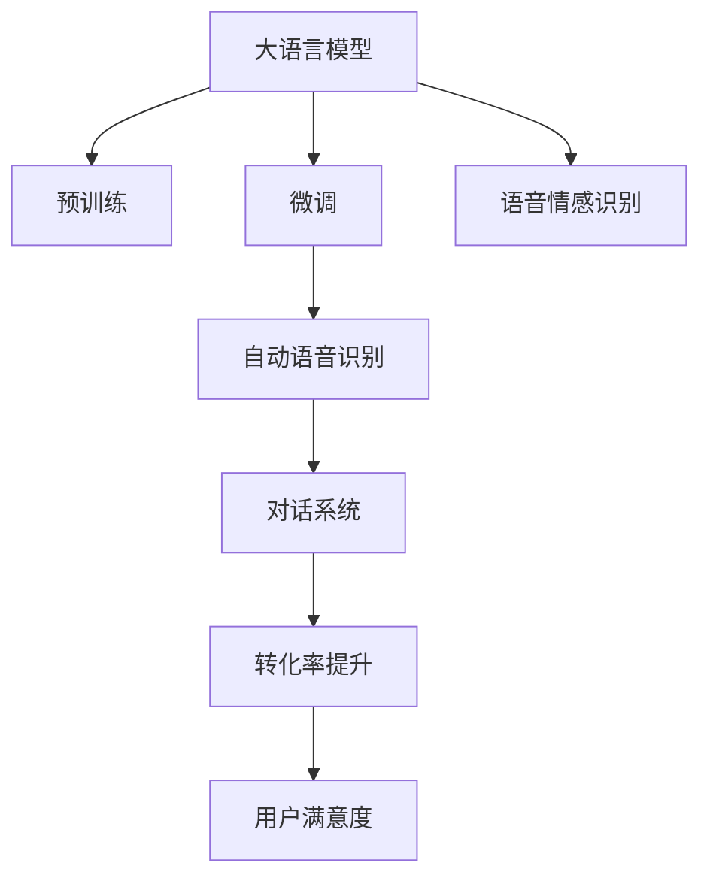
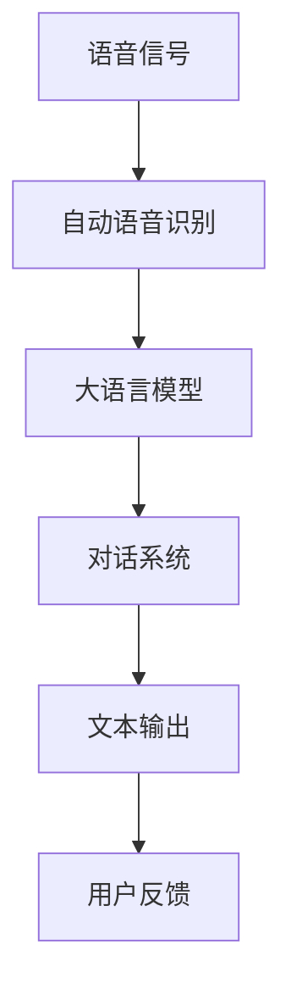
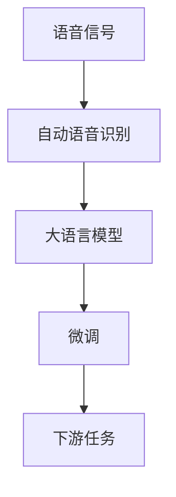
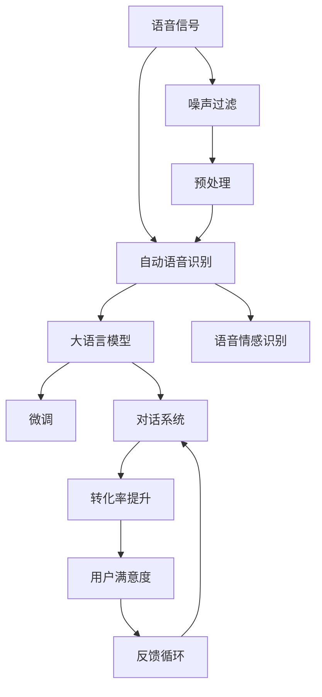

                 

# 大模型问答机器人如何实现语音交互

> 关键词：大语言模型,语音交互,自然语言处理(NLP),自动语音识别(ASR),对话系统,转化率提升,用户满意度

## 1. 背景介绍

### 1.1 问题由来
语音交互作为一种人机交互方式，因其自然、直观、高效的特点，正成为智能化应用的重要方向。尤其对于问答机器人，语音交互能够极大提升用户体验和系统效率。传统的语音交互系统主要基于规则引擎，难以处理复杂多变的用户表达。近年来，大语言模型在自然语言处理(NLP)领域的突破，为语音交互技术带来了新的机遇。

语音交互的核心挑战在于如何高效、准确地理解用户的语音指令，并将其转化为文本形式输入到NLP模型中进行处理。传统的语音识别系统主要依赖于手工特征提取和机器学习算法，需要大量标注数据和复杂的模型调参。大模型时代下，采用预训练语言模型和微调技术，可以显著提升语音交互系统的性能，降低开发成本，加速产品迭代。

### 1.2 问题核心关键点
本节将阐述大模型在语音交互系统中的关键应用，包括预训练语言模型、微调方法、语音识别技术、对话系统等。通过这些技术的有机结合，可以实现高效、流畅的语音交互体验。

1. **预训练语言模型**：如GPT-3、BERT等，通过大规模无标签文本数据预训练，学习通用的语言表示，具备强大的语言理解和生成能力。
2. **微调方法**：通过下游任务的少量标注数据，对预训练模型进行有监督学习，适应特定任务的需求。
3. **语音识别技术**：将语音信号转化为文本形式的技术，包括自动语音识别(ASR)和语音情感识别。
4. **对话系统**：基于NLP技术的对话生成和理解系统，能够自然流畅地与用户进行交互。

## 2. 核心概念与联系

### 2.1 核心概念概述

为更好地理解大模型在语音交互系统中的应用，本节将介绍几个密切相关的核心概念：

- **大语言模型(Large Language Model, LLM)**：以自回归(如GPT)或自编码(如BERT)模型为代表的大规模预训练语言模型。通过在大规模无标签文本语料上进行预训练，学习通用的语言表示，具备强大的语言理解和生成能力。

- **预训练(Pre-training)**：指在大规模无标签文本语料上，通过自监督学习任务训练通用语言模型的过程。常见的预训练任务包括言语建模、遮挡语言模型等。

- **微调(Fine-tuning)**：指在预训练模型的基础上，使用下游任务的少量标注数据，通过有监督学习优化模型在特定任务上的性能。通常只需要调整顶层分类器或解码器，并以较小的学习率更新全部或部分的模型参数。

- **自动语音识别(ASR)**：将语音信号转化为文本形式的技术，通常包括特征提取、声学模型、语言模型等组件。

- **对话系统(Chatbot)**：基于NLP技术的对话生成和理解系统，能够自然流畅地与用户进行交互。

- **转化率提升(Conversion Rate Improvement)**：通过优化系统设计和用户交互体验，提高用户完成任务的成功率。

- **用户满意度(User Satisfaction)**：评估用户对系统交互体验的感受，包括流畅度、准确性、响应速度等。

这些核心概念之间的逻辑关系可以通过以下Mermaid流程图来展示：



这个流程图展示了大模型在语音交互系统中的应用流程：

1. 大语言模型通过预训练获得基础能力。
2. 微调使其适应下游任务的特定需求。
3. 语音识别技术将用户语音转化为文本形式。
4. 对话系统基于文本生成理解和响应。
5. 转化率提升优化系统交互流程。
6. 用户满意度评估用户体验，反馈优化。

### 2.2 概念间的关系

这些核心概念之间存在着紧密的联系，形成了语音交互系统的完整生态系统。下面我们通过几个Mermaid流程图来展示这些概念之间的关系。

#### 2.2.1 语音交互系统的整体架构



这个流程图展示了语音交互系统的整体架构：

1. 用户通过麦克风输入语音信号。
2. 自动语音识别将语音信号转化为文本形式。
3. 大语言模型基于文本进行理解和生成。
4. 对话系统生成响应文本。
5. 文本输出系统将响应文本转化为语音形式。
6. 用户通过扬声器收听响应。

#### 2.2.2 语音交互与微调的关系


这个流程图展示了语音交互与微调的关系：

1. 语音交互系统中的预训练模型通过下游任务的少量标注数据进行微调。
2. 微调后的模型能够更好地适应特定任务的语音交互需求。
3. 系统通过优化交互流程，提升用户满意度。

#### 2.2.3 语音识别与微调的关系



这个流程图展示了语音识别与微调的关系：

1. 语音识别系统将语音信号转化为文本形式。
2. 大语言模型对文本进行理解和生成。
3. 微调后的模型能够更好地适应语音识别任务。
4. 系统通过优化识别算法，提升准确率和鲁棒性。

### 2.3 核心概念的整体架构

最后，我们用一个综合的流程图来展示这些核心概念在大模型语音交互系统中的整体架构：



这个综合流程图展示了从语音输入到系统响应的完整流程：

1. 用户通过麦克风输入语音信号。
2. 自动语音识别系统将语音信号转化为文本形式。
3. 语音情感识别技术判断用户情绪，调整系统响应策略。
4. 大语言模型对文本进行理解和生成。
5. 微调后的模型更好地适应特定任务的需求。
6. 对话系统生成响应文本。
7. 文本输出系统将响应文本转化为语音形式。
8. 用户通过扬声器收听响应。
9. 系统通过用户反馈，优化交互流程，提升用户满意度。

通过这些流程图，我们可以更清晰地理解大模型在语音交互系统中的应用流程，为后续深入讨论具体的技术细节奠定基础。

## 3. 核心算法原理 & 具体操作步骤

### 3.1 算法原理概述

基于大模型的语音交互系统，本质上是一个预训练-微调框架。其核心思想是：

1. **预训练**：在大规模无标签语音语料上进行自监督学习，训练通用的语言模型。
2. **微调**：在预训练模型的基础上，使用下游任务的少量标注语音数据，通过有监督学习优化模型在特定语音交互任务上的性能。
3. **语音识别**：将语音信号转化为文本形式，利用大模型的语义理解能力，提高识别准确率和鲁棒性。
4. **对话系统**：基于NLP技术的对话生成和理解系统，能够自然流畅地与用户进行交互。

### 3.2 算法步骤详解

#### 3.2.1 预训练步骤

大模型的预训练主要采用自监督学习任务，如语言建模、掩码语言建模等。以下是预训练步骤的详细描述：

1. **语料准备**：收集大规模无标签语音数据，如LibriSpeech、CommonVoice等，进行预处理和分帧操作。
2. **特征提取**：将语音信号转换为MFCC特征或梅尔倒谱特征等。
3. **模型训练**：使用Transformer等模型结构，在大规模无标签语音数据上训练预训练语言模型。常见模型包括GPT、BERT、RoBERTa等。
4. **预训练任务**：在预训练过程中，通过自监督学习任务训练模型，如预测掩码位置、语言模型预测等。

#### 3.2.2 微调步骤

语音交互系统的微调主要基于预训练语言模型，使用下游任务的少量标注数据，通过有监督学习优化模型性能。以下是微调步骤的详细描述：

1. **数据准备**：收集下游任务的少量标注数据，如问答对、对话录等，进行预处理和分帧操作。
2. **模型选择**：选择合适的预训练语言模型，如GPT-3、BERT等。
3. **任务适配**：根据下游任务类型，设计适当的输出层和损失函数。如对话系统可以使用双向Transformer模型，预测上下文相关性。
4. **微调训练**：使用下游任务的少量标注数据，训练微调后的语言模型。通常采用较小的学习率，避免破坏预训练权重。
5. **评估测试**：在测试数据上评估微调后的模型性能，调整模型参数，优化系统表现。

#### 3.2.3 语音识别步骤

语音识别是语音交互系统的核心环节，主要包括以下步骤：

1. **语音输入**：用户通过麦克风输入语音信号。
2. **特征提取**：将语音信号转换为MFCC特征或梅尔倒谱特征等。
3. **声学模型训练**：使用深度神经网络模型，如卷积神经网络(CNN)、循环神经网络(RNN)等，训练声学模型。
4. **语言模型训练**：使用大语言模型，如GPT-3、BERT等，训练语言模型。
5. **语音识别**：将语音信号输入声学模型，生成特征向量，再输入到语言模型进行解码，得到文本输出。

#### 3.2.4 对话系统步骤

对话系统是语音交互系统的关键组件，主要包括以下步骤：

1. **意图理解**：使用大语言模型，如GPT-3、BERT等，对用户输入进行意图理解，判断用户意图。
2. **上下文记忆**：使用RNN、LSTM等模型，记录和维护对话上下文信息。
3. **对话生成**：使用大语言模型，如GPT-3、BERT等，根据上下文生成响应文本。
4. **情感分析**：使用大语言模型，如GPT-3、BERT等，判断用户情绪，调整系统响应策略。
5. **输出响应**：将响应文本通过TTS系统转换为语音输出。

### 3.3 算法优缺点

基于大模型的语音交互系统具有以下优点：

1. **高效性**：大模型具备强大的语言理解和生成能力，能够快速处理复杂的语音交互任务。
2. **通用性**：预训练语言模型在通用领域表现优异，微调后能适应多种下游任务，如问答、对话等。
3. **鲁棒性**：大模型经过大规模数据预训练，具备较强的泛化能力和鲁棒性。
4. **易用性**：使用大模型进行微调，不需要手工特征提取和复杂模型调参，降低了系统开发门槛。

同时，大模型语音交互系统也存在以下缺点：

1. **数据依赖**：微调效果依赖于下游任务的标注数据，标注数据不足可能影响系统性能。
2. **计算资源**：大模型预训练和微调需要大量计算资源，增加了系统开发和部署成本。
3. **可解释性**：大模型的决策过程缺乏可解释性，难以理解其内部工作机制和推理逻辑。
4. **伦理风险**：大模型可能学习到有害信息，影响用户交互体验和系统安全性。

尽管存在这些缺点，但总体而言，基于大模型的语音交互系统在性能和效果方面具有显著优势，值得在实际应用中进行探索和优化。

### 3.4 算法应用领域

大语言模型在语音交互系统中的应用领域非常广泛，涵盖了各种语音交互场景，例如：

- **客服中心**：构建智能客服系统，实现自然语言理解与响应，提升客服效率和客户满意度。
- **医疗咨询**：开发智能医疗咨询系统，提供医学问答、健康建议等服务，辅助医生诊疗。
- **教育培训**：构建智能教育系统，进行学生问答、作业批改等任务，提高教学效率。
- **金融咨询**：开发智能金融咨询系统，提供金融问答、理财建议等服务，辅助用户理财。
- **旅游服务**：构建智能旅游系统，提供旅游问答、景点推荐等服务，提升旅游体验。
- **家居控制**：开发智能家居系统，进行语音控制、环境监控等服务，提升生活便利性。

除了上述这些应用领域外，大语言模型在语音交互系统的探索和应用还在不断拓展，未来将有更多的创新和突破。

## 4. 数学模型和公式 & 详细讲解 & 举例说明

### 4.1 数学模型构建

本节将使用数学语言对基于大模型的语音交互系统的核心算法进行严格刻画。

记语音信号为 $x_t$，语音特征向量为 $x_t \in \mathbb{R}^d$，文本输出为 $y_t$。大模型的预训练和微调过程可以描述为：

$$
M_{\theta}(x_t) = y_t
$$

其中 $M_{\theta}$ 为预训练或微调后的语言模型，$\theta$ 为模型参数。

在语音识别过程中，将语音信号转化为文本输出的过程可以描述为：

$$
T_{\phi}(x_t) = y_t
$$

其中 $T_{\phi}$ 为自动语音识别系统，$\phi$ 为系统参数。

在对话系统中，根据用户输入 $x_t$ 生成响应文本 $y_t$ 的过程可以描述为：

$$
D_{\psi}(x_t) = y_t
$$

其中 $D_{\psi}$ 为对话系统，$\psi$ 为系统参数。

### 4.2 公式推导过程

以下是基于大模型的语音交互系统的核心公式推导过程。

#### 4.2.1 预训练语言模型的推导

预训练语言模型的训练过程可以描述为：

$$
\min_{\theta} \mathcal{L}(\theta) = -\frac{1}{N} \sum_{t=1}^N \log P(y_t|x_t)
$$

其中 $N$ 为数据集大小，$P(y_t|x_t)$ 为语言模型的概率分布。

具体推导过程如下：

1. **自监督学习任务**：在预训练过程中，通常采用掩码语言建模等自监督任务。假设在输入文本 $x_t$ 中，随机掩码 $k$ 个位置，训练模型预测掩码位置的语义信息，目标函数可以描述为：

$$
\min_{\theta} \mathcal{L}(\theta) = -\frac{1}{N} \sum_{t=1}^N \log P(y_t|x_t)
$$

其中 $P(y_t|x_t)$ 为语言模型的概率分布。

2. **训练过程**：使用梯度下降等优化算法，最小化目标函数，更新模型参数 $\theta$，使模型学习到通用语言表示。

#### 4.2.2 自动语音识别的推导

自动语音识别的训练过程可以描述为：

$$
\min_{\phi} \mathcal{L}(\phi) = \frac{1}{N} \sum_{t=1}^N \log P(y_t|x_t)
$$

其中 $P(y_t|x_t)$ 为自动语音识别系统的概率分布。

具体推导过程如下：

1. **特征提取**：将语音信号 $x_t$ 转化为MFCC特征向量 $x_t \in \mathbb{R}^d$。
2. **声学模型训练**：使用深度神经网络模型，如卷积神经网络(CNN)、循环神经网络(RNN)等，训练声学模型，目标函数可以描述为：

$$
\min_{\phi} \mathcal{L}(\phi) = \frac{1}{N} \sum_{t=1}^N \log P(y_t|x_t)
$$

其中 $P(y_t|x_t)$ 为声学模型的概率分布。

3. **语言模型训练**：使用大语言模型，如GPT-3、BERT等，训练语言模型，目标函数可以描述为：

$$
\min_{\phi} \mathcal{L}(\phi) = \frac{1}{N} \sum_{t=1}^N \log P(y_t|x_t)
$$

其中 $P(y_t|x_t)$ 为语言模型的概率分布。

#### 4.2.3 对话系统的推导

对话系统的训练过程可以描述为：

$$
\min_{\psi} \mathcal{L}(\psi) = \frac{1}{N} \sum_{t=1}^N \log P(y_t|x_t)
$$

其中 $P(y_t|x_t)$ 为对话系统的概率分布。

具体推导过程如下：

1. **意图理解**：使用大语言模型，如GPT-3、BERT等，对用户输入进行意图理解，判断用户意图，目标函数可以描述为：

$$
\min_{\psi} \mathcal{L}(\psi) = \frac{1}{N} \sum_{t=1}^N \log P(y_t|x_t)
$$

其中 $P(y_t|x_t)$ 为对话系统的概率分布。

2. **上下文记忆**：使用RNN、LSTM等模型，记录和维护对话上下文信息，目标函数可以描述为：

$$
\min_{\psi} \mathcal{L}(\psi) = \frac{1}{N} \sum_{t=1}^N \log P(y_t|x_t)
$$

其中 $P(y_t|x_t)$ 为对话系统的概率分布。

3. **对话生成**：使用大语言模型，如GPT-3、BERT等，根据上下文生成响应文本，目标函数可以描述为：

$$
\min_{\psi} \mathcal{L}(\psi) = \frac{1}{N} \sum_{t=1}^N \log P(y_t|x_t)
$$

其中 $P(y_t|x_t)$ 为对话系统的概率分布。

### 4.3 案例分析与讲解

#### 4.3.1 案例分析

假设我们希望构建一个智能客服系统，用户可以通过语音输入问题，系统能够自动生成并播放回答。以下是对该系统进行预训练、微调和部署的案例分析。

1. **预训练**：
   - 收集大规模无标签语音数据，如LibriSpeech、CommonVoice等。
   - 将语音信号转化为MFCC特征向量，输入到Transformer模型中训练，使用掩码语言建模等自监督任务。
   - 预训练过程中，使用大语言模型，如GPT-3、BERT等，对语音特征向量进行理解和生成。

2. **微调**：
   - 收集客服系统的高频问题及其对应答案，构建下游任务的数据集。
   - 选择合适的预训练语言模型，如GPT-3、BERT等。
   - 在预训练模型的基础上，使用下游任务的少量标注数据进行微调，优化模型在客服场景中的表现。
   - 设计适当的输出层和损失函数，如分类交叉熵损失函数，训练微调后的语言模型。

3. **部署**：
   - 使用自动语音识别系统，如DeepSpeech，将用户语音转化为MFCC特征向量。
   - 将MFCC特征向量输入到微调后的语言模型中，生成回答文本。
   - 使用对话系统，如Dialogpt，将回答文本转化为语音输出，回复用户。

#### 4.3.2 详细讲解

通过上述案例分析，可以看出，基于大模型的语音交互系统主要包括以下几个步骤：

1. **数据准备**：收集大规模无标签语音数据，进行预处理和分帧操作，构建下游任务的数据集。
2. **预训练模型选择**：选择合适的预训练语言模型，如GPT-3、BERT等。
3. **微调模型训练**：使用下游任务的少量标注数据，训练微调后的语言模型，优化模型在特定任务上的性能。
4. **语音识别系统搭建**：使用深度神经网络模型，如卷积神经网络(CNN)、循环神经网络(RNN)等，训练声学模型和语言模型，将语音信号转化为MFCC特征向量。
5. **对话系统搭建**：使用大语言模型，如GPT-3、BERT等，进行意图理解、上下文记忆和对话生成，构建对话系统。
6. **系统集成**：将预训练模型、微调模型、自动语音识别系统、对话系统等集成部署，实现语音交互系统。

## 5. 项目实践：代码实例和详细解释说明

### 5.1 开发环境搭建

在进行语音交互系统开发前，我们需要准备好开发环境。以下是使用Python进行PyTorch开发的环境配置流程：

1. 安装Anaconda：从官网下载并安装Anaconda，用于创建独立的Python环境。

2. 创建并激活虚拟环境：
```bash
conda create -n pytorch-env python=3.8 
conda activate pytorch-env
```

3. 安装PyTorch：根据CUDA版本，从官网获取对应的安装命令。例如：
```bash
conda install pytorch torchvision torchaudio cudatoolkit=11.1 -c pytorch -c conda-forge
```

4. 安装Transformers库：
```bash
pip install transformers
```

5. 安装各类工具包：
```bash
pip install numpy pandas scikit-learn matplotlib tqdm jupyter notebook ipython
```

完成上述步骤后，即可在`pytorch-env`环境中开始语音交互系统的开发。

### 5.2 源代码详细实现

下面我们以智能客服系统为例，给出使用Transformers库对BERT模型进行语音交互的PyTorch代码实现。

首先，定义语音交互系统的数据处理函数：

```python
from transformers import BertTokenizer
from torch.utils.data import Dataset
import torch

class CustomerDataset(Dataset):
    def __init__(self, questions, answers, tokenizer, max_len=128):
        self.questions = questions
        self.answers = answers
        self.tokenizer = tokenizer
        self.max_len = max_len
        
    def __len__(self):
        return len(self.questions)
    
    def __getitem__(self, item):
        question = self.questions[item]
        answer = self.answers[item]
        
        encoding = self.tokenizer(question, return_tensors='pt', max_length=self.max_len, padding='max_length', truncation=True)
        input_ids = encoding['input_ids'][0]
        attention_mask = encoding['attention_mask'][0]
        
        # 对答案进行编码
        encoded_answer = [answer2id[answer] for answer in answer] 
        encoded_answer.extend([answer2id['PAD']] * (self.max_len - len(encoded_answer)))
        labels = torch.tensor(encoded_answer, dtype=torch.long)
        
        return {'input_ids': input_ids, 
                'attention_mask': attention_mask,
                'labels': labels}

# 标签与id的映射
answer2id = {'PAD': 0, 'ANSWER': 1, 'ANSWER_B': 2, 'ANSWER_C': 3, 'ANSWER_D': 4, 'ANSWER_E': 5}
id2answer = {v: k for k, v in answer2id.items()}

# 创建dataset
tokenizer = BertTokenizer.from_pretrained('bert-base-cased')

train_dataset = CustomerDataset(train_questions, train_answers, tokenizer)
dev_dataset = CustomerDataset(dev_questions, dev_answers, tokenizer)
test_dataset = CustomerDataset(test_questions, test_answers, tokenizer)
```

然后，定义模型和优化器：

```python
from transformers import BertForTokenClassification, AdamW

model = BertForTokenClassification.from_pretrained('bert-base-cased', num_labels=len(answer2id))

optimizer = AdamW(model.parameters(), lr=2e-5)
```

接着，定义训练和评估函数：

```python
from torch.utils.data import DataLoader
from tqdm import tqdm
from sklearn.metrics import classification_report

device = torch.device('cuda') if torch.cuda.is_available() else torch.device('cpu')
model.to(device)

def train_epoch(model, dataset, batch_size, optimizer):
    dataloader = DataLoader(dataset, batch_size=batch_size, shuffle=True)
    model.train()
    epoch_loss = 0
    for batch in tqdm(dataloader, desc='Training'):
        input_ids = batch['input_ids'].to(device)
        attention_mask = batch['attention_mask'].to(device)
        labels = batch['labels'].to(device)
        model.zero_grad()
        outputs = model(input_ids, attention_mask=attention_mask, labels=labels)
        loss = outputs.loss
        epoch_loss += loss.item()
        loss.backward()
        optimizer.step()
    return epoch_loss / len(dataloader)

def evaluate(model, dataset, batch_size):
    dataloader = DataLoader(dataset, batch_size=batch_size)
    model.eval()
    preds, labels = [], []
    with torch.no_grad

