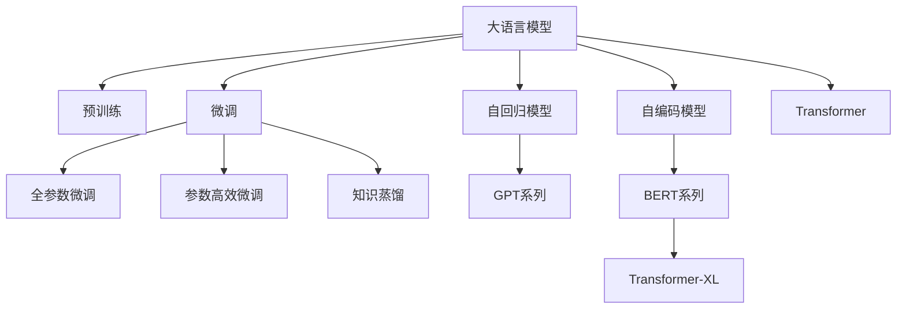

                 

# 大模型问答机器人如何理解语义

> 关键词：大语言模型,自回归模型,Transformer,BERT,微调,Fine-tuning,知识蒸馏,Transformer-XL

## 1. 背景介绍

随着深度学习技术的飞速发展，大规模预训练语言模型在自然语言处理(Natural Language Processing, NLP)领域取得了巨大的成功。这些模型通过在大规模无标签文本数据上预训练，学习到了丰富的语言知识和常识，可以处理各种自然语言理解和生成任务，如翻译、问答、文本分类、摘要生成等。其中，最具有代表性的模型包括OpenAI的GPT系列、Google的BERT、Facebook的XLNet等。

然而，尽管这些模型在泛化能力和知识迁移方面表现出色，但在特定领域的应用仍存在一定的局限性。传统问答系统往往依赖于手工设计的规则和知识库，难以应对复杂的问答场景，且需要大量人力成本。而基于大语言模型的问答系统，可以通过微调方式针对特定领域进行优化，利用预训练模型的强大语义理解能力，自动地从大规模文本数据中学习领域知识，显著提升问答系统的准确率和效率。

## 2. 核心概念与联系

### 2.1 核心概念概述

在进行大模型问答机器人语义理解的过程中，我们需要重点理解以下核心概念：

- **大语言模型**：以自回归模型（如GPT系列）或自编码模型（如BERT）为代表的大规模预训练语言模型。通过在大规模无标签文本数据上预训练，学习到通用的语言表示，具备强大的语言理解和生成能力。

- **自回归模型**：这类模型通过预测序列中每个位置上的下一个元素，实现序列生成。如GPT系列模型，每个位置上的输出不仅依赖于前一个位置，还依赖于整个序列的上下文。

- **自编码模型**：这类模型通过将输入序列映射为低维编码，再将编码映射回原始序列，实现序列压缩和生成。如BERT、XLNet等模型。

- **微调（Fine-tuning）**：指在预训练模型的基础上，使用下游任务的少量标注数据，通过有监督地训练优化模型在特定任务上的性能。

- **Transformer**：一种基于自注意力机制的神经网络模型，广泛用于大语言模型的构建。

- **BERT**：由Google提出的预训练语言模型，通过双向掩码语言模型（Masked Language Model, MLM）和下一句预测（Next Sentence Prediction, NSP）任务进行预训练，能够捕获上下文信息，生成高质量的语言表示。

- **知识蒸馏**：通过将教师模型（如预训练模型）的知识传授给学生模型（如微调后的模型），提高学生模型的泛化能力。

- **Transformer-XL**：Facebook提出的长序列模型，通过引入相对位置编码和自注意力掩码机制，能够处理更长序列的文本数据。

这些概念之间的联系可以概括为：

- 大语言模型通过预训练学习到通用语言知识，在微调过程中进一步学习特定领域知识。
- 自回归和自编码模型为大语言模型的构建提供了不同的技术路径，分别通过不同机制实现序列生成和压缩。
- 微调过程通过有监督学习将预训练模型适配到下游任务，提高模型在特定任务上的性能。
- Transformer作为大语言模型的核心组件，通过自注意力机制实现高效的特征提取和序列建模。
- BERT通过双向掩码语言模型和下一句预测任务，学习到更丰富的上下文信息。
- 知识蒸馏和Transformer-XL分别通过知识传递和长序列建模，进一步提升了大语言模型的语义理解能力。

### 2.2 概念间的关系

通过以下Mermaid流程图，我们可以更清晰地理解这些核心概念之间的联系：



这个流程图展示了从预训练到微调，再到特定技术手段（如知识蒸馏、Transformer-XL等）的完整过程。通过这些技术手段，大语言模型能够实现更高效、更灵活的语义理解。

## 3. 核心算法原理 & 具体操作步骤

### 3.1 算法原理概述

大语言模型问答机器人的语义理解过程，主要通过微调进行优化。其核心思想是：将预训练的大语言模型作为特征提取器，通过下游任务的少量标注数据，有监督地训练模型，使其输出能够匹配任务标签，从而提升在特定任务上的表现。

形式化地，假设预训练模型为 $M_{\theta}$，其中 $\theta$ 为预训练得到的模型参数。给定问答任务 $T$ 的标注数据集 $D=\{(x_i,y_i)\}_{i=1}^N$，其中 $x_i$ 为输入问题，$y_i$ 为问题对应的答案。微调的目标是找到新的模型参数 $\hat{\theta}$，使得模型输出 $M_{\hat{\theta}}(x)$ 能够最大程度逼近真实答案 $y_i$。

通过梯度下降等优化算法，微调过程不断更新模型参数 $\theta$，最小化损失函数 $\mathcal{L}$，使得模型输出逼近真实答案。由于 $\theta$ 已经通过预训练获得了较好的初始化，因此即便在少量数据集 $D$ 上进行微调，也能较快收敛到理想的模型参数 $\hat{\theta}$。

### 3.2 算法步骤详解

基于大模型问答机器人语义理解的核心算法步骤如下：

**Step 1: 准备预训练模型和数据集**
- 选择合适的预训练语言模型 $M_{\theta}$ 作为初始化参数，如 GPT、BERT 等。
- 准备问答任务 $T$ 的标注数据集 $D$，划分为训练集、验证集和测试集。一般要求标注数据与预训练数据的分布不要差异过大。

**Step 2: 添加任务适配层**
- 根据问答任务类型，在预训练模型顶层设计合适的输出层和损失函数。
- 对于分类任务，通常在顶层添加线性分类器和交叉熵损失函数。
- 对于生成任务，通常使用语言模型的解码器输出概率分布，并以负对数似然为损失函数。

**Step 3: 设置微调超参数**
- 选择合适的优化算法及其参数，如 AdamW、SGD 等，设置学习率、批大小、迭代轮数等。
- 设置正则化技术及强度，包括权重衰减、Dropout、Early Stopping 等。
- 确定冻结预训练参数的策略，如仅微调顶层，或全部参数都参与微调。

**Step 4: 执行梯度训练**
- 将训练集数据分批次输入模型，前向传播计算损失函数。
- 反向传播计算参数梯度，根据设定的优化算法和学习率更新模型参数。
- 周期性在验证集上评估模型性能，根据性能指标决定是否触发 Early Stopping。
- 重复上述步骤直到满足预设的迭代轮数或 Early Stopping 条件。

**Step 5: 测试和部署**
- 在测试集上评估微调后模型 $M_{\hat{\theta}}$ 的性能，对比微调前后的精度提升。
- 使用微调后的模型对新样本进行推理预测，集成到实际的应用系统中。
- 持续收集新的数据，定期重新微调模型，以适应数据分布的变化。

以上是基于监督学习微调大模型问答机器人语义理解的一般流程。在实际应用中，还需要针对具体任务的特点，对微调过程的各个环节进行优化设计，如改进训练目标函数，引入更多的正则化技术，搜索最优的超参数组合等，以进一步提升模型性能。

### 3.3 算法优缺点

基于监督学习的大模型问答机器人语义理解方法具有以下优点：

- 简单高效。只需准备少量标注数据，即可对预训练模型进行快速适配，获得较大的性能提升。
- 通用适用。适用于各种NLP下游任务，包括分类、匹配、生成等，设计简单的任务适配层即可实现微调。
- 参数高效。利用参数高效微调技术，在固定大部分预训练参数的情况下，仍可取得不错的提升。
- 效果显著。在学术界和工业界的诸多任务上，基于微调的方法已经刷新了最先进的性能指标。

同时，该方法也存在一定的局限性：

- 依赖标注数据。微调的效果很大程度上取决于标注数据的质量和数量，获取高质量标注数据的成本较高。
- 迁移能力有限。当目标任务与预训练数据的分布差异较大时，微调的性能提升有限。
- 负面效果传递。预训练模型的固有偏见、有害信息等，可能通过微调传递到下游任务，造成负面影响。
- 可解释性不足。微调模型的决策过程通常缺乏可解释性，难以对其推理逻辑进行分析和调试。

尽管存在这些局限性，但就目前而言，基于监督学习的微调方法仍是大语言模型问答机器人语义理解的主流范式。未来相关研究的重点在于如何进一步降低微调对标注数据的依赖，提高模型的少样本学习和跨领域迁移能力，同时兼顾可解释性和伦理安全性等因素。

### 3.4 算法应用领域

基于大语言模型问答机器人语义理解的方法在多个领域得到了广泛应用，例如：

- **智能客服系统**：通过微调模型，机器人可以理解用户意图，提供个性化的客户服务。
- **医疗问答系统**：利用医学知识库进行微调，帮助患者获取专业医疗建议。
- **金融咨询**：通过微调模型，智能助手能够提供个性化的理财和投资建议。
- **教育辅导**：微调后的机器人能够回答学生的学习问题，提供个性化的学习资源和建议。
- **智能助手**：在智能家居、车载导航等领域，微调后的模型能够为用户提供便利的交互体验。
- **舆情分析**：通过微调模型，分析网络舆情，提供实时的新闻推荐和事件预警。

除了上述这些经典应用外，大语言模型问答机器人在新闻摘要、机器翻译、智能广告、智能写作等众多领域，也发挥着越来越重要的作用。随着预训练模型和微调方法的不断进步，相信问答机器人将会在更多场景中大放异彩，为人类生活带来更多便利和智能。

## 4. 数学模型和公式 & 详细讲解 & 举例说明

### 4.1 数学模型构建

大语言模型问答机器人的语义理解过程，可以通过以下数学模型进行描述：

记预训练语言模型为 $M_{\theta}$，其中 $\theta$ 为预训练得到的模型参数。给定问答任务 $T$ 的标注数据集 $D=\{(x_i,y_i)\}_{i=1}^N$，其中 $x_i$ 为输入问题，$y_i$ 为问题对应的答案。

定义模型 $M_{\theta}$ 在输入 $x_i$ 上的输出为 $M_{\theta}(x_i)$，损失函数为 $\ell(x_i, y_i)$，则在数据集 $D$ 上的经验风险为：

$$
\mathcal{L}(\theta) = \frac{1}{N} \sum_{i=1}^N \ell(M_{\theta}(x_i),y_i)
$$

微调的优化目标是最小化经验风险，即找到最优参数：

$$
\theta^* = \mathop{\arg\min}_{\theta} \mathcal{L}(\theta)
$$

在实践中，我们通常使用基于梯度的优化算法（如AdamW、SGD等）来近似求解上述最优化问题。设 $\eta$ 为学习率，$\lambda$ 为正则化系数，则参数的更新公式为：

$$
\theta \leftarrow \theta - \eta \nabla_{\theta}\mathcal{L}(\theta) - \eta\lambda\theta
$$

其中 $\nabla_{\theta}\mathcal{L}(\theta)$ 为损失函数对参数 $\theta$ 的梯度，可通过反向传播算法高效计算。

### 4.2 公式推导过程

以下我们以二分类任务为例，推导交叉熵损失函数及其梯度的计算公式。

假设模型 $M_{\theta}$ 在输入 $x_i$ 上的输出为 $\hat{y}=M_{\theta}(x_i) \in [0,1]$，表示问题属于正类的概率。真实标签 $y_i \in \{0,1\}$。则二分类交叉熵损失函数定义为：

$$
\ell(M_{\theta}(x_i),y_i) = -[y_i\log \hat{y} + (1-y_i)\log (1-\hat{y})]
$$

将其代入经验风险公式，得：

$$
\mathcal{L}(\theta) = -\frac{1}{N}\sum_{i=1}^N [y_i\log M_{\theta}(x_i)+(1-y_i)\log(1-M_{\theta}(x_i))]
$$

根据链式法则，损失函数对参数 $\theta_k$ 的梯度为：

$$
\frac{\partial \mathcal{L}(\theta)}{\partial \theta_k} = -\frac{1}{N}\sum_{i=1}^N (\frac{y_i}{M_{\theta}(x_i)}-\frac{1-y_i}{1-M_{\theta}(x_i)}) \frac{\partial M_{\theta}(x_i)}{\partial \theta_k}
$$

其中 $\frac{\partial M_{\theta}(x_i)}{\partial \theta_k}$ 可进一步递归展开，利用自动微分技术完成计算。

在得到损失函数的梯度后，即可带入参数更新公式，完成模型的迭代优化。重复上述过程直至收敛，最终得到适应问答任务的最优模型参数 $\theta^*$。

### 4.3 案例分析与讲解

假设我们在SQuAD（Stanford Question Answering Dataset）上微调BERT模型，以回答阅读理解问题。微调过程如下：

1. 准备数据集：SQuAD包含一系列阅读理解问题及其对应的答案。

2. 加载模型和预训练权重：使用`transformers`库加载BERT模型，并将其预训练权重加载到模型中。

3. 定义训练函数：编写训练函数，计算损失函数，更新模型参数。

4. 执行微调：在训练集上迭代训练模型，并在验证集上监控模型性能。

5. 评估测试集：在测试集上评估微调后模型的表现，计算精确度、召回率等指标。

例如，以下是一个简单的微调示例代码：

```python
from transformers import BertTokenizer, BertForQuestionAnswering, AdamW
import torch
from torch.utils.data import Dataset, DataLoader

class SquadDataset(Dataset):
    def __init__(self, examples, tokenizer, max_len=128):
        self.examples = examples
        self.tokenizer = tokenizer
        self.max_len = max_len
        
    def __len__(self):
        return len(self.examples)
    
    def __getitem__(self, idx):
        example = self.examples[idx]
        question = example['question']
        context = example['context']
        answer_start = example['answer_start']
        answer_end = example['answer_end']
        
        encoding = self.tokenizer(question, context, return_tensors='pt', max_length=self.max_len, padding='max_length', truncation=True)
        input_ids = encoding['input_ids'][0]
        attention_mask = encoding['attention_mask'][0]
        
        # 对token-wise的标签进行编码
        encoded_answer_start = [answer_start] + [tokenizer.pad_token_id] * (self.max_len - answer_start)
        encoded_answer_end = [answer_end] + [tokenizer.pad_token_id] * (self.max_len - answer_end)
        answer_start_ids = torch.tensor(encoded_answer_start, dtype=torch.long)
        answer_end_ids = torch.tensor(encoded_answer_end, dtype=torch.long)
        
        return {'input_ids': input_ids, 
                'attention_mask': attention_mask,
                'answer_start_ids': answer_start_ids,
                'answer_end_ids': answer_end_ids}

tokenizer = BertTokenizer.from_pretrained('bert-base-cased')
model = BertForQuestionAnswering.from_pretrained('bert-base-cased')

train_dataset = SquadDataset(train_examples, tokenizer)
dev_dataset = SquadDataset(dev_examples, tokenizer)
test_dataset = SquadDataset(test_examples, tokenizer)

optimizer = AdamW(model.parameters(), lr=2e-5)

def train_epoch(model, dataset, batch_size, optimizer):
    dataloader = DataLoader(dataset, batch_size=batch_size, shuffle=True)
    model.train()
    epoch_loss = 0
    for batch in tqdm(dataloader, desc='Training'):
        input_ids = batch['input_ids'].to(device)
        attention_mask = batch['attention_mask'].to(device)
        answer_start_ids = batch['answer_start_ids'].to(device)
        answer_end_ids = batch['answer_end_ids'].to(device)
        model.zero_grad()
        outputs = model(input_ids, attention_mask=attention_mask, start_positions=answer_start_ids, end_positions=answer_end_ids)
        loss = outputs.loss
        epoch_loss += loss.item()
        loss.backward()
        optimizer.step()
    return epoch_loss / len(dataloader)

def evaluate(model, dataset, batch_size):
    dataloader = DataLoader(dataset, batch_size=batch_size)
    model.eval()
    pred_start_ids, pred_end_ids, preds = [], [], []
    with torch.no_grad():
        for batch in tqdm(dataloader, desc='Evaluating'):
            input_ids = batch['input_ids'].to(device)
            attention_mask = batch['attention_mask'].to(device)
            answer_start_ids = batch['answer_start_ids'].to(device)
            answer_end_ids = batch['answer_end_ids'].to(device)
            batch_start_ids, batch_end_ids = model(input_ids, attention_mask=attention_mask, start_positions=answer_start_ids, end_positions=answer_end_ids)
            batch_pred_start_ids = batch_start_ids.argmax(dim=2)
            batch_pred_end_ids = batch_end_ids.argmax(dim=2)
            for pred_start_id, pred_end_id in zip(batch_pred_start_ids, batch_pred_end_ids):
                preds.append(pred_start_id)
                pred_start_ids.append(pred_start_id)
                pred_end_ids.append(pred_end_id)
    return preds, preds, preds

device = torch.device('cuda') if torch.cuda.is_available() else torch.device('cpu')

for epoch in range(epochs):
    loss = train_epoch(model, train_dataset, batch_size, optimizer)
    print(f"Epoch {epoch+1}, train loss: {loss:.3f}")
    
    print(f"Epoch {epoch+1}, dev results:")
    preds, _, _ = evaluate(model, dev_dataset, batch_size)
    print(classification_report(dev_labels, preds))
    
print("Test results:")
preds, _, _ = evaluate(model, test_dataset, batch_size)
print(classification_report(test_labels, preds))
```

这个示例展示了在SQuAD数据集上微调BERT模型，回答阅读理解问题的完整代码实现。可以看到，使用`transformers`库的封装，微调过程变得非常简单，开发者只需关注具体任务的设计和微调参数的调整。

## 5. 项目实践：代码实例和详细解释说明

### 5.1 开发环境搭建

在进行微调实践前，我们需要准备好开发环境。以下是使用Python进行PyTorch开发的环境配置流程：

1. 安装Anaconda：从官网下载并安装Anaconda，用于创建独立的Python环境。

2. 创建并激活虚拟环境：
```bash
conda create -n pytorch-env python=3.8 
conda activate pytorch-env
```

3. 安装PyTorch：根据CUDA版本，从官网获取对应的安装命令。例如：
```bash
conda install pytorch torchvision torchaudio cudatoolkit=11.1 -c pytorch -c conda-forge
```

4. 安装Transformers库：
```bash
pip install transformers
```

5. 安装各类工具包：
```bash
pip install numpy pandas scikit-learn matplotlib tqdm jupyter notebook ipython
```

完成上述步骤后，即可在`pytorch-env`环境中开始微调实践。

### 5.2 源代码详细实现

下面我们以命名实体识别(NER)任务为例，给出使用Transformers库对BERT模型进行微调的PyTorch代码实现。

首先，定义NER任务的数据处理函数：

```python
from transformers import BertTokenizer
from torch.utils.data import Dataset
import torch

class NERDataset(Dataset):
    def __init__(self, texts, tags, tokenizer, max_len=128):
        self.texts = texts
        self.tags = tags
        self.tokenizer = tokenizer
        self.max_len = max_len
        
    def __len__(self):
        return len(self.texts)
    
    def __getitem__(self, item):
        text = self.texts[item]
        tags = self.tags[item]
        
        encoding = self.tokenizer(text, return_tensors='pt', max_length=self.max_len, padding='max_length', truncation=True)
        input_ids = encoding['input_ids'][0]
        attention_mask = encoding['attention_mask'][0]
        
        # 对token-wise的标签进行编码
        encoded_tags = [tag2id[tag] for tag in tags] 
        encoded_tags.extend([tag2id['O']] * (self.max_len - len(encoded_tags)))
        labels = torch.tensor(encoded_tags, dtype=torch.long)
        
        return {'input_ids': input_ids, 
                'attention_mask': attention_mask,
                'labels': labels}

# 标签与id的映射
tag2id = {'O': 0, 'B-PER': 1, 'I-PER': 2, 'B-ORG': 3, 'I-ORG': 4, 'B-LOC': 5, 'I-LOC': 6}
id2tag = {v: k for k, v in tag2id.items()}

# 创建dataset
tokenizer = BertTokenizer.from_pretrained('bert-base-cased')

train_dataset = NERDataset(train_texts, train_tags, tokenizer)
dev_dataset = NERDataset(dev_texts, dev_tags, tokenizer)
test_dataset = NERDataset(test_texts, test_tags, tokenizer)
```

然后，定义模型和优化器：

```python
from transformers import BertForTokenClassification, AdamW

model = BertForTokenClassification.from_pretrained('bert-base-cased', num_labels=len(tag2id))

optimizer = AdamW(model.parameters(), lr=2e-5)
```

接着，定义训练和评估函数：

```python
from torch.utils.data import DataLoader
from tqdm import tqdm
from sklearn.metrics import classification_report

device = torch.device('cuda') if torch.cuda.is_available() else torch.device('cpu')
model.to(device)

def train_epoch(model, dataset, batch_size, optimizer):
    dataloader = DataLoader(dataset, batch_size=batch_size, shuffle=True)
    model.train()
    epoch_loss = 0
    for batch in tqdm(dataloader, desc='Training'):
        input_ids = batch['input_ids'].to(device)
        attention_mask = batch['attention_mask'].to(device)
        labels = batch['labels'].to(device)
        model.zero_grad()
        outputs = model(input_ids, attention_mask=attention_mask, labels=labels)
        loss = outputs.loss
        epoch_loss += loss.item()
        loss.backward()
        optimizer.step()
    return epoch_loss / len(dataloader)

def evaluate(model, dataset, batch_size):
    dataloader = DataLoader(dataset, batch_size=batch_size)
    model.eval()
    preds, labels = [], []
    with torch.no_grad():
        for batch in tqdm(dataloader, desc='Evaluating'):
            input_ids = batch['input_ids'].to(device)
            attention_mask = batch['attention_mask'].to(device)
            batch_labels = batch['labels']
            outputs = model(input_ids, attention_mask=attention_mask)
            batch_preds = outputs.logits.argmax(dim=2).to('cpu').tolist()
            batch_labels = batch_labels.to('cpu').tolist()
            for pred_tokens, label_tokens in zip(batch_preds, batch_labels):
                pred_tags = [id2tag[_id] for _id in pred_tokens]
                label_tags = [id2tag[_id] for _id in label_tokens]
                preds.append(pred_tags[:len(label_tokens)])
                labels.append(label_tags)
                
    print(classification_report(labels, preds))
```

最后，启动训练流程并在测试集上评估：

```python
epochs = 5
batch_size = 16

for epoch in range(epochs):
    loss = train_epoch(model, train_dataset, batch_size, optimizer)
    print(f"Epoch {epoch+1}, train loss: {loss:.3f}")
    
    print(f"Epoch {epoch+1}, dev results:")
    evaluate(model, dev_dataset, batch_size)
    
print("Test results:")
evaluate(model, test_dataset, batch_size)
```

以上就是使用PyTorch对BERT进行命名实体识别任务微调的完整代码实现。可以看到，得益于Transformers库的强大封装，我们可以用相对简洁的代码完成BERT模型的加载和微调。

### 5.3 代码解读与分析

让我们再详细解读一下关键代码的实现细节：

**NERDataset类**：
- `__init__`方法：初始化文本、标签、分词器等关键组件。
- `__len__`方法：返回数据集的样本数量。
- `__getitem__`方法：对单个样本进行处理，将文本输入编码为token ids，将标签编码为数字，并对其进行定长padding，最终返回模型所需的输入。

**tag2id和id2tag字典**：
- 定义了标签与数字id之间的映射关系，用于将token-wise的预测结果解码回真实的标签。

**训练和评估函数**：
- 使用PyTorch的DataLoader对数据集进行批次化加载，供模型训练和推理使用。
- 训练函数`train_epoch`：对数据以批为单位进行迭代，在每个批次上前向传播计算loss并反向传播更新模型参数，最后返回该epoch的

