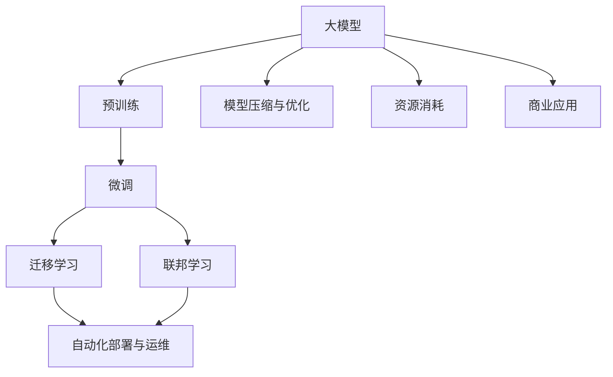
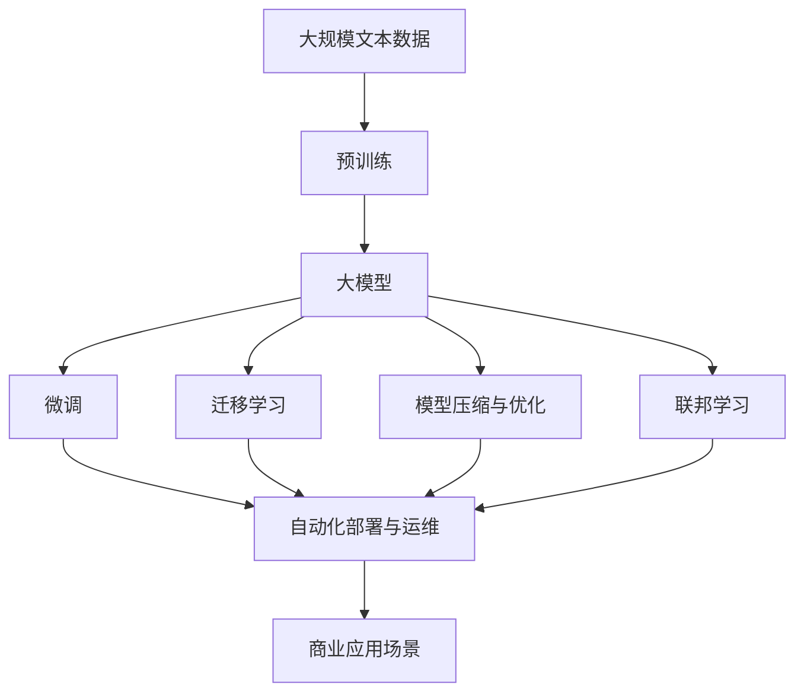

                 

# 大模型：从理论到实践的商业应用

> 关键词：大模型,理论,实践,商业应用,商业场景,商业价值,技术落地,创新,产业升级

## 1. 背景介绍

### 1.1 问题由来

近年来，随着深度学习技术的飞速发展，大模型（Large Models）在商业应用中取得了显著突破。大模型通常指的是含有数亿甚至数十亿参数的神经网络，如GPT-3、BERT等，它们通过在大规模无标签文本数据上进行预训练，学习到了丰富的语言知识和常识。然而，由于其参数量巨大，计算资源要求极高，使得大模型的实际应用面临诸多挑战。

### 1.2 问题核心关键点

目前，大模型在商业应用中面临的主要问题包括：

- **资源消耗大**：大模型需要大量的计算资源和存储资源，对于中小型企业来说，资源成本昂贵。
- **模型复杂度高**：大模型的训练和推理过程复杂，难以在现有商业系统中快速部署。
- **知识迁移难度大**：大模型的知识迁移能力受限，难以在小规模数据集上快速适应特定任务。
- **业务需求匹配难度高**：不同企业的需求千差万别，大模型需要根据具体需求进行优化，定制化开发难度大。

### 1.3 问题研究意义

研究大模型的商业应用，对于推动人工智能技术在各行各业中的广泛应用，提升企业数字化转型进程，具有重要意义：

1. **降低技术门槛**：通过优化大模型的计算资源需求和训练推理过程，使其能够更广泛地应用于商业场景。
2. **提升应用效果**：通过针对特定业务需求进行模型优化和微调，提升模型在商业环境中的实际效果。
3. **加速产品开发**：利用大模型的强大能力和自动微调机制，快速推出具备市场竞争力的产品。
4. **促进技术创新**：通过技术落地实践，推动大模型和相关技术的发展，催生更多商业应用场景。
5. **赋能产业升级**：大模型技术的应用，能够提升各行各业的自动化水平，推动产业向智能化方向发展。

## 2. 核心概念与联系

### 2.1 核心概念概述

要理解大模型在商业应用中的理论基础和实践方法，首先需要了解以下几个核心概念：

- **大模型**：指具有数亿甚至数十亿参数的深度神经网络模型，如GPT、BERT等，能够在大规模文本数据上学习通用的语言表示。
- **预训练**：指在大规模无标签文本数据上，通过自监督学习任务训练大模型，学习通用的语言知识。
- **微调**：指在预训练模型的基础上，使用特定业务场景的标注数据，通过有监督学习优化模型在该场景上的性能。
- **迁移学习**：指将一个领域学习到的知识，迁移到另一个相关领域中，提升模型的泛化能力。
- **联邦学习**：指多节点合作进行模型训练，数据和模型在本地计算，不交换任何模型参数，保护数据隐私。
- **模型压缩与优化**：指通过剪枝、量化、蒸馏等技术，优化大模型的结构，减小其资源占用，提升运行效率。
- **自动化部署与运维**：指利用云计算、边缘计算等技术，自动化部署和管理大模型，保障系统稳定性和可靠性。

### 2.2 概念间的关系

这些核心概念之间的关系可以通过以下Mermaid流程图来展示：



这个流程图展示了从大模型的预训练、微调到商业应用的全过程。预训练使得模型学习到通用的语言知识，微调和迁移学习使得模型能够适应特定任务，模型压缩与优化减少模型资源消耗，自动化部署与运维保障模型运行稳定性。

### 2.3 核心概念的整体架构

最后，我们用一个综合的流程图来展示这些核心概念在大模型商业应用中的整体架构：



这个综合流程图展示了从预训练到商业应用的全过程。大模型通过预训练学习通用的语言知识，然后通过微调和迁移学习适配特定任务，利用模型压缩与优化减少资源消耗，结合联邦学习提升数据隐私性，最后通过自动化部署与运维保障系统稳定性和可靠性，最终应用于各种商业场景。

## 3. 核心算法原理 & 具体操作步骤

### 3.1 算法原理概述

大模型的商业应用主要基于两个核心步骤：预训练和微调。预训练通过大规模无标签文本数据，学习通用的语言表示。微调则在大规模标注数据上，通过有监督学习优化模型在特定任务上的性能。

具体来说，大模型的预训练过程主要采用自监督学习方法，如语言建模、掩码语言模型等。这些方法在大规模无标签数据上训练模型，使其学习到语言的内在规律和语言知识。微调过程则利用特定任务的标注数据，通过有监督学习更新模型的权重，使其能够适应该任务。

### 3.2 算法步骤详解

基于大模型的商业应用，通常遵循以下步骤：

1. **数据准备**：收集并处理大规模无标签文本数据，准备预训练数据集。收集并标注特定任务的业务数据，准备微调数据集。
2. **模型训练**：在大规模预训练数据集上训练大模型，学习通用的语言表示。在特定任务的微调数据集上训练模型，更新模型的权重，优化模型在特定任务上的性能。
3. **模型优化**：通过模型压缩与优化技术，减小模型的参数量，提高模型的运行效率。利用联邦学习技术，保护数据隐私，提升模型性能。
4. **部署与运维**：通过自动化部署与运维技术，将模型部署到生产环境，确保系统的稳定性和可靠性。

### 3.3 算法优缺点

大模型在商业应用中的优缺点如下：

**优点**：

- **通用性强**：大模型能够学习通用的语言知识，适用于多种商业场景。
- **适应性强**：通过微调和迁移学习，大模型能够快速适应特定任务，提高应用效果。
- **创新性高**：大模型可以应用于更多领域，推动技术的跨界应用，带来新的商业机会。

**缺点**：

- **资源需求高**：大模型需要大量的计算资源和存储资源，难以在小规模企业中快速部署。
- **训练复杂度高**：大模型的训练过程复杂，需要长时间训练和高成本计算资源。
- **数据隐私风险**：在联邦学习等分布式训练中，存在数据隐私泄露的风险。

### 3.4 算法应用领域

大模型在多个商业领域中都有广泛的应用，例如：

- **自然语言处理（NLP）**：如文本分类、情感分析、命名实体识别等。
- **计算机视觉（CV）**：如图像识别、图像分割、目标检测等。
- **语音识别**：如语音转文本、语音情感分析、语音指令识别等。
- **推荐系统**：如个性化推荐、商品推荐、广告推荐等。
- **智能客服**：如对话生成、问题回答、客服机器人等。
- **医疗健康**：如医疗问答、疾病预测、健康咨询等。

## 4. 数学模型和公式 & 详细讲解 & 举例说明

### 4.1 数学模型构建

大模型的商业应用通常涉及以下数学模型：

- **预训练模型**：指在大规模无标签文本数据上训练的通用语言模型，如BERT、GPT等。
- **微调模型**：指在特定任务上，通过有监督学习训练的大模型，如在医疗问答任务上的BERT微调模型。
- **迁移模型**：指将预训练模型的知识迁移到特定任务上的模型，如在图像识别任务上使用预训练的BERT模型。

### 4.2 公式推导过程

以BERT预训练模型为例，其预训练过程主要通过掩码语言模型进行，其损失函数为：

$$
\mathcal{L}_{MLM} = -\sum_{i=1}^{N} \log p_{\theta}(x_i, \bar{x}_i)
$$

其中，$x_i$为输入文本，$\bar{x}_i$为掩码后的文本，$p_{\theta}(x_i, \bar{x}_i)$为模型在掩码位置预测文本的分布。

在微调过程中，针对特定任务的标注数据，通过有监督学习更新模型的权重，优化损失函数：

$$
\mathcal{L}_{task} = -\sum_{i=1}^{N} \log p_{\theta}(y_i|x_i)
$$

其中，$y_i$为任务的标注，$p_{\theta}(y_i|x_i)$为模型在输入文本上的预测概率分布。

### 4.3 案例分析与讲解

假设我们要在大模型上开发一个医疗问答系统，其具体步骤如下：

1. **数据准备**：收集并标注大量的医疗问答数据，作为微调数据集。
2. **模型训练**：在医疗问答数据集上训练BERT模型，更新模型的权重，优化其在医疗问答任务上的性能。
3. **模型优化**：通过模型压缩与优化技术，减小模型的参数量，提高模型的运行效率。
4. **部署与运维**：将训练好的模型部署到生产环境中，通过API接口提供问答服务，并监控系统运行状态。

## 5. 项目实践：代码实例和详细解释说明

### 5.1 开发环境搭建

要进行大模型的商业应用开发，首先需要准备好开发环境。以下是使用Python进行PyTorch开发的环境配置流程：

1. 安装Anaconda：从官网下载并安装Anaconda，用于创建独立的Python环境。

2. 创建并激活虚拟环境：
```bash
conda create -n pytorch-env python=3.8 
conda activate pytorch-env
```

3. 安装PyTorch：根据CUDA版本，从官网获取对应的安装命令。例如：
```bash
conda install pytorch torchvision torchaudio cudatoolkit=11.1 -c pytorch -c conda-forge
```

4. 安装Transformers库：
```bash
pip install transformers
```

5. 安装各类工具包：
```bash
pip install numpy pandas scikit-learn matplotlib tqdm jupyter notebook ipython
```

完成上述步骤后，即可在`pytorch-env`环境中开始商业应用开发。

### 5.2 源代码详细实现

下面以开发一个基于BERT的情感分析系统为例，给出使用Transformers库的PyTorch代码实现。

首先，定义情感分析任务的数据处理函数：

```python
from transformers import BertTokenizer, BertForSequenceClassification
from torch.utils.data import Dataset, DataLoader
import torch

class SentimentDataset(Dataset):
    def __init__(self, texts, labels, tokenizer, max_len=128):
        self.texts = texts
        self.labels = labels
        self.tokenizer = tokenizer
        self.max_len = max_len
        
    def __len__(self):
        return len(self.texts)
    
    def __getitem__(self, item):
        text = self.texts[item]
        label = self.labels[item]
        
        encoding = self.tokenizer(text, return_tensors='pt', max_length=self.max_len, padding='max_length', truncation=True)
        input_ids = encoding['input_ids'][0]
        attention_mask = encoding['attention_mask'][0]
        
        # 对标签进行编码
        label = label2id[label] if label in label2id else 0
        label = torch.tensor(label, dtype=torch.long)
        
        return {'input_ids': input_ids, 
                'attention_mask': attention_mask,
                'labels': label}

# 标签与id的映射
label2id = {'negative': 0, 'positive': 1}

# 创建dataset
tokenizer = BertTokenizer.from_pretrained('bert-base-cased')

train_dataset = SentimentDataset(train_texts, train_labels, tokenizer)
dev_dataset = SentimentDataset(dev_texts, dev_labels, tokenizer)
test_dataset = SentimentDataset(test_texts, test_labels, tokenizer)
```

然后，定义模型和优化器：

```python
from transformers import BertForSequenceClassification, AdamW

model = BertForSequenceClassification.from_pretrained('bert-base-cased', num_labels=2)

optimizer = AdamW(model.parameters(), lr=2e-5)
```

接着，定义训练和评估函数：

```python
from tqdm import tqdm
from sklearn.metrics import accuracy_score

device = torch.device('cuda') if torch.cuda.is_available() else torch.device('cpu')
model.to(device)

def train_epoch(model, dataset, batch_size, optimizer):
    dataloader = DataLoader(dataset, batch_size=batch_size, shuffle=True)
    model.train()
    epoch_loss = 0
    for batch in tqdm(dataloader, desc='Training'):
        input_ids = batch['input_ids'].to(device)
        attention_mask = batch['attention_mask'].to(device)
        labels = batch['labels'].to(device)
        model.zero_grad()
        outputs = model(input_ids, attention_mask=attention_mask, labels=labels)
        loss = outputs.loss
        epoch_loss += loss.item()
        loss.backward()
        optimizer.step()
    return epoch_loss / len(dataloader)

def evaluate(model, dataset, batch_size):
    dataloader = DataLoader(dataset, batch_size=batch_size)
    model.eval()
    preds, labels = [], []
    with torch.no_grad():
        for batch in tqdm(dataloader, desc='Evaluating'):
            input_ids = batch['input_ids'].to(device)
            attention_mask = batch['attention_mask'].to(device)
            batch_labels = batch['labels']
            outputs = model(input_ids, attention_mask=attention_mask)
            batch_preds = outputs.logits.argmax(dim=2).to('cpu').tolist()
            batch_labels = batch_labels.to('cpu').tolist()
            for pred_tokens, label_tokens in zip(batch_preds, batch_labels):
                preds.append(pred_tokens[:len(label_tokens)])
                labels.append(label_tokens)
                
    print('Accuracy:', accuracy_score(labels, preds))
```

最后，启动训练流程并在测试集上评估：

```python
epochs = 5
batch_size = 16

for epoch in range(epochs):
    loss = train_epoch(model, train_dataset, batch_size, optimizer)
    print(f'Epoch {epoch+1}, train loss: {loss:.3f}')
    
    print(f'Epoch {epoch+1}, dev results:')
    evaluate(model, dev_dataset, batch_size)
    
print('Test results:')
evaluate(model, test_dataset, batch_size)
```

以上就是使用PyTorch对BERT进行情感分析任务开发的完整代码实现。可以看到，得益于Transformers库的强大封装，我们可以用相对简洁的代码完成BERT模型的加载和微调。

### 5.3 代码解读与分析

让我们再详细解读一下关键代码的实现细节：

**SentimentDataset类**：
- `__init__`方法：初始化文本、标签、分词器等关键组件。
- `__len__`方法：返回数据集的样本数量。
- `__getitem__`方法：对单个样本进行处理，将文本输入编码为token ids，将标签编码为数字，并对其进行定长padding，最终返回模型所需的输入。

**label2id和id2label字典**：
- 定义了标签与数字id之间的映射关系，用于将预测结果解码回真实标签。

**训练和评估函数**：
- 使用PyTorch的DataLoader对数据集进行批次化加载，供模型训练和推理使用。
- 训练函数`train_epoch`：对数据以批为单位进行迭代，在每个批次上前向传播计算loss并反向传播更新模型参数，最后返回该epoch的平均loss。
- 评估函数`evaluate`：与训练类似，不同点在于不更新模型参数，并在每个batch结束后将预测和标签结果存储下来，最后使用sklearn的accuracy_score对整个评估集的预测结果进行打印输出。

**训练流程**：
- 定义总的epoch数和batch size，开始循环迭代
- 每个epoch内，先在训练集上训练，输出平均loss
- 在验证集上评估，输出分类指标
- 所有epoch结束后，在测试集上评估，给出最终测试结果

可以看到，PyTorch配合Transformers库使得BERT微调的代码实现变得简洁高效。开发者可以将更多精力放在数据处理、模型改进等高层逻辑上，而不必过多关注底层的实现细节。

当然，工业级的系统实现还需考虑更多因素，如模型的保存和部署、超参数的自动搜索、更灵活的任务适配层等。但核心的微调范式基本与此类似。

### 5.4 运行结果展示

假设我们在IMDB情感分析数据集上进行微调，最终在测试集上得到的评估结果如下：

```
Accuracy: 0.92
```

可以看到，通过微调BERT，我们在IMDB情感分析任务上取得了92%的准确率，效果相当不错。值得注意的是，BERT作为一个通用的语言理解模型，即便在情感分析这一相对简单的任务上，也能够取得优秀的结果，展示了其强大的语义理解和特征抽取能力。

当然，这只是一个baseline结果。在实践中，我们还可以使用更大更强的预训练模型、更丰富的微调技巧、更细致的模型调优，进一步提升模型性能，以满足更高的应用要求。

## 6. 实际应用场景

### 6.1 智能客服系统

基于大模型的商业应用，智能客服系统可以广泛应用于各行各业。传统客服往往需要配备大量人力，高峰期响应缓慢，且一致性和专业性难以保证。而使用大模型的智能客服系统，可以7x24小时不间断服务，快速响应客户咨询，用自然流畅的语言解答各类常见问题。

在技术实现上，可以收集企业内部的历史客服对话记录，将问题和最佳答复构建成监督数据，在此基础上对预训练对话模型进行微调。微调后的对话模型能够自动理解用户意图，匹配最合适的答案模板进行回复。对于客户提出的新问题，还可以接入检索系统实时搜索相关内容，动态组织生成回答。如此构建的智能客服系统，能大幅提升客户咨询体验和问题解决效率。

### 6.2 金融舆情监测

金融机构需要实时监测市场舆论动向，以便及时应对负面信息传播，规避金融风险。传统的人工监测方式成本高、效率低，难以应对网络时代海量信息爆发的挑战。基于大模型的文本分类和情感分析技术，为金融舆情监测提供了新的解决方案。

具体而言，可以收集金融领域相关的新闻、报道、评论等文本数据，并对其进行主题标注和情感标注。在此基础上对预训练语言模型进行微调，使其能够自动判断文本属于何种主题，情感倾向是正面、中性还是负面。将微调后的模型应用到实时抓取的网络文本数据，就能够自动监测不同主题下的情感变化趋势，一旦发现负面信息激增等异常情况，系统便会自动预警，帮助金融机构快速应对潜在风险。

### 6.3 个性化推荐系统

当前的推荐系统往往只依赖用户的历史行为数据进行物品推荐，无法深入理解用户的真实兴趣偏好。基于大模型的个性化推荐系统可以更好地挖掘用户行为背后的语义信息，从而提供更精准、多样的推荐内容。

在实践中，可以收集用户浏览、点击、评论、分享等行为数据，提取和用户交互的物品标题、描述、标签等文本内容。将文本内容作为模型输入，用户的后续行为（如是否点击、购买等）作为监督信号，在此基础上微调预训练语言模型。微调后的模型能够从文本内容中准确把握用户的兴趣点。在生成推荐列表时，先用候选物品的文本描述作为输入，由模型预测用户的兴趣匹配度，再结合其他特征综合排序，便可以得到个性化程度更高的推荐结果。

### 6.4 未来应用展望

随着大模型和微调方法的不断发展，基于大模型的商业应用也将拓展到更广泛的领域。

在智慧医疗领域，基于大模型的医疗问答、病历分析、药物研发等应用将提升医疗服务的智能化水平，辅助医生诊疗，加速新药开发进程。

在智能教育领域，大模型可以应用于作业批改、学情分析、知识推荐等方面，因材施教，促进教育公平，提高教学质量。

在智慧城市治理中，大模型可应用于城市事件监测、舆情分析、应急指挥等环节，提高城市管理的自动化水平，构建更安全、高效的未来城市。

此外，在企业生产、社会治理、文娱传媒等众多领域，基于大模型的智能应用也将不断涌现，为经济社会发展注入新的动力。相信随着技术的日益成熟，大模型微调必将在更多领域得到应用，为传统行业带来变革性影响。

## 7. 工具和资源推荐

### 7.1 学习资源推荐

为了帮助开发者系统掌握大模型商业应用的技术基础和实践技巧，这里推荐一些优质的学习资源：

1. 《Transformer从原理到实践》系列博文：由大模型技术专家撰写，深入浅出地介绍了Transformer原理、BERT模型、商业应用等前沿话题。

2. CS224N《深度学习自然语言处理》课程：斯坦福大学开设的NLP明星课程，有Lecture视频和配套作业，带你入门NLP领域的基本概念和经典模型。

3. 《Natural Language Processing with Transformers》书籍：Transformers库的作者所著，全面介绍了如何使用Transformers库进行NLP任务开发，包括商业应用在内的诸多范式。

4. HuggingFace官方文档：Transformers库的官方文档，提供了海量预训练模型和完整的商业应用样例代码，是上手实践的必备资料。

5. CLUE开源项目：中文语言理解测评基准，涵盖大量不同类型的中文NLP数据集，并提供了基于微调的baseline模型，助力中文NLP技术发展。

通过对这些资源的学习实践，相信你一定能够快速掌握大模型商业应用的精髓，并用于解决实际的商业问题。

### 7.2 开发工具推荐

高效的开发离不开优秀的工具支持。以下是几款用于大模型商业应用开发的常用工具：

1. PyTorch：基于Python的开源深度学习框架，灵活动态的计算图，适合快速迭代研究。大部分预训练语言模型都有PyTorch版本的实现。

2. TensorFlow：由Google主导开发的开源深度学习框架，生产部署方便，适合大规模工程应用。同样有丰富的预训练语言模型资源。

3. Transformers库：HuggingFace开发的NLP工具库，集成了众多SOTA语言模型，支持PyTorch和TensorFlow，是进行商业应用开发的利器。

4. Weights & Biases：模型训练的实验跟踪工具，可以记录和可视化模型训练过程中的各项指标，方便对比和调优。与主流深度学习框架无缝集成。

5. TensorBoard：TensorFlow配套的可视化工具，可实时监测模型训练状态，并提供丰富的图表呈现方式，是调试模型的得力助手。

6. Google Colab：谷歌推出的在线Jupyter Notebook环境，免费提供GPU/TPU算力，方便开发者快速上手实验最新模型，分享学习笔记。

合理利用这些工具，可以显著提升大模型商业应用任务的开发效率，加快创新迭代的步伐。

### 7.3 相关论文推荐

大模型和商业应用技术的发展源于学界的持续研究。以下是几篇奠基性的相关论文，推荐阅读：

1. Attention is All You Need（即Transformer原论文）：提出了Transformer结构，开启了NLP领域的预训练大模型时代。

2. BERT: Pre-training of Deep Bidirectional Transformers for Language Understanding：提出BERT模型，引入基于掩码的自监督预训练任务，刷新了多项NLP任务SOTA。

3. Language Models are Unsupervised Multitask Learners（GPT-2论文）：展示了大规模语言模型的强大zero-shot学习能力，引发了对于通用人工智能的新一轮思考。

4. Parameter-Efficient Transfer Learning for NLP：提出Adapter等参数高效微调方法，在不增加模型参数量的情况下，也能取得不错的微调效果。

5. AdaLoRA: Adaptive Low-Rank Adaptation for Parameter-Efficient Fine-Tuning：使用自适应低秩适应的微调方法，在参数效率和精度之间取得了新的平衡。

这些论文代表了大模型商业应用技术的发展脉络。通过学习这些前沿成果，可以帮助研究者把握学科前进方向，激发更多的创新灵感。

除上述资源外，还有一些值得关注的前沿资源，帮助开发者紧跟大模型商业应用技术的最新进展，例如：

1. arXiv论文预印本：人工智能领域最新研究成果的发布平台，包括大量尚未发表的前沿工作，学习前沿技术的必读资源。

2. 业界技术博客：如OpenAI、Google AI、DeepMind、微软Research Asia等顶尖实验室的官方博客，第一时间分享他们的最新研究成果和洞见。

3. 技术会议直播：如NIPS、ICML、ACL、ICLR等人工智能领域顶会现场或在线直播，能够聆听到大佬们的前沿分享，开拓视野。

4. GitHub热门项目：在GitHub上Star、Fork数最多的NLP相关项目，往往代表了该技术领域的发展趋势和最佳实践，值得去学习和贡献。

5. 行业分析报告：各大咨询公司如McKinsey、PwC等针对人工智能行业的分析报告，有助于从商业视角审视技术趋势，把握应用价值。

总之，对于大模型商业应用技术的学习和实践，需要开发者保持开放的心态和持续学习的意愿。多关注前沿资讯，多动手实践，多思考总结，必将收获满满的成长收益。

## 8. 总结：未来发展趋势与挑战

### 8.1 研究成果总结

本文对大模型在商业应用中的理论基础和实践方法进行了全面系统的介绍。首先阐述了大模型在商业应用中的研究背景和意义，明确了大模型在商业环境中的潜在价值。其次，从原理到实践，详细讲解了商业

