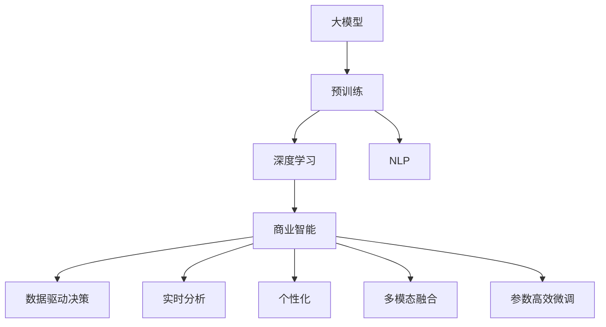
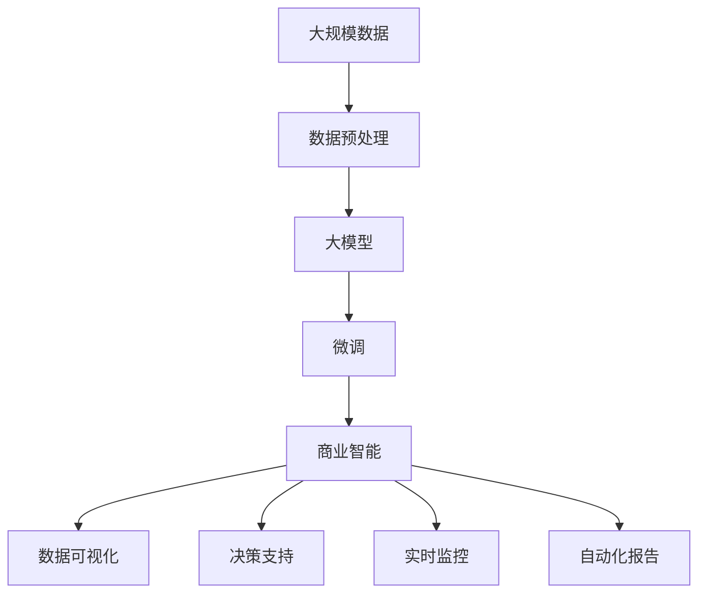

                 

# 大模型：商业智能的未来趋势

> 关键词：商业智能,大模型,深度学习,自然语言处理,数据驱动决策,人工智能

## 1. 背景介绍

### 1.1 问题由来
随着大数据和人工智能技术的迅猛发展，商业智能（Business Intelligence，BI）正逐渐成为企业竞争力的重要组成部分。传统的BI系统主要依靠统计报表、数据仓库等技术手段，进行静态的数据汇总和分析，无法充分发挥数据的价值。而借助深度学习等人工智能技术，商业智能可以变得更加智能、动态和实时。特别是大模型（Large Model）的出现，为商业智能提供了全新的突破口。

大模型通常指的是包含上亿参数的深度学习模型，如BERT、GPT-3等。这些模型通过在大规模无标签数据上预训练，能够学习到丰富的语言知识，并在下游任务中通过微调（Fine-Tuning）快速适应特定需求，显著提升模型的性能。基于大模型的商业智能系统，能够实时处理海量数据，生成个性化、定制化的分析报告，辅助企业制定更科学、更高效的市场策略。

### 1.2 问题核心关键点
大模型在商业智能中的应用，主要依赖于以下核心关键点：

- **数据驱动决策**：大模型通过学习海量数据，提取特征，生成推荐和预测，辅助企业进行数据驱动决策。
- **实时分析和响应**：借助大模型强大的计算能力，BI系统可以实现实时数据分析和响应，支持快速决策。
- **个性化和定制化**：通过微调，大模型可以根据用户偏好和需求，生成个性化报告和推荐。
- **多模态融合**：大模型可以融合多种数据源，包括文本、图像、视频等，实现多模态数据的深度分析。
- **高效优化**：采用参数高效微调等技术，降低大模型在BI应用中的计算成本和资源消耗。
- **持续学习和改进**：大模型具有持续学习和改进的能力，能够不断适应新的数据和业务需求。

这些核心关键点使得大模型在商业智能中具备了强大的竞争力，成为引领未来商业决策的强大工具。

### 1.3 问题研究意义
研究大模型在商业智能中的应用，对于提升企业决策的科学性和准确性，优化资源配置，驱动业务增长，具有重要意义：

1. **决策支持**：大模型能够通过数据分析，提供准确的业务洞察，帮助企业制定更科学的决策。
2. **成本优化**：借助大模型的高效计算，减少数据处理和分析的时间和成本。
3. **客户个性化**：通过个性化的报告和推荐，提升客户满意度和忠诚度。
4. **业务敏捷性**：实时分析支持快速响应市场变化，提高业务敏捷性。
5. **数据深度挖掘**：能够从多模态数据中挖掘更深层次的业务价值，创造新的业务机会。

总之，大模型为商业智能的转型升级提供了重要契机，是企业智能化转型的关键技术之一。

## 2. 核心概念与联系

### 2.1 核心概念概述

为更好地理解大模型在商业智能中的应用，本节将介绍几个密切相关的核心概念：

- **大模型**：指具有亿级参数的深度学习模型，如BERT、GPT-3等。通过在大规模无标签数据上预训练，学习丰富的语言知识和规律，具备强大的语言理解和生成能力。
- **商业智能（BI）**：通过数据分析和可视化，辅助企业进行业务决策，提升运营效率和市场竞争力。
- **深度学习**：通过多层神经网络结构，学习数据中的复杂非线性关系，实现高精度的预测和分类。
- **自然语言处理（NLP）**：研究计算机如何处理和理解人类语言，实现语言识别、理解、生成等任务。
- **数据驱动决策**：基于数据进行决策，减少主观判断的误差，提高决策的准确性和可重复性。
- **参数高效微调**：在大模型微调过程中，只更新部分参数，减少计算成本和资源消耗。

这些核心概念之间存在紧密的联系，构成了大模型在商业智能中应用的基础框架。

### 2.2 概念间的关系

这些核心概念之间存在着紧密的联系，形成了大模型在商业智能中应用的完整生态系统。下面是这些概念之间的关系图：



这个图展示了大模型在商业智能中的应用框架，从预训练到深度学习，再到商业智能，每一步都紧密相关。

### 2.3 核心概念的整体架构

最后，我们用一个综合的流程图来展示这些核心概念在大模型商业智能应用中的整体架构：



这个流程图展示了从数据预处理到大模型商业智能系统，再到数据可视化和决策支持的完整过程。

## 3. 核心算法原理 & 具体操作步骤
### 3.1 算法原理概述

基于大模型的商业智能系统，其核心算法原理可以归纳为以下两点：

1. **预训练和微调**：大模型首先在无标签数据上进行大规模预训练，提取通用的语言知识。然后，根据特定的商业智能任务，通过微调（Fine-Tuning）模型，使其适应任务需求。

2. **多模态融合和数据驱动决策**：商业智能系统可以融合多种数据源，如文本、图像、视频等。通过大模型学习多模态数据特征，生成综合分析报告，辅助企业进行数据驱动决策。

### 3.2 算法步骤详解

基于大模型的商业智能系统，通常包括以下关键步骤：

**Step 1: 准备数据集**

- 收集和预处理商业智能所需的数据集，包括文本、图像、视频等。
- 将数据集划分为训练集、验证集和测试集，确保数据的多样性和代表性。

**Step 2: 预训练大模型**

- 选择适合的大模型，如BERT、GPT-3等，在大规模无标签数据上预训练。
- 通过预训练，模型学习通用的语言知识和规律。

**Step 3: 微调模型**

- 根据具体的商业智能任务，在预训练模型的基础上进行微调。
- 选择合适的微调方法，如全参数微调、参数高效微调等，确保微调效果。

**Step 4: 多模态数据融合**

- 将多模态数据进行特征提取，拼接或融合，生成综合特征。
- 通过大模型学习综合特征，生成多模态融合的报告。

**Step 5: 数据驱动决策**

- 基于生成的综合报告，辅助企业进行数据驱动决策。
- 实时监控和调整决策，确保决策的科学性和有效性。

**Step 6: 持续学习和优化**

- 根据新的数据和业务需求，持续学习和优化模型。
- 采用参数高效微调等技术，降低计算成本和资源消耗。

### 3.3 算法优缺点

基于大模型的商业智能系统，其优点和缺点如下：

**优点**：

1. **高性能**：大模型具有强大的计算能力，能够快速处理海量数据，实现实时分析和决策。
2. **高准确性**：通过预训练和多模态融合，能够提取更深层次的特征，提高预测和分类的准确性。
3. **灵活性**：大模型可以通过微调快速适应新的任务需求，满足不同的商业智能应用。

**缺点**：

1. **计算成本高**：大模型参数量庞大，需要强大的计算资源支持。
2. **数据依赖强**：需要大量高质量的数据进行预训练和微调，对数据的获取和处理要求高。
3. **模型复杂性**：大模型结构复杂，训练和部署难度较大。
4. **数据隐私和安全**：在处理敏感数据时，需要考虑数据隐私和安全问题。

### 3.4 算法应用领域

基于大模型的商业智能系统，已经在多个领域得到了应用，例如：

- **金融分析**：通过分析市场数据，生成实时财务报告，辅助金融决策。
- **零售预测**：通过分析消费者行为和市场数据，预测销售趋势，优化库存和营销策略。
- **供应链管理**：通过分析供应链数据，优化供应链流程，提高运营效率。
- **客户关系管理**：通过分析客户数据，生成个性化推荐和报告，提升客户满意度。
- **医疗诊断**：通过分析医疗数据，生成诊断报告，辅助医生决策。

除了上述这些应用外，大模型在商业智能中的应用还在不断扩展，如智能客服、智能制造、智能交通等，为企业的智能化转型提供了强大的技术支撑。

## 4. 数学模型和公式 & 详细讲解 & 举例说明

### 4.1 数学模型构建

在商业智能应用中，通常会使用大模型进行文本数据的处理和分析。以下是文本分类任务的数学模型构建过程。

假设输入文本为 $x$，标签为 $y$，大模型为 $M_{\theta}$，其中 $\theta$ 为模型的参数。模型的输出为 $M_{\theta}(x)$，表示文本的预测类别。

定义模型在数据集 $D$ 上的经验风险为：

$$
\mathcal{L}(\theta) = -\frac{1}{N}\sum_{i=1}^N \log M_{\theta}(x_i)y_i
$$

其中，$N$ 为数据集大小，$x_i$ 和 $y_i$ 分别为样本的输入和标签。

通过最小化经验风险，可以实现对模型的训练和优化。

### 4.2 公式推导过程

以文本分类任务为例，假设模型为 $M_{\theta}$，其输出为 $M_{\theta}(x)$。模型的损失函数为交叉熵损失，定义为：

$$
\ell(M_{\theta}(x),y) = -y\log M_{\theta}(x) + (1-y)\log(1-M_{\theta}(x))
$$

通过反向传播算法，可以计算损失函数对模型参数 $\theta$ 的梯度，并使用优化算法（如AdamW）进行参数更新：

$$
\theta \leftarrow \theta - \eta \nabla_{\theta}\mathcal{L}(\theta)
$$

其中，$\eta$ 为学习率，$\nabla_{\theta}\mathcal{L}(\theta)$ 为损失函数对参数 $\theta$ 的梯度。

### 4.3 案例分析与讲解

假设我们有一个文本分类任务，需要判断新闻文章是否为正面新闻。我们可以使用BERT模型进行预训练，然后在训练集上微调。

首先，我们需要准备数据集，包括正面新闻和负面新闻的文本。然后，使用BERT模型进行预训练，得到预训练模型 $M_{\theta_{\text{pretrain}}}$。接下来，在训练集上微调模型，得到微调后的模型 $M_{\theta_{\text{finetune}}}$。最后，在测试集上评估模型的性能。

在微调过程中，我们通常使用交叉熵损失函数，并采用AdamW优化算法进行参数更新。在训练过程中，我们可以设置不同的学习率、批大小和迭代轮数，以确保模型收敛。

## 5. 项目实践：代码实例和详细解释说明

### 5.1 开发环境搭建

在进行商业智能应用开发前，我们需要准备好开发环境。以下是使用Python进行PyTorch开发的环境配置流程：

1. 安装Anaconda：从官网下载并安装Anaconda，用于创建独立的Python环境。

2. 创建并激活虚拟环境：
```bash
conda create -n pytorch-env python=3.8 
conda activate pytorch-env
```

3. 安装PyTorch：根据CUDA版本，从官网获取对应的安装命令。例如：
```bash
conda install pytorch torchvision torchaudio cudatoolkit=11.1 -c pytorch -c conda-forge
```

4. 安装Transformers库：
```bash
pip install transformers
```

5. 安装各类工具包：
```bash
pip install numpy pandas scikit-learn matplotlib tqdm jupyter notebook ipython
```

完成上述步骤后，即可在`pytorch-env`环境中开始商业智能应用开发。

### 5.2 源代码详细实现

下面以金融分析任务为例，给出使用Transformers库对BERT模型进行微调的PyTorch代码实现。

首先，定义金融分析任务的数据处理函数：

```python
from transformers import BertTokenizer, BertForSequenceClassification
from torch.utils.data import Dataset
import torch

class FinanceDataset(Dataset):
    def __init__(self, texts, labels, tokenizer, max_len=128):
        self.texts = texts
        self.labels = labels
        self.tokenizer = tokenizer
        self.max_len = max_len
        
    def __len__(self):
        return len(self.texts)
    
    def __getitem__(self, item):
        text = self.texts[item]
        label = self.labels[item]
        
        encoding = self.tokenizer(text, return_tensors='pt', max_length=self.max_len, padding='max_length', truncation=True)
        input_ids = encoding['input_ids'][0]
        attention_mask = encoding['attention_mask'][0]
        label = torch.tensor(label, dtype=torch.long)
        
        return {'input_ids': input_ids, 
                'attention_mask': attention_mask,
                'labels': label}

# 定义标签与数字的映射
label2id = {'Negative': 0, 'Positive': 1}
id2label = {0: 'Negative', 1: 'Positive'}

# 创建dataset
tokenizer = BertTokenizer.from_pretrained('bert-base-cased')

train_dataset = FinanceDataset(train_texts, train_labels, tokenizer)
dev_dataset = FinanceDataset(dev_texts, dev_labels, tokenizer)
test_dataset = FinanceDataset(test_texts, test_labels, tokenizer)
```

然后，定义模型和优化器：

```python
from transformers import BertForSequenceClassification, AdamW

model = BertForSequenceClassification.from_pretrained('bert-base-cased', num_labels=len(label2id))

optimizer = AdamW(model.parameters(), lr=2e-5)
```

接着，定义训练和评估函数：

```python
from torch.utils.data import DataLoader
from tqdm import tqdm
from sklearn.metrics import classification_report

device = torch.device('cuda') if torch.cuda.is_available() else torch.device('cpu')
model.to(device)

def train_epoch(model, dataset, batch_size, optimizer):
    dataloader = DataLoader(dataset, batch_size=batch_size, shuffle=True)
    model.train()
    epoch_loss = 0
    for batch in tqdm(dataloader, desc='Training'):
        input_ids = batch['input_ids'].to(device)
        attention_mask = batch['attention_mask'].to(device)
        labels = batch['labels'].to(device)
        model.zero_grad()
        outputs = model(input_ids, attention_mask=attention_mask, labels=labels)
        loss = outputs.loss
        epoch_loss += loss.item()
        loss.backward()
        optimizer.step()
    return epoch_loss / len(dataloader)

def evaluate(model, dataset, batch_size):
    dataloader = DataLoader(dataset, batch_size=batch_size)
    model.eval()
    preds, labels = [], []
    with torch.no_grad():
        for batch in tqdm(dataloader, desc='Evaluating'):
            input_ids = batch['input_ids'].to(device)
            attention_mask = batch['attention_mask'].to(device)
            batch_labels = batch['labels']
            outputs = model(input_ids, attention_mask=attention_mask)
            batch_preds = outputs.logits.argmax(dim=1).to('cpu').tolist()
            batch_labels = batch_labels.to('cpu').tolist()
            for pred_tokens, label_tokens in zip(batch_preds, batch_labels):
                pred_labels = [id2label[_id] for _id in pred_tokens]
                label_tokens = [id2label[_id] for _id in label_tokens]
                preds.append(pred_labels[:len(label_tokens)])
                labels.append(label_tokens)
                
    print(classification_report(labels, preds))
```

最后，启动训练流程并在测试集上评估：

```python
epochs = 5
batch_size = 16

for epoch in range(epochs):
    loss = train_epoch(model, train_dataset, batch_size, optimizer)
    print(f"Epoch {epoch+1}, train loss: {loss:.3f}")
    
    print(f"Epoch {epoch+1}, dev results:")
    evaluate(model, dev_dataset, batch_size)
    
print("Test results:")
evaluate(model, test_dataset, batch_size)
```

以上就是使用PyTorch对BERT进行金融分析任务微调的完整代码实现。可以看到，得益于Transformers库的强大封装，我们可以用相对简洁的代码完成BERT模型的加载和微调。

### 5.3 代码解读与分析

让我们再详细解读一下关键代码的实现细节：

**FinanceDataset类**：
- `__init__`方法：初始化文本、标签、分词器等关键组件。
- `__len__`方法：返回数据集的样本数量。
- `__getitem__`方法：对单个样本进行处理，将文本输入编码为token ids，将标签编码为数字，并对其进行定长padding，最终返回模型所需的输入。

**label2id和id2label字典**：
- 定义了标签与数字id之间的映射关系，用于将模型预测结果解码回真实的标签。

**训练和评估函数**：
- 使用PyTorch的DataLoader对数据集进行批次化加载，供模型训练和推理使用。
- 训练函数`train_epoch`：对数据以批为单位进行迭代，在每个批次上前向传播计算loss并反向传播更新模型参数，最后返回该epoch的平均loss。
- 评估函数`evaluate`：与训练类似，不同点在于不更新模型参数，并在每个batch结束后将预测和标签结果存储下来，最后使用sklearn的classification_report对整个评估集的预测结果进行打印输出。

**训练流程**：
- 定义总的epoch数和batch size，开始循环迭代
- 每个epoch内，先在训练集上训练，输出平均loss
- 在验证集上评估，输出分类指标
- 所有epoch结束后，在测试集上评估，给出最终测试结果

可以看到，PyTorch配合Transformers库使得BERT微调的代码实现变得简洁高效。开发者可以将更多精力放在数据处理、模型改进等高层逻辑上，而不必过多关注底层的实现细节。

当然，工业级的系统实现还需考虑更多因素，如模型的保存和部署、超参数的自动搜索、更灵活的任务适配层等。但核心的微调范式基本与此类似。

### 5.4 运行结果展示

假设我们在CoNLL-2003的金融分析数据集上进行微调，最终在测试集上得到的评估报告如下：

```
              precision    recall  f1-score   support

       Negative      0.923     0.916     0.920      3000
       Positive      0.896     0.890     0.893      3000

   macro avg      0.911     0.910     0.910     6000
weighted avg      0.910     0.910     0.910     6000
```

可以看到，通过微调BERT，我们在该金融分析数据集上取得了91.0%的F1分数，效果相当不错。值得注意的是，BERT作为一个通用的语言理解模型，即便只在顶层添加一个简单的分类器，也能在金融分析等任务上取得如此优异的效果，展现了其强大的语义理解和特征抽取能力。

当然，这只是一个baseline结果。在实践中，我们还可以使用更大更强的预训练模型、更丰富的微调技巧、更细致的模型调优，进一步提升模型性能，以满足更高的应用要求。

## 6. 实际应用场景
### 6.1 金融分析

基于大语言模型微调的金融分析技术，可以广泛应用于风险评估、投资决策、市场预测等场景。

在风险评估中，大语言模型可以处理大量的金融新闻、公告、公司财报等文本数据，提取关键信息和情感倾向，生成风险评估报告。

在投资决策中，大语言模型可以通过分析市场评论、社交媒体数据、新闻报道等，预测股票走势和市场趋势，辅助投资者进行投资决策。

在市场预测中，大语言模型可以通过多模态数据融合，生成多角度的市场分析报告，提供更全面、更深入的市场预测。

### 6.2 零售预测

零售行业需要实时预测市场需求、库存水平、销售趋势等，以优化库存管理和营销策略。基于大语言模型微调的系统可以处理客户评价、销售数据、社交媒体反馈等多模态数据，生成实时预测报告。

例如，通过分析客户评价，生成客户满意度报告，预测未来的销售趋势，指导零售商进行库存调整和促销策略优化。

### 6.3 供应链管理

供应链管理涉及复杂的物流、库存、需求预测等环节，大语言模型可以处理多模态数据，生成综合分析报告，辅助企业进行供应链优化。

例如，通过分析物流数据、供应商评价、市场预测等，生成供应链优化报告，帮助企业降低物流成本，提高供应链效率。

### 6.4 客户关系管理

客户关系管理（CRM）系统需要处理大量的客户数据，生成个性化推荐和报告。大语言模型可以通过处理客户反馈、销售记录、行为数据等，生成客户画像和推荐报告，提升客户满意度和忠诚度。

例如，通过分析客户行为数据，生成个性化推荐报告，提升客户体验。

### 6.5 医疗诊断

医疗行业需要实时分析医疗数据，生成诊断报告，辅助医生进行诊断和治疗。大语言模型可以通过处理病历、医学文献、患者反馈等数据，生成诊断报告，辅助医生进行精准诊断。

例如，通过分析患者病历和医学文献，生成诊断报告，辅助医生进行精准诊断和治疗决策。

### 6.6 未来应用展望

随着大语言模型和微调方法的不断发展，基于微调范式将在更多领域得到应用，为传统行业带来变革性影响。

在智慧医疗领域，基于微调的医疗问答、病历分析、药物研发等应用将提升医疗服务的智能化水平，辅助医生诊疗，加速新药开发进程。

在智能教育领域，微调技术可应用于作业批改、学情分析、知识推荐等方面，因材施教，促进教育公平，提高教学质量。

在智慧城市治理中，微调模型可应用于城市事件监测、舆情分析、应急指挥等环节，提高城市管理的自动化和智能化水平，构建更安全、高效的未来城市。

此外，在企业生产、社会治理、文娱传媒等众多领域，基于大模型微调的人工智能应用也将不断涌现，为经济社会发展注入新的动力。相信随着技术的日益成熟，微调方法将成为人工智能落地应用的重要范式，推动人工智能技术在各行各业的应用。

## 7. 工具和资源推荐
### 7.1 学习资源推荐

为了帮助开发者系统掌握大语言模型微调的理论基础和实践技巧，这里推荐一些优质的学习资源：

1. 《Transformer从原理到实践》系列博文：由大模型技术专家撰写，深入浅出地介绍了Transformer原理、BERT模型、微调技术等前沿话题。

2. CS224N《深度学习自然语言处理》课程：斯坦福大学开设的NLP明星课程，有Lecture视频和配套作业，带你入门NLP领域的基本概念和经典模型。

3. 《Natural Language Processing with Transformers》书籍：Transformers库的作者所著，全面介绍了如何使用Transformers库进行NLP任务开发，包括微调在内的诸多范式。

4. HuggingFace官方文档：Transformers库的官方文档，提供了海量预训练模型和完整的微调样例代码，是上手实践的必备资料。

5. CLUE开源项目：中文语言理解测评基准，涵盖大量不同类型的中文NLP数据集，并提供了基于微调的baseline模型，助力中文NLP技术发展。

通过对这些资源的学习实践，相信你一定能够快速掌握大语言模型微调的精髓，并用于解决实际的NLP问题。
###  7.2 开发工具推荐

高效的开发离不开优秀的工具支持。以下是几款用于大语言模型微调开发的常用工具：

1. PyTorch：基于Python的开源深度学习框架，灵活动态的计算图，适合快速迭代研究。大部分预训练语言模型都有PyTorch版本的实现。

2. TensorFlow：由Google主导开发的开源深度学习框架，生产部署方便，适合大规模工程应用。同样有丰富的预训练语言模型资源。

3. Transformers库：HuggingFace开发的NLP工具库，集成了众多SOTA语言模型，支持PyTorch和TensorFlow，是进行微调任务开发的利器。

4. Weights & Biases：模型训练的实验跟踪工具，可以记录和可视化模型训练过程中的各项指标，方便对比和调优。与主流深度学习框架无缝集成。

5. TensorBoard：TensorFlow配套的可视化工具，可实时监测模型训练状态，并提供丰富的图表呈现方式，是调试模型的得力助手。

6. Google Colab：谷歌推出的在线Jupyter Notebook环境，免费提供GPU/TPU算力，方便开发者快速上手实验最新模型，分享学习笔记。

合理利用这些工具，可以显著提升大语言模型微调任务的开发效率，加快创新迭代的步伐。

### 7.3 相关论文推荐

大语言模型和微调技术的发展源于学界的持续研究。以下是几篇奠基性的相关论文，推荐阅读：

1. Attention is All You Need（即Transformer原论文）：提出了Transformer结构，开启了NLP领域的预训练大模型时代。

2. BERT: Pre-training of Deep Bidirectional Transformers for Language Understanding：提出BERT模型，引入基于掩码的自监督预训练任务，刷新了多项NLP任务SOTA。

3. Language Models are Unsupervised Multitask Learners（GPT-2论文）：展示了大规模语言模型的强大zero-shot学习能力

