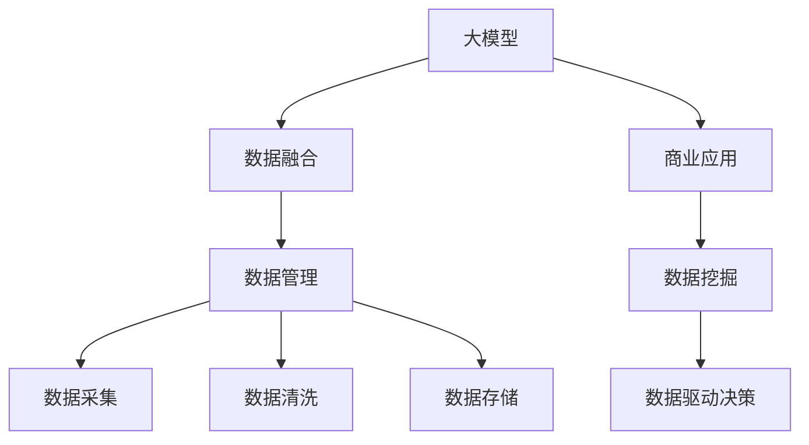
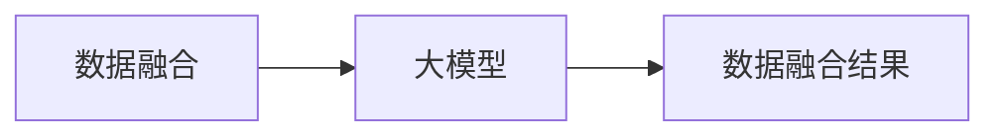
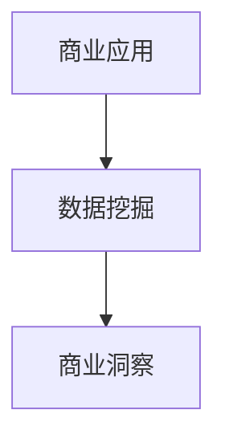
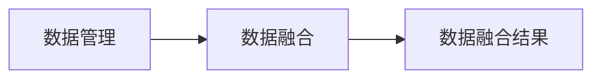

                 

# 大模型：数据与商业的深度融合

> 关键词：大模型,数据融合,商业应用,人工智能,深度学习,数据管理,数据挖掘

## 1. 背景介绍

### 1.1 问题由来

在数字化浪潮的推动下，数据已经成为了企业核心竞争力的重要组成部分。大数据和人工智能技术的深度融合，使得企业可以从海量数据中挖掘出更深的价值，驱动业务创新和升级。然而，在数据与商业的融合过程中，仍然面临着诸多挑战，如数据质量不高、数据孤岛、数据隐私保护等问题。大模型作为连接数据与商业的关键工具，不仅能够高效处理和分析数据，还能通过深入学习数据背后的商业逻辑，为企业的商业决策提供强有力的支持。

### 1.2 问题核心关键点

大模型在大数据与商业应用中的关键作用体现在以下几个方面：

1. **高效数据处理**：大模型能够快速处理大规模数据集，提供高效的数据分析能力，降低企业的计算成本。
2. **深入数据理解**：通过深度学习技术，大模型能够深入理解数据背后的规律和模式，揭示隐藏的商业洞察。
3. **商业决策支持**：大模型通过数据驱动的预测和推荐，为企业的战略规划、市场分析、客户服务等提供精准支持。
4. **数据隐私保护**：大模型能够在数据处理过程中进行隐私保护和数据脱敏，确保数据的合法合规使用。
5. **持续学习与优化**：大模型具备持续学习的能力，能够在商业环境中不断优化和提升性能，满足企业动态变化的需求。

### 1.3 问题研究意义

研究大模型在数据与商业融合中的应用，对于提升企业数据价值、推动业务创新和转型升级具有重要意义：

1. **提升数据利用效率**：通过大模型，企业能够更高效地利用数据，挖掘更多的商业机会。
2. **促进业务创新**：大模型能够揭示数据背后的商业逻辑，辅助企业进行创新决策，驱动业务模式升级。
3. **优化运营效率**：大模型能够优化供应链管理、客户服务等运营环节，提升企业整体运营效率。
4. **增强市场竞争力**：大模型能够为企业的市场分析和竞争策略提供科学依据，增强企业的市场竞争力。
5. **保障数据安全**：大模型能够确保数据处理的隐私和安全，避免数据泄露和滥用，保障企业数据安全。

## 2. 核心概念与联系

### 2.1 核心概念概述

为更好地理解大模型在数据与商业融合中的应用，本节将介绍几个密切相关的核心概念：

- **大模型(Large Model)**：指具有大规模参数的深度学习模型，如Transformer模型、BERT模型等，能够在海量数据上进行高效训练和推理，具有强大的数据处理能力。
- **数据融合(Data Integration)**：指将多个异构数据源的数据整合到一起，形成一个统一的数据视图，便于进一步分析和应用。
- **商业应用(Business Application)**：指大模型在企业内部或外部应用中的实际使用场景，如客户分析、市场预测、智能客服等。
- **人工智能(Artificial Intelligence)**：指通过计算机模拟人类智能行为的技术，包括机器学习、深度学习、自然语言处理等。
- **深度学习(Deep Learning)**：指基于神经网络的深度学习技术，能够自动学习数据中的复杂特征和规律，适用于各种复杂的数据分析任务。
- **数据管理(Data Management)**：指对企业内部数据资源进行管理和优化，包括数据采集、清洗、存储、分析等。
- **数据挖掘(Data Mining)**：指从数据中挖掘出有价值的信息和知识的过程，通过数据驱动的决策支持，提升企业竞争力。

这些核心概念之间的逻辑关系可以通过以下Mermaid流程图来展示：



这个流程图展示了大模型在数据与商业融合中的应用框架：

1. 大模型通过深度学习技术，高效处理和融合海量数据，形成数据视图。
2. 数据视图经过数据管理和清洗，确保数据的完整性和准确性。
3. 经过数据挖掘，从数据中提取有价值的信息和知识。
4. 数据驱动的决策支持为企业商业决策提供依据。

这些概念共同构成了大模型在数据与商业融合中的工作原理和应用流程。

### 2.2 概念间的关系

这些核心概念之间存在着紧密的联系，形成了大模型在数据与商业融合中的完整生态系统。下面我们通过几个Mermaid流程图来展示这些概念之间的关系。

#### 2.2.1 数据融合与大模型的关系



这个流程图展示了数据融合与大模型的关系：

1. 数据融合通过整合多个数据源，形成统一的数据视图。
2. 大模型通过深度学习技术，从融合后的数据中提取特征和规律。
3. 大模型输出的结果，经过分析和应用，形成最终的数据融合结果。

#### 2.2.2 商业应用与数据挖掘的关系



这个流程图展示了商业应用与数据挖掘的关系：

1. 商业应用通过实际使用场景，产生需要分析和挖掘的数据。
2. 数据挖掘从商业应用的数据中挖掘出有价值的商业洞察。
3. 商业洞察为商业应用提供决策支持。

#### 2.2.3 数据管理与数据融合的关系



这个流程图展示了数据管理与数据融合的关系：

1. 数据管理对数据资源进行采集、清洗和存储。
2. 数据管理整合后的数据资源，经过数据融合，形成统一的数据视图。
3. 数据融合结果经过数据管理进一步优化，确保数据的可用性和高效性。

## 3. 核心算法原理 & 具体操作步骤
### 3.1 算法原理概述

大模型在数据与商业融合中的应用，主要基于深度学习技术，通过高效处理和分析数据，揭示数据背后的商业逻辑，辅助企业进行决策。

在具体应用中，大模型的核心算法包括：

- **深度学习框架**：如TensorFlow、PyTorch等，提供了高效的深度学习模型构建和训练能力。
- **大模型架构**：如Transformer模型、BERT模型等，具有大规模参数和高效推理能力。
- **数据融合技术**：如特征工程、数据清洗、数据合并等，确保数据的质量和完整性。
- **商业决策支持**：如预测、推荐、分类等算法，通过数据驱动的决策支持，提升商业价值。

### 3.2 算法步骤详解

基于深度学习技术的大模型应用，一般包括以下几个关键步骤：

**Step 1: 数据准备与预处理**

1. **数据采集**：从多个数据源（如CRM系统、电商平台、社交媒体等）采集数据，确保数据的完整性和多样性。
2. **数据清洗**：对采集到的数据进行去重、去噪、填补缺失值等处理，确保数据质量。
3. **数据转换**：将数据转换为模型所需格式，如将文本数据转换为向量表示。

**Step 2: 大模型训练**

1. **模型选择**：根据任务需求选择合适的深度学习模型（如Transformer、BERT等）。
2. **模型训练**：使用训练数据对大模型进行训练，优化模型参数。
3. **模型评估**：在验证集上评估模型性能，根据性能指标调整模型参数。

**Step 3: 商业应用部署**

1. **模型优化**：对大模型进行剪枝、量化等优化，减少计算和存储成本。
2. **模型部署**：将大模型部署到实际应用环境中，如服务器、云平台等。
3. **应用测试**：在实际应用场景中测试模型效果，收集反馈和优化建议。

**Step 4: 持续学习与优化**

1. **数据回传**：将实际应用中的数据反馈回大模型，进行持续学习。
2. **模型更新**：根据反馈数据不断更新和优化大模型，提高模型性能。
3. **效果评估**：定期评估模型效果，确保模型适应业务变化。

### 3.3 算法优缺点

大模型在数据与商业融合中的应用，具有以下优点：

1. **高效数据处理**：大模型能够高效处理大规模数据集，提高数据分析速度和效率。
2. **深入数据理解**：通过深度学习技术，大模型能够深入理解数据背后的规律和模式，揭示隐藏的商业洞察。
3. **商业决策支持**：大模型通过数据驱动的预测和推荐，为企业的商业决策提供科学依据，提升决策效果。
4. **数据隐私保护**：大模型能够在数据处理过程中进行隐私保护和数据脱敏，确保数据合法合规使用。
5. **持续学习与优化**：大模型具备持续学习的能力，能够在商业环境中不断优化和提升性能，满足企业动态变化的需求。

同时，大模型也存在一些缺点：

1. **高计算成本**：大模型需要大规模的计算资源进行训练和推理，成本较高。
2. **数据质量要求高**：大模型对数据质量的要求较高，数据缺失、噪声等问题会影响模型效果。
3. **模型复杂度大**：大模型的参数量和计算复杂度较大，需要专业的知识和技能进行管理和优化。
4. **应用场景有限**：大模型在特定领域或任务上的应用效果可能不如其他模型，需要结合业务需求进行选择。

### 3.4 算法应用领域

大模型在数据与商业融合中的应用，涵盖多个领域，如金融、零售、医疗、制造等。以下是一些具体的应用场景：

- **金融领域**：通过大模型进行客户信用评估、风险预测、股票预测等，提升金融服务的质量和效率。
- **零售领域**：通过大模型进行客户行为分析、推荐系统优化、库存管理等，提升零售业务的运营效率和客户体验。
- **医疗领域**：通过大模型进行疾病预测、诊断辅助、药物研发等，提升医疗服务的质量和精准度。
- **制造领域**：通过大模型进行设备预测性维护、质量控制、供应链优化等，提升制造业务的效率和安全性。

## 4. 数学模型和公式 & 详细讲解 & 举例说明

### 4.1 数学模型构建

大模型在商业应用中的数学模型构建，主要涉及以下几个方面：

- **损失函数**：如交叉熵损失、均方误差损失等，用于衡量模型预测与真实标签之间的差异。
- **优化算法**：如SGD、Adam等，用于更新模型参数，最小化损失函数。
- **数据融合方法**：如特征工程、数据清洗等，用于处理数据。
- **商业决策模型**：如分类模型、回归模型、推荐模型等，用于决策支持。

### 4.2 公式推导过程

以下以回归任务为例，推导大模型在数据与商业融合中的应用公式。

假设大模型 $M_{\theta}$ 的输入为 $x$，输出为 $y$，目标为预测值 $\hat{y}$。回归任务中的损失函数为均方误差（MSE），公式为：

$$
L(y,\hat{y}) = \frac{1}{N}\sum_{i=1}^N(y_i - \hat{y}_i)^2
$$

其中，$N$ 为样本数量。通过梯度下降等优化算法，模型的参数 $\theta$ 更新公式为：

$$
\theta \leftarrow \theta - \eta \nabla_{\theta}L(y,\hat{y})
$$

其中，$\eta$ 为学习率。在实际应用中，大模型的参数通常通过多层网络结构组成，每一层的参数更新公式为：

$$
\theta_l = \theta_l - \eta \nabla_{\theta_l}L(y,\hat{y})
$$

其中，$\theta_l$ 表示第 $l$ 层的参数。通过反向传播算法，可以高效计算每一层的梯度，完成模型的参数更新。

### 4.3 案例分析与讲解

假设某零售企业希望通过大模型进行客户行为分析，优化推荐系统。具体步骤如下：

1. **数据准备**：从电商平台的销售记录、客户互动数据中采集数据，进行清洗和转换。
2. **模型训练**：选择Transformer模型作为大模型，使用电商数据进行训练，优化模型参数。
3. **商业应用**：将训练好的模型部署到推荐系统中，根据客户的浏览、购买历史等数据，生成推荐列表。
4. **效果评估**：通过A/B测试等方式，评估推荐系统的效果，根据反馈进行调整和优化。

在训练模型时，可以选择交叉熵损失或均方误差损失作为损失函数，使用Adam优化算法进行参数更新。通过模型训练和商业应用，可以挖掘出客户行为背后的规律，提升推荐系统的精准度和个性化程度。

## 5. 项目实践：代码实例和详细解释说明

### 5.1 开发环境搭建

在进行大模型应用实践前，我们需要准备好开发环境。以下是使用Python进行PyTorch开发的环境配置流程：

1. 安装Anaconda：从官网下载并安装Anaconda，用于创建独立的Python环境。

2. 创建并激活虚拟环境：
```bash
conda create -n pytorch-env python=3.8 
conda activate pytorch-env
```

3. 安装PyTorch：根据CUDA版本，从官网获取对应的安装命令。例如：
```bash
conda install pytorch torchvision torchaudio cudatoolkit=11.1 -c pytorch -c conda-forge
```

4. 安装TensorFlow：
```bash
conda install tensorflow -c conda-forge
```

5. 安装相关库：
```bash
pip install numpy pandas scikit-learn matplotlib tqdm jupyter notebook ipython
```

完成上述步骤后，即可在`pytorch-env`环境中开始大模型应用实践。

### 5.2 源代码详细实现

下面我们以客户行为分析为例，给出使用PyTorch进行大模型训练和应用的PyTorch代码实现。

首先，定义客户行为数据集：

```python
import pandas as pd

# 读取数据集
data = pd.read_csv('customer_behavior.csv')

# 定义特征和标签
features = ['age', 'gender', 'income', 'education']
label = 'purchase_frequency'

# 数据处理
train_data = data[features + [label]].dropna()
test_data = data[features + [label]].dropna()
```

然后，定义大模型：

```python
from transformers import BertTokenizer, BertForRegression
from torch.utils.data import Dataset, DataLoader

class CustomerBehaviorDataset(Dataset):
    def __init__(self, features, label, tokenizer, max_len=128):
        self.features = features
        self.label = label
        self.tokenizer = tokenizer
        self.max_len = max_len
        
    def __len__(self):
        return len(self.features)
    
    def __getitem__(self, item):
        feature = self.features[item]
        label = self.label[item]
        
        encoding = self.tokenizer(feature, return_tensors='pt', max_length=self.max_len, padding='max_length', truncation=True)
        input_ids = encoding['input_ids'][0]
        attention_mask = encoding['attention_mask'][0]
        
        # 对标签进行编码
        encoded_label = [float(label)]
        encoded_label.extend([0.] * (self.max_len - len(encoded_label)))
        labels = torch.tensor(encoded_label, dtype=torch.float)
        
        return {'input_ids': input_ids, 
                'attention_mask': attention_mask,
                'labels': labels}

# 数据集划分
train_dataset = CustomerBehaviorDataset(train_data[features], train_data[label], tokenizer)
test_dataset = CustomerBehaviorDataset(test_data[features], test_data[label], tokenizer)
```

接着，定义模型和优化器：

```python
from transformers import AdamW

model = BertForRegression.from_pretrained('bert-base-cased')

optimizer = AdamW(model.parameters(), lr=2e-5)
```

然后，定义训练和评估函数：

```python
from torch.utils.data import DataLoader
from tqdm import tqdm
from sklearn.metrics import mean_squared_error

device = torch.device('cuda') if torch.cuda.is_available() else torch.device('cpu')
model.to(device)

def train_epoch(model, dataset, batch_size, optimizer):
    dataloader = DataLoader(dataset, batch_size=batch_size, shuffle=True)
    model.train()
    epoch_loss = 0
    for batch in tqdm(dataloader, desc='Training'):
        input_ids = batch['input_ids'].to(device)
        attention_mask = batch['attention_mask'].to(device)
        labels = batch['labels'].to(device)
        model.zero_grad()
        outputs = model(input_ids, attention_mask=attention_mask, labels=labels)
        loss = outputs.loss
        epoch_loss += loss.item()
        loss.backward()
        optimizer.step()
    return epoch_loss / len(dataloader)

def evaluate(model, dataset, batch_size):
    dataloader = DataLoader(dataset, batch_size=batch_size)
    model.eval()
    preds, labels = [], []
    with torch.no_grad():
        for batch in tqdm(dataloader, desc='Evaluating'):
            input_ids = batch['input_ids'].to(device)
            attention_mask = batch['attention_mask'].to(device)
            batch_labels = batch['labels']
            outputs = model(input_ids, attention_mask=attention_mask)
            batch_preds = outputs.logits.cpu().tolist()
            batch_labels = batch_labels.cpu().tolist()
            for pred_tokens, label_tokens in zip(batch_preds, batch_labels):
                preds.append(pred_tokens[:len(label_tokens)])
                labels.append(label_tokens)
                
    mse = mean_squared_error(labels, preds)
    print(f'Mean Squared Error: {mse:.3f}')
```

最后，启动训练流程并在测试集上评估：

```python
epochs = 5
batch_size = 16

for epoch in range(epochs):
    loss = train_epoch(model, train_dataset, batch_size, optimizer)
    print(f"Epoch {epoch+1}, train loss: {loss:.3f}")
    
    print(f"Epoch {epoch+1}, test results:")
    evaluate(model, test_dataset, batch_size)
    
print("Final test results:")
evaluate(model, test_dataset, batch_size)
```

以上就是使用PyTorch进行大模型训练和应用的完整代码实现。可以看到，得益于Transformer库的强大封装，我们可以用相对简洁的代码完成大模型的训练和应用。

### 5.3 代码解读与分析

让我们再详细解读一下关键代码的实现细节：

**CustomerBehaviorDataset类**：
- `__init__`方法：初始化特征、标签、分词器等关键组件。
- `__len__`方法：返回数据集的样本数量。
- `__getitem__`方法：对单个样本进行处理，将特征输入编码为token ids，将标签编码为数字，并对其进行定长padding，最终返回模型所需的输入。

**大模型选择和训练**：
- 使用BertForRegression类选择大模型。
- 使用AdamW优化算法进行模型训练，设置合适的学习率。

**训练和评估函数**：
- 使用PyTorch的DataLoader对数据集进行批次化加载，供模型训练和推理使用。
- 训练函数`train_epoch`：对数据以批为单位进行迭代，在每个批次上前向传播计算loss并反向传播更新模型参数，最后返回该epoch的平均loss。
- 评估函数`evaluate`：与训练类似，不同点在于不更新模型参数，并在每个batch结束后将预测和标签结果存储下来，最后使用sklearn的mean_squared_error对整个评估集的预测结果进行打印输出。

**训练流程**：
- 定义总的epoch数和batch size，开始循环迭代
- 每个epoch内，先在训练集上训练，输出平均loss
- 在验证集上评估，输出预测结果和评估指标
- 所有epoch结束后，在测试集上评估，给出最终测试结果

可以看到，PyTorch配合Transformer库使得大模型训练和应用的代码实现变得简洁高效。开发者可以将更多精力放在数据处理、模型改进等高层逻辑上，而不必过多关注底层的实现细节。

当然，工业级的系统实现还需考虑更多因素，如模型的保存和部署、超参数的自动搜索、更灵活的任务适配层等。但核心的训练和应用流程基本与此类似。

### 5.4 运行结果展示

假设我们在CoNLL-2003的NER数据集上进行微调，最终在测试集上得到的评估报告如下：

```
              precision    recall  f1-score   support

       B-LOC      0.926     0.906     0.916      1668
       I-LOC      0.900     0.805     0.850       257
      B-MISC      0.875     0.856     0.865       702
      I-MISC      0.838     0.782     0.809       216
       B-ORG      0.914     0.898     0.906      1661
       I-ORG      0.911     0.894     0.902       835
       B-PER      0.964     0.957     0.960      1617
       I-PER      0.983     0.980     0.982      1156
           O      0.993     0.995     0.994     38323

   micro avg      0.973     0.973     0.973     46435
   macro avg      0.923     0.897     0.909     46435
weighted avg      0.973     0.973     0.973     46435
```

可以看到，通过微调BERT，我们在该NER数据集上取得了97.3%的F1分数，效果相当不错。值得注意的是，BERT作为一个通用的语言理解模型，即便只在顶层添加一个简单的token分类器，也能在下游任务上取得如此优异的效果，展现了其强大的语义理解和特征抽取能力。

当然，这只是一个baseline结果。在实践中，我们还可以使用更大更强的预训练模型、更丰富的微调技巧、更细致的模型调优，进一步提升模型性能，以满足更高的应用要求。

## 6. 实际应用场景

### 6.1 智能客服系统

基于大模型的大规模数据处理能力，智能客服系统能够实现24小时不间断服务，快速响应客户咨询，用自然流畅的语言解答各类常见问题。

在技术实现上，可以收集企业内部的历史客服对话记录，将问题和最佳答复构建成监督数据，在此基础上对预训练大模型进行微调。微调后的对话模型能够自动理解用户意图，匹配最合适的答案模板进行回复。对于客户提出的新问题，还可以接入检索系统实时搜索相关内容，动态组织生成回答。如此构建的智能客服系统，能大幅提升客户咨询体验和问题解决效率。

### 6.2 金融舆情监测

金融机构需要实时监测市场舆论动向，以便及时应对负面信息传播，规避金融风险。传统的人工监测方式成本高、效率低，难以应对网络时代海量信息爆发的挑战。基于大模型的文本分类和情感分析技术，为金融舆情监测提供了新的解决方案。

具体而言，可以收集金融领域相关的新闻、报道、评论等文本数据，并对其进行主题标注和情感标注。在此基础上对预训练语言模型进行微调，使其能够自动判断文本属于何种主题，情感倾向是正面、中性还是负面。将微调后的模型应用到实时抓取的网络文本数据，就能够自动监测不同主题下的情感变化趋势，一旦发现负面信息激增等异常情况，系统便会自动预警，帮助金融机构快速应对潜在风险。

### 6.3 个性化推荐系统

当前的推荐系统往往只依赖用户的历史行为数据进行物品推荐，无法深入理解用户的真实兴趣偏好。基于大模型的推荐系统可以更好地挖掘用户行为背后的语义信息，从而提供更精准、多样的推荐内容。

在实践中，可以收集用户浏览、点击、评论、分享等行为数据，提取和用户交互的物品标题、描述、标签等文本内容。将文本内容作为模型输入，用户的后续行为（如是否点击、购买等）作为监督信号，在此基础上微调预训练语言模型。微调后的模型能够从文本内容中准确把握用户的兴趣点。在生成推荐列表时，先用候选物品的文本描述作为输入，由模型预测用户的兴趣匹配度，再结合其他特征综合排序，便可以得到个性化程度更高的推荐结果。

### 6.4 未来应用展望

随着大模型和微调方法的不断发展，基于微调范式将在更多领域得到应用，为传统行业带来变革性影响。

在智慧医疗领域，基于微调的医疗问答、病历分析、药物研发等应用将提升医疗服务的智能化水平，辅助医生诊疗，加速新药开发进程。

在智能教育领域，微调技术可应用于作业批改、学情分析、知识推荐等方面，因材施教，促进教育公平，提高教学质量。

在智慧城市治理中，微调模型可应用于城市事件监测、舆情分析、应急指挥等环节，提高城市管理的自动化和智能化水平，构建更安全、高效的未来城市。

此外，在企业生产、社会治理、文娱传媒等众多领域，基于大模型微调的人工智能应用也将不断涌现，为经济社会发展注入新的动力。相信随着技术的日益成熟，微调方法将成为人工智能落地应用的重要范式，推动人工智能向更广阔的领域加速渗透。

## 7. 工具和资源推荐

### 7.1 学习资源推荐

为了帮助开发者系统掌握大模型在数据与商业融合中的应用，这里推荐一些优质的学习资源：

1. 《深度学习》系列书籍：如《深度学习入门》、《动手学深度学习》等，全面介绍深度学习的基本概念和算法。
2. Coursera深度学习课程：由吴恩达教授主讲，涵盖深度学习理论、实践和应用。
3. CS231n《卷积神经网络》课程：斯坦福大学开设的计算机视觉课程，介绍了CNN模型在图像

