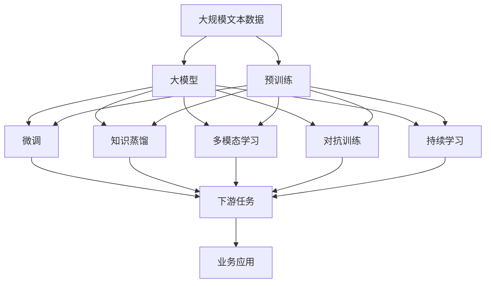
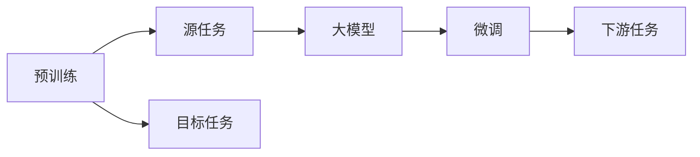
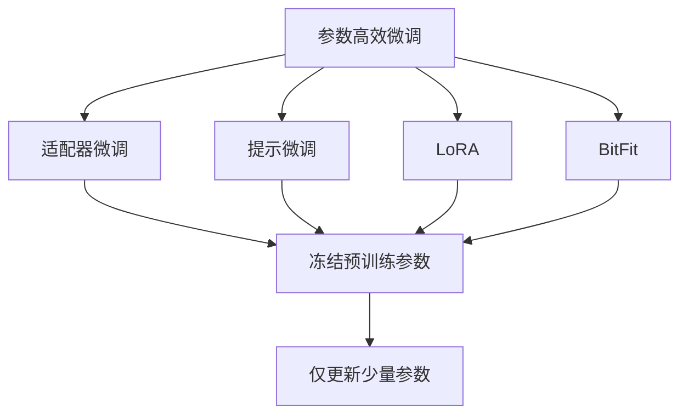
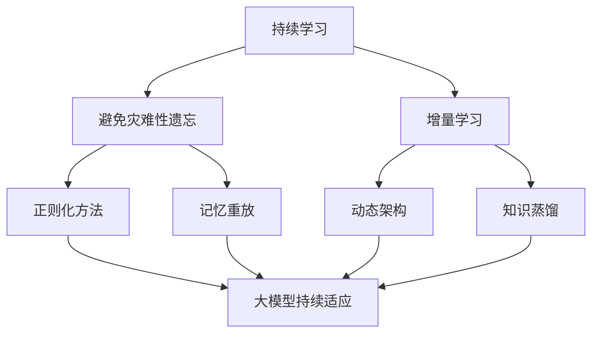

                 

# 大模型：未来商业的核心竞争力

> 关键词：大模型,商业竞争力,人工智能,商业应用,企业创新,自动化,数据驱动

## 1. 背景介绍

### 1.1 问题由来
随着人工智能技术的迅猛发展，尤其是深度学习和大规模预训练语言模型（Large Language Models, LLMs）的突破，大模型已经在诸多领域展现出了巨大的潜力和应用前景。从自然语言处理（NLP）到计算机视觉（CV），再到语音识别（ASR）和自然语言生成（NLG），大模型的优越性能已经渗透到各行各业，成为了推动技术进步和商业创新的关键因素。

大模型的广泛应用，使得企业在处理海量数据、提升决策效率、优化客户体验等方面拥有了前所未有的优势。然而，大模型技术的迅速发展也带来了新的挑战和机遇，企业如何有效利用大模型，发挥其商业竞争力，成为了摆在面前的一个重大课题。

### 1.2 问题核心关键点
当前，大模型的应用已经渗透到多个商业领域，包括但不限于：

1. **自动化流程优化**：大模型可以自动处理重复性高、规则明确的任务，如财务报表审计、客户服务、供应链管理等，大幅提升企业运营效率。

2. **客户体验提升**：通过大模型驱动的智能客服、个性化推荐、情感分析等应用，企业能够更好地理解和满足客户需求，提高客户满意度和忠诚度。

3. **风险管理**：大模型在金融风控、市场预测、欺诈检测等方面的应用，能够帮助企业识别潜在风险，及时调整策略，保护资产安全。

4. **创新驱动**：大模型在药物研发、材料科学、环境保护等领域的应用，推动了科学研究的突破，催生了新工艺、新产品，加速了技术迭代和市场竞争。

5. **市场竞争**：大模型的广泛应用已经成为企业竞争的重要工具，如何利用好大模型，实现业务转型和市场领先，是每一个企业的核心议题。

这些应用场景展示了大模型在推动商业创新和增强企业竞争力的巨大潜力。但同时，大模型技术的复杂性和应用难度也使得企业在落地实施时面临诸多挑战。本文将深入探讨大模型的核心概念、算法原理和实际应用，帮助企业更好地理解和利用大模型，发挥其商业竞争力。

### 1.3 问题研究意义
研究大模型在商业应用中的作用，对于提升企业竞争力、优化业务流程、驱动创新发展具有重要意义：

1. **降低运营成本**：自动化流程和大模型驱动的应用可以替代部分人力，降低企业运营成本。

2. **提高决策效率**：大模型能够从海量数据中提取有价值的信息，支持企业做出更快速、更准确的决策。

3. **增强客户粘性**：通过个性化推荐和智能客服等应用，企业能够提供更加贴心、高效的服务，提升客户忠诚度。

4. **开拓新市场**：大模型在多个垂直领域的应用，为企业提供了新的业务机会和市场增长点。

5. **技术领先**：通过掌握大模型技术，企业能够保持技术领先地位，增强市场竞争力。

6. **数据驱动**：大模型能够处理和分析大数据，帮助企业从数据中发现隐藏的价值和机会。

综上所述，大模型在商业应用中的潜力巨大，能够为企业带来多重竞争优势。然而，要充分发挥大模型的商业潜力，企业还需要在技术、管理和运营等多方面进行全面优化。本文将从技术原理、应用实践、资源推荐和未来展望等方面进行全面剖析，为企业的商业应用提供切实可行的指导。

## 2. 核心概念与联系

### 2.1 核心概念概述

为更好地理解大模型在商业应用中的作用，本节将介绍几个密切相关的核心概念：

- **大模型（Large Language Models, LLMs）**：以自回归（如GPT）或自编码（如BERT）模型为代表的大规模预训练语言模型。通过在大规模无标签文本语料上进行预训练，学习通用的语言表示，具备强大的语言理解和生成能力。

- **预训练（Pre-training）**：指在大规模无标签文本语料上，通过自监督学习任务训练通用语言模型的过程。常见的预训练任务包括言语建模、遮挡语言模型等。预训练使得模型学习到语言的通用表示。

- **微调（Fine-tuning）**：指在预训练模型的基础上，使用下游任务的少量标注数据，通过有监督学习优化模型在该任务上的性能。通常只需要调整顶层分类器或解码器，并以较小的学习率更新全部或部分的模型参数。

- **迁移学习（Transfer Learning）**：指将一个领域学习到的知识，迁移应用到另一个不同但相关的领域的学习范式。大模型的预训练-微调过程即是一种典型的迁移学习方式。

- **知识蒸馏（Knowledge Distillation）**：通过将复杂模型的知识和经验，传递到较简单的模型上，使得简单模型能够保留复杂模型的大部分性能。大模型在微调前后的知识传递，也是一种知识蒸馏过程。

- **多模态学习（Multimodal Learning）**：指融合视觉、语音、文本等多模态信息，进行联合建模和训练。大模型在多模态应用中，可以更好地理解和处理复杂现实场景。

- **对抗训练（Adversarial Training）**：通过引入对抗样本，提高模型对抗噪声和攻击的能力。大模型在微调过程中，通常也会应用对抗训练，以提升鲁棒性。

- **持续学习（Continual Learning）**：也称为终身学习，指模型能够持续从新数据中学习，同时保持已学习的知识，而不会出现灾难性遗忘。这对于保持大模型的时效性和适应性至关重要。

这些核心概念之间的逻辑关系可以通过以下Mermaid流程图来展示：



这个流程图展示了大模型的核心概念及其之间的关系：

1. 大模型通过预训练获得基础能力。
2. 微调是对预训练模型进行任务特定的优化，可以分为全参数微调和参数高效微调（PEFT）。
3. 知识蒸馏、多模态学习和对抗训练等技术，可以进一步提升大模型的性能。
4. 持续学习技术，使得大模型能够不断学习新知识，适应新场景。
5. 微调后的模型应用于具体的商业场景，驱动业务创新和效率提升。

### 2.2 概念间的关系

这些核心概念之间存在着紧密的联系，形成了大模型在商业应用中的完整生态系统。下面我通过几个Mermaid流程图来展示这些概念之间的关系。

#### 2.2.1 大模型的学习范式


这个流程图展示了从预训练到大模型的完整过程。大模型首先在大规模文本数据上进行预训练，然后通过微调、知识蒸馏、多模态学习和对抗训练等技术，进一步提升性能。最终，微调后的模型应用于具体的商业场景，驱动业务创新和效率提升。

#### 2.2.2 预训练与微调的关系



这个流程图展示了预训练与微调的基本原理。预训练主要采用自监督学习方法，而微调则是有监督学习的过程。通过微调，模型可以从少量标注数据中学习到特定任务的特征，从而提升性能。

#### 2.2.3 参数高效微调方法



这个流程图展示了几种常见的参数高效微调方法，包括适配器微调、提示微调、LoRA和BitFit。这些方法的共同特点是冻结大部分预训练参数，只更新少量参数，从而提高微调效率。

#### 2.2.4 持续学习在大模型中的应用



这个流程图展示了持续学习在大模型中的应用。持续学习的主要目标是避免灾难性遗忘和实现增量学习。通过正则化方法、记忆重放、动态架构和知识蒸馏等技术，可以使大模型持续适应新的任务和数据。

### 2.3 核心概念的整体架构

最后，我们用一个综合的流程图来展示这些核心概念在大模型商业应用中的整体架构：


这个综合流程图展示了从预训练到大模型的完整过程。大模型首先在大规模文本数据上进行预训练，然后通过微调、知识蒸馏、多模态学习和对抗训练等技术，进一步提升性能。最终，微调后的模型应用于具体的商业场景，驱动业务创新和效率提升。

## 3. 核心算法原理 & 具体操作步骤

### 3.1 算法原理概述

基于大模型的商业应用，本质上是一种有监督的细粒度迁移学习过程。其核心思想是：将预训练的大模型视作一个强大的"特征提取器"，通过在特定任务上进行有监督的微调，使得模型输出能够匹配任务标签，从而获得针对特定任务优化的模型。

形式化地，假设预训练模型为 $M_{\theta}$，其中 $\theta$ 为预训练得到的模型参数。给定商业任务 $T$ 的标注数据集 $D=\{(x_i, y_i)\}_{i=1}^N$，微调的目标是找到新的模型参数 $\hat{\theta}$，使得：

$$
\hat{\theta}=\mathop{\arg\min}_{\theta} \mathcal{L}(M_{\theta},D)
$$

其中 $\mathcal{L}$ 为针对任务 $T$ 设计的损失函数，用于衡量模型预测输出与真实标签之间的差异。常见的损失函数包括交叉熵损失、均方误差损失等。

通过梯度下降等优化算法，微调过程不断更新模型参数 $\theta$，最小化损失函数 $\mathcal{L}$，使得模型输出逼近真实标签。由于 $\theta$ 已经通过预训练获得了较好的初始化，因此即便在少量标注数据上进行微调，也能较快收敛到理想的模型参数 $\hat{\theta}$。

### 3.2 算法步骤详解

基于大模型的商业应用一般包括以下几个关键步骤：

**Step 1: 准备预训练模型和数据集**
- 选择合适的预训练语言模型 $M_{\theta}$ 作为初始化参数，如 BERT、GPT 等。
- 准备商业任务 $T$ 的标注数据集 $D$，划分为训练集、验证集和测试集。一般要求标注数据与预训练数据的分布不要差异过大。

**Step 2: 添加任务适配层**
- 根据商业任务类型，在预训练模型顶层设计合适的输出层和损失函数。
- 对于分类任务，通常在顶层添加线性分类器和交叉熵损失函数。
- 对于生成任务，通常使用语言模型的解码器输出概率分布，并以负对数似然为损失函数。

**Step 3: 设置微调超参数**
- 选择合适的优化算法及其参数，如 AdamW、SGD 等，设置学习率、批大小、迭代轮数等。
- 设置正则化技术及强度，包括权重衰减、Dropout、Early Stopping 等。
- 确定冻结预训练参数的策略，如仅微调顶层，或全部参数都参与微调。

**Step 4: 执行梯度训练**
- 将商业任务数据分批次输入模型，前向传播计算损失函数。
- 反向传播计算参数梯度，根据设定的优化算法和学习率更新模型参数。
- 周期性在验证集上评估模型性能，根据性能指标决定是否触发 Early Stopping。
- 重复上述步骤直到满足预设的迭代轮数或 Early Stopping 条件。

**Step 5: 测试和部署**
- 在测试集上评估微调后模型 $M_{\hat{\theta}}$ 的性能，对比微调前后的性能提升。
- 使用微调后的模型对新商业数据进行推理预测，集成到实际的应用系统中。
- 持续收集新的商业数据，定期重新微调模型，以适应商业数据分布的变化。

以上是基于大模型的商业应用的一般流程。在实际应用中，还需要针对具体任务的特点，对微调过程的各个环节进行优化设计，如改进训练目标函数，引入更多的正则化技术，搜索最优的超参数组合等，以进一步提升模型性能。

### 3.3 算法优缺点

基于大模型的商业应用方法具有以下优点：

1. 简单高效。只需准备少量标注数据，即可对预训练模型进行快速适配，获得较大的性能提升。
2. 通用适用。适用于各种商业领域，包括金融、零售、医疗等，设计简单的任务适配层即可实现微调。
3. 参数高效。利用参数高效微调技术，在固定大部分预训练参数的情况下，仍可取得不错的提升。
4. 效果显著。在学术界和工业界的诸多商业任务上，基于微调的方法已经刷新了最先进的性能指标。

同时，该方法也存在一定的局限性：

1. 依赖标注数据。商业应用的效果很大程度上取决于标注数据的质量和数量，获取高质量标注数据的成本较高。
2. 迁移能力有限。当目标任务与预训练数据的分布差异较大时，微调的性能提升有限。
3. 负面效果传递。预训练模型的固有偏见、有害信息等，可能通过微调传递到下游任务，造成负面影响。
4. 可解释性不足。微调模型的决策过程通常缺乏可解释性，难以对其推理逻辑进行分析和调试。

尽管存在这些局限性，但就目前而言，基于大模型的商业应用方法仍是大模型应用的最主流范式。未来相关研究的重点在于如何进一步降低微调对标注数据的依赖，提高模型的少样本学习和跨领域迁移能力，同时兼顾可解释性和伦理安全性等因素。

### 3.4 算法应用领域

基于大模型的商业应用方法在多个领域已经得到了广泛的应用，覆盖了几乎所有常见商业任务，例如：

- 客户服务：通过微调模型，企业可以提供24/7的智能客服，自动处理客户咨询和投诉，提升客户满意度和忠诚度。
- 销售推荐：通过微调模型，企业可以提供个性化的商品推荐，提升销售额和客户转化率。
- 风险管理：通过微调模型，金融机构可以实时监测市场舆情，及时识别和应对潜在风险。
- 产品开发：通过微调模型，企业可以快速迭代产品设计和功能，提升市场竞争力。
- 医疗诊断：通过微调模型，医疗机构可以提高诊断准确率，缩短患者就诊时间。
- 供应链管理：通过微调模型，企业可以优化库存管理，减少物流成本。

除了上述这些经典任务外，大模型的商业应用还在不断拓展，如情感分析、内容生成、知识图谱等，为企业提供了新的增长点和竞争力。

## 4. 数学模型和公式 & 详细讲解 & 举例说明

### 4.1 数学模型构建

本节将使用数学语言对基于大模型的商业应用过程进行更加严格的刻画。

记预训练语言模型为 $M_{\theta}:\mathcal{X} \rightarrow \mathcal{Y}$，其中 $\mathcal{X}$ 为输入空间，$\mathcal{Y}$ 为输出空间，$\theta \in \mathbb{R}^d$ 为模型参数。假设商业任务 $T$ 的训练集为 $D=\{(x_i, y_i)\}_{i=1}^N, x_i \in \mathcal{X}, y_i \in \mathcal{Y}$。

定义模型 $M_{\theta}$ 在输入 $x$ 上的输出为 $\hat{y}=M_{\theta}(x) \in [0,1]$，表示样本属于正类的概率。真实标签 $y \in \{0,1\}$。则二分类交叉熵损失函数定义为：

$$
\ell(M_{\theta}(x),y) = -[y\log \hat{y} + (1-y)\log (1-\hat{y})]
$$

将其代入经验风险公式，得：

$$
\mathcal{L}(\theta) = -\frac{1}{N}\sum_{i=1}^N [y_i\log M_{\theta}(x_i)+(1-y_i)\log(1-M_{\theta}(x_i))]
$$

根据链式法则，损失函数对参数 $\theta_k$ 的梯度为：

$$
\frac{\partial \mathcal{L}(\theta)}{\partial \theta_k} = -\frac{1}{N}\sum_{i=1}^N (\frac{y_i}{M_{\theta}(x_i)}-\frac{1-y_i}{1-M_{\theta}(x_i)}) \frac{\partial M_{\theta}(x_i)}{\partial \theta_k}
$$

其中 $\frac{\partial M_{\theta}(x_i)}{\partial \theta_k}$ 可进一步递归展开，利用自动微分技术完成计算。

### 4.2 公式推导过程

以下我们以客户服务任务为例，推导交叉熵损失函数及其梯度的计算公式。

假设模型 $M_{\theta}$ 在输入 $x$ 上的输出为 $\hat{y}=M_{\theta}(x) \in [0,1]$，表示样本属于正类的概率。真实标签 $y \in \{0,1\}$。则二分类交叉熵损失函数定义为：

$$
\ell(M_{\theta}(x),y) = -[y\log \hat{y} + (1-y)\log (1-\hat{y})]
$$

将其代入经验风险公式，得：

$$
\mathcal{L}(\theta) = -\frac{1}{N}\sum_{i=1}^N [y_i\log M_{\theta}(x_i)+(1-y_i)\log(1-M_{\theta}(x_i))]
$$

根据链式法则，损失函数对参数 $\theta_k$ 的梯度为：

$$
\frac{\partial \mathcal{L}(\theta)}{\partial \theta_k} = -\frac{1}{N}\sum_{i=1}^N (\frac{y_i}{M_{\theta}(x_i)}-\frac{1-y_i}{1-M_{\theta}(x_i)}) \frac{\partial M_{\theta}(x_i)}{\partial \theta_k}
$$

其中 $\frac{\partial M_{\theta}(x_i)}{\partial \theta_k}$ 可进一步递归展开，利用自动微分技术完成计算。

在得到损失函数的梯度后，即可带入参数更新公式，完成模型的迭代优化。重复上述过程直至收敛，最终得到适应商业任务的最优模型参数 $\theta^*$。

## 5. 项目实践：代码实例和详细解释说明

### 5.1 开发环境搭建

在进行大模型商业应用实践前，我们需要准备好开发环境。以下是使用Python进行PyTorch开发的环境配置流程：

1. 安装Anaconda：从官网下载并安装Anaconda，用于创建独立的Python环境。

2. 创建并激活虚拟环境：
```bash
conda create -n pytorch-env python=3.8 
conda activate pytorch-env
```

3. 安装PyTorch：根据CUDA版本，从官网获取对应的安装命令。例如：
```bash
conda install pytorch torchvision torchaudio cudatoolkit=11.1 -c pytorch -c conda-forge
```

4. 安装Transformers库：
```bash
pip install transformers
```

5. 安装各类工具包：
```bash
pip install numpy pandas scikit-learn matplotlib tqdm jupyter notebook ipython
```

完成上述步骤后，即可在`pytorch-env`环境中开始大模型的商业应用实践。

### 5.2 源代码详细实现

下面我们以客户服务任务为例，给出使用Transformers库对BERT模型进行微调的PyTorch代码实现。

首先，定义商业任务的数据处理函数：

```python
from transformers import BertTokenizer
from torch.utils.data import Dataset
import torch

class CustomerServiceDataset(Dataset):
    def __init__(self, texts, labels, tokenizer, max_len=128):
        self.texts = texts
        self.labels = labels
        self.tokenizer = tokenizer
        self.max_len = max_len
        
    def __len__(self):
        return len(self.texts)
    
    def __getitem__(self, item):
        text = self.texts[item]
        label = self.labels[item]
        
        encoding = self.tokenizer(text, return_tensors='pt', max_length=self.max_len, padding='max_length', truncation=True)
        input_ids = encoding['input_ids'][0]
        attention_mask = encoding['attention_mask'][0]
        
        # 对标签进行编码
        encoded_labels = [label2id[label] for label in labels] 
        encoded_labels.extend([label2id['O']] * (self.max_len - len(encoded_labels)))
        labels = torch.tensor(encoded_labels, dtype=torch.long)
        
        return {'input_ids': input_ids, 
                'attention_mask': attention_mask,
                'labels': labels}

# 标签与id的映射
label2id = {'O': 0, 'Good': 1, 'Bad': 2}
id2label = {v: k for k, v in label2id.items()}

# 创建dataset
tokenizer = BertTokenizer.from_pretrained('bert-base-cased')

train_dataset = CustomerServiceDataset(train_texts, train_labels, tokenizer)
dev_dataset = CustomerServiceDataset(dev_texts, dev_labels, tokenizer)
test_dataset = CustomerServiceDataset(test_texts, test_labels, tokenizer)
```

然后，定义模型和优化器：

```python
from transformers import BertForTokenClassification, AdamW

model = BertForTokenClassification.from_pretrained('bert-base-cased', num_labels=len(label2id))

optimizer = AdamW(model.parameters(), lr=2e-5)
```

接着，定义训练和评估函数：

```python
from torch.utils.data import DataLoader
from tqdm import tqdm
from sklearn.metrics import classification_report

device = torch.device('cuda') if torch.cuda.is_available() else torch.device('cpu')
model.to(device)

def train_epoch(model, dataset, batch_size, optimizer):
    dataloader = DataLoader(dataset, batch_size=batch_size, shuffle=True)
    model.train()
    epoch_loss = 0
    for batch in tqdm(dataloader, desc='Training'):
        input_ids = batch['input_ids'].to(device)
        attention_mask = batch['attention_mask'].to(device)
        labels = batch['labels'].to(device)
        model.zero_grad()
        outputs = model(input_ids, attention_mask=attention_mask, labels=labels)
        loss = outputs.loss
        epoch_loss += loss.item()
        loss.backward()
        optimizer.step()
    return epoch_loss / len(dataloader)

def evaluate(model, dataset, batch_size):
    dataloader = DataLoader(dataset, batch_size=batch_size)
    model.eval()
    preds, labels = [], []
    with torch.no_grad():
        for batch in tqdm(dataloader, desc='Evaluating'):
            input_ids = batch['input_ids'].to(device)
            attention_mask = batch['attention_mask'].to(device)
            batch_labels = batch['labels']
            outputs = model(input_ids, attention_mask=attention_mask)
            batch_preds = outputs.logits.argmax(dim=2).to('cpu').tolist()
            batch_labels = batch_labels.to('cpu').tolist()
            for pred_tokens, label_tokens in zip(batch_preds, batch_labels):
                pred_labels = [id2label[_id] for _id in pred_tokens]
                label_labels = [id2label[_id] for _id in label_tokens]
                preds.append(pred_labels[:len(label_tokens)])
                labels.append(label_labels)
                
    print(classification_report(labels, preds))
```

最后，启动训练流程并在测试集上评估：

```python
epochs = 5
batch_size = 16

for epoch in range(epochs):
    loss = train_epoch(model, train_dataset, batch_size, optimizer)
    print(f"Epoch {epoch

