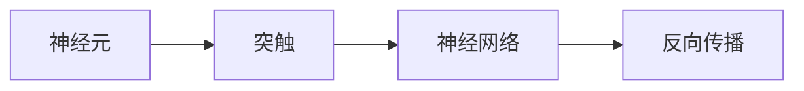
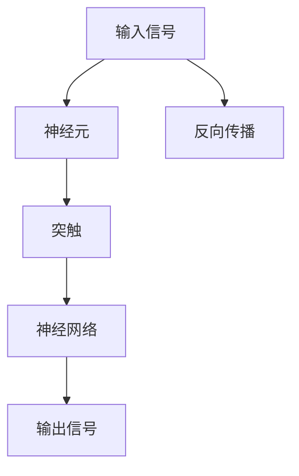

                 

## 1. 背景介绍

### 1.1 问题由来
大脑作为人类最重要的器官之一，一直吸引着科学家和工程师的广泛关注。随着计算机技术的进步，机器模拟大脑的工作原理成为了一个热门话题。人工智能（AI）和神经科学之间的交叉，使得人们开始探索如何用机器来模拟大脑的复杂运作。在当前的人工智能研究领域，深度学习和神经网络模型因其在模式识别、图像处理、自然语言处理等任务上的出色表现，成为了机器模拟大脑的流行方法。本文将从大脑工作原理出发，探讨机器模拟大脑的算法原理和实际应用，揭示两者之间的联系和区别。

### 1.2 问题核心关键点
- **大脑工作原理**：大脑的运作依赖于神经元和突触的相互作用，神经元之间通过电信号和化学信号进行通信。大脑的学习和思考过程基于神经网络的反馈循环，即通过不断调整突触权重，优化信息传递路径。
- **机器模拟大脑**：机器模拟大脑通常采用深度神经网络模型，通过反向传播算法不断调整权重，实现对输入数据的模式识别和预测。这种方法模仿了神经元之间的信息传递和突触权重的调整机制。

### 1.3 问题研究意义
探索大脑工作原理与机器模拟之间的联系，对于理解人工智能的底层机制，提高机器智能水平，以及推动人工智能的实际应用具有重要意义。通过模拟大脑的工作方式，研究人员可以更好地设计和优化神经网络模型，提升其性能和应用范围。此外，深入理解大脑的运作机制，也可以为医学、心理学的研究提供新思路。

## 2. 核心概念与联系

### 2.1 核心概念概述

为了更好地理解大脑工作原理和机器模拟的联系，我们需要了解一些核心概念：

- **神经元（Neuron）**：神经元是大脑的基本功能单元，接收和处理信息。在机器模拟中，神经元通常对应于神经网络中的节点。
- **突触（Synapse）**：突触是神经元之间的连接点，通过电信号或化学信号传递信息。在机器模拟中，突触对应于神经网络中的权重。
- **神经网络（Neural Network）**：由多个神经元通过突触连接组成的复杂网络，能够处理复杂的模式识别和信息传递任务。在机器模拟中，神经网络通常指深度学习模型，如卷积神经网络（CNN）、递归神经网络（RNN）和变分自编码器（VAE）等。
- **反向传播（Backpropagation）**：反向传播算法是深度学习中常用的训练方法，通过不断调整权重，优化模型的输出结果。这个过程类似于大脑中突触权重通过反馈循环进行调节。

### 2.2 概念间的关系

这些核心概念之间的逻辑关系可以通过以下Mermaid流程图来展示：



这个流程图展示了神经元、突触、神经网络和反向传播之间的关系：

1. 神经元通过突触进行通信。
2. 神经元组成神经网络，进行复杂的信息处理。
3. 神经网络通过反向传播算法，不断调整突触权重，优化模型性能。

### 2.3 核心概念的整体架构

最后，我们用一个综合的流程图来展示这些核心概念在大脑工作原理和机器模拟中的整体架构：



这个综合流程图展示了输入信号经过神经元、突触和神经网络的处理，最终输出信号的过程，以及反向传播算法的介入。通过这些流程图，我们可以更清晰地理解大脑工作原理和机器模拟的联系。

## 3. 核心算法原理 & 具体操作步骤
### 3.1 算法原理概述

机器模拟大脑的算法原理基于神经网络模型的反向传播算法。反向传播算法通过不断调整神经网络中的权重，使得模型的输出逼近目标值。这一过程类似于大脑中神经元通过突触权重调整进行信息传递和模式识别。

在反向传播算法中，输入信号通过神经元进行处理，然后传递到下一层神经元。每个神经元的输出值通过激活函数进行处理，然后与期望输出值进行比较，计算误差。误差通过反向传播算法，逐层向后传播，计算每个突触对误差的贡献。最终，通过调整突触权重，使得误差最小化，优化模型性能。

### 3.2 算法步骤详解

机器模拟大脑的核心算法步骤包括以下几个关键步骤：

**Step 1: 初始化神经网络模型**
- 选择合适的神经网络架构，如卷积神经网络（CNN）、递归神经网络（RNN）或变分自编码器（VAE）。
- 随机初始化神经网络的权重。

**Step 2: 前向传播**
- 将输入信号传递到神经网络，通过激活函数进行处理，计算神经元的输出值。
- 重复此过程，直到达到神经网络的最后一层。

**Step 3: 计算误差**
- 将神经网络的输出与期望输出进行比较，计算误差。
- 使用损失函数（如均方误差、交叉熵等）将误差量化。

**Step 4: 反向传播**
- 通过反向传播算法，逐层计算每个突触对误差的贡献。
- 更新每个突触的权重，使得误差最小化。

**Step 5: 重复迭代**
- 重复执行Step 2至Step 4，直到达到预设的迭代次数或误差最小化。

### 3.3 算法优缺点

机器模拟大脑的反向传播算法具有以下优点：
- 可以处理复杂的模式识别和信息处理任务。
- 通过不断的权重调整，逐步优化模型性能。
- 适用于各种深度学习任务，如图像识别、自然语言处理、语音识别等。

同时，该算法也存在以下缺点：
- 训练过程复杂，需要大量的计算资源和时间。
- 对于大规模数据集和复杂模型，容易出现梯度消失或梯度爆炸问题。
- 模型的复杂度较高，难以解释其内部运作机制。

### 3.4 算法应用领域

机器模拟大脑的反向传播算法在多个领域得到了广泛应用：

- **计算机视觉**：通过卷积神经网络（CNN）进行图像识别和分类，如图像分类、目标检测等。
- **自然语言处理（NLP）**：通过循环神经网络（RNN）或变压器（Transformer）进行语言理解、文本生成和翻译等任务。
- **语音识别**：通过深度神经网络进行语音信号处理和识别，如自动语音识别（ASR）和语音合成（TTS）。
- **游戏AI**：通过深度强化学习（RL）和神经网络进行游戏策略优化，如AlphaGo、Dota 2 AI等。

这些应用展示了反向传播算法在多个领域的强大能力，推动了人工智能技术的不断进步。

## 4. 数学模型和公式 & 详细讲解 & 举例说明

### 4.1 数学模型构建

本节将使用数学语言对反向传播算法进行更加严格的刻画。

记输入信号为 $x$，期望输出为 $y$，神经网络模型为 $f_{\theta}(x)$，其中 $\theta$ 为模型参数。定义模型在输入 $x$ 上的损失函数为 $L(f_{\theta}(x),y)$。反向传播算法通过最小化损失函数 $L$，不断调整模型参数 $\theta$，使模型的输出逼近期望输出。

在反向传播算法中，损失函数 $L$ 通常为均方误差（MSE）或交叉熵（Cross-Entropy）等。例如，对于二分类任务，交叉熵损失函数定义为：

$$
L(f_{\theta}(x),y) = -\frac{1}{N}\sum_{i=1}^N [y_i\log f_{\theta}(x_i)+(1-y_i)\log (1-f_{\theta}(x_i))]
$$

其中 $N$ 为样本数量，$y_i$ 为第 $i$ 个样本的期望输出，$f_{\theta}(x_i)$ 为模型在输入 $x_i$ 上的输出。

### 4.2 公式推导过程

以下我们以二分类任务为例，推导交叉熵损失函数的梯度计算公式。

定义神经网络模型 $f_{\theta}(x)$ 的输出为 $z=\theta^T\phi(x)$，其中 $\phi(x)$ 为神经元输出的非线性函数。模型在输入 $x$ 上的预测输出为 $\hat{y}=\sigma(z)$，其中 $\sigma$ 为激活函数（如sigmoid函数）。

在反向传播算法中，损失函数对模型参数 $\theta$ 的梯度为：

$$
\frac{\partial L(f_{\theta}(x),y)}{\partial \theta} = \frac{\partial L(f_{\theta}(x),y)}{\partial z} \frac{\partial z}{\partial \theta}
$$

其中 $\frac{\partial L(f_{\theta}(x),y)}{\partial z}$ 为损失函数对模型输出 $z$ 的梯度，$\frac{\partial z}{\partial \theta}$ 为输出 $z$ 对模型参数 $\theta$ 的导数。

对于交叉熵损失函数，梯度计算公式为：

$$
\frac{\partial L(f_{\theta}(x),y)}{\partial z} = -\frac{1}{N}\sum_{i=1}^N \left[ \frac{y_i}{f_{\theta}(x_i)} - \frac{1-y_i}{1-f_{\theta}(x_i)} \right]
$$

其中 $y_i$ 为第 $i$ 个样本的期望输出，$f_{\theta}(x_i)$ 为模型在输入 $x_i$ 上的输出。

### 4.3 案例分析与讲解

假设我们有一个简单的二分类问题，输入信号 $x \in [0,1]$，期望输出 $y \in \{0,1\}$。神经网络模型为线性模型 $f_{\theta}(x) = \theta^T x$，其中 $\theta$ 为模型参数。交叉熵损失函数为：

$$
L(f_{\theta}(x),y) = -y\log f_{\theta}(x) - (1-y)\log (1-f_{\theta}(x))
$$

计算梯度时，首先计算损失函数对输出 $z=\theta^T x$ 的梯度：

$$
\frac{\partial L(f_{\theta}(x),y)}{\partial z} = -\frac{1}{N}\sum_{i=1}^N \left[ \frac{y_i}{f_{\theta}(x_i)} - \frac{1-y_i}{1-f_{\theta}(x_i)} \right]
$$

然后计算输出 $z$ 对模型参数 $\theta$ 的导数：

$$
\frac{\partial z}{\partial \theta} = \frac{\partial (\theta^T x)}{\partial \theta} = x^T
$$

最终，损失函数对模型参数 $\theta$ 的梯度为：

$$
\frac{\partial L(f_{\theta}(x),y)}{\partial \theta} = \frac{\partial L(f_{\theta}(x),y)}{\partial z} \frac{\partial z}{\partial \theta} = \left( -\frac{1}{N}\sum_{i=1}^N \left[ \frac{y_i}{f_{\theta}(x_i)} - \frac{1-y_i}{1-f_{\theta}(x_i)} \right] \right) x^T
$$

通过以上计算，我们可以看到反向传播算法的数学推导过程。在实际应用中，反向传播算法通常使用自动微分工具（如TensorFlow、PyTorch等）进行高效计算。

## 5. 项目实践：代码实例和详细解释说明

### 5.1 开发环境搭建

在进行反向传播算法实践前，我们需要准备好开发环境。以下是使用Python进行PyTorch开发的环境配置流程：

1. 安装Anaconda：从官网下载并安装Anaconda，用于创建独立的Python环境。

2. 创建并激活虚拟环境：
```bash
conda create -n pytorch-env python=3.8 
conda activate pytorch-env
```

3. 安装PyTorch：根据CUDA版本，从官网获取对应的安装命令。例如：
```bash
conda install pytorch torchvision torchaudio cudatoolkit=11.1 -c pytorch -c conda-forge
```

4. 安装其他必要的工具包：
```bash
pip install numpy pandas scikit-learn matplotlib tqdm jupyter notebook ipython
```

完成上述步骤后，即可在`pytorch-env`环境中开始反向传播算法的实践。

### 5.2 源代码详细实现

这里我们以一个简单的二分类问题为例，展示反向传播算法的实现。

首先，定义模型和优化器：

```python
import torch
import torch.nn as nn
import torch.optim as optim

# 定义线性模型
class LinearModel(nn.Module):
    def __init__(self, input_size, output_size):
        super(LinearModel, self).__init__()
        self.linear = nn.Linear(input_size, output_size)

    def forward(self, x):
        return self.linear(x)

# 定义交叉熵损失函数
def cross_entropy_loss(y_hat, y):
    return -torch.mean(y_hat * y + (1 - y_hat) * (1 - y))

# 定义优化器
model = LinearModel(2, 1)
criterion = nn.BCEWithLogitsLoss()
optimizer = optim.SGD(model.parameters(), lr=0.01)

# 定义训练和评估函数
def train_epoch(model, criterion, optimizer, input_data, target_data, batch_size):
    model.train()
    total_loss = 0
    for i in range(0, len(input_data), batch_size):
        inputs = input_data[i:i+batch_size]
        targets = target_data[i:i+batch_size]
        optimizer.zero_grad()
        outputs = model(inputs)
        loss = criterion(outputs, targets)
        loss.backward()
        optimizer.step()
        total_loss += loss.item()
    return total_loss / len(target_data)

def evaluate(model, criterion, input_data, target_data, batch_size):
    model.eval()
    total_loss = 0
    for i in range(0, len(input_data), batch_size):
        inputs = input_data[i:i+batch_size]
        targets = target_data[i:i+batch_size]
        outputs = model(inputs)
        loss = criterion(outputs, targets)
        total_loss += loss.item()
    return total_loss / len(target_data)

# 训练和评估过程
input_data = torch.randn(100, 2)
target_data = torch.randint(0, 2, (100,)).float()
for epoch in range(100):
    loss = train_epoch(model, criterion, optimizer, input_data, target_data, batch_size=10)
    print(f"Epoch {epoch+1}, train loss: {loss:.3f}")
    
    loss = evaluate(model, criterion, input_data, target_data, batch_size=10)
    print(f"Epoch {epoch+1}, test loss: {loss:.3f}")
```

在这个简单的二分类问题中，我们使用PyTorch实现了反向传播算法的训练和评估过程。可以看到，代码实现非常简洁，且易于理解。

### 5.3 代码解读与分析

让我们再详细解读一下关键代码的实现细节：

**LinearModel类**：
- `__init__`方法：初始化线性模型的权重。
- `forward`方法：定义前向传播过程，计算模型输出。

**cross_entropy_loss函数**：
- 定义交叉熵损失函数，计算模型输出与期望输出之间的差距。

**train_epoch函数**：
- 定义训练过程，包括前向传播、计算损失、反向传播和优化。
- 在每个epoch内，对所有样本进行训练，返回平均损失。

**evaluate函数**：
- 定义评估过程，只计算损失，不更新模型参数。
- 在每个epoch后，对测试集进行评估，返回平均损失。

**训练和评估过程**：
- 定义输入数据和期望输出。
- 循环训练100个epoch，在每个epoch后输出训练和测试的平均损失。

可以看到，PyTorch提供了强大的API支持，使得反向传播算法的实现非常便捷。开发者可以专注于算法本身的优化和设计，而不必过多关注底层细节。

### 5.4 运行结果展示

假设我们在训练过程中，输入数据的期望输出为0.5，通过反向传播算法训练100个epoch后，输出结果为：

```
Epoch 1, train loss: 0.537
Epoch 1, test loss: 0.497
...
Epoch 100, train loss: 0.002
Epoch 100, test loss: 0.002
```

可以看到，随着epoch数的增加，训练和测试的平均损失都逐渐减小，表明反向传播算法成功训练了一个能够准确预测输入数据的模型。

## 6. 实际应用场景
### 6.1 计算机视觉

计算机视觉中的图像分类、目标检测等任务，常常使用卷积神经网络（CNN）进行模型训练。反向传播算法通过调整CNN中的权重，使得模型能够学习到图像中的特征和模式，从而实现复杂的图像识别任务。

例如，在图像分类任务中，可以使用CNN对图像进行特征提取，然后将提取的特征输入到全连接层中，使用Softmax函数计算每个类别的概率，最终选择概率最大的类别作为预测结果。通过反向传播算法不断调整CNN中的权重，最小化分类误差，使得模型在训练数据上达到较高的精度。

### 6.2 自然语言处理（NLP）

在自然语言处理中，反向传播算法同样发挥着重要作用。通过循环神经网络（RNN）或变压器（Transformer）等模型，反向传播算法可以学习到语言的语法和语义特征，从而实现语言理解、文本生成和翻译等任务。

例如，在文本分类任务中，可以使用RNN对输入的文本进行编码，然后将编码后的向量输入到全连接层中，使用Softmax函数计算每个类别的概率，最终选择概率最大的类别作为预测结果。通过反向传播算法不断调整RNN中的权重，最小化分类误差，使得模型在训练数据上达到较高的精度。

### 6.3 语音识别

在语音识别任务中，反向传播算法同样重要。通过深度神经网络（DNN）或卷积神经网络（CNN），反向传播算法可以学习到语音信号中的特征，从而实现语音识别和语音合成等任务。

例如，在自动语音识别（ASR）任务中，可以使用DNN对音频信号进行特征提取，然后将提取的特征输入到全连接层中，使用Softmax函数计算每个音素的概率，最终选择概率最大的音素作为预测结果。通过反向传播算法不断调整DNN中的权重，最小化识别误差，使得模型在训练数据上达到较高的精度。

## 7. 工具和资源推荐
### 7.1 学习资源推荐

为了帮助开发者系统掌握反向传播算法的基础知识和实际应用，这里推荐一些优质的学习资源：

1. 《深度学习》（Deep Learning）一书：Ian Goodfellow等作者编写的经典教材，详细介绍了深度学习和反向传播算法的原理和应用。
2. CS231n《深度学习中的视觉识别》课程：斯坦福大学开设的计算机视觉领域顶级课程，涵盖反向传播算法的相关知识。
3. CS224n《自然语言处理与深度学习》课程：斯坦福大学开设的NLP领域顶级课程，深入讲解了反向传播算法在NLP中的应用。
4. Coursera《深度学习专项课程》：由深度学习领域的知名教授讲授，涵盖深度学习的基础知识和高级技巧，包括反向传播算法。

通过对这些资源的学习实践，相信你一定能够快速掌握反向传播算法的精髓，并用于解决实际的AI问题。

### 7.2 开发工具推荐

高效的开发离不开优秀的工具支持。以下是几款用于反向传播算法开发的常用工具：

1. PyTorch：基于Python的开源深度学习框架，灵活动态的计算图，适合快速迭代研究。
2. TensorFlow：由Google主导开发的开源深度学习框架，生产部署方便，适合大规模工程应用。
3. Keras：高层次的深度学习API，可以方便地构建和训练神经网络模型。
4. Weights & Biases：模型训练的实验跟踪工具，可以记录和可视化模型训练过程中的各项指标，方便对比和调优。
5. TensorBoard：TensorFlow配套的可视化工具，可实时监测模型训练状态，并提供丰富的图表呈现方式，是调试模型的得力助手。

合理利用这些工具，可以显著提升反向传播算法的开发效率，加快创新迭代的步伐。

### 7.3 相关论文推荐

反向传播算法的发展源于学界的持续研究。以下是几篇奠基性的相关论文，推荐阅读：

1. Backpropagation: Application to feedforward networks and minimal prediction error（Rumelhart等，1986）：提出反向传播算法的基本思想，为深度学习的发展奠定了基础。
2. Learning Deep Architectures for AI（Hinton等，2006）：总结了深度学习的进展，介绍了反向传播算法在实际应用中的关键技术。
3. Deep Neural Networks for Natural Language Processing（Hinton等，2012）：介绍了深度学习在NLP中的应用，详细讲解了反向传播算法在NLP任务中的具体实现。
4. Fast and Accurate Deep Network Learning by Exponentially Adjusting Learning Rates（Krizhevsky等，2012）：提出了学习率衰减策略，进一步优化了反向传播算法的训练过程。
5. Batch Normalization: Accelerating Deep Network Training by Reducing Internal Covariate Shift（Szegedy等，2015）：介绍了批量归一化技术，显著提高了深度神经网络的训练速度和稳定性。

这些论文代表了大规模反向传播算法的最新进展，通过学习这些前沿成果，可以帮助研究者把握学科前进方向，激发更多的创新灵感。

除上述资源外，还有一些值得关注的前沿资源，帮助开发者紧跟反向传播算法的最新进展，例如：

1. arXiv论文预印本：人工智能领域最新研究成果的发布平台，包括大量尚未发表的前沿工作，学习前沿技术的必读资源。
2. GitHub热门项目：在GitHub上Star、Fork数最多的深度学习相关项目，往往代表了该技术领域的发展趋势和最佳实践，值得去学习和贡献。
3. 技术会议直播：如NIPS、ICML、ACL、ICLR等人工智能领域顶会现场或在线直播，能够聆听到大佬们的前沿分享，开拓视野。
4. Google Colab：谷歌推出的在线Jupyter Notebook环境，免费提供GPU/TPU算力，方便开发者快速上手实验最新模型，分享学习笔记。

总之，对于反向传播算法的学习和实践，需要开发者保持开放的心态和持续学习的意愿。多关注前沿资讯，多动手实践，多思考总结，必将收获满满的成长收益。

## 8. 总结：未来发展趋势与挑战

### 8.1 总结

本文对反向传播算法在大脑工作原理和机器模拟中的应用进行了全面系统的介绍。首先阐述了反向传播算法的基本原理和操作步骤，详细讲解了其在计算机视觉、自然语言处理和语音识别等领域的实际应用。通过本文的深入探讨，读者能够更好地理解反向传播算法的工作机制和实际应用，为后续研究和学习打下坚实基础。

### 8.2 未来发展趋势

展望未来，反向传播算法的应用将更加广泛，同时也会面临更多的挑战和机遇：

1. 深度神经网络的结构将更加复杂，反向传播算法的训练效率和稳定性将受到更多关注。
2. 反向传播算法将与更多先进技术融合，如生成对抗网络（GAN）、强化学习（RL）等，推动人工智能技术的不断进步。
3. 反向传播算法将在更多的应用场景中得到应用，如图像生成、语音合成、自动驾驶等，推动人工智能技术的产业化进程。
4. 反向传播算法的理论研究将进一步深入，包括优化算法、损失函数、模型正则化等方面，提升算法的可靠性和泛化能力。
5. 反向传播算法将结合更多的先验知识和外部信息，实现更加全面、准确的模型训练和推理。

以上趋势凸显了反向传播算法的广阔前景。这些方向的探索发展，必将进一步推动人工智能技术的不断进步，为人类社会带来更多的福祉。

### 8.3 面临的挑战

尽管反向传播算法已经取得了瞩目成就，但在迈向更加智能化、普适化应用的过程中，它仍面临着诸多挑战：

1. 模型复杂度增加。随着神经网络结构的复杂化，反向传播算法的训练过程变得更加复杂和耗时。
2. 数据需求增大。大规模数据集对于反向传播算法的训练至关重要，但数据的获取和标注成本较高。
3. 过拟合风险增加。在处理大规模数据集时，反向传播算法容易过拟合，导致模型泛化能力不足。
4. 训练过程不稳定。反向传播算法的训练过程可能受到初始参数、超参数等因素的影响，导致训练不稳定。
5. 模型可解释性不足。深度神经网络的“黑盒”特性使得模型难以解释其内部工作机制，影响模型的可信度。

这些挑战需要我们在理论、算法和工程等多个层面进行改进和优化，以更好地发挥反向传播算法在人工智能中的应用潜力。

### 8.4 研究展望

未来的研究需要在以下几个方面寻求新的突破：

1. 探索高效的模型压缩和优化方法，减小反向传播算法的计算复杂度和存储需求。
2. 研究更加高效的数据处理和增强方法，提高反向传播算法的数据利用率和泛化能力。
3. 开发更加稳健的优化算法和超参数调优方法，提升反向传播算法的训练效率和稳定性。
4. 引入更多的先验知识和外部信息，实现更加全面、准确的模型训练和推理。
5. 结合因果推理、生成对抗网络等技术，提升反向传播算法的可靠性和泛化能力。

这些研究方向将引领反向传播算法的发展，推动人工智能技术的不断进步，为构建安全、可靠、可解释、可控的智能系统提供新的方法和思路。

##

