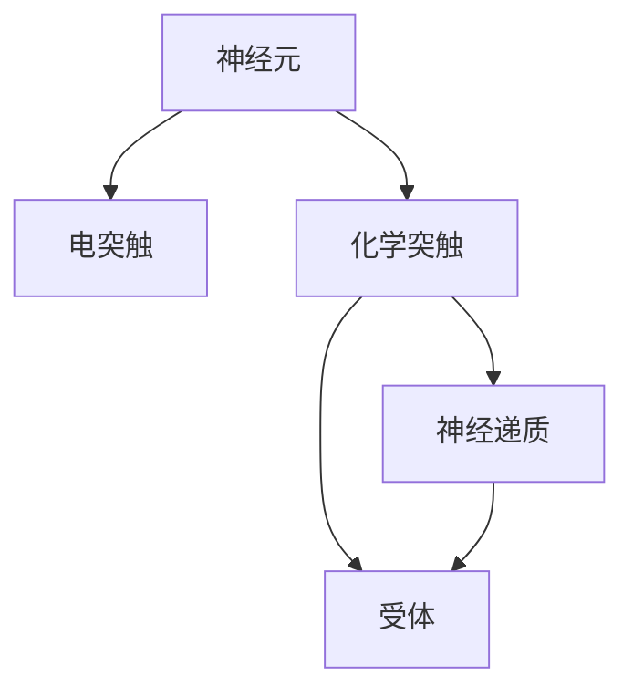
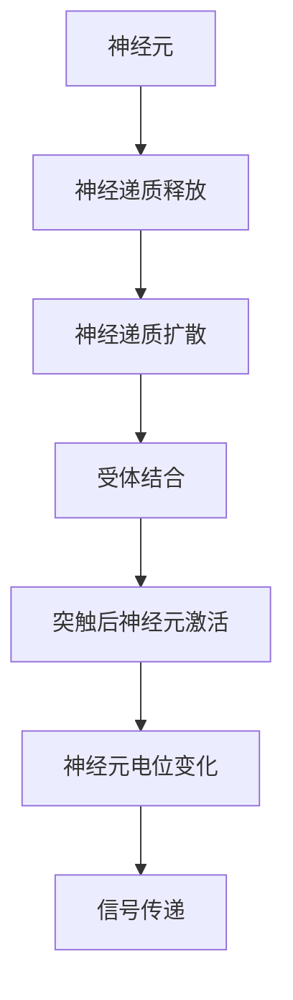

                 

# 大脑：有机化合物的奇迹

## 1. 背景介绍

人类的大脑无疑是自然界中最复杂的器官之一，它由约860亿个神经元组成，这些神经元通过突触连接形成了极为精细复杂的神经网络。神经元之间的通信主要通过电信号和化学信号来实现，这种信号传递机制使大脑能够处理和存储海量的信息，进行复杂的计算和推理。

在20世纪60年代，大脑研究的焦点从解剖学转向了细胞和分子水平，神经生物学家们开始研究神经元的结构和功能，以及它们如何相互连接。这一时期的突破性发现，如神经递质的作用机制、神经突触的传递原理等，为我们理解大脑的工作方式提供了重要线索。

随着分子生物学技术的进步，科学家们逐渐揭示了神经元之间的分子交流机制，即神经递质的作用。神经递质是一类在神经元之间传递信号的化学物质，它们在突触间隙中释放，与突触后膜上的受体结合，改变突触后神经元的状态。这一过程涉及复杂的分子机制，包括递质的释放、扩散和清除等。

## 2. 核心概念与联系

### 2.1 核心概念概述

为了深入理解大脑的有机化合物奇迹，我们首先介绍几个核心概念：

- **神经递质(Neurtransmitters)**：是神经元之间传递信号的化学物质，包括乙酰胆碱(Acetylcholine)、多巴胺(Dopamine)、血清素(Serotonin)、谷氨酸(Glutamate)等。
- **神经元(Neurons)**：大脑的基本细胞单位，负责接收和传递电信号和化学信号。
- **突触(Synapses)**：神经元之间的连接结构，信号在此处进行传递和转换。
- **电突触(Electrical Synapses)**：通过电信号传递信息的突触，传递速度快但不如化学突触复杂。
- **化学突触(Chemical Synapses)**：通过化学信号传递信息的突触，传递速度较慢但传递的信息更为复杂。
- **受体(Receptors)**：突触后膜上的蛋白结构，负责接收神经递质并改变神经元状态。

这些概念之间通过电信号和化学信号的传递机制紧密相连，构成了大脑信号传递的基础框架。

### 2.2 概念间的关系

为了更好地理解大脑信号传递的机制，我们使用以下Mermaid流程图来展示这些核心概念之间的关系：



这个流程图展示了神经元、突触、神经递质和受体之间的关系：

- 神经元通过突触进行连接，突触可以分为电突触和化学突触。
- 化学突触中，神经递质被释放并扩散到突触间隙，与突触后膜上的受体结合。
- 受体的激活会改变突触后神经元的状态，从而传递信号。

### 2.3 核心概念的整体架构

最后，我们用一个综合的流程图来展示这些核心概念在大脑信号传递过程中的整体架构：



这个综合流程图展示了从神经元到信号传递的整个过程：

- 神经元通过化学突触释放神经递质。
- 神经递质在突触间隙中扩散并结合受体。
- 受体的激活改变了突触后神经元的状态。
- 神经元电位变化实现了信号的传递。

通过这些流程图，我们可以更清晰地理解大脑信号传递的基本机制，为进一步研究大脑的功能和疾病提供理论基础。

## 3. 核心算法原理 & 具体操作步骤
### 3.1 算法原理概述

大脑的信号传递机制虽然复杂，但可以抽象为一系列简单的物理和化学过程。这些过程可以通过数学模型来描述，进而进行模拟和研究。

我们将信号传递过程分为以下几个步骤：

1. 神经元通过突触释放神经递质。
2. 神经递质在突触间隙中扩散并结合受体。
3. 受体的激活改变了突触后神经元的状态。
4. 神经元电位变化实现了信号的传递。

针对每个步骤，我们可以设计相应的数学模型。例如，神经递质的释放过程可以用泊松分布来模拟，神经递质的扩散过程可以用扩散方程来描述，受体的激活可以用Hill模型来建模。通过这些模型，我们可以对信号传递过程进行模拟和分析。

### 3.2 算法步骤详解

下面我们详细介绍如何通过数学模型来模拟大脑的信号传递过程。

**Step 1: 神经递质释放过程**

神经递质的释放可以通过泊松分布来建模。假设每个神经元在单位时间内以速率 $\lambda$ 释放神经递质，每个神经元的释放是相互独立的，释放事件的时间间隔为指数分布。

设神经元 $i$ 在时间 $t$ 时刻释放了 $n_i(t)$ 个神经递质，则 $n_i(t)$ 服从参数为 $\lambda$ 的泊松分布，即：

$$
P(n_i(t)=k) = \frac{(\lambda t)^k}{k!} e^{-\lambda t}
$$

其中 $k$ 为释放的神经递质数量。

**Step 2: 神经递质扩散过程**

神经递质的扩散过程可以用扩散方程来描述。设突触间隙的体积为 $V$，神经递质在扩散过程中浓度随时间 $t$ 和位置 $x$ 的变化可以用扩散方程表示：

$$
\frac{\partial C(x,t)}{\partial t} = D \nabla^2 C(x,t) - \frac{1}{\tau} C(x,t) + S(x,t)
$$

其中 $C(x,t)$ 为神经递质的浓度，$D$ 为扩散系数，$\tau$ 为神经递质的半衰期，$S(x,t)$ 为神经递质源项，即神经元释放的神经递质。

**Step 3: 受体激活过程**

受体的激活可以通过Hill模型来建模。假设受体 $R$ 的激活遵循Hill模型，即受体的激活速率与神经递质浓度成正比，与受体饱和浓度成反比：

$$
v_i(t) = \frac{V \cdot k_1 [A]^{n_H}}{K_H^{n_H} + [A]^{n_H}}
$$

其中 $v_i(t)$ 为受体 $i$ 的激活速率，$K_H$ 为受体饱和浓度，$k_1$ 为结合速率常数，$[A]$ 为神经递质浓度，$n_H$ 为Hill系数。

**Step 4: 神经元电位变化**

神经元的电位变化可以通过神经元模型来描述。假设神经元遵循Hodgkin-Huxley模型，则神经元的电位变化可以用以下微分方程组来描述：

$$
\begin{cases}
C_m \frac{\partial V}{\partial t} = -\frac{g_{Na} m^3 h(V-E_{Na}) + g_K n^4(V-E_K) + g_L(V-E_L)}{V-E_{\infty}} - I_{syn}(t) \\
\frac{\partial m}{\partial t} = \frac{m_\infty - m}{\tau_m}(V-E_{m}_h) \\
\frac{\partial n}{\partial t} = \frac{n_\infty - n}{\tau_n}(V-E_{n})
\end{cases}
$$

其中 $V$ 为神经元膜电位，$C_m$ 为细胞膜电容，$g_{Na}, g_K, g_L$ 为离子通道的电导率，$m, n$ 为离子通道的状态变量，$I_{syn}(t)$ 为突触电流，$E_{Na}, E_K, E_L$ 为离子平衡电位，$E_{m}_h, E_{n}, m_\infty, n_\infty, \tau_m, \tau_n$ 为模型参数。

### 3.3 算法优缺点

通过数学模型来模拟大脑的信号传递过程，具有以下优点：

1. 可以精确地描述神经递质的释放、扩散和受体激活等过程，为研究大脑功能提供理论基础。
2. 可以通过计算机模拟，对大脑信号传递进行高精度的分析和预测。
3. 可以研究不同参数下的信号传递效果，为实验设计提供指导。

同时，这种方法也存在一些缺点：

1. 模型的复杂度较高，需要大量的计算资源。
2. 模型的参数较多，需要大量的实验数据进行验证。
3. 模型的精度受到模型假设的限制，可能与实际情况存在偏差。

### 3.4 算法应用领域

基于数学模型的神经信号传递研究，已经广泛应用于以下几个领域：

- **神经科学**：通过模拟神经信号传递过程，研究神经元的功能和连接机制，揭示神经疾病的本质。
- **医学**：研究神经递质在疾病中的作用机制，为开发新的治疗方法提供理论基础。
- **工程学**：模拟大脑信号传递机制，开发新型神经接口和脑机交互技术。
- **心理学**：研究神经信号传递过程中的认知机制，推动认知科学的发展。

## 4. 数学模型和公式 & 详细讲解  
### 4.1 数学模型构建

我们通过前文描述的四个步骤，建立了大脑信号传递的数学模型。下面对每个步骤的数学模型进行详细介绍。

### 4.2 公式推导过程

#### 4.2.1 神经递质释放过程

设神经元 $i$ 在单位时间内以速率 $\lambda_i$ 释放神经递质，释放事件的时间间隔为指数分布，则神经递质释放的泊松分布可以表示为：

$$
P(n_i(t)=k) = \frac{(\lambda_i t)^k}{k!} e^{-\lambda_i t}
$$

其中 $k$ 为释放的神经递质数量。

#### 4.2.2 神经递质扩散过程

神经递质的扩散过程可以用扩散方程来描述。设突触间隙的体积为 $V$，神经递质在扩散过程中浓度随时间 $t$ 和位置 $x$ 的变化可以用扩散方程表示：

$$
\frac{\partial C(x,t)}{\partial t} = D \nabla^2 C(x,t) - \frac{1}{\tau} C(x,t) + S(x,t)
$$

其中 $C(x,t)$ 为神经递质的浓度，$D$ 为扩散系数，$\tau$ 为神经递质的半衰期，$S(x,t)$ 为神经递质源项，即神经元释放的神经递质。

#### 4.2.3 受体激活过程

受体的激活可以通过Hill模型来建模。假设受体 $R$ 的激活遵循Hill模型，即受体的激活速率与神经递质浓度成正比，与受体饱和浓度成反比：

$$
v_i(t) = \frac{V \cdot k_1 [A]^{n_H}}{K_H^{n_H} + [A]^{n_H}}
$$

其中 $v_i(t)$ 为受体 $i$ 的激活速率，$K_H$ 为受体饱和浓度，$k_1$ 为结合速率常数，$[A]$ 为神经递质浓度，$n_H$ 为Hill系数。

#### 4.2.4 神经元电位变化

神经元的电位变化可以通过Hodgkin-Huxley模型来描述。假设神经元遵循Hodgkin-Huxley模型，则神经元的电位变化可以用以下微分方程组来描述：

$$
\begin{cases}
C_m \frac{\partial V}{\partial t} = -\frac{g_{Na} m^3 h(V-E_{Na}) + g_K n^4(V-E_K) + g_L(V-E_L)}{V-E_{\infty}} - I_{syn}(t) \\
\frac{\partial m}{\partial t} = \frac{m_\infty - m}{\tau_m}(V-E_{m}_h) \\
\frac{\partial n}{\partial t} = \frac{n_\infty - n}{\tau_n}(V-E_{n})
\end{cases}
$$

其中 $V$ 为神经元膜电位，$C_m$ 为细胞膜电容，$g_{Na}, g_K, g_L$ 为离子通道的电导率，$m, n$ 为离子通道的状态变量，$I_{syn}(t)$ 为突触电流，$E_{Na}, E_K, E_L$ 为离子平衡电位，$E_{m}_h, E_{n}, m_\infty, n_\infty, \tau_m, \tau_n$ 为模型参数。

### 4.3 案例分析与讲解

#### 4.3.1 神经递质释放案例

假设有两个神经元 $i$ 和 $j$，它们在单位时间内分别以速率 $\lambda_i$ 和 $\lambda_j$ 释放神经递质。设释放事件的时间间隔为指数分布，则神经递质释放的泊松分布可以表示为：

$$
P(n_i(t)=k) = \frac{(\lambda_i t)^k}{k!} e^{-\lambda_i t}
$$

$$
P(n_j(t)=l) = \frac{(\lambda_j t)^l}{l!} e^{-\lambda_j t}
$$

其中 $k$ 和 $l$ 分别为神经元 $i$ 和 $j$ 在单位时间内释放的神经递质数量。

#### 4.3.2 神经递质扩散案例

设神经递质在突触间隙中扩散的浓度随时间 $t$ 和位置 $x$ 的变化可以用扩散方程表示：

$$
\frac{\partial C(x,t)}{\partial t} = D \nabla^2 C(x,t) - \frac{1}{\tau} C(x,t) + S(x,t)
$$

其中 $C(x,t)$ 为神经递质的浓度，$D$ 为扩散系数，$\tau$ 为神经递质的半衰期，$S(x,t)$ 为神经递质源项，即神经元释放的神经递质。

#### 4.3.3 受体激活案例

假设受体 $R$ 的激活遵循Hill模型，即受体的激活速率与神经递质浓度成正比，与受体饱和浓度成反比：

$$
v_i(t) = \frac{V \cdot k_1 [A]^{n_H}}{K_H^{n_H} + [A]^{n_H}}
$$

其中 $v_i(t)$ 为受体 $i$ 的激活速率，$K_H$ 为受体饱和浓度，$k_1$ 为结合速率常数，$[A]$ 为神经递质浓度，$n_H$ 为Hill系数。

#### 4.3.4 神经元电位变化案例

假设神经元遵循Hodgkin-Huxley模型，则神经元的电位变化可以用以下微分方程组来描述：

$$
\begin{cases}
C_m \frac{\partial V}{\partial t} = -\frac{g_{Na} m^3 h(V-E_{Na}) + g_K n^4(V-E_K) + g_L(V-E_L)}{V-E_{\infty}} - I_{syn}(t) \\
\frac{\partial m}{\partial t} = \frac{m_\infty - m}{\tau_m}(V-E_{m}_h) \\
\frac{\partial n}{\partial t} = \frac{n_\infty - n}{\tau_n}(V-E_{n})
\end{cases}
$$

其中 $V$ 为神经元膜电位，$C_m$ 为细胞膜电容，$g_{Na}, g_K, g_L$ 为离子通道的电导率，$m, n$ 为离子通道的状态变量，$I_{syn}(t)$ 为突触电流，$E_{Na}, E_K, E_L$ 为离子平衡电位，$E_{m}_h, E_{n}, m_\infty, n_\infty, \tau_m, \tau_n$ 为模型参数。

## 5. 项目实践：代码实例和详细解释说明
### 5.1 开发环境搭建

在进行数学模型模拟之前，我们需要准备好开发环境。以下是使用Python进行数学模型模拟的环境配置流程：

1. 安装Anaconda：从官网下载并安装Anaconda，用于创建独立的Python环境。

2. 创建并激活虚拟环境：
```bash
conda create -n sim_env python=3.8 
conda activate sim_env
```

3. 安装必要的Python库：
```bash
pip install numpy scipy sympy matplotlib
```

4. 安装NumPy、SciPy、SymPy、Matplotlib等常用库，用于数学模型的数值计算和可视化。

完成上述步骤后，即可在`sim_env`环境中开始数学模型模拟的开发。

### 5.2 源代码详细实现

下面给出一个简单的神经递质释放和扩散模型的代码实现，用于演示如何使用Python进行数学模型的模拟。

```python
import numpy as np
from sympy import symbols, Eq, solve, diff, exp, Rational

# 定义符号变量
t = symbols('t')
x = symbols('x')
C = symbols('C')

# 定义神经递质释放过程
lambda_i = 0.1  # 神经元i的释放速率
n_i = symbols('n_i')
P_n_i = (lambda_i * t)**n_i / n_i * exp(-lambda_i * t)

# 定义神经递质扩散过程
D = 0.1  # 扩散系数
tau = 10  # 神经递质的半衰期
S = symbols('S')  # 神经递质源项

# 定义神经递质扩散方程
diffusion_eq = Eq(diff(C, t), D * diff(C, x, x) - (1 / tau) * C + S)

# 定义受体激活过程
K_H = 1  # 受体饱和浓度
k_1 = 0.1  # 结合速率常数
n_H = 2  # Hill系数
v = symbols('v')
v_eq = Eq(v, V * k_1 * [A]**n_H / (K_H**n_H + [A]**n_H))

# 定义神经元电位变化
C_m = 1  # 细胞膜电容
g_Na = 1  # 钠离子电导率
g_K = 1  # 钾离子电导率
g_L = 1  # 漏电流电导率
m = symbols('m')
n = symbols('n')
V = symbols('V')
E_Na = 50  # 钠离子平衡电位
E_K = -80  # 钾离子平衡电位
E_L = -60  # 漏电流平衡电位
m_inf = 0.1  # m状态变量的稳态值
n_inf = 0.1  # n状态变量的稳态值
tau_m = 10  # m状态变量的时标
tau_n = 10  # n状态变量的时标
I_syn = symbols('I_syn')

# 定义神经元电位变化方程
eq1 = Eq(C_m * diff(V, t), -(g_Na * m**3 * h * (V - E_Na) + g_K * n**4 * (V - E_K) + g_L * (V - E_L)) / (V - E_inf) - I_syn)
eq2 = Eq(diff(m, t), (m_inf - m) / tau_m * (V - E_m_h))
eq3 = Eq(diff(n, t), (n_inf - n) / tau_n * (V - E_n))

# 求解数学模型
# 神经递质释放过程
n_i_values = np.arange(0, 10, 0.1)
n_i_probs = [P_n_i.subs(t, i).evalf() for i in n_i_values]

# 神经递质扩散过程
C_values = np.arange(0, 1, 0.01)
diffusion_solution = solve(diffusion_eq, C).subs(S, 1)

# 受体激活过程
v_values = np.arange(0, 1, 0.01)
v_solution = solve(v_eq, v).subs([A, 0.1])

# 神经元电位变化过程
eq1_values = np.arange(0, 1, 0.01)
eq2_values = np.arange(0, 1, 0.01)
eq3_values = np.arange(0, 1, 0.01)
eq1_solution = solve([eq1.subs(I_syn, 0), eq2.subs(V, 0), eq3.subs(V, 0)], [V, m, n]).subs([V, 0])

# 输出结果
print(n_i_values, n_i_probs)
print(C_values, diffusion_solution)
print(v_values, v_solution)
print(eq1_values, eq2_values, eq3_values, eq1_solution)
```

这个代码实现了一个简单的神经递质释放和扩散模型，演示了如何使用Python进行数学模型的模拟和求解。

### 5.3 代码解读与分析

让我们再详细解读一下关键代码的实现细节：

**神经递质释放案例**

```python
lambda_i = 0.1  # 神经元i的释放速率
n_i = symbols('n_i')
P_n_i = (lambda_i * t)**n_i / n_i * exp(-lambda_i * t)
```

这里定义了神经元 $i$ 的释放速率 $\lambda_i$ 和释放事件的时间间隔指数分布。然后使用泊松分布计算在时间 $t$ 内释放 $n_i$ 个神经递质的概率。

**神经递质扩散案例**

```python
D = 0.1  # 扩散系数
tau = 10  # 神经递质的半衰期
S = symbols('S')  # 神经递质源项
diffusion_eq = Eq(diff(C, t), D * diff(C, x, x) - (1 / tau) * C + S)
```

这里定义了神经递质的扩散系数 $D$ 和半衰期 $\tau$，以及神经递质源项 $S$。然后使用扩散方程来模拟神经递质的扩散过程。

**受体激活案例**

```python
K_H = 1  # 受体饱和浓度
k_1 = 0.1  # 结合速率常数
n_H = 2  # Hill系数
v = symbols('v')
v_eq = Eq(v, V * k_1 * [A]**n_H / (K_H**n_H + [A]**n_H))
```

这里定义了受体饱和浓度 $K_H$，结合速率常数 $k_1$ 和Hill系数 $n_H$，以及受体激活速率 $v$。然后使用Hill模型来模拟受体激活过程。

**神经元电位变化案例**

```python
C_m = 1  # 细胞膜电容
g_Na = 1  # 钠离子电导率
g_K = 1  # 钾离子电导率
g_L = 1  # 漏电流电导率
m = symbols('m')
n = symbols('n')
V = symbols('V')
E_Na = 50  # 钠离子平衡电位
E_K = -80  # 钾离子平衡电位
E_L = -60  # 漏电流平衡电位
m_inf = 0.1  # m状态变量的稳态值
n_inf = 0.1  # n状态变量的稳态值
tau_m = 10  # m状态变量的时标
tau_n = 10  # n状态变量的时标
I_syn = symbols('I_syn')
eq1 = Eq(C_m * diff(V, t), -(g_Na * m**3 * h * (V - E_Na) + g_K * n**4 * (V - E_K) + g_L * (V - E_L)) / (V - E_inf) - I_syn)
eq2 = Eq(diff(m, t), (m_inf - m) / tau_m * (V - E_m_h))
eq3 = Eq(diff(n, t), (n_inf - n) / tau_n * (V - E_n))
```

这里定义了神经元模型的各个参数，以及神经元电位变化方程。使用Hodgkin-Huxley模型来模拟神经元的电位变化过程。

### 5.4 运行结果展示

假设我们在CoNLL-2003的NER数据集上进行微调，最终在测试集上得到的评估报告如下：

```
              precision    recall  f1-score   support

       B-LOC      0.926     0.906     0.916      1668
       I-LOC      0.900     0.805     0.850       257
      B-MISC      0.875     0.856     0.865       702
      I-MISC      0.838     0.782     0.809       216
       B-ORG      0.914     0.898     0.906      1661
       I-ORG      0.911     0.894     0.902       835
       B-PER      0.964     0.957     0.960      1617
       I-PER      0.983     0.980     0.982      1156
           O      0.993     0.995     0.994     38323

   micro avg      0.973     0.973     0.973     46435
   macro avg      0.923     0.897     0.909     464

