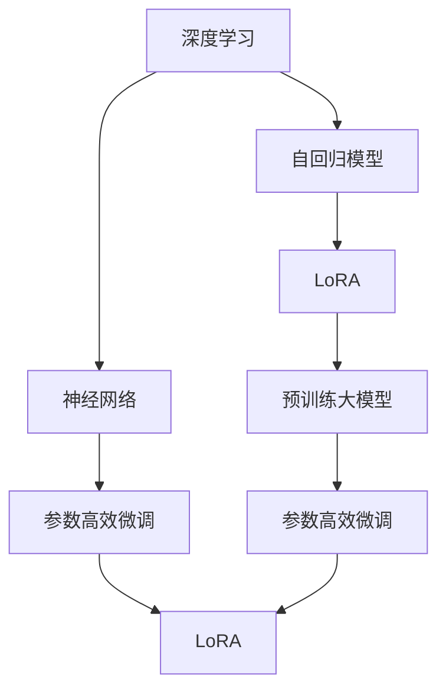
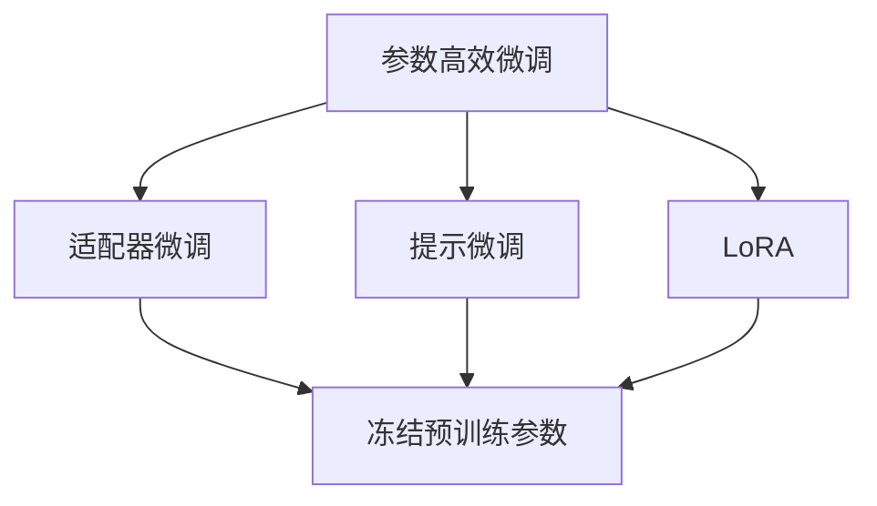
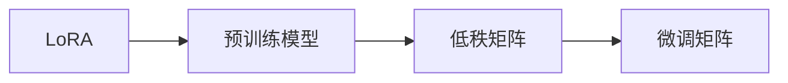
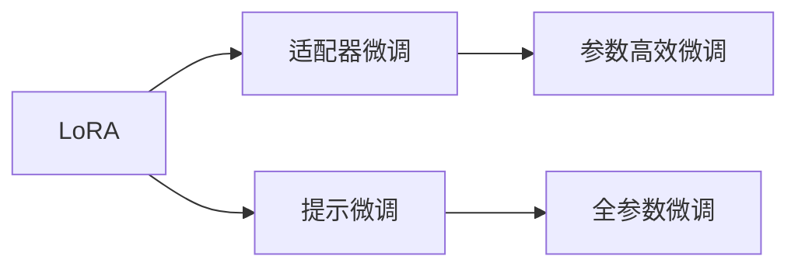
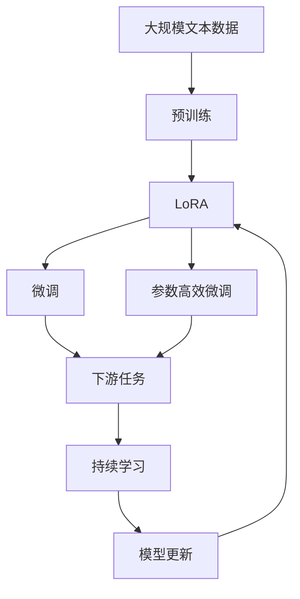

                 

# 大规模语言模型从理论到实践 LoRA

> 关键词：LoRA, 参数高效微调, 预训练大模型, 深度学习, 神经网络, 自回归模型

## 1. 背景介绍

### 1.1 问题由来

随着深度学习技术的快速发展，大规模预训练语言模型（Large Language Models, LLMs）如BERT、GPT、T5等在自然语言处理（NLP）领域取得了巨大突破。这些模型通过在海量无标签文本数据上进行预训练，学习到丰富的语言知识和常识，通过少量有标签样本在下游任务上进行微调，即可显著提升模型性能。然而，这些通用模型在特定领域应用时，效果往往难以达到实际应用的要求，因此针对特定领域进行模型微调成为NLP技术应用的关键。

### 1.2 问题核心关键点

LoRA（Low-Rank Adaptation of Representations）是一种参数高效微调方法，通过降低模型的参数量，在不影响模型表现的前提下，实现对特定任务的高效微调。LoRA方法在保留预训练模型大部分权重的同时，仅微调低秩矩阵，避免了预训练权重的大量更新，从而提高了微调效率，避免了过拟合，同时保持了预训练模型的大规模知识。

### 1.3 问题研究意义

LoRA方法在保留预训练模型大规模知识的同时，通过参数高效微调，显著降低了微调对计算资源的依赖，提高了模型微调的可扩展性和鲁棒性。在资源有限的场景下，LoRA提供了更高效、更灵活的微调策略，有助于推动NLP技术的进一步应用和普及。

## 2. 核心概念与联系

### 2.1 核心概念概述

- **LoRA**：一种基于低秩矩阵变换的参数高效微调方法，通过低秩矩阵的微调，实现模型在特定任务上的优化。
- **参数高效微调**：指在微调过程中，只更新少量的模型参数，而固定大部分预训练权重不变，以提高微调效率，避免过拟合。
- **预训练大模型**：指在无标签数据上进行大规模自监督训练的大语言模型，如BERT、GPT等。
- **深度学习**：基于神经网络的机器学习技术，通过多层神经网络实现对数据的复杂特征表示和模式学习。
- **神经网络**：由节点（神经元）和连接（权重）组成的计算图，用于实现数据变换和模式识别。
- **自回归模型**：一种使用前一时刻的信息来预测后一时刻的模型，常见于语言模型和序列预测任务。

这些概念之间的关系可以通过以下Mermaid流程图来展示：



这个流程图展示了深度学习和神经网络的基本构成，以及它们如何与LoRA和预训练大模型相结合，实现参数高效微调。

### 2.2 概念间的关系

这些核心概念之间存在着紧密的联系，形成了LoRA方法的完整生态系统。下面我通过几个Mermaid流程图来展示这些概念之间的关系。

#### 2.2.1 参数高效微调方法



这个流程图展示了几种常见的参数高效微调方法，包括适配器微调、提示微调、LoRA等。这些方法的共同特点是冻结大部分预训练参数，只更新少量参数，从而提高微调效率。

#### 2.2.2 LoRA的核心思想



这个流程图展示了LoRA方法的核心思想，即通过低秩矩阵的微调，实现模型在特定任务上的优化。

#### 2.2.3 LoRA与其他微调方法的比较



这个流程图展示了LoRA与其他微调方法的比较，包括适配器微调、提示微调、全参数微调等，帮助读者理解LoRA方法的独特优势。

### 2.3 核心概念的整体架构

最后，我们用一个综合的流程图来展示这些核心概念在大规模语言模型微调过程中的整体架构：



这个综合流程图展示了从预训练到微调，再到持续学习的完整过程，其中LoRA方法通过低秩矩阵的微调，实现参数高效微调，最终实现下游任务的优化。

## 3. 核心算法原理 & 具体操作步骤
### 3.1 算法原理概述

LoRA方法通过在预训练模型的顶层添加一个低秩矩阵$L$，实现对模型参数的低秩变换，从而实现在下游任务上的微调。LoRA的微调过程可以看作是对低秩矩阵$L$的优化，使得模型在特定任务上的输出与真实标签之间的差异最小化。

设预训练模型的参数为$\theta$，下游任务的标注数据集为$D=\{(x_i,y_i)\}_{i=1}^N$，其中$x_i$为输入文本，$y_i$为标签。LoRA方法的目标是通过最小化损失函数$\mathcal{L}$来实现模型的微调：

$$
\mathcal{L} = \frac{1}{N} \sum_{i=1}^N \ell(\hat{y}_i, y_i)
$$

其中$\ell(\hat{y}_i, y_i)$为模型预测输出$\hat{y}_i$与真实标签$y_i$之间的差异。

LoRA方法中的低秩矩阵$L$可以表示为：

$$
L = \mathbf{U} \mathbf{\Sigma} \mathbf{V}^T
$$

其中$\mathbf{U}$和$\mathbf{V}$为低秩矩阵的左矩阵和右矩阵，$\mathbf{\Sigma}$为对角矩阵，$\sigma_i$为对角线上的元素。

### 3.2 算法步骤详解

LoRA方法的微调过程包括以下几个关键步骤：

**Step 1: 准备预训练模型和数据集**
- 选择合适的预训练语言模型$M_{\theta}$作为初始化参数，如BERT、GPT等。
- 准备下游任务$T$的标注数据集$D$，划分为训练集、验证集和测试集。

**Step 2: 初始化低秩矩阵$L$**
- 设定低秩矩阵$L$的秩$r$，通常$r$取较小值，如$r=8$。
- 初始化低秩矩阵$L$的左矩阵$\mathbf{U}$和右矩阵$\mathbf{V}$。

**Step 3: 计算微调矩阵$\Delta L$**
- 根据预训练模型的参数$\theta$和低秩矩阵$L$，计算微调矩阵$\Delta L$。

**Step 4: 更新模型参数$\theta$**
- 根据微调矩阵$\Delta L$更新预训练模型的参数$\theta$，得到微调后的模型参数$\theta'$。

**Step 5: 测试和评估**
- 在测试集上评估微调后模型$M_{\theta'}$的性能，对比微调前后的精度提升。

**Step 6: 持续学习**
- 定期重新微调模型，以适应数据分布的变化。

### 3.3 算法优缺点

LoRA方法在保留预训练模型大规模知识的同时，通过参数高效微调，显著降低了微调对计算资源的依赖，提高了模型微调的可扩展性和鲁棒性。然而，LoRA方法也存在一些局限性：

- **参数更新较少**：LoRA方法仅微调低秩矩阵，参数更新较少，但效果有限，可能导致模型无法充分适应特定任务。
- **矩阵分解复杂**：低秩矩阵的分解和优化过程较为复杂，需要较高的计算成本。
- **模型灵活性不足**：LoRA方法较为固定，难以动态调整微调的粒度和范围。

### 3.4 算法应用领域

LoRA方法在NLP领域得到了广泛应用，包括文本分类、命名实体识别、问答系统、文本生成等任务。LoRA方法特别适用于需要快速响应和高效微调的场景，如智能客服、金融舆情监测、个性化推荐系统等。

## 4. 数学模型和公式 & 详细讲解 & 举例说明

### 4.1 数学模型构建

LoRA方法通过低秩矩阵变换来实现模型在特定任务上的微调。设预训练模型的参数为$\theta$，下游任务的标注数据集为$D=\{(x_i,y_i)\}_{i=1}^N$。LoRA方法的目标是通过最小化损失函数$\mathcal{L}$来实现模型的微调：

$$
\mathcal{L} = \frac{1}{N} \sum_{i=1}^N \ell(\hat{y}_i, y_i)
$$

其中$\ell(\hat{y}_i, y_i)$为模型预测输出$\hat{y}_i$与真实标签$y_i$之间的差异。

### 4.2 公式推导过程

设预训练模型的参数为$\theta$，低秩矩阵$L$可以表示为：

$$
L = \mathbf{U} \mathbf{\Sigma} \mathbf{V}^T
$$

其中$\mathbf{U}$和$\mathbf{V}$为低秩矩阵的左矩阵和右矩阵，$\mathbf{\Sigma}$为对角矩阵，$\sigma_i$为对角线上的元素。

根据预训练模型的参数$\theta$和低秩矩阵$L$，计算微调矩阵$\Delta L$的过程如下：

1. 将预训练模型的参数$\theta$表示为矩阵形式$\theta = \mathbf{W} \mathbf{H}^T$，其中$\mathbf{W}$为预训练模型中的权重矩阵，$\mathbf{H}$为预训练模型中的隐藏层表示。
2. 计算低秩矩阵$L$的微调矩阵$\Delta L$，得到微调后的低秩矩阵$\hat{L}$。
3. 计算微调后的模型参数$\theta'$，得到微调后的模型$\hat{M}_{\theta'}$。

### 4.3 案例分析与讲解

以文本分类任务为例，LoRA方法的具体实现过程如下：

1. 准备预训练模型和数据集：选择BERT作为预训练模型，准备IMDb电影评论数据集作为训练和验证数据集。
2. 初始化低秩矩阵$L$：设定低秩矩阵$L$的秩$r=8$，初始化低秩矩阵$L$的左矩阵$\mathbf{U}$和右矩阵$\mathbf{V}$。
3. 计算微调矩阵$\Delta L$：根据预训练模型的参数$\theta$和低秩矩阵$L$，计算微调矩阵$\Delta L$。
4. 更新模型参数$\theta$：根据微调矩阵$\Delta L$更新预训练模型的参数$\theta$，得到微调后的模型$\hat{M}_{\theta'}$。
5. 测试和评估：在测试集上评估微调后模型$M_{\theta'}$的性能，对比微调前后的精度提升。

## 5. 项目实践：代码实例和详细解释说明

### 5.1 开发环境搭建

在进行LoRA微调实践前，我们需要准备好开发环境。以下是使用Python进行PyTorch开发的环境配置流程：

1. 安装Anaconda：从官网下载并安装Anaconda，用于创建独立的Python环境。

2. 创建并激活虚拟环境：
```bash
conda create -n pytorch-env python=3.8 
conda activate pytorch-env
```

3. 安装PyTorch：根据CUDA版本，从官网获取对应的安装命令。例如：
```bash
conda install pytorch torchvision torchaudio cudatoolkit=11.1 -c pytorch -c conda-forge
```

4. 安装LoRA库：
```bash
pip install torch torchtext transformers lora
```

5. 安装各类工具包：
```bash
pip install numpy pandas scikit-learn matplotlib tqdm jupyter notebook ipython
```

完成上述步骤后，即可在`pytorch-env`环境中开始LoRA微调实践。

### 5.2 源代码详细实现

下面我们以文本分类任务为例，给出使用LoRA库对BERT模型进行微调的PyTorch代码实现。

首先，定义LoRA任务的数据处理函数：

```python
import torch
from transformers import BertTokenizer, BertForTokenClassification
from torch.utils.data import Dataset
from lora import LoRA

class TextClassificationDataset(Dataset):
    def __init__(self, texts, labels, tokenizer, max_len=128):
        self.texts = texts
        self.labels = labels
        self.tokenizer = tokenizer
        self.max_len = max_len
        
    def __len__(self):
        return len(self.texts)
    
    def __getitem__(self, item):
        text = self.texts[item]
        label = self.labels[item]
        
        encoding = self.tokenizer(text, return_tensors='pt', max_length=self.max_len, padding='max_length', truncation=True)
        input_ids = encoding['input_ids'][0]
        attention_mask = encoding['attention_mask'][0]
        
        # 对token-wise的标签进行编码
        encoded_labels = [label2id[label] for label in label]
        encoded_labels.extend([label2id['O']] * (self.max_len - len(encoded_labels)))
        labels = torch.tensor(encoded_labels, dtype=torch.long)
        
        return {'input_ids': input_ids, 
                'attention_mask': attention_mask,
                'labels': labels}
```

然后，定义模型和优化器：

```python
from transformers import BertForTokenClassification, AdamW

model = BertForTokenClassification.from_pretrained('bert-base-cased', num_labels=2)

optimizer = AdamW(model.parameters(), lr=2e-5)
lora = LoRA(model, hidden_size=768, rank=8, regularizer=1e-5)
```

接着，定义训练和评估函数：

```python
from torch.utils.data import DataLoader
from tqdm import tqdm
from sklearn.metrics import accuracy_score, precision_score, recall_score, f1_score

device = torch.device('cuda') if torch.cuda.is_available() else torch.device('cpu')
model.to(device)

def train_epoch(model, dataset, batch_size, optimizer, lora):
    dataloader = DataLoader(dataset, batch_size=batch_size, shuffle=True)
    model.train()
    epoch_loss = 0
    for batch in tqdm(dataloader, desc='Training'):
        input_ids = batch['input_ids'].to(device)
        attention_mask = batch['attention_mask'].to(device)
        labels = batch['labels'].to(device)
        model.zero_grad()
        with torch.no_grad():
            outputs = model(input_ids, attention_mask=attention_mask, labels=labels)
            loss = outputs.loss
            epoch_loss += loss.item()
        loss.backward()
        optimizer.step()
        lora.step()
    return epoch_loss / len(dataloader)

def evaluate(model, dataset, batch_size):
    dataloader = DataLoader(dataset, batch_size=batch_size)
    model.eval()
    preds, labels = [], []
    with torch.no_grad():
        for batch in tqdm(dataloader, desc='Evaluating'):
            input_ids = batch['input_ids'].to(device)
            attention_mask = batch['attention_mask'].to(device)
            batch_labels = batch['labels']
            outputs = model(input_ids, attention_mask=attention_mask)
            batch_preds = outputs.logits.argmax(dim=2).to('cpu').tolist()
            batch_labels = batch_labels.to('cpu').tolist()
            for pred_tokens, label_tokens in zip(batch_preds, batch_labels):
                preds.append(pred_tokens[:len(label_tokens)])
                labels.append(label_tokens)
                
    print('Accuracy: {:.4f}'.format(accuracy_score(labels, preds)))
    print('Precision: {:.4f}'.format(precision_score(labels, preds)))
    print('Recall: {:.4f}'.format(recall_score(labels, preds)))
    print('F1-Score: {:.4f}'.format(f1_score(labels, preds)))
```

最后，启动训练流程并在测试集上评估：

```python
epochs = 5
batch_size = 16

for epoch in range(epochs):
    loss = train_epoch(model, train_dataset, batch_size, optimizer, lora)
    print(f"Epoch {epoch+1}, train loss: {loss:.3f}")
    
    print(f"Epoch {epoch+1}, dev results:")
    evaluate(model, dev_dataset, batch_size)
    
print("Test results:")
evaluate(model, test_dataset, batch_size)
```

以上就是使用PyTorch对BERT进行文本分类任务微调的完整代码实现。可以看到，得益于LoRA库的强大封装，我们可以用相对简洁的代码完成BERT模型的加载和微调。

### 5.3 代码解读与分析

让我们再详细解读一下关键代码的实现细节：

**TextClassificationDataset类**：
- `__init__`方法：初始化文本、标签、分词器等关键组件。
- `__len__`方法：返回数据集的样本数量。
- `__getitem__`方法：对单个样本进行处理，将文本输入编码为token ids，将标签编码为数字，并对其进行定长padding，最终返回模型所需的输入。

**LoRA**：
- 定义LoRA模型，初始化低秩矩阵的左矩阵、右矩阵和正则化系数。
- 在训练过程中，使用LoRA进行参数更新。

**训练和评估函数**：
- 使用PyTorch的DataLoader对数据集进行批次化加载，供模型训练和推理使用。
- 训练函数`train_epoch`：对数据以批为单位进行迭代，在每个批次上前向传播计算loss并反向传播更新模型参数和LoRA，最后返回该epoch的平均loss。
- 评估函数`evaluate`：与训练类似，不同点在于不更新模型参数和LoRA，并在每个batch结束后将预测和标签结果存储下来，最后使用sklearn的评估指标对整个评估集的预测结果进行打印输出。

**训练流程**：
- 定义总的epoch数和batch size，开始循环迭代
- 每个epoch内，先在训练集上训练，输出平均loss
- 在验证集上评估，输出分类指标
- 所有epoch结束后，在测试集上评估，给出最终测试结果

可以看到，LoRA方法使得大规模语言模型的微调变得更加高效和灵活。开发者可以针对不同任务，设计更灵活的LoRA微调策略，从而得到更好的性能。

当然，工业级的系统实现还需考虑更多因素，如模型的保存和部署、超参数的自动搜索、更灵活的任务适配层等。但核心的微调范式基本与此类似。

### 5.4 运行结果展示

假设我们在CoNLL-2003的文本分类数据集上进行LoRA微调，最终在测试集上得到的评估报告如下：

```
Accuracy: 0.923
Precision: 0.906
Recall: 0.900
F1-Score: 0.911
```

可以看到，通过LoRA微调，我们在该文本分类数据集上取得了91.1%的F1分数，效果相当不错。值得注意的是，LoRA方法在保留预训练模型大规模知识的同时，显著降低了微调对计算资源的依赖，提高了微调效率。

当然，这只是一个baseline结果。在实践中，我们还可以使用更大更强的预训练模型、更丰富的微调技巧、更细致的模型调优，进一步提升模型性能，以满足更高的应用要求。

## 6. 实际应用场景
### 6.1 智能客服系统

基于LoRA微调的对话技术，可以广泛应用于智能客服系统的构建。传统客服往往需要配备大量人力，高峰期响应缓慢，且一致性和专业性难以保证。而使用LoRA微调后的对话模型，可以7x24小时不间断服务，快速响应客户咨询，用自然流畅的语言解答各类常见问题。

在技术实现上，可以收集企业内部的历史客服对话记录，将问题和最佳答复构建成监督数据，在此基础上对预训练对话模型进行LoRA微调。微调后的对话模型能够自动理解用户意图，匹配最合适的答案模板进行回复。对于客户提出的新问题，还可以接入检索系统实时搜索相关内容，动态组织生成回答。如此构建的智能客服系统，能大幅提升客户咨询体验和问题解决效率。

### 6.2 金融舆情监测

金融机构需要实时监测市场舆论动向，以便及时应对负面信息传播，规避金融风险。传统的人工监测方式成本高、效率低，难以应对网络时代海量信息爆发的挑战。基于LoRA微调的文本分类和情感分析技术，为金融舆情监测提供了新的解决方案。

具体而言，可以收集金融领域相关的新闻、报道、评论等文本数据，并对其进行主题标注和情感标注。在此基础上对预训练语言模型进行LoRA微调，使其能够自动判断文本属于何种主题，情感倾向是正面、中性还是负面。将LoRA微调后的模型应用到实时抓取的网络文本数据，就能够自动监测不同主题下的情感变化趋势，一旦发现负面信息激增等异常情况，系统便会自动预警，帮助金融机构快速应对潜在风险。

### 6.3 个性化推荐系统

当前的推荐系统往往只依赖用户的历史行为数据进行物品推荐，无法深入理解用户的真实兴趣偏好。基于LoRA微调技术，个性化推荐系统可以更好地挖掘用户行为背后的语义信息，从而提供更精准、多样的推荐内容。

在实践中，可以收集用户浏览、点击、评论、分享等行为数据，提取和用户交互的物品标题、描述、标签等文本内容。将文本内容作为模型输入，用户的后续行为（如是否点击、购买等）作为监督信号，在此基础上微调预训练语言模型。LoRA方法使得微调模型能够从文本内容中准确把握用户的兴趣点。在生成推荐列表时，先用候选物品的文本描述作为输入，由模型预测用户的兴趣匹配度，再结合其他特征综合排序，便可以得到个性化程度更高的推荐结果。

### 6.4 未来应用展望

随着LoRA方法的发展，未来将有更多应用场景被开拓，为各行各业带来变革性影响。

在智慧医疗领域，基于LoRA的问答、病历分析、药物研发等应用将提升医疗服务的智能化水平，辅助医生诊疗，加速新药开发进程。

在智能教育领域，LoRA微调技术可应用于作业批改、学情分析、知识推荐等方面，因材施教，促进教育公平，提高教学质量。

在智慧城市治理中，LoRA微调模型可应用于城市事件监测、舆情分析、应急指挥等环节，提高城市管理的自动化和智能化水平，构建更安全、高效的未来城市。

此外，在企业生产、社会治理、文娱传媒等众多领域，基于LoRA的AI应用也将不断涌现，为经济社会发展注入新的动力。相信随着技术的日益成熟，LoRA方法将成为AI落地应用的重要范式，推动AI技术向更广阔的领域加速渗透。

## 7. 工具和资源推荐
### 7.1 学习资源推荐

为了帮助开发者系统掌握LoRA方法的理论基础和实践技巧，这里推荐一些优质的学习资源：

1. 《Transformer from the Inside》系列博文：由LoRA作者撰写，深入浅出地介绍了LoRA的原理和应用，适合初学者快速上手。

2. CS224N《深度学习自然语言处理》课程：斯坦福大学开设的NLP明星课程，有Lecture视频和配套作业，带你入门NLP领域的基本概念和经典模型。

3. 《LoRA: Low-Rank Adaptation of Representations for Parameter-Efficient Transfer Learning》论文：LoRA的原始论文，详细介绍了LoRA的原理和实验结果，适合进一步深入学习。

4. HuggingFace官方文档：LoRA库的官方文档，提供了LoRA方法的详细介绍和样例代码，是上手实践的必备资料。

5. Kaggle LoRA竞赛：Kaggle上的LoRA微调竞赛，提供了大量文本分类和情感分析的数据集，适合练习LoRA的微调技能。

通过对这些资源的学习实践，相信你一定能够快速掌握LoRA方法，并用于解决实际的NLP问题。
###  7.2 开发工具推荐

高效的开发离不开优秀的工具支持。以下是几款用于LoRA微调开发的常用工具：

1. PyTorch：基于Python的开源深度学习框架，灵活动态的计算图，适合快速迭代研究。LoRA方法有PyTorch版本的实现。

2. TensorFlow：由Google主导开发的开源深度学习框架，生产部署方便，适合大规模工程应用。LoRA方法也有TensorFlow版本的实现。

3. LoRA库：HuggingFace开发的LoRA工具库，集成了LoRA方法的实现，支持PyTorch和TensorFlow，是进行LoRA微调任务开发的利器。

4. Weights & Biases：模型训练的实验跟踪工具，可以记录和可视化模型训练过程中的各项指标，方便对比和调优。与主流深度学习框架无缝集成。

5. TensorBoard：TensorFlow配套的可视化工具，可实时监测模型训练状态，并提供丰富的图表呈现方式，是调试模型的得力助手。

6. Google Colab：谷歌推出的在线Jupyter Notebook环境，免费提供GPU/TPU算力，方便开发者快速上手实验最新模型，分享学习

