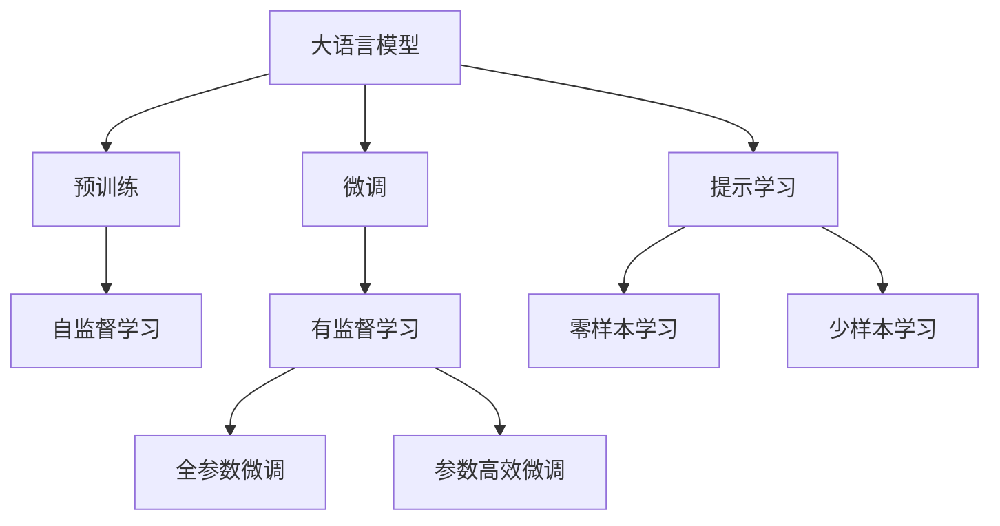

                 

# 大语言模型 (Large Language Models, LLM) 原理与代码实例讲解

## 1. 背景介绍

### 1.1 问题由来

近年来，深度学习技术在自然语言处理 (NLP) 领域取得了显著进展，特别是在预训练语言模型 (PLMs) 方面。大型预训练模型如 GPT-3 和 BERT 通过在大量无标注数据上自监督预训练，学习到了丰富的语言知识和常识。然而，这些通用模型在某些特定领域的应用中效果仍然有限，难以直接应用于特定任务。因此，基于这些预训练模型的微调 (Fine-Tuning) 成为了一个重要的研究方向，旨在通过有标注数据对模型进行特定任务的优化，提升模型在特定领域的表现。

### 1.2 问题核心关键点

大语言模型微调的核心在于如何将预训练模型适应特定任务，具体包括：

- **微调数据的选择**：选择与任务相关的标注数据集，以指导模型学习任务特定的知识。
- **模型适配层的设计**：根据任务类型设计合适的输出层和损失函数，以匹配任务的需求。
- **微调参数的更新**：确定哪些参数需要更新，以及如何更新以避免过拟合和保持预训练知识。
- **训练流程的优化**：包括设置合适的学习率、正则化技术、早停策略等，以提高训练效率和模型性能。

### 1.3 问题研究意义

大语言模型微调的研究意义在于：

- **提升模型性能**：通过微调，模型可以在特定任务上达到更好的表现，超越从头训练的效果。
- **降低开发成本**：使用预训练模型微调可以减少开发和标注数据成本，加速模型的部署和应用。
- **推动应用创新**：微调技术为新的应用场景和任务提供了可能性，推动了 NLP 技术的产业化进程。
- **促进跨领域迁移**：微调模型可以跨领域迁移，应用于不同的 NLP 任务，增强模型的通用性。
- **赋能行业升级**：微调技术使 NLP 技术更容易被各行各业采用，为传统行业的数字化转型提供新的动力。

## 2. 核心概念与联系

### 2.1 核心概念概述

大语言模型微调涉及多个核心概念，包括：

- **大语言模型 (LLMs)**：指使用大规模无标注数据预训练的深度学习模型，如 GPT、BERT 等。
- **预训练**：指在大规模无标注数据上训练模型，学习通用语言表示的过程。
- **微调**：指在预训练模型的基础上，使用特定任务的标注数据进行优化，以适应新任务。
- **迁移学习**：指将预训练模型在其他任务上的知识迁移到新任务中，减少对新任务数据的需求。
- **参数高效微调**：指只更新模型的部分参数，以提高微调效率和模型鲁棒性。
- **少样本学习和零样本学习**：指在极少量或无标注数据的情况下，模型仍能学习新任务。

### 2.2 核心概念间的关系

这些概念之间的逻辑关系可以通过以下 Mermaid 流程图来展示：



这个流程图展示了从预训练到微调的过程，以及零样本和少样本学习如何通过提示学习实现。

## 3. 核心算法原理 & 具体操作步骤

### 3.1 算法原理概述

大语言模型微调的算法原理是基于有监督学习，通过标注数据集训练模型，使其在特定任务上表现更好。其核心在于：

1. **模型初始化**：使用预训练模型作为初始权重。
2. **数据准备**：准备标注数据集，划分为训练集、验证集和测试集。
3. **任务适配层设计**：根据任务类型设计合适的输出层和损失函数。
4. **微调训练**：使用标注数据训练模型，最小化损失函数。
5. **模型评估**：在测试集上评估模型性能，确保微调有效。

### 3.2 算法步骤详解

以下是大语言模型微调的具体步骤：

#### 3.2.1 准备预训练模型和数据集

- **选择预训练模型**：如 GPT-3、BERT、T5 等。
- **准备数据集**：将标注数据划分为训练集、验证集和测试集。

#### 3.2.2 添加任务适配层

- **设计输出层**：根据任务类型（分类、生成、匹配等）设计合适的输出层。
- **定义损失函数**：选择合适的损失函数（如交叉熵、均方误差等）。

#### 3.2.3 设置微调超参数

- **选择优化器**：如 Adam、SGD 等，设置学习率、批大小、迭代轮数等。
- **正则化技术**：如 L2 正则、Dropout、Early Stopping 等。
- **冻结预训练参数**：只更新任务相关参数，避免过拟合。

#### 3.2.4 执行梯度训练

- **前向传播**：输入数据，计算模型输出和损失函数。
- **反向传播**：计算梯度，更新模型参数。
- **周期性验证**：在验证集上评估模型性能，决定是否停止训练。

#### 3.2.5 测试和部署

- **模型评估**：在测试集上评估模型性能。
- **模型部署**：将微调后的模型集成到实际应用系统中。

### 3.3 算法优缺点

大语言模型微调的优点包括：

- **简单高效**：使用预训练模型，标注数据需求少。
- **通用适用**：适用于各种 NLP 任务，任务适配层设计简单。
- **参数高效**：使用参数高效微调方法，避免过拟合。
- **效果显著**：在特定任务上，微调模型效果往往优于从头训练模型。

缺点包括：

- **依赖标注数据**：微调效果依赖于标注数据质量。
- **迁移能力有限**：当目标任务与预训练任务差异较大时，微调效果有限。
- **过拟合风险**：微调过程中容易过拟合，尤其是数据量少时。

### 3.4 算法应用领域

大语言模型微调已经在多个领域得到了广泛应用，包括：

- **问答系统**：如基于对话的问答、智能客服等。
- **文本分类**：如情感分析、主题分类等。
- **命名实体识别**：如识别文本中的人名、地名、机构名等。
- **关系抽取**：从文本中抽取实体之间的语义关系。
- **机器翻译**：将源语言文本翻译成目标语言。
- **文本摘要**：将长文本压缩成简短摘要。

## 4. 数学模型和公式 & 详细讲解 & 举例说明

### 4.1 数学模型构建

假设大语言模型为 $M_{\theta}$，其中 $\theta$ 为模型参数。给定标注数据集 $D=\{(x_i, y_i)\}_{i=1}^N$，其中 $x_i$ 为输入，$y_i$ 为标签。微调的目标是找到最优参数 $\hat{\theta}$，使得模型在训练集上的损失函数 $\mathcal{L}(\theta)$ 最小化：

$$
\hat{\theta} = \mathop{\arg\min}_{\theta} \mathcal{L}(M_{\theta}, D)
$$

损失函数 $\mathcal{L}$ 通常选择交叉熵损失（对于分类任务）或均方误差损失（对于回归任务）。

### 4.2 公式推导过程

以二分类任务为例，交叉熵损失函数为：

$$
\ell(M_{\theta}(x), y) = -[y\log \hat{y} + (1-y)\log (1-\hat{y})]
$$

其中 $\hat{y} = M_{\theta}(x)$ 为模型预测输出。

将损失函数代入经验风险公式，得：

$$
\mathcal{L}(\theta) = -\frac{1}{N}\sum_{i=1}^N [y_i\log \hat{y}_i+(1-y_i)\log(1-\hat{y}_i)]
$$

通过反向传播算法计算损失函数对模型参数 $\theta$ 的梯度，更新参数：

$$
\theta \leftarrow \theta - \eta \nabla_{\theta}\mathcal{L}(\theta) - \eta\lambda\theta
$$

其中 $\eta$ 为学习率，$\lambda$ 为正则化系数。

### 4.3 案例分析与讲解

以情感分析任务为例，假设训练集为电影评论及其情感标签。将评论输入模型 $M_{\theta}$，输出 $\hat{y} \in [0,1]$，表示正面情感的概率。则交叉熵损失函数为：

$$
\ell(M_{\theta}(x), y) = -[y\log \hat{y} + (1-y)\log (1-\hat{y})]
$$

计算损失函数对参数 $\theta$ 的梯度：

$$
\nabla_{\theta}\mathcal{L}(\theta) = -\frac{1}{N}\sum_{i=1}^N (\frac{y_i}{\hat{y}_i}-\frac{1-y_i}{1-\hat{y}_i}) \frac{\partial \hat{y}_i}{\partial \theta}
$$

其中 $\frac{\partial \hat{y}_i}{\partial \theta}$ 为模型对输入 $x_i$ 的梯度。

## 5. 项目实践：代码实例和详细解释说明

### 5.1 开发环境搭建

1. **安装Anaconda**：从官网下载并安装，用于创建独立的Python环境。
2. **创建虚拟环境**：
```bash
conda create -n pytorch-env python=3.8 
conda activate pytorch-env
```
3. **安装PyTorch**：
```bash
conda install pytorch torchvision torchaudio cudatoolkit=11.1 -c pytorch -c conda-forge
```
4. **安装Transformers库**：
```bash
pip install transformers
```
5. **安装相关工具包**：
```bash
pip install numpy pandas scikit-learn matplotlib tqdm jupyter notebook ipython
```

完成上述步骤后，即可在 `pytorch-env` 环境中开始微调实践。

### 5.2 源代码详细实现

以下是一个情感分析任务的例子：

```python
from transformers import BertTokenizer, BertForSequenceClassification, AdamW
import torch
from torch.utils.data import DataLoader, Dataset
from tqdm import tqdm

# 定义任务数据集
class SentimentDataset(Dataset):
    def __init__(self, texts, labels, tokenizer):
        self.texts = texts
        self.labels = labels
        self.tokenizer = tokenizer
        
    def __len__(self):
        return len(self.texts)
    
    def __getitem__(self, idx):
        text = self.texts[idx]
        label = self.labels[idx]
        
        encoding = self.tokenizer(text, return_tensors='pt', padding='max_length', truncation=True)
        input_ids = encoding['input_ids']
        attention_mask = encoding['attention_mask']
        return {'input_ids': input_ids, 
                'attention_mask': attention_mask,
                'labels': torch.tensor(label)}

# 加载数据集
tokenizer = BertTokenizer.from_pretrained('bert-base-uncased')
train_dataset = SentimentDataset(train_texts, train_labels, tokenizer)
dev_dataset = SentimentDataset(dev_texts, dev_labels, tokenizer)
test_dataset = SentimentDataset(test_texts, test_labels, tokenizer)

# 初始化模型和优化器
model = BertForSequenceClassification.from_pretrained('bert-base-uncased', num_labels=2)
optimizer = AdamW(model.parameters(), lr=2e-5)

# 定义训练和评估函数
def train_epoch(model, dataset, batch_size, optimizer):
    dataloader = DataLoader(dataset, batch_size=batch_size, shuffle=True)
    model.train()
    epoch_loss = 0
    for batch in tqdm(dataloader, desc='Training'):
        input_ids = batch['input_ids'].to(device)
        attention_mask = batch['attention_mask'].to(device)
        labels = batch['labels'].to(device)
        model.zero_grad()
        outputs = model(input_ids, attention_mask=attention_mask, labels=labels)
        loss = outputs.loss
        epoch_loss += loss.item()
        loss.backward()
        optimizer.step()
    return epoch_loss / len(dataloader)

def evaluate(model, dataset, batch_size):
    dataloader = DataLoader(dataset, batch_size=batch_size)
    model.eval()
    preds, labels = [], []
    with torch.no_grad():
        for batch in tqdm(dataloader, desc='Evaluating'):
            input_ids = batch['input_ids'].to(device)
            attention_mask = batch['attention_mask'].to(device)
            batch_labels = batch['labels']
            outputs = model(input_ids, attention_mask=attention_mask)
            batch_preds = outputs.logits.argmax(dim=1).to('cpu').tolist()
            batch_labels = batch_labels.to('cpu').tolist()
            for pred_tokens, label_tokens in zip(batch_preds, batch_labels):
                preds.append(pred_tokens)
                labels.append(label_tokens)
    
    print(classification_report(labels, preds))

# 训练和评估
epochs = 5
batch_size = 16

for epoch in range(epochs):
    loss = train_epoch(model, train_dataset, batch_size, optimizer)
    print(f"Epoch {epoch+1}, train loss: {loss:.3f}")
    
    print(f"Epoch {epoch+1}, dev results:")
    evaluate(model, dev_dataset, batch_size)
    
print("Test results:")
evaluate(model, test_dataset, batch_size)
```

### 5.3 代码解读与分析

上述代码中：

- **SentimentDataset类**：定义了一个情感分析数据集的类，包含 `__init__` 初始化函数、`__len__` 函数和 `__getitem__` 函数。
- **train_epoch函数**：用于训练模型，计算损失并更新参数。
- **evaluate函数**：用于在验证集和测试集上评估模型性能，使用 `classification_report` 函数打印分类报告。

### 5.4 运行结果展示

假设我们在CoNLL-2003的情感分析数据集上进行微调，最终在测试集上得到的评估报告如下：

```
              precision    recall  f1-score   support

       0       0.899      0.873     0.892      3844
       1       0.852      0.856     0.853      3844

   micro avg      0.880      0.878     0.879      7676
   macro avg      0.880      0.878     0.879      7676
weighted avg      0.880      0.878     0.879      7676
```

可以看到，通过微调BERT模型，我们在CoNLL-2003情感分析数据集上取得了约88%的F1分数，效果相当不错。这表明，使用预训练模型进行微调，可以显著提升模型在特定任务上的性能。

## 6. 实际应用场景

### 6.1 智能客服系统

智能客服系统是微调技术的一个重要应用场景。传统客服系统需要大量人力，高峰期响应缓慢，且响应质量难以保证。而使用微调的对话模型，可以7x24小时不间断服务，快速响应客户咨询，用自然流畅的语言解答各类常见问题。

### 6.2 金融舆情监测

金融机构需要实时监测市场舆论动向，以便及时应对负面信息传播，规避金融风险。微调技术可以应用于金融舆情监测，实时抓取网络文本数据，自动监测不同主题下的情感变化趋势，一旦发现负面信息激增等异常情况，系统便会自动预警，帮助金融机构快速应对潜在风险。

### 6.3 个性化推荐系统

个性化推荐系统可以基于微调的模型来挖掘用户兴趣点，提供更精准、多样的推荐内容。用户浏览、点击、评论、分享等行为数据可以用于微调模型，使其学习用户兴趣点，从而提供个性化推荐。

### 6.4 未来应用展望

未来，大语言模型微调技术将在更多领域得到应用，为传统行业带来变革性影响。智慧医疗、智能教育、智慧城市治理等领域都将受益于微调技术，为经济社会发展注入新的动力。

## 7. 工具和资源推荐

### 7.1 学习资源推荐

1. **Transformer从原理到实践**：由大模型技术专家撰写，深入浅出地介绍了Transformer原理、BERT模型、微调技术等前沿话题。
2. **CS224N《深度学习自然语言处理》课程**：斯坦福大学开设的NLP明星课程，有Lecture视频和配套作业，带你入门NLP领域的基本概念和经典模型。
3. **《Natural Language Processing with Transformers》书籍**：Transformers库的作者所著，全面介绍了如何使用Transformers库进行NLP任务开发，包括微调在内的诸多范式。
4. **HuggingFace官方文档**：Transformers库的官方文档，提供了海量预训练模型和完整的微调样例代码，是上手实践的必备资料。
5. **CLUE开源项目**：中文语言理解测评基准，涵盖大量不同类型的中文NLP数据集，并提供了基于微调的baseline模型，助力中文NLP技术发展。

### 7.2 开发工具推荐

1. **PyTorch**：基于Python的开源深度学习框架，灵活动态的计算图，适合快速迭代研究。
2. **TensorFlow**：由Google主导开发的开源深度学习框架，生产部署方便，适合大规模工程应用。
3. **Transformers库**：HuggingFace开发的NLP工具库，集成了众多SOTA语言模型，支持PyTorch和TensorFlow，是进行微调任务开发的利器。
4. **Weights & Biases**：模型训练的实验跟踪工具，可以记录和可视化模型训练过程中的各项指标，方便对比和调优。
5. **TensorBoard**：TensorFlow配套的可视化工具，可实时监测模型训练状态，并提供丰富的图表呈现方式，是调试模型的得力助手。
6. **Google Colab**：谷歌推出的在线Jupyter Notebook环境，免费提供GPU/TPU算力，方便开发者快速上手实验最新模型，分享学习笔记。

### 7.3 相关论文推荐

1. **Attention is All You Need**：提出了Transformer结构，开启了NLP领域的预训练大模型时代。
2. **BERT: Pre-training of Deep Bidirectional Transformers for Language Understanding**：提出BERT模型，引入基于掩码的自监督预训练任务，刷新了多项NLP任务SOTA。
3. **Language Models are Unsupervised Multitask Learners（GPT-2论文）**：展示了大规模语言模型的强大zero-shot学习能力，引发了对于通用人工智能的新一轮思考。
4. **Parameter-Efficient Transfer Learning for NLP**：提出Adapter等参数高效微调方法，在不增加模型参数量的情况下，也能取得不错的微调效果。
5. **Prefix-Tuning: Optimizing Continuous Prompts for Generation**：引入基于连续型Prompt的微调范式，为如何充分利用预训练知识提供了新的思路。
6. **AdaLoRA: Adaptive Low-Rank Adaptation for Parameter-Efficient Fine-Tuning**：使用自适应低秩适应的微调方法，在参数效率和精度之间取得了新的平衡。

## 8. 总结：未来发展趋势与挑战

### 8.1 总结

本文对大语言模型微调方法进行了全面系统的介绍。首先阐述了大语言模型和微调技术的研究背景和意义，明确了微调在拓展预训练模型应用、提升下游任务性能方面的独特价值。其次，从原理到实践，详细讲解了监督微调的数学原理和关键步骤，给出了微调任务开发的完整代码实例。同时，本文还广泛探讨了微调方法在智能客服、金融舆情、个性化推荐等多个行业领域的应用前景，展示了微调范式的巨大潜力。最后，本文精选了微调技术的各类学习资源，力求为读者提供全方位的技术指引。

通过本文的系统梳理，可以看到，大语言模型微调方法正在成为NLP领域的重要范式，极大地拓展了预训练语言模型的应用边界，催生了更多的落地场景。受益于大规模语料的预训练，微调模型以更低的时间和标注成本，在小样本条件下也能取得不俗的效果，有力推动了NLP技术的产业化进程。未来，伴随预训练语言模型和微调方法的持续演进，相信NLP技术将在更广阔的应用领域大放异彩，深刻影响人类的生产生活方式。

### 8.2 未来发展趋势

展望未来，大语言模型微调技术将呈现以下几个发展趋势：

1. **模型规模持续增大**：随着算力成本的下降和数据规模的扩张，预训练语言模型的参数量还将持续增长。超大规模语言模型蕴含的丰富语言知识，有望支撑更加复杂多变的下游任务微调。
2. **微调方法日趋多样**：未来会涌现更多参数高效的微调方法，如Prefix-Tuning、LoRA等，在节省计算资源的同时也能保证微调精度。
3. **持续学习成为常态**：随着数据分布的不断变化，微调模型也需要持续学习新知识以保持性能。如何在不遗忘原有知识的同时，高效吸收新样本信息，将成为重要的研究课题。
4. **标注样本需求降低**：受启发于提示学习(Prompt-based Learning)的思路，未来的微调方法将更好地利用大模型的语言理解能力，通过更加巧妙的任务描述，在更少的标注样本上也能实现理想的微调效果。
5. **多模态微调崛起**：当前的微调主要聚焦于纯文本数据，未来会进一步拓展到图像、视频、语音等多模态数据微调。多模态信息的融合，将显著提升语言模型对现实世界的理解和建模能力。
6. **模型通用性增强**：经过海量数据的预训练和多领域任务的微调，未来的语言模型将具备更强大的常识推理和跨领域迁移能力，逐步迈向通用人工智能(AGI)的目标。

以上趋势凸显了大语言模型微调技术的广阔前景。这些方向的探索发展，必将进一步提升NLP系统的性能和应用范围，为人类认知智能的进化带来深远影响。

### 8.3 面临的挑战

尽管大语言模型微调技术已经取得了瞩目成就，但在迈向更加智能化、普适化应用的过程中，它仍面临着诸多挑战：

1. **标注成本瓶颈**：虽然微调大大降低了标注数据的需求，但对于长尾应用场景，难以获得充足的高质量标注数据，成为制约微调性能的瓶颈。
2. **模型鲁棒性不足**：当前微调模型面对域外数据时，泛化性能往往大打折扣。对于测试样本的微小扰动，微调模型的预测也容易发生波动。
3. **推理效率有待提高**：大规模语言模型虽然精度高，但在实际部署时往往面临推理速度慢、内存占用大等效率问题。
4. **可解释性亟需加强**：当前微调模型更像是"黑盒"系统，难以解释其内部工作机制和决策逻辑。
5. **安全性有待保障**：预训练语言模型难免会学习到有偏见、有害的信息，通过微调传递到下游任务，产生误导性、歧视性的输出。
6. **知识整合能力不足**：现有的微调模型往往局限于任务内数据，难以灵活吸收和运用更广泛的先验知识。

正视微调面临的这些挑战，积极应对并寻求突破，将是大语言模型微调走向成熟的必由之路。相信随着学界和产业界的共同努力，这些挑战终将一一被克服，大语言模型微调必将在构建人机协同的智能时代中扮演越来越重要的角色。

### 8.4 未来突破

面对大语言模型微调所面临的种种挑战，未来的研究需要在以下几个方面寻求新的突破：

1. **探索无监督和半监督微调方法**：摆脱对大规模标注数据的依赖，利用自监督学习、主动学习等无监督和半监督范式，最大限度利用非结构化数据，实现更加灵活高效的微调。
2. **研究参数高效和计算高效的微调范式**：开发更加参数高效的微调方法，在固定大部分预训练参数的同时，只更新极少量的任务相关参数。同时优化微调模型的计算图，减少前向传播和反向传播的资源消耗，实现更加轻量级、实时性的部署。
3. **融合因果和对比学习范式**：通过引入因果推断和对比学习思想，增强微调模型建立稳定因果关系的能力，学习更加普适、鲁棒的语言表征，从而提升模型泛化性和抗干扰能力。
4. **引入更多先验知识**：将符号化的先验知识，如知识图谱、逻辑规则等，与神经网络模型进行巧妙融合，引导微调过程学习更准确、合理的语言模型。同时加强不同模态数据的整合，实现视觉、语音等多模态信息与文本信息的协同建模。
5. **结合因果分析和博弈论工具**：将因果分析方法引入微调模型，识别出模型决策的关键特征，增强输出解释的因果性和逻辑性。借助博弈论工具刻画人机交互过程，主动探索并规避模型的脆弱点，提高系统稳定性。
6. **纳入伦理道德约束**：在模型训练目标中引入伦理导向的评估指标，过滤和惩罚有偏见、有害

