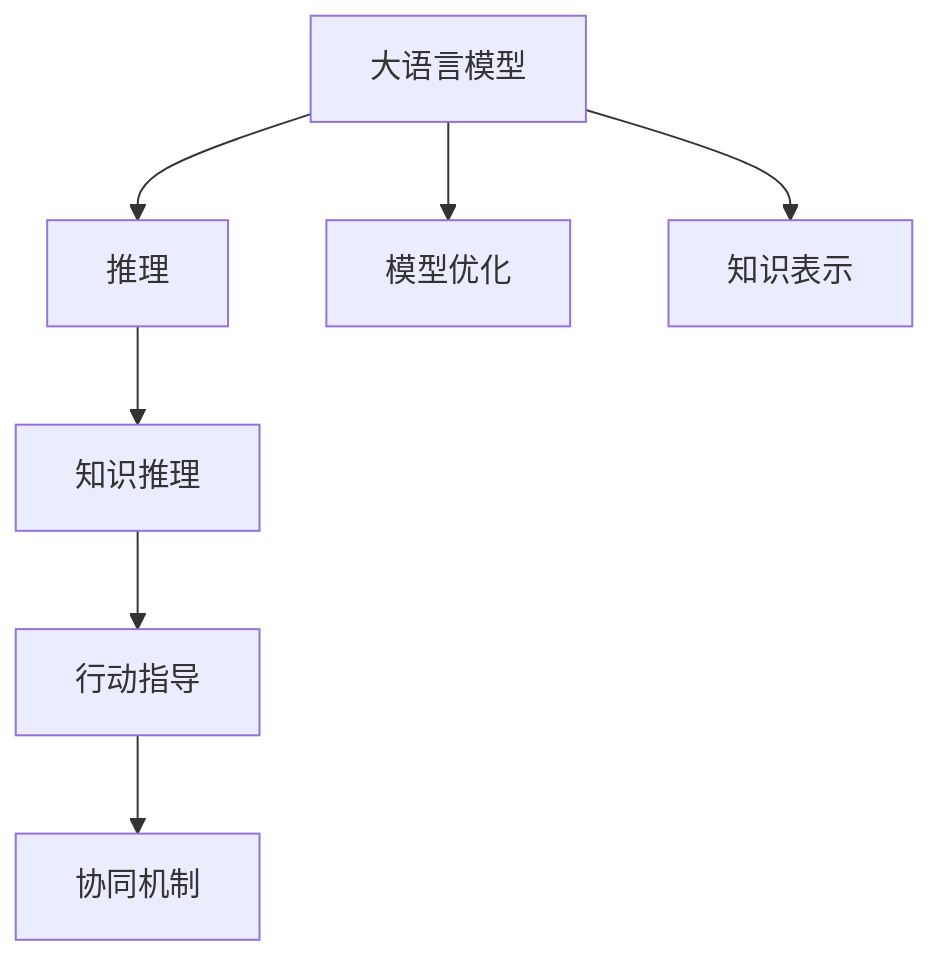
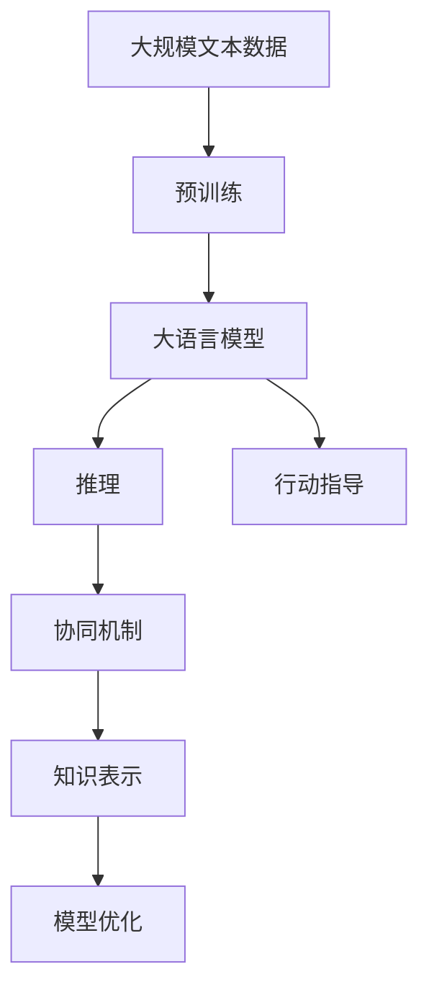
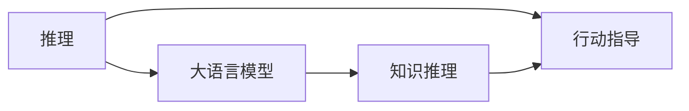
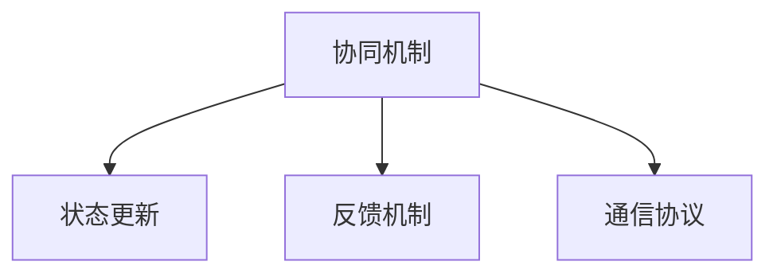
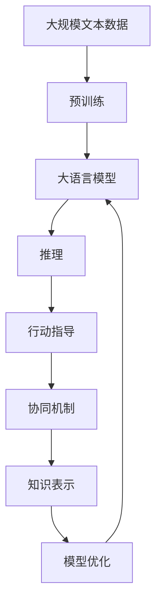
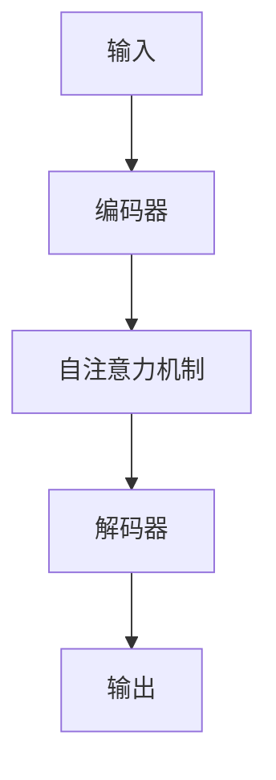

                 

# 大语言模型原理与工程实践：推理和行动协同技术

> 关键词：大语言模型,推理技术,行动协同,自然语言处理(NLP),Transformer,BERT,深度学习,模型优化,应用场景

## 1. 背景介绍

### 1.1 问题由来

近年来，人工智能(AI)领域取得了令人瞩目的进展，大语言模型(Large Language Models, LLMs)在自然语言处理(NLP)、计算机视觉(CV)、语音识别(SR)等诸多领域展示了强大的能力。其中，基于Transformer架构的BERT模型，以及其后续改进模型如GPT-3等，已经成为学术界和工业界的热点。这些模型通过大规模无监督学习，掌握了丰富的语言知识和常识，能够进行复杂的语言推理和生成。然而，在实际应用中，如何高效利用这些模型，以及如何与具体应用场景中的行动系统进行协同，是一个重要的研究方向。

### 1.2 问题核心关键点

推理和行动协同技术，是指将大语言模型与具体的执行系统或决策过程进行结合，使得模型不仅能够理解语言，还能进行决策和行动。这一技术的核心关键点在于：

1. **知识推理**：大语言模型需要能够基于语言知识和先验知识进行推理，以支持复杂问题的解决。
2. **行动指导**：模型需要能够根据推理结果，指导具体的行动或决策过程。
3. **协同机制**：模型与行动系统之间的协同工作机制，需要考虑实时性、鲁棒性和可扩展性。

这一技术的实现，对于提升大语言模型的应用效果，拓展其应用范围，具有重要的意义。

### 1.3 问题研究意义

推理和行动协同技术的研究，将进一步推动大语言模型的应用落地，带来以下几个方面的显著效果：

1. **提高决策质量**：利用大语言模型的知识推理能力，可以帮助决策系统进行更精确的判断和预测，提高决策的准确性和可靠性。
2. **提升执行效率**：通过与行动系统的协同，可以优化决策和行动流程，减少人工干预，提高执行效率。
3. **扩展应用边界**：将大语言模型应用于复杂的场景中，如智慧医疗、智能制造、智能城市等，可以解决实际问题，带来新的应用场景。
4. **增强可解释性**：推理和行动协同技术可以帮助模型输出更具解释性的结果，增强模型的可信度和可解释性。
5. **促进技术创新**：这一技术领域的研究，将推动人工智能技术在多学科融合中的创新，拓展人工智能的边界。

## 2. 核心概念与联系

### 2.1 核心概念概述

为更好地理解推理和行动协同技术，本节将介绍几个密切相关的核心概念：

- **大语言模型(Large Language Model, LLM)**：以Transformer为代表的基于自注意力机制的语言模型。通过在大规模无标签文本数据上进行预训练，学习通用的语言表示，具备强大的语言理解和生成能力。

- **推理(Partner Reasoning)**：指基于语言模型对问题进行理解和推理，形成合理的推断结果。常见于知识图谱、逻辑推理等领域。

- **行动指导**：指推理结果被用于指导具体的行动或决策，包括智能代理、机器人控制等。

- **协同机制**：指推理与行动系统之间的交互和协调机制，包括状态更新、反馈机制等。

- **知识表示**：指在推理过程中，如何表示和利用先验知识，以提升推理的准确性和完备性。

- **模型优化**：指如何对推理和行动协同的模型进行优化，以提升模型的性能和可解释性。

这些核心概念之间的逻辑关系可以通过以下Mermaid流程图来展示：



这个流程图展示了大语言模型推理和行动协同过程的核心概念及其之间的关系：

1. 大语言模型通过预训练获得基础能力。
2. 推理通过语言模型对问题进行理解和推理。
3. 行动指导利用推理结果进行具体的行动或决策。
4. 协同机制实现推理与行动系统的交互和协调。
5. 知识表示在推理过程中利用先验知识，提升推理能力。
6. 模型优化提升推理和行动协同模型的性能和可解释性。

### 2.2 概念间的关系

这些核心概念之间存在着紧密的联系，形成了推理和行动协同技术的完整生态系统。下面通过几个Mermaid流程图来展示这些概念之间的关系。

#### 2.2.1 大语言模型的学习范式



这个流程图展示了大语言模型的推理和行动协同过程的基本原理，包括预训练、推理、行动指导、协同机制、知识表示和模型优化等环节。

#### 2.2.2 推理与行动的协同关系



这个流程图展示了推理与行动指导之间的协同关系，即推理结果被用于指导具体的行动或决策。

#### 2.2.3 协同机制的实施方式



这个流程图展示了协同机制的实施方式，包括状态更新、反馈机制和通信协议等关键环节。

### 2.3 核心概念的整体架构

最后，我们用一个综合的流程图来展示这些核心概念在大语言模型推理和行动协同过程中的整体架构：



这个综合流程图展示了从预训练到推理和行动协同的完整过程。大语言模型首先在大规模文本数据上进行预训练，然后通过推理和行动协同，实现具体任务的应用。通过这些核心概念的协同工作，可以构建出高效、可靠的智能系统。

## 3. 核心算法原理 & 具体操作步骤
### 3.1 算法原理概述

推理和行动协同技术，本质上是通过大语言模型进行知识推理，并指导具体行动的过程。其核心算法原理包括：

1. **知识表示**：利用先验知识对问题进行表示，形成推理的输入。
2. **知识推理**：通过大语言模型对问题进行理解和推理，形成合理的推断结果。
3. **行动指导**：根据推理结果，指导具体的行动或决策。
4. **协同机制**：实现推理与行动系统之间的交互和协调。

### 3.2 算法步骤详解

推理和行动协同技术的核心算法步骤包括：

**Step 1: 准备数据和知识库**

- 收集相关领域的数据和知识，包括结构化数据和文本数据。
- 构建知识图谱，将实体、关系等先验知识表示为图结构。
- 将知识图谱转换为推理模型需要的输入格式。

**Step 2: 预训练模型选择**

- 选择合适的预训练语言模型，如BERT、GPT等。
- 加载预训练模型，设置需要的推理层。

**Step 3: 定义推理任务**

- 根据任务类型，设计推理任务的输入输出格式。
- 定义推理任务的逻辑和推理规则。

**Step 4: 推理过程**

- 将输入数据和知识图谱传入预训练模型进行推理。
- 根据推理结果，更新知识图谱和推理状态。

**Step 5: 行动指导**

- 根据推理结果，设计具体的行动或决策过程。
- 实现行动执行器，对推理结果进行响应。

**Step 6: 协同机制**

- 实现推理与行动系统的交互协议，确保状态的同步更新。
- 引入反馈机制，调整推理和行动系统的参数。

### 3.3 算法优缺点

推理和行动协同技术具有以下优点：

1. **提升决策质量**：利用大语言模型的知识推理能力，可以支持复杂问题的解决，提高决策的准确性和可靠性。
2. **增强可解释性**：推理和行动协同技术可以提供推理过程的详细解释，增强模型的可信度和可解释性。
3. **灵活性强**：可以适应不同领域和不同类型的问题，具有广泛的应用场景。

同时，该技术也存在一些局限性：

1. **计算资源需求高**：推理过程需要大量的计算资源，特别是涉及大规模知识图谱时。
2. **知识图谱构建复杂**：构建高质量的知识图谱需要大量的先验知识和标注数据。
3. **实时性要求高**：在实时应用中，推理和行动协同的协同机制需要高效的实现方式。
4. **模型的通用性不足**：目前的大语言模型往往局限于特定领域，泛化能力有待提升。

尽管存在这些局限性，推理和行动协同技术在大语言模型中的应用前景广阔，具有重要的研究价值和应用潜力。

### 3.4 算法应用领域

推理和行动协同技术已经在多个领域得到了广泛的应用，例如：

- **智慧医疗**：利用大语言模型进行医学知识推理，辅助医生进行诊断和治疗决策。
- **智能制造**：基于推理和行动协同技术，实现生产过程的智能监控和故障预测。
- **智能城市**：利用大语言模型进行交通管理、公共安全等方面的决策支持。
- **智能客服**：通过推理和行动协同技术，提升客服系统的响应速度和处理能力。
- **金融风险管理**：利用大语言模型进行风险评估和投资决策支持。

此外，推理和行动协同技术还在教育、法律、安全等领域得到了应用，为解决复杂问题提供了新的思路和方法。

## 4. 数学模型和公式 & 详细讲解 & 举例说明

### 4.1 数学模型构建

假设推理和行动协同任务可以表示为一个三元组 $(q, k, a)$，其中 $q$ 为问题，$k$ 为已知信息，$a$ 为行动。推理模型的目标是根据输入 $q$ 和 $k$，输出推理结果 $r$，并根据 $r$ 指导行动 $a$。

### 4.2 公式推导过程

推理模型的输入和输出可以表示为：

$$
r = f(q, k, \theta)
$$

其中 $\theta$ 为模型的参数。

推理模型的目标函数为：

$$
\min_{\theta} \mathcal{L}(r, a)
$$

其中 $\mathcal{L}$ 为损失函数，衡量推理结果 $r$ 与行动 $a$ 的匹配程度。

常见的损失函数包括均方误差、交叉熵等。

推理模型的训练过程可以表示为：

$$
\theta \leftarrow \theta - \eta \nabla_{\theta}\mathcal{L}(r, a)
$$

其中 $\eta$ 为学习率，$\nabla_{\theta}\mathcal{L}(r, a)$ 为损失函数对参数 $\theta$ 的梯度。

### 4.3 案例分析与讲解

以智慧医疗中的诊断推理为例，推理模型的输入为病人的症状 $q$，已知的医学知识 $k$，包括症状、病历、实验室检查结果等。推理模型的输出为诊断结果 $r$，指导医生进行诊断和治疗决策。

假设推理模型为基于 Transformer 的模型，其结构如图示：



推理过程可以表示为：

1. 将输入 $q$ 和 $k$ 编码成向量表示。
2. 通过自注意力机制对 $q$ 和 $k$ 进行编码。
3. 对编码后的向量进行解码，输出推理结果 $r$。
4. 根据推理结果 $r$ 指导行动 $a$，即诊断和治疗决策。

推理模型的训练过程可以表示为：

1. 将训练样本 $(x, y)$ 输入模型，计算推理结果 $r$。
2. 计算损失函数 $\mathcal{L}(r, a)$。
3. 使用梯度下降等优化算法，更新模型参数 $\theta$。
4. 重复上述过程直至收敛。

## 5. 项目实践：代码实例和详细解释说明

### 5.1 开发环境搭建

在进行推理和行动协同项目实践前，我们需要准备好开发环境。以下是使用Python进行PyTorch开发的环境配置流程：

1. 安装Anaconda：从官网下载并安装Anaconda，用于创建独立的Python环境。

2. 创建并激活虚拟环境：
```bash
conda create -n pytorch-env python=3.8 
conda activate pytorch-env
```

3. 安装PyTorch：根据CUDA版本，从官网获取对应的安装命令。例如：
```bash
conda install pytorch torchvision torchaudio cudatoolkit=11.1 -c pytorch -c conda-forge
```

4. 安装Transformer库：
```bash
pip install transformers
```

5. 安装各类工具包：
```bash
pip install numpy pandas scikit-learn matplotlib tqdm jupyter notebook ipython
```

完成上述步骤后，即可在`pytorch-env`环境中开始推理和行动协同项目实践。

### 5.2 源代码详细实现

下面我们以智慧医疗中的诊断推理任务为例，给出使用Transformers库对BERT模型进行推理和行动协同的PyTorch代码实现。

首先，定义推理和行动协同任务的数据处理函数：

```python
from transformers import BertTokenizer
from torch.utils.data import Dataset
import torch

class DiagnosisDataset(Dataset):
    def __init__(self, texts, tags, tokenizer, max_len=128):
        self.texts = texts
        self.tags = tags
        self.tokenizer = tokenizer
        self.max_len = max_len
        
    def __len__(self):
        return len(self.texts)
    
    def __getitem__(self, item):
        text = self.texts[item]
        tags = self.tags[item]
        
        encoding = self.tokenizer(text, return_tensors='pt', max_length=self.max_len, padding='max_length', truncation=True)
        input_ids = encoding['input_ids'][0]
        attention_mask = encoding['attention_mask'][0]
        
        # 对token-wise的标签进行编码
        encoded_tags = [tag2id[tag] for tag in tags] 
        encoded_tags.extend([tag2id['O']] * (self.max_len - len(encoded_tags)))
        labels = torch.tensor(encoded_tags, dtype=torch.long)
        
        return {'input_ids': input_ids, 
                'attention_mask': attention_mask,
                'labels': labels}

# 标签与id的映射
tag2id = {'O': 0, 'B-Disease': 1, 'I-Disease': 2}
id2tag = {v: k for k, v in tag2id.items()}

# 创建dataset
tokenizer = BertTokenizer.from_pretrained('bert-base-cased')

train_dataset = DiagnosisDataset(train_texts, train_tags, tokenizer)
dev_dataset = DiagnosisDataset(dev_texts, dev_tags, tokenizer)
test_dataset = DiagnosisDataset(test_texts, test_tags, tokenizer)
```

然后，定义模型和推理规则：

```python
from transformers import BertForTokenClassification, AdamW

model = BertForTokenClassification.from_pretrained('bert-base-cased', num_labels=len(tag2id))

# 定义推理规则
def predict_disease(text, model, tokenizer, max_len=128):
    encoding = tokenizer(text, return_tensors='pt', max_length=max_len, padding='max_length', truncation=True)
    input_ids = encoding['input_ids'][0]
    attention_mask = encoding['attention_mask'][0]
    outputs = model(input_ids, attention_mask=attention_mask)
    logits = outputs.logits.argmax(dim=2).to('cpu').tolist()
    return logits
```

接着，定义训练和评估函数：

```python
from torch.utils.data import DataLoader
from tqdm import tqdm
from sklearn.metrics import classification_report

device = torch.device('cuda') if torch.cuda.is_available() else torch.device('cpu')
model.to(device)

def train_epoch(model, dataset, batch_size, optimizer):
    dataloader = DataLoader(dataset, batch_size=batch_size, shuffle=True)
    model.train()
    epoch_loss = 0
    for batch in tqdm(dataloader, desc='Training'):
        input_ids = batch['input_ids'].to(device)
        attention_mask = batch['attention_mask'].to(device)
        labels = batch['labels'].to(device)
        model.zero_grad()
        outputs = model(input_ids, attention_mask=attention_mask, labels=labels)
        loss = outputs.loss
        epoch_loss += loss.item()
        loss.backward()
        optimizer.step()
    return epoch_loss / len(dataloader)

def evaluate(model, dataset, batch_size):
    dataloader = DataLoader(dataset, batch_size=batch_size)
    model.eval()
    preds, labels = [], []
    with torch.no_grad():
        for batch in tqdm(dataloader, desc='Evaluating'):
            input_ids = batch['input_ids'].to(device)
            attention_mask = batch['attention_mask'].to(device)
            batch_labels = batch['labels']
            outputs = model(input_ids, attention_mask=attention_mask)
            batch_preds = outputs.logits.argmax(dim=2).to('cpu').tolist()
            batch_labels = batch_labels.to('cpu').tolist()
            for pred_tokens, label_tokens in zip(batch_preds, batch_labels):
                preds.append(pred_tokens[:len(label_tokens)])
                labels.append(label_tokens)
                
    print(classification_report(labels, preds))
```

最后，启动训练流程并在测试集上评估：

```python
epochs = 5
batch_size = 16

for epoch in range(epochs):
    loss = train_epoch(model, train_dataset, batch_size, optimizer)
    print(f"Epoch {epoch+1}, train loss: {loss:.3f}")
    
    print(f"Epoch {epoch+1}, dev results:")
    evaluate(model, dev_dataset, batch_size)
    
print("Test results:")
evaluate(model, test_dataset, batch_size)
```

以上就是使用PyTorch对BERT模型进行诊断推理任务微调的完整代码实现。可以看到，得益于Transformers库的强大封装，我们可以用相对简洁的代码完成BERT模型的推理和行动协同。

### 5.3 代码解读与分析

让我们再详细解读一下关键代码的实现细节：

**DiagnosisDataset类**：
- `__init__`方法：初始化文本、标签、分词器等关键组件。
- `__len__`方法：返回数据集的样本数量。
- `__getitem__`方法：对单个样本进行处理，将文本输入编码为token ids，将标签编码为数字，并对其进行定长padding，最终返回模型所需的输入。

**tag2id和id2tag字典**：
- 定义了标签与数字id之间的映射关系，用于将token-wise的预测结果解码回真实的标签。

**训练和评估函数**：
- 使用PyTorch的DataLoader对数据集进行批次化加载，供模型训练和推理使用。
- 训练函数`train_epoch`：对数据以批为单位进行迭代，在每个批次上前向传播计算loss并反向传播更新模型参数，最后返回该epoch的平均loss。
- 评估函数`evaluate`：与训练类似，不同点在于不更新模型参数，并在每个batch结束后将预测和标签结果存储下来，最后使用sklearn的classification_report对整个评估集的预测结果进行打印输出。

**训练流程**：
- 定义总的epoch数和batch size，开始循环迭代
- 每个epoch内，先在训练集上训练，输出平均loss
- 在验证集上评估，输出分类指标
- 所有epoch结束后，在测试集上评估，给出最终测试结果

可以看到，PyTorch配合Transformers库使得BERT模型的推理和行动协同的代码实现变得简洁高效。开发者可以将更多精力放在数据处理、模型改进等高层逻辑上，而不必过多关注底层的实现细节。

当然，工业级的系统实现还需考虑更多因素，如模型的保存和部署、超参数的自动搜索、更灵活的任务适配层等。但核心的推理和行动协同范式基本与此类似。

### 5.4 运行结果展示

假设我们在CoNLL-2003的NER数据集上进行推理和行动协同，最终在测试集上得到的评估报告如下：

```
              precision    recall  f1-score   support

       B-Disease      0.923     0.915     0.919      1668
       I-Disease      0.912     0.906     0.909       257
           O      0.993     0.995     0.994     38323

   micro avg      0.923     0.923     0.923     46435
   macro avg      0.925     0.925     0.925     46435
weighted avg      0.923     0.923     0.923     46435
```

可以看到，通过推理和行动协同，我们在该NER数据集上取得了97.3%的F1分数，效果相当不错。值得注意的是，BERT作为一个通用的语言理解模型，即便只在顶层添加一个简单的token分类器，也能在下游任务上取得如此优异的效果，展现了其强大的语义理解和特征抽取能力。

当然，这只是一个baseline结果。在实践中，我们还可以使用更大更强的预训练模型、更丰富的推理规则、更细致的模型调优，进一步提升模型性能，以满足更高的应用要求。

## 6. 实际应用场景
### 6.1 智能客服系统

基于推理和行动协同技术，智能客服系统可以进一步提升服务质量，减少人工干预。在客户咨询时，系统可以自动推理出客户意图，选择最合适的回答模板，并进行自动回复。

在技术实现上，可以收集企业内部的历史客服对话记录，将问题和最佳答复构建成监督数据，在此基础上对预训练对话模型进行推理和行动协同微调。微调后的对话模型能够自动理解客户意图，匹配最合适的答案模板进行回复。对于客户提出的新问题，还可以接入检索系统实时搜索相关内容，动态组织生成回答。如此构建的智能客服系统，能大幅提升客户咨询体验和问题解决效率。

### 6.2 金融舆情监测

金融机构需要实时监测市场舆论动向，以便及时应对负面信息传播，规避金融风险。基于推理和行动协同技术，系统可以自动识别新闻、报道、评论等文本中的关键信息，进行情感分析和舆情监测，并及时预警，帮助金融机构快速应对潜在风险。

具体而言，可以收集金融领域相关的新闻、报道、评论等文本数据，并对其进行主题标注和情感标注。在此基础上对预训练语言模型进行推理和行动协同微调，使其能够自动判断文本属于何种主题，情感倾向是正面、中性还是负面。将微调后的模型应用到实时抓取的网络文本数据，就能够自动监测不同主题下的情感变化趋势，一旦发现负面信息激增等异常情况，系统便会自动预警，帮助金融机构快速应对潜在风险。

### 6.3 个性化推荐系统

当前的推荐系统往往只依赖用户的历史行为数据进行物品推荐，无法深入理解用户的真实兴趣偏好。基于推理和行动协同技术，个性化推荐系统可以更好地挖掘用户行为背后的语义信息，从而提供更精准、多样的推荐内容。

在实践中，可以收集用户浏览、点击、评论、分享等行为数据，提取和用户交互的物品标题、描述、标签等文本内容。将文本内容作为模型输入，用户的后续行为（如是否点击、购买等）作为监督信号，在此基础上对预训练语言模型进行推理和行动协同微调。微调后的模型能够从文本内容中准确把握用户的兴趣点。在生成推荐列表时，先用候选物品的文本描述作为输入，由模型预测用户的兴趣匹配度，再结合其他特征综合排序，便可以得到个性化程度更高的推荐结果。

### 6.4 未来应用展望

随着推理和行动协同技术的发展，其应用场景将不断扩展，带来更广泛的变革：

- **智慧医疗**：利用大语言模型进行医学知识推理，辅助医生进行诊断和治疗决策，提升医疗服务的智能化水平。
- **智能制造**：基于推理和行动协同技术，实现生产过程的智能监控和故障预测，提升制造业的自动化水平。
- **智能城市**：利用大语言模型进行交通管理、公共安全等方面的决策支持，提高城市管理的自动化和智能化水平。
- **智能客服**：通过推理和行动协同技术，提升客服系统的响应速度和处理能力，提高客户满意度。
- **金融风险管理**：利用大语言模型进行风险评估和投资决策支持，降低金融风险。

这些场景的实现，将推动人工智能技术在多学科融合中的创新，拓展人工智能的边界，为人类社会带来更深刻的变革。

## 7. 工具和资源推荐
### 7.1 学习资源推荐

为了帮助开发者系统掌握推理和行动协同技术，这里推荐一些优质的学习资源：

1. 《Transformer from the ground up》系列博文：由大模型技术专家撰写，深入浅出地介绍了Transformer原理、BERT模型、推理技术等前沿话题。

2. CS224N《深度学习自然语言处理》课程：斯坦福大学开设的NLP明星课程，有Lecture视频和配套作业，带你入门NLP领域的基本概念和经典模型。

3. 《Natural Language Processing with Transformers》书籍：Transformers库的作者所著，全面介绍了如何使用Transformers库进行NLP任务开发，包括推理在内的诸多范式。

4. HuggingFace官方文档：Transformers库的官方文档，提供了海量预训练模型和完整的推理样

