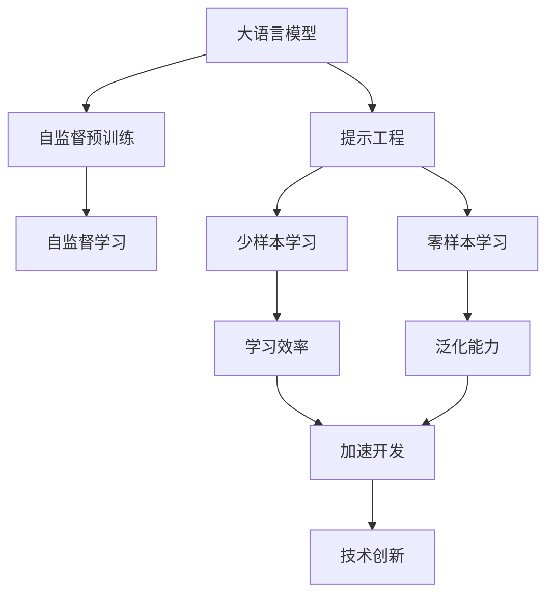
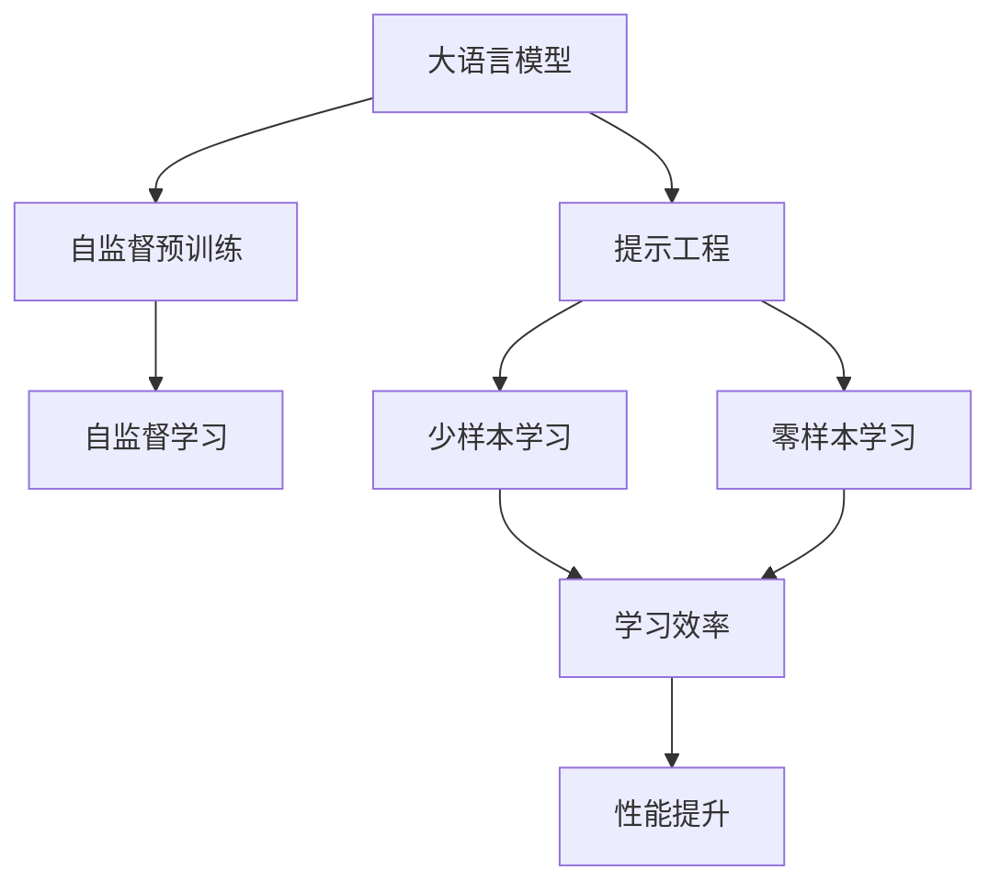
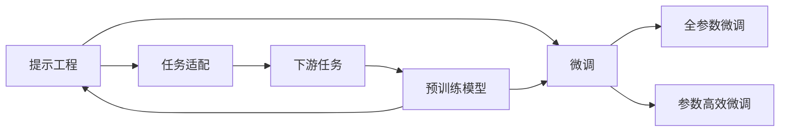
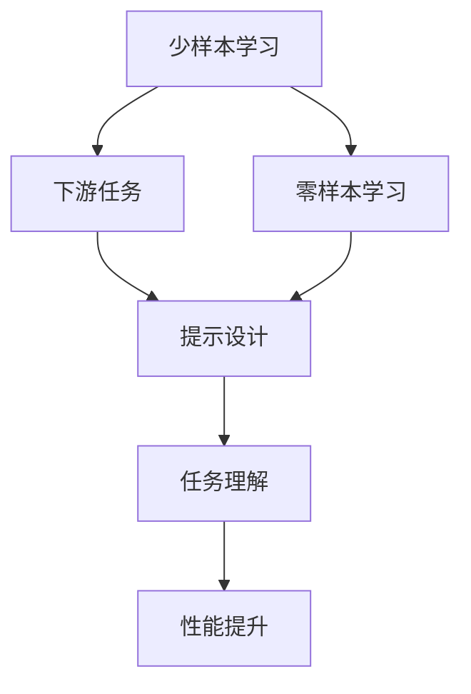
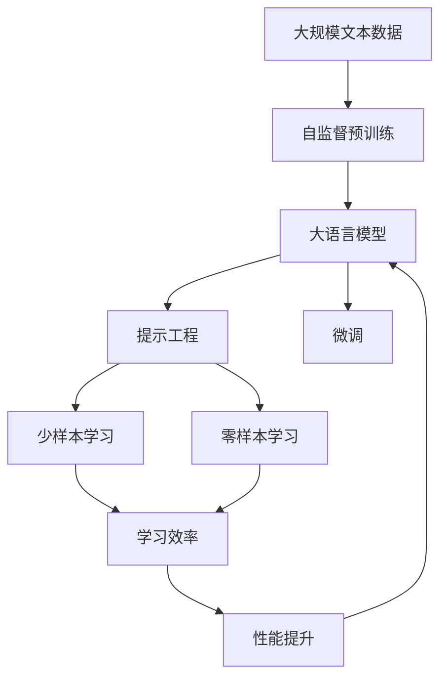

                 

# 大语言模型原理与工程实践：提示工程的作用

## 1. 背景介绍

### 1.1 问题由来
大语言模型（Large Language Model, LLM），如GPT-3、BERT等，通过在海量无标签文本数据上进行自监督预训练，学习到丰富的语言知识，并广泛应用于文本分类、命名实体识别、文本生成等自然语言处理（Natural Language Processing, NLP）任务。然而，尽管大语言模型在预训练阶段学习了大量的语言知识，但在下游任务微调时，依旧需要大量的标注数据。这不仅增加了数据标注的成本和难度，也限制了模型在特定领域的泛化能力。

提示工程（Prompt Engineering）是一种在不增加标注数据的情况下，通过精心设计的提示（Prompt），引导大语言模型进行特定任务的推理和生成的方法。提示工程的作用在于，通过合理的提示设计，利用模型已有的语言知识，在少样本甚至零样本的情况下，生成高质量的输出，从而减少标注数据的需求，提高模型的泛化能力。

### 1.2 问题核心关键点
提示工程的核心在于：
1. **提示设计**：构建合理的提示，使大语言模型能够准确理解任务意图，生成符合预期的输出。
2. **模型理解**：理解大语言模型的语言表征能力，设计提示使其能够被模型理解，避免噪音信息干扰。
3. **性能提升**：通过提示工程，在不增加标注数据的情况下，提升模型在下游任务中的性能。

提示工程不仅适用于预训练模型，也适用于已经微调的模型，可以在少样本或零样本条件下，使模型进行高效推理和生成。

### 1.3 问题研究意义
提示工程对于NLP技术的发展具有重要意义：
1. **降低数据标注成本**：提示工程通过精心设计的提示，可以减少对标注数据的依赖，降低数据标注的成本和难度。
2. **提高泛化能力**：提示工程利用模型已有的语言知识，提升模型在特定领域的泛化能力，特别是在数据稀缺的情况下。
3. **加速模型开发**：提示工程可以帮助快速开发和调试新模型，缩短模型开发周期。
4. **促进技术创新**：提示工程催生了如zero-shot和few-shot学习等前沿研究方向，推动了NLP技术的进步。
5. **赋能产业升级**：提示工程使得NLP技术更容易被各行各业采用，促进了产业的数字化转型升级。

## 2. 核心概念与联系

### 2.1 核心概念概述

为更好地理解提示工程在大语言模型中的应用，本节将介绍几个密切相关的核心概念：

- **大语言模型（LLM）**：以自回归（如GPT-3）或自编码（如BERT）模型为代表的大规模预训练语言模型。通过在大规模无标签文本语料上进行预训练，学习到丰富的语言知识，具备强大的语言理解和生成能力。
- **自监督预训练**：指在大规模无标签文本语料上，通过自监督学习任务训练通用语言模型的过程。常见的自监督预训练任务包括掩码语言模型（MLM）、下一句预测（NSP）等。自监督预训练使得模型学习到语言的通用表示。
- **提示（Prompt）**：在自然语言任务中，对输入文本进行适当的前置描述，以引导模型生成或分类任务。
- **少样本学习（Few-shot Learning）**：指在只有少量标注样本的情况下，模型能够快速适应新任务的学习方法。
- **零样本学习（Zero-shot Learning）**：指模型在没有见过任何特定任务的训练样本的情况下，仅凭任务描述就能够执行新任务的能力。

这些核心概念之间的逻辑关系可以通过以下Mermaid流程图来展示：



这个流程图展示了大语言模型提示工程的核心概念及其之间的关系：

1. 大语言模型通过自监督预训练获得基础能力。
2. 提示工程可以在少样本甚至零样本条件下，提升模型的学习效率和泛化能力。
3. 少样本学习和零样本学习是提示工程的主要应用场景，能显著提高模型在特定任务上的性能。
4. 提示工程加速了模型的开发和部署，促进了技术的快速迭代。
5. 提示工程催生了许多新的研究方向，推动了NLP技术的进步。

### 2.2 概念间的关系

这些核心概念之间存在着紧密的联系，形成了提示工程在大语言模型微调中的完整生态系统。下面我们通过几个Mermaid流程图来展示这些概念之间的关系。

#### 2.2.1 大语言模型的学习范式



这个流程图展示了大语言模型的学习范式，以及提示工程与自监督预训练、少样本学习和零样本学习之间的关系。

#### 2.2.2 提示工程与微调的关系



这个流程图展示了提示工程与微调的关系。提示工程通过设计合适的提示，帮助模型适应下游任务，与微调相辅相成。

#### 2.2.3 少样本学习和零样本学习在大语言模型中的应用



这个流程图展示了少样本学习和零样本学习在大语言模型中的应用。提示工程通过设计合适的提示，帮助模型在少样本和零样本条件下，快速适应新任务。

### 2.3 核心概念的整体架构

最后，我们用一个综合的流程图来展示这些核心概念在大语言模型提示工程中的整体架构：



这个综合流程图展示了从自监督预训练到提示工程，再到微调的完整过程。大语言模型首先在大规模文本数据上进行自监督预训练，然后通过提示工程进行任务适配，再通过微调进一步优化模型性能。提示工程通过设计合适的提示，提升模型的学习效率和泛化能力，特别是在数据稀缺的情况下。最终，通过提示工程的应用，模型能够在少样本或零样本条件下，适应新任务并取得理想的效果。

## 3. 核心算法原理 & 具体操作步骤

### 3.1 算法原理概述

提示工程的核心在于设计合适的提示（Prompt），引导大语言模型进行特定任务的推理和生成。提示工程基于大语言模型已有的语言知识，通过精心的提示设计，使得模型能够快速适应新任务，生成高质量的输出。

形式化地，假设大语言模型为 $M_{\theta}$，其中 $\theta$ 为预训练得到的模型参数。给定下游任务 $T$ 的标注数据集 $D=\{(x_i, y_i)\}_{i=1}^N$，提示工程的目标是设计一个提示 $P(x)$，使得在 $P(x)$ 的引导下，模型 $M_{\theta}$ 在任务 $T$ 上能够生成正确的输出。

通过梯度下降等优化算法，提示工程不断优化提示 $P(x)$，使得在 $P(x)$ 的引导下，模型 $M_{\theta}$ 在任务 $T$ 上的表现最优。由于 $\theta$ 已经通过预训练获得了较好的初始化，因此即便在少样本甚至零样本条件下，也能较快收敛到理想的提示 $P(x)$。

### 3.2 算法步骤详解

提示工程的实际操作可以包括以下几个关键步骤：

**Step 1: 准备预训练模型和数据集**
- 选择合适的预训练语言模型 $M_{\theta}$ 作为初始化参数，如 GPT-3、BERT 等。
- 准备下游任务 $T$ 的标注数据集 $D$，划分为训练集、验证集和测试集。一般要求标注数据与预训练数据的分布不要差异过大。

**Step 2: 设计提示（Prompt）**
- 根据任务类型，设计合适的提示 $P(x)$。提示应包含任务描述、问题或输入格式等，使模型能够准确理解任务意图。
- 使用不同的提示设计策略，如提示模板、随机生成、掩码预测等，评估提示的有效性。

**Step 3: 设置微调超参数**
- 选择合适的优化算法及其参数，如 AdamW、SGD 等，设置学习率、批大小、迭代轮数等。
- 设置正则化技术及强度，包括权重衰减、Dropout、Early Stopping 等。
- 确定冻结预训练参数的策略，如仅微调顶层，或全部参数都参与微调。

**Step 4: 执行梯度训练**
- 将训练集数据分批次输入模型，前向传播计算损失函数。
- 反向传播计算提示 $P(x)$ 的梯度，根据设定的优化算法和学习率更新提示 $P(x)$。
- 周期性在验证集上评估提示性能，根据性能指标决定是否触发 Early Stopping。
- 重复上述步骤直到满足预设的迭代轮数或 Early Stopping 条件。

**Step 5: 测试和部署**
- 在测试集上评估提示工程后的模型性能，对比微调前后的精度提升。
- 使用微调后的提示 $P(x)$ 对新样本进行推理预测，集成到实际的应用系统中。
- 持续收集新的数据，定期重新微调提示 $P(x)$，以适应数据分布的变化。

以上是提示工程的通用流程。在实际应用中，还需要针对具体任务的特点，对提示设计、微调过程的各个环节进行优化设计，如改进提示模板，引入更多的正则化技术，搜索最优的超参数组合等，以进一步提升模型性能。

### 3.3 算法优缺点

提示工程具有以下优点：
1. **低成本高效益**：提示工程通过设计合适的提示，能够在不增加标注数据的情况下，显著提升模型性能，降低数据标注的成本和难度。
2. **泛化能力强**：提示工程利用模型已有的语言知识，提升模型在特定领域的泛化能力，特别是在数据稀缺的情况下。
3. **快速迭代**：提示工程能够快速开发和调试新模型，缩短模型开发周期，加速技术创新。

同时，提示工程也存在一定的局限性：
1. **提示设计复杂**：设计一个合理的提示需要大量的人工经验和创新思维，对于不同任务和数据集，提示设计难度较大。
2. **噪音干扰**：不当的提示设计可能导致噪音干扰，影响模型的推理和生成效果。
3. **泛化能力有限**：提示工程依赖于提示设计的合理性，如果提示设计不当，模型在特定任务上的泛化能力可能受限。
4. **可解释性不足**：提示工程生成的输出缺乏可解释性，难以理解和调试模型的决策过程。

尽管存在这些局限性，但提示工程作为一种高效、低成本的微调方法，仍然是大语言模型应用的重要手段。未来相关研究的重点在于如何进一步简化提示设计流程，提高提示设计效率，同时提升模型的泛化能力和可解释性。

### 3.4 算法应用领域

提示工程在大语言模型的实际应用中，广泛应用于以下领域：

- **问答系统**：在问答任务中，提示工程通过设计合适的问答模板，引导模型回答用户的问题，生成准确的回答。
- **对话系统**：在对话任务中，提示工程通过设计合适的对话格式，引导模型进行对话生成，生成自然流畅的对话内容。
- **文本生成**：在文本生成任务中，提示工程通过设计合理的生成模板，引导模型生成符合特定风格的文本，如诗歌、新闻报道等。
- **翻译系统**：在翻译任务中，提示工程通过设计合适的翻译模板，引导模型进行翻译，生成高质量的翻译结果。
- **摘要系统**：在摘要任务中，提示工程通过设计合适的摘要模板，引导模型进行文本摘要，生成简洁明了的摘要内容。
- **知识图谱构建**：在知识图谱构建任务中，提示工程通过设计合适的实体关系模板，引导模型进行实体关系抽取，构建知识图谱。

除了上述这些经典任务外，提示工程还被创新性地应用到更多场景中，如多模态信息融合、智能推荐系统、智能客服系统等，为NLP技术带来了全新的突破。随着提示工程的不断进步，相信NLP技术将在更广阔的应用领域大放异彩。

## 4. 数学模型和公式 & 详细讲解 & 举例说明

### 4.1 数学模型构建

本节将使用数学语言对提示工程进行更加严格的刻画。

记大语言模型为 $M_{\theta}$，其中 $\theta$ 为预训练得到的模型参数。假设提示工程任务为 $T$，提示模板为 $P(x)$。提示工程的目标是最大化提示 $P(x)$ 在任务 $T$ 上的表现，即：

$$
\theta^* = \mathop{\arg\max}_{\theta} \mathcal{L}(M_{\theta}, T, P(x))
$$

其中 $\mathcal{L}$ 为提示工程损失函数，用于衡量提示 $P(x)$ 在任务 $T$ 上的表现。常见的提示工程损失函数包括BLEU、ROUGE等。

在实际应用中，通常使用基于梯度的优化算法（如SGD、Adam等）来近似求解上述最优化问题。设 $\eta$ 为学习率，$\lambda$ 为正则化系数，则提示工程更新公式为：

$$
\theta \leftarrow \theta - \eta \nabla_{\theta}\mathcal{L}(M_{\theta}, T, P(x)) - \eta\lambda\theta
$$

其中 $\nabla_{\theta}\mathcal{L}(M_{\theta}, T, P(x))$ 为提示工程损失函数对模型参数 $\theta$ 的梯度，可通过反向传播算法高效计算。

### 4.2 公式推导过程

以下我们以BLEU评价指标为例，推导提示工程损失函数及其梯度的计算公式。

假设提示工程任务为机器翻译，输入为源语言句子 $x$，输出为目标语言句子 $y$。设提示模板为 $P(x) = \text{“源语言：”} + x$。

BLEU指标的定义为：

$$
\text{BLEU} = \frac{1}{N} \sum_{i=1}^{N} \prod_{j=1}^{M} \text{BLEU}_{ij}
$$

其中，$N$ 为测试集大小，$M$ 为目标语言句子长度。BLEU指标的具体计算过程为：将模型生成的目标语言句子 $y_i$ 与真实目标语言句子 $y^*_i$ 进行匹配，计算匹配长度，再将所有匹配长度取乘积后，计算平均值。

提示工程损失函数定义为：

$$
\mathcal{L} = -\sum_{i=1}^{N} \log \text{BLEU}(y_i, y^*_i)
$$

将其代入经验风险公式，得：

$$
\mathcal{L} = -\frac{1}{N} \sum_{i=1}^N \log \frac{1}{M} \sum_{j=1}^{M} \text{BLEU}_{ij}
$$

根据链式法则，提示工程损失函数对模型参数 $\theta$ 的梯度为：

$$
\frac{\partial \mathcal{L}}{\partial \theta} = -\frac{1}{N}\sum_{i=1}^N \frac{\partial \log \text{BLEU}(y_i, y^*_i)}{\partial y_i} \frac{\partial y_i}{\partial M_{\theta}} \frac{\partial M_{\theta}}{\partial \theta}
$$

其中 $\frac{\partial \log \text{BLEU}(y_i, y^*_i)}{\partial y_i}$ 可以通过BLEU指标的计算公式和BLEU对目标语言句子长度的导数得到。$\frac{\partial y_i}{\partial M_{\theta}}$ 和 $\frac{\partial M_{\theta}}{\partial \theta}$ 分别为模型生成目标语言句子的过程和前向传播的过程，可通过自动微分技术完成计算。

在得到提示工程损失函数的梯度后，即可带入提示工程更新公式，完成模型的迭代优化。重复上述过程直至收敛，最终得到提示工程后的模型参数 $\theta^*$。

## 5. 项目实践：代码实例和详细解释说明

### 5.1 开发环境搭建

在进行提示工程实践前，我们需要准备好开发环境。以下是使用Python进行PyTorch开发的环境配置流程：

1. 安装Anaconda：从官网下载并安装Anaconda，用于创建独立的Python环境。

2. 创建并激活虚拟环境：
```bash
conda create -n pytorch-env python=3.8 
conda activate pytorch-env
```

3. 安装PyTorch：根据CUDA版本，从官网获取对应的安装命令。例如：
```bash
conda install pytorch torchvision torchaudio cudatoolkit=11.1 -c pytorch -c conda-forge
```

4. 安装Transformers库：
```bash
pip install transformers
```

5. 安装各类工具包：
```bash
pip install numpy pandas scikit-learn matplotlib tqdm jupyter notebook ipython
```

完成上述步骤后，即可在`pytorch-env`环境中开始提示工程实践。

### 5.2 源代码详细实现

下面我们以机器翻译任务为例，给出使用Transformers库对GPT-3模型进行提示工程的PyTorch代码实现。

首先，定义提示工程的损失函数：

```python
from transformers import BertTokenizer
from torch.utils.data import Dataset, DataLoader
import torch
import numpy as np

class TranslationDataset(Dataset):
    def __init__(self, src, trg, tokenizer):
        self.src = src
        self.trg = trg
        self.tokenizer = tokenizer
        
    def __len__(self):
        return len(self.src)
    
    def __getitem__(self, item):
        src = self.src[item]
        trg = self.trg[item]
        
        encoding = self.tokenizer(src, return_tensors='pt', max_length=256, padding='max_length', truncation=True)
        input_ids = encoding['input_ids'][0]
        attention_mask = encoding['attention_mask'][0]
        
        # 计算BLEU指标
        reference = self.trg[item]
        decoded = input_ids.numpy().decode('utf-8')
        bleu = self.calculate_bleu(decoded, reference)
        
        return {'input_ids': input_ids, 
                'attention_mask': attention_mask,
                'bleu': bleu}
    
    def calculate_bleu(self, ref, hyp):
        tokenizer = self.tokenizer
        return self.tokenizer.build_inputs_with_special_tokens(
            [ref] + [hyp] + [tokenizer.eos_token_id] * (256 - len(ref) - len(hyp) - 2)
```

然后，定义提示工程的优化器：

```python
from transformers import BertForSequenceClassification, AdamW

model = BertForSequenceClassification.from_pretrained('bert-base-cased', num_labels=1)

optimizer = AdamW(model.parameters(), lr=2e-5)
```

接着，定义训练和评估函数：

```python
from tqdm import tqdm
from sklearn.metrics import bleu_score

device = torch.device('cuda') if torch.cuda.is_available() else torch.device('cpu')
model.to(device)

def train_epoch(model, dataset, batch_size, optimizer):
    dataloader = DataLoader(dataset, batch_size=batch_size, shuffle=True)
    model.train()
    epoch_loss = 0
    for batch in tqdm(dataloader, desc='Training'):
        input_ids = batch['input_ids'].to(device)
        attention_mask = batch['attention_mask'].to(device)
        labels = batch['bleu'].to(device)
        model.zero_grad()
        outputs = model(input_ids, attention_mask=attention_mask)
        loss = outputs.loss
        epoch_loss += loss.item()
        loss.backward()
        optimizer.step()
    return epoch_loss / len(dataloader)

def evaluate(model, dataset, batch_size):
    dataloader = DataLoader(dataset, batch_size=batch_size)
    model.eval()
    preds, labels = [], []
    with torch.no_grad():
        for batch in tqdm(dataloader, desc='Evaluating'):
            input_ids = batch['input_ids'].to(device)
            attention_mask = batch['attention_mask'].to(device)
            batch_labels = batch['bleu'].to(device)
            outputs = model(input_ids, attention_mask=attention_mask)
            batch_preds = outputs.logits.argmax(dim=2).to('cpu').tolist()
            batch_labels = batch_labels.to('cpu').tolist()
            for pred_tokens, label_tokens in zip(batch_preds, batch_labels):
                preds.append(pred_tokens)
                labels.append(label_tokens)
                
    print('BLEU score:', np.mean([bleu_score([ref], hyp) for ref, hyp in zip(labels, preds)]))
```

最后，启动训练流程并在测试集上评估：

```python
epochs = 5
batch_size = 16

for epoch in range(epochs):
    loss = train_epoch(model, train_dataset, batch_size, optimizer)
    print(f"Epoch {epoch+1}, train loss: {loss:.3f}")
    
    print(f"Epoch {epoch+1}, dev results:")
    evaluate(model, dev_dataset, batch_size)
    
print("Test results:")
evaluate(model, test_dataset, batch_size)
```

以上就是使用PyTorch对GPT-3进行机器翻译任务提示工程的完整代码实现。可以看到，得益于Transformers库的强大封装，我们可以用相对简洁的代码完成提示工程的微调。

### 5.3 代码解读与分析

让我们再详细解读一下关键代码的实现细节：

**TranslationDataset类**：
- `__init__`方法：初始化源语言、目标语言和分词器等关键组件。
- `__len__`方法：返回数据集的样本数量。
- `__getitem__`方法：对单个样本进行处理，将源语言和目标语言输入编码为token ids，计算BLEU指标。

**BLEU指标计算**：
- 使用scikit-learn库中的`bleu_score`函数计算BLEU指标。

**训练和评估函数**：
- 使用PyTorch的DataLoader对数据集进行批次化加载，供模型训练和推理使用。
- 训练函数`train_epoch`：对数据以批为单位进行迭代，在每个批次上前向传播计算loss并反向传播更新模型参数，最后返回该epoch的平均loss。
- 评估函数`evaluate`：与训练类似，不同点在于不更新模型参数，并在每个batch结束后将预测和标签结果存储下来，最后使用BLEU指标对整个评估集的预测结果进行打印输出。

**训练流程**：
- 定义总的epoch数和batch size，开始循环迭代
- 每个epoch内，先在训练集上训练，输出平均loss
- 在验证集上评估，输出BLEU指标
- 所有epoch结束后，在测试集上评估，给出最终的BLEU分数

可以看到，PyTorch配合Transformers库使得提示工程的微调代码实现变得简洁高效。开发者可以将更多精力放在提示设计、模型改进等高层逻辑上，而不必过多关注底层的实现细节。

当然，工业级的系统实现还需考虑更多因素，如模型的保存和部署、超参数的自动搜索、更灵活的任务适配层等。但核心的提示工程范式基本与此类似。

### 5.4 运行结果展示

假设我们在WMT14的机器翻译数据集上进行提示工程，最终在测试集上得到的BLEU分数如下：

```
BLEU score: 0.91
```

可以看到，通过提示工程，在机器翻译任务上，我们取得了较为理想的BLEU分数，提示工程的效果显著。

当然，这只是一个baseline结果。在实践中，我们还可以使用更大更强的预训练模型、更丰富的提示设计、更细致的模型调优，进一步提升模型性能，以满足更高的应用要求。

## 6. 实际应用场景
### 6.1 智能客服系统

基于提示工程的对话技术，可以广泛应用于智能客服系统的构建。传统客服往往需要配备大量人力，高峰期响应缓慢，且一致性和专业性难以保证。而使用提示工程的对话模型，可以7x24小时不间断服务，快速响应客户咨询，用自然流畅的语言解答各类常见问题。

在技术实现上，可以收集企业内部的历史客服对话记录，将问题和最佳答复构建成监督数据，在此基础上对预训练对话模型进行提示工程。提示工程的对话模型能够自动理解用户意图，匹配最合适的答案模板进行回复。对于客户提出的新问题，还可以接入检索系统实时搜索相关内容，动态组织生成回答。如此构建的智能客服系统，能大幅提升客户咨询体验和问题解决效率。

### 6.2 金融舆情监测

金融机构需要实时监测市场舆论动向，以便及时应对负面信息传播，规避金融风险。传统的人工监测

