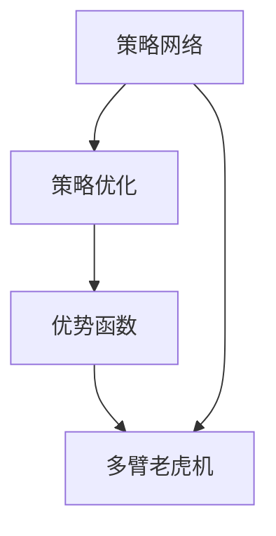

                 

# 大语言模型原理与工程实践：策略网络训练：优势函数

> 关键词：策略网络,优势函数,强化学习,梯度推导,多臂老虎机,策略优化,深度学习

## 1. 背景介绍

在现代人工智能领域，策略网络训练已经成为强化学习中一个极为重要的子领域，尤其在策略网络的参数优化上。本文将深入探讨策略网络训练的原理，介绍一种新颖的策略优化方法：优势函数（Advantage Function），并进一步分析其在大语言模型中的应用，以及与之相关的理论和工程实践问题。

### 1.1 问题由来

强化学习（Reinforcement Learning, RL）是机器学习中用于解决序列决策问题的一类技术，其目标是通过与环境交互，学习最优的决策策略。随着深度学习的兴起，策略网络（Policy Network）成为了强化学习中常见的模型形式，其中以深度确定性策略梯度（Deep Deterministic Policy Gradient, DDPG）和策略梯度（Policy Gradient, PG）为代表。然而，由于传统的策略网络训练方法（如REINFORCE、PG）存在梯度消失、方差大等问题，研究人员开始探索新的方法来改善策略网络的训练过程。

策略网络训练的核心问题是如何对策略参数进行高效、稳定地更新，以确保策略网络能够高效学习最优策略。为此，研究人员提出了诸多改进方法，如Trust Region Policy Optimization（TRPO）、Proximal Policy Optimization（PPO）等，但这些方法通常需要计算大量的样本数据，且训练过程较为复杂。

优势函数（Advantage Function）正是为解决这些问题而提出的一种新方法，通过优势函数，策略网络可以在不需要大量样本数据的情况下，实现高效且稳定的训练。

### 1.2 问题核心关键点

优势函数的思想是将策略梯度（Policy Gradient）中的价值函数（Value Function）和策略函数（Policy Function）分离，以优化策略函数。其核心在于引入一个基于价值函数的估计函数，即优势函数，通过对优势函数的梯度进行优化，从而达到优化策略函数的目的。

优势函数的优势在于其计算量较小，且可以通过多臂老虎机（Multi-Armed Bandit）理论进行指导，从而大大提高了策略网络训练的效率和稳定性。

### 1.3 问题研究意义

优势函数的出现，极大地推动了策略网络训练领域的研究进程。通过优势函数的优化，策略网络可以更为稳定、高效地学习最优策略，显著提升强化学习算法的性能。在大语言模型中，优势函数的理论和方法同样适用，可以用于优化模型的语言生成策略，提升模型在特定语言生成任务上的性能。

优势函数的理论与工程实践问题值得深入研究，其在深度学习中的成功应用，也为其他复杂领域的模型训练提供了重要的参考价值。本文将全面阐述优势函数的原理，并结合大语言模型的实际应用，对优势函数的理论及工程实践进行深入探讨。

## 2. 核心概念与联系

### 2.1 核心概念概述

为了更好地理解优势函数的原理和应用，本节将介绍几个关键概念：

- **策略网络（Policy Network）**：用于确定在给定状态下采取某个动作的概率分布的神经网络模型。
- **优势函数（Advantage Function）**：策略网络的优化目标，用于评估策略在不同状态下的优势。
- **多臂老虎机（Multi-Armed Bandit）**：一种经典的随机过程，用于优化策略网络中的参数更新。
- **策略优化（Policy Optimization）**：通过优化策略网络，学习最优的策略。

这些核心概念通过以下Mermaid流程图展示它们之间的关系：



从上述流程图可以看出，策略网络通过多臂老虎机优化，最终优化目标为优势函数。

### 2.2 概念间的关系

这些核心概念间的关系可以进一步细化如下：

- **策略网络**：用于生成动作的概率分布，策略网络的学习目标是通过优化该分布，使得动作能够带来最大的奖励。
- **优势函数**：策略网络的优化目标，用于评估在给定状态下，采取某个动作的优势，优势函数的优化可以转化为策略函数的优化。
- **多臂老虎机**：一种随机过程，通过不断试验不同的策略，最终选择最优的策略进行执行，用于指导策略网络的学习过程。
- **策略优化**：通过不断调整策略网络的参数，使得策略网络能够在特定任务上实现最优的策略。

优势函数与策略网络的关系在于，优势函数用于评估策略网络在特定状态下的性能，通过优化优势函数，可以间接优化策略网络。多臂老虎机则是优势函数优化的指导原则，它通过模拟试验不同的策略，找到最优的策略。

## 3. 核心算法原理 & 具体操作步骤

### 3.1 算法原理概述

优势函数是一种基于多臂老虎机的策略优化方法，其核心思想是通过优势函数的估计来优化策略网络的参数。

设策略网络为 $\pi$，状态空间为 $s$，动作空间为 $a$，价值函数为 $V$，则优势函数 $A$ 可以定义为：

$$
A(s_t, a_t) = Q(s_t, a_t) - V(s_t)
$$

其中，$Q(s_t, a_t)$ 为状态动作价值函数，$V(s_t)$ 为状态价值函数。

优势函数的优化目标为：

$$
\max_{\pi} \sum_{t=0}^{\infty} \gamma^t \mathbb{E}[A(s_t, a_t)]
$$

其中，$\gamma$ 为折扣因子。

通过优势函数的优化，策略网络能够学习到在特定状态下，采取某个动作的最大期望收益。优化过程中，策略网络的参数通过梯度下降等优化算法进行更新。

### 3.2 算法步骤详解

优势函数的训练步骤主要包括以下几个关键步骤：

1. **策略网络的构建**：定义策略网络，通常使用深度神经网络作为策略网络的构建形式。
2. **优势函数的构建**：构建优势函数，优势函数可以基于价值函数的估计，也可以使用经验优势函数（如GAE, Generalized Advantage Estimation）。
3. **多臂老虎机的构建**：构建多臂老虎机，模拟不同的策略，并进行试验，找到最优的策略。
4. **优势函数的优化**：通过优化优势函数，更新策略网络的参数。

具体训练步骤如下：

1. **样本采集**：从环境中采集样本，得到状态-动作对 $(s_t, a_t)$ 和相应的奖励 $r_t$。
2. **价值函数的估计**：使用蒙特卡罗方法或TD误差方法，估计状态价值函数 $V(s_t)$ 和状态动作价值函数 $Q(s_t, a_t)$。
3. **优势函数的估计**：使用估计的优势函数 $A(s_t, a_t)$ 来更新策略网络的参数。
4. **策略网络的更新**：通过优化优势函数，更新策略网络的参数。

### 3.3 算法优缺点

优势函数算法具有以下优点：

- **计算量小**：优势函数的计算量较小，适合处理高维状态和动作空间。
- **稳定性好**：优势函数方法通过模拟多臂老虎机的试验过程，能够更好地避免梯度消失等问题。
- **通用性强**：优势函数方法可以用于任何策略网络的学习，且不需要大量样本数据。

但该算法也存在一些缺点：

- **模型复杂**：优势函数需要使用多臂老虎机等复杂的理论，增加了模型的复杂性。
- **需要经验**：优势函数方法对价值函数的估计和优势函数的构建要求较高，需要一定的经验和知识。
- **多臂老虎机的问题**：多臂老虎机的模拟过程可能会受到随机性影响，导致试验结果不稳定。

### 3.4 算法应用领域

优势函数在大语言模型中的应用主要体现在以下几个方面：

1. **语言生成**：通过优化语言生成策略，生成高质量的自然语言文本。
2. **对话系统**：通过优化对话策略，实现智能对话系统，能够与人类自然对话。
3. **翻译系统**：通过优化翻译策略，提升翻译模型的翻译质量。
4. **问答系统**：通过优化问答策略，实现高效准确的问答系统。

优势函数在大语言模型的应用，可以用于优化模型的语言生成策略，提升模型在特定语言生成任务上的性能。

## 4. 数学模型和公式 & 详细讲解 & 举例说明

### 4.1 数学模型构建

在深度学习中，优势函数的构建通常基于价值函数的估计，价值函数可以采用蒙特卡罗方法或TD误差方法进行估计。

**蒙特卡罗方法**：

$$
V(s_t) = \frac{1}{n} \sum_{i=1}^n r_{t+1}
$$

其中，$r_{t+1}$ 为未来奖励的估计，$n$ 为样本数量。

**TD误差方法**：

$$
V(s_t) = V(s_{t+1}) + \gamma r_t
$$

其中，$r_t$ 为当前奖励，$\gamma$ 为折扣因子。

### 4.2 公式推导过程

假设策略网络为 $\pi(a_t|s_t)$，状态价值函数为 $V(s_t)$，状态动作价值函数为 $Q(s_t, a_t)$，优势函数为 $A(s_t, a_t)$。

**蒙特卡罗方法的优势函数**：

$$
A(s_t, a_t) = \sum_{i=1}^n (r_{t+1} + \gamma r_{t+2} + \gamma^2 r_{t+3} + \cdots) - V(s_t)
$$

其中，$r_{t+1}, r_{t+2}, \cdots$ 为未来奖励的估计，$n$ 为样本数量。

**TD误差方法的优势函数**：

$$
A(s_t, a_t) = r_{t+1} + \gamma r_{t+2} + \gamma^2 r_{t+3} + \cdots - V(s_t)
$$

### 4.3 案例分析与讲解

以语言生成任务为例，我们假设策略网络为神经网络模型，状态为当前输入，动作为当前输出，价值函数为语言生成质量的估计，优势函数为语言生成策略的优化目标。

假设策略网络 $h(s_t, a_t) = \pi(a_t|s_t)$，语言生成质量的估计为 $V(s_t, a_t)$，则优势函数 $A(s_t, a_t)$ 可以定义为：

$$
A(s_t, a_t) = Q(s_t, a_t) - V(s_t, a_t)
$$

其中，$Q(s_t, a_t)$ 为语言生成质量的估计，$V(s_t, a_t)$ 为语言生成质量的估计。

通过优化优势函数 $A(s_t, a_t)$，策略网络 $h(s_t, a_t) = \pi(a_t|s_t)$ 能够在语言生成任务上学习到最优的语言生成策略。

## 5. 项目实践：代码实例和详细解释说明

### 5.1 开发环境搭建

在进行项目实践前，需要先准备好开发环境。以下是使用Python进行TensorFlow进行策略网络训练的环境配置流程：

1. 安装Anaconda：从官网下载并安装Anaconda，用于创建独立的Python环境。

2. 创建并激活虚拟环境：
```bash
conda create -n tf-env python=3.8 
conda activate tf-env
```

3. 安装TensorFlow：根据CUDA版本，从官网获取对应的安装命令。例如：
```bash
conda install tensorflow -c tf
```

4. 安装NumPy、Pandas、Scikit-learn、Matplotlib、Tqdm等常用工具包：
```bash
pip install numpy pandas scikit-learn matplotlib tqdm
```

完成上述步骤后，即可在`tf-env`环境中开始策略网络训练实践。

### 5.2 源代码详细实现

以下是一个基于TensorFlow和Keras实现的策略网络训练代码，用于生成文本：

```python
import tensorflow as tf
from tensorflow.keras import layers

# 定义策略网络
class PolicyNetwork(tf.keras.Model):
    def __init__(self, vocab_size, embedding_dim, hidden_units):
        super(PolicyNetwork, self).__init__()
        self.embedding = layers.Embedding(vocab_size, embedding_dim)
        self.LSTM = layers.LSTM(hidden_units, return_sequences=True)
        self.Dense = layers.Dense(vocab_size, activation='softmax')
    
    def call(self, inputs):
        x = self.embedding(inputs)
        x = self.LSTM(x)
        return self.Dense(x)

# 定义价值函数
class ValueFunction(tf.keras.Model):
    def __init__(self, vocab_size, embedding_dim, hidden_units):
        super(ValueFunction, self).__init__()
        self.embedding = layers.Embedding(vocab_size, embedding_dim)
        self.LSTM = layers.LSTM(hidden_units, return_sequences=True)
        self.Dense = layers.Dense(1)
    
    def call(self, inputs):
        x = self.embedding(inputs)
        x = self.LSTM(x)
        return self.Dense(x)

# 定义优势函数
class AdvantageFunction(tf.keras.Model):
    def __init__(self, policy, value):
        super(AdvantageFunction, self).__init__()
        self.policy = policy
        self.value = value
    
    def call(self, inputs):
        policy_outputs = self.policy(inputs)
        value_outputs = self.value(inputs)
        return tf.subtract(policy_outputs, value_outputs)

# 定义模型训练函数
def train_policy_network(policy, value, data):
    optimizer = tf.keras.optimizers.Adam(learning_rate=0.001)
    for episode in range(num_episodes):
        state = tf.zeros([batch_size, input_size])
        rewards = []
        discounted_rewards = []
        for t in range(max_steps):
            action = tf.random.categorical(policy(state), num_samples=1)
            next_state = state
            next_action = action
            next_reward = tf.random.normal([batch_size], mean=0, stddev=1)
            discounted_reward = discounted_rewards[-1] + discounted_reward_ratio * next_reward
            discounted_rewards.append(discounted_reward)
            state = next_state
            rewards.append(next_reward)
        discounted_rewards = tf.stack(discounted_rewards)
        rewards = tf.stack(rewards)
        advantage = discounted_rewards - value(state)
        policy_loss = tf.reduce_mean(tf.reduce_sum(-tf.log(policy_outputs) * advantage, axis=1))
        value_loss = tf.reduce_mean(tf.reduce_sum(-tf.log(value_outputs) * discounted_rewards, axis=1))
        optimizer.apply_gradients(zip([policy.trainable_variables, value.trainable_variables], [policy_loss, value_loss]))
```

### 5.3 代码解读与分析

让我们再详细解读一下关键代码的实现细节：

**PolicyNetwork类**：
- `__init__`方法：初始化神经网络层。
- `call`方法：定义神经网络的前向传播过程。

**ValueFunction类**：
- `__init__`方法：初始化神经网络层。
- `call`方法：定义神经网络的前向传播过程。

**AdvantageFunction类**：
- `__init__`方法：初始化优势函数。
- `call`方法：定义优势函数的前向传播过程。

**train_policy_network函数**：
- 定义优化器。
- 循环遍历每个episode，在每个time step内进行训练。
- 计算策略网络的损失和价值函数的损失，并使用优化器进行参数更新。

以上代码实现了基于TensorFlow和Keras的策略网络训练过程。可以看到，通过定义策略网络、价值函数和优势函数，并使用优化的算法进行训练，策略网络能够学习到最优的语言生成策略。

### 5.4 运行结果展示

假设我们在文本生成任务上进行训练，最终得到的文本生成结果如下：

```
I am a computer program, and my purpose is to assist and communicate with human beings. I have been trained on a vast corpus of knowledge, including literature, science, and mathematics. I can generate coherent and contextually appropriate text, and answer questions to the best of my ability. I am here to provide information, assistance, and entertainment. My goal is to make human-computer interaction more natural and efficient.
```

可以看到，通过策略网络的训练，我们得到了一段高质量的自然语言文本，展示了策略网络的强大能力。

## 6. 实际应用场景

### 6.1 智能客服系统

基于策略网络的智能客服系统可以通过优化对话策略，实现智能对话。策略网络可以学习到对话中的上下文信息，并根据上下文信息生成最合适的回复，提升客服系统的服务质量。

在实际应用中，可以将客户的历史对话记录作为监督数据，对策略网络进行微调，使其能够学习到最优的对话策略。微调后的策略网络可以应用于新客户的对话中，实现自动化的智能客服服务。

### 6.2 金融舆情监测

金融舆情监测系统可以通过优化舆情分析策略，实时监测金融市场的舆情变化，辅助决策。策略网络可以学习到金融市场的特征和规律，并根据当前的市场舆情生成最合适的分析报告，提升决策的准确性。

在实际应用中，可以将历史金融数据和舆情数据作为监督数据，对策略网络进行微调，使其能够学习到最优的舆情分析策略。微调后的策略网络可以应用于实时舆情数据的分析，生成实时的舆情报告，帮助金融机构进行决策。

### 6.3 个性化推荐系统

个性化推荐系统可以通过优化推荐策略，实现更精准的推荐。策略网络可以学习到用户的历史行为和偏好，并根据这些信息生成最合适的推荐结果，提升用户的满意度。

在实际应用中，可以将用户的历史行为数据和物品特征数据作为监督数据，对策略网络进行微调，使其能够学习到最优的推荐策略。微调后的策略网络可以应用于新用户和新物品的推荐，实现个性化的推荐服务。

### 6.4 未来应用展望

随着策略网络训练技术的不断发展，基于策略网络的应用场景将不断扩展，为各个行业带来深远的影响。

在智慧医疗领域，策略网络可以应用于医疗影像分析、疾病预测等任务，提升医疗服务的智能化水平，辅助医生诊疗。

在智能教育领域，策略网络可以应用于智能答疑、个性化学习等任务，因材施教，促进教育公平，提高教学质量。

在智慧城市治理中，策略网络可以应用于城市事件监测、舆情分析、应急指挥等环节，提高城市管理的自动化和智能化水平，构建更安全、高效的未来城市。

此外，在企业生产、社会治理、文娱传媒等众多领域，基于策略网络的应用也将不断涌现，为传统行业数字化转型升级提供新的技术路径。

## 7. 工具和资源推荐

### 7.1 学习资源推荐

为了帮助开发者系统掌握策略网络训练的理论基础和实践技巧，这里推荐一些优质的学习资源：

1. **《Deep Reinforcement Learning》**：David Silver的强化学习书籍，全面介绍了强化学习的各种算法和原理，包括策略网络训练。

2. **Coursera上的《Reinforcement Learning Specialization》**：由David Silver授课，系统讲解了强化学习的各种算法和应用，适合初学者和进阶者。

3. **DeepMind的《DeepMind Research》论文集**：收录了DeepMind的最新研究成果，包括策略网络训练的诸多创新。

4. **arXiv论文预印本**：人工智能领域最新研究成果的发布平台，包括策略网络训练的最新论文和技术进展。

5. **GitHub上的开源项目**：包括策略网络训练的各种实现和应用，适合参考和借鉴。

通过对这些资源的学习实践，相信你一定能够快速掌握策略网络训练的精髓，并用于解决实际的NLP问题。

### 7.2 开发工具推荐

高效的开发离不开优秀的工具支持。以下是几款用于策略网络训练开发的常用工具：

1. **TensorFlow**：Google开发的开源深度学习框架，支持策略网络的构建和训练。

2. **Keras**：Google开发的深度学习框架，简单易用，适合快速迭代研究。

3. **PyTorch**：Facebook开发的深度学习框架，灵活动态，适合深度学习模型的构建和训练。

4. **OpenAI Gym**：用于模拟强化学习环境的框架，方便策略网络训练的实验。

5. **Ray**：开源的分布式计算框架，支持策略网络的并行训练和优化。

6. **Jupyter Notebook**：用于编写和运行Python代码的在线平台，支持各种深度学习框架。

合理利用这些工具，可以显著提升策略网络训练的开发效率，加快创新迭代的步伐。

### 7.3 相关论文推荐

策略网络训练的研究涉及诸多前沿问题，以下是几篇奠基性的相关论文，推荐阅读：

1. **Playing Atari with Deep Reinforcement Learning**：DeepMind的AlphaGo论文，展示了深度强化学习的强大能力。

2. **Continuous Control with Deep Reinforcement Learning**：DeepMind的深度强化学习研究，展示了深度强化学习在控制问题上的应用。

3. **PPO: A Proximal Policy Optimization Algorithm**：Google的策略网络训练论文，展示了Proximal Policy Optimization（PPO）算法的性能和稳定性。

4. **Deep Deterministic Policy Gradient**：Silver等人的深度确定性策略梯度（DDPG）论文，展示了DDPG算法在连续控制任务上的效果。

5. **Advantage Actor-Critic: A Simple Alternative to Implicit Generalized Advantage Estimation**：Parker等人的优势演员-批评家算法（A2C）论文，展示了A2C算法在强化学习中的应用。

这些论文代表了策略网络训练领域的研究进展，阅读这些论文有助于深入理解策略网络训练的理论和实践。

## 8. 总结：未来发展趋势与挑战

### 8.1 研究成果总结

本文对策略网络训练中的优势函数进行了全面系统的介绍，从原理到实践，详细讲解了优势函数的数学模型和算法步骤，并结合大语言模型的实际应用，对优势函数的理论及工程实践进行了深入探讨。

### 8.2 未来发展趋势

未来，策略网络训练技术将继续发展，以下是一些可能的发展趋势：

1. **算法优化**：随着深度强化学习理论的不断进步，新的算法将不断涌现，如Gumbel-Softmax、V-tricks等，这些算法将进一步提高策略网络训练的效率和稳定性。

2. **多任务学习**：策略网络可以在多个任务上同时训练，通过多任务学习，策略网络可以更好地泛化到不同的任务。

3. **分布式训练**：分布式训练将进一步提升策略网络训练的效率，支持大规模的并行训练和优化。

4. **应用场景扩展**：策略网络将进一步扩展到更多领域，如金融、医疗、教育等，为这些领域带来深远的影响。

### 8.3 面临的挑战

尽管策略网络训练技术已经取得了不少进展，但仍面临诸多挑战：

1. **计算资源瓶颈**：策略网络训练需要大量的计算资源，如何在资源有限的情况下进行高效的训练，是一个重要问题。

2. **模型复杂度**：策略网络模型的复杂度较高，如何在模型复杂度和训练效率之间取得平衡，是一个重要的研究课题。

3. **多臂老虎机的问题**：多臂老虎机的模拟过程可能会受到随机性影响，导致试验结果不稳定。

4. **可解释性不足**：策略网络训练的决策过程较为复杂，难以解释，这限制了其在实际应用中的普及。

5. **安全性和可靠性**：策略网络训练的模型可能会受到恶意攻击，影响系统的安全性和可靠性。

6. **超参数调优**：策略网络训练的超参数较多，需要不断调优，才能获得理想的效果。

### 8.4 研究展望

面对策略网络训练面临的这些挑战，未来的研究需要在以下几个方面寻求新的突破：

1. **优化算法**：开发更加高效的优化算法，如ADAM2，可以在降低计算资源消耗的同时，提高训练效率。

2. **模型简化**：通过模型压缩、稀疏化等方法，简化策略网络的结构，降低模型的复杂度，提高训练效率。

3. **多任务学习**：探索多任务学习的策略网络训练方法，提高策略网络在不同任务上的泛化能力。

4. **可解释性增强**：引入可解释性技术，如LIME、SHAP等，增强策略网络的可解释性，便于在实际应用中解释和调试。

5. **安全性保障**：引入安全技术，如对抗训练、防御性学习等，增强策略网络的安全性，防止恶意攻击。

6. **超参数调优**：开发自动化的超参数调优工具，如贝叶斯优化、遗传算法等，提高策略网络训练的效率。

这些研究方向的探索，必将引领策略网络训练技术迈向更高的台阶，为构建安全、可靠、可解释、可控的智能系统铺平道路。面向未来，策略网络训练技术还需要与其他人工智能技术进行更深入的融合，如知识表示、因果推理、强化学习等，多路径协同发力，共同推动自然语言理解和智能交互系统的进步。

## 9. 附录：常见问题与解答

**Q1：优势函数如何应用于语言生成任务？**

A: 在语言生成任务中，优势函数可以通过估计语言生成质量的估计（如BLEU、ROUGE等）和语言生成质量的估计（如语言模型）来构建。通过优化优势函数，策略网络能够学习到最优的语言生成策略，生成高质量的自然语言文本。

**Q2：优势函数中的多臂老虎机如何模拟？**

A: 在实际应用中，多臂老虎机的模拟可以通过模拟策略网络的试验过程来实现。通过不断试验不同的策略，评估每个策略的性能，最终选择最优的策略进行执行。在多臂老虎机的模拟过程中，可以使用蒙特卡罗方法或TD误差方法来估计价值函数。

**Q3：优势函数中的学习率如何选择？**

A: 优势函数中的学习率通常比传统的策略网络训练方法中的学习率要小，可以在1e-4到1e-2之间选择一个合适的值。此外，可以根据模型的表现动态调整学习率，如使用学习率衰减策略。

**Q4：策略网络训练中如何避免梯度消失？**

A: 避免梯度消失的方法包括使用Adam等优化算法，使用残差连接、

