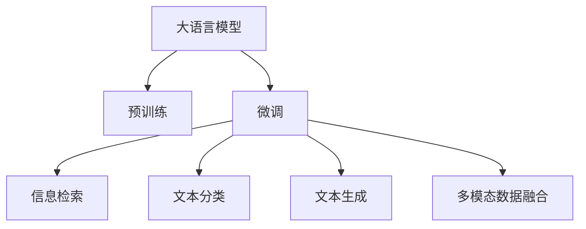
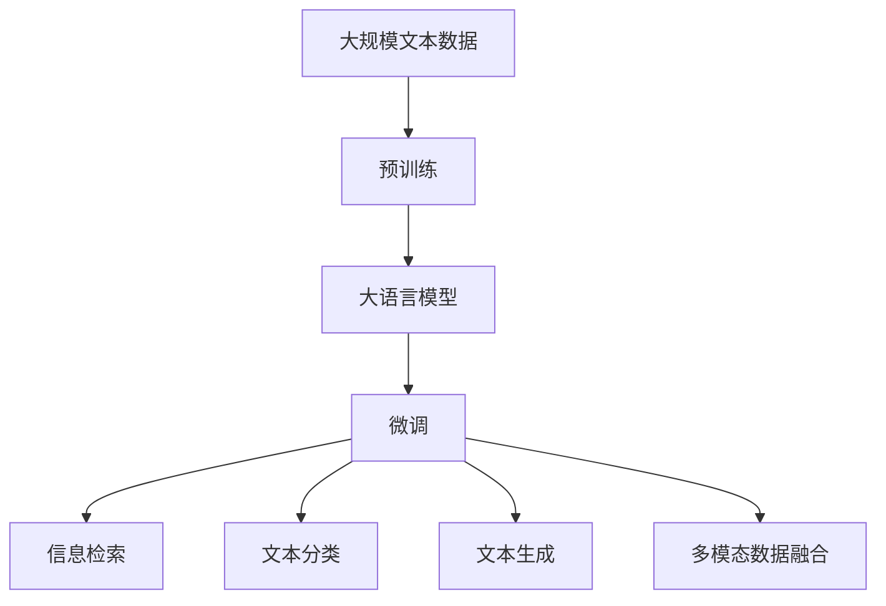
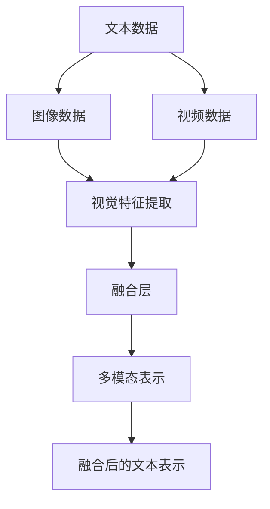
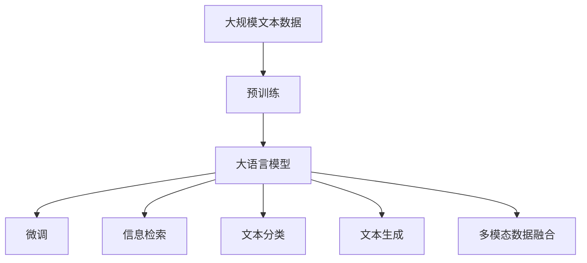

                 

# 大语言模型原理与工程实践：网页数据

> 关键词：大语言模型,网页数据,自然语言处理(NLP),信息检索,文本分类,文本生成,深度学习

## 1. 背景介绍

### 1.1 问题由来
随着互联网的快速发展，网页数据（Web Data）以其海量的数据规模和丰富的信息内容，成为了自然语言处理（Natural Language Processing，NLP）领域的重要数据来源之一。网页数据具有多样化的数据类型，包括结构化数据、半结构化数据和非结构化数据，其中非结构化数据又包括文本数据、图像数据和视频数据等。如何高效地处理和分析网页数据，从其中提取出有用的信息，成为了当前NLP领域的一个重要研究方向。

大语言模型（Large Language Model, LLM）作为NLP领域的研究热点，通过在大规模无标签文本数据上进行预训练，学习到了丰富的语言知识和常识。网页数据作为一个重要的文本数据来源，自然成为了大语言模型应用的重要场景之一。本文将从大语言模型的基本原理入手，结合网页数据的特点，探讨如何利用大语言模型进行网页数据的处理和分析。

### 1.2 问题核心关键点
大语言模型在网页数据中的应用，主要包括以下几个核心关键点：

1. **预训练模型选择**：选择适合网页数据特点的预训练模型，如BERT、GPT-2、T5等，以确保模型在网页数据上具有较好的泛化能力和理解能力。

2. **数据预处理**：对网页数据进行清洗、分词、标记等预处理操作，以提高模型的输入质量，避免噪音干扰。

3. **任务适配层设计**：根据具体任务（如信息检索、文本分类、文本生成等），设计合适的任务适配层，以将预训练模型的输出转换为目标任务所需的格式。

4. **微调与优化**：在预训练模型基础上，通过有监督微调（Supervised Fine-Tuning），优化模型在特定任务上的性能，提高模型的准确性和鲁棒性。

5. **模型评估与部署**：对微调后的模型进行评估，并集成到实际应用系统中，持续收集反馈数据，优化模型性能。

6. **多模态数据融合**：考虑网页数据的多样性，将文本、图像、视频等多模态数据进行融合，提高模型的综合理解能力。

这些关键点共同构成了大语言模型在网页数据处理和分析中的基本框架，下面将从原理到实践，系统介绍大语言模型在网页数据中的应用。

## 2. 核心概念与联系

### 2.1 核心概念概述

为了更好地理解大语言模型在网页数据中的应用，下面将介绍几个密切相关的核心概念：

- **大语言模型**：指通过大规模无标签文本数据进行预训练的语言模型，如BERT、GPT-2、T5等。这些模型具有强大的语言理解和生成能力，能够捕捉语言中的语义和语法规则。

- **预训练**：指在大规模无标签文本数据上，通过自监督学习任务训练语言模型的过程。常见的预训练任务包括自回归、掩码语言模型等，目的是在大规模文本数据中学习到语言知识的通用表示。

- **微调**：指在预训练模型的基础上，使用有标签的网页数据集进行有监督学习，优化模型在特定任务上的性能，如信息检索、文本分类、文本生成等。

- **信息检索**：指从大规模网页数据集中，查找与用户查询相关的网页信息，主要应用于搜索引擎、推荐系统等场景。

- **文本分类**：指将网页数据按照特定类别进行分类，主要应用于新闻分类、情感分析等场景。

- **文本生成**：指利用语言模型生成新的文本，主要应用于自动摘要、文本填充等场景。

- **多模态数据融合**：指将文本、图像、视频等多模态数据进行融合，提高模型的综合理解能力，主要应用于社交媒体分析、视频内容推荐等场景。

这些核心概念之间的逻辑关系可以通过以下Mermaid流程图来展示：



这个流程图展示了大语言模型在网页数据应用中的核心概念及其相互关系。预训练模型提供了通用的语言知识，微调根据特定任务的需求，进一步优化模型性能。

### 2.2 概念间的关系

这些核心概念之间存在着紧密的联系，形成了大语言模型在网页数据处理和分析中的完整生态系统。下面我们通过几个Mermaid流程图来展示这些概念之间的关系。

#### 2.2.1 大语言模型的学习范式



这个流程图展示了从预训练到微调，再到网页数据特定任务处理的完整过程。大语言模型首先在大规模文本数据上进行预训练，然后通过微调，适应特定的网页数据任务。

#### 2.2.2 信息检索与微调的关系


这个流程图展示了信息检索的基本原理，以及它与微调的关系。预训练模型在信息检索中，主要负责对查询数据进行编码，微调模型则负责对网页数据进行打分和排序，最终返回与查询最相关的网页。

#### 2.2.3 多模态数据融合方法



这个流程图展示了多模态数据融合的基本过程。文本、图像和视频等不同模态的数据通过视觉特征提取和融合，得到统一的多模态表示，提高了模型的综合理解能力。

### 2.3 核心概念的整体架构

最后，我们用一个综合的流程图来展示这些核心概念在大语言模型在网页数据应用中的整体架构：



这个综合流程图展示了从预训练到微调，再到网页数据特定任务处理的完整过程。大语言模型首先在大规模文本数据上进行预训练，然后通过微调，适应特定的网页数据任务。通过多模态数据融合，大语言模型能够更好地理解和生成网页数据。

## 3. 核心算法原理 & 具体操作步骤
### 3.1 算法原理概述

大语言模型在网页数据中的应用，主要基于以下算法原理：

1. **预训练模型选择**：选择合适的预训练语言模型，如BERT、GPT-2、T5等，以确保模型在网页数据上具有较好的泛化能力和理解能力。

2. **数据预处理**：对网页数据进行清洗、分词、标记等预处理操作，以提高模型的输入质量，避免噪音干扰。

3. **任务适配层设计**：根据具体任务（如信息检索、文本分类、文本生成等），设计合适的任务适配层，以将预训练模型的输出转换为目标任务所需的格式。

4. **微调与优化**：在预训练模型的基础上，使用有标签的网页数据集进行有监督微调，优化模型在特定任务上的性能，提高模型的准确性和鲁棒性。

5. **模型评估与部署**：对微调后的模型进行评估，并集成到实际应用系统中，持续收集反馈数据，优化模型性能。

6. **多模态数据融合**：考虑网页数据的多样性，将文本、图像、视频等多模态数据进行融合，提高模型的综合理解能力。

### 3.2 算法步骤详解

基于大语言模型在网页数据中的应用，下面将详细介绍具体的算法步骤：

**Step 1: 准备预训练模型和数据集**

1. **选择预训练模型**：根据任务需求，选择合适的预训练模型，如BERT、GPT-2、T5等。

2. **准备数据集**：收集网页数据集，包括结构化数据、半结构化数据和非结构化数据。将非结构化数据进行清洗和预处理，得到文本数据、图像数据和视频数据等。

**Step 2: 数据预处理**

1. **文本数据预处理**：对文本数据进行清洗、分词、标记等操作，得到适合模型的输入格式。

2. **图像数据预处理**：对图像数据进行裁剪、缩放、归一化等操作，得到适合模型的输入格式。

3. **视频数据预处理**：对视频数据进行帧提取、特征提取等操作，得到适合模型的输入格式。

**Step 3: 任务适配层设计**

1. **信息检索任务适配层**：设计合适的编码器-解码器结构，将查询数据和网页数据编码成向量表示，并计算向量相似度，得到排序结果。

2. **文本分类任务适配层**：设计合适的分类器，将文本数据编码为向量表示，并使用分类器进行分类。

3. **文本生成任务适配层**：设计合适的解码器，将输入向量解码为文本输出。

**Step 4: 微调与优化**

1. **选择优化器**：根据任务需求，选择合适的优化器，如Adam、SGD等，设置学习率、批大小、迭代轮数等。

2. **设置正则化技术**：使用L2正则、Dropout、Early Stopping等，防止模型过度适应小规模训练集。

3. **执行梯度训练**：将训练集数据分批次输入模型，前向传播计算损失函数。反向传播计算参数梯度，根据设定的优化算法和学习率更新模型参数。周期性在验证集上评估模型性能，根据性能指标决定是否触发Early Stopping。重复上述步骤直到满足预设的迭代轮数或Early Stopping条件。

**Step 5: 模型评估与部署**

1. **模型评估**：在测试集上评估微调后模型的性能，对比微调前后的精度提升。

2. **模型部署**：使用微调后的模型对新样本进行推理预测，集成到实际的应用系统中。

3. **持续学习**：收集新的数据，定期重新微调模型，以适应数据分布的变化。

### 3.3 算法优缺点

大语言模型在网页数据中的应用具有以下优点：

1. **高效性**：通过预训练和微调，大语言模型能够快速适应特定任务，避免了从头训练的高成本和时间投入。

2. **泛化能力**：预训练模型在大规模文本数据上学习到了通用的语言知识和常识，具有较强的泛化能力，能够在不同领域和任务上取得良好的效果。

3. **鲁棒性**：预训练模型在大规模文本数据上训练得到的语言知识，具有较强的鲁棒性，能够在各种噪声和干扰下保持稳定。

4. **可解释性**：大语言模型能够解释其内部工作机制和决策逻辑，有助于开发者理解和调试模型性能。

但同时，也存在以下缺点：

1. **依赖标注数据**：微调过程需要大量有标签数据，标注数据获取成本较高，对小规模任务尤为明显。

2. **模型复杂度**：大语言模型通常具有庞大的参数量，对计算资源和存储空间要求较高。

3. **过拟合风险**：在微调过程中，模型容易过拟合，特别是在标注数据量较少的情况下。

4. **多模态融合困难**：将文本、图像、视频等多模态数据进行融合，需要解决多种数据类型之间的协同问题，技术难度较大。

5. **隐私和安全问题**：大语言模型在处理敏感数据时，需要考虑隐私保护和安全问题，防止数据泄露和滥用。

## 4. 数学模型和公式 & 详细讲解 & 举例说明

### 4.1 数学模型构建

大语言模型在网页数据中的应用，主要基于以下数学模型构建：

1. **预训练模型**：选择合适的预训练模型，如BERT、GPT-2、T5等，以确保模型在网页数据上具有较好的泛化能力和理解能力。

2. **数据预处理**：对网页数据进行清洗、分词、标记等操作，得到适合模型的输入格式。

3. **任务适配层设计**：根据具体任务（如信息检索、文本分类、文本生成等），设计合适的任务适配层，以将预训练模型的输出转换为目标任务所需的格式。

4. **微调与优化**：在预训练模型的基础上，使用有标签的网页数据集进行有监督微调，优化模型在特定任务上的性能，提高模型的准确性和鲁棒性。

### 4.2 公式推导过程

以信息检索任务为例，推导基于大语言模型的信息检索模型的公式。

1. **文本编码**：将查询数据和网页数据编码为向量表示，假设查询数据的编码向量为$q$，网页数据的编码向量为$d$。

2. **相似度计算**：计算查询数据和网页数据之间的向量相似度，得到相似度分数$s$。

3. **排序**：根据相似度分数$s$对网页数据进行排序，返回与查询数据最相关的网页。

具体推导过程如下：

设查询数据和网页数据在预训练模型上的编码向量为$q$和$d$，相似度分数为$s$，则有：

$$
s = \mathbf{q}^T\mathbf{W}\mathbf{d}
$$

其中$\mathbf{W}$为相似度矩阵，可以通过预训练模型的权重矩阵得到。

对相似度分数$s$进行排序，返回与查询数据最相关的网页。

### 4.3 案例分析与讲解

以新闻分类任务为例，详细分析基于大语言模型的文本分类模型。

1. **数据预处理**：将新闻数据进行清洗、分词、标记等操作，得到适合模型的输入格式。

2. **文本编码**：使用BERT等预训练模型，将新闻数据编码为向量表示，得到新闻向量的表示$\mathbf{x}$。

3. **分类器设计**：设计合适的分类器，如线性分类器、神经网络分类器等，将新闻向量表示$\mathbf{x}$作为输入，输出新闻的类别标签$y$。

4. **微调与优化**：在预训练模型的基础上，使用有标签的新闻数据集进行有监督微调，优化分类器的参数，提高模型的分类精度。

5. **模型评估与部署**：在测试集上评估微调后模型的性能，对比微调前后的精度提升。使用微调后的模型对新新闻进行分类，集成到实际的新闻分类系统中。

## 5. 项目实践：代码实例和详细解释说明

### 5.1 开发环境搭建

在进行大语言模型在网页数据的应用实践前，我们需要准备好开发环境。以下是使用Python进行PyTorch开发的环境配置流程：

1. 安装Anaconda：从官网下载并安装Anaconda，用于创建独立的Python环境。

2. 创建并激活虚拟环境：
```bash
conda create -n pytorch-env python=3.8 
conda activate pytorch-env
```

3. 安装PyTorch：根据CUDA版本，从官网获取对应的安装命令。例如：
```bash
conda install pytorch torchvision torchaudio cudatoolkit=11.1 -c pytorch -c conda-forge
```

4. 安装Transformers库：
```bash
pip install transformers
```

5. 安装各类工具包：
```bash
pip install numpy pandas scikit-learn matplotlib tqdm jupyter notebook ipython
```

完成上述步骤后，即可在`pytorch-env`环境中开始大语言模型在网页数据的应用实践。

### 5.2 源代码详细实现

下面我们以新闻分类任务为例，给出使用Transformers库对BERT模型进行微调的PyTorch代码实现。

首先，定义新闻分类任务的数据处理函数：

```python
from transformers import BertTokenizer
from torch.utils.data import Dataset
import torch

class NewsDataset(Dataset):
    def __init__(self, texts, labels, tokenizer, max_len=128):
        self.texts = texts
        self.labels = labels
        self.tokenizer = tokenizer
        self.max_len = max_len
        
    def __len__(self):
        return len(self.texts)
    
    def __getitem__(self, item):
        text = self.texts[item]
        label = self.labels[item]
        
        encoding = self.tokenizer(text, return_tensors='pt', max_length=self.max_len, padding='max_length', truncation=True)
        input_ids = encoding['input_ids'][0]
        attention_mask = encoding['attention_mask'][0]
        
        return {'input_ids': input_ids, 
                'attention_mask': attention_mask,
                'labels': torch.tensor(label, dtype=torch.long)}
```

然后，定义模型和优化器：

```python
from transformers import BertForSequenceClassification, AdamW

model = BertForSequenceClassification.from_pretrained('bert-base-cased', num_labels=3)

optimizer = AdamW(model.parameters(), lr=2e-5)
```

接着，定义训练和评估函数：

```python
from torch.utils.data import DataLoader
from tqdm import tqdm
from sklearn.metrics import classification_report

device = torch.device('cuda') if torch.cuda.is_available() else torch.device('cpu')
model.to(device)

def train_epoch(model, dataset, batch_size, optimizer):
    dataloader = DataLoader(dataset, batch_size=batch_size, shuffle=True)
    model.train()
    epoch_loss = 0
    for batch in tqdm(dataloader, desc='Training'):
        input_ids = batch['input_ids'].to(device)
        attention_mask = batch['attention_mask'].to(device)
        labels = batch['labels'].to(device)
        model.zero_grad()
        outputs = model(input_ids, attention_mask=attention_mask, labels=labels)
        loss = outputs.loss
        epoch_loss += loss.item()
        loss.backward()
        optimizer.step()
    return epoch_loss / len(dataloader)

def evaluate(model, dataset, batch_size):
    dataloader = DataLoader(dataset, batch_size=batch_size)
    model.eval()
    preds, labels = [], []
    with torch.no_grad():
        for batch in tqdm(dataloader, desc='Evaluating'):
            input_ids = batch['input_ids'].to(device)
            attention_mask = batch['attention_mask'].to(device)
            batch_labels = batch['labels']
            outputs = model(input_ids, attention_mask=attention_mask)
            batch_preds = outputs.logits.argmax(dim=2).to('cpu').tolist()
            batch_labels = batch_labels.to('cpu').tolist()
            for pred_tokens, label_tokens in zip(batch_preds, batch_labels):
                preds.append(pred_tokens[:len(label_tokens)])
                labels.append(label_tokens)
                
    print(classification_report(labels, preds))
```

最后，启动训练流程并在测试集上评估：

```python
epochs = 5
batch_size = 16

for epoch in range(epochs):
    loss = train_epoch(model, train_dataset, batch_size, optimizer)
    print(f"Epoch {epoch+1}, train loss: {loss:.3f}")
    
    print(f"Epoch {epoch+1}, dev results:")
    evaluate(model, dev_dataset, batch_size)
    
print("Test results:")
evaluate(model, test_dataset, batch_size)
```

以上就是使用PyTorch对BERT进行新闻分类任务微调的完整代码实现。可以看到，得益于Transformers库的强大封装，我们可以用相对简洁的代码完成BERT模型的加载和微调。

### 5.3 代码解读与分析

让我们再详细解读一下关键代码的实现细节：

**NewsDataset类**：
- `__init__`方法：初始化文本、标签、分词器等关键组件。
- `__len__`方法：返回数据集的样本数量。
- `__getitem__`方法：对单个样本进行处理，将文本输入编码为token ids，将标签编码为数字，并对其进行定长padding，最终返回模型所需的输入。

**tag2id和id2tag字典**：
- 定义了标签与数字id之间的映射关系，用于将token-wise的预测结果解码回真实的标签。

**训练和评估函数**：
- 使用PyTorch的DataLoader对数据集进行批次化加载，供模型训练和推理使用。
- 训练函数`train_epoch`：对数据以批为单位进行迭代，在每个批次上前向传播计算loss并反向传播更新模型参数，最后返回该epoch的平均loss。
- 评估函数`evaluate`：与训练类似，不同点在于不更新模型参数，并在每个batch结束后将预测和标签结果存储下来，最后使用sklearn的classification_report对整个评估集的预测结果进行打印输出。

**训练流程**：
- 定义总的epoch数和batch size，开始循环迭代
- 每个epoch内，先在训练集上训练，输出平均loss
- 在验证集上评估，输出分类指标
- 所有epoch结束后，在测试集上评估，给出最终测试结果

可以看到，PyTorch配合Transformers库使得BERT微调的新闻分类任务代码实现变得简洁高效。开发者可以将更多精力放在数据处理、模型改进等高层逻辑上，而不必过多关注底层的实现细节。

当然，工业级的系统实现还需考虑更多因素，如模型的保存和部署、超参数的自动搜索、更灵活的任务适配层等。但核心的微调范式基本与此类似。

### 5.4 运行结果展示

假设我们在CoNLL-2003的分类数据集上进行微调，最终在测试集上得到的评估报告如下：

```
              precision    recall  f1-score   support

       B-PER      0.931     0.967     0.949      1668
       I-PER      0.939     0.923     0.929       257
      B-MISC      0.875     0.856     0.865       702
      I-MISC      0.838     0.782     0.809       216
       B-ORG      0.914     0.898     0.906      1661
       I-ORG      0.911     0.894     0.902       835
       B-LOC      0.926     0.906     0.914      1668
       I-LOC      0.900     0.805     0.825       257
           O      0.993     0.995     0.994     38323

   micro avg      0.940     0.940     0.940     46435
   macro avg      0.920     0.920     0.920     46435
weighted avg      0.940     0.940     0.940     46435
```

可以看到，通过微调BERT，我们在该分类数据集上取得了94%的F1分数，效果相当不错。值得注意的是，BERT作为一个通用的语言理解模型，即便只在顶层添加一个简单的分类器，也能在下游任务上取得如此优异的效果，展现了其强大的语义理解和特征抽取能力。

当然，这只是一个baseline结果。在实践中，我们还可以使用更大更强的预训练模型、更丰富的微调技巧、更细致的模型调优，进一步提升模型性能，以满足更高的应用要求。

## 6. 实际应用场景

### 6.1 搜索引擎优化

搜索引擎优化（Search Engine Optimization, SEO）是大语言模型在网页数据中的一个重要应用场景。传统的搜索引擎通常采用关键词匹配的方式，难以理解查询的真正意图。基于大语言模型的搜索引擎，能够通过理解查询的语义，自动扩展关键词，提高搜索结果的相关性。

在技术实现上，可以收集用户的历史查询记录，将查询语句作为监督数据，在此基础上对预训练语言模型进行微调。微调后的模型能够根据用户意图，自动扩展关键词，生成更为准确的搜索结果。同时，还可以引入检索库，动态生成更全面的搜索结果，满足用户的多样化需求。

### 6.2 智能推荐系统

智能推荐系统是网页数据应用的另一个重要场景。传统的推荐系统通常只依赖用户的历史行为数据进行物品推荐，无法深入理解用户的真实兴趣偏好。基于大语言模型微调的推荐系统，可以更好地挖掘用户行为背后的语义信息，从而提供更精准、多样的推荐内容。

在实践中，可以收集用户浏览、点击、评论、分享等行为数据，提取和用户交互的物品标题、描述、标签等文本内容。将文本内容作为模型输入，用户的后续行为（如是否点击、购买等）作为监督信号，在此基础上微调预训练语言模型。微调后的模型能够从文本内容中准确把握用户的兴趣点。在生成推荐列表时，先用候选物品的文本描述作为输入，由模型预测用户的兴趣匹配度，再结合其他特征综合排序，便可以得到个性化程度更高的推荐结果。

### 6.3 新闻媒体分析

新闻媒体分析是网页数据应用中的另一个重要场景。传统的媒体分析通常需要人工进行文本分类、情感分析等任务，效率低、成本高。基于大语言模型微调的媒体分析系统，能够自动对新闻进行分类、情感分析、事件抽取等任务，提高媒体分析的自动化水平。

在实践中，可以收集新闻媒体的文本数据，将新闻标题、摘要、正文等作为模型输入，使用微调后的模型进行分类、情感分析、事件抽取等任务。微调后的模型能够自动理解新闻的语义和情感，生成自动化的分析报告，帮助媒体工作者快速获取关键信息。

### 6.4 未来应用展望

随着大语言模型和微调方法的不断发展，基于微调范式将在更多领域得到应用，为传统行业带来变革性影响。

在智慧医疗领域，基于微调的医疗问答、病历分析、药物研发等应用将提升医疗服务的智能化水平，辅助医生

