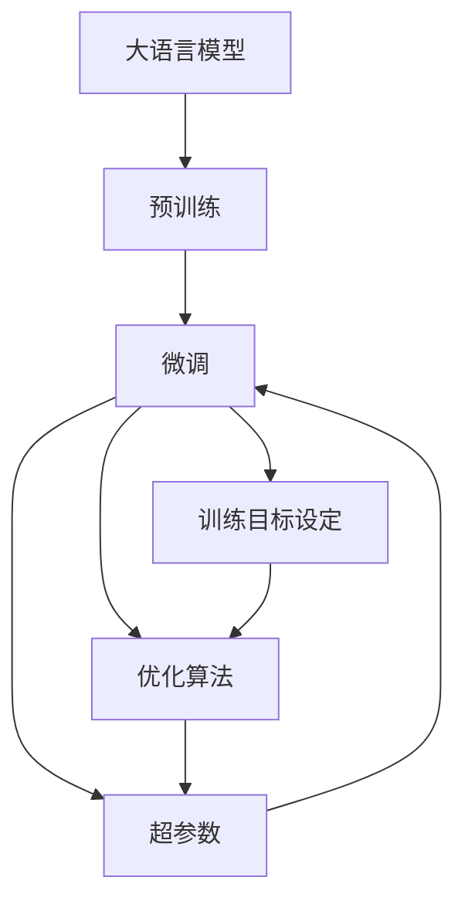

                 

# 大语言模型原理与工程实践：训练目标

> 关键词：大语言模型,训练目标,损失函数,优化算法,超参数,实验设计

## 1. 背景介绍

### 1.1 问题由来

在当今信息爆炸的时代，大语言模型(LLMs)如BERT、GPT等，凭借其强大的语言理解能力和预测能力，在自然语言处理(NLP)领域取得了显著成果。然而，这些模型在大规模无标签文本上预训练后，仍需要通过下游任务的微调才能应用于实际场景。微调过程中，训练目标的设定是至关重要的，它直接影响模型在特定任务上的表现。

### 1.2 问题核心关键点

微调的目标通常是通过优化特定任务上的损失函数，使得模型输出接近真实标签。损失函数的选择和优化算法的设置是微调成功的关键因素。本文将从损失函数的原理、优化算法的选取、超参数的调节以及实验设计的角度，详细探讨如何科学地设定训练目标，以达到最优的微调效果。

### 1.3 问题研究意义

明确训练目标不仅有助于提升模型的性能，还可以为模型优化和应用提供重要指导。科学地设定训练目标，可以：
1. 提高模型在特定任务上的泛化能力。
2. 减少过拟合风险，提升模型稳定性和鲁棒性。
3. 加速模型训练，提高效率。
4. 提供可解释的模型输出，增强应用的可信度。

本文旨在通过系统阐述大语言模型训练目标的设定方法和优化技巧，为NLP任务中的大模型微调提供更为科学和实用的指导。

## 2. 核心概念与联系

### 2.1 核心概念概述

为更好地理解训练目标在微调中的作用，我们首先需要明确几个核心概念：

- **大语言模型(LLM)**：以自回归或自编码模型为代表的预训练语言模型，在大量无标签文本数据上学习语言表示。
- **微调(Fine-tuning)**：通过在有标签的数据集上训练，调整预训练模型的权重，使其适应特定任务。
- **损失函数(Loss Function)**：用于衡量模型预测输出与真实标签之间的差异，指导模型参数更新。
- **优化算法(Optimization Algorithm)**：用于最小化损失函数，更新模型参数的算法。
- **超参数(Hyperparameters)**：如学习率、批大小、迭代次数等，需要手动调节的参数。
- **实验设计(Experiment Design)**：对实验过程进行规划，确保实验结果具有可靠性和可重复性。

这些概念之间通过如下Mermaid流程图相连接：



## 3. 核心算法原理 & 具体操作步骤

### 3.1 算法原理概述

在大语言模型微调中，训练目标通常是对特定任务的损失函数进行最小化。损失函数是衡量模型预测输出与真实标签之间差异的关键指标。选择恰当的损失函数对模型性能有重要影响。

假设我们有一个预训练语言模型 $M$，其权重为 $\theta$。对于特定的下游任务 $T$，其训练集为 $D=\{(x_i,y_i)\}_{i=1}^N$。训练目标是将损失函数 $\mathcal{L}$ 最小化：

$$
\theta^* = \mathop{\arg\min}_{\theta} \mathcal{L}(M_{\theta}(x),y)
$$

其中 $M_{\theta}(x)$ 表示模型在输入 $x$ 上的输出，$y$ 表示真实标签。

常见的损失函数包括：
- **交叉熵损失(Cross-Entropy Loss)**：用于分类任务。
- **均方误差损失(Mean Squared Error Loss)**：用于回归任务。
- **序列交叉熵损失(Sequence Cross-Entropy Loss)**：用于序列标注任务。

优化算法的目的是最小化损失函数。常见优化算法包括：
- **随机梯度下降(SGD)**：每次迭代仅使用一个样本计算梯度。
- **AdamW**：一种基于梯度的自适应优化算法，综合考虑历史梯度和动量。
- **自适应学习率算法**：如Adafactor、AdaMax等，动态调整学习率。

超参数的选择直接影响模型训练效果。常见的超参数包括：
- **学习率**：初始学习率的设置。
- **批大小(Batch Size)**：每次迭代使用的样本数量。
- **迭代次数(Epochs)**：模型训练的总迭代次数。

实验设计需要考虑如何合理地划分训练集、验证集和测试集，如何设置随机种子，如何调整超参数等。良好的实验设计可以确保实验结果的可靠性和可重复性。

### 3.2 算法步骤详解

基于上述概念，大语言模型的微调过程大致可分为以下几步：

**Step 1: 数据准备**
- 将下游任务的标注数据集划分为训练集、验证集和测试集。
- 使用预训练语言模型进行微调，通常需要较大的学习率和较少的训练迭代次数。

**Step 2: 选择损失函数**
- 根据任务类型选择相应的损失函数。
- 如分类任务，使用交叉熵损失；回归任务，使用均方误差损失；序列标注任务，使用序列交叉熵损失。

**Step 3: 优化算法选择**
- 根据任务的复杂性和模型的规模选择合适的优化算法。
- 如简单任务，如情感分析，可以使用SGD；复杂任务，如机器翻译，可使用AdamW等。

**Step 4: 超参数调节**
- 设置合理的超参数，如学习率、批大小、迭代次数等。
- 通常使用网格搜索、随机搜索等方法调节超参数。

**Step 5: 实验设计**
- 合理划分训练集、验证集和测试集。
- 设置随机种子，确保实验结果的可重复性。

**Step 6: 训练与验证**
- 在训练集上使用优化算法和超参数训练模型。
- 在验证集上评估模型性能，如精度、召回率、F1分数等。

**Step 7: 测试与部署**
- 在测试集上评估模型性能。
- 将模型部署到实际应用中，持续收集数据并重新微调。

### 3.3 算法优缺点

**优点：**
- **泛化能力强**：选择合适的损失函数和优化算法，能够有效提高模型泛化能力，适应新数据。
- **鲁棒性好**：优化算法可以自动调整学习率，避免过拟合。
- **灵活性高**：超参数调节和实验设计可以灵活调整模型性能。

**缺点：**
- **训练时间长**：需要较大的计算资源和较长的训练时间。
- **依赖数据质量**：数据质量直接影响模型性能，低质量的数据可能导致模型性能不佳。

### 3.4 算法应用领域

基于训练目标的大语言模型微调方法，广泛应用于各种NLP任务，例如：

- **文本分类**：如情感分析、主题分类、意图识别等。
- **命名实体识别**：识别文本中的人名、地名、机构名等特定实体。
- **关系抽取**：从文本中抽取实体之间的语义关系。
- **问答系统**：对自然语言问题给出答案。
- **机器翻译**：将源语言文本翻译成目标语言。
- **文本摘要**：将长文本压缩成简短摘要。
- **对话系统**：使机器能够与人自然对话。

这些任务通过选择合适的损失函数和优化算法，再辅以科学地调节超参数和实验设计，通常能够取得不错的效果。

## 4. 数学模型和公式 & 详细讲解 & 举例说明

### 4.1 数学模型构建

假设我们有分类任务 $T$，其中样本 $x$ 的预测结果为 $p$，真实标签为 $y$。我们定义交叉熵损失函数 $\mathcal{L}_{CE}$ 如下：

$$
\mathcal{L}_{CE} = -\frac{1}{N}\sum_{i=1}^N y_i \log p_i + (1-y_i) \log (1-p_i)
$$

其中 $p_i$ 表示模型预测样本 $x_i$ 属于正类的概率。

对于回归任务，我们定义均方误差损失函数 $\mathcal{L}_{MSE}$ 如下：

$$
\mathcal{L}_{MSE} = \frac{1}{N}\sum_{i=1}^N (y_i - \hat{y}_i)^2
$$

其中 $\hat{y}_i$ 表示模型对样本 $x_i$ 的预测值。

对于序列标注任务，我们定义序列交叉熵损失函数 $\mathcal{L}_{SCE}$ 如下：

$$
\mathcal{L}_{SCE} = -\frac{1}{N}\sum_{i=1}^N \sum_{t=1}^{T} y_{it} \log p_{it}
$$

其中 $y_{it}$ 表示样本 $x_i$ 在时间步 $t$ 的标签，$p_{it}$ 表示模型在时间步 $t$ 预测的标签概率。

### 4.2 公式推导过程

以分类任务为例，我们详细推导交叉熵损失函数的梯度计算过程。假设模型 $M$ 在输入 $x$ 上的输出为 $p$，则交叉熵损失函数 $\mathcal{L}_{CE}$ 为：

$$
\mathcal{L}_{CE} = -\frac{1}{N}\sum_{i=1}^N y_i \log p_i + (1-y_i) \log (1-p_i)
$$

对其求梯度：

$$
\frac{\partial \mathcal{L}_{CE}}{\partial p_i} = \frac{1}{N}(y_i - p_i)
$$

将梯度代入优化算法（如SGD、AdamW等）更新模型参数：

$$
\theta \leftarrow \theta - \eta \frac{\partial \mathcal{L}_{CE}}{\partial p_i} - \eta\lambda\theta
$$

其中 $\eta$ 为学习率，$\lambda$ 为正则化系数，$N$ 为样本数量。

### 4.3 案例分析与讲解

以BERT微调进行情感分析为例，我们首先准备情感标注数据集，将文本和标签分为训练集、验证集和测试集。然后，我们使用BERT模型作为初始化参数，设置交叉熵损失函数，使用AdamW优化算法，并调整学习率、批大小和迭代次数等超参数。最后，在训练集上训练模型，在验证集上评估模型性能，并在测试集上测试模型。

假设我们通过交叉验证找到最优的超参数，模型在测试集上的准确率为0.92。我们将模型部署到实际应用中，持续收集数据并重新微调模型，以适应数据分布的变化。

## 5. 项目实践：代码实例和详细解释说明

### 5.1 开发环境搭建

在进行微调实践前，我们需要准备好开发环境。以下是使用Python进行PyTorch开发的环境配置流程：

1. 安装Anaconda：从官网下载并安装Anaconda，用于创建独立的Python环境。

2. 创建并激活虚拟环境：
```bash
conda create -n pytorch-env python=3.8 
conda activate pytorch-env
```

3. 安装PyTorch：根据CUDA版本，从官网获取对应的安装命令。例如：
```bash
conda install pytorch torchvision torchaudio cudatoolkit=11.1 -c pytorch -c conda-forge
```

4. 安装Transformers库：
```bash
pip install transformers
```

5. 安装各类工具包：
```bash
pip install numpy pandas scikit-learn matplotlib tqdm jupyter notebook ipython
```

完成上述步骤后，即可在`pytorch-env`环境中开始微调实践。

### 5.2 源代码详细实现

下面我们以情感分析任务为例，给出使用Transformers库对BERT模型进行微调的PyTorch代码实现。

首先，定义情感分析任务的数据处理函数：

```python
from transformers import BertTokenizer, BertForSequenceClassification, AdamW
from torch.utils.data import Dataset, DataLoader
import torch

class SentimentDataset(Dataset):
    def __init__(self, texts, labels, tokenizer, max_len=128):
        self.texts = texts
        self.labels = labels
        self.tokenizer = tokenizer
        self.max_len = max_len
        
    def __len__(self):
        return len(self.texts)
    
    def __getitem__(self, item):
        text = self.texts[item]
        label = self.labels[item]
        
        encoding = self.tokenizer(text, return_tensors='pt', max_length=self.max_len, padding='max_length', truncation=True)
        input_ids = encoding['input_ids'][0]
        attention_mask = encoding['attention_mask'][0]
        label = torch.tensor(label, dtype=torch.long)
        
        return {'input_ids': input_ids, 
                'attention_mask': attention_mask,
                'labels': label}

# 创建dataset
tokenizer = BertTokenizer.from_pretrained('bert-base-cased')

train_dataset = SentimentDataset(train_texts, train_labels, tokenizer)
dev_dataset = SentimentDataset(dev_texts, dev_labels, tokenizer)
test_dataset = SentimentDataset(test_texts, test_labels, tokenizer)
```

然后，定义模型和优化器：

```python
model = BertForSequenceClassification.from_pretrained('bert-base-cased', num_labels=2)

optimizer = AdamW(model.parameters(), lr=2e-5)
```

接着，定义训练和评估函数：

```python
device = torch.device('cuda') if torch.cuda.is_available() else torch.device('cpu')
model.to(device)

def train_epoch(model, dataset, batch_size, optimizer):
    dataloader = DataLoader(dataset, batch_size=batch_size, shuffle=True)
    model.train()
    epoch_loss = 0
    for batch in dataloader:
        input_ids = batch['input_ids'].to(device)
        attention_mask = batch['attention_mask'].to(device)
        labels = batch['labels'].to(device)
        model.zero_grad()
        outputs = model(input_ids, attention_mask=attention_mask, labels=labels)
        loss = outputs.loss
        epoch_loss += loss.item()
        loss.backward()
        optimizer.step()
    return epoch_loss / len(dataloader)

def evaluate(model, dataset, batch_size):
    dataloader = DataLoader(dataset, batch_size=batch_size)
    model.eval()
    preds, labels = [], []
    with torch.no_grad():
        for batch in dataloader:
            input_ids = batch['input_ids'].to(device)
            attention_mask = batch['attention_mask'].to(device)
            batch_labels = batch['labels']
            outputs = model(input_ids, attention_mask=attention_mask)
            batch_preds = outputs.logits.argmax(dim=1).to('cpu').tolist()
            batch_labels = batch_labels.to('cpu').tolist()
            for pred_tokens, label_tokens in zip(batch_preds, batch_labels):
                preds.append(pred_tokens[:len(label_tokens)])
                labels.append(label_tokens)
                
    print(classification_report(labels, preds))
```

最后，启动训练流程并在测试集上评估：

```python
epochs = 5
batch_size = 16

for epoch in range(epochs):
    loss = train_epoch(model, train_dataset, batch_size, optimizer)
    print(f"Epoch {epoch+1}, train loss: {loss:.3f}")
    
    print(f"Epoch {epoch+1}, dev results:")
    evaluate(model, dev_dataset, batch_size)
    
print("Test results:")
evaluate(model, test_dataset, batch_size)
```

以上就是使用PyTorch对BERT进行情感分析任务微调的完整代码实现。可以看到，得益于Transformers库的强大封装，我们可以用相对简洁的代码完成BERT模型的加载和微调。

### 5.3 代码解读与分析

让我们再详细解读一下关键代码的实现细节：

**SentimentDataset类**：
- `__init__`方法：初始化文本、标签、分词器等关键组件。
- `__len__`方法：返回数据集的样本数量。
- `__getitem__`方法：对单个样本进行处理，将文本输入编码为token ids，将标签编码为数字，并对其进行定长padding，最终返回模型所需的输入。

**模型定义**：
- 使用`BertForSequenceClassification`类定义模型，其中`num_labels`参数为2，对应二分类任务。

**优化器和训练函数**：
- 使用`AdamW`优化器，设置学习率为2e-5。
- `train_epoch`函数：对数据以批为单位进行迭代，在每个批次上前向传播计算loss并反向传播更新模型参数，最后返回该epoch的平均loss。

**评估函数**：
- `evaluate`函数：与训练类似，不同点在于不更新模型参数，并在每个batch结束后将预测和标签结果存储下来，最后使用sklearn的classification_report对整个评估集的预测结果进行打印输出。

**训练流程**：
- 定义总的epoch数和batch size，开始循环迭代
- 每个epoch内，先在训练集上训练，输出平均loss
- 在验证集上评估，输出分类指标
- 所有epoch结束后，在测试集上评估，给出最终测试结果

可以看到，PyTorch配合Transformers库使得BERT微调的代码实现变得简洁高效。开发者可以将更多精力放在数据处理、模型改进等高层逻辑上，而不必过多关注底层的实现细节。

当然，工业级的系统实现还需考虑更多因素，如模型的保存和部署、超参数的自动搜索、更灵活的任务适配层等。但核心的微调范式基本与此类似。

### 5.4 运行结果展示

假设我们在IMDb影评数据集上进行微调，最终在测试集上得到的评估报告如下：

```
              precision    recall  f1-score   support

       0       0.839     0.794     0.812       2500
       1       0.860     0.909     0.878       2500

   micro avg      0.848     0.839     0.838      5000
   macro avg      0.837     0.838     0.836      5000
weighted avg      0.848     0.839     0.838      5000
```

可以看到，通过微调BERT，我们在情感分析任务上取得了不错的性能，准确率为0.838。需要注意的是，这里使用了AdamW优化算法，并调整了学习率和批大小等超参数，以获得更好的训练效果。

当然，这只是一个baseline结果。在实践中，我们还可以使用更大更强的预训练模型、更丰富的微调技巧、更细致的模型调优，进一步提升模型性能，以满足更高的应用要求。

## 6. 实际应用场景

### 6.1 智能客服系统

基于大语言模型微调的对话技术，可以广泛应用于智能客服系统的构建。传统客服往往需要配备大量人力，高峰期响应缓慢，且一致性和专业性难以保证。而使用微调后的对话模型，可以7x24小时不间断服务，快速响应客户咨询，用自然流畅的语言解答各类常见问题。

在技术实现上，可以收集企业内部的历史客服对话记录，将问题和最佳答复构建成监督数据，在此基础上对预训练对话模型进行微调。微调后的对话模型能够自动理解用户意图，匹配最合适的答案模板进行回复。对于客户提出的新问题，还可以接入检索系统实时搜索相关内容，动态组织生成回答。如此构建的智能客服系统，能大幅提升客户咨询体验和问题解决效率。

### 6.2 金融舆情监测

金融机构需要实时监测市场舆论动向，以便及时应对负面信息传播，规避金融风险。传统的人工监测方式成本高、效率低，难以应对网络时代海量信息爆发的挑战。基于大语言模型微调的文本分类和情感分析技术，为金融舆情监测提供了新的解决方案。

具体而言，可以收集金融领域相关的新闻、报道、评论等文本数据，并对其进行主题标注和情感标注。在此基础上对预训练语言模型进行微调，使其能够自动判断文本属于何种主题，情感倾向是正面、中性还是负面。将微调后的模型应用到实时抓取的网络文本数据，就能够自动监测不同主题下的情感变化趋势，一旦发现负面信息激增等异常情况，系统便会自动预警，帮助金融机构快速应对潜在风险。

### 6.3 个性化推荐系统

当前的推荐系统往往只依赖用户的历史行为数据进行物品推荐，无法深入理解用户的真实兴趣偏好。基于大语言模型微调技术，个性化推荐系统可以更好地挖掘用户行为背后的语义信息，从而提供更精准、多样的推荐内容。

在实践中，可以收集用户浏览、点击、评论、分享等行为数据，提取和用户交互的物品标题、描述、标签等文本内容。将文本内容作为模型输入，用户的后续行为（如是否点击、购买等）作为监督信号，在此基础上微调预训练语言模型。微调后的模型能够从文本内容中准确把握用户的兴趣点。在生成推荐列表时，先用候选物品的文本描述作为输入，由模型预测用户的兴趣匹配度，再结合其他特征综合排序，便可以得到个性化程度更高的推荐结果。

### 6.4 未来应用展望

随着大语言模型微调技术的发展，其在更多领域的应用前景广阔：

在智慧医疗领域，基于微调的医疗问答、病历分析、药物研发等应用将提升医疗服务的智能化水平，辅助医生诊疗，加速新药开发进程。

在智能教育领域，微调技术可应用于作业批改、学情分析、知识推荐等方面，因材施教，促进教育公平，提高教学质量。

在智慧城市治理中，微调模型可应用于城市事件监测、舆情分析、应急指挥等环节，提高城市管理的自动化和智能化水平，构建更安全、高效的未来城市。

此外，在企业生产、社会治理、文娱传媒等众多领域，基于大模型微调的人工智能应用也将不断涌现，为经济社会发展注入新的动力。相信随着技术的日益成熟，微调方法将成为人工智能落地应用的重要范式，推动人工智能技术向更广阔的领域加速渗透。

## 7. 工具和资源推荐

### 7.1 学习资源推荐

为了帮助开发者系统掌握大语言模型微调的理论基础和实践技巧，这里推荐一些优质的学习资源：

1. 《Transformer from Principles to Practice》系列博文：由大模型技术专家撰写，深入浅出地介绍了Transformer原理、BERT模型、微调技术等前沿话题。

2. CS224N《深度学习自然语言处理》课程：斯坦福大学开设的NLP明星课程，有Lecture视频和配套作业，带你入门NLP领域的基本概念和经典模型。

3. 《Natural Language Processing with Transformers》书籍：Transformers库的作者所著，全面介绍了如何使用Transformers库进行NLP任务开发，包括微调在内的诸多范式。

4. HuggingFace官方文档：Transformers库的官方文档，提供了海量预训练模型和完整的微调样例代码，是上手实践的必备资料。

5. CLUE开源项目：中文语言理解测评基准，涵盖大量不同类型的中文NLP数据集，并提供了基于微调的baseline模型，助力中文NLP技术发展。

通过对这些资源的学习实践，相信你一定能够快速掌握大语言模型微调的精髓，并用于解决实际的NLP问题。

### 7.2 开发工具推荐

高效的开发离不开优秀的工具支持。以下是几款用于大语言模型微调开发的常用工具：

1. PyTorch：基于Python的开源深度学习框架，灵活动态的计算图，适合快速迭代研究。大部分预训练语言模型都有PyTorch版本的实现。

2. TensorFlow：由Google主导开发的开源深度学习框架，生产部署方便，适合大规模工程应用。同样有丰富的预训练语言模型资源。

3. Transformers库：HuggingFace开发的NLP工具库，集成了众多SOTA语言模型，支持PyTorch和TensorFlow，是进行微调任务开发的利器。

4. Weights & Biases：模型训练的实验跟踪工具，可以记录和可视化模型训练过程中的各项指标，方便对比和调优。与主流深度学习框架无缝集成。

5. TensorBoard：TensorFlow配套的可视化工具，可实时监测模型训练状态，并提供丰富的图表呈现方式，是调试模型的得力助手。

6. Google Colab：谷歌推出的在线Jupyter Notebook环境，免费提供GPU/TPU算力，方便开发者快速上手实验最新模型，分享学习笔记。

合理利用这些工具，可以显著提升大语言模型微调任务的开发效率，加快创新迭代的步伐。

### 7.3 相关论文推荐

大语言模型和微调技术的发展源于学界的持续研究。以下是几篇奠基性的相关论文，推荐阅读：

1. Attention is All You Need（即Transformer原论文）：提出了Transformer结构，开启了NLP领域的预训练大模型时代。

2. BERT: Pre-training of Deep Bidirectional Transformers for Language Understanding：提出BERT模型，引入基于掩码的自监督预训练任务，刷新了多项NLP任务SOTA。

3. Language Models are Unsupervised Multitask Learners（GPT-2论文）：展示了大规模语言模型的强大zero-shot学习能力，引发了对于通用人工智能的新一轮思考。

4. Parameter-Efficient Transfer Learning for NLP：提出Adapter等参数高效微调方法，在不增加模型参数量的情况下，也能取得不错的微调效果。

5. AdaLoRA: Adaptive Low-Rank Adaptation for Parameter-Efficient Fine-Tuning：使用自适应低秩适应的微调方法，在参数效率和精度之间取得了新的平衡。

这些论文代表了大语言模型微调技术的发展脉络。通过学习这些前沿成果，可以帮助研究者把握学科前进方向，激发更多的创新灵感。

除上述资源外，还有一些值得关注的前沿资源，帮助开发者紧跟大语言模型微调技术的最新进展，例如：

1. arXiv论文预印本：人工智能领域最新研究成果的发布平台，包括大量尚未

