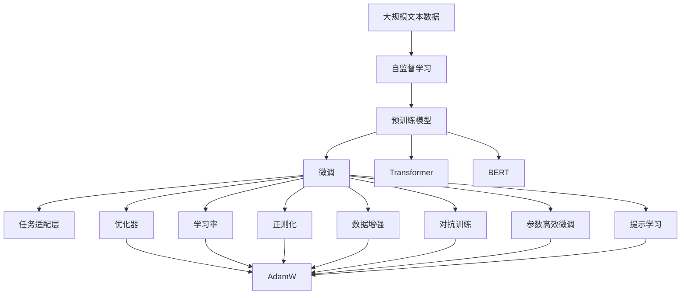
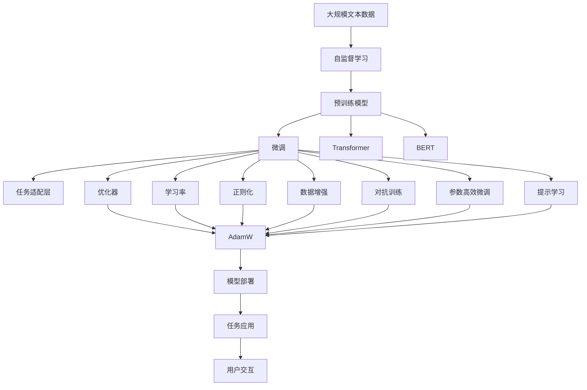

                 

# 大语言模型原理与工程实践：预训练语言模型

> 关键词：
> - 大语言模型
> - 预训练语言模型
> - 自监督学习
> - 深度学习
> - Transformer
> - BERT
> - 自然语言处理(NLP)

## 1. 背景介绍

### 1.1 问题由来
近年来，深度学习在自然语言处理(NLP)领域取得了巨大突破，其中以大语言模型（Large Language Models, LLMs）为代表。这些模型通常基于Transformer架构，通过在大规模无标签文本数据上进行自监督预训练，学习到丰富的语言知识，具备了强大的自然语言理解和生成能力。BERT、GPT系列等预训练模型在多项任务上刷新了最先进的结果，成为了NLP研究与应用的基石。

大语言模型通过在无标签文本上进行大规模自监督学习，使得模型能够从数据中自动学习到语言的统计规律和语义表示，具备了良好的泛化能力。这些模型通常采用Transformer架构，通过自注意力机制，能够自动捕捉输入序列中的长距离依赖关系。然而，尽管这些模型在理论上和实践中均取得了显著进展，但在实际应用中，如何有效地利用这些模型，进行任务特定微调，仍是一个关键问题。

### 1.2 问题核心关键点
大语言模型的微调（Fine-Tuning）是指在预训练模型的基础上，通过添加特定的任务适配层，并在少量有标签数据上进行有监督训练，以优化模型在该任务上的性能。微调可以显著提高模型在特定任务上的效果，从而实现NLP任务的落地应用。微调的核心挑战在于如何在不破坏预训练权重的情况下，快速适应新任务，同时避免过拟合。

预训练语言模型的微调主要包括以下几个关键点：
1. 选择合适的预训练模型。
2. 设计适当的任务适配层。
3. 选择合适的优化器和学习率。
4. 应用正则化技术。
5. 引入数据增强和对抗训练。
6. 考虑参数高效微调和提示学习。

### 1.3 问题研究意义
大语言模型微调在NLP领域具有重要研究意义：
1. 提高模型性能：通过微调，模型可以适应新任务，取得更好的效果。
2. 降低开发成本：微调可以重用预训练模型，减少从头开始训练的复杂度和成本。
3. 加速任务开发：微调可以加速新任务的应用开发，缩短项目周期。
4. 实现知识迁移：微调可以继承预训练模型的广泛知识，应用于不同领域。
5. 提升应用效果：微调可以针对特定任务进行优化，提高模型的实用性。

## 2. 核心概念与联系

### 2.1 核心概念概述

预训练语言模型（Pretrained Language Model, PLM）是指在大规模无标签文本数据上进行自监督学习，学习到语言表征的模型。其核心思想是通过无监督学习，从大规模语料中自动学习语言的通用表示。常用的预训练模型包括BERT、GPT系列、RoBERTa等。

自监督学习（Self-Supervised Learning）是指通过设计一系列无标签训练任务，从数据中自动学习模型。常见的自监督任务包括语言建模、掩码语言模型、下标预测等。

Transformer是一种基于自注意力机制的神经网络架构，能够高效地处理序列数据。它通过多头自注意力机制，能够捕捉序列中的长期依赖关系，提升了模型的表现。

BERT是Google开发的预训练语言模型，通过在掩码语言模型和下标预测任务上进行训练，学习到了丰富的语言表示。

大语言模型（Large Language Model, LLM）是指参数规模较大的预训练语言模型，通常包含数十亿个参数，能够处理大规模语言数据。

微调（Fine-Tuning）是指在预训练模型的基础上，通过有监督学习，适应特定任务的模型。

### 2.2 概念间的关系

这些核心概念之间存在紧密联系，形成了一个完整的预训练语言模型微调框架。预训练语言模型通过自监督学习，学习到语言的通用表示。微调通过添加特定的任务适配层，在有标签数据上进行有监督训练，使得模型适应新任务。Transformer作为预训练模型的关键架构，通过自注意力机制，捕捉输入序列中的长距离依赖关系。BERT则是一种基于Transformer的预训练语言模型，通过设计特定的自监督任务，学习到丰富的语言表示。

这些概念之间的关系可以用以下Mermaid流程图来展示：



这个流程图展示了预训练语言模型微调过程的核心组成部分：
1. 大规模文本数据通过自监督学习，训练出预训练模型。
2. 预训练模型通过微调，适应特定任务，添加任务适配层。
3. 优化器、学习率、正则化、数据增强、对抗训练等技术，用于提升微调效果。
4. 参数高效微调和提示学习等方法，进一步提升模型性能。

### 2.3 核心概念的整体架构

以下综合流程图展示了预训练语言模型微调过程的整体架构：



这个综合流程图展示了预训练语言模型微调过程的整体架构：
1. 大规模文本数据通过自监督学习，训练出预训练模型。
2. 预训练模型通过微调，适应特定任务，添加任务适配层。
3. 优化器、学习率、正则化、数据增强、对抗训练等技术，用于提升微调效果。
4. 参数高效微调和提示学习等方法，进一步提升模型性能。
5. 微调后的模型可以部署到实际任务中，应用于用户交互。

## 3. 核心算法原理 & 具体操作步骤

### 3.1 算法原理概述

预训练语言模型的微调，本质上是一个有监督的细粒度迁移学习过程。其核心思想是利用预训练模型的语言表示能力，通过在特定任务的数据集上进行有监督学习，优化模型在任务上的表现。微调过程通常包括以下几个步骤：
1. 准备预训练模型和数据集。
2. 添加任务适配层。
3. 设置微调超参数。
4. 执行梯度训练。
5. 测试和部署微调后的模型。

微调的核心在于如何在不破坏预训练权重的情况下，快速适应新任务，同时避免过拟合。主要的方法包括：选择合适的优化器和学习率，应用正则化技术，引入数据增强和对抗训练，考虑参数高效微调和提示学习等。

### 3.2 算法步骤详解

#### 3.2.1 准备预训练模型和数据集

1. 选择合适的预训练模型：常用的预训练模型包括BERT、GPT系列、RoBERTa等。这些模型都基于Transformer架构，能够处理大规模文本数据。
2. 准备下游任务的数据集：数据集通常包括训练集、验证集和测试集。训练集用于微调模型的初始化训练，验证集用于调整超参数和防止过拟合，测试集用于最终评估模型性能。

#### 3.2.2 添加任务适配层

任务适配层（Task Adaptation Layer）通常包括分类器、解码器等，用于将预训练模型的输出映射到具体的任务上。例如，在文本分类任务中，适配层可以是一个线性分类器；在机器翻译任务中，适配层可以是解码器。适配层的添加需要根据具体的任务进行调整。

#### 3.2.3 设置微调超参数

1. 选择合适的优化器：常用的优化器包括Adam、AdamW等，这些优化器具有良好的收敛速度和泛化性能。
2. 设置学习率：学习率通常设置为预训练学习率的小值，避免破坏预训练权重。
3. 应用正则化技术：常用的正则化技术包括L2正则、Dropout等，用于防止模型过拟合。
4. 引入数据增强和对抗训练：数据增强可以通过回译、混杂词形等方法，扩充训练集；对抗训练可以通过引入对抗样本，提高模型的鲁棒性。

#### 3.2.4 执行梯度训练

1. 将训练集数据分批次输入模型，前向传播计算损失函数。
2. 反向传播计算参数梯度，根据设定的优化算法和学习率更新模型参数。
3. 周期性在验证集上评估模型性能，根据性能指标决定是否触发Early Stopping。
4. 重复上述步骤直至满足预设的迭代轮数或Early Stopping条件。

#### 3.2.5 测试和部署

1. 在测试集上评估微调后模型的性能，对比微调前后的精度提升。
2. 使用微调后的模型对新样本进行推理预测，集成到实际的应用系统中。
3. 持续收集新的数据，定期重新微调模型，以适应数据分布的变化。

### 3.3 算法优缺点

预训练语言模型的微调方法具有以下优点：
1. 简单高效：只需准备少量标注数据，即可对预训练模型进行快速适配，获得较大的性能提升。
2. 通用适用：适用于各种NLP下游任务，包括分类、匹配、生成等，设计简单的任务适配层即可实现微调。
3. 参数高效：利用参数高效微调技术，在固定大部分预训练参数的情况下，仍可取得不错的提升。
4. 效果显著：在学术界和工业界的诸多任务上，基于微调的方法已经刷新了最先进的性能指标。

同时，该方法也存在一定的局限性：
1. 依赖标注数据：微调的效果很大程度上取决于标注数据的质量和数量，获取高质量标注数据的成本较高。
2. 迁移能力有限：当目标任务与预训练数据的分布差异较大时，微调的性能提升有限。
3. 负面效果传递：预训练模型的固有偏见、有害信息等，可能通过微调传递到下游任务，造成负面影响。
4. 可解释性不足：微调模型的决策过程通常缺乏可解释性，难以对其推理逻辑进行分析和调试。

尽管存在这些局限性，但就目前而言，基于监督学习的微调方法仍是大语言模型应用的主流范式。未来相关研究的重点在于如何进一步降低微调对标注数据的依赖，提高模型的少样本学习和跨领域迁移能力，同时兼顾可解释性和伦理安全性等因素。

### 3.4 算法应用领域

预训练语言模型的微调方法在NLP领域得到了广泛应用，覆盖了几乎所有常见任务，例如：

1. 文本分类：如情感分析、主题分类、意图识别等。通过微调使模型学习文本-标签映射。
2. 命名实体识别：识别文本中的人名、地名、机构名等特定实体。通过微调使模型掌握实体边界和类型。
3. 关系抽取：从文本中抽取实体之间的语义关系。通过微调使模型学习实体-关系三元组。
4. 问答系统：对自然语言问题给出答案。将问题-答案对作为微调数据，训练模型学习匹配答案。
5. 机器翻译：将源语言文本翻译成目标语言。通过微调使模型学习语言-语言映射。
6. 文本摘要：将长文本压缩成简短摘要。将文章-摘要对作为微调数据，使模型学习抓取要点。
7. 对话系统：使机器能够与人自然对话。将多轮对话历史作为上下文，微调模型进行回复生成。

除了上述这些经典任务外，预训练语言模型的微调也被创新性地应用到更多场景中，如可控文本生成、常识推理、代码生成、数据增强等，为NLP技术带来了全新的突破。随着预训练模型和微调方法的不断进步，相信NLP技术将在更广阔的应用领域大放异彩。

## 4. 数学模型和公式 & 详细讲解

### 4.1 数学模型构建

在预训练语言模型的微调过程中，我们通常使用基于梯度的优化算法（如Adam、SGD等）来近似求解最优化问题。假设预训练语言模型为 $M_{\theta}$，其中 $\theta$ 为预训练得到的模型参数。给定下游任务 $T$ 的标注数据集 $D=\{(x_i,y_i)\}_{i=1}^N$，微调的目标是找到新的模型参数 $\hat{\theta}$，使得：

$$
\hat{\theta}=\mathop{\arg\min}_{\theta} \mathcal{L}(M_{\theta},D)
$$

其中 $\mathcal{L}$ 为针对任务 $T$ 设计的损失函数，用于衡量模型预测输出与真实标签之间的差异。常见的损失函数包括交叉熵损失、均方误差损失等。

通过梯度下降等优化算法，微调过程不断更新模型参数 $\theta$，最小化损失函数 $\mathcal{L}$，使得模型输出逼近真实标签。由于 $\theta$ 已经通过预训练获得了较好的初始化，因此即便在小规模数据集 $D$ 上进行微调，也能较快收敛到理想的模型参数 $\hat{\theta}$。

### 4.2 公式推导过程

以二分类任务为例，假设模型 $M_{\theta}$ 在输入 $x$ 上的输出为 $\hat{y}=M_{\theta}(x) \in [0,1]$，表示样本属于正类的概率。真实标签 $y \in \{0,1\}$。则二分类交叉熵损失函数定义为：

$$
\ell(M_{\theta}(x),y) = -[y\log \hat{y} + (1-y)\log (1-\hat{y})]
$$

将其代入经验风险公式，得：

$$
\mathcal{L}(\theta) = -\frac{1}{N}\sum_{i=1}^N [y_i\log M_{\theta}(x_i)+(1-y_i)\log(1-M_{\theta}(x_i))]
$$

根据链式法则，损失函数对参数 $\theta_k$ 的梯度为：

$$
\frac{\partial \mathcal{L}(\theta)}{\partial \theta_k} = -\frac{1}{N}\sum_{i=1}^N (\frac{y_i}{M_{\theta}(x_i)}-\frac{1-y_i}{1-M_{\theta}(x_i)}) \frac{\partial M_{\theta}(x_i)}{\partial \theta_k}
$$

其中 $\frac{\partial M_{\theta}(x_i)}{\partial \theta_k}$ 可进一步递归展开，利用自动微分技术完成计算。

在得到损失函数的梯度后，即可带入参数更新公式，完成模型的迭代优化。重复上述过程直至收敛，最终得到适应下游任务的最优模型参数 $\hat{\theta}$。

### 4.3 案例分析与讲解

我们以BERT模型为例，分析其在情感分类任务上的微调过程。

BERT模型由多层Transformer组成，每一层包括多个自注意力头。假设BERT模型的输入序列长度为 $L$，则输入向量为 $\{x_1, x_2, \ldots, x_L\}$。输入向量通过多层的Transformer编码，得到输出向量 $\{h_1, h_2, \ldots, h_L\}$，其中每个 $h_i$ 表示输入序列中第 $i$ 个位置的语义表示。

假设输出层是一个二分类器，对于输入序列 $x$，模型输出的分类概率为 $\hat{y} = \sigma(W_h h_L + b_h)$，其中 $W_h$ 和 $b_h$ 为分类器的参数。分类器的损失函数为二分类交叉熵损失：

$$
\ell(M_{\theta}(x),y) = -y\log \hat{y} - (1-y)\log (1-\hat{y})
$$

将分类器参数 $W_h$ 和 $b_h$ 表示为 $V_h = [w_1, w_2, \ldots, w_L]^T$，则分类器的损失函数可表示为：

$$
\mathcal{L}(\theta) = -\frac{1}{N}\sum_{i=1}^N [y_i\log \hat{y} + (1-y_i)\log (1-\hat{y})]
$$

其中 $\hat{y} = \sigma(V_h^T h_L)$。

分类器的梯度更新公式为：

$$
\frac{\partial \mathcal{L}(\theta)}{\partial V_h} = \frac{\partial \mathcal{L}(\theta)}{\partial \hat{y}} \frac{\partial \hat{y}}{\partial V_h} = \frac{\partial \mathcal{L}(\theta)}{\partial V_h} \frac{\partial \hat{y}}{\partial h_L} \frac{\partial h_L}{\partial V_h} = \frac{\partial \mathcal{L}(\theta)}{\partial h_L} \frac{\partial h_L}{\partial V_h}
$$

其中 $\frac{\partial \mathcal{L}(\theta)}{\partial h_L}$ 可以通过反向传播计算得到。因此，分类器的参数更新公式为：

$$
V_h \leftarrow V_h - \eta \nabla_{V_h}\mathcal{L}(\theta) - \eta\lambda V_h
$$

其中 $\eta$ 为学习率，$\lambda$ 为正则化系数。

上述公式展示了BERT模型在情感分类任务上的微调过程。通过添加二分类器，并在训练集上进行有监督训练，微调后的BERT模型能够有效地适应情感分类任务，取得了较高的精度。

## 5. 项目实践：代码实例和详细解释说明

### 5.1 开发环境搭建

在进行微调实践前，我们需要准备好开发环境。以下是使用Python进行PyTorch开发的环境配置流程：

1. 安装Anaconda：从官网下载并安装Anaconda，用于创建独立的Python环境。

2. 创建并激活虚拟环境：
```bash
conda create -n pytorch-env python=3.8 
conda activate pytorch-env
```

3. 安装PyTorch：根据CUDA版本，从官网获取对应的安装命令。例如：
```bash
conda install pytorch torchvision torchaudio cudatoolkit=11.1 -c pytorch -c conda-forge
```

4. 安装Transformers库：
```bash
pip install transformers
```

5. 安装各类工具包：
```bash
pip install numpy pandas scikit-learn matplotlib tqdm jupyter notebook ipython
```

完成上述步骤后，即可在`pytorch-env`环境中开始微调实践。

### 5.2 源代码详细实现

下面我们以情感分类任务为例，给出使用Transformers库对BERT模型进行微调的PyTorch代码实现。

首先，定义情感分类任务的数据处理函数：

```python
from transformers import BertTokenizer
from torch.utils.data import Dataset
import torch

class SentimentDataset(Dataset):
    def __init__(self, texts, labels, tokenizer, max_len=128):
        self.texts = texts
        self.labels = labels
        self.tokenizer = tokenizer
        self.max_len = max_len
        
    def __len__(self):
        return len(self.texts)
    
    def __getitem__(self, item):
        text = self.texts[item]
        label = self.labels[item]
        
        encoding = self.tokenizer(text, return_tensors='pt', max_length=self.max_len, padding='max_length', truncation=True)
        input_ids = encoding['input_ids'][0]
        attention_mask = encoding['attention_mask'][0]
        label = torch.tensor(label, dtype=torch.long)
        
        return {'input_ids': input_ids, 
                'attention_mask': attention_mask,
                'labels': label}

# 标签与id的映射
label2id = {'positive': 1, 'negative': 0}
id2label = {v: k for k, v in label2id.items()}

# 创建dataset
tokenizer = BertTokenizer.from_pretrained('bert-base-cased')

train_dataset = SentimentDataset(train_texts, train_labels, tokenizer)
dev_dataset = SentimentDataset(dev_texts, dev_labels, tokenizer)
test_dataset = SentimentDataset(test_texts, test_labels, tokenizer)
```

然后，定义模型和优化器：

```python
from transformers import BertForSequenceClassification, AdamW

model = BertForSequenceClassification.from_pretrained('bert-base-cased', num_labels=2)

optimizer = AdamW(model.parameters(), lr=2e-5)
```

接着，定义训练和评估函数：

```python
from torch.utils.data import DataLoader
from tqdm import tqdm
from sklearn.metrics import classification_report

device = torch.device('cuda') if torch.cuda.is_available() else torch.device('cpu')
model.to(device)

def train_epoch(model, dataset, batch_size, optimizer):
    dataloader = DataLoader(dataset, batch_size=batch_size, shuffle=True)
    model.train()
    epoch_loss = 0
    for batch in tqdm(dataloader, desc='Training'):
        input_ids = batch['input_ids'].to(device)
        attention_mask = batch['attention_mask'].to(device)
        labels = batch['labels'].to(device)
        model.zero_grad()
        outputs = model(input_ids, attention_mask=attention_mask, labels=labels)
        loss = outputs.loss
        epoch_loss += loss.item()
        loss.backward()
        optimizer.step()
    return epoch_loss / len(dataloader)

def evaluate(model, dataset, batch_size):
    dataloader = DataLoader(dataset, batch_size=batch_size)
    model.eval()
    preds, labels = [], []
    with torch.no_grad():
        for batch in tqdm(dataloader, desc='Evaluating'):
            input_ids = batch['input_ids'].to(device)
            attention_mask = batch['attention_mask'].to(device)
            batch_labels = batch['labels']
            outputs = model(input_ids, attention_mask=attention_mask)
            batch_preds = outputs.logits.argmax(dim=2).to('cpu').tolist()
            batch_labels = batch_labels.to('cpu').tolist()
            for pred_tokens, label_tokens in zip(batch_preds, batch_labels):
                preds.append(pred_tokens[:len(label_tokens)])
                labels.append(label_tokens)
                
    print(classification_report(labels, preds))
```

最后，启动训练流程并在测试集上评估：

```python
epochs = 5
batch_size = 16

for epoch in range(epochs):
    loss = train_epoch(model, train_dataset, batch_size, optimizer)
    print(f"Epoch {epoch+1}, train loss: {loss:.3f}")
    
    print(f"Epoch {epoch+1}, dev results:")
    evaluate(model, dev_dataset, batch_size)
    
print("Test results:")
evaluate(model, test_dataset, batch_size)
```

以上就是使用PyTorch对BERT进行情感分类任务微调的完整代码实现。可以看到，得益于Transformers库的强大封装，我们可以用相对简洁的代码完成BERT模型的加载和微调。

### 5.3 代码解读与分析

让我们再详细解读一下关键代码的实现细节：

**SentimentDataset类**：
- `__init__`方法：初始化文本、标签、分词器等关键组件。
- `__len__`方法：返回数据集的样本数量。
- `__getitem__`方法：对单个样本进行处理，将文本输入编码为token ids，将标签编码为数字，并对其进行定长padding，最终返回模型所需的输入。

**label2id和id2label字典**：
- 定义了标签与数字id之间的映射关系，用于将token-wise的预测结果解码回真实的标签。

**训练和评估函数**：
- 使用PyTorch的DataLoader对数据集进行批次化加载，供模型训练和推理使用。
- 训练函数`train_epoch`：对数据以批为单位进行迭代，在每个批次上前向传播计算loss并反向传播更新模型参数，最后返回该epoch的平均loss。
- 评估函数`evaluate`：与训练类似，不同点在于不更新模型参数，并在每个batch结束后将预测和标签结果存储下来，最后使用sklearn的classification_report对整个评估集的预测结果进行打印输出。

**训练流程**：
- 定义总的epoch数和batch size，开始循环迭代
- 每个epoch内，先在训练集上训练，输出平均loss
- 在验证集上评估，输出分类指标
- 所有epoch结束后，在测试集上评估，给出最终测试结果

可以看到，PyTorch配合Transformers库使得BERT微调的代码实现变得简洁高效。开发者可以将更多精力放在数据处理、模型改进等高层逻辑上，而不必过多关注底层的实现细节。

当然，工业级的系统实现还需考虑更多因素，如模型的保存和部署、超参数的自动搜索、更灵活的任务适配层等。但核心的微调范式基本与此类似。

### 5.4 运行结果展示

假设我们在CoNLL-2003的情感分类数据集上进行微调

