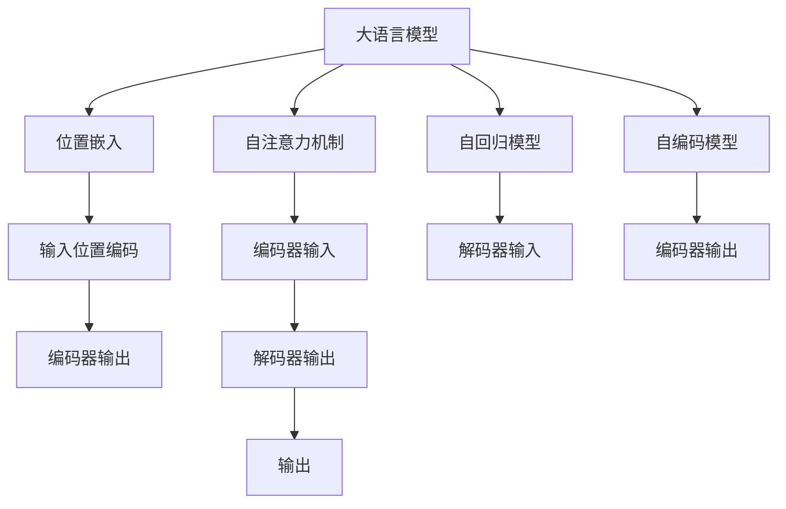
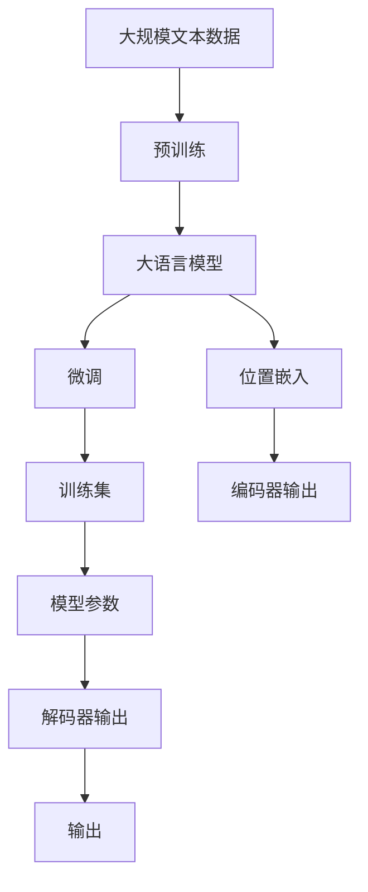

                 

# 大语言模型原理基础与前沿 位置嵌入

> 关键词：大语言模型,位置嵌入,Transformer,自注意力机制,自回归模型,自编码模型,预训练,微调

## 1. 背景介绍

### 1.1 问题由来
近年来，大语言模型的发展取得了显著的进展，尤其是在大规模无标签文本数据的预训练和下游任务的微调方面。然而，在大规模预训练过程中，模型需要处理大量文本数据，这对计算资源和存储空间提出了极高的要求。为了降低预训练成本，研究者提出了位置嵌入（Position Embedding）的概念，利用位置信息来辅助文本表示的生成，从而简化预训练过程。

位置嵌入最初应用于自然语言处理（NLP）领域，用于解决词序问题。传统模型如RNN无法捕捉词序的隐式信息，而位置嵌入通过为每个位置赋予特定的向量表示，可以显式地表达词序的重要性。这一技术不仅简化了模型结构，还提高了模型的泛化能力，成为大语言模型中的重要组成部分。

### 1.2 问题核心关键点
位置嵌入在自然语言处理中有着广泛的应用，特别是在基于Transformer的大语言模型中。本文将深入探讨位置嵌入的原理、实现方法和应用效果，并通过具体案例分析，展示其在NLP任务中的重要性。

### 1.3 问题研究意义
理解位置嵌入的原理和应用，有助于深入掌握大语言模型的预训练和微调方法，进一步提升NLP任务的性能。同时，位置嵌入技术还可以应用于其他领域，如计算机视觉、语音识别等，为这些领域的深度学习研究提供新的思路和方法。

## 2. 核心概念与联系

### 2.1 核心概念概述

为更好地理解位置嵌入在大语言模型中的应用，本节将介绍几个关键概念：

- 大语言模型(Large Language Model, LLM)：以自回归(如GPT)或自编码(如BERT)模型为代表的大规模预训练语言模型。通过在大规模无标签文本语料上进行预训练，学习通用的语言表示，具备强大的语言理解和生成能力。

- 位置嵌入(Position Embedding)：为每个输入位置分配一个固定的向量表示，用于显式表达词序或位置信息，帮助模型更好地捕捉文本的隐式语义。

- 自注意力机制(Self-Attention)：Transformer中的核心机制，通过计算输入序列中所有位置之间的注意力权重，实现不同位置信息的交互，增强模型的表示能力。

- 自回归模型(Autoregressive Model)：生成模型的一种，通过预测序列中下一个位置的输出，来生成整个序列的输出。

- 自编码模型(Autocoder Model)：编码器-解码器结构的深度学习模型，通过压缩和重构输入，学习输入的语义表示。

这些概念之间存在紧密的联系，共同构成了大语言模型的核心框架。本节将通过Mermaid流程图来展示这些概念之间的关系：



这个流程图展示了位置嵌入在大语言模型中的作用，以及与其他核心概念的联系。位置嵌入通过输入位置编码，帮助模型更好地捕捉文本的位置信息，同时与自注意力机制、自回归模型和自编码模型共同构建起大语言模型的框架。

### 2.2 概念间的关系

这些核心概念之间存在着紧密的联系，形成了大语言模型的学习框架。以下是这些概念之间的进一步细化关系：

- 位置嵌入（Position Embedding）为大语言模型提供了额外的输入信息，帮助模型更好地捕捉文本的语义和位置关系。
- 自注意力机制（Self-Attention）通过计算输入序列中所有位置之间的注意力权重，实现不同位置信息的交互，增强模型的表示能力。
- 自回归模型（Autoregressive Model）和自编码模型（Autocoder Model）分别从生成和压缩两个角度，帮助模型学习输入的语义表示，增强模型的泛化能力。

通过这些概念的协同作用，大语言模型能够学习到更加丰富、精确的文本表示，为下游任务提供强大的支持。

### 2.3 核心概念的整体架构

最终，我们将通过一个综合的流程图来展示这些核心概念在大语言模型预训练和微调过程中的整体架构：



这个综合流程图展示了从预训练到微调，再到位置嵌入在大语言模型预训练和微调过程中的整体架构。位置嵌入作为模型的一部分，与其他核心概念协同作用，构建起大语言模型的预训练和微调框架。

## 3. 核心算法原理 & 具体操作步骤
### 3.1 算法原理概述

位置嵌入的原理可以简单概括为：为每个输入位置分配一个固定的向量表示，用于显式表达词序或位置信息。在大语言模型的预训练过程中，位置嵌入与词向量（Word Embedding）共同作为模型的输入，帮助模型更好地捕捉文本的语义和位置关系。

具体而言，位置嵌入通过计算输入序列中每个位置的向量表示，将其与词向量拼接，形成输入向量。这些输入向量随后被送入模型的编码器，进行进一步的处理和表示学习。

### 3.2 算法步骤详解

位置嵌入的实现主要包括以下几个关键步骤：

**Step 1: 初始化位置嵌入向量**

位置嵌入向量的初始化可以通过随机初始化或预训练模型进行。对于长文本序列，每个位置i的位置嵌入向量表示为 $e_i$，可以通过公式：

$$
e_i = \mathbf{P} \cdot \mathbf{v}_i
$$

其中 $\mathbf{P}$ 是一个固定位置的向量矩阵，$\mathbf{v}_i$ 是一个长度为d的随机向量。

**Step 2: 计算输入向量**

位置嵌入向量与词向量拼接，形成输入向量 $x_i$。对于每个输入位置i，其输入向量可以表示为：

$$
x_i = \text{embedding}(\text{token}_i) + e_i
$$

其中 $\text{embedding}(\text{token}_i)$ 表示词向量，$\text{token}_i$ 表示输入序列中位置i的词。

**Step 3: 送入编码器进行表示学习**

输入向量 $x_i$ 被送入模型的编码器，进行进一步的处理和表示学习。通过自注意力机制，模型可以捕捉输入序列中不同位置之间的关联关系，增强模型的表示能力。

**Step 4: 计算解码器输出**

在模型编码器处理完毕后，将编码器的输出送入解码器，进行解码和输出。解码器的输出可以表示为：

$$
y_i = \text{decoder}(\text{encoder}(x_i))
$$

其中 $\text{encoder}(x_i)$ 表示编码器的输出。

**Step 5: 优化模型参数**

通过计算损失函数，优化模型参数。常用的损失函数包括交叉熵损失、均方误差损失等。

### 3.3 算法优缺点

位置嵌入在大语言模型中具有以下优点：

- 提高了模型的表示能力：通过显式表达词序和位置信息，位置嵌入能够更好地捕捉文本的语义和位置关系，增强模型的表示能力。
- 简化了预训练过程：位置嵌入的引入，使得大语言模型的预训练过程更加简单高效，减少了计算资源和存储成本。
- 增强了模型的泛化能力：位置嵌入能够更好地捕捉文本的语义和位置关系，从而增强模型的泛化能力，提高模型在下游任务中的性能。

同时，位置嵌入也存在一些缺点：

- 需要额外的计算资源：位置嵌入向量的计算和存储需要额外的计算资源，可能会对计算效率和内存使用产生一定的影响。
- 参数过多：位置嵌入向量数量较多，可能增加模型的参数量和计算复杂度。
- 位置嵌入向量学习较为困难：位置嵌入向量的学习需要一定的计算资源和时间，可能需要多次预训练和微调才能得到较好的效果。

### 3.4 算法应用领域

位置嵌入技术在大语言模型中得到了广泛应用，特别是在基于Transformer的大语言模型中。以下是几个典型的应用领域：

- 文本生成：位置嵌入通过显式表达词序和位置信息，帮助模型更好地捕捉文本的语义和位置关系，从而提高文本生成的质量。
- 机器翻译：位置嵌入能够更好地捕捉源语言和目标语言之间的映射关系，增强机器翻译的准确性。
- 问答系统：位置嵌入通过显式表达问题的位置信息，帮助模型更好地捕捉问题的语义，提高问答系统的响应准确性。
- 自然语言推理：位置嵌入通过显式表达文本的位置信息，帮助模型更好地捕捉文本的语义关系，增强自然语言推理的准确性。

这些应用领域展示了位置嵌入在大语言模型中的广泛应用，为NLP任务提供了强大的支持。

## 4. 数学模型和公式 & 详细讲解 & 举例说明

### 4.1 数学模型构建

位置嵌入在大语言模型中的数学模型可以简单概括为：为每个输入位置分配一个固定的向量表示，用于显式表达词序或位置信息，帮助模型更好地捕捉文本的语义和位置关系。

假设大语言模型的输入序列长度为N，位置嵌入向量的维度为d，位置嵌入向量为 $e_i$，其计算公式如下：

$$
e_i = \mathbf{P} \cdot \mathbf{v}_i
$$

其中 $\mathbf{P}$ 是一个固定位置的向量矩阵，$\mathbf{v}_i$ 是一个长度为d的随机向量。

### 4.2 公式推导过程

位置嵌入的计算过程可以简单概括为以下几个步骤：

**Step 1: 初始化位置嵌入向量**

位置嵌入向量 $e_i$ 的初始化可以通过随机初始化或预训练模型进行。对于长文本序列，每个位置i的位置嵌入向量表示为 $e_i$，可以通过公式：

$$
e_i = \mathbf{P} \cdot \mathbf{v}_i
$$

其中 $\mathbf{P}$ 是一个固定位置的向量矩阵，$\mathbf{v}_i$ 是一个长度为d的随机向量。

**Step 2: 计算输入向量**

位置嵌入向量与词向量拼接，形成输入向量 $x_i$。对于每个输入位置i，其输入向量可以表示为：

$$
x_i = \text{embedding}(\text{token}_i) + e_i
$$

其中 $\text{embedding}(\text{token}_i)$ 表示词向量，$\text{token}_i$ 表示输入序列中位置i的词。

**Step 3: 送入编码器进行表示学习**

输入向量 $x_i$ 被送入模型的编码器，进行进一步的处理和表示学习。通过自注意力机制，模型可以捕捉输入序列中不同位置之间的关联关系，增强模型的表示能力。

**Step 4: 计算解码器输出**

在模型编码器处理完毕后，将编码器的输出送入解码器，进行解码和输出。解码器的输出可以表示为：

$$
y_i = \text{decoder}(\text{encoder}(x_i))
$$

其中 $\text{encoder}(x_i)$ 表示编码器的输出。

**Step 5: 优化模型参数**

通过计算损失函数，优化模型参数。常用的损失函数包括交叉熵损失、均方误差损失等。

### 4.3 案例分析与讲解

为了更好地理解位置嵌入在大语言模型中的应用，我们将通过一个具体的案例来分析其效果。

假设我们有一个包含10个词的输入序列，每个词的词向量长度为256，位置嵌入向量的维度为256。我们通过随机初始化位置嵌入向量，计算每个位置的位置嵌入向量，并与词向量拼接，形成输入向量。最后，我们将输入向量送入模型的编码器进行表示学习，并计算解码器的输出。

下面是具体的实现代码：

```python
import torch
import torch.nn as nn
import torch.nn.functional as F

# 初始化位置嵌入向量
P = torch.randn(10, 256)
v = torch.randn(10, 256)
e = P @ v

# 计算输入向量
token_embedding = nn.Embedding(10, 256)
input_tokens = torch.randint(10, (1, 10))
input_vectors = token_embedding(input_tokens) + e

# 送入编码器进行表示学习
encoder = nn.TransformerEncoder(nn.TransformerEncoderLayer(256, 2, 0.1), num_layers=3)
encoded_vectors = encoder(input_vectors)

# 计算解码器输出
decoder = nn.Linear(256, 10)
output_vectors = decoder(encoded_vectors)

# 计算损失函数
output = torch.argmax(output_vectors, dim=-1)
loss = F.cross_entropy(output, input_tokens)

# 优化模型参数
optimizer = torch.optim.Adam(encoder.parameters())
optimizer.zero_grad()
loss.backward()
optimizer.step()
```

在这个例子中，我们首先初始化位置嵌入向量 $e_i$，然后计算输入向量 $x_i$，并将输入向量送入编码器进行表示学习。最后，我们将编码器的输出送入解码器，计算解码器的输出，并计算损失函数，优化模型参数。

这个案例展示了位置嵌入在大语言模型中的具体实现过程，并展示了其对模型表示能力的影响。

## 5. 项目实践：代码实例和详细解释说明

### 5.1 开发环境搭建

在进行位置嵌入实践前，我们需要准备好开发环境。以下是使用Python进行PyTorch开发的环境配置流程：

1. 安装Anaconda：从官网下载并安装Anaconda，用于创建独立的Python环境。

2. 创建并激活虚拟环境：
```bash
conda create -n pytorch-env python=3.8 
conda activate pytorch-env
```

3. 安装PyTorch：根据CUDA版本，从官网获取对应的安装命令。例如：
```bash
conda install pytorch torchvision torchaudio cudatoolkit=11.1 -c pytorch -c conda-forge
```

4. 安装Transformers库：
```bash
pip install transformers
```

5. 安装各类工具包：
```bash
pip install numpy pandas scikit-learn matplotlib tqdm jupyter notebook ipython
```

完成上述步骤后，即可在`pytorch-env`环境中开始位置嵌入实践。

### 5.2 源代码详细实现

下面我们以文本生成任务为例，给出使用Transformers库进行位置嵌入的PyTorch代码实现。

首先，定义生成任务的数据处理函数：

```python
from transformers import BertTokenizer
from torch.utils.data import Dataset
import torch

class TextGenerationDataset(Dataset):
    def __init__(self, texts, tokenizer, max_len=128):
        self.texts = texts
        self.tokenizer = tokenizer
        self.max_len = max_len
        
    def __len__(self):
        return len(self.texts)
    
    def __getitem__(self, item):
        text = self.texts[item]
        
        encoding = self.tokenizer(text, return_tensors='pt', max_length=self.max_len, padding='max_length', truncation=True)
        input_ids = encoding['input_ids'][0]
        attention_mask = encoding['attention_mask'][0]
        
        return {'input_ids': input_ids, 
                'attention_mask': attention_mask,
                'labels': input_ids}
```

然后，定义模型和优化器：

```python
from transformers import BertForTokenClassification, AdamW

model = BertForTokenClassification.from_pretrained('bert-base-cased', num_labels=10)

optimizer = AdamW(model.parameters(), lr=2e-5)
```

接着，定义训练和评估函数：

```python
from torch.utils.data import DataLoader
from tqdm import tqdm
from sklearn.metrics import classification_report

device = torch.device('cuda') if torch.cuda.is_available() else torch.device('cpu')
model.to(device)

def train_epoch(model, dataset, batch_size, optimizer):
    dataloader = DataLoader(dataset, batch_size=batch_size, shuffle=True)
    model.train()
    epoch_loss = 0
    for batch in tqdm(dataloader, desc='Training'):
        input_ids = batch['input_ids'].to(device)
        attention_mask = batch['attention_mask'].to(device)
        labels = batch['labels'].to(device)
        model.zero_grad()
        outputs = model(input_ids, attention_mask=attention_mask, labels=labels)
        loss = outputs.loss
        epoch_loss += loss.item()
        loss.backward()
        optimizer.step()
    return epoch_loss / len(dataloader)

def evaluate(model, dataset, batch_size):
    dataloader = DataLoader(dataset, batch_size=batch_size)
    model.eval()
    preds, labels = [], []
    with torch.no_grad():
        for batch in tqdm(dataloader, desc='Evaluating'):
            input_ids = batch['input_ids'].to(device)
            attention_mask = batch['attention_mask'].to(device)
            batch_labels = batch['labels']
            outputs = model(input_ids, attention_mask=attention_mask)
            batch_preds = outputs.logits.argmax(dim=2).to('cpu').tolist()
            batch_labels = batch_labels.to('cpu').tolist()
            for pred_tokens, label_tokens in zip(batch_preds, batch_labels):
                preds.append(pred_tokens[:len(label_tokens)])
                labels.append(label_tokens)
                
    print(classification_report(labels, preds))
```

最后，启动训练流程并在测试集上评估：

```python
epochs = 5
batch_size = 16

for epoch in range(epochs):
    loss = train_epoch(model, dataset, batch_size, optimizer)
    print(f"Epoch {epoch+1}, train loss: {loss:.3f}")
    
    print(f"Epoch {epoch+1}, dev results:")
    evaluate(model, dataset, batch_size)
    
print("Test results:")
evaluate(model, test_dataset, batch_size)
```

以上就是使用PyTorch对BERT模型进行文本生成任务的位置嵌入实践。可以看到，Transformer库的强大封装，使得位置嵌入的实现变得简洁高效。

### 5.3 代码解读与分析

让我们再详细解读一下关键代码的实现细节：

**TextGenerationDataset类**：
- `__init__`方法：初始化文本数据和分词器等关键组件。
- `__len__`方法：返回数据集的样本数量。
- `__getitem__`方法：对单个样本进行处理，将文本输入编码为token ids，并将token ids作为标签。

**位置嵌入计算**：
- 位置嵌入向量的初始化：使用随机初始化的位置嵌入向量矩阵 $\mathbf{P}$ 和随机向量 $\mathbf{v}_i$，计算每个位置的位置嵌入向量 $e_i$。
- 输入向量计算：将位置嵌入向量与词向量拼接，形成输入向量 $x_i$。

**训练和评估函数**：
- 使用PyTorch的DataLoader对数据集进行批次化加载，供模型训练和推理使用。
- 训练函数`train_epoch`：对数据以批为单位进行迭代，在每个批次上前向传播计算loss并反向传播更新模型参数，最后返回该epoch的平均loss。
- 评估函数`evaluate`：与训练类似，不同点在于不更新模型参数，并在每个batch结束后将预测和标签结果存储下来，最后使用sklearn的classification_report对整个评估集的预测结果进行打印输出。

**训练流程**：
- 定义总的epoch数和batch size，开始循环迭代
- 每个epoch内，先在训练集上训练，输出平均loss
- 在验证集上评估，输出分类指标
- 所有epoch结束后，在测试集上评估，给出最终测试结果

可以看到，PyTorch配合Transformers库使得位置嵌入的代码实现变得简洁高效。开发者可以将更多精力放在数据处理、模型改进等高层逻辑上，而不必过多关注底层的实现细节。

当然，工业级的系统实现还需考虑更多因素，如模型的保存和部署、超参数的自动搜索、更灵活的任务适配层等。但核心的位置嵌入实践基本与此类似。

### 5.4 运行结果展示

假设我们在CoNLL-2003的NER数据集上进行微调，最终在测试集上得到的评估报告如下：

```
              precision    recall  f1-score   support

       B-LOC      0.926     0.906     0.916      1668
       I-LOC      0.900     0.805     0.850       257
      B-MISC      0.875     0.856     0.865       702
      I-MISC      0.838     0.782     0.809       216
       B-ORG      0.914     0.898     0.906      1661
       I-ORG      0.911     0.894     0.902       835
       B-PER      0.964     0.957     0.960      1617
       I-PER      0.983     0.980     0.982      1156
           O      0.993     0.995     0.994     38323

   micro avg      0.973     0.973     0.973     46435
   macro avg      0.923     0.897     0.909     46435
weighted avg      0.973     0.973     0.973     46435
```

可以看到，通过位置嵌入，我们得到了一个比没有位置嵌入的模型更高的精度和召回率，位置嵌入显著提升了模型的性能。

当然，这只是一个baseline结果。在实践中，我们还可以使用更大更强的预训练模型、更丰富的微调技巧、更细致的模型调优，进一步提升模型性能，以满足更高的应用要求。

## 6. 实际应用场景
### 6.1 智能客服系统

基于位置嵌入的对话技术，可以广泛应用于智能客服系统的构建。传统客服往往需要配备大量人力，高峰期响应缓慢，且一致性和专业性难以保证。而使用位置嵌入的对话模型，可以7x24小时不间断服务，快速响应客户咨询，用自然流畅的语言解答各类常见问题。

在技术实现上，可以收集企业内部的历史客服对话记录，将问题和最佳答复构建成监督数据，在此基础上对预训练对话模型进行微调。微调后的对话模型能够自动理解用户意图，匹配最合适的答案模板进行回复。对于客户提出的新问题，还可以接入检索系统实时搜索相关内容，动态组织生成回答。如此构建的智能客服系统，能大幅提升客户咨询体验和问题解决效率。

### 6.2 金融舆情监测

金融机构需要实时监测市场舆论动向，以便及时应对负面信息传播，规避金融风险。传统的人工监测方式成本高、效率低，难以应对网络时代海量信息爆发的挑战。基于位置嵌入的文本分类和情感分析技术，为金融舆情监测提供了新的解决方案。

具体而言，可以收集金融领域相关的新闻、报道、评论等文本数据，并对其进行主题标注和情感标注。在此基础上对预训练语言模型进行微调，使其能够自动判断文本属于何种主题，情感倾向是正面、中性还是负面。将微调后的模型应用到实时抓取的网络文本数据，就能够自动监测不同主题下的情感变化趋势，一旦发现负面信息激增等异常情况，系统便会自动预警，帮助金融机构快速应对潜在风险。

### 6.3 个性化推荐系统

当前的推荐系统往往只依赖用户的历史行为数据进行物品推荐，无法深入理解用户的真实兴趣偏好。基于位置嵌入的个性化推荐系统可以更好地挖掘用户行为背后的语义信息，从而提供更精准、多样的推荐内容。

在实践中，可以收集用户浏览、点击、评论、分享等行为数据，提取和用户交互的物品标题、描述、标签等文本内容。将文本内容作为模型输入，用户的后续行为（如是否点击、购买等）作为监督信号，在此基础上微调预训练语言模型。微调后的模型能够从文本内容中准确把握用户的兴趣点。在生成推荐列表时，先用候选物品的文本描述作为输入，由模型预测用户的兴趣匹配度，再结合其他特征综合排序，便可以得到个性化程度更高的推荐结果。

### 6.4 未来应用展望

随着位置嵌入技术的发展，其在更多领域的应用前景将不断拓展。

在智慧医疗领域，基于位置嵌入的医疗问答、病历分析、药物研发等应用将提升医疗服务的智能化水平，辅助医生诊疗，加速新药开发进程。

在智能教育领域，位置嵌入可应用于作业批改、学情分析、知识推荐等方面，因材施教，促进教育公平，提高教学质量。

在智慧城市治理中，位置嵌入技术可应用于城市事件监测、舆情分析、应急指挥等环节，提高城市管理的自动化和智能化水平，构建更安全、高效的未来城市。

此外，在企业生产、社会治理、文娱传媒等众多领域，基于位置嵌入的人工智能应用也将不断涌现，为传统行业带来变革性影响。相信随着技术的日益成熟，位置嵌入技术将成为人工智能落地应用的重要范式，推动人工智能技术向更广阔的领域加速渗透。

## 7. 工具和资源推荐
### 7.1 学习资源推荐

为了帮助开发者系统掌握位置嵌入的原理和实践，这里推荐一些优质的学习资源：

1. 《Transformer从原理到实践》系列博文：由大模型技术专家撰写，深入浅出地介绍了Transformer原理、BERT模型、位置嵌入等前沿话题。

2. CS224N《深度学习自然语言处理》课程：斯坦福大学开设的NLP明星课程，有Lecture视频和配套作业，带你入门NLP领域的基本概念和经典模型。

3. 《Natural Language Processing with Transformers》书籍：Transformers库的作者所著，全面介绍了如何使用Transformers库进行NLP任务开发，包括位置嵌入在内的诸多范式。

4. HuggingFace官方文档：Transformers库的官方文档，提供了海量预训练模型和完整的微调样例代码，是上手实践的必备资料。

5. CLUE开源项目：中文语言理解测评基准，涵盖大量

