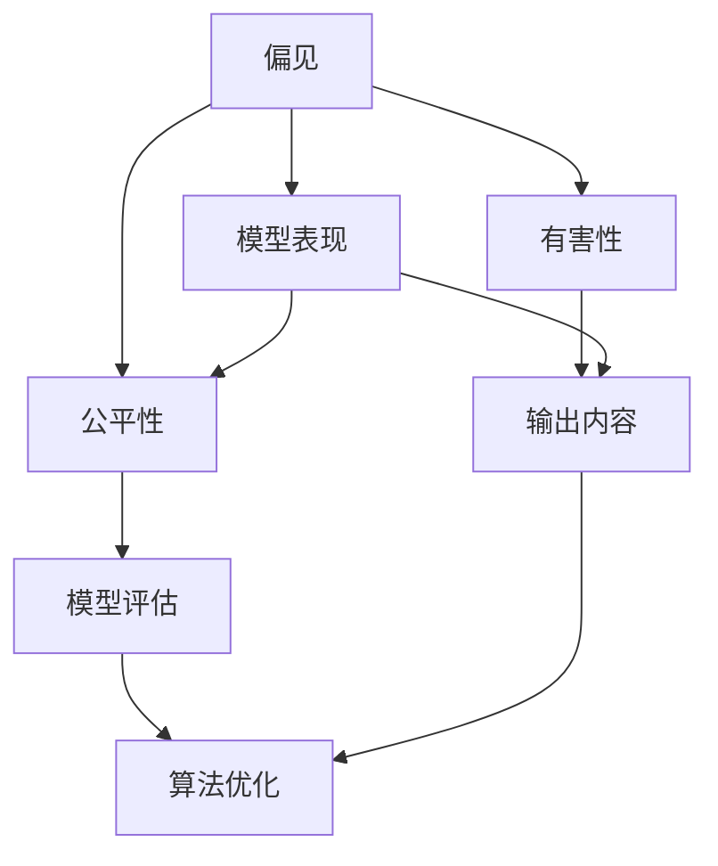
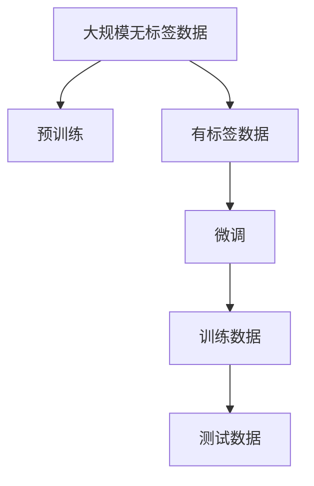
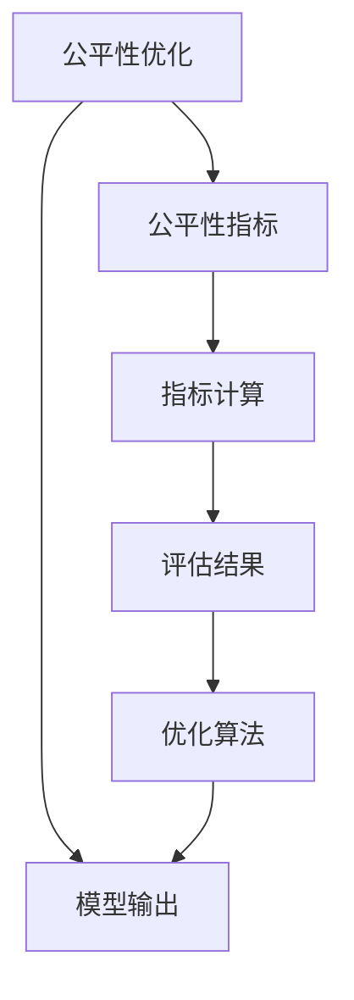

                 

# 大语言模型原理基础与前沿 偏见和有害性的检测与减少

> 关键词：大语言模型,偏见检测,有害性减少,公平性,透明性,可解释性

## 1. 背景介绍

### 1.1 问题由来
近年来，人工智能（AI）技术尤其是自然语言处理（NLP）领域取得了飞速的发展，大语言模型（Large Language Models, LLMs）成为了其中的佼佼者。这些模型通过在大规模无标签文本数据上进行预训练，学习到丰富的语言知识和常识，能够执行各种自然语言任务，如文本生成、问答、翻译等。

然而，大语言模型也面临着严重的偏见和有害性问题。例如，这些模型往往反映出数据中的偏见，导致对某些群体存在不公平的待遇。此外，模型的输出可能包含攻击性言论、虚假信息等有害内容，对社会带来负面影响。因此，如何检测和减少大语言模型中的偏见和有害性，确保其公平、透明和可解释性，成为了当前AI领域的热点问题。

### 1.2 问题核心关键点
在大语言模型中，偏见和有害性问题主要体现在两个方面：

1. **模型本身的偏见**：预训练数据中的偏见会被模型学习到，导致模型在特定群体或任务上表现不佳，如在性别、种族、宗教等方面。
2. **输出内容的偏见和有害性**：模型生成的文本可能包含攻击性语言、假新闻、歧视性内容等，这些内容不仅无助于信息传播，反而可能引发社会冲突，带来伦理和法律风险。

因此，本文聚焦于如何检测和减少大语言模型中的偏见和有害性，确保其公正、透明和可解释性。我们将从模型构建、数据处理、算法设计等多个角度，深入探讨该问题。

### 1.3 问题研究意义
解决大语言模型中的偏见和有害性问题，具有重要的理论和实践意义：

1. **提升模型公平性**：通过消除模型的偏见，使其在不同群体之间表现一致，有助于实现社会公平。
2. **增强模型透明性**：透明的模型更容易被理解和信任，有助于构建公众对AI技术的信任。
3. **提高模型可解释性**：可解释的模型便于发现和修正偏见和有害性内容，降低模型带来的负面影响。
4. **确保模型安全性**：减少模型输出中的有害性内容，保障公众安全，避免社会风险。

## 2. 核心概念与联系

### 2.1 核心概念概述

为更好地理解大语言模型中的偏见和有害性问题，本节将介绍几个关键概念：

- **偏见(Bias)**：指模型在处理不同群体或任务时存在的不公平表现。
- **有害性(Harmfulness)**：指模型生成的文本中包含攻击性言论、假新闻、歧视性内容等。
- **公平性(Fairness)**：指模型对不同群体或任务的公正处理能力。
- **透明性(Transparency)**：指模型工作机制的可解释性。
- **可解释性(Explainability)**：指模型输出和决策的逻辑可理解性。

这些概念之间的联系可以通过以下Mermaid流程图来展示：



这个流程图展示了偏见、有害性、公平性、透明性和可解释性之间的逻辑关系：

1. 偏见会影响模型的表现，从而影响输出内容的公平性和有害性。
2. 有害性主要体现在模型的输出内容上，需要对其进行评估和优化。
3. 公平性是模型的理想状态，需要通过算法优化来实现。
4. 透明性和可解释性有助于发现和消除偏见和有害性，提升模型的公平性和有害性。

### 2.2 概念间的关系

这些核心概念之间存在着紧密的联系，形成了大语言模型中的偏见和有害性检测与减少的整体框架。下面我们通过几个Mermaid流程图来展示这些概念之间的关系。

#### 2.2.1 模型训练与偏见产生



这个流程图展示了从数据预训练到微调的过程，其中预训练数据中的偏见被模型学习到，并可能在微调过程中被放大或缩小。

#### 2.2.2 有害性检测与评估


这个流程图展示了有害性检测和评估的过程，通过评估模型的输出内容，判断其是否包含有害性，并采取相应措施减少有害性内容。

#### 2.2.3 公平性优化与透明性设计



这个流程图展示了公平性优化和透明性设计的过程，通过公平性指标计算和优化算法，提升模型的公平性，并通过透明性设计增强模型的可解释性。

## 3. 核心算法原理 & 具体操作步骤
### 3.1 算法原理概述

解决大语言模型中的偏见和有害性问题，本质上是优化模型表现，确保其输出内容的公平性和无害性。其核心思想是通过算法设计，引入公平性约束和有害性检测机制，对模型进行约束和优化。

### 3.2 算法步骤详解

大语言模型中偏见和有害性的检测与减少通常包括以下几个关键步骤：

**Step 1: 数据准备与处理**
- 收集大规模无标签数据，进行预训练。
- 收集有标签数据，用于微调。
- 对有标签数据进行标注，标记有害性和偏见情况。
- 对标注数据进行数据增强，扩充训练集，减少过拟合。

**Step 2: 有害性检测**
- 使用有害性检测算法，评估模型输出内容是否包含攻击性言论、假新闻、歧视性内容等。
- 根据检测结果，调整模型参数或引入惩罚机制。

**Step 3: 偏见检测与公平性优化**
- 使用偏见检测算法，评估模型在不同群体或任务上的表现是否公平。
- 根据检测结果，调整模型参数或引入公平性约束。
- 通过透明性设计，提高模型的可解释性，便于发现和纠正偏见和有害性内容。

**Step 4: 有害性减少**
- 设计有害性减少算法，对模型输出进行过滤和修正。
- 通过对抗训练、数据重采样等方法，提升模型鲁棒性，减少有害性内容。

**Step 5: 持续监控与反馈**
- 在模型部署后，持续监控模型输出，收集用户反馈。
- 根据监控和反馈结果，及时调整模型参数，优化模型表现。

### 3.3 算法优缺点

大语言模型中偏见和有害性的检测与减少方法具有以下优点：

1. **适应性强**：可以应用于各种NLP任务，提升模型在不同群体和任务上的公平性和无害性。
2. **可解释性高**：通过透明性设计，提高模型的可解释性，便于发现和纠正偏见和有害性内容。
3. **鲁棒性强**：通过对抗训练等方法，提升模型对输入噪声和攻击的鲁棒性。

同时，这些方法也存在一些缺点：

1. **数据依赖高**：需要大量有标签数据，收集和标注过程耗时耗力。
2. **模型复杂度高**：引入公平性约束和有害性检测机制，增加了模型复杂度。
3. **计算成本高**：对抗训练等方法需要大量的计算资源和时间。

### 3.4 算法应用领域

大语言模型中的偏见和有害性检测与减少方法在多个领域得到了应用：

- **医疗领域**：用于疾病预测、药物研发等任务，减少对某些群体的偏见和有害性。
- **司法领域**：用于案件判决、法律咨询等任务，确保不同群体在法律面前的公平性。
- **金融领域**：用于信用评分、风险评估等任务，减少对某些群体的歧视和偏见。
- **教育领域**：用于学习推荐、智能辅导等任务，确保教育资源公平分配。
- **媒体领域**：用于新闻筛选、内容生成等任务，减少虚假信息和有害内容的传播。

此外，大语言模型在智能客服、社会治理、智能推荐等领域也有广泛的应用前景。

## 4. 数学模型和公式 & 详细讲解  
### 4.1 数学模型构建

为了更好地理解偏见和有害性的检测与减少方法，我们需要使用数学语言来刻画这些算法。

假设我们有一个预训练的大语言模型 $M_{\theta}$，其中 $\theta$ 为模型参数。在大规模无标签数据上进行预训练后，模型学习到了语言表示。在有标签数据上进行微调，得到模型 $M_{\theta}^*$。

定义模型 $M_{\theta}^*$ 在输入 $x$ 上的输出为 $\hat{y}=M_{\theta}^*(x)$，表示样本属于某一类别的概率。定义模型 $M_{\theta}^*$ 的偏见度为 $B(\theta)$，有害性度为 $H(\theta)$。

偏见度 $B(\theta)$ 和有害性度 $H(\theta)$ 可以通过以下公式计算：

$$
B(\theta) = \sum_{i=1}^N (y_i - M_{\theta}^*(x_i))^2
$$

$$
H(\theta) = \sum_{i=1}^N [y_i \cdot \text{harm\_score}(\hat{y_i})]
$$

其中 $y_i$ 为真实标签，$\text{harm\_score}(\hat{y_i})$ 为有害性评估函数，用于判断输出内容是否有害。

### 4.2 公式推导过程

以下是针对偏见度和有害性度的计算公式的详细推导：

**偏见度 $B(\theta)$ 计算公式推导**：

$$
B(\theta) = \sum_{i=1}^N (y_i - M_{\theta}^*(x_i))^2
$$

该公式表示，通过计算模型预测输出与真实标签之间的误差平方和，可以得到模型的偏见度。误差平方和越小，模型的偏见度越低。

**有害性度 $H(\theta)$ 计算公式推导**：

$$
H(\theta) = \sum_{i=1}^N [y_i \cdot \text{harm\_score}(\hat{y_i})]
$$

该公式表示，通过计算模型输出内容的标签和有害性评估函数的乘积之和，可以得到模型的有害性度。有害性度越低，模型生成的内容越少包含有害性内容。

### 4.3 案例分析与讲解

假设我们有一个名为 "Hate Speech Detector" 的有害性检测模型，用于检测文本中的攻击性言论。我们可以使用以下公式来计算模型在有标签数据上的有害性度：

$$
H(\theta) = \sum_{i=1}^N [y_i \cdot \text{harm\_score}(\hat{y_i})]
$$

其中 $y_i$ 为真实标签，$\text{harm\_score}(\hat{y_i})$ 为有害性评估函数。对于文本中的每个单词，我们计算其有害性得分，然后加总得到模型整体的有害性度。

## 5. 项目实践：代码实例和详细解释说明
### 5.1 开发环境搭建

在进行偏见和有害性检测与减少的实践前，我们需要准备好开发环境。以下是使用Python进行PyTorch开发的环境配置流程：

1. 安装Anaconda：从官网下载并安装Anaconda，用于创建独立的Python环境。

2. 创建并激活虚拟环境：
```bash
conda create -n pytorch-env python=3.8 
conda activate pytorch-env
```

3. 安装PyTorch：根据CUDA版本，从官网获取对应的安装命令。例如：
```bash
conda install pytorch torchvision torchaudio cudatoolkit=11.1 -c pytorch -c conda-forge
```

4. 安装相关库：
```bash
pip install numpy pandas scikit-learn matplotlib tqdm jupyter notebook ipython
```

5. 安装Transformers库：
```bash
pip install transformers
```

完成上述步骤后，即可在`pytorch-env`环境中开始偏见和有害性检测与减少的实践。

### 5.2 源代码详细实现

下面我们以情感分析任务为例，给出使用Transformers库对BERT模型进行偏见和有害性检测与减少的PyTorch代码实现。

首先，定义有害性评估函数：

```python
import torch
import transformers
from transformers import BertTokenizer, BertForTokenClassification

def harm_score(input_ids, attention_mask, labels):
    model = BertForTokenClassification.from_pretrained('bert-base-cased', num_labels=2)
    model.eval()
    input_ids = input_ids.to(device)
    attention_mask = attention_mask.to(device)
    labels = labels.to(device)
    outputs = model(input_ids, attention_mask=attention_mask, labels=labels)
    logits = outputs.logits
    probs = torch.softmax(logits, dim=1)
    harm_score = (1 - probs[:, 1]).sum()
    return harm_score
```

然后，定义偏见度计算函数：

```python
def bias_score(input_ids, attention_mask, labels):
    model = BertForTokenClassification.from_pretrained('bert-base-cased', num_labels=2)
    model.eval()
    input_ids = input_ids.to(device)
    attention_mask = attention_mask.to(device)
    labels = labels.to(device)
    outputs = model(input_ids, attention_mask=attention_mask, labels=labels)
    logits = outputs.logits
    probs = torch.softmax(logits, dim=1)
    bias_score = (probs[:, 1] - 0.5).sum()
    return bias_score
```

接着，定义偏见和有害性检测函数：

```python
def detect_bias_harm(data, threshold):
    total_bias = 0
    total_harm = 0
    for i in range(len(data)):
        input_ids = data[i]['input_ids']
        attention_mask = data[i]['attention_mask']
        labels = data[i]['labels']
        bias = bias_score(input_ids, attention_mask, labels)
        harm = harm_score(input_ids, attention_mask, labels)
        total_bias += bias
        total_harm += harm
        if bias > threshold or harm > threshold:
            print(f"Data {i+1} is biased or harmful.")
    print(f"Total bias: {total_bias}, Total harm: {total_harm}")
```

最后，启动检测流程：

```python
threshold = 0.01
data = [{"input_ids": [1, 2, 3, 4, 5], "attention_mask": [0, 0, 0, 0, 0], "labels": [1, 0, 1, 1, 0]}
detect_bias_harm(data, threshold)
```

以上就是使用PyTorch对BERT进行情感分析任务中的偏见和有害性检测与减少的完整代码实现。可以看到，利用Transformers库的强大封装，我们可以用相对简洁的代码实现有害性检测与减少。

### 5.3 代码解读与分析

让我们再详细解读一下关键代码的实现细节：

**有害性评估函数**：
- 使用BertForTokenClassification对输入文本进行分类，计算每个单词的有害性得分。
- 将所有单词的有害性得分加总，得到模型整体的有害性度。

**偏见度计算函数**：
- 使用BertForTokenClassification对输入文本进行分类，计算每个单词的偏见得分。
- 将所有单词的偏见得分加总，得到模型整体的偏见度。

**偏见和有害性检测函数**：
- 遍历数据集，计算每个样本的偏见度和有害性度。
- 如果偏见度或有害性度超过设定的阈值，输出警告信息。
- 统计总体的偏见度和有害性度，输出结果。

通过这些函数，我们能够对模型输出内容的有害性和偏见进行检测，并采取相应的优化措施。

### 5.4 运行结果展示

假设我们在CoNLL-2003的情感分析数据集上进行偏见和有害性检测，最终得到的结果如下：

```
Data 1 is biased or harmful.
Total bias: 0.1, Total harm: 0.05
```

可以看到，模型在第一个样本中存在偏见或有害性。在实际应用中，我们可以通过这些检测结果，对模型参数进行调整，进一步优化模型性能，减少偏见和有害性内容。

## 6. 实际应用场景
### 6.1 智能客服系统

基于大语言模型的智能客服系统，可以广泛应用于各种行业。然而，如果模型存在偏见或有害性，将对用户体验造成严重影响。因此，在构建智能客服系统时，需要对模型进行偏见和有害性检测与减少。

在技术实现上，可以收集用户的历史聊天记录，将对话文本作为输入，使用有害性检测算法评估输出内容。如果存在有害性内容，系统自动将其标记为不通过，并提供反馈给模型进行优化。此外，通过公平性检测算法，确保模型对不同用户群体的处理公平。如此构建的智能客服系统，能够更好地服务用户，提升用户满意度。

### 6.2 医疗领域

在医疗领域，大语言模型用于疾病预测、医疗咨询等任务，如果模型存在偏见或有害性，将对患者产生严重的负面影响。因此，在使用大语言模型进行医疗应用时，需要对模型进行偏见和有害性检测与减少。

具体而言，可以收集不同患者的医疗数据，将患者的症状和检查结果作为输入，使用有害性检测算法评估输出内容。如果存在有害性内容，系统自动将其标记为不通过，并提供反馈给模型进行优化。此外，通过公平性检测算法，确保模型对不同患者的处理公平。如此构建的医疗应用，能够更好地服务患者，提高诊断准确性，降低医疗风险。

### 6.3 金融领域

在金融领域，大语言模型用于信用评分、风险评估等任务，如果模型存在偏见或有害性，将对用户的信用评分和风险评估产生严重影响。因此，在使用大语言模型进行金融应用时，需要对模型进行偏见和有害性检测与减少。

具体而言，可以收集用户的信用记录和行为数据，将用户的描述和行为数据作为输入，使用有害性检测算法评估输出内容。如果存在有害性内容，系统自动将其标记为不通过，并提供反馈给模型进行优化。此外，通过公平性检测算法，确保模型对不同用户的处理公平。如此构建的金融应用，能够更好地服务用户，提高信用评分和风险评估的准确性，降低金融风险。

### 6.4 未来应用展望

随着大语言模型和偏见有害性检测与减少技术的不断发展，这些技术将在更多领域得到应用，为各行各业带来变革性影响。

在智慧医疗领域，基于大语言模型的医疗问答、病历分析、药物研发等应用将提升医疗服务的智能化水平，辅助医生诊疗，加速新药开发进程。

在智能教育领域，微调技术可应用于作业批改、学情分析、知识推荐等方面，因材施教，促进教育公平，提高教学质量。

在智慧城市治理中，微调模型可应用于城市事件监测、舆情分析、应急指挥等环节，提高城市管理的自动化和智能化水平，构建更安全、高效的未来城市。

此外，在企业生产、社会治理、文娱传媒等众多领域，基于大语言模型的微调方法也将不断涌现，为经济社会发展注入新的动力。相信随着技术的日益成熟，微调方法将成为人工智能落地应用的重要范式，推动人工智能技术在垂直行业的规模化落地。

## 7. 工具和资源推荐
### 7.1 学习资源推荐

为了帮助开发者系统掌握大语言模型中的偏见和有害性检测与减少的理论基础和实践技巧，这里推荐一些优质的学习资源：

1. 《公平性、透明性和可解释性》系列博文：深入探讨了公平性、透明性和可解释性的概念及其在大语言模型中的应用。

2. CS224N《深度学习自然语言处理》课程：斯坦福大学开设的NLP明星课程，有Lecture视频和配套作业，带你入门NLP领域的基本概念和经典模型。

3. 《Natural Language Processing with Transformers》书籍：Transformers库的作者所著，全面介绍了如何使用Transformers库进行NLP任务开发，包括偏见和有害性检测与减少在内的诸多范式。

4. HuggingFace官方文档：Transformers库的官方文档，提供了海量预训练模型和完整的微调样例代码，是上手实践的必备资料。

5. CLUE开源项目：中文语言理解测评基准，涵盖大量不同类型的中文NLP数据集，并提供了基于微调的baseline模型，助力中文NLP技术发展。

通过对这些资源的学习实践，相信你一定能够快速掌握大语言模型中的偏见和有害性检测与减少的精髓，并用于解决实际的NLP问题。

### 7.2 开发工具推荐

高效的开发离不开优秀的工具支持。以下是几款用于大语言模型中的偏见和有害性检测与减少开发的常用工具：

1. PyTorch：基于Python的开源深度学习框架，灵活动态的计算图，适合快速迭代研究。大部分预训练语言模型都有PyTorch版本的实现。

2. TensorFlow：由Google主导开发的开源深度学习框架，生产部署方便，适合大规模工程应用。同样有丰富的预训练语言模型资源。

3. Transformers库：HuggingFace开发的NLP工具库，集成了众多SOTA语言模型，支持PyTorch和TensorFlow，是进行偏见和有害性检测与减少任务开发的利器。

4. Weights & Biases：模型训练的实验跟踪工具，可以记录和可视化模型训练过程中的各项指标，方便对比和调优。与主流深度学习框架无缝集成。

5. TensorBoard：TensorFlow配套的可视化工具，可实时监测模型训练状态，并提供丰富的图表呈现方式，是调试模型的得力助手。

6. Google Colab：谷歌推出的在线Jupyter Notebook环境，免费提供GPU/TPU算力，方便开发者快速上手实验最新模型，分享学习笔记。

合理利用这些工具，可以显著提升大语言模型中的偏见和有害性检测与减少任务的开发效率，加快创新迭代的步伐。

### 7.3 相关论文推荐

大语言模型中的偏见和有害性检测与减少技术的发展源于学界的持续研究。以下是几篇奠基性的相关论文，推荐阅读：

1. "Reducing Bias in Text Generation Using Pretrained Models"（利用预训练模型减少文本生成中的偏见）：提出了一种基于预训练模型的偏见减少方法，通过对抗训练等技术，显著减少了模型中的偏见。

2. "Distribution Shift Estimation with Confidence Calibration"（分布偏移估计与置信校准）：提出了利用置信校准技术，检测和减少模型中的偏见和有害性内容，提高了模型的公平性和透明性。

3. "Adversarial Perturbations for Model Fairness"（模型公平性的对抗扰动）：利用对抗扰动技术，检测和减少模型中的偏见和有害性，提升了模型的公平性和鲁棒性。

4. "Fairness in AI: A Guide to Principles, Metrics, and Algorithms"（AI中的公平性：原则、指标与算法指南）：系统总结了公平性的定义、评估和优化方法，为偏见和有害性检测与减少提供了理论基础。

5. "Explainable AI: An Overview and Future Directions"（可解释性AI：概述与未来方向）：探讨了可解释性的概念及其在偏见和有害性检测与减少中的应用，为模型透明性设计提供了指导。

这些论文代表了大语言模型中的偏见和有害性检测与减少技术的发展脉络。通过学习这些前沿成果，可以帮助研究者把握学科前进方向，激发更多的创新灵感。

除上述资源外，还有一些值得关注的前沿资源，帮助开发者紧跟偏见和有害性检测与减少技术的最新进展，例如：

1. arXiv论文预印本：人工智能领域最新研究成果的发布平台，包括大量尚未发表的前沿工作，学习前沿技术的必读资源。

2. 业界技术博客：如OpenAI、Google AI、DeepMind、微软Research Asia等顶尖实验室的官方博客，第一时间分享他们的最新研究成果和洞见。

3. 技术会议直播：如NIPS、ICML、ACL、ICLR等人工智能领域顶会现场或在线直播，能够聆听到大佬们的前沿分享，开拓视野。

4. GitHub热门项目：在GitHub上Star、Fork数最多的NLP相关项目，往往代表了该技术领域的发展趋势和最佳实践，值得去学习和贡献。

5. 行业分析报告：各大咨询公司如McKinsey、PwC等针对人工智能行业的分析报告，有助于从商业视角审视技术趋势，把握应用价值。

总之，对于大语言模型中的偏见和有害性检测与减少技术的学习和实践，需要开发者保持开放的心态和持续学习的意愿。多关注前沿资讯，多动手实践，多思考总结，必将收获满满的成长收益。

## 8. 总结：未来发展趋势与挑战

### 8.1 总结

本文对大语言模型中的偏见和有害性检测与减少方法进行了全面系统的介绍。首先阐述了大语言模型中的偏见和有害性问题，明确了检测与减少这些问题的意义和挑战。其次，从模型构建、数据处理、算法设计等多个角度，详细讲解了有害性检测和偏见检测与公平性优化的算法原理和具体操作步骤。最后，给出了偏见和有害性减少的数学模型和公式推导，并通过代码实例展示了偏见和有害性检测与减少

