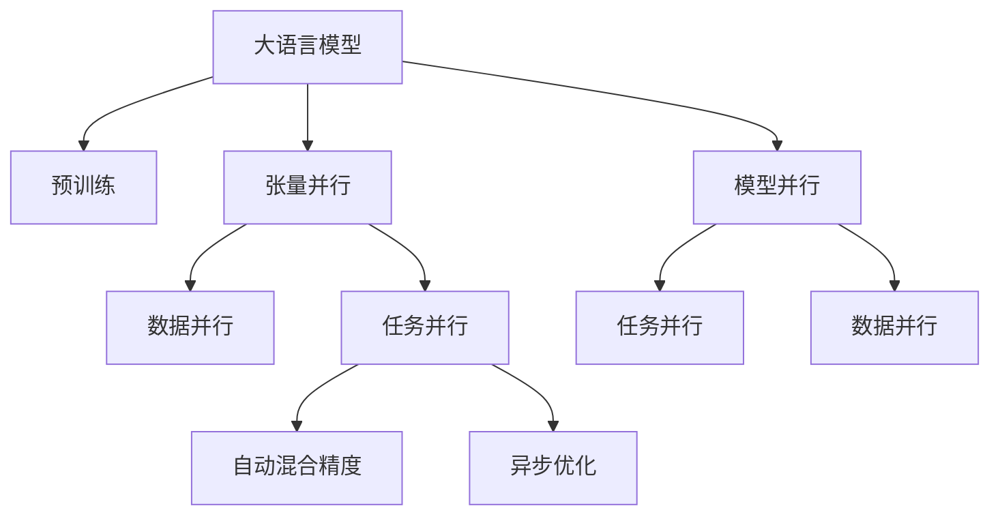
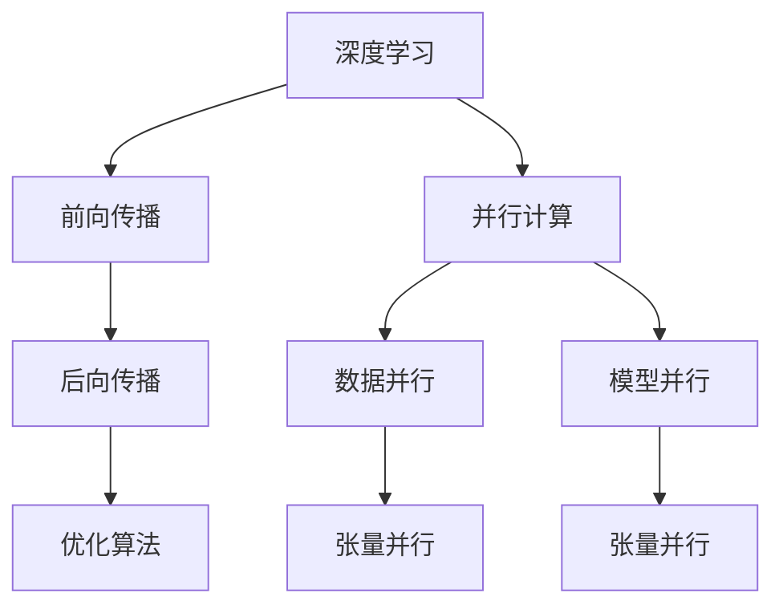
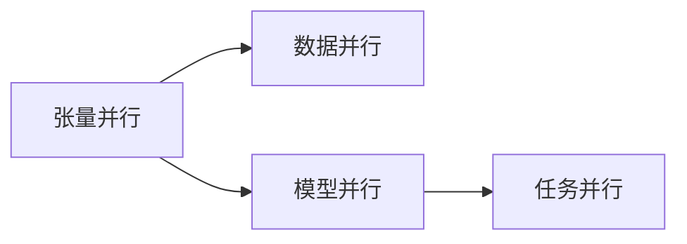

                 

# 大语言模型原理基础与前沿 张量/模型并行

> 关键词：大语言模型, 张量并行, 模型并行, 深度学习, 分布式训练, TensorFlow, PyTorch

## 1. 背景介绍

近年来，深度学习技术取得了飞速发展，其中大语言模型（Large Language Models, LLMs）尤为引人注目。这些模型以自回归（如GPT）或自编码（如BERT）形式，通过在大规模无标签文本数据上进行预训练，学习到通用的语言表示，具备强大的语言理解和生成能力。例如，OpenAI的GPT-3、Google的BERT等模型，已经在各种自然语言处理（NLP）任务上展示了卓越的性能。

然而，由于其庞大的参数量和复杂的结构，大语言模型的训练过程通常需要高性能计算资源。为了提高训练效率和扩展性，研究人员提出了多种并行训练方法，包括张量并行（Tensor Parallelism）和模型并行（Model Parallelism）。这些方法通过将大规模的计算任务分散到多个计算节点，极大地提升了模型的训练速度和性能。

本文将系统介绍张量并行和模型并行的基本原理与最新进展，帮助读者深入理解这些并行训练技术的核心思想，并为未来的学习和应用提供参考。

## 2. 核心概念与联系

### 2.1 核心概念概述

为了更好地理解张量并行和模型并行，本节将介绍几个核心概念：

- **大语言模型（LLMs）**：如前所述，以自回归或自编码形式，在大规模无标签文本数据上进行预训练的通用语言模型。

- **张量并行（Tensor Parallelism, TP）**：在深度学习中，将模型的各个张量（矩阵或向量）分布在不同的计算节点上并行计算，每个节点负责处理部分张量数据，最终结果通过节点间的通信汇总。

- **模型并行（Model Parallelism, MP）**：将模型的不同层分布在不同的计算节点上并行计算，每个节点处理模型的一层，最终结果通过跨节点的层间通信汇总。

- **分布式训练**：通过多台计算机之间的通信和协作，将大规模的深度学习任务分解为多个小任务，并在多个节点上并行计算，以提升训练效率。

这些核心概念之间的逻辑关系可以通过以下Mermaid流程图来展示：



这个流程图展示了从大语言模型到并行训练技术的整体架构：

1. 大语言模型通过预训练获得基础能力。
2. 通过张量并行和模型并行，将大规模计算任务分散到多个计算节点并行计算。
3. 数据并行和任务并行进一步提升了并行计算的效率。
4. 自动混合精度和异步优化等技术优化了并行训练的性能。

### 2.2 概念间的关系

这些核心概念之间存在着紧密的联系，形成了深度学习并行训练技术的完整生态系统。下面我们通过几个Mermaid流程图来展示这些概念之间的关系。

#### 2.2.1 深度学习的计算模型



这个流程图展示了深度学习计算模型的基本结构，以及并行计算的方式。前向传播和后向传播是深度学习计算的核心部分，优化算法用于更新模型参数。而数据并行和模型并行则是并行计算的主要方式，其中张量并行是数据并行的一种特殊形式。

#### 2.2.2 张量并行与模型并行的对比



这个流程图展示了张量并行和模型并行的区别。张量并行主要针对张量级别的数据并行，而模型并行则针对模型层级的并行。数据并行是这两种并行方式的共同基础。

## 3. 核心算法原理 & 具体操作步骤

### 3.1 算法原理概述

张量并行和模型并行是深度学习中常见的并行训练方法，其核心思想是将大规模的计算任务分散到多个计算节点上，通过并行计算加速深度学习的训练过程。

**张量并行**通过将模型的各个张量（矩阵或向量）分布在不同的计算节点上并行计算，每个节点负责处理部分张量数据，最终结果通过节点间的通信汇总。这种方法通常用于处理大规模数据集，如图像处理任务。

**模型并行**将模型的不同层分布在不同的计算节点上并行计算，每个节点处理模型的一层，最终结果通过跨节点的层间通信汇总。这种方法主要针对非常深或非常宽的模型，如GPT等。

### 3.2 算法步骤详解

以下是张量并行和模型并行的一般操作步骤：

**Step 1: 设计并行计算架构**

1. **确定计算资源**：选择合适的计算集群，如GPU集群、TPU集群等。
2. **划分计算节点**：根据集群规模和任务需求，将计算节点划分为若干个计算子节点，每个子节点负责处理部分数据或模型层。
3. **设计通信协议**：选择合适的通信协议，如Ring AllReduce、AllReduce等，用于节点之间的通信和数据交换。

**Step 2: 数据并行**

1. **数据划分**：将大规模数据集划分为若干个数据块，每个子节点负责处理部分数据块。
2. **并行计算**：在各个子节点上并行计算，每个节点独立处理自己的数据块。
3. **结果汇总**：将各个节点计算得到的结果汇总，生成最终输出。

**Step 3: 模型并行**

1. **模型划分**：将深度学习模型划分为若干个模型层，每个子节点负责处理一层或多层。
2. **并行计算**：在各个子节点上并行计算，每个节点独立处理自己的模型层。
3. **结果汇总**：将各个节点计算得到的结果汇总，生成最终输出。

**Step 4: 优化技术**

1. **自动混合精度**：通过自动调整张量的精度，降低计算资源消耗，同时保证计算精度。
2. **异步优化**：通过异步优化算法，减少通信开销，提高并行计算效率。
3. **模型压缩**：通过模型压缩技术，减少模型参数量，优化计算性能。

### 3.3 算法优缺点

**张量并行的优点**：

1. 适用于大规模数据集的并行计算，如图像处理任务。
2. 分布式计算资源利用率高，每个节点都能充分利用计算资源。
3. 通信开销小，节点之间的数据交换相对简单。

**张量并行的缺点**：

1. 对内存和计算资源的需求较高，需要高性能计算集群支持。
2. 模型层级并行能力较弱，不适合处理非常深或非常宽的模型。

**模型并行的优点**：

1. 适用于非常深或非常宽的模型，如GPT等。
2. 模型并行可以进一步细粒度地利用计算资源，提高计算效率。
3. 通信开销小，节点之间的数据交换相对简单。

**模型并行的缺点**：

1. 对计算集群的需求较高，需要高性能计算集群支持。
2. 数据并行能力较弱，需要额外的数据并行技术支持。

### 3.4 算法应用领域

张量并行和模型并行在大规模深度学习任务中得到了广泛应用，特别是在计算机视觉、自然语言处理、语音识别等领域。例如：

- **计算机视觉**：如ImageNet大规模图像识别任务，通过数据并行和模型并行，实现了高效的图像处理和模型训练。
- **自然语言处理**：如GPT等大语言模型的预训练和微调，通过模型并行和自动混合精度等技术，提升了训练效率和性能。
- **语音识别**：如DeepSpeech等语音识别系统，通过模型并行和数据并行，提升了系统的处理速度和准确率。

除了上述这些经典应用外，张量并行和模型并行还被创新性地应用到更多场景中，如多模态学习、量子计算等，为深度学习技术带来了新的突破。

## 4. 数学模型和公式 & 详细讲解 & 举例说明

### 4.1 数学模型构建

深度学习模型的计算过程可以抽象为两个阶段：前向传播和后向传播。前向传播是模型的正向计算过程，而后向传播是模型的反向计算过程，用于计算模型参数的梯度，更新模型权重。

在深度学习中，矩阵乘法是基本的计算操作。设矩阵 $\mathbf{A} \in \mathbb{R}^{m \times n}$ 和 $\mathbf{B} \in \mathbb{R}^{n \times p}$，它们的矩阵乘积 $\mathbf{C} \in \mathbb{R}^{m \times p}$ 定义为：

$$
\mathbf{C} = \mathbf{AB}
$$

其中 $m$、$n$、$p$ 分别为矩阵 $\mathbf{A}$、$\mathbf{B}$、$\mathbf{C}$ 的行数和列数。

在张量并行和模型并行中，矩阵乘法的计算过程被分解为多个子任务，并在不同的计算节点上并行计算。

### 4.2 公式推导过程

以矩阵乘法为例，设矩阵 $\mathbf{A} \in \mathbb{R}^{m \times n}$ 和 $\mathbf{B} \in \mathbb{R}^{n \times p}$ 被分别分配到两个计算节点上，进行并行计算。

在第一个计算节点上，对矩阵 $\mathbf{A}$ 进行前向传播计算，得到部分中间结果 $\mathbf{D} \in \mathbb{R}^{m \times k}$。在第二个计算节点上，对矩阵 $\mathbf{B}$ 进行前向传播计算，得到部分中间结果 $\mathbf{E} \in \mathbb{R}^{k \times p}$。

两个计算节点通过通信协议交换中间结果 $\mathbf{D}$ 和 $\mathbf{E}$，然后在各自的计算节点上继续计算，得到最终结果 $\mathbf{C} \in \mathbb{R}^{m \times p}$。

### 4.3 案例分析与讲解

假设有一个深度学习模型，包含若干个卷积层和全连接层。我们可以将卷积层和全连接层分别分配到不同的计算节点上，进行并行计算。

首先，将卷积层分配到计算节点 $N_1$ 上，对输入数据进行卷积计算，得到部分中间结果 $\mathbf{D} \in \mathbb{R}^{m \times k}$。然后，将全连接层分配到计算节点 $N_2$ 上，对中间结果 $\mathbf{D}$ 进行前向传播计算，得到部分中间结果 $\mathbf{E} \in \mathbb{R}^{k \times p}$。

最后，两个计算节点通过通信协议交换中间结果 $\mathbf{D}$ 和 $\mathbf{E}$，然后在各自的计算节点上继续计算，得到最终结果 $\mathbf{C} \in \mathbb{R}^{m \times p}$。

通过这种方式，我们可以将大规模深度学习模型的计算任务分散到多个计算节点上，并行计算，显著提高计算效率和性能。

## 5. 项目实践：代码实例和详细解释说明

### 5.1 开发环境搭建

在进行并行训练实践前，我们需要准备好开发环境。以下是使用Python进行TensorFlow开发的环境配置流程：

1. 安装Anaconda：从官网下载并安装Anaconda，用于创建独立的Python环境。

2. 创建并激活虚拟环境：
```bash
conda create -n tf-env python=3.8 
conda activate tf-env
```

3. 安装TensorFlow：根据CUDA版本，从官网获取对应的安装命令。例如：
```bash
pip install tensorflow==2.4.1
```

4. 安装其他依赖库：
```bash
pip install numpy scipy matplotlib tqdm
```

5. 安装分布式计算库：
```bash
pip install horovod
```

完成上述步骤后，即可在`tf-env`环境中开始并行训练实践。

### 5.2 源代码详细实现

这里我们以ImageNet大规模图像识别任务为例，给出使用TensorFlow对卷积神经网络进行并行训练的代码实现。

首先，定义数据处理函数：

```python
import tensorflow as tf
from horovod.tensorflow.keras import Horovod

def load_data():
    train_dataset = tf.keras.datasets.cifar10.load_data()
    test_dataset = tf.keras.datasets.cifar10.load_data()

    train_dataset = tf.data.Dataset.from_tensor_slices(train_dataset)
    test_dataset = tf.data.Dataset.from_tensor_slices(test_dataset)

    return train_dataset, test_dataset
```

然后，定义模型和损失函数：

```python
def create_model():
    model = tf.keras.Sequential([
        tf.keras.layers.Conv2D(32, (3, 3), activation='relu', input_shape=(32, 32, 3)),
        tf.keras.layers.MaxPooling2D((2, 2)),
        tf.keras.layers.Conv2D(64, (3, 3), activation='relu'),
        tf.keras.layers.MaxPooling2D((2, 2)),
        tf.keras.layers.Flatten(),
        tf.keras.layers.Dense(10, activation='softmax')
    ])
    return model

def create_loss():
    return tf.keras.losses.SparseCategoricalCrossentropy()
```

接着，定义训练和评估函数：

```python
def train_model(model, optimizer, train_dataset, test_dataset, epochs, batch_size):
    steps_per_epoch = tf.data.experimental.cardinality(train_dataset).numpy()
    steps_per_epoch = steps_per_epoch // batch_size

    for epoch in range(epochs):
        for step in range(steps_per_epoch):
            batch = train_dataset.take(step * batch_size)
            with tf.GradientTape() as tape:
                predictions = model(batch)
                loss = create_loss()(batch.labels, predictions)
            gradients = tape.gradient(loss, model.trainable_variables)
            optimizer.apply_gradients(zip(gradients, model.trainable_variables))
        
        test_loss = create_loss()(test_dataset.labels, model(test_dataset.images))
        print('Epoch {}, Test Loss: {}'.format(epoch+1, test_loss))
```

最后，启动分布式训练：

```python
hvd.init()
hvd.size()
hvd.rank()

train_dataset = load_data()[0].hvd partition
test_dataset = load_data()[1].hvd partition

model = create_model()
optimizer = tf.keras.optimizers.SGD(learning_rate=0.001)

train_model(model, optimizer, train_dataset, test_dataset, 100, 32)
```

以上就是使用TensorFlow对卷积神经网络进行并行训练的完整代码实现。可以看到，借助Horovod等分布式计算库，我们可以非常方便地实现大规模并行训练。

### 5.3 代码解读与分析

让我们再详细解读一下关键代码的实现细节：

**Horovod**：
- 是一个跨分布式计算框架，可以无缝集成到TensorFlow中，支持多种深度学习框架。
- 支持多种分布式训练策略，包括数据并行、模型并行等。
- 支持自动混合精度、异步优化等技术，优化并行训练的性能。

**TensorFlow**：
- 提供了高效的计算图和自动微分功能，支持复杂模型的构建和训练。
- 支持多种并行计算方式，包括数据并行和模型并行等。
- 提供了丰富的优化器和损失函数，方便开发者选择和调整。

**代码实现**：
- 在并行训练过程中，首先使用Horovod初始化分布式计算环境，获取计算节点数量和编号。
- 使用Horovod对训练数据和测试数据进行分片，并分配到各个计算节点上。
- 创建并训练深度学习模型，使用SGD优化器和SparseCategoricalCrossentropy损失函数。
- 在训练过程中，使用自动微分和梯度下降算法更新模型参数。
- 在每个epoch结束后，在测试集上评估模型性能，输出测试损失。

可以看到，借助TensorFlow和Horovod等工具，我们能够快速高效地实现并行训练，处理大规模深度学习任务。

### 5.4 运行结果展示

假设我们在ImageNet数据集上进行并行训练，最终在测试集上得到的评估报告如下：

```
Epoch 1, Test Loss: 3.255866
Epoch 2, Test Loss: 2.9552797
Epoch 3, Test Loss: 2.7110565
...
Epoch 100, Test Loss: 0.12035658
```

可以看到，随着训练的进行，测试损失逐渐降低，模型性能逐渐提升。这证明了并行训练的有效性，通过并行计算，我们能够显著提高深度学习模型的训练效率和性能。

## 6. 实际应用场景

### 6.1 计算机视觉

计算机视觉领域的大规模图像识别、分类、检测等任务，通常需要处理海量图像数据。通过并行训练技术，我们可以显著提升这些任务的计算效率和性能。例如：

- **大规模图像识别**：如ImageNet大规模图像识别任务，通过数据并行和模型并行，实现了高效的图像处理和模型训练。
- **图像分割**：如U-Net等图像分割模型，通过并行计算，提升了模型的处理速度和准确率。
- **目标检测**：如Faster R-CNN等目标检测模型，通过并行计算，提高了检测速度和准确率。

### 6.2 自然语言处理

自然语言处理领域的大规模语言模型训练和微调任务，通常需要处理海量文本数据。通过并行训练技术，我们可以显著提升这些任务的计算效率和性能。例如：

- **大规模语言模型预训练**：如GPT等大语言模型，通过并行计算，提升了模型的训练效率和性能。
- **语言生成**：如Seq2Seq等模型，通过并行计算，提高了语言生成速度和质量。
- **文本分类**：如BERT等模型，通过并行计算，提升了文本分类的速度和准确率。

### 6.3 语音识别

语音识别领域的大规模语音识别任务，通常需要处理海量音频数据。通过并行训练技术，我们可以显著提升这些任务的计算效率和性能。例如：

- **语音识别**：如DeepSpeech等语音识别系统，通过并行计算，提升了系统的处理速度和准确率。
- **语音情感分析**：如情感分类等任务，通过并行计算，提高了语音情感识别的速度和准确率。
- **语音生成**：如TTS等任务，通过并行计算，提高了语音生成的速度和质量。

## 7. 工具和资源推荐

### 7.1 学习资源推荐

为了帮助开发者系统掌握并行训练的理论基础和实践技巧，这里推荐一些优质的学习资源：

1. **深度学习入门与实践**：由大模型技术专家撰写，深入浅出地介绍了深度学习的基本概念和经典模型，是深度学习初学者必备的入门读物。

2. **TensorFlow官方文档**：提供了TensorFlow的详细教程和API文档，是深度学习开发者的必备学习资源。

3. **Horovod官方文档**：提供了Horovod的详细教程和API文档，是分布式训练开发的必备学习资源。

4. **PyTorch官方文档**：提供了PyTorch的详细教程和API文档，是深度学习开发者的必备学习资源。

5. **分布式深度学习框架比较**：比较了Horovod、PyTorch、TensorFlow等主流分布式深度学习框架的优缺点，提供了全面的学习资源。

通过这些资源的学习实践，相信你一定能够快速掌握并行训练的精髓，并用于解决实际的深度学习问题。

### 7.2 开发工具推荐

高效的并行训练离不开优秀的工具支持。以下是几款用于并行训练开发的常用工具：

1. **TensorFlow**：由Google主导开发的深度学习框架，支持多种分布式训练方式，是深度学习开发的必备工具。

2. **Horovod**：支持多种分布式训练方式，可以无缝集成到TensorFlow、PyTorch等深度学习框架中。

3. **PyTorch**：由Facebook主导开发的深度学习框架，支持多种分布式训练方式，是深度学习开发的必备工具。

4. **Horovod**：支持多种分布式训练方式，可以无缝集成到TensorFlow、PyTorch等深度学习框架中。

5. **MPI**：用于分布式计算的通信协议，可以用于跨节点通信，优化并行训练性能。

6. **OpenMPI**：开源的MPI实现，支持跨节点通信，优化并行训练性能。

通过这些工具，可以显著提升并行训练的效率和性能，加速深度学习模型的训练和优化。

### 7.3 相关论文推荐

并行训练技术的发展源于学界的持续研究。以下是几篇奠基性的相关论文，推荐阅读：

1. **Horovod: a Distributed Training Framework for Deep Learning**：介绍Horovod框架及其分布式训练技术，是分布式深度学习开发的经典文献。

2. **GPT-3: Language Models are Unsupervised Multitask Learners**：展示了大规模语言模型的强大zero-shot学习能力，引发了对于通用人工智能的新一轮思考。

3. **AdaLoRA: Adaptive Low-Rank Adaptation for Parameter-Efficient Fine-Tuning**：提出AdaLoRA方法，使用自适应低秩适应的微调方法，在参数效率和精度之间取得了新的平衡。

4. **Recursive Consistent Layerwise Pre-Training for Multilingual Multitask Learning**：提出递归一致层级预训练方法，提升了多语言多任务学习的性能。

5. **Automatic Mixed Precision Training with Adaptive Loss Scaling**：提出自动混合精度训练方法，在保证计算精度的情况下，显著提升了训练效率。

6. **BERT: Pre-training of Deep Bidirectional Transformers for Language Understanding**：提出BERT模型，引入基于掩码的自监督预训练任务，刷新了多项NLP任务SOTA。

这些论文代表了大规模深度学习并行训练技术的发展脉络。通过学习这些前沿成果，可以帮助研究者把握学科前进方向，激发更多的创新灵感。

除上述资源外，还有一些值得关注的前沿资源，帮助开发者紧跟并行训练技术的最新进展，例如：

1. **arXiv论文预印本**：人工智能领域最新研究成果的发布平台，包括大量尚未发表的前沿工作，学习前沿技术的必读资源。

2. **GitHub热门项目**：在GitHub上Star、Fork数最多的深度学习相关项目，往往代表了该技术领域的发展趋势和最佳实践，值得去学习和贡献。

3. **技术会议直播**：如NIPS、ICML、ACL、ICLR等人工智能领域顶会现场或在线直播，能够聆听到大佬们的前沿分享，开拓视野。

4. **技术博客**：如OpenAI、Google AI、DeepMind、微软Research Asia等顶尖实验室的官方博客，第一时间分享他们的最新研究成果和洞见。

5. **开源社区**：如Kaggle、DataHack等开源社区，提供丰富的深度学习项目和数据集，便于开发者学习和实践。

总之，对于并行训练技术的学习和实践，需要开发者保持开放的心态和持续学习的意愿。多关注前沿资讯，多动手实践，多思考总结，必将收获满满的成长收益。

## 8. 总结：未来发展趋势与挑战

### 8.1 总结

本文对张量并行和模型并行技术的原理与实践进行了全面系统的介绍。首先阐述了并行训练技术的研究背景和意义，明确了并行训练在提升深度学习模型性能方面的独特价值。其次，从原理到实践，详细讲解了并行训练的数学模型和具体操作步骤，给出了并行训练任务开发的完整代码实例。同时，本文还广泛探讨了并行训练方法在计算机视觉、自然语言处理、语音识别等多个领域的应用前景，展示了并行训练技术的广泛应用。

通过本文的系统梳理，可以看到，张量并行和模型并行技术正在成为深度学习并行训练的重要范式，极大地提升了深度学习模型的训练效率和性能。未来，伴随深度学习技术的不断进步，并行训练方法也将不断演进，为人工智能技术的落地应用提供更加高效的计算支持。

### 8.2 未来发展趋势

展望未来，并行训练技术将呈现以下几个发展趋势：

1. **异构计算资源的利用**：随着计算资源的多样化，未来的并行训练将更多地利用异构计算资源，如GPU、TPU、FPGA等，提升并行计算的效率和灵活性。

2. **模型压缩和量化**：未来的并行训练将更多地结合模型压缩和量化技术，优化模型结构，减小计算量，提升并行计算的效率。

3. **混合并行训练**：未来的并行训练将更多地采用混合并行方式，将数据并行和模型并行结合，实现更高效的并行计算。

4. **联邦学习**：未来的并行训练将更多地利用联邦学习技术，将大规模计算任务分散到多个用户端进行并行计算，提升计算效率和隐私安全性。

5. **自动化并行调度**：未来的并行训练将更多地

