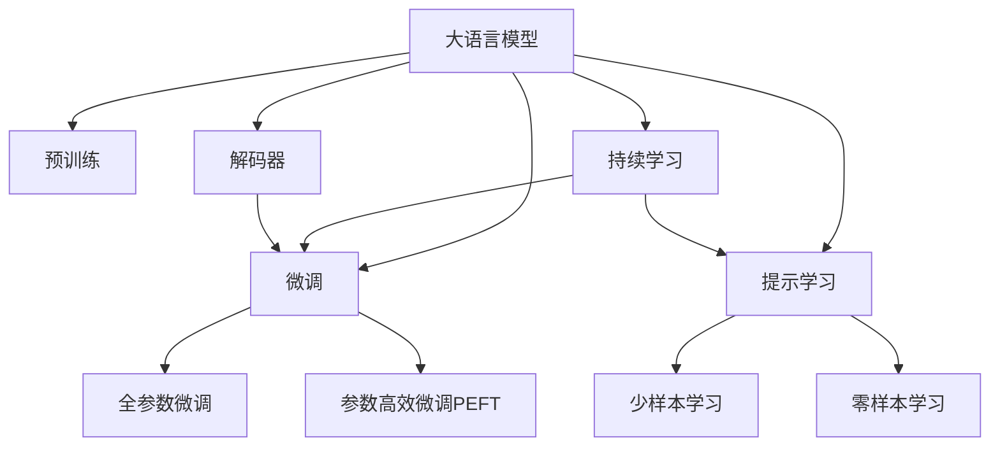
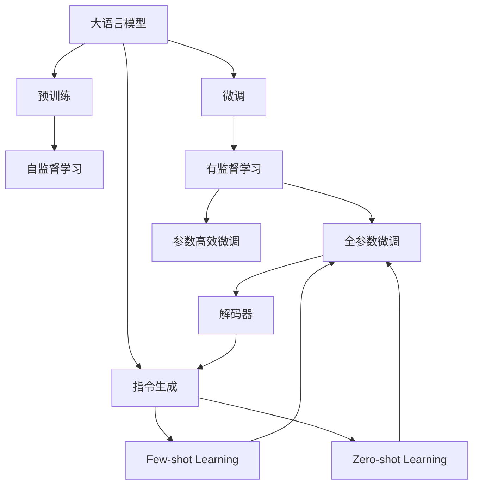
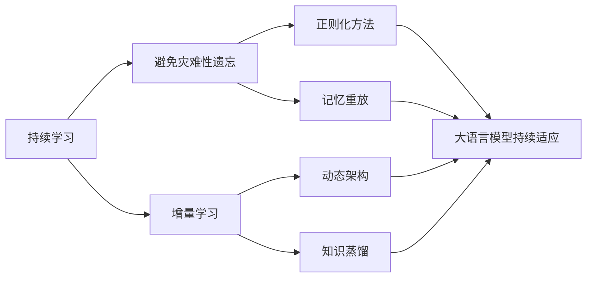
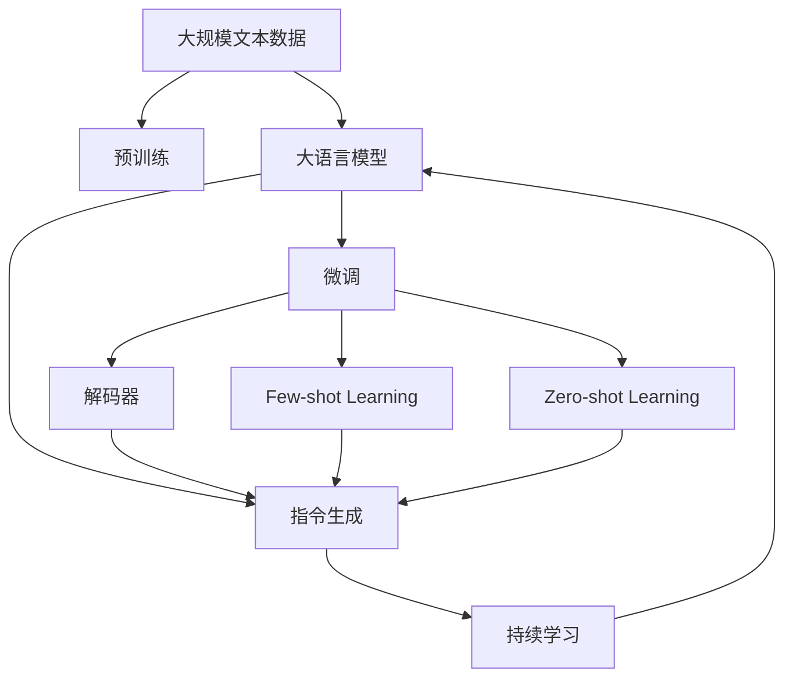

                 

# 大语言模型原理基础与前沿 指令生成

> 关键词：大语言模型, 指令生成, Transformer, BERT, 预训练, 指令微调, 解码器, 自然语言处理(NLP)

## 1. 背景介绍

### 1.1 问题由来

近年来，人工智能技术在各个领域取得了长足进展，其中大语言模型（Large Language Models, LLMs）成为了自然语言处理（Natural Language Processing, NLP）领域的一个重要突破。这些大语言模型通常基于自回归（如GPT系列）或自编码（如BERT）架构，在大量无标签文本数据上进行预训练，学习到了丰富的语言知识和语义理解能力。然而，这些模型在特定领域应用时，往往需要进一步的微调（Fine-Tuning）或指令生成（Instruction Following），以获得更好的性能和泛化能力。

指令生成（Instruction Following）是当前NLP领域的一个重要研究方向。它指的是让大语言模型能够根据给定的自然语言指令（Instruction），执行特定的语言模型任务。例如，可以根据指令“生成一段关于人工智能的介绍”，生成一段符合语法和语义要求的文本。这一技术在智能客服、信息检索、问答系统、文本摘要等应用中具有重要意义。

### 1.2 问题核心关键点

指令生成技术的大致流程包括以下几个关键步骤：

1. **预训练模型选择**：选择适合的预训练语言模型（如BERT、GPT等）作为指令生成的基础。
2. **指令定义**：设计具体的自然语言指令，如“生成一段介绍”、“翻译一段文本”等。
3. **模型微调**：通过微调预训练模型，使其能够根据指令输出正确的结果。
4. **解码器设计**：选择合适的解码器（如LM Head、Transformer等），以实现高效的指令解码。
5. **优化策略**：设计合适的优化算法（如Adam、SGD等），训练模型以获得最佳性能。

指令生成的关键在于如何设计有效的指令和解码器，以及如何高效地微调预训练模型。目前主流的方法包括：

- **微调（Fine-Tuning）**：通过微调预训练模型，使其能够理解并遵循自然语言指令。
- **解码器设计**：设计高效的解码器，如LM Head、Transformer等，以提高指令生成的效率和质量。
- **正则化技术**：使用L2正则化、Dropout、Early Stopping等技术，防止模型过拟合。
- **数据增强**：通过对训练样本改写、回译等方式丰富训练集多样性。
- **对抗训练**：加入对抗样本，提高模型鲁棒性。
- **提示学习（Prompt Learning）**：通过在输入文本中添加提示模板（Prompt Template），引导模型按期望方式输出，减少微调参数。

指令生成技术在学术界和工业界都得到了广泛应用，成为推动NLP技术发展的重要动力。通过该技术，NLP系统能够更自然、更智能地与人类进行交互，大大提升了用户体验和系统效率。

### 1.3 问题研究意义

研究指令生成技术，对于拓展大语言模型的应用范围，提升系统性能，加速NLP技术的产业化进程，具有重要意义：

1. **降低开发成本**：基于成熟的大模型进行指令生成，可以显著减少从头开发所需的成本投入。
2. **提升系统效果**：通过微调和指令生成，大模型能够更好地适应特定任务，在应用场景中取得更优表现。
3. **加速开发进度**：“站在巨人的肩膀上”，指令生成使得开发者可以更快地完成任务适配，缩短开发周期。
4. **带来技术创新**：指令生成范式促进了对预训练-微调的深入研究，催生了提示学习、少样本学习等新的研究方向。
5. **赋能产业升级**：指令生成使得NLP技术更容易被各行各业所采用，为传统行业数字化转型升级提供新的技术路径。

## 2. 核心概念与联系

### 2.1 核心概念概述

为更好地理解指令生成方法，本节将介绍几个密切相关的核心概念：

- **大语言模型（Large Language Model, LLM）**：以自回归（如GPT）或自编码（如BERT）模型为代表的大规模预训练语言模型。通过在大规模无标签文本语料上进行预训练，学习通用的语言表示，具备强大的语言理解和生成能力。

- **预训练（Pre-training）**：指在大规模无标签文本语料上，通过自监督学习任务训练通用语言模型的过程。常见的预训练任务包括言语建模、遮挡语言模型等。预训练使得模型学习到语言的通用表示。

- **微调（Fine-Tuning）**：指在预训练模型的基础上，使用下游任务的少量标注数据，通过有监督学习优化模型在该任务上的性能。通常只需要调整顶层分类器或解码器，并以较小的学习率更新全部或部分的模型参数。

- **指令生成（Instruction Following）**：让大语言模型能够根据给定的自然语言指令，执行特定的语言模型任务。例如，可以根据指令“生成一段关于人工智能的介绍”，生成一段符合语法和语义要求的文本。

- **解码器（Decoder）**：指令生成的关键组件，通常基于Transformer等架构，用于根据输入指令生成语言输出。

- **提示学习（Prompt Learning）**：通过在输入文本中添加提示模板（Prompt Template），引导模型按期望方式输出，减少微调参数。

- **少样本学习（Few-shot Learning）**：指在只有少量标注样本的情况下，模型能够快速适应新任务的学习方法。在大语言模型中，通常通过在输入中提供少量示例来实现，无需更新模型参数。

- **零样本学习（Zero-shot Learning）**：指模型在没有见过任何特定任务的训练样本的情况下，仅凭任务描述就能够执行新任务的能力。大语言模型通过预训练获得的广泛知识，使其能够理解任务指令并生成相应输出。

- **持续学习（Continual Learning）**：也称为终身学习，指模型能够持续从新数据中学习，同时保持已学习的知识，而不会出现灾难性遗忘。这对于保持大语言模型的时效性和适应性至关重要。

这些核心概念之间的逻辑关系可以通过以下Mermaid流程图来展示：



这个流程图展示了大语言模型的核心概念及其之间的关系：

1. 大语言模型通过预训练获得基础能力。
2. 微调是对预训练模型进行任务特定的优化，可以分为全参数微调和参数高效微调（PEFT）。
3. 指令生成是一种不更新模型参数的方法，可以实现少样本学习和零样本学习。
4. 持续学习旨在使模型能够不断学习新知识，同时避免遗忘旧知识。
5. 解码器是生成指令输出时必不可少的组件。

这些概念共同构成了大语言模型的学习和应用框架，使其能够在各种场景下发挥强大的语言理解和生成能力。通过理解这些核心概念，我们可以更好地把握大语言模型的工作原理和优化方向。

### 2.2 概念间的关系

这些核心概念之间存在着紧密的联系，形成了大语言模型指令生成方法的完整生态系统。下面我们通过几个Mermaid流程图来展示这些概念之间的关系。

#### 2.2.1 大语言模型的学习范式



这个流程图展示了大语言模型的三种主要学习范式：预训练、微调和指令生成。预训练主要采用自监督学习方法，而微调和指令生成是有监督学习的过程。指令生成可以实现少样本学习和零样本学习。微调又可以分为全参数微调和参数高效微调两种方式。

#### 2.2.2 持续学习与微调的关系



这个流程图展示了持续学习在大语言模型中的应用。持续学习的主要目标是避免灾难性遗忘和实现增量学习。通过正则化方法、记忆重放、动态架构和知识蒸馏等技术，可以使大语言模型持续适应新的任务和数据。

### 2.3 核心概念的整体架构

最后，我们用一个综合的流程图来展示这些核心概念在大语言模型指令生成过程中的整体架构：



这个综合流程图展示了从预训练到指令生成的完整过程。大语言模型首先在大规模文本数据上进行预训练，然后通过微调和指令生成（包括少样本学习和零样本学习）来适应特定任务。最后，通过持续学习技术，模型可以不断更新和适应新的任务和数据。 通过这些流程图，我们可以更清晰地理解大语言模型指令生成过程中各个核心概念的关系和作用，为后续深入讨论具体的指令生成方法和技术奠定基础。

## 3. 核心算法原理 & 具体操作步骤
### 3.1 算法原理概述

指令生成技术本质上是一个有监督的细粒度迁移学习过程。其核心思想是：将预训练的大语言模型视作一个强大的"特征提取器"，通过在下游任务的少量标注数据上进行有监督的微调，使得模型输出能够匹配任务指令，从而生成符合要求的语言输出。

形式化地，假设预训练模型为 $M_{\theta}$，其中 $\theta$ 为预训练得到的模型参数。给定指令 $I$ 和目标任务 $T$，指令生成过程的目标是找到新的模型参数 $\hat{\theta}$，使得：

$$
\hat{\theta}=\mathop{\arg\min}_{\theta} \mathcal{L}(I,M_{\theta},T)
$$

其中 $\mathcal{L}$ 为针对任务 $T$ 设计的损失函数，用于衡量模型输出与任务指令之间的差异。常见的损失函数包括BLEU、ROUGE等，用于衡量生成的文本与目标文本的相似度。

通过梯度下降等优化算法，指令生成过程不断更新模型参数 $\theta$，最小化损失函数 $\mathcal{L}$，使得模型输出逼近任务指令。由于 $\theta$ 已经通过预训练获得了较好的初始化，因此即便在少量标注数据上，也能较快收敛到理想的模型参数 $\hat{\theta}$。

### 3.2 算法步骤详解

指令生成的一般流程包括以下几个关键步骤：

**Step 1: 准备预训练模型和数据集**
- 选择合适的预训练语言模型 $M_{\theta}$ 作为初始化参数，如 BERT、GPT等。
- 准备指令生成任务的标注数据集 $D=\{(I_i,T_i)\}_{i=1}^N$，划分为训练集、验证集和测试集。

**Step 2: 设计指令解码器**
- 根据任务类型，设计合适的指令解码器，如LM Head、Transformer等。
- 对于分类任务，通常在顶层添加线性分类器和交叉熵损失函数。
- 对于生成任务，通常使用语言模型的解码器输出概率分布，并以负对数似然为损失函数。

**Step 3: 设置微调超参数**
- 选择合适的优化算法及其参数，如 AdamW、SGD 等，设置学习率、批大小、迭代轮数等。
- 设置正则化技术及强度，包括权重衰减、Dropout、Early Stopping等。
- 确定冻结预训练参数的策略，如仅微调顶层，或全部参数都参与微调。

**Step 4: 执行梯度训练**
- 将训练集数据分批次输入模型，前向传播计算损失函数。
- 反向传播计算参数梯度，根据设定的优化算法和学习率更新模型参数。
- 周期性在验证集上评估模型性能，根据性能指标决定是否触发 Early Stopping。
- 重复上述步骤直到满足预设的迭代轮数或 Early Stopping 条件。

**Step 5: 测试和部署**
- 在测试集上评估指令生成后的模型 $M_{\hat{\theta}}$ 的性能，对比微调前后的效果提升。
- 使用微调后的模型对新指令进行推理预测，集成到实际的应用系统中。
- 持续收集新的数据，定期重新微调模型，以适应数据分布的变化。

以上是指令生成的一般流程。在实际应用中，还需要针对具体任务的特点，对指令生成过程的各个环节进行优化设计，如改进训练目标函数，引入更多的正则化技术，搜索最优的超参数组合等，以进一步提升模型性能。

### 3.3 算法优缺点

指令生成技术具有以下优点：

1. 简单高效。只需准备少量标注数据，即可对预训练模型进行快速适配，生成符合要求的指令输出。
2. 通用适用。适用于各种NLP任务，包括分类、匹配、生成等，设计简单的指令解码器即可实现生成。
3. 参数高效。利用参数高效微调技术，在固定大部分预训练参数的情况下，仍可取得不错的生成效果。
4. 效果显著。在学术界和工业界的诸多任务上，基于指令生成的方法已经刷新了最先进的性能指标。

同时，该方法也存在一定的局限性：

1. 依赖标注数据。指令生成的效果很大程度上取决于标注数据的质量和数量，获取高质量标注数据的成本较高。
2. 迁移能力有限。当目标任务与预训练数据的分布差异较大时，指令生成的性能提升有限。
3. 负面效果传递。预训练模型的固有偏见、有害信息等，可能通过指令生成传递到下游任务，造成负面影响。
4. 可解释性不足。指令生成模型的决策过程通常缺乏可解释性，难以对其推理逻辑进行分析和调试。

尽管存在这些局限性，但就目前而言，基于指令生成的技术仍是大语言模型应用的最主流范式。未来相关研究的重点在于如何进一步降低指令生成对标注数据的依赖，提高模型的少样本学习和跨领域迁移能力，同时兼顾可解释性和伦理安全性等因素。

### 3.4 算法应用领域

指令生成技术在NLP领域已经得到了广泛的应用，覆盖了几乎所有常见任务，例如：

- 文本生成：如文章摘要、机器翻译、对话系统等。通过指令生成，模型能够根据特定指令生成符合要求的文章或对话。
- 问答系统：对自然语言问题给出答案。将问题-答案对作为微调数据，训练模型学习匹配答案。
- 数据增强：通过指令生成生成更多训练样本，提高模型泛化能力。
- 代码生成：根据代码注释或描述，生成符合规范的代码。
- 文本摘要：将长文本压缩成简短摘要。通过指令生成，模型能够根据特定要求提取关键信息。
- 对话系统：使机器能够与人自然对话。通过指令生成，模型能够根据上下文和对话历史生成合理回复。

除了上述这些经典任务外，指令生成还被创新性地应用到更多场景中，如可控文本生成、常识推理、情感分析、知识图谱等，为NLP技术带来了全新的突破。随着预训练模型和指令生成方法的不断进步，相信NLP技术将在更广阔的应用领域大放异彩。

## 4. 数学模型和公式 & 详细讲解 & 举例说明

### 4.1 数学模型构建

本节将使用数学语言对基于指令生成的指令生成过程进行更加严格的刻画。

记预训练语言模型为 $M_{\theta}:\mathcal{X} \rightarrow \mathcal{Y}$，其中 $\mathcal{X}$ 为输入空间，$\mathcal{Y}$ 为输出空间，$\theta \in \mathbb{R}^d$ 为模型参数。假设指令生成任务的训练集为 $D=\{(I_i,T_i)\}_{i=1}^N, I_i \in \mathcal{I}, T_i \in \mathcal{T}$，其中 $\mathcal{I}$ 为指令集，$\mathcal{T}$ 为目标任务集合。

定义模型 $M_{\theta}$ 在指令 $I$ 上的输出为 $\hat{T}=M_{\theta}(I) \in \mathcal{T}$，表示模型生成的任务结果。指令生成过程的目标是找到最优参数：

$$
\theta^* = \mathop{\arg\min}_{\theta} \mathcal{L}(I,M_{\theta},T)
$$

在实践中，我们通常使用基于梯度的优化算法（如SGD、Adam等）来近似求解上述最优化问题。设 $\eta$ 为学习率，$\lambda$ 为正则化系数，则参数的更新公式为：

$$
\theta \leftarrow \theta - \eta \nabla_{\theta}\mathcal{L}(\theta) - \eta\lambda\theta
$$

其中 $\nabla_{\theta}\mathcal{L}(\theta)$ 为损失函数对参数 $\theta$ 的梯度，可通过反向传播算法高效计算。

### 4.2 公式推导过程

以下我们以指令生成任务为例，推导BLEU损失函数及其梯度的计算公式。

假设模型 $M_{\theta}$ 在指令 $I$ 上的输出为 $\hat{T}=M_{\theta}(I) \in \mathcal{T}$，真实标签 $T \in \mathcal{T}$。则BLEU损失函数定义为：

$$
\ell(M_{\theta}(I),T) = \frac{1}{N} \sum_{i=1}^N \text{BLEU}(\hat{T},T)
$$

其中 $\text{BLEU}(\hat{T},T)$ 为BLEU分数，用于衡量生成的文本与目标文本的相似度。

将其代入经验风险公式，得：

$$
\mathcal{L}(\theta) = \frac{1}{N} \sum_{i=1}^N \text{BLEU}(M_{\theta}(I_i),T_i)
$$

根据BLEU分数的定义，损失函数对参数 $\theta$ 的梯度为：

$$
\frac{\partial \mathcal{L}(\theta)}{\partial \theta} = \frac{1}{N} \sum_{i=1}^N \nabla_{\theta} \text{BLEU}(M_{\theta}(I_i),T_i)
$$

BLEU分数的计算涉及多项式时间复杂度，难以直接计算。在实践中，通常使用BLEU分数的近似计算方法，如BPE（Bidirectional Precision and Recall）、SACBLEU等，以降低计算复杂度。

在得到损失函数的梯度后，即可带入参数更新公式，完成模型的迭代优化。重复上述过程直至收敛，最终得到适应特定指令生成的最优模型参数 $\theta^*$。

## 5. 项目实践：代码实例和详细解释说明

### 5.1 开发环境搭建

在进行指令生成实践前，我们需要准备好开发环境。以下是使用Python进行PyTorch开发的环境配置流程：

1. 安装Anaconda：从官网下载并安装Anaconda，用于创建独立的Python环境。

2. 创建并激活虚拟环境：
```bash
conda create -n pytorch-env python=3.8 
conda activate pytorch-env
```

3. 安装PyTorch：根据CUDA版本，从官网获取对应的安装命令。例如：
```bash
conda install pytorch torchvision torchaudio cudatoolkit=11.1 -c pytorch -c conda-forge
```

4. 安装Transformers库：
```bash
pip install transformers
```

5. 安装各类工具包：
```bash
pip install numpy pandas scikit-learn matplotlib tqdm jupyter notebook ipython
```

完成上述步骤后，即可在`pytorch-env`环境中开始指令生成实践。

### 5.2 源代码详细实现

下面我们以对话系统任务为例，给出使用Transformers库对GPT模型进行指令生成的PyTorch代码实现。

首先，定义对话任务的数据处理函数：

```python
from transformers import GPT2Tokenizer, GPT2ForConditionalGeneration

tokenizer = GPT2Tokenizer.from_pretrained('gpt2')

def format_input(text):
    return tokenizer.encode(text, return_tensors='pt')

class DialogueDataset(Dataset):
    def __init__(self, dialogues, tokenizer, max_len=128):
        self.dialogues = dialogues
        self.tokenizer = tokenizer
        self.max_len = max_len
        
    def __len__(self):
        return len(self.dialogues)
    
    def __getitem__(self, item):
        dialogue = self.dialogues[item]
        input_ids = format_input(dialogue[0])
        response_ids = format_input(dialogue[1])
        return {'input_ids': input_ids, 'response_ids': response_ids}

# 准备对话数据集
train_dataset = DialogueDataset(train_dialogues, tokenizer)
dev_dataset = DialogueDataset(dev_dialogues, tokenizer)
test_dataset = DialogueDataset(test_dialogues, tokenizer)
```

然后，定义模型和优化器：

```python
from transformers import GPT2ForConditionalGeneration, AdamW

model = GPT2ForConditionalGeneration.from_pretrained('gpt2', num_return_sequences=1)
optimizer = AdamW(model.parameters(), lr=2e-5)
```

接着，定义训练和评估函数：

```python
from torch.utils.data import DataLoader
from tqdm import tqdm
from sklearn.metrics import pearson

device = torch.device('cuda') if torch.cuda.is_available() else torch.device('cpu')
model.to(device)

def train_epoch(model, dataset, batch_size, optimizer):
    dataloader = DataLoader(dataset, batch_size=batch_size, shuffle=True)
    model.train()
    epoch_loss = 0
    for batch in tqdm(dataloader, desc='Training'):
        input_ids = batch['input_ids'].to(device)
        response_ids = batch['response_ids'].to(device)
        model.zero_grad()
        outputs = model.generate(input_ids, num_return_sequences=1, max_length=32, top_p=0.9)
        loss = outputs.loss
        epoch_loss += loss.item()
        loss.backward()
        optimizer.step()
    return epoch_loss / len(dataloader)

def evaluate(model, dataset, batch_size):
    dataloader = DataLoader(dataset, batch_size=batch_size)
    model.eval()
    preds, labels = [], []
    with torch.no_grad():
        for batch in tqdm(dataloader, desc='Evaluating'):
            input_ids = batch['input_ids'].to(device)
            response_ids = batch['response_ids'].to(device)
            outputs = model.generate(input_ids, num_return_sequences=1, max_length=32, top_p=0.9)
            batch_preds = outputs[0].numpy().tolist()
            batch_labels = response_ids[0].numpy().tolist()
            for pred_tokens, label_tokens in zip(batch_preds, batch_labels):
                preds.append(pred_tokens)
                labels.append(label_tokens)
                
    print('BLEU:', pearson(labels, preds))
```

最后，启动训练流程并在测试集上评估：

```python
epochs = 5
batch_size = 16

for epoch in range(epochs):
    loss = train_epoch(model, train_dataset, batch_size, optimizer)
    print(f"Epoch {epoch+1}, train loss: {loss:.3f}")
    
    print(f"Epoch {epoch+1}, dev BLEU:")
    evaluate(model, dev_dataset, batch_size)
    
print("Test BLEU:")
evaluate(model, test_dataset, batch_size)
```

以上就是使用PyTorch对GPT模型进行对话系统任务指令生成的完整代码实现。可以看到，得益于Transformers库的强大封装，我们可以用相对简洁的代码完成GPT模型的加载和指令生成。

### 5.3 代码解读与分析

让我们再详细解读一下关键代码的实现细节：

**DialogueDataset类**：
- `__init__`方法：初始化对话数据、分词器等关键组件。
- `__len__`方法：返回数据集的样本数量。
- `__getitem__`方法：对单个对话样本进行处理，将对话输入编码为token ids，并存储响应。

**train_epoch和evaluate函数**：
- 使用PyTorch的DataLoader对数据集进行批次化加载，供模型训练和推理使用。
- 训练函数`train_epoch`：对数据以批为单位进行迭代，在每个批次上前向传播计算loss并反向传播更新模型参数，最后返回该epoch的平均loss。
- 评估函数`evaluate`：与训练类似，不同点在于不更新模型参数，并在每个batch结束后将预测和标签结果存储下来，最后使用sklearn的pearson方法对整个评估集的预测结果进行打印输出。

**训练流程**：
- 定义总的epoch数和batch size，开始循环迭代
- 每个epoch内，先在训练集上训练，输出平均loss
- 在验证集上评估，输出BLEU分数
- 所有epoch

