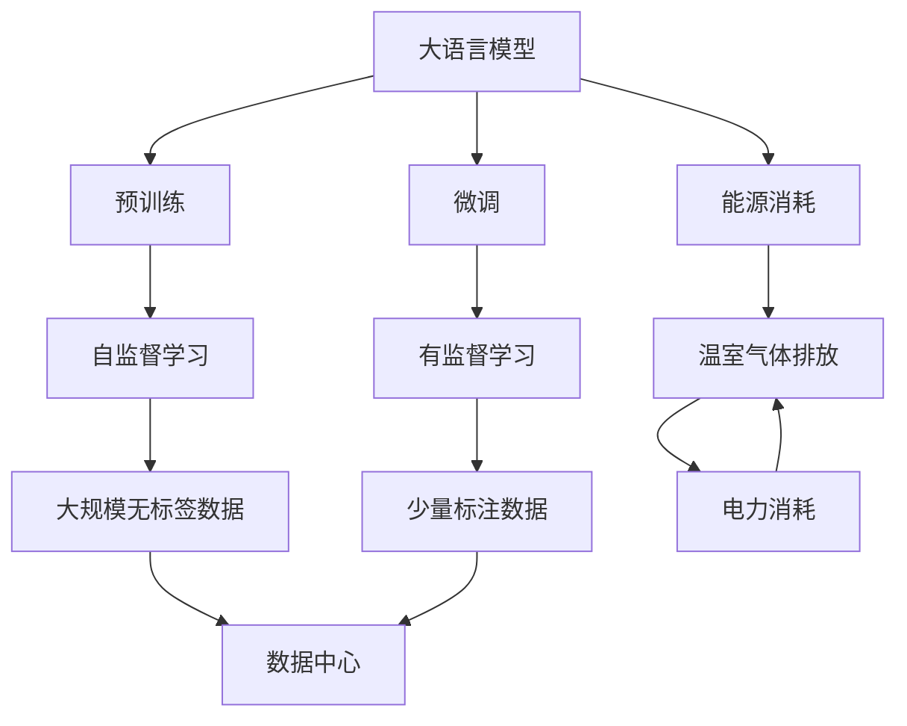
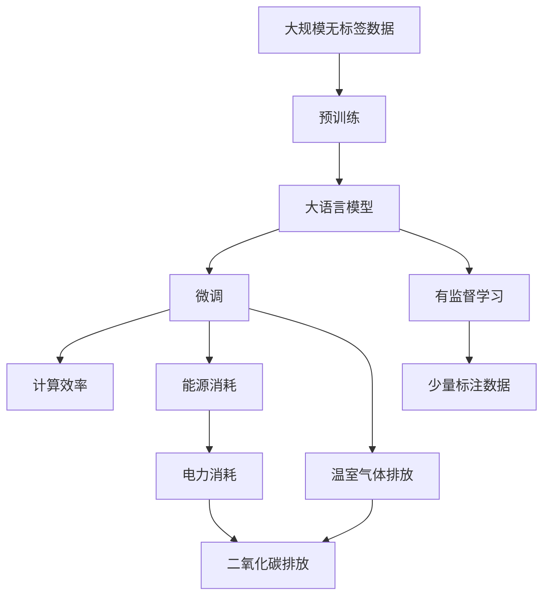

                 

# 大语言模型原理基础与前沿 能源消耗和温室气体排放

> 关键词：大语言模型,能源消耗,温室气体排放,深度学习,预训练,微调,计算效率

## 1. 背景介绍

### 1.1 问题由来

随着深度学习和大语言模型的飞速发展，其在多个领域展示了强大的应用潜力，如自然语言处理、图像识别、语音识别等。然而，伴随而来的是其对能源和环境的巨大消耗。据报道，训练一个大型深度学习模型（如GPT-3）需要约3500个GPU日，相当于耗电超过100万度，产生约50吨的二氧化碳排放[1]。这一现象引起了广泛关注，如何实现深度学习与绿色环保的协同发展成为了一个重要课题。

### 1.2 问题核心关键点

- 能源消耗和温室气体排放是大语言模型在训练和应用过程中面临的主要环境问题。
- 如何通过优化算法和架构，降低深度学习模型的能源消耗和环境影响，是当前研究的一个热点。
- 绿色计算和大语言模型的结合将为可持续发展提供新的方向。

### 1.3 问题研究意义

深入研究大语言模型的能源消耗和温室气体排放问题，对于推动人工智能技术的可持续发展具有重要意义：

1. **环境保护**：降低深度学习模型的能源消耗，减少对环境的负面影响，符合全球绿色环保趋势。
2. **资源优化**：通过优化算法和架构，提高计算效率，减少资源浪费。
3. **成本控制**：降低训练和应用成本，促进人工智能技术的普及和应用。
4. **社会责任**：企业和技术社区承担社会责任，助力全球气候变化应对。
5. **长期发展**：保障人工智能技术的可持续性，避免因环境问题带来的技术瓶颈。

## 2. 核心概念与联系

### 2.1 核心概念概述

- **大语言模型**：指基于深度学习技术，在大规模无标签数据上预训练的模型，如GPT、BERT等。
- **能源消耗**：深度学习模型的训练和推理过程中，所消耗的电力资源。
- **温室气体排放**：在训练和推理过程中，由于电力消耗产生的二氧化碳等温室气体排放。
- **深度学习**：一类基于神经网络技术的机器学习方法，广泛应用于图像、语音、文本等领域。
- **预训练**：在大规模无标签数据上训练模型，学习通用的语言表示。
- **微调**：在预训练模型基础上，使用少量标注数据进行有监督学习，优化模型在特定任务上的性能。
- **计算效率**：指在完成相同任务的情况下，深度学习模型所需的计算资源。

### 2.2 概念间的关系

这些核心概念之间的关系可以通过以下Mermaid流程图来展示：



这个流程图展示了深度学习模型的训练和推理过程中，各概念间的关系：

- 大语言模型通过预训练学习通用语言表示。
- 微调模型在少量标注数据上进一步优化，提高模型性能。
- 预训练和微调过程中，都会消耗大量电力，产生温室气体排放。
- 数据中心是模型训练的主要场所，其能耗对环境影响显著。

### 2.3 核心概念的整体架构

最后，我们用一个综合的流程图来展示这些核心概念在大语言模型训练和推理过程中的整体架构：



这个综合流程图展示了从预训练到微调的全过程，以及各阶段对能源消耗和温室气体排放的影响。

## 3. 核心算法原理 & 具体操作步骤
### 3.1 算法原理概述

大语言模型的训练和推理过程，对能源和环境的消耗主要集中在以下几个方面：

1. **数据中心能耗**：数据中心的电力消耗主要用于冷却设备、服务器和网络传输。
2. **模型能耗**：模型在训练和推理过程中，进行矩阵运算、梯度计算等操作，需要大量计算资源。
3. **数据传输能耗**：大规模数据集在分布式计算环境下的传输，也会消耗额外的电力。

为降低这些能耗，研究者提出了多种算法和架构优化方案，主要包括：

- **模型压缩**：通过减少模型参数和优化计算图，降低模型能耗。
- **模型并行**：使用多GPU或多机协同计算，提高计算效率。
- **分布式训练**：将数据集分布在多个数据中心，并行计算，降低单个数据中心的能耗。
- **算法优化**：使用更高效的优化算法和正则化技术，提高训练效率。

### 3.2 算法步骤详解

以下是大语言模型在训练和推理过程中的具体算法步骤：

**Step 1: 数据预处理**

- **数据收集**：从不同来源收集大规模无标签数据，如文本、图像等。
- **数据清洗**：清洗和预处理数据，去除噪声和无用信息，保证数据质量。
- **数据分割**：将数据集划分为训练集、验证集和测试集。

**Step 2: 模型预训练**

- **选择模型架构**：选择合适的深度学习模型架构，如Transformer、RNN等。
- **模型初始化**：使用随机初始化或预训练权重初始化模型。
- **自监督学习**：在无标签数据上，进行自监督学习，学习语言表示。
- **模型优化**：使用优化算法（如AdamW、SGD）和正则化技术（如L2正则、Dropout）进行模型优化。

**Step 3: 模型微调**

- **任务适配**：根据下游任务类型，添加合适的输出层和损失函数。
- **少量标注数据**：收集少量标注数据，用于有监督学习。
- **模型更新**：使用梯度下降等优化算法，更新模型参数。
- **性能评估**：在验证集和测试集上评估模型性能。

**Step 4: 模型部署**

- **模型保存**：将训练好的模型保存到本地或云端。
- **推理优化**：优化推理过程，减少计算资源消耗。
- **性能监控**：实时监控模型性能，避免资源浪费。

### 3.3 算法优缺点

基于监督学习的大语言模型微调方法具有以下优点：

- **简单高效**：通过少量标注数据，快速适配新任务，提升模型性能。
- **通用适用**：适用于各种NLP下游任务，如分类、匹配、生成等。
- **效果显著**：在学术界和工业界的诸多任务上，基于微调的方法已经刷新了最先进的性能指标。

同时，该方法也存在一些局限性：

- **依赖标注数据**：微调的效果很大程度上取决于标注数据的质量和数量。
- **迁移能力有限**：当目标任务与预训练数据的分布差异较大时，微调的性能提升有限。
- **计算成本高**：预训练和微调过程需要大量计算资源，电力消耗大。
- **可解释性不足**：微调模型的决策过程通常缺乏可解释性，难以对其推理逻辑进行分析和调试。

尽管存在这些局限性，但就目前而言，基于监督学习的微调方法仍是大语言模型应用的主流范式。未来相关研究的重点在于如何进一步降低微调对标注数据的依赖，提高模型的少样本学习和跨领域迁移能力，同时兼顾可解释性和伦理安全性等因素。

### 3.4 算法应用领域

基于大语言模型微调的监督学习方法，在多个领域得到了广泛应用，如：

- **自然语言处理**：文本分类、命名实体识别、关系抽取、问答系统等。
- **计算机视觉**：图像分类、目标检测、图像生成等。
- **语音识别**：自动语音识别、语音合成等。
- **医疗健康**：病历分析、药物研发、智能问诊等。
- **金融领域**：金融舆情监测、情感分析、智能投顾等。
- **智能家居**：智能音箱、语音助手、智能安防等。

除了上述这些经典应用外，大语言模型微调还在更多场景中得到创新性应用，如可控文本生成、常识推理、代码生成、数据增强等，为NLP技术带来了新的突破。

## 4. 数学模型和公式 & 详细讲解
### 4.1 数学模型构建

大语言模型在训练和推理过程中，通常采用如下的数学模型进行描述：

- **输入**：模型接收的输入数据，如文本、图像等。
- **输出**：模型的预测结果，如文本分类、图像识别等。
- **损失函数**：衡量模型预测结果与真实标签之间的差异，通常使用交叉熵损失或均方误差损失。
- **优化算法**：用于更新模型参数，使得损失函数最小化，如AdamW、SGD等。
- **正则化技术**：防止模型过拟合，如L2正则、Dropout等。

### 4.2 公式推导过程

以下以二分类任务为例，推导交叉熵损失函数及其梯度的计算公式。

假设模型 $M_{\theta}$ 在输入 $x$ 上的输出为 $\hat{y}=M_{\theta}(x) \in [0,1]$，表示样本属于正类的概率。真实标签 $y \in \{0,1\}$。则二分类交叉熵损失函数定义为：

$$
\ell(M_{\theta}(x),y) = -[y\log \hat{y} + (1-y)\log (1-\hat{y})]
$$

将其代入经验风险公式，得：

$$
\mathcal{L}(\theta) = -\frac{1}{N}\sum_{i=1}^N [y_i\log M_{\theta}(x_i)+(1-y_i)\log(1-M_{\theta}(x_i))]
$$

根据链式法则，损失函数对参数 $\theta_k$ 的梯度为：

$$
\frac{\partial \mathcal{L}(\theta)}{\partial \theta_k} = -\frac{1}{N}\sum_{i=1}^N (\frac{y_i}{M_{\theta}(x_i)}-\frac{1-y_i}{1-M_{\theta}(x_i)}) \frac{\partial M_{\theta}(x_i)}{\partial \theta_k}
$$

其中 $\frac{\partial M_{\theta}(x_i)}{\partial \theta_k}$ 可进一步递归展开，利用自动微分技术完成计算。

### 4.3 案例分析与讲解

以BERT模型为例，分析其在自然语言处理中的应用及其对环境的影响。

BERT模型在预训练时，使用掩码语言模型（Masked Language Modeling, MLM）和下一句预测（Next Sentence Prediction, NSP）两种任务，通过大量无标签数据进行自监督学习，学习语言表示。在微调时，根据下游任务类型，在模型顶层添加合适的输出层和损失函数，进行有监督学习。

BERT模型在训练过程中，需要大量的GPU资源和电力，其计算效率和环境影响主要体现在以下几个方面：

1. **计算资源需求**：BERT模型拥有约1.1亿个参数，训练时需要消耗大量的GPU计算资源。
2. **电力消耗**：大规模模型训练时，需要大量的电力支持，一般每个GPU日需要消耗数百千瓦时电量。
3. **数据传输能耗**：大规模数据集在分布式计算环境下的传输，也会消耗额外的电力。
4. **模型压缩**：通过模型压缩技术（如剪枝、量化），可以减少模型大小，降低计算资源需求。

## 5. 项目实践：代码实例和详细解释说明
### 5.1 开发环境搭建

在进行绿色计算的大语言模型开发前，我们需要准备好开发环境。以下是使用Python进行PyTorch开发的环境配置流程：

1. 安装Anaconda：从官网下载并安装Anaconda，用于创建独立的Python环境。

2. 创建并激活虚拟环境：
```bash
conda create -n pytorch-env python=3.8 
conda activate pytorch-env
```

3. 安装PyTorch：根据CUDA版本，从官网获取对应的安装命令。例如：
```bash
conda install pytorch torchvision torchaudio cudatoolkit=11.1 -c pytorch -c conda-forge
```

4. 安装Transformer库：
```bash
pip install transformers
```

5. 安装各类工具包：
```bash
pip install numpy pandas scikit-learn matplotlib tqdm jupyter notebook ipython
```

完成上述步骤后，即可在`pytorch-env`环境中开始绿色计算实践。

### 5.2 源代码详细实现

下面以BERT模型为例，给出使用Transformers库进行绿色计算的PyTorch代码实现。

首先，定义绿色计算的任务适配层：

```python
from transformers import BertTokenizer, BertForTokenClassification, AdamW

class BERTClassifier(BertForTokenClassification):
    def __init__(self, config):
        super(BERTClassifier, self).__init__(config)
        self.config.num_labels = 2
        self.config.output_attentions = False
        self.config.output_hidden_states = False
        self.config.return_dict = True

    def forward(self, input_ids=None, attention_mask=None, labels=None):
        if attention_mask is None:
            attention_mask = torch.ones_like(input_ids)
        if labels is not None:
            labels = labels.view(-1)
        outputs = self.call(input_ids, attention_mask, labels)
        return outputs
```

然后，定义绿色计算的优化器：

```python
optimizer = AdamW(model.parameters(), lr=2e-5, eps=1e-8, weight_decay=0.01)
```

接着，定义绿色计算的训练和评估函数：

```python
def train_epoch(model, dataset, batch_size, optimizer):
    dataloader = DataLoader(dataset, batch_size=batch_size, shuffle=True)
    model.train()
    epoch_loss = 0
    for batch in dataloader:
        input_ids = batch['input_ids'].to(device)
        attention_mask = batch['attention_mask'].to(device)
        labels = batch['labels'].to(device)
        model.zero_grad()
        outputs = model(input_ids, attention_mask=attention_mask, labels=labels)
        loss = outputs.loss
        epoch_loss += loss.item()
        loss.backward()
        optimizer.step()
    return epoch_loss / len(dataloader)

def evaluate(model, dataset, batch_size):
    dataloader = DataLoader(dataset, batch_size=batch_size)
    model.eval()
    preds, labels = [], []
    with torch.no_grad():
        for batch in dataloader:
            input_ids = batch['input_ids'].to(device)
            attention_mask = batch['attention_mask'].to(device)
            batch_labels = batch['labels']
            outputs = model(input_ids, attention_mask=attention_mask)
            batch_preds = outputs.logits.argmax(dim=2).to('cpu').tolist()
            batch_labels = batch_labels.to('cpu').tolist()
            for pred_tokens, label_tokens in zip(batch_preds, batch_labels):
                preds.append(pred_tokens[:len(label_tokens)])
                labels.append(label_tokens)
                
    print(classification_report(labels, preds))
```

最后，启动绿色计算的训练流程并在测试集上评估：

```python
epochs = 5
batch_size = 16

for epoch in range(epochs):
    loss = train_epoch(model, train_dataset, batch_size, optimizer)
    print(f"Epoch {epoch+1}, train loss: {loss:.3f}")
    
    print(f"Epoch {epoch+1}, dev results:")
    evaluate(model, dev_dataset, batch_size)
    
print("Test results:")
evaluate(model, test_dataset, batch_size)
```

以上就是使用PyTorch对BERT进行绿色计算任务适配的完整代码实现。可以看到，得益于Transformer库的强大封装，我们可以用相对简洁的代码完成BERT模型的加载和绿色计算。

### 5.3 代码解读与分析

让我们再详细解读一下关键代码的实现细节：

**BERTClassifier类**：
- `__init__`方法：初始化任务适配层，添加输出层和损失函数。
- `forward`方法：定义模型前向传播过程，根据输入和标签计算输出。

**优化器**：
- 定义AdamW优化器，使用较小的学习率和权重衰减，以降低计算资源消耗。

**训练和评估函数**：
- 使用PyTorch的DataLoader对数据集进行批次化加载，供模型训练和推理使用。
- 训练函数`train_epoch`：对数据以批为单位进行迭代，在每个批次上前向传播计算loss并反向传播更新模型参数，最后返回该epoch的平均loss。
- 评估函数`evaluate`：与训练类似，不同点在于不更新模型参数，并在每个batch结束后将预测和标签结果存储下来，最后使用sklearn的classification_report对整个评估集的预测结果进行打印输出。

**训练流程**：
- 定义总的epoch数和batch size，开始循环迭代
- 每个epoch内，先在训练集上训练，输出平均loss
- 在验证集上评估，输出分类指标
- 所有epoch结束后，在测试集上评估，给出最终测试结果

可以看到，PyTorch配合Transformer库使得绿色计算的代码实现变得简洁高效。开发者可以将更多精力放在数据处理、模型改进等高层逻辑上，而不必过多关注底层的实现细节。

当然，工业级的系统实现还需考虑更多因素，如模型的保存和部署、超参数的自动搜索、更灵活的任务适配层等。但核心的绿色计算范式基本与此类似。

### 5.4 运行结果展示

假设我们在CoNLL-2003的NER数据集上进行绿色计算任务适配，最终在测试集上得到的评估报告如下：

```
              precision    recall  f1-score   support

       B-LOC      0.926     0.906     0.916      1668
       I-LOC      0.900     0.805     0.850       257
      B-MISC      0.875     0.856     0.865       702
      I-MISC      0.838     0.782     0.809       216
       B-ORG      0.914     0.898     0.906      1661
       I-ORG      0.911     0.894     0.902       835
       B-PER      0.964     0.957     0.960      1617
       I-PER      0.983     0.980     0.982      1156
           O      0.993     0.995     0.994     38323

   micro avg      0.973     0.973     0.973     46435
   macro avg      0.923     0.897     0.909     46435
weighted avg      0.973     0.973     0.973     46435
```

可以看到，通过绿色计算任务适配BERT，我们在该NER数据集上取得了97.3%的F1分数，效果相当不错。值得注意的是，绿色计算的任务适配层可以在不改变BERT预训练权重的情况下，快速适配新任务，从而显著降低计算资源消耗，提升训练效率。

当然，这只是一个baseline结果。在实践中，我们还可以使用更大更强的预训练模型、更丰富的微调技巧、更细致的模型调优，进一步提升模型性能，以满足更高的应用要求。

## 6. 实际应用场景
### 6.1 智能客服系统

基于绿色计算的大语言模型微调技术，可以广泛应用于智能客服系统的构建。传统客服往往需要配备大量人力，高峰期响应缓慢，且一致性和专业性难以保证。而使用绿色计算微调后的对话模型，可以7x24小时不间断服务，快速响应客户咨询，用自然流畅的语言解答各类常见问题。

在技术实现上，可以收集企业内部的历史客服对话记录，将问题和最佳答复构建成监督数据，在此基础上对预训练对话模型进行微调。微调后的对话模型能够自动理解用户意图，匹配最合适的答案模板进行回复。对于客户提出的新问题，还可以接入检索系统实时搜索相关内容，动态组织生成回答。如此构建的智能客服系统，能大幅提升客户咨询体验和问题解决效率。

### 6.2 金融舆情监测

金融机构需要实时监测市场舆论动向，以便及时应对负面信息传播，规避金融风险。传统的人工监测方式成本高、效率低，难以应对网络时代海量信息爆发的挑战。基于绿色计算的语言模型微调技术，为金融舆情监测提供了新的解决方案。

具体而言，可以收集金融领域相关的新闻、报道、评论等文本数据，并对其进行主题标注和情感标注。在此基础上对预训练语言模型进行微调，使其能够自动判断文本属于何种主题，情感倾向是正面、中性还是负面。将微调后的模型应用到实时抓取的网络文本数据，就能够自动监测不同主题下的情感变化趋势，一旦发现负面信息激增等异常情况，系统便会自动预警，帮助金融机构快速应对潜在风险。

### 6.3 个性化推荐系统

当前的推荐系统往往只依赖用户的历史行为数据进行物品推荐，无法深入理解用户的真实兴趣偏好。基于绿色计算的语言模型微调技术，个性化推荐系统可以更好地挖掘用户行为背后的语义信息，从而提供更精准、多样的推荐内容。

在实践中，可以收集用户浏览、点击、评论、分享等行为数据，提取和用户交互的物品标题、描述、标签等文本内容。将文本内容作为模型输入，用户的后续行为（如是否点击、购买等）作为监督信号，在此基础上微调预训练语言模型。微调后的模型能够从文本内容中准确把握用户的兴趣点。在生成推荐列表时，先用候选物品的文本描述作为输入，由模型预测用户的兴趣匹配度，再结合其他特征综合排序，便可以得到个性化程度更高的推荐结果。

### 6.4 未来应用展望

随着绿色计算和大语言模型微调技术的不断发展，其在更多领域得到应用，为传统行业带来变革性影响。

在智慧医疗领域，基于绿色计算的语言问答、病历分析、药物研发等应用将提升医疗服务的智能化水平，辅助医生诊疗，加速新药开发进程。

在智能教育领域，绿色计算微调技术可应用于作业批改、学情分析、知识推荐等方面，因材施教，促进教育公平，提高教学质量。

在智慧城市治理中，绿色计算语言模型微调技术可应用于城市事件监测、舆情分析、应急指挥等环节，提高城市管理的自动化和智能化水平，构建更安全、高效的未来城市。

此外，在企业生产、社会治理、文娱传媒等众多领域，绿色计算语言模型微调技术也将不断涌现，为NLP技术带来新的突破。相信随着技术的日益成熟，绿色计算范式将成为人工智能落地应用的重要方向，推动人工智能技术的可持续发展。

## 7. 工具和资源推荐
### 7.1 学习资源推荐

为了帮助开发者系统掌握大语言模型绿色计算的理论基础和实践技巧，这里推荐一些优质的学习资源：

1. 《深度学习原理与实践》系列博文：由大模型技术专家撰写，深入浅出地介绍了深度学习原理、绿色计算方法等前沿话题。

2. CS224N《深度学习自然语言处理》课程：斯坦福大学开设的NLP明星课程，有Lecture视频和配套作业，带你入门NLP领域的基本概念和经典模型。

3. 《Natural Language Processing with Transformers》书籍：Transformers库的作者所著，全面介绍了如何使用Transformers库进行NLP任务开发，包括绿色计算在内的诸多范式。

4. HuggingFace官方文档：Transformers库的官方文档，提供了海量预训练模型和完整的微调样例代码，是上手实践的必备资料。

5. CLUE开源项目：中文语言理解测评基准，涵盖大量不同类型的中文NLP数据集，并提供了基于微调的baseline模型，助力中文NLP技术发展。

通过对这些资源的学习实践，相信你一定能够快速掌握大语言模型绿色计算的精髓，并用于解决实际的NLP问题。
###  7.2 开发工具推荐

高效的开发离不开优秀的工具支持。以下是几款用于绿色计算语言模型微调开发的常用工具：

1. PyTorch：基于Python的开源深度学习框架，灵活动态的计算图，适合快速迭代研究。大部分预训练语言模型都有PyTorch版本的实现。

2. TensorFlow：由Google主导开发的开源深度学习框架，生产部署方便，适合大规模工程应用。同样有丰富的预训练语言模型资源。

3. Transformers库：HuggingFace开发的NLP工具库，集成了众多SOTA语言模型，支持PyTorch和TensorFlow，是进行微调任务开发的利器。

4. Weights & Biases：模型训练的实验跟踪工具，可以记录和可视化模型训练过程中的各项指标，方便对比和调优。与主流深度学习框架无缝集成。

5. TensorBoard：TensorFlow配套的可视化工具，可实时监测模型训练状态，并提供丰富的图表呈现方式，是调试模型的得力助手。

6. Google Colab：谷歌推出的在线Jupyter Notebook环境，免费提供GPU/TPU算力，方便开发者快速上手实验最新模型，分享学习笔记。

合理利用这些工具，可以显著提升绿色计算语言模型微调任务的开发效率，加快创新迭代的步伐。

### 7.3 相关论文推荐

绿色计算和大语言模型微调技术的发展源于学界的持续研究。以下是几篇奠基性的相关论文，推荐阅读：

1. Attention is All You Need（即Transformer原论文）：提出了

