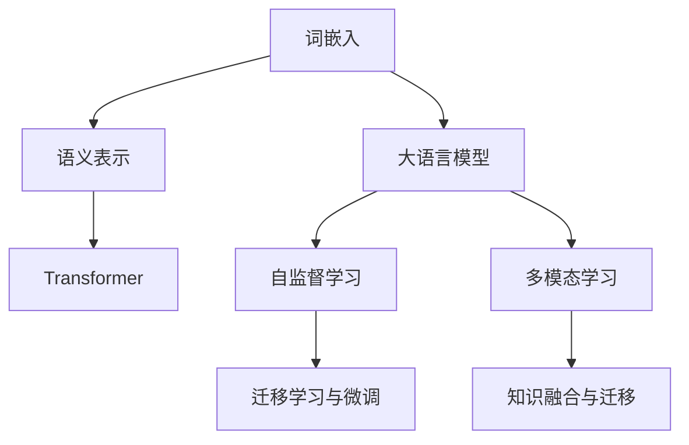
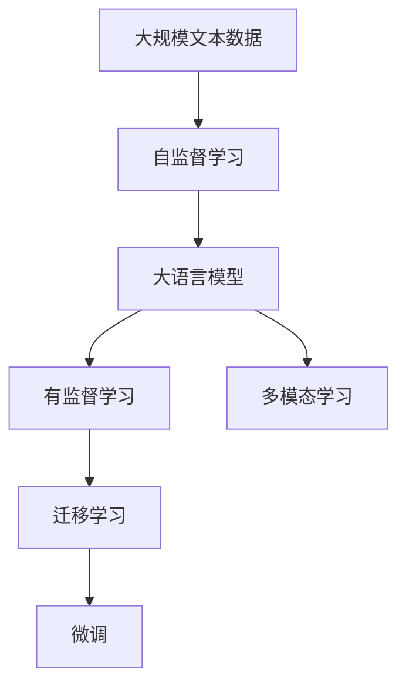
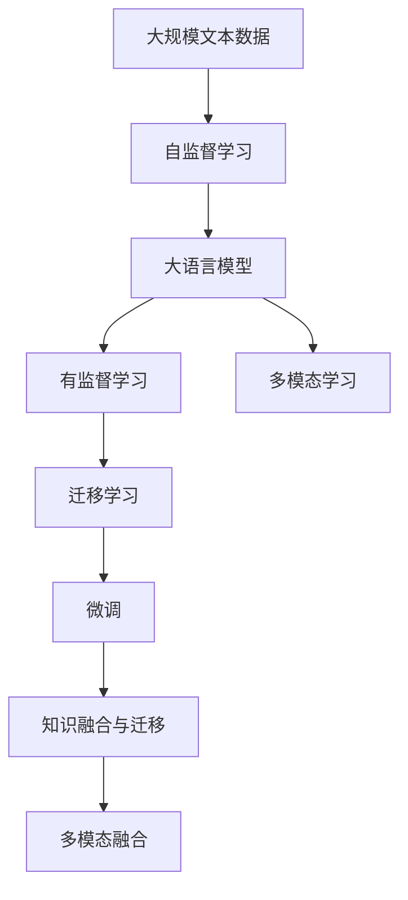

                 

# 大语言模型的语意向量表示

> 关键词：大语言模型、语义表示、向量化、自然语言处理(NLP)、Word2Vec、GloVe、BERT、Transformer

## 1. 背景介绍

### 1.1 问题由来

在自然语言处理（NLP）领域，如何有效地表示和理解语言，一直是核心问题。传统的NLP方法依赖于手工设计的特征工程，存在诸多局限。而深度学习，特别是基于神经网络的语言模型，通过大规模数据训练，逐渐挖掘出语言的潜在规律，成为了新的主流技术。

语言模型通过学习文本数据，捕捉词语之间的统计关系和语义信息。传统的词袋模型（Bag-of-Words, BoW）、TF-IDF等只考虑词汇的出现频率，无法表达词汇间的相对位置和语义联系。基于神经网络的词嵌入方法（Word Embeddings）则能捕捉到词汇的上下文信息，但在面对长距离依赖和复杂语义关系时，效果仍然有限。

为了更深入地理解和表示语言，研究者提出了大语言模型（Large Language Models, LLMs）的概念，希望构建一种能全局理解上下文、语义丰富、且具有良好泛化能力的语言模型。这些模型通常拥有数十亿参数，在大规模无标签文本数据上进行预训练，从而获得了丰富的语言知识。但直接将大语言模型应用于下游任务，效果往往不理想。

因此，有必要对大语言模型的语意向量表示进行深入探索，以更好地适应特定任务需求，提升模型的泛化性能和应用效果。

### 1.2 问题核心关键点

大语言模型通常使用神经网络架构，如Transformer，进行训练。其核心在于通过预训练学习大规模的文本数据，构建一种低维的语义表示，即向量表示。向量表示不仅捕捉词汇的局部信息，还能全局理解上下文，具有很强的语义传递能力。

语意向量表示的优化，主要涉及以下几个方面：

- **词嵌入空间**：如何构建低维、高维稀疏、稠密的向量空间，以充分表达词语的语义信息。
- **向量更新机制**：如何在词嵌入空间中，动态更新和优化向量表示，以适应不同语义关系和上下文信息。
- **知识融合与迁移**：如何将外部知识源，如知识图谱、逻辑规则等，与神经网络模型进行融合，提升模型的语义表示能力。
- **多模态融合**：如何利用图像、音频等多模态数据，丰富语言模型的语义表示，提高模型的泛化能力。
- **迁移学习与微调**：如何在预训练模型的基础上，进行有监督的微调，优化模型在特定任务上的语义表示。

本节将通过深入分析以上几个关键点，进一步讨论大语言模型的语意向量表示方法。

## 2. 核心概念与联系

### 2.1 核心概念概述

为更好地理解大语言模型的语意向量表示，本节将介绍几个密切相关的核心概念：

- **词嵌入（Word Embedding）**：将词汇映射到低维向量空间，捕捉词汇的语义信息。常见的词嵌入方法包括Word2Vec、GloVe等。
- **语义表示（Semantic Representation）**：通过词嵌入方法，捕捉词汇间的语义联系，形成更高级的语义表示，如句子向量、段落向量等。
- **大语言模型（Large Language Model, LLM）**：通过大规模数据预训练构建的深度神经网络模型，具备很强的语言理解和生成能力。
- **Transformer架构**：一种用于处理序列数据的神经网络架构，具有并行计算和注意力机制，在大语言模型中广泛应用。
- **自监督学习（Self-Supervised Learning）**：利用大规模无标签数据，通过自监督学习任务训练神经网络，学习语言的潜在规律。
- **多模态学习（Multimodal Learning）**：结合图像、音频等多种数据源，丰富语言模型的语义表示。

这些概念之间的联系可以通过以下Mermaid流程图来展示：



这个流程图展示了不同概念之间的联系：

1. 词嵌入通过捕捉词汇间的语义关系，构建低维的语义表示空间。
2. 大语言模型通过自监督学习任务训练，构建更高级的语义表示。
3. Transformer架构通过并行计算和注意力机制，优化语义表示的质量。
4. 多模态学习通过结合多种数据源，丰富语义表示的多样性。
5. 知识融合与迁移通过将外部知识与神经网络结合，提升语义表示的精度。
6. 迁移学习与微调通过有监督的微调，优化模型在特定任务上的语义表示。

### 2.2 概念间的关系

这些概念之间存在着紧密的联系，形成了大语言模型的语意向量表示的完整生态系统。下面我们通过几个Mermaid流程图来展示这些概念之间的关系。

#### 2.2.1 大语言模型的学习范式



这个流程图展示了大语言模型的学习范式。大语言模型通过自监督学习训练，构建全局语义表示；然后通过有监督学习进行微调，优化特定任务的表现；同时可以结合多模态数据，丰富语义表示。

#### 2.2.2 语义表示的空间优化

```mermaid
graph LR
    A[词嵌入] --> B[低维空间]
    A --> C[高维空间]
    A --> D[稠密空间]
    A --> E[稀疏空间]
    A --> F[词向量更新]
    B --> G[向量更新]
    C --> H[向量更新]
    D --> I[向量更新]
    E --> J[向量更新]
    F --> K[向量更新]
    G --> L[向量更新]
    H --> M[向量更新]
    I --> N[向量更新]
    J --> O[向量更新]
    K --> P[向量更新]
    L --> Q[向量更新]
    M --> R[向量更新]
    N --> S[向量更新]
    O --> T[向量更新]
    P --> U[向量更新]
    Q --> V[向量更新]
    R --> W[向量更新]
    S --> X[向量更新]
    T --> Y[向量更新]
    U --> Z[向量更新]
    V --> [向量更新]
    W --> [向量更新]
    X --> [向量更新]
    Y --> [向量更新]
    Z --> [向量更新]
```

这个流程图展示了语义表示的空间优化方法。词嵌入方法可以将词汇映射到不同的向量空间，如低维空间、高维空间、稠密空间、稀疏空间等。不同的向量更新方法，如Word2Vec、GloVe、BERT等，可以进一步优化向量空间，提升语义表示的质量。

#### 2.2.3 语义表示的多模态融合

```mermaid
graph TB
    A[文本数据] --> B[图像数据]
    A --> C[音频数据]
    B --> D[语义表示]
    C --> E[语义表示]
    D --> F[多模态融合]
    E --> G[多模态融合]
    F --> H[语义表示]
    G --> I[语义表示]
    H --> J[语义表示]
    I --> K[语义表示]
    J --> L[知识融合]
    K --> M[知识融合]
    L --> N[语义表示]
    M --> O[语义表示]
    N --> P[语义表示]
    O --> Q[语义表示]
    P --> R[知识迁移]
    Q --> S[知识迁移]
    R --> T[语义表示]
    S --> U[语义表示]
    T --> V[知识融合]
    U --> W[知识融合]
    V --> X[语义表示]
    W --> Y[语义表示]
    X --> Z[语义表示]
    Y --> [语义表示]
    Z --> [语义表示]
```

这个流程图展示了语义表示的多模态融合方法。通过结合文本、图像、音频等多种数据源，可以构建更加丰富的语义表示。同时，知识融合与迁移技术可以进一步优化多模态语义表示，提升模型的泛化能力。

### 2.3 核心概念的整体架构

最后，我们用一个综合的流程图来展示这些核心概念在大语言模型语意向量表示中的整体架构：



这个综合流程图展示了从预训练到微调，再到知识融合的完整过程。大语言模型首先在大规模文本数据上进行预训练，然后通过有监督的微调，优化模型在特定任务上的表现。最后，通过多模态融合和知识融合，模型可以进一步丰富语义表示，提升泛化能力。

## 3. 核心算法原理 & 具体操作步骤
### 3.1 算法原理概述

大语言模型的语意向量表示，本质上是通过神经网络模型对文本数据进行编码，将词汇映射到低维向量空间中。这一过程主要包括词嵌入和语义表示两个步骤。

词嵌入方法通过捕捉词汇间的语义关系，构建低维的向量表示。常见的词嵌入方法包括Word2Vec、GloVe、FastText等。这些方法通常使用分布式表示（Distributed Representation），即每个词汇对应一个低维向量，向量间具有某种语义相似度。

语义表示则通过神经网络模型，进一步捕捉词汇间的语义联系和上下文信息。常见的语义表示方法包括Transformer架构和自监督学习任务。Transformer通过并行计算和注意力机制，优化语义表示的质量；自监督学习任务则通过大规模无标签数据，训练神经网络，学习语言的潜在规律。

### 3.2 算法步骤详解

大语言模型的语意向量表示一般包括以下几个关键步骤：

**Step 1: 准备预训练模型和数据集**
- 选择合适的预训练语言模型 $M_{\theta}$ 作为初始化参数，如 BERT、GPT 等。
- 准备下游任务 $T$ 的标注数据集 $D=\{(x_i,y_i)\}_{i=1}^N$，划分为训练集、验证集和测试集。一般要求标注数据与预训练数据的分布不要差异过大。

**Step 2: 设计任务适配层**
- 根据任务类型，在预训练模型顶层设计合适的输出层和损失函数。
- 对于分类任务，通常在顶层添加线性分类器和交叉熵损失函数。
- 对于生成任务，通常使用语言模型的解码器输出概率分布，并以负对数似然为损失函数。

**Step 3: 训练语义表示**
- 将训练集数据分批次输入模型，前向传播计算损失函数。
- 反向传播计算参数梯度，根据设定的优化算法和学习率更新模型参数。
- 周期性在验证集上评估模型性能，根据性能指标决定是否触发 Early Stopping。
- 重复上述步骤直到满足预设的迭代轮数或 Early Stopping 条件。

**Step 4: 微调语义表示**
- 使用下游任务的少量标注数据，对预训练模型进行有监督微调。
- 保留预训练的部分层，仅微调顶层分类器或解码器。
- 使用较小的学习率，以避免破坏预训练权重。
- 应用正则化技术，防止模型过度适应小规模训练集。
- 引入数据增强、对抗训练等技术，提高模型泛化能力。

**Step 5: 测试和部署**
- 在测试集上评估微调后模型 $M_{\hat{\theta}}$ 的性能，对比微调前后的精度提升。
- 使用微调后的模型对新样本进行推理预测，集成到实际的应用系统中。
- 持续收集新的数据，定期重新微调模型，以适应数据分布的变化。

以上是语意向量表示的完整步骤。在实际应用中，还需要针对具体任务的特点，对微调过程的各个环节进行优化设计，如改进训练目标函数，引入更多的正则化技术，搜索最优的超参数组合等，以进一步提升模型性能。

### 3.3 算法优缺点

大语言模型的语意向量表示方法具有以下优点：

- **全局理解能力**：通过Transformer架构，模型能够全局理解上下文，捕捉长距离依赖，具有很强的语义表示能力。
- **高泛化性能**：自监督学习任务在大规模无标签数据上进行训练，使得模型具备很强的泛化能力，能够适应多种下游任务。
- **多模态融合**：结合图像、音频等多模态数据，可以构建更加丰富的语义表示，提升模型的泛化能力。
- **知识融合与迁移**：通过知识图谱、逻辑规则等外部知识源，可以进一步优化语义表示，提升模型的理解能力。

同时，该方法也存在一定的局限性：

- **依赖标注数据**：微调过程需要下游任务的少量标注数据，对于标注成本高、标注数据少的情况，效果可能不佳。
- **过拟合风险**：微调过程中，如果学习率过大，容易破坏预训练权重，导致过拟合。
- **资源消耗大**：大语言模型的参数量通常以亿计，对算力、内存、存储等资源要求较高，微调过程中资源消耗也较大。
- **可解释性不足**：大语言模型通常具有"黑盒"特性，难以解释其内部工作机制和决策逻辑。

尽管存在这些局限性，但语意向量表示方法仍是大语言模型应用的主流范式，在NLP领域得到了广泛的应用，取得了显著的效果。

### 3.4 算法应用领域

大语言模型的语意向量表示方法在NLP领域已经得到了广泛的应用，覆盖了几乎所有常见任务，例如：

- **文本分类**：如情感分析、主题分类、意图识别等。通过语意向量表示，模型学习文本-标签映射。
- **命名实体识别**：识别文本中的人名、地名、机构名等特定实体。通过语意向量表示，模型学习实体边界和类型。
- **关系抽取**：从文本中抽取实体之间的语义关系。通过语意向量表示，模型学习实体-关系三元组。
- **问答系统**：对自然语言问题给出答案。将问题-答案对作为语意向量表示，训练模型学习匹配答案。
- **机器翻译**：将源语言文本翻译成目标语言。通过语意向量表示，模型学习语言-语言映射。
- **文本摘要**：将长文本压缩成简短摘要。通过语意向量表示，模型学习抓取要点。
- **对话系统**：使机器能够与人自然对话。通过语意向量表示，模型学习对话语境和回复生成。

除了上述这些经典任务外，语意向量表示方法也被创新性地应用到更多场景中，如可控文本生成、常识推理、代码生成、数据增强等，为NLP技术带来了全新的突破。随着预训练模型和语意向量表示方法的不断进步，相信NLP技术将在更广阔的应用领域大放异彩。

## 4. 数学模型和公式 & 详细讲解  
### 4.1 数学模型构建

本节将使用数学语言对语意向量表示的构建过程进行更加严格的刻画。

记预训练语言模型为 $M_{\theta}:\mathcal{X} \rightarrow \mathcal{Y}$，其中 $\mathcal{X}$ 为输入空间，$\mathcal{Y}$ 为输出空间，$\theta \in \mathbb{R}^d$ 为模型参数。假设微调任务的训练集为 $D=\{(x_i,y_i)\}_{i=1}^N, x_i \in \mathcal{X}, y_i \in \mathcal{Y}$。

定义模型 $M_{\theta}$ 在输入 $x$ 上的输出为 $\hat{y}=M_{\theta}(x) \in [0,1]$，表示样本属于正类的概率。真实标签 $y \in \{0,1\}$。则二分类交叉熵损失函数定义为：

$$
\ell(M_{\theta}(x),y) = -[y\log \hat{y} + (1-y)\log (1-\hat{y})]
$$

将其代入经验风险公式，得：

$$
\mathcal{L}(\theta) = -\frac{1}{N}\sum_{i=1}^N [y_i\log M_{\theta}(x_i)+(1-y_i)\log(1-M_{\theta}(x_i))]
$$

在实践中，我们通常使用基于梯度的优化算法（如SGD、Adam等）来近似求解上述最优化问题。设 $\eta$ 为学习率，$\lambda$ 为正则化系数，则参数的更新公式为：

$$
\theta \leftarrow \theta - \eta \nabla_{\theta}\mathcal{L}(\theta) - \eta\lambda\theta
$$

其中 $\nabla_{\theta}\mathcal{L}(\theta)$ 为损失函数对参数 $\theta$ 的梯度，可通过反向传播算法高效计算。

### 4.2 公式推导过程

以下我们以二分类任务为例，推导交叉熵损失函数及其梯度的计算公式。

假设模型 $M_{\theta}$ 在输入 $x$ 上的输出为 $\hat{y}=M_{\theta}(x) \in [0,1]$，表示样本属于正类的概率。真实标签 $y \in \{0,1\}$。则二分类交叉熵损失函数定义为：

$$
\ell(M_{\theta}(x),y) = -[y\log \hat{y} + (1-y)\log (1-\hat{y})]
$$

将其代入经验风险公式，得：

$$
\mathcal{L}(\theta) = -\frac{1}{N}\sum_{i=1}^N [y_i\log M_{\theta}(x_i)+(1-y_i)\log(1-M_{\theta}(x_i))]
$$

根据链式法则，损失函数对参数 $\theta_k$ 的梯度为：

$$
\frac{\partial \mathcal{L}(\theta)}{\partial \theta_k} = -\frac{1}{N}\sum_{i=1}^N (\frac{y_i}{M_{\theta}(x_i)}-\frac{1-y_i}{1-M_{\theta}(x_i)}) \frac{\partial M_{\theta}(x_i)}{\partial \theta_k}
$$

其中 $\frac{\partial M_{\theta}(x_i)}{\partial \theta_k}$ 可进一步递归展开，利用自动微分技术完成计算。

在得到损失函数的梯度后，即可带入参数更新公式，完成模型的迭代优化。重复上述过程直至收敛，最终得到适应下游任务的最优模型参数 $\theta^*$。

## 5. 项目实践：代码实例和详细解释说明
### 5.1 开发环境搭建

在进行语意向量表示实践前，我们需要准备好开发环境。以下是使用Python进行PyTorch开发的环境配置流程：

1. 安装Anaconda：从官网下载并安装Anaconda，用于创建独立的Python环境。

2. 创建并激活虚拟环境：
```bash
conda create -n pytorch-env python=3.8 
conda activate pytorch-env
```

3. 安装PyTorch：根据CUDA版本，从官网获取对应的安装命令。例如：
```bash
conda install pytorch torchvision torchaudio cudatoolkit=11.1 -c pytorch -c conda-forge
```

4. 安装Transformers库：
```bash
pip install transformers
```

5. 安装各类工具包：
```bash
pip install numpy pandas scikit-learn matplotlib tqdm jupyter notebook ipython
```

完成上述步骤后，即可在`pytorch-env`环境中开始语意向量表示实践。

### 5.2 源代码详细实现

下面我们以命名实体识别(NER)任务为例，给出使用Transformers库对BERT模型进行语意向量表示的PyTorch代码实现。

首先，定义NER任务的数据处理函数：

```python
from transformers import BertTokenizer
from torch.utils.data import Dataset
import torch

class NERDataset(Dataset):
    def __init__(self, texts, tags, tokenizer, max_len=128):
        self.texts = texts
        self.tags = tags
        self.tokenizer = tokenizer
        self.max_len = max_len
        
    def __len__(self):
        return len(self.texts)
    
    def __getitem__(self, item):
        text = self.texts[item]
        tags = self.tags[item]
        
        encoding = self.tokenizer(text, return_tensors='pt', max_length=self.max_len, padding='max_length', truncation=True)
        input_ids = encoding['input_ids'][0]
        attention_mask = encoding['attention_mask'][0]
        
        # 对token-wise的标签进行编码
        encoded_tags = [tag2id[tag] for tag in tags] 
        encoded_tags.extend([tag2id['O']] * (self.max_len - len(encoded_tags)))
        labels = torch.tensor(encoded_tags, dtype=torch.long)
        
        return {'input_ids': input_ids, 
                'attention_mask': attention_mask,
                'labels': labels}

# 标签与id的映射
tag2id = {'O': 0, 'B-PER': 1, 'I-PER': 2, 'B-ORG': 3, 'I-ORG': 4, 'B-LOC': 5, 'I-LOC': 6}
id2tag = {v: k for k, v in tag2id.items()}

# 创建dataset
tokenizer = BertTokenizer.from_pretrained('bert-base-cased')

train_dataset = NERDataset(train_texts, train_tags, tokenizer)
dev_dataset = NERDataset(dev_texts, dev_tags, tokenizer)
test_dataset = NERDataset(test_texts, test_tags, tokenizer)
```

然后，定义模型和优化器：

```python
from transformers import BertForTokenClassification, AdamW

model = BertForTokenClassification.from_pretrained('bert-base-cased', num_labels=len(tag2id))

optimizer = AdamW(model.parameters(), lr=2e-5)
```

接着，定义训练和评估函数：

```python
from torch.utils.data import DataLoader
from tqdm import tqdm
from sklearn.metrics import classification_report

device = torch.device('cuda') if torch.cuda.is_available() else torch.device('cpu')
model.to(device)

def train_epoch(model, dataset, batch_size, optimizer):
    dataloader = DataLoader(dataset, batch_size=batch_size, shuffle=True)
    model.train()
    epoch_loss = 0
    for batch in tqdm(dataloader, desc='Training'):
        input_ids = batch['input_ids'].to(device)
        attention_mask = batch['attention_mask'].to(device)
        labels = batch['labels'].to(device)
        model.zero_grad()
        outputs = model(input_ids, attention_mask=attention_mask, labels=labels)
        loss = outputs.loss
        epoch_loss += loss.item()
        loss.backward()
        optimizer.step()
    return epoch_loss / len(dataloader)

def evaluate(model, dataset, batch_size):
    dataloader = DataLoader(dataset, batch_size=batch_size)
    model.eval()
    preds, labels = [], []
    with torch.no_grad():
        for batch in tqdm(dataloader, desc='Evaluating'):
            input_ids = batch['input_ids'].to(device)
            attention_mask = batch['attention_mask'].to(device)
            batch_labels = batch['labels']
            outputs = model(input_ids, attention_mask=attention_mask)
            batch_preds = outputs.logits.argmax(dim=2).to('cpu').tolist()
            batch_labels = batch_labels.to('cpu').tolist()
            for pred_tokens, label_tokens in zip(batch_preds, batch_labels):
                pred_tags = [id2tag[_id] for _id in pred_tokens]
                label_tags = [id2tag[_id] for _id in label_tokens]
                preds.append(pred_tags[:len(label_tokens)])
                labels.append(label_tags)
                
    print(classification_report(labels, preds))
```

最后，启动训练流程并在测试集上评估：

```python
epochs = 5
batch_size = 16

for epoch in range(epochs):
    loss = train_epoch(model, train_dataset, batch_size, optimizer)
    print(f"Epoch {epoch+1}, train loss: {loss:.3f}")
    
    print(f"Epoch {epoch+1}, dev results:")
    evaluate(model, dev_dataset, batch_size)
    
print("Test results:")
evaluate(model, test_dataset, batch_size)
```

以上就是使用PyTorch对BERT进行命名实体识别任务语意向量表示的完整代码实现。可以看到，得益于Transformers库的强大封装，我们可以用相对简洁的代码完成BERT模型的加载和语意向量表示。

### 5.3 代码解读与分析

让我们再详细解读一下关键代码的实现细节：

**NERDataset类**：
- `__init__`方法：初始化文本、标签、分词器等关键组件。
- `__len__`方法：返回数据集的样本数量。
- `__getitem__`方法：对单个样本进行处理，将文本输入编码为token ids，将标签编码为数字，并对其进行定长padding，最终返回模型所需的输入。

**tag2id和id2tag字典**：
- 定义了标签与数字id之间的映射关系，用于将token-wise的预测结果解码

