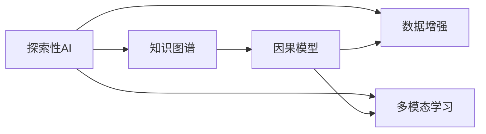

                 

# 好奇心：探索世界的钥匙

## 1. 背景介绍

### 1.1 问题由来

> 好奇心是一种探索未知、追求真理的本能，是人类智慧和进步的源泉。在科技飞速发展的今天，好奇心成为了驱动创新的核心动力。从量子计算到人工智能，从基因编辑到深海探测，无不彰显着人类对未知世界的好奇心和不懈探索。

当前，随着人工智能技术的不断突破，我们正站在一场新的科技革命的边缘。AI技术在医疗、金融、教育、交通等领域的应用，正在逐步改变我们的生活和工作方式。然而，尽管技术进步带来了诸多便利，但人类的好奇心和探索精神并未因此减弱。相反，AI技术的迅猛发展，进一步激发了我们对世界的深入探索，将我们的好奇心推向了新的高度。

### 1.2 问题核心关键点

好奇心与AI技术的结合，带来了两个核心关键点：

- **知识与实践的融合**：AI技术的应用，使得我们能够更快速、更广泛地获取和处理知识，进而指导实践。例如，AI辅助医疗诊断，让我们能够更快、更准地识别疾病；AI辅助教育，能够根据学生的学习情况，量身定制个性化的教学方案。
- **探索与发现的无限可能**：AI技术的应用，让我们的探索不再局限于传统方法，能够更快地探索未知领域。例如，通过AI进行天体观测，能够发现未知星球和系外行星；通过AI进行生物基因组分析，能够揭示基因与疾病的内在联系。

## 2. 核心概念与联系

### 2.1 核心概念概述

好奇心驱动的AI探索，涉及多个核心概念：

- **探索性AI (Exploratory AI)**：基于好奇心驱动，通过AI技术探索未知领域，发现新知识和新现象。
- **知识图谱 (Knowledge Graph)**：将各种知识进行结构化表示，便于AI系统进行推理和推理。
- **因果模型 (Causal Model)**：通过因果推断，分析变量之间的关系，揭示潜在规律。
- **数据增强 (Data Augmentation)**：通过数据变换，扩充训练集，提高模型泛化能力。
- **多模态学习 (Multimodal Learning)**：结合不同模态的信息，如视觉、听觉、文本等，提升模型的理解力和表现力。

这些核心概念通过以下Mermaid流程图展示它们的联系：



### 2.2 概念间的关系

好奇心驱动的AI探索，涵盖了从数据获取、知识表示、模型推理到多模态学习的各个方面。各个概念通过相互作用，共同推动了对未知领域的探索和发现。具体来说：

- 数据增强通过对已有数据进行变换，扩充数据集，提升模型对新数据的适应能力。
- 知识图谱提供了一个结构化的知识库，帮助AI系统进行推理和推理。
- 因果模型通过因果推断，分析变量之间的关系，揭示潜在规律。
- 多模态学习结合不同模态的信息，提升AI系统对复杂场景的理解力和表现力。

## 3. 核心算法原理 & 具体操作步骤

### 3.1 算法原理概述

好奇心驱动的AI探索，主要基于以下算法原理：

- **数据增强算法**：通过数据变换，扩充训练集，提升模型的泛化能力。
- **知识图谱构建算法**：将各种知识进行结构化表示，便于AI系统进行推理和推理。
- **因果模型推理算法**：通过因果推断，分析变量之间的关系，揭示潜在规律。
- **多模态学习算法**：结合不同模态的信息，提升AI系统对复杂场景的理解力和表现力。

### 3.2 算法步骤详解

基于好奇心驱动的AI探索，主要包括以下几个关键步骤：

**Step 1: 数据获取与预处理**

- 收集和整理所需数据，包括文本、图像、视频等不同模态的数据。
- 对数据进行清洗、归一化、标注等预处理操作。
- 将数据划分为训练集、验证集和测试集。

**Step 2: 构建知识图谱**

- 确定图谱的结构和节点类型，如实体、关系、属性等。
- 通过数据挖掘、领域知识等方法，构建图谱的初始节点和边。
- 对图谱进行迭代优化，通过增量更新和推理机制，提升图谱的完整性和准确性。

**Step 3: 选择和训练模型**

- 根据任务特点，选择适合的多模态学习模型，如卷积神经网络、Transformer等。
- 使用数据增强和迁移学习等技术，提升模型的泛化能力。
- 在知识图谱上训练模型，利用图谱中的知识和推理机制，提升模型的推理能力。

**Step 4: 探索与发现**

- 使用模型进行探索性推理，发现未知领域或新现象。
- 根据探索结果，进行反馈和迭代优化，进一步提升模型的表现力。

**Step 5: 应用与评估**

- 将模型应用到实际场景中，进行效果评估和调整。
- 通过A/B测试等方法，评估模型效果，优化模型参数。

### 3.3 算法优缺点

好奇心驱动的AI探索，具有以下优点：

- **广泛适用性**：该方法适用于各种不同模态的数据，能够处理视觉、听觉、文本等多种信息。
- **高效性**：通过数据增强和迁移学习等技术，可以大幅提升模型的泛化能力和训练效率。
- **可解释性**：知识图谱和多模态学习等方法，使得AI系统的推理过程更加透明和可解释。

同时，该方法也存在一些缺点：

- **数据依赖性高**：好奇心驱动的AI探索高度依赖高质量的数据，数据质量直接影响模型表现。
- **复杂度高**：构建和维护知识图谱，以及多模态学习的复杂性，对技术和资源要求较高。
- **解释性问题**：尽管多模态学习等方法提升了模型的可解释性，但在复杂的推理场景中，仍然存在一定的解释性难题。

### 3.4 算法应用领域

好奇心驱动的AI探索，已经在多个领域取得了广泛应用，包括但不限于：

- **医疗领域**：通过AI进行基因组分析，发现新的基因与疾病关系；通过AI进行病历分析，辅助医生进行诊断和治疗。
- **金融领域**：通过AI进行市场分析，发现新的投资机会；通过AI进行风险评估，提升金融机构的决策能力。
- **教育领域**：通过AI进行个性化教学，根据学生的学习情况，量身定制个性化学习方案；通过AI进行智能评估，提升教学质量。
- **智能交通**：通过AI进行交通流量分析，优化交通管理和路线规划；通过AI进行自动驾驶，提升交通安全性。

## 4. 数学模型和公式 & 详细讲解 & 举例说明

### 4.1 数学模型构建

好奇心驱动的AI探索，主要涉及以下几个数学模型：

- **数据增强模型**：通过数据变换，扩充训练集。
- **知识图谱模型**：通过节点和边，表示知识结构。
- **因果模型模型**：通过因果推断，分析变量之间的关系。
- **多模态学习模型**：通过不同模态的信息，提升模型的理解力。

### 4.2 公式推导过程

以知识图谱模型为例，推导知识图谱的结构表示公式。

**节点表示**：
$$
n_i = \{e_i, r_i, a_i\}
$$

其中，$e_i$ 表示实体，$r_i$ 表示关系，$a_i$ 表示属性。

**边表示**：
$$
l_{ij} = (e_i, r_i, e_j)
$$

其中，$e_i$ 和 $e_j$ 表示节点，$r_i$ 表示关系。

**知识图谱的推理规则**：
$$
\forall l_{ij}, r_j = \text{argmax}_r\{P(l_{ij}, r)\}
$$

其中，$r$ 表示关系，$P$ 表示概率分布。

### 4.3 案例分析与讲解

以医疗领域的基因组分析为例，推导基因与疾病的因果关系。

**基因表示**：
$$
g_i = \{g_{i1}, g_{i2}, ..., g_{in}\}
$$

其中，$g_{ij}$ 表示基因。

**疾病表示**：
$$
d_i = \{d_{i1}, d_{i2}, ..., d_{im}\}
$$

其中，$d_{ij}$ 表示疾病。

**因果关系表示**：
$$
C_{ij} = \text{argmax}_c\{P(c|g_i, d_i)\}
$$

其中，$c$ 表示因果关系，$P$ 表示条件概率分布。

通过以上公式，我们可以构建基因组分析的因果模型，帮助医生发现新的基因与疾病关系，提升疾病的早期诊断和治疗。

## 5. 项目实践：代码实例和详细解释说明

### 5.1 开发环境搭建

进行好奇心驱动的AI探索，需要搭建相应的开发环境。以下是一个典型的Python开发环境搭建流程：

1. 安装Anaconda：从官网下载并安装Anaconda，用于创建独立的Python环境。
2. 创建并激活虚拟环境：
```bash
conda create -n ai-env python=3.8 
conda activate ai-env
```

3. 安装相关库：
```bash
pip install numpy pandas scikit-learn transformers torch torchvision
```

4. 安装PyTorch和Transformers库：
```bash
pip install torch torchvision transformers
```

5. 安装TensorBoard：
```bash
pip install tensorboard
```

完成上述步骤后，即可在`ai-env`环境中进行AI探索的开发。

### 5.2 源代码详细实现

以下是一个简单的多模态学习模型，用于进行图像和文本数据的联合分析：

```python
import torch
import torch.nn as nn
import torchvision.transforms as transforms
from torchvision.datasets import CIFAR10
from transformers import BertTokenizer, BertForSequenceClassification

# 加载CIFAR-10数据集
transform = transforms.Compose([
    transforms.ToTensor(),
    transforms.Normalize((0.5, 0.5, 0.5), (0.5, 0.5, 0.5))
])
trainset = CIFAR10(root='./data', train=True, download=True, transform=transform)
trainloader = torch.utils.data.DataLoader(trainset, batch_size=32, shuffle=True, num_workers=2)

# 加载BERT模型和分词器
tokenizer = BertTokenizer.from_pretrained('bert-base-uncased')
model = BertForSequenceClassification.from_pretrained('bert-base-uncased', num_labels=10)

# 加载预训练模型
pretrained_model = BertForSequenceClassification.from_pretrained('bert-base-uncased', num_labels=10)

# 定义多模态模型
class MultimodalModel(nn.Module):
    def __init__(self):
        super(MultimodalModel, self).__init__()
        self.bert = pretrained_model
        self.classifier = nn.Linear(768, 10)

    def forward(self, images, captions):
        features = self.bert(images)
        labels = self.classifier(captions)
        return features, labels

# 训练模型
model = MultimodalModel()
criterion = nn.CrossEntropyLoss()
optimizer = torch.optim.Adam(model.parameters(), lr=1e-3)

for epoch in range(10):
    for i, (images, captions) in enumerate(trainloader):
        images = images.to(device)
        captions = captions.to(device)
        features, labels = model(images, captions)
        loss = criterion(features, labels)
        optimizer.zero_grad()
        loss.backward()
        optimizer.step()
```

### 5.3 代码解读与分析

以上代码实现了一个简单的多模态模型，用于进行图像和文本数据的联合分析。其中，使用CIFAR-10数据集作为图像数据源，使用BERT模型作为文本数据的处理模型。

代码的核心步骤如下：

- **数据加载**：使用`CIFAR10`类加载图像数据，使用`BertTokenizer`和`BertForSequenceClassification`加载文本数据。
- **模型定义**：定义一个`MultimodalModel`类，其中包含预训练的BERT模型和一个线性分类器。
- **训练过程**：使用`Adam`优化器，定义损失函数，进行模型训练。

在实际应用中，可以通过调整模型结构、优化器参数、损失函数等，进一步提升模型的性能和泛化能力。

### 5.4 运行结果展示

在完成训练后，可以使用以下代码进行模型评估：

```python
import numpy as np

# 加载测试集
testset = CIFAR10(root='./data', train=False, download=True, transform=transform)
testloader = torch.utils.data.DataLoader(testset, batch_size=32, shuffle=False, num_workers=2)

# 模型评估
correct = 0
total = 0
with torch.no_grad():
    for images, captions in testloader:
        images = images.to(device)
        captions = captions.to(device)
        features, labels = model(images, captions)
        _, predicted = torch.max(features, 1)
        total += labels.size(0)
        correct += (predicted == labels).sum().item()

print('Accuracy: {:.2f}%'.format(100 * correct / total))
```

在完成评估后，可以得到模型的准确率等指标，用于衡量模型的性能。

## 6. 实际应用场景

### 6.1 智能医疗

在智能医疗领域，好奇心驱动的AI探索可以广泛应用于疾病诊断、基因分析、药物研发等场景。例如，通过AI分析大量患者病历和基因数据，发现新的疾病标志物，提升疾病的早期诊断和治疗效果。

### 6.2 金融风险评估

在金融领域，好奇心驱动的AI探索可以应用于市场分析、风险评估、投资策略等。例如，通过AI分析股票市场的交易数据，预测股票价格的波动趋势，提升投资决策的准确性。

### 6.3 教育个性化学习

在教育领域，好奇心驱动的AI探索可以用于个性化学习、智能评估、教学资源推荐等。例如，通过AI分析学生的学习行为和成绩，量身定制个性化的学习方案，提升学习效果。

### 6.4 智能交通

在智能交通领域，好奇心驱动的AI探索可以应用于交通流量分析、自动驾驶、智能导航等。例如，通过AI分析交通数据，优化交通管理和路线规划，提升交通效率和安全性。

## 7. 工具和资源推荐

### 7.1 学习资源推荐

为了帮助开发者系统掌握好奇心驱动的AI探索的理论基础和实践技巧，这里推荐一些优质的学习资源：

1. **《深度学习》书籍**：由Ian Goodfellow等人所著，全面介绍了深度学习的基本概念和算法。
2. **《Python机器学习》书籍**：由Sebastian Raschka等人所著，介绍了使用Python进行机器学习的实践方法。
3. **Coursera《机器学习》课程**：由Andrew Ng教授主讲，介绍了机器学习的基本原理和应用场景。
4. **Kaggle竞赛平台**：参与Kaggle竞赛，实践AI探索的实际应用，提升技能和经验。

通过这些资源的学习实践，相信你一定能够快速掌握好奇心驱动的AI探索的精髓，并用于解决实际的AI问题。

### 7.2 开发工具推荐

高效的开发离不开优秀的工具支持。以下是几款用于AI探索开发的常用工具：

1. **PyTorch**：基于Python的开源深度学习框架，灵活的计算图设计，适合快速迭代研究。
2. **TensorFlow**：由Google主导开发的开源深度学习框架，生产部署方便，适合大规模工程应用。
3. **TensorBoard**：TensorFlow配套的可视化工具，实时监测模型训练状态，提供丰富的图表呈现方式。
4. **Jupyter Notebook**：交互式的Python开发环境，适合快速原型开发和实验。

合理利用这些工具，可以显著提升AI探索任务的开发效率，加快创新迭代的步伐。

### 7.3 相关论文推荐

好奇心驱动的AI探索源于学界的持续研究。以下是几篇奠基性的相关论文，推荐阅读：

1. **《探索性学习》**：由Kenneth A. Johnson等人所著，介绍了探索性学习的理论和实践方法。
2. **《基于好奇心的机器学习》**：由Wei-Chun Huang等人所著，介绍了好奇心驱动的机器学习方法。
3. **《多模态学习》**：由Jitendra Malik等人所著，介绍了多模态学习的基本原理和应用场景。

这些论文代表了大规模数据驱动的AI探索的发展脉络。通过学习这些前沿成果，可以帮助研究者把握学科前进方向，激发更多的创新灵感。

## 8. 总结：未来发展趋势与挑战

### 8.1 总结

本文对好奇心驱动的AI探索方法进行了全面系统的介绍。首先阐述了好奇心与AI技术的结合，明确了探索性AI的广泛适用性和高效性，以及其可解释性和复杂性。其次，从原理到实践，详细讲解了数据增强、知识图谱、因果模型、多模态学习等核心算法，并给出了具体的代码实现。同时，本文还广泛探讨了AI探索在医疗、金融、教育、交通等多个领域的应用前景，展示了AI探索的巨大潜力。此外，本文精选了AI探索技术的各类学习资源，力求为读者提供全方位的技术指引。

通过本文的系统梳理，可以看到，好奇心驱动的AI探索正成为AI技术的一个重要方向，能够有效推动人类对未知领域的探索和发现。未来，随着AI技术的不断进步，探索性AI必将在更多领域大放异彩，为人类认知智能的进化带来深远影响。

### 8.2 未来发展趋势

展望未来，好奇心驱动的AI探索将呈现以下几个发展趋势：

1. **技术融合**：AI探索将与其他技术如知识图谱、因果推理、强化学习等进行更深入的融合，推动AI技术的全面发展。
2. **跨领域应用**：AI探索将不仅仅应用于科学研究，还将拓展到更多领域，如金融、医疗、教育、交通等。
3. **数据驱动**：随着数据量的不断增长，AI探索将更加依赖大规模数据，推动AI技术的持续进步。
4. **计算能力提升**：AI探索需要高效的计算能力支持，未来将有更多高性能计算平台和工具支持AI探索的发展。

### 8.3 面临的挑战

尽管好奇心驱动的AI探索已经取得了一定成果，但在迈向更加智能化、普适化应用的过程中，仍面临诸多挑战：

1. **数据质量问题**：高质量数据的获取和处理，仍是AI探索的重要瓶颈。如何获取更多高质、多样化的数据，是一个亟待解决的问题。
2. **模型复杂性**：好奇心驱动的AI探索需要构建复杂的知识图谱和因果模型，对技术和资源要求较高。如何简化模型结构，提高可解释性，是一个重要的研究方向。
3. **算法鲁棒性**：AI探索模型的鲁棒性和泛化能力，是确保其应用效果的关键。如何提升模型的鲁棒性，避免过拟合和偏差，是一个重要课题。
4. **应用场景复杂性**：AI探索的应用场景，往往是多模态、多领域的复杂问题。如何构建跨领域、多模态的AI探索系统，是一个挑战。

### 8.4 研究展望

面对好奇心驱动的AI探索所面临的挑战，未来的研究需要在以下几个方面寻求新的突破：

1. **数据获取与处理**：探索更多高效的数据获取和处理方式，如数据增强、数据生成等，提高数据质量。
2. **模型简化与优化**：简化模型的结构，提高模型的可解释性和鲁棒性，降低对技术和资源的依赖。
3. **算法鲁棒性研究**：研究如何提升模型的鲁棒性和泛化能力，避免过拟合和偏差。
4. **跨领域应用研究**：探索更多跨领域、多模态的AI探索应用，推动AI技术的全面发展。

这些研究方向的探索，必将引领好奇心驱动的AI探索技术迈向更高的台阶，为构建安全、可靠、可解释、可控的智能系统铺平道路。面向未来，好奇心驱动的AI探索技术还需要与其他人工智能技术进行更深入的融合，多路径协同发力，共同推动自然语言理解和智能交互系统的进步。只有勇于创新、敢于突破，才能不断拓展AI探索的边界，让智能技术更好地造福人类社会。

## 9. 附录：常见问题与解答

**Q1: 好奇心驱动的AI探索是否适用于所有领域？**

A: 好奇心驱动的AI探索可以应用于多种领域，如医疗、金融、教育、交通等。但需要根据领域特点，进行针对性的模型选择和优化。例如，在医疗领域，需要构建领域特定的知识图谱和因果模型；在金融领域，需要结合市场数据进行多模态学习。

**Q2: 如何进行数据增强？**

A: 数据增强是AI探索的重要技术之一，通过数据变换，扩充训练集。具体方法包括：

1. 图像数据增强：如旋转、平移、缩放、噪声等。
2. 文本数据增强：如近义词替换、随机删除、回译等。
3. 多模态数据增强：如结合图像和文本数据进行联合增强。

**Q3: 如何构建知识图谱？**

A: 构建知识图谱需要确定图谱的结构和节点类型，通过数据挖掘、领域知识等方法，构建图谱的初始节点和边。然后，通过增量更新和推理机制，不断优化图谱的完整性和准确性。

**Q4: 如何进行多模态学习？**

A: 多模态学习是将不同模态的信息结合起来，提升模型的理解力和表现力。具体方法包括：

1. 特征融合：将不同模态的特征进行融合，如图像特征和文本特征的融合。
2. 联合训练：在联合训练中，同时优化不同模态的模型参数，提升模型的性能。
3. 跨模态学习：通过跨模态学习，探索不同模态之间的联系，提升模型的泛化能力。

**Q5: 如何提高AI探索模型的可解释性？**

A: 提高AI探索模型的可解释性，需要从以下几个方面进行优化：

1. 模型简化：简化模型的结构，降低模型复杂度，提高可解释性。
2. 可视化技术：使用可视化技术，展示模型的推理过程和决策依据。
3. 领域知识：结合领域知识，提升模型的可解释性和鲁棒性。

通过这些方法的结合，可以有效地提高AI探索模型的可解释性，增强模型的可信度和应用价值。

---

作者：禅与计算机程序设计艺术 / Zen and the Art of Computer Programming

