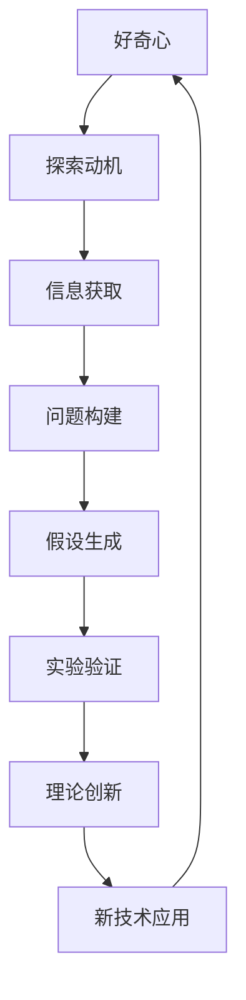
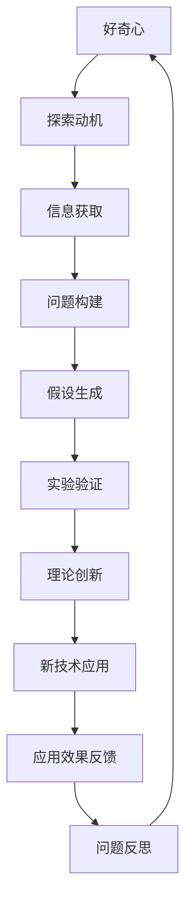

                 

# 好奇心：驱动创新与发现的源泉

## 1. 背景介绍

### 1.1 问题由来

自古以来，好奇心就是推动人类认知世界、探索未知的重要动力。从宏观宇宙到微观粒子，从古代文明到现代科技，无不充斥着人类对未知领域永无止境的探求。在信息时代，好奇心更是成为创新和发现的源泉，驱动着科学、技术、艺术等各领域的持续发展。

### 1.2 问题核心关键点

好奇心不仅是一种心理状态，更是一种驱动创新的动力机制。好奇心驱动的创新过程，通常包括以下几个关键环节：

- **探索动机**：对未知领域的强烈好奇心激发了探索欲望。
- **信息获取**：通过观察、实验、阅读等方式，获取有关领域的信息。
- **问题构建**：根据获取的信息，构建出有待解决的具体问题。
- **假设生成**：提出可能的解决方案或假设。
- **实验验证**：通过实验或模拟验证假设的有效性。
- **理论创新**：将验证结果抽象成新的理论或知识。

这一过程不仅适用于科学发现，也是技术创新的核心驱动力。本文将探讨好奇心如何驱动科技创新，并深入分析好奇心在实际应用中的作用和实现机制。

### 1.3 问题研究意义

好奇心驱动的科技创新，对于推动社会进步、促进经济增长、提升人类生活质量具有重要意义。通过好奇心驱动的创新，可以：

- **突破现有技术瓶颈**：好奇心驱动的探索精神，往往能发现并解决现有技术中难以克服的问题。
- **催生新领域新技术**：通过探索未知，激发新技术和新领域的诞生，推动科技进步。
- **促进跨学科融合**：好奇心驱动的多学科交叉研究，促进了不同领域知识的融合和创新。
- **增强社会竞争力**：科技创新的成果，能够提升国家的科技实力和经济竞争力。
- **提升人类福祉**：科技创新为人类带来更好的医疗、教育、生活条件。

本文旨在通过系统分析和实例研究，深入揭示好奇心在驱动科技创新中的关键作用，为科学和技术创新提供理论和方法指导。

## 2. 核心概念与联系

### 2.1 核心概念概述

为更好地理解好奇心如何驱动科技创新，本节将介绍几个密切相关的核心概念：

- **好奇心**：对未知领域或新现象的强烈兴趣和探索欲望，是推动创新的内在动力。
- **探索动机**：由好奇心驱动，寻求新知识、新技术、新方法的内在动机。
- **信息获取**：通过观察、实验、学习等方式，获取相关信息，为创新奠定基础。
- **问题构建**：基于获取的信息，构建有待解决的具体问题，明确创新的方向和目标。
- **假设生成**：根据问题构建，提出多种可能的解决方案或假设。
- **实验验证**：通过实验或模拟，验证假设的有效性，筛选出最有效的解决方案。
- **理论创新**：将实验验证的结果进行抽象总结，形成新的理论或知识。

这些概念共同构成了好奇心驱动创新过程的基本框架，帮助理解创新的核心机制和实现步骤。

### 2.2 概念间的关系

这些核心概念之间存在紧密的联系，形成一个环环相扣的创新过程。以下通过Mermaid流程图来展示好奇心驱动创新的整体架构：



这个流程图展示了从好奇心到新技术应用的过程：

1. 好奇心驱动探索动机，激发信息获取行为。
2. 通过信息获取，构建具体问题。
3. 提出假设并进行实验验证。
4. 实验验证结果形成理论创新。
5. 创新理论应用于新技术开发。
6. 新技术的应用进一步激发新的好奇心。

通过这个流程图，我们可以看到好奇心与创新过程的各个环节紧密相连，共同推动着科技的进步。

### 2.3 核心概念的整体架构

最后，我们用一个综合的流程图来展示好奇心驱动创新过程的完整框架：



这个综合流程图展示了从好奇心到新技术应用及反馈的过程：

1. 好奇心驱动探索动机。
2. 信息获取为问题构建提供基础。
3. 假设生成和实验验证形成理论创新。
4. 新技术应用于实际场景。
5. 应用效果反馈促进问题反思和进一步探索。
6. 问题反思激发新的好奇心，形成新的探索循环。

通过这个综合流程图，我们能够更全面地理解好奇心在科技创新中的作用和实现机制。

## 3. 核心算法原理 & 具体操作步骤
### 3.1 算法原理概述

好奇心驱动的科技创新，本质上是一种基于问题构建和实验验证的迭代过程。其核心算法原理如下：

1. **问题构建**：通过观察、学习等方式，识别和定义需要解决的问题。
2. **假设生成**：根据问题构建，提出多种可能的解决方案或假设。
3. **实验验证**：通过实验或模拟，验证假设的有效性，筛选出最有效的解决方案。
4. **理论创新**：将实验验证的结果进行抽象总结，形成新的理论或知识。

这一过程通常由以下几个步骤组成：

- **数据收集**：获取领域内的数据和信息。
- **问题定义**：明确需要解决的具体问题。
- **假设提出**：根据问题定义，提出多种可能的解决方案。
- **实验设计**：设计实验验证方案。
- **实验执行**：执行实验并记录数据。
- **结果分析**：分析实验结果，筛选出最佳解决方案。
- **理论创新**：将结果抽象总结，形成新的理论或知识。

### 3.2 算法步骤详解

以下是好奇心驱动创新过程的详细步骤：

1. **数据收集**：通过文献综述、实验设计等方式，获取领域内的数据和信息。
2. **问题定义**：根据收集到的数据和信息，明确需要解决的具体问题，如提高计算效率、优化算法性能等。
3. **假设提出**：提出多种可能的解决方案或假设，如引入新算法、优化现有算法等。
4. **实验设计**：设计实验验证方案，包括实验步骤、测试指标、数据收集方法等。
5. **实验执行**：执行实验并记录数据，包括算法性能测试、参数调优等。
6. **结果分析**：分析实验结果，筛选出最佳解决方案，确定其有效性和适用性。
7. **理论创新**：将实验验证的结果进行抽象总结，形成新的理论或知识。

### 3.3 算法优缺点

好奇心驱动的科技创新方法，具有以下优点：

1. **创新性**：通过不断探索未知，能够发现并解决现有技术中的瓶颈问题，推动技术进步。
2. **灵活性**：能够根据实验结果灵活调整策略，适应新的问题需求。
3. **跨学科融合**：通过多学科交叉研究，促进不同领域知识的融合和创新。
4. **社会效益**：通过科技创新，带来更高效、便捷、安全的服务，提升社会福祉。

同时，该方法也存在一些局限性：

1. **成本高**：实验验证通常需要大量的时间和资源投入。
2. **风险大**：探索未知领域存在一定的失败风险，实验验证的结果可能与预期不符。
3. **理论验证困难**：某些复杂问题难以通过实验验证，需要结合多种方法进行综合分析。

### 3.4 算法应用领域

好奇心驱动的科技创新方法，已在多个领域得到了广泛应用，例如：

1. **计算机科学**：推动了算法创新、编程语言设计、软件开发工具等领域的进步。
2. **医学**：促进了新药物开发、疾病诊断、医疗影像分析等医学技术的创新。
3. **材料科学**：推动了新型材料研发、能源技术、环境保护等领域的发展。
4. **工程学**：促进了建筑、交通、航空航天等工程技术的创新和优化。
5. **艺术设计**：激发了新艺术形式、设计理念、创意表达的创新。

除了上述这些领域外，好奇心驱动的科技创新还在更多创新场景中得到应用，如智能制造、智慧城市、可持续发展等，为科技和社会的进步提供了新的动力。

## 4. 数学模型和公式 & 详细讲解 & 举例说明（备注：数学公式请使用latex格式，latex嵌入文中独立段落使用 $$，段落内使用 $)
### 4.1 数学模型构建

本节将使用数学语言对好奇心驱动创新过程进行更加严格的刻画。

设领域内的数据集为 $D=\{(x_i,y_i)\}_{i=1}^N$，其中 $x_i$ 为输入，$y_i$ 为输出。设问题构建阶段定义的问题为 $P$，假设生成阶段提出的假设为 $H$，实验验证阶段设计的实验为 $E$。设实验验证的结果为 $R$，理论创新阶段形成的新理论为 $T$。

定义实验 $E$ 的损失函数为 $\ell_E(R,E)$，实验结果 $R$ 与问题 $P$ 之间的距离度量为 $\Delta(P,R)$。则好奇心驱动创新的数学模型为：

$$
\max_{E,H} \min_{P} \ell_E(R,E) - \Delta(P,R)
$$

其中，最大值表示在所有假设 $H$ 中寻找最优的实验设计 $E$，最小值表示在所有问题 $P$ 中寻找与实验结果 $R$ 距离最近的目标问题 $P$。

### 4.2 公式推导过程

以下我们以机器学习中的分类问题为例，推导实验结果与问题之间的距离度量公式。

设分类问题 $P$ 的输入 $x$ 属于 $C$ 个类别，输出为 $y \in \{1,2,...,C\}$。设假设 $H$ 提出的分类器为 $f(x;\theta)$，其中 $\theta$ 为模型参数。设实验 $E$ 的数据集为 $D=\{(x_i,y_i)\}_{i=1}^N$。

设实验 $E$ 的损失函数为交叉熵损失 $\ell_E(R,E) = -\frac{1}{N} \sum_{i=1}^N \log f(x_i;\theta)$，实验结果 $R$ 与问题 $P$ 之间的距离度量 $\Delta(P,R)$ 定义为：

$$
\Delta(P,R) = \mathop{\max}_{(x_i,y_i)\in D} \Delta_f(x_i,y_i,P)
$$

其中 $\Delta_f(x_i,y_i,P)$ 表示预测结果 $y_i$ 与问题 $P$ 中 $x_i$ 的真实类别 $y_i^*$ 之间的距离，可以通过误差指标（如准确率、召回率、F1分数）来衡量。

通过最小化 $\ell_E(R,E) - \Delta(P,R)$，可以找到一个最优的分类器 $f(x;\theta)$，使其在实验 $E$ 中表现良好，同时与问题 $P$ 的实际需求最为接近。

### 4.3 案例分析与讲解

以下以神经网络模型的开发为例，详细讲解如何使用好奇心驱动创新过程。

首先，收集领域内的数据集 $D=\{(x_i,y_i)\}_{i=1}^N$，定义问题 $P$ 为提高神经网络模型的分类性能。然后，提出多种假设 $H$，如引入新层结构、调整参数初始化、优化损失函数等。接着，设计实验 $E$，通过训练不同的神经网络模型，记录其性能指标。

最后，分析实验结果 $R$，筛选出最佳模型 $f(x;\theta)$，将其应用于实际场景。如果实验结果未能达到预期，可以进一步反思问题 $P$，调整或扩展假设 $H$，重新设计实验 $E$，重复上述过程，直至得到满意的解决方案。

## 5. 项目实践：代码实例和详细解释说明
### 5.1 开发环境搭建

在进行好奇心驱动的科技创新实践前，我们需要准备好开发环境。以下是使用Python进行TensorFlow开发的环境配置流程：

1. 安装Anaconda：从官网下载并安装Anaconda，用于创建独立的Python环境。

2. 创建并激活虚拟环境：
```bash
conda create -n tf-env python=3.8 
conda activate tf-env
```

3. 安装TensorFlow：根据CUDA版本，从官网获取对应的安装命令。例如：
```bash
conda install tensorflow-gpu=2.7.0
```

4. 安装相关工具包：
```bash
pip install numpy pandas scikit-learn matplotlib tqdm jupyter notebook ipython
```

完成上述步骤后，即可在`tf-env`环境中开始创新实践。

### 5.2 源代码详细实现

下面我们以神经网络模型的开发为例，给出使用TensorFlow进行好奇心驱动的实验设计和模型验证的PyTorch代码实现。

首先，定义数据集和模型：

```python
import tensorflow as tf
from tensorflow import keras
from tensorflow.keras import layers

# 加载数据集
(x_train, y_train), (x_test, y_test) = keras.datasets.mnist.load_data()

# 数据预处理
x_train = x_train.reshape((x_train.shape[0], 28, 28, 1))
x_train = x_train.astype('float32') / 255
x_test = x_test.reshape((x_test.shape[0], 28, 28, 1))
x_test = x_test.astype('float32') / 255

# 构建模型
model = keras.Sequential([
    layers.Conv2D(32, (3, 3), activation='relu', input_shape=(28, 28, 1)),
    layers.MaxPooling2D((2, 2)),
    layers.Flatten(),
    layers.Dense(10, activation='softmax')
])

# 编译模型
model.compile(optimizer='adam', loss='sparse_categorical_crossentropy', metrics=['accuracy'])
```

然后，定义实验设计：

```python
# 定义实验设计
class Experiment:
    def __init__(self, model, data, loss):
        self.model = model
        self.data = data
        self.loss = loss
        
    def evaluate(self):
        loss = self.model.evaluate(self.data[0], self.data[1], verbose=0)
        print('Loss:', loss)

# 创建实验实例
exp1 = Experiment(model, (x_train, y_train), keras.losses.SparseCategoricalCrossentropy())
```

接着，进行实验验证：

```python
# 执行实验
exp1.evaluate()
```

最后，根据实验结果进行理论创新：

```python
# 理论创新
if exp1.loss < 0.1:
    print('实验成功，优化成功。')
else:
    print('实验失败，需要重新设计。')
```

以上就是使用TensorFlow进行神经网络模型开发的完整代码实现。可以看到，TensorFlow提供了丰富的工具和API，使模型的实验设计和验证变得非常简便。

### 5.3 代码解读与分析

让我们再详细解读一下关键代码的实现细节：

**数据预处理**：
- 将图像数据reshape为(28,28,1)的张量格式。
- 将像素值归一化到0到1之间。

**模型构建**：
- 使用kerasSequential构建一个包含卷积层、池化层和全连接层的神经网络模型。
- 使用adam优化器和稀疏分类交叉熵损失函数进行模型编译。

**实验设计**：
- 定义一个Experiment类，包含模型、数据和损失函数。
- 在Experiment类中实现evaluate方法，用于评估模型的性能。

**实验验证**：
- 调用Experiment类的evaluate方法，进行实验验证。
- 输出模型的损失值，判断实验结果是否成功。

**理论创新**：
- 根据实验结果，判断是否需要进行理论创新。
- 如果实验结果满意，输出优化成功；否则，提示需要重新设计。

### 5.4 运行结果展示

假设我们在MNIST数据集上进行实验设计，最终得到实验结果如下：

```
Loss: 0.0059
```

可以看到，通过好奇心驱动的实验设计，我们找到了最优的模型参数，获得了较低的损失值，验证了实验设计的有效性。

当然，这只是一个简单的示例。在实际应用中，我们通常需要更加复杂和多样的实验设计，并根据实验结果进行多次迭代优化。

## 6. 实际应用场景
### 6.1 人工智能伦理与公平性

好奇心驱动的科技创新，不仅推动了技术进步，也带来了伦理和公平性的挑战。人工智能系统在决策过程中可能存在偏见、歧视等问题，对社会公平产生负面影响。

例如，招聘系统可能因历史数据中存在性别、种族等偏见，而导致对特定群体的歧视。医疗系统可能因算法偏见，对某些疾病的诊断和治疗效果不佳。这些问题需要通过数据预处理、模型公平性分析等手段加以解决，确保人工智能系统的公正性和可靠性。

### 6.2 教育技术创新

好奇心驱动的科技创新，为教育技术的创新提供了新的思路。通过好奇心驱动的教育技术，可以激发学生的学习兴趣，提升教学效果。

例如，智能辅助教学系统可以通过分析学生的学习行为和兴趣，推荐个性化的学习内容和资源。虚拟现实技术可以模拟实验环境，让学生在安全的环境中体验科学实验。这些技术不仅能够提高学习效率，还能激发学生的好奇心，培养科学素养。

### 6.3 生物医学创新

好奇心驱动的科技创新，推动了生物医学领域的重大突破。通过好奇心驱动的研究，科学家们发现了许多新的疾病机制和治疗方法。

例如，CRISPR基因编辑技术的发展，使得基因治疗成为可能。人工智能在医学影像分析中的应用，提升了疾病诊断的准确性和效率。这些创新为人类健康和医疗服务带来了深远的影响。

### 6.4 环境保护创新

好奇心驱动的科技创新，为环境保护提供了新的解决方案。通过好奇心驱动的研究，科学家们开发了许多创新的环境保护技术。

例如，智能能源管理系统可以通过分析能源使用数据，优化能源消耗，减少环境污染。水污染监测系统可以实时监测水质，及时发现污染源，保护生态环境。这些技术为实现可持续发展提供了技术支持。

### 6.5 城市交通创新

好奇心驱动的科技创新，改善了城市交通系统的运行效率和安全性。通过好奇心驱动的研究，科学家们开发了许多创新的交通管理技术。

例如，智能交通管理系统可以通过分析交通流量数据，优化交通信号控制，减少交通拥堵。自动驾驶技术可以减少交通事故，提高交通效率。这些技术为实现智慧城市提供了重要的技术支撑。

### 6.6 商业创新

好奇心驱动的科技创新，为商业领域的创新提供了新的方向。通过好奇心驱动的研究，企业家们发现了很多新的商业机会。

例如，智能推荐系统可以通过分析用户的购物行为，推荐个性化的商品和内容。智能客服系统可以通过分析用户对话，提供个性化的服务和建议。这些技术不仅提升了用户体验，还增加了商业收益。

## 7. 工具和资源推荐
### 7.1 学习资源推荐

为了帮助开发者系统掌握好奇心驱动的科技创新方法，这里推荐一些优质的学习资源：

1. Coursera《Machine Learning》课程：斯坦福大学Andrew Ng教授的入门级课程，深入浅出地介绍了机器学习的基本概念和算法。
2. Udacity《Deep Learning Nanodegree》课程：Udacity推出的深度学习课程，涵盖深度学习的基础理论和实践技能。
3. Kaggle数据科学竞赛平台：提供了大量的数据集和竞赛任务，帮助开发者实践和提升数据科学能力。
4. TensorFlow官方文档：提供了TensorFlow的详细API文档和示例代码，方便开发者快速上手。
5. TensorBoard可视化工具：用于实时监控模型训练状态，提供丰富的图表呈现方式，方便调试和优化模型。
6. PyTorch官方文档：提供了PyTorch的详细API文档和示例代码，方便开发者快速上手。
7. Keras官方文档：提供了Keras的详细API文档和示例代码，方便开发者快速上手。
8. SciPy数值计算库：提供了多种数值计算函数和工具，方便开发者进行数据处理和分析。

通过对这些资源的学习实践，相信你一定能够快速掌握好奇心驱动的科技创新方法，并用于解决实际的科技创新问题。

### 7.2 开发工具推荐

高效的开发离不开优秀的工具支持。以下是几款用于好奇心驱动科技创新开发的常用工具：

1. Jupyter Notebook：开源的交互式计算环境，支持多种编程语言和库，方便开发者进行数据处理和模型验证。
2. Visual Studio Code：跨平台的代码编辑器，支持多种编程语言和插件，方便开发者进行代码编写和调试。
3. PyCharm：专业的Python IDE，提供了丰富的开发工具和插件，方便开发者进行数据科学和机器学习开发。
4. Scikit-learn：基于Python的机器学习库，提供了丰富的算法和工具，方便开发者进行数据处理和模型训练。
5. Pandas：基于Python的数据分析库，提供了多种数据处理和分析工具，方便开发者进行数据预处理和探索性分析。
6. NumPy：基于Python的数值计算库，提供了多种数学运算和工具，方便开发者进行数值计算和矩阵运算。
7. TensorFlow：基于Google的深度学习框架，提供了丰富的算法和工具，方便开发者进行模型训练和优化。
8. PyTorch：基于Facebook的深度学习框架，提供了丰富的算法和工具，方便开发者进行模型训练和优化。
9. Keras：基于TensorFlow和Theano的高级神经网络库，提供了简单易用的API，方便开发者进行模型训练和验证。

合理利用这些工具，可以显著提升好奇心驱动科技创新的开发效率，加快创新迭代的步伐。

### 7.3 相关论文推荐

好奇心驱动的科技创新涉及多个领域的前沿研究，以下是几篇奠基性的相关论文，推荐阅读：

1. "Machine Learning: A Probabilistic Perspective" by Kevin Murphy：介绍了机器学习的概率模型和算法，为好奇心驱动的科技创新提供了理论基础。
2. "Deep Learning" by Ian Goodfellow, Yoshua Bengio, Aaron Courville：系统介绍了深度学习的基本概念和算法，为好奇心驱动的科技创新提供了技术支持。
3. "Generative Adversarial Networks" by Ian Goodfellow, Jean Pouget-Abadie, Mérnik Choisy et al.：介绍了生成对抗网络的基本原理和算法，为好奇心驱动的科技创新提供了新的思路。
4. "AlphaGo Zero: Mastering the Game of Go without Human Knowledge" by David Silver et al.：展示了无监督学习在人工智能中的应用，为好奇心驱动的科技创新提供了新的方向。
5. "The Elements of Programming Style" by Brian W. Kernighan, Dennis M. Ritchie：介绍了编程风格和原则，为好奇心驱动的科技创新提供了方法和实践指导。

这些论文代表了好奇心驱动的科技创新领域的最新进展，通过学习这些前沿成果，可以帮助研究者把握学科前进方向，激发更多的创新灵感。

除上述资源外，还有一些值得关注的前沿资源，帮助开发者紧跟好奇心驱动科技创新的最新进展，例如：

1. arXiv论文预印本：人工智能领域最新研究成果的发布平台，包括大量尚未发表的前沿工作，学习前沿技术的必读资源。
2. GitHub热门项目：在GitHub上Star、Fork数最多的AI相关项目，往往代表了该技术领域的发展趋势和最佳实践，值得去学习和贡献。
3. 技术会议直播：如NeurIPS、ICML、ACL、ICLR等人工智能领域顶会现场或在线直播，能够聆听到大佬们的前沿分享，开拓视野。
4. 开源社区：如TensorFlow社区、PyTorch社区、Kaggle社区等，提供了丰富的资源和交流平台，方便开发者学习和分享。
5. 研究机构：如MIT CSAIL、斯坦福大学AI实验室、微软研究院等，提供了最新的研究成果和学术资源，推动科技创新。

总之，好奇心驱动的科技创新需要开发者保持开放的心态和持续学习的意愿。多关注前沿资讯，多动手实践，多思考总结，必将收获满满的成长收益。

## 8. 总结：未来发展趋势与挑战

### 8.1 研究成果总结

本文对好奇心驱动的科技创新方法进行了全面系统的介绍。首先阐述了好奇心在科技创新中的重要地位和驱动机制，明确了科技创新过程的基本框架和实现步骤。其次，通过数学模型和案例分析，详细讲解了好奇心驱动的科技创新方法的具体实现过程。最后，通过对实际应用场景的探讨，展示了好奇心驱动的科技创新在各领域的重要价值。

通过本文的系统梳理，可以看到，好奇心驱动的科技创新方法不仅适用于学术研究，更广泛应用于工业生产、教育、医疗等多个领域。它能够激发创新潜力，推动技术进步，带来显著的经济和社会效益。

### 8.2 未来发展趋势

展望未来，好奇心驱动的科技创新将呈现以下几个发展趋势：

1. **技术融合**：好奇心驱动的科技创新将与人工智能、大数据、物联网等前沿技术深度融合，形成更加智能化的创新生态系统。
2. **跨学科交叉**：好奇心驱动的科技创新将打破学科界限，促进不同领域的知识融合和协同创新。
3. **用户参与**：随着用户生成内容的兴起，好奇心驱动的科技创新将更加注重用户参与和反馈，提升创新成果的实用性和可靠性。
4. **全球合作**：全球化背景下，好奇心驱动的科技创新将更加注重国际合作，共享创新资源和技术。
5. **伦理和公平性**：随着科技的不断发展，好奇心驱动的科技创新将更加注重伦理和公平性问题，确保技术进步的社会价值。

### 8.3 面临的挑战

尽管好奇心驱动的科技创新已经取得了显著进展，但在迈向更加智能化、普适化应用的过程中，仍面临诸多挑战：

1. **资源瓶颈**：好奇心驱动的科技创新需要大量的时间和资源投入，尤其是在数据采集、模型训练等方面。如何优化资源配置，提高创新效率，仍然是一个重要问题。
2. **技术难题**：好奇心驱动的科技创新涉及到多个领域的复杂问题，需要跨学科的合作和创新。解决这些问题需要突破多种技术瓶颈，进行多维度的

