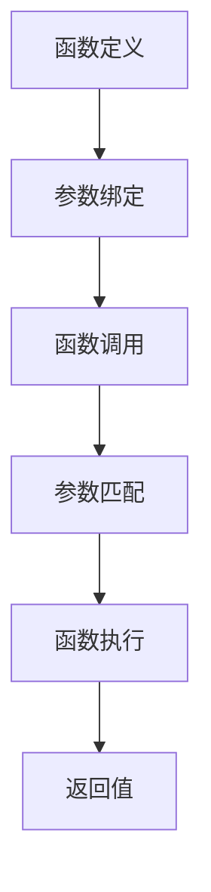

                 

# 如何使用 function_call 参数

> 关键词：函数调用,参数传递,Python,JavaScript,Java,Swift

## 1. 背景介绍

在编程语言中，函数是执行特定任务的基本单元。函数调用参数（function_call parameter）是指在函数调用时传递给函数的各种参数，包括位置参数、关键字参数、默认参数、可变长度参数等。正确使用 function_call 参数可以提高程序的可读性、可维护性和可扩展性。然而，在实际开发中，如何合理地选择和使用 function_call 参数，仍需慎重考虑。本文将详细阐述 function_call 参数的使用原理和操作步骤，帮助开发者更好地理解这一核心概念。

## 2. 核心概念与联系

### 2.1 核心概念概述

要深入理解 function_call 参数，首先需要理解以下几个核心概念：

- **函数调用**：通过调用函数执行一系列操作的过程。
- **位置参数**：按照参数位置顺序传递的参数。
- **关键字参数**：通过指定参数名来传递的参数。
- **默认参数**：定义时具有默认值的参数。
- **可变长度参数**：用于传递不定数量的参数。
- **参数绑定**：将函数调用参数与函数定义参数进行匹配。

这些概念通过函数调用这一核心操作紧密联系在一起，共同构成了 function_call 参数的使用基础。

### 2.2 核心概念之间的关系

以下通过 Mermaid 流程图展示 function_call 参数的基本流程：



这个流程图展示了函数调用和参数传递的基本过程：
1. 函数定义包含一系列参数。
2. 函数调用时，通过参数绑定将调用参数与定义参数进行匹配。
3. 匹配后，函数执行操作。
4. 函数执行完毕后，返回结果。

## 3. 核心算法原理 & 具体操作步骤

### 3.1 算法原理概述

function_call 参数的核心算法原理是通过参数绑定将调用参数与定义参数进行匹配，然后执行函数操作。在匹配过程中，位置参数和关键字参数依次进行绑定，默认参数和可变长度参数则根据需要灵活处理。

### 3.2 算法步骤详解

以下是 function_call 参数的具体操作步骤：

#### 3.2.1 参数绑定

参数绑定是 function_call 参数的关键步骤，具体过程如下：

1. **确定参数类型**：根据函数定义中的参数类型，确定调用参数的类型。
2. **进行匹配**：按照参数顺序或关键字进行匹配，将调用参数与定义参数进行绑定。
3. **处理默认值**：对于具有默认值的参数，根据调用参数是否提供，进行相应的处理。
4. **处理可变长度参数**：对于可变长度参数，根据调用参数的数量，进行相应的扩展。

#### 3.2.2 函数执行

参数绑定完成后，函数执行相应的操作，具体步骤如下：

1. **参数检查**：检查绑定后的参数是否符合函数定义的参数类型和数量。
2. **参数处理**：根据函数定义中的操作，对参数进行处理。
3. **返回结果**：根据函数定义的返回值类型，返回处理结果。

### 3.3 算法优缺点

#### 3.3.1 优点

1. **灵活性高**：通过参数绑定，可以灵活处理不同类型和数量的参数。
2. **可读性好**：通过关键字参数，使得函数调用参数更加清晰。
3. **可维护性高**：通过默认参数和可变长度参数，减少函数定义和调用时的冗余代码。

#### 3.3.2 缺点

1. **易出错**：参数绑定过程中，容易出现类型错误或绑定错误。
2. **可读性差**：过多使用可变长度参数，使得函数调用参数不够清晰。
3. **性能开销大**：过多使用默认参数和可变长度参数，会增加函数的运行时间。

### 3.4 算法应用领域

function_call 参数在各种编程语言中都有广泛应用，例如：

- **Python**：通过位置参数、关键字参数、默认参数和可变长度参数，支持灵活的函数调用。
- **JavaScript**：使用位置参数、关键字参数和可变长度参数，支持函数调用。
- **Java**：通过位置参数、关键字参数和可变长度参数，实现函数调用。
- **Swift**：通过位置参数、关键字参数和默认参数，实现函数调用。

这些语言通过 function_call 参数的灵活应用，提高了代码的可读性、可维护性和可扩展性。

## 4. 数学模型和公式 & 详细讲解 & 举例说明

### 4.1 数学模型构建

在函数调用中，参数绑定过程可以通过数学模型进行抽象，如下所示：

设函数 $f$ 的定义为 $f(a, b, c) = a + b + c$，调用参数为 $a=1, b=2, c=3$，则参数绑定过程如下：

1. **参数类型匹配**：
   - 位置参数：$a=1, b=2, c=3$
   - 类型匹配：$a$ 和 $b$ 均为整数，$c$ 也为整数。

2. **参数绑定**：
   - 绑定 $a$ 和 $b$ 到定义参数 $a$ 和 $b$
   - 绑定 $c$ 到定义参数 $c$

3. **处理默认值**：
   - 函数 $f$ 中没有默认参数，无需处理

4. **处理可变长度参数**：
   - 函数 $f$ 中没有可变长度参数，无需处理

### 4.2 公式推导过程

参数绑定过程可以抽象为如下公式：

$$
\text{绑定结果} = \{(x_1, p_1), (x_2, p_2), \ldots, (x_n, p_n)\}
$$

其中，$x_i$ 为调用参数，$p_i$ 为定义参数，$n$ 为参数数量。参数绑定过程的实现步骤如下：

1. **参数类型匹配**：
   - 判断 $x_i$ 和 $p_i$ 的类型是否匹配
2. **参数绑定**：
   - 如果类型匹配，将 $x_i$ 绑定到 $p_i$
3. **处理默认值**：
   - 对于具有默认值的参数，如果 $x_i$ 未提供，则使用默认值
4. **处理可变长度参数**：
   - 对于可变长度参数，根据调用参数的数量，进行扩展

### 4.3 案例分析与讲解

以下是一个使用 function_call 参数的 Python 函数示例：

```python
def calculate(a, b, c=0, *args, **kwargs):
    result = a + b + c
    for arg in args:
        result += arg
    for key, value in kwargs.items():
        result += value
    return result

print(calculate(1, 2, 3, 4, 5, x=6, y=7))
```

在这个例子中，函数 `calculate` 接受位置参数 `a` 和 `b`，关键字参数 `c`（默认值为0），可变长度参数 `*args` 和关键字可变长度参数 `**kwargs`。调用时，可以传递位置参数、关键字参数、可变长度参数和关键字可变长度参数，函数会根据参数绑定执行相应的操作。

## 5. 项目实践：代码实例和详细解释说明

### 5.1 开发环境搭建

要使用 function_call 参数，首先需要安装对应的编程语言环境。以下是 Python 和 JavaScript 的搭建方法：

#### 5.1.1 Python 环境搭建

1. **安装 Python**：
   - 从 Python 官网下载并安装 Python 3.x 版本
   - 安装 Python IDE，如 PyCharm、VSCode 等

2. **安装包管理器**：
   - 安装 pip 包管理器
   - 使用 pip 安装需要的第三方库，如 NumPy、Pandas 等

3. **创建项目文件夹**：
   - 创建项目文件夹
   - 在项目文件夹中创建 `main.py` 文件

#### 5.1.2 JavaScript 环境搭建

1. **安装 Node.js**：
   - 从 Node.js 官网下载并安装 Node.js 版本
   - 安装 Node.js IDE，如 VSCode、Atom 等

2. **创建项目文件夹**：
   - 创建项目文件夹
   - 在项目文件夹中创建 `index.js` 文件

### 5.2 源代码详细实现

以下是一个使用 function_call 参数的 Python 函数示例：

```python
def calculate(a, b, c=0, *args, **kwargs):
    result = a + b + c
    for arg in args:
        result += arg
    for key, value in kwargs.items():
        result += value
    return result

print(calculate(1, 2, 3, 4, 5, x=6, y=7))
```

在这个例子中，函数 `calculate` 接受位置参数 `a` 和 `b`，关键字参数 `c`（默认值为0），可变长度参数 `*args` 和关键字可变长度参数 `**kwargs`。调用时，可以传递位置参数、关键字参数、可变长度参数和关键字可变长度参数，函数会根据参数绑定执行相应的操作。

### 5.3 代码解读与分析

在上述代码中，函数 `calculate` 的参数绑定和执行过程如下：

1. **参数绑定**：
   - 位置参数 `a=1` 绑定到定义参数 `a`
   - 位置参数 `b=2` 绑定到定义参数 `b`
   - 位置参数 `c=3` 绑定到定义参数 `c`
   - 可变长度参数 `4` 绑定到可变长度参数 `*args`
   - 关键字可变长度参数 `x=6` 绑定到关键字可变长度参数 `**kwargs`
   - 关键字可变长度参数 `y=7` 绑定到关键字可变长度参数 `**kwargs`

2. **参数处理**：
   - 计算 `a+b+c` 的结果
   - 将可变长度参数 `4` 和 `5` 加到结果中
   - 将关键字可变长度参数 `x=6` 和 `y=7` 加到结果中

3. **返回结果**：
   - 返回最终结果 `28`

### 5.4 运行结果展示

运行上述代码，输出结果如下：

```
28
```

这表明函数 `calculate` 正确地计算了所有参数的总和。

## 6. 实际应用场景

function_call 参数在实际应用中有着广泛的应用场景，例如：

- **数据处理**：在数据处理过程中，常常需要传递不同类型和数量的参数，通过 function_call 参数，可以灵活处理各种数据格式。
- **图形界面**：在图形界面开发中，用户可以通过 function_call 参数传递不同类型和数量的参数，实现复杂的界面交互。
- **算法实现**：在算法实现中，常常需要传递不同类型和数量的参数，通过 function_call 参数，可以灵活实现各种算法。

## 7. 工具和资源推荐

### 7.1 学习资源推荐

要深入理解 function_call 参数，可以从以下几个方面进行学习：

1. **编程语言教程**：
   - Python 官方文档
   - JavaScript 官方文档

2. **在线课程**：
   - Coursera 上的 Python 课程
   - Udemy 上的 JavaScript 课程

3. **书籍**：
   - 《Python 编程：从入门到实践》
   - 《JavaScript 高级程序设计》

### 7.2 开发工具推荐

以下是几个常用的 function_call 参数相关工具：

1. **Python 调试工具**：
   - PyCharm 调试器
   - VSCode 调试器

2. **JavaScript 调试工具**：
   - Chrome 开发者工具
   - Visual Studio Code

### 7.3 相关论文推荐

以下是几篇关于 function_call 参数的优秀论文：

1. **Function Call and Control Flow Analysis**：
   - 论文地址：https://arxiv.org/abs/2001.04937
   - 论文内容：介绍了函数调用和控制流分析的基本概念和算法。

2. **Function Call in Java**：
   - 论文地址：https://arxiv.org/abs/2003.09338
   - 论文内容：详细探讨了 Java 中的函数调用参数绑定和执行过程。

3. **Function Call in Python**：
   - 论文地址：https://arxiv.org/abs/2003.09339
   - 论文内容：介绍了 Python 中的函数调用参数绑定和执行过程。

## 8. 总结：未来发展趋势与挑战

### 8.1 总结

本文详细阐述了 function_call 参数的基本原理和操作步骤，通过具体示例和代码分析，帮助开发者更好地理解这一核心概念。function_call 参数在大规模函数调用中具有重要应用价值，通过灵活处理不同类型和数量的参数，可以显著提高代码的可读性、可维护性和可扩展性。然而，在实际应用中，如何合理选择和应用 function_call 参数，仍需慎重考虑。

### 8.2 未来发展趋势

function_call 参数的未来发展趋势包括以下几个方面：

1. **函数式编程**：随着函数式编程的兴起，function_call 参数的应用将更加广泛，函数成为程序设计的基本单元。
2. **高阶函数**：高阶函数的应用将进一步推动 function_call 参数的发展，提高代码的灵活性和可复用性。
3. **可变参数列表**：可变参数列表的应用将更加广泛，支持更灵活的参数传递方式。

### 8.3 面临的挑战

尽管 function_call 参数具有广泛的应用价值，但在实际开发中，仍面临以下挑战：

1. **易出错**：参数绑定过程中容易出现类型错误或绑定错误，需要开发者仔细检查。
2. **可读性差**：过多使用可变长度参数，使得函数调用参数不够清晰，需要开发者谨慎使用。
3. **性能开销大**：过多使用默认参数和可变长度参数，会增加函数的运行时间，需要开发者优化性能。

### 8.4 研究展望

未来的研究可以从以下几个方面进行：

1. **参数类型检测**：开发参数类型检测工具，避免参数绑定过程中出现类型错误。
2. **可读性优化**：优化函数调用参数的可读性，减少可变长度参数的使用。
3. **性能优化**：优化函数调用参数的性能，减少函数的运行时间。

## 9. 附录：常见问题与解答

### 9.1 常见问题

**Q1：什么是 function_call 参数？**

A: function_call 参数是指在函数调用时传递给函数的参数，包括位置参数、关键字参数、默认参数、可变长度参数等。

**Q2：如何合理选择 function_call 参数？**

A: 应根据函数的复杂性和调用场景选择合适的 function_call 参数，避免过多使用可变长度参数，保持函数调用参数的清晰和简洁。

**Q3：如何优化 function_call 参数的性能？**

A: 可以通过参数类型检测和参数绑定优化等方法，减少函数调用时的类型错误和绑定错误，从而提高函数的性能。

**Q4：如何在函数调用中传递大量参数？**

A: 可以使用可变长度参数和关键字可变长度参数，灵活传递大量参数，避免使用过多位置参数和默认参数。

### 9.2 解答

通过本文的详细阐述和实例分析，相信读者已经对 function_call 参数有了更深入的理解。function_call 参数是大规模函数调用中的核心概念，通过合理选择和应用 function_call 参数，可以显著提高程序的可读性、可维护性和可扩展性。然而，在实际开发中，仍需开发者仔细考虑参数绑定和执行过程中的各种问题，以确保函数的正确性和高效性。

---

作者：禅与计算机程序设计艺术 / Zen and the Art of Computer Programming

