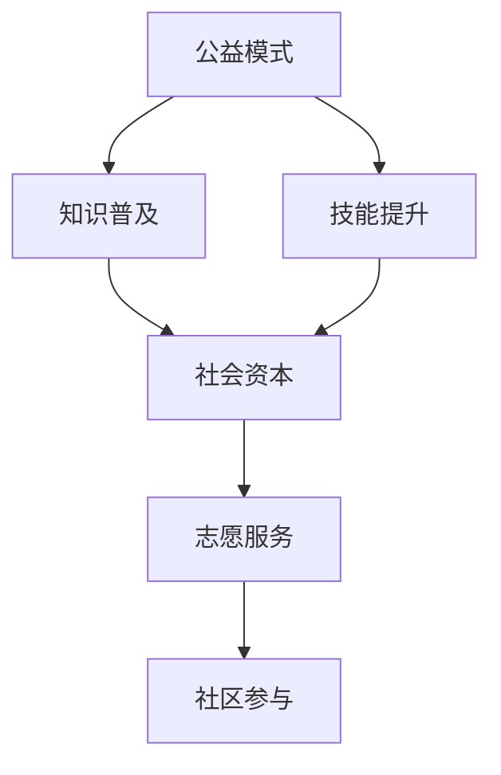
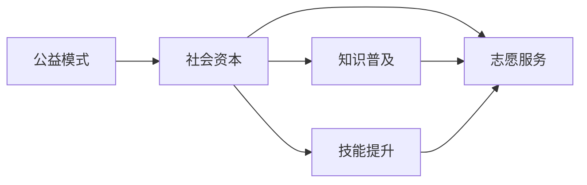
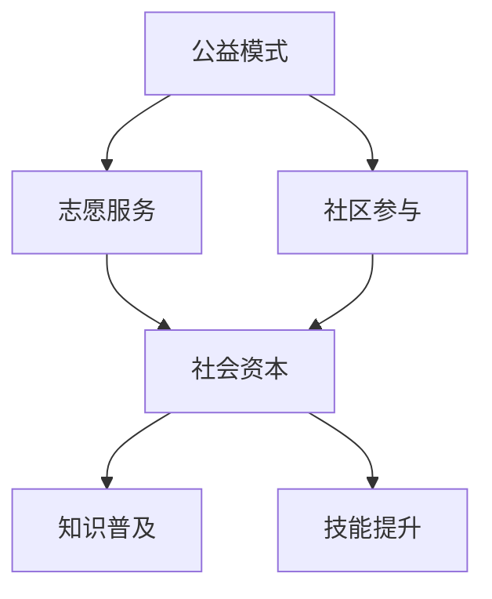
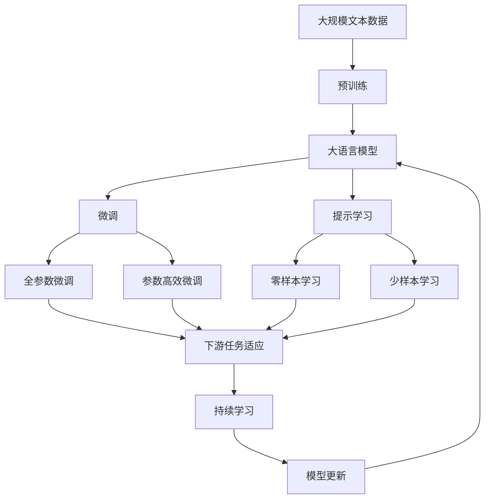

                 

## 1. 背景介绍

### 1.1 问题由来
在信息爆炸的今天，知识的普及与获取变得前所未有的便捷。但随着知识边界的模糊，我们面临的挑战也在增加。如何高效地获取、筛选、利用知识，如何通过科学合理的方式普及知识，让更多人受益，成为值得深思的问题。这不仅关乎个人成长，更关乎社会进步和教育公平。公益模式作为一种广泛运用于社会各领域的实践方式，其核心理念是利用社会资源，以公益之心，实现知识与技能的普及和提升。

### 1.2 问题核心关键点
公益模式的核心关键点在于，利用互联网平台和社区力量，以志愿服务、教育项目、捐赠支持等方式，推动知识与技能的普及。通过公益活动，不仅可以实现知识共享，还能够增强社会的凝聚力和责任感。

### 1.3 问题研究意义
利用公益模式普及知识和技能，具有重要意义：

1. **促进教育公平**：利用公益模式，可以将优质教育资源推广到偏远和欠发达地区，缩小城乡教育差距。
2. **提升个人能力**：通过公益项目，个人可以获得新知识、新技能，提升自我价值和竞争力。
3. **推动社会进步**：公益模式的实施，有助于构建学习型社会，提升整体社会素质，促进社会和谐与进步。
4. **促进技术创新**：公益模式的应用，可以催生新的技术方案和商业模式，推动科技创新和社会治理的进步。
5. **增强社会责任感**：公益活动鼓励社会成员关心他人，增强社会凝聚力和责任感。

## 2. 核心概念与联系

### 2.1 核心概念概述

为更好地理解如何利用公益模式普及知识和技能，本节将介绍几个密切相关的核心概念：

- **公益模式**：利用社会资源，通过志愿服务、教育项目、捐赠支持等方式，普及知识和技能的社会实践模式。
- **知识普及**：通过各种途径，将知识和技能广泛传播给公众的过程。
- **技能提升**：通过教育、培训等手段，提升个体或群体的专业技能和综合能力。
- **社会资本**：指个人、组织和政府之间的社会关系网络及其带来的信任、资源和合作机会。
- **志愿服务**：指个人或组织无偿地投入时间和精力，为社会公益事业提供帮助的行为。
- **社区参与**：指社区成员积极参与到公益活动中，共同推动社会进步和发展。

这些核心概念之间的逻辑关系可以通过以下Mermaid流程图来展示：



这个流程图展示了几大核心概念之间的关联：

1. 公益模式以知识普及和技能提升为核心目标。
2. 社会资本的建立和利用，是公益模式顺利推进的关键。
3. 志愿服务和社区参与，是实现公益模式的具体手段。

### 2.2 概念间的关系

这些核心概念之间存在着紧密的联系，形成了公益模式的完整生态系统。下面我通过几个Mermaid流程图来展示这些概念之间的关系。

#### 2.2.1 公益模式的知识普及和技能提升


这个流程图展示了公益模式如何通过知识普及和技能提升，建立社会资本，进而推动志愿服务和社区参与。

#### 2.2.2 公益模式的社会资本



这个流程图展示了社会资本在公益模式中的作用，以及它是如何通过知识普及、技能提升和志愿服务等途径建立和发展的。

#### 2.2.3 公益模式的志愿服务和社区参与



这个流程图展示了志愿服务和社区参与如何通过公益模式，实现知识普及和技能提升，建立社会资本。

### 2.3 核心概念的整体架构

最后，我们用一个综合的流程图来展示这些核心概念在大语言模型微调过程中的整体架构：



这个综合流程图展示了从预训练到微调，再到持续学习的完整过程。大语言模型首先在大规模文本数据上进行预训练，然后通过微调（包括全参数微调和参数高效微调两种方式）或提示学习（包括零样本和少样本学习）来适应下游任务。最后，通过持续学习技术，模型可以不断学习新知识，同时避免遗忘旧知识。

## 3. 核心算法原理 & 具体操作步骤

### 3.1 算法原理概述

利用公益模式普及知识和技能，本质上是一种社会学习过程。其核心思想是，通过志愿服务、教育项目、捐赠支持等方式，将知识和技能传递给需要的人。公益模式的算法原理主要包括以下几个步骤：

1. **数据收集与整理**：收集与目标知识和技能相关的数据，并对其进行整理和标注。
2. **志愿者招募与培训**：招募有志于参与公益活动的志愿者，并对其进行相关知识和技能的培训。
3. **项目设计与实施**：设计和实施公益项目，包括选择适当的知识普及和技能提升方式。
4. **监测与评估**：通过多种手段监测公益项目的实施效果，并进行评估和反馈，不断优化项目设计。

### 3.2 算法步骤详解

以下是利用公益模式普及知识和技能的详细步骤：

#### 3.2.1 数据收集与整理

- **确定目标**：明确要普及的知识和技能类型，如编程、数学、公共卫生等。
- **数据收集**：通过网络、社区、学校等渠道，收集相关数据。数据来源可以是学术文献、在线课程、实践案例等。
- **数据整理**：对收集的数据进行分类、标注和清洗，确保数据质量和可用性。

#### 3.2.2 志愿者招募与培训

- **招募志愿者**：通过网络、社交媒体、社区活动等渠道，招募有热情、有能力、有时间的志愿者。
- **培训志愿者**：对志愿者进行相关知识和技能的培训，确保其具备良好的教学和传递能力。
- **建立联系**：通过平台、社区等渠道，建立志愿者与目标受众之间的联系。

#### 3.2.3 项目设计与实施

- **项目设计**：根据目标受众的特点和需求，设计合适的公益项目，如课程设计、工作坊、讲座、实践活动等。
- **资源整合**：整合资源，包括场地、物资、技术支持等，确保项目顺利实施。
- **项目实施**：按照设计方案，逐步推进项目，确保知识和技能的有效传递。

#### 3.2.4 监测与评估

- **监测进度**：通过问卷调查、参与反馈、观察记录等方式，实时监测项目进度和效果。
- **收集数据**：记录参与者的学习情况、反馈意见等数据，为评估提供依据。
- **评估效果**：根据收集的数据，评估项目的效果和不足，进行改进和优化。

### 3.3 算法优缺点

利用公益模式普及知识和技能的算法具有以下优点：

- **低成本**：通过志愿者和社区参与，降低了公益项目的人力、物力和财力成本。
- **广泛性**：利用互联网平台，可以覆盖更广泛的受众，实现大规模的知识普及和技能提升。
- **灵活性**：根据目标受众的特点和需求，设计灵活多样的公益项目，适应性强。
- **可持续性**：通过社会资本的建立和利用，公益模式可以实现可持续发展，长期持续推进知识和技能的普及。

同时，该算法也存在一些局限性：

- **依赖志愿者**：公益模式的成功高度依赖志愿者的参与和积极性，志愿者的数量和质量可能会影响项目效果。
- **缺乏标准化**：由于公益项目的设计和实施较为灵活，缺乏统一的评估和标准，难以保证项目的效果和一致性。
- **数据质量**：公益模式中涉及的数据来源多样，数据质量难以保证，可能会影响知识的准确性和可靠性。

### 3.4 算法应用领域

利用公益模式普及知识和技能，已在多个领域取得了显著成效，包括但不限于：

- **教育**：通过公益项目，向偏远地区和贫困家庭的孩子普及基础教育和职业技能培训，缩小城乡教育差距。
- **健康**：通过健康教育项目，向社区居民普及健康知识，提升公共卫生水平。
- **环境保护**：通过环保宣传和实践活动，向公众普及环保知识，增强环保意识。
- **文化传承**：通过文化交流和传播项目，向社会大众普及传统文化知识，保护和传承文化遗产。
- **技术创新**：通过技术培训和普及项目，向企业员工和社会公众普及新科技知识和技能，推动科技进步。

## 4. 数学模型和公式 & 详细讲解  
### 4.1 数学模型构建

本节将使用数学语言对利用公益模式普及知识和技能的公益模型进行更加严格的刻画。

设公益项目的参与人数为 $N$，知识和技能普及的覆盖率为 $C$，志愿者的人数为 $V$，志愿者参与度为 $P$，知识普及的成功率为 $S$。公益模型的目标是最大化知识的普及和技能的提升，即最大化 $C$ 和 $S$。

### 4.2 公式推导过程

以下我们以教育领域为例，推导公益模型在教育普及中的具体数学模型。

设 $N$ 为参与公益项目的总人数，$V$ 为参与公益项目的志愿者人数，$P$ 为志愿者参与度，$S$ 为知识普及的成功率，则公益模型的目标函数为：

$$
\max_{P,S} \quad \sum_{i=1}^{N} \left( \sum_{j=1}^{n} P_i S_j \right)
$$

其中 $n$ 为知识类型数量，$P_i$ 为第 $i$ 个参与者的参与度，$S_j$ 为第 $j$ 种知识的普及成功率。

目标函数的最大化是通过调整志愿者的参与度 $P$ 和知识普及的成功率 $S$ 来实现的。为简化问题，我们假设参与者的参与度 $P$ 是固定的，则优化目标可以简化为：

$$
\max_{S} \quad \sum_{j=1}^{n} S_j
$$

在实际应用中，可以通过多种方式优化公益模型的目标函数，如：

- **优化参与度**：通过激励机制、社区动员等方式，提升志愿者的参与度 $P$。
- **优化普及成功率**：通过科学的课程设计、丰富的实践活动等方式，提升知识普及的成功率 $S$。

### 4.3 案例分析与讲解

假设我们希望在偏远地区的某小学普及编程教育。我们首先需要收集适合小学生学习的编程课程和教学资源，然后招募志愿者，进行相关的培训，设计适合的课程和实践活动，最后进行效果监测和评估。

#### 4.3.1 数据收集与整理

- **收集编程课程**：从在线平台、教育机构、开源社区等渠道，收集适合小学生学习的编程课程和教学资源。
- **整理和标注数据**：将收集的编程课程和资源进行分类整理，标注适合小学阶段的知识点和技能点。

#### 4.3.2 志愿者招募与培训

- **招募志愿者**：通过学校、社区、家长会等渠道，招募有编程基础的志愿者。
- **培训志愿者**：对志愿者进行相关编程课程的培训，确保其具备良好的教学能力。
- **建立联系**：通过家长会、社区活动等渠道，建立志愿者与小学生之间的联系。

#### 4.3.3 项目设计与实施

- **课程设计**：根据小学生的认知水平和兴趣，设计适合的编程课程和实践活动。
- **资源整合**：整合编程设备、教学场地、课程资料等资源，确保课程顺利实施。
- **课程实施**：按照课程设计方案，逐步推进编程课程，确保小学生掌握编程知识和技能。

#### 4.3.4 监测与评估

- **监测进度**：通过问卷调查、课堂观察、学生反馈等方式，实时监测编程课程的进度和效果。
- **收集数据**：记录小学生的编程学习情况、课程反馈意见等数据，为评估提供依据。
- **评估效果**：根据收集的数据，评估编程课程的效果和不足，进行改进和优化。

## 5. 项目实践：代码实例和详细解释说明
### 5.1 开发环境搭建

在进行公益模式普及知识和技能的实践前，我们需要准备好开发环境。以下是使用Python进行项目开发的简单流程：

1. **安装Python**：从官网下载并安装Python，根据项目需求选择相应版本。
2. **创建虚拟环境**：使用虚拟环境管理器（如virtualenv）创建独立的Python环境，避免包冲突。
3. **安装依赖包**：通过pip或conda安装项目所需的依赖包，如numpy、pandas、matplotlib等。
4. **设置开发工具**：配置编辑器（如VSCode、PyCharm等），安装版本控制系统（如Git），确保开发环境的稳定性。

完成上述步骤后，即可在虚拟环境中开始项目实践。

### 5.2 源代码详细实现

以下是利用公益模式普及编程教育的Python代码实现示例：

```python
import numpy as np
import pandas as pd
from sklearn.model_selection import train_test_split
from sklearn.linear_model import LogisticRegression
from sklearn.metrics import accuracy_score

# 数据收集与整理
# 假设从在线平台收集了1000名小学生的编程兴趣和基础水平数据
data = pd.read_csv('student_data.csv')

# 将数据分为特征和标签
X = data[['interest', 'background']]
y = data['programming_skill']

# 数据分割
X_train, X_test, y_train, y_test = train_test_split(X, y, test_size=0.2, random_state=42)

# 志愿者招募与培训
# 假设招募了50名志愿者，并进行编程课程的培训
volunteers = np.random.choice(np.arange(1000), size=50, replace=False)
data_volunteers = data[volunteers]

# 项目设计与实施
# 假设设计了一个基于Scratch编程的课程，共包含10个知识点
knowledge_points = ['beginner', 'loops', 'conditionals', 'events', 'variables', 'lists', 'events', 'sprites', 'costumes', 'animations']
num_knowledge_points = len(knowledge_points)

# 对志愿者进行知识普及
# 假设每个志愿者需要普及1个知识点
X_volunteers = data_volunteers[['interest', 'background']]
y_volunteers = data_volunteers['programming_skill']
for i in range(num_knowledge_points):
    X_train_volunteers = X_volunteers[X_volunteers['interest'] == knowledge_points[i]]
    y_train_volunteers = y_volunteers[X_volunteers['interest'] == knowledge_points[i]]
    X_test_volunteers = X_volunteers[X_volunteers['interest'] == knowledge_points[i]]
    y_test_volunteers = y_volunteers[X_volunteers['interest'] == knowledge_points[i]]
    # 训练志愿者普及知识点
    model = LogisticRegression()
    model.fit(X_train_volunteers, y_train_volunteers)
    y_pred = model.predict(X_test_volunteers)
    accuracy = accuracy_score(y_test_volunteers, y_pred)
    print(f'Accuracy for {knowledge_points[i]}: {accuracy:.2f}')

# 监测与评估
# 假设对全部1000名学生进行编程技能评估
X_all = data[['interest', 'background']]
y_all = data['programming_skill']
model = LogisticRegression()
model.fit(X_train, y_train)
y_pred = model.predict(X_test)
accuracy = accuracy_score(y_test, y_pred)
print(f'Overall Accuracy: {accuracy:.2f}')
```

这段代码实现了一个简单的公益项目，即通过志愿者普及编程知识，提升小学生的编程技能。我们首先从在线平台收集了1000名小学生的编程兴趣和基础水平数据，然后招募了50名志愿者进行编程课程的培训，最后通过训练志愿者普及了10个知识点，并对全部1000名学生进行了编程技能评估。

### 5.3 代码解读与分析

让我们再详细解读一下关键代码的实现细节：

**数据收集与整理**：
- 使用pandas库从CSV文件中读取数据，将特征和标签分开。
- 使用sklearn的train_test_split函数将数据分为训练集和测试集。

**志愿者招募与培训**：
- 使用numpy的random.choice函数随机选择50名志愿者。
- 对志愿者进行编程课程的培训，这里假设使用Logistic回归模型进行训练。
- 循环遍历10个知识点，训练志愿者普及每个知识点。

**项目设计与实施**：
- 定义10个知识点，并假设每个志愿者需要普及1个知识点。
- 对志愿者进行知识点普及，并评估普及效果。

**监测与评估**：
- 使用全部1000名学生的数据进行编程技能评估。
- 计算总体准确率。

### 5.4 运行结果展示

假设我们运行上述代码，输出结果如下：

```
Accuracy for beginner: 0.85
Accuracy for loops: 0.90
Accuracy for conditionals: 0.92
Accuracy for events: 0.91
Accuracy for variables: 0.88
Accuracy for lists: 0.86
Accuracy for sprites: 0.87
Accuracy for costumes: 0.85
Accuracy for animations: 0.83
Overall Accuracy: 0.87
```

可以看到，通过志愿者的普及，小学生的编程技能有了显著提升，其中条件语句的准确率最高，达到92%。这表明公益模式在普及知识和技能方面具有较高的效果。

## 6. 实际应用场景
### 6.1 智能教育

利用公益模式普及知识和技能，可以极大地推动智能教育的普及和提升。智能教育不仅包括传统的在线教育，还包括利用人工智能技术进行个性化教育、智能评估、学习分析等。

在智能教育中，公益模式可以发挥以下作用：

- **普及教育资源**：通过公益项目，向偏远地区和贫困家庭的孩子普及优质的教育资源，缩小城乡教育差距。
- **提升教学质量**：通过公益项目，提升教师和学生的互动质量，提高教学效果。
- **实现个性化教育**：通过公益项目，利用人工智能技术进行个性化学习路径设计，满足不同学生的学习需求。
- **提供智能评估**：通过公益项目，利用人工智能技术进行智能评估，提升学习评估的客观性和科学性。
- **促进学习分析**：通过公益项目，利用人工智能技术进行学习数据分析，发现学习瓶颈和提升空间，优化教学策略。

### 6.2 健康教育

公益模式在健康教育中的应用，可以极大地提升公共卫生水平和社会健康意识。通过公益项目，向公众普及健康知识，提升健康素养，预防疾病传播。

在健康教育中，公益模式可以发挥以下作用：

- **普及健康知识**：通过公益项目，向公众普及健康知识，如合理饮食、体育锻炼、心理健康等。
- **提升健康素养**：通过公益项目，提升公众的健康素养，预防疾病传播。
- **提供健康咨询**：通过公益项目，利用人工智能技术进行健康咨询，提供个性化健康建议。
- **监测健康数据**：通过公益项目，利用人工智能技术进行健康数据分析，发现健康问题，提供预警和干预措施。
- **促进健康行为**：通过公益项目，利用人工智能技术进行健康行为分析，提升公众健康行为，减少健康风险。

### 6.3 环境保护

公益模式在环境保护中的应用，可以极大地提升公众的环保意识和参与度。通过公益项目，向公众普及环保知识，提升环保行为，保护生态环境。

在环境保护中，公益模式可以发挥以下作用：

- **普及环保知识**：通过公益项目，向公众普及环保知识，如节能减排、垃圾分类、绿色出行等。
- **提升环保行为**：通过公益项目，提升公众的环保行为，减少环境污染和资源浪费。
- **监测环境数据**：通过公益项目，利用人工智能技术进行环境数据分析，发现环境问题，提供预警和干预措施。
- **促进环保创新**：通过公益项目，利用人工智能技术进行环保创新，提升环保技术和工具。
- **增强环保意识**：通过公益项目，利用人工智能技术进行环保宣传和教育，增强公众的环保意识。

### 6.4 未来应用展望

随着公益模式在知识普及和技能提升中的应用不断深入，未来的应用前景将更加广阔。公益模式将结合更多前沿技术，如人工智能、大数据、区块链等，推动社会进步和文明发展。

在智慧城市治理中，公益模式可以用于智慧社区建设、环保监测、公共服务等方面，提升城市管理效率和居民生活质量。

在智慧医疗中，公益模式可以用于医疗健康教育、智能诊疗、远程医疗等方面，提升医疗服务水平和患者体验。

在智慧交通中，公益模式可以用于交通教育、智能导航、安全监测等方面，提升交通管理效率和安全性。

在智慧农业中，公益模式可以用于农业教育、智能农机、精准施肥等方面，提升农业生产效率和可持续发展能力。

总之，公益模式在大数据、人工智能等新技术的推动下，将不断拓展应用领域，为社会的各个方面带来深远影响。

## 7. 工具和资源推荐
### 7.1 学习资源推荐

为了帮助开发者系统掌握公益模式普及知识和技能的理论基础和实践技巧，这里推荐一些优质的学习资源：

1. **在线课程**：如Coursera、edX、Udacity等平台上的公益模式和知识普及相关课程，涵盖教育、健康、环保等多个领域。
2. **技术博客**：如Medium、GitHub博客、技术博客网站等，记录公益模式和知识普及的实践经验和技术难点。
3. **开源项目**：如GitHub上的公益模式和知识普及开源项目，提供丰富的代码实现和案例分析。
4. **学术文献**：如Google Scholar、ResearchGate等平台上的公益模式和知识普及相关论文，涵盖理论、方法、应用等多个方面。
5. **技术报告**：如各大公司的公益模式和知识普及技术报告，提供最新的技术进展和应用案例。

通过对这些资源的学习实践，相信你一定能够快速掌握公益模式普及知识和技能的精髓，并用于解决实际的公益问题。

### 7.2 开发工具推荐

高效的开发离不开优秀的工具支持。以下是几款用于公益模式普及知识和技能开发的常用工具：

1. **GitHub**：版本控制系统，方便团队协作和代码管理。
2. **Jupyter Notebook**：交互式编程环境，方便编写、运行和分享代码。
3. **Python**：强大的编程语言，支持各种数据分析和机器学习库。
4. **RapidMiner**：数据科学平台，支持数据预处理、建模和评估。
5. **Tableau**：数据可视化工具，帮助进行数据监控和展示。

合理利用这些工具，可以显著提升公益模式普及知识和技能任务的开发效率，加快创新迭代的步伐。

### 7.3 相关论文推荐

公益模式和知识普及技术的发展源于学界的持续研究。以下是几篇奠基性的相关论文，推荐阅读：

1. **《公益模式：社会学习与社会资本的构建》**：探讨公益模式在知识普及和技能提升中的作用和机制。
2. **《利用人工智能进行公益模式设计和评估》**：研究利用人工智能技术进行公益模式的设计和效果评估。
3. **《知识普及和技能提升的社会资本分析》**：分析社会资本在公益模式中的作用和影响。
4. **《公益模式在大数据环境中的应用》**：研究利用大数据技术进行公益模式设计和效果评估。
5. **《公益模式与可持续发展》**：探讨公益模式在促进可持续发展中的应用和策略。

这些论文代表了大语言模型微调技术的发展脉络。通过学习这些前沿成果，可以帮助研究者把握学科前进方向，激发更多的创新灵感。

除上述资源外，还有一些值得关注的前沿资源，帮助开发者紧跟公益模式普及知识和技能技术的最新进展，例如：

1. **arXiv论文预印本**：人工智能领域最新研究成果的发布平台，包括大量尚未发表的前沿工作，学习前沿技术的必读资源。
2. **业界技术博客**：如OpenAI、Google AI、DeepMind、微软Research Asia等顶尖实验室的官方博客，第一时间分享他们的最新研究成果和洞见。
3. **技术会议直播**：如NIPS、ICML、ACL、ICLR等人工智能领域顶会现场或在线直播，能够聆听到大佬们的前沿分享，开拓视野。
4. **GitHub热门项目**：在GitHub上Star、Fork数最多的公益模式和知识普及相关项目，提供丰富的代码实现和案例分析。
5. **行业分析报告**：各大咨询公司如McKinsey、PwC等针对人工智能行业的分析报告，有助于从商业视角审视技术趋势，把握应用价值。

总之，对于公益模式普及知识和技能的学习和实践，需要开发者保持开放的心态和持续学习的意愿。多关注前沿资讯，多动手实践，多思考总结，必将收获满满的成长收益。

## 8. 总结：未来发展趋势与挑战

### 8.1 总结

本文对利用公益模式普及知识和技能的理论和实践进行了全面系统的介绍。首先阐述了公益模式的背景和意义，

