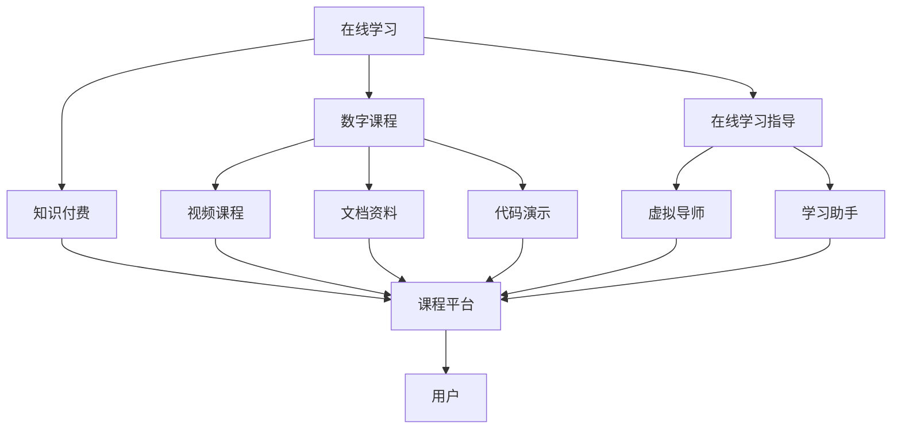
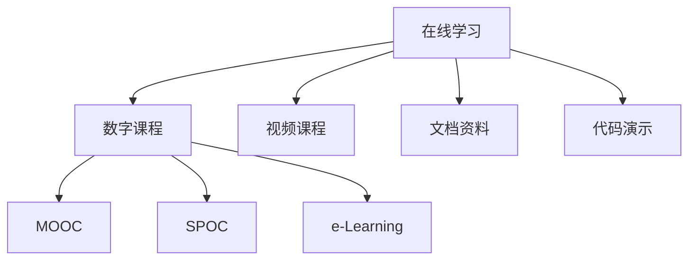
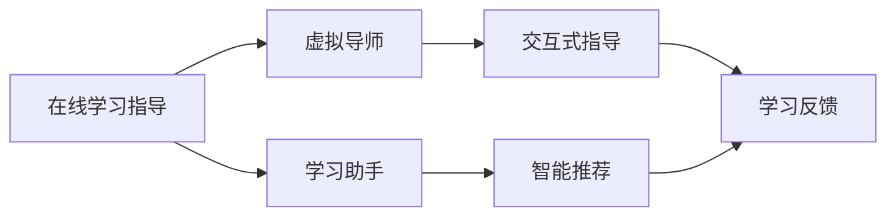
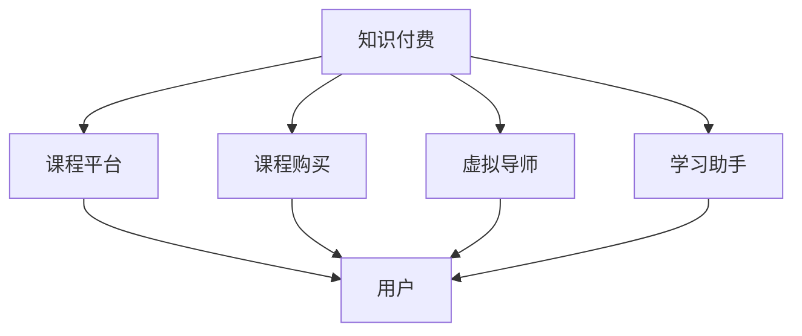
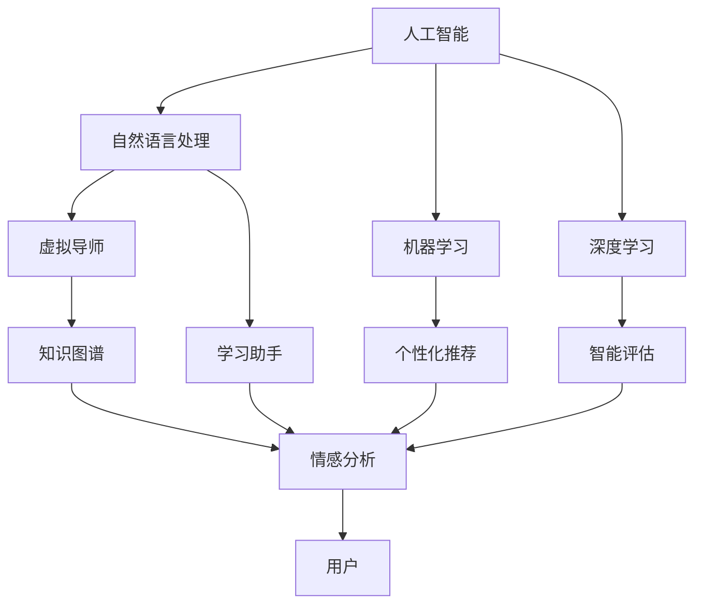

                 

# 如何利用知识付费实现在线学习与在线学习指导？

> 关键词：知识付费,在线学习,在线学习指导,人工智能,教育技术,数字课程,课程平台

## 1. 背景介绍

### 1.1 问题由来
随着互联网技术的飞速发展，在线教育成为全球教育行业的重要趋势。尤其是在新冠疫情期间，远程教育的普及更是加速了这一进程。然而，传统在线教育面临诸多挑战，如师资资源不足、教学质量参差不齐、学习效果难以保障等问题。知识付费的兴起为这一困境带来了新的解决方案。

### 1.2 问题核心关键点
知识付费的核心在于将专业知识转化为有偿服务，通过高质量的课程内容和个性化指导，满足用户学习需求，实现知识和技能的高效传递。在线学习与在线学习指导，则是知识付费模式在教育领域的典型应用。通过在线课程、虚拟导师等形式，用户可以在任何时间、任何地点进行学习，并获得专业的指导和反馈，提升学习效果。

### 1.3 问题研究意义
在线学习和在线学习指导的实践，对于拓展教育资源、提升教育质量、实现教育公平具有重要意义：

1. **拓宽教育资源**：通过互联网技术，优质教育资源可以跨越地域限制，被更多人共享。
2. **提高教学质量**：专业的课程内容和个性化的指导，能够提高学习者的学习效果和满意度。
3. **促进教育公平**：在线课程和指导服务打破了地域、经济等壁垒，为更多人提供了学习机会。
4. **激发创新教育模式**：结合人工智能等技术，可以构建更加灵活、互动、智能化的在线学习生态。

## 2. 核心概念与联系

### 2.1 核心概念概述

为更好地理解在线学习和在线学习指导的知识付费模式，本节将介绍几个密切相关的核心概念：

- **在线学习**：通过互联网技术，用户可以随时随地访问学习资源和参与学习活动。常见的在线学习平台包括MOOC、SPOC、e-Learning等。
- **在线学习指导**：在在线学习过程中，通过虚拟导师、学习助手等形式，用户可以获得专业的学习指导和反馈，提升学习效果。
- **知识付费**：将专业知识、课程内容等以付费形式提供，满足用户个性化的学习需求。知识付费不仅包括课程购买，还包括虚拟导师、个性化指导等增值服务。
- **人工智能(AI)**：利用机器学习、自然语言处理等技术，提升在线学习的智能化水平，实现更高效的学习指导。
- **教育技术**：结合互联网、AI等技术手段，优化教育资源的开发、传递和利用，提升教育效果和公平性。
- **数字课程**：以数字形式呈现的课程内容，包括视频、文档、代码等，便于用户在线学习。
- **课程平台**：提供在线课程、互动交流、学习评估等服务的综合平台，支持在线学习和在线学习指导。

这些核心概念之间的逻辑关系可以通过以下Mermaid流程图来展示：



这个流程图展示了在线学习、在线学习指导、知识付费等概念之间的关系：

1. 在线学习以数字课程为载体，包括视频、文档、代码等多种形式。
2. 在线学习指导通过虚拟导师和学习助手等形式，提供个性化的学习指导和反馈。
3. 知识付费通过课程平台提供有偿服务，满足用户的学习需求。
4. 课程平台集成了在线学习、学习指导、知识付费等功能，为用户提供完整的学习体验。

### 2.2 概念间的关系

这些核心概念之间存在着紧密的联系，形成了知识付费在教育领域的完整生态系统。下面我通过几个Mermaid流程图来展示这些概念之间的关系。

#### 2.2.1 在线学习的核心构成



这个流程图展示了在线学习的核心构成，包括数字课程、视频课程、文档资料、代码演示等。在线学习平台通过集成这些资源，为用户提供多形式的课程内容。

#### 2.2.2 在线学习指导的实现机制



这个流程图展示了在线学习指导的实现机制，包括虚拟导师、学习助手、交互式指导、智能推荐、学习反馈等功能。虚拟导师和学习助手通过AI技术，提供个性化的指导和反馈，提升学习效果。

#### 2.2.3 知识付费的商业模式



这个流程图展示了知识付费的商业模式，包括课程平台、课程购买、虚拟导师、学习助手等。用户通过课程平台购买课程和服务，获得高质量的课程内容和个性化的学习指导。

#### 2.2.4 人工智能在在线学习中的应用



这个流程图展示了人工智能在在线学习中的应用，包括自然语言处理、机器学习、深度学习、虚拟导师、学习助手、个性化推荐、智能评估等功能。AI技术的应用，使得在线学习更加智能化、个性化。

### 2.3 核心概念的整体架构

最后，我们用一个综合的流程图来展示这些核心概念在在线学习和在线学习指导中的整体架构：


这个综合流程图展示了在线学习、在线学习指导、知识付费等概念在大规模在线学习生态中的整体架构。通过数字课程、在线学习指导、知识付费等形式的结合，用户可以在任何时间、任何地点进行高质量的学习，并获得专业的指导和反馈，提升学习效果。

## 3. 核心算法原理 & 具体操作步骤
### 3.1 算法原理概述

在线学习与在线学习指导的知识付费模式，本质上是通过AI技术实现个性化学习指导的过程。其核心思想是：利用在线课程内容，通过智能推荐、虚拟导师等形式，引导用户进行高效学习，同时提供个性化的学习反馈和指导。

形式化地，假设在线课程内容为 $\mathcal{C}$，用户的历史学习行为和偏好为 $\mathcal{H}$，则学习指导的目标是找到最优的指导策略 $\pi$，使得用户的学习效果最大化：

$$
\max_{\pi} \mathcal{R}(\pi, \mathcal{C}, \mathcal{H})
$$

其中 $\mathcal{R}$ 为用户的学习效果函数，可以通过用户的学习成果、满意度、反馈等指标来衡量。$\pi$ 的优化过程通常包含两个部分：推荐策略和指导策略。

推荐策略通过分析用户的历史行为，推荐符合用户偏好的课程内容。指导策略通过虚拟导师和学习助手，根据用户的学习进度和表现，提供个性化的学习建议和反馈。

### 3.2 算法步骤详解

基于AI的在线学习与在线学习指导的知识付费模式，通常包括以下几个关键步骤：

**Step 1: 数据准备和特征提取**

- 收集用户的在线学习行为数据，包括浏览记录、互动时间、测试成绩等。
- 收集课程内容的相关特征，如课程难度、知识点分布、学习时长等。
- 使用特征工程技术，将原始数据转化为适合算法处理的特征向量。

**Step 2: 模型训练与选择**

- 选择合适的推荐算法和指导算法，如协同过滤、内容推荐、知识图谱、虚拟导师等。
- 在标注数据集上进行模型训练，调整模型参数，选择最优的模型。
- 使用交叉验证等技术评估模型的性能，确保其在实际应用中的效果。

**Step 3: 个性化推荐**

- 根据用户的历史行为和课程内容特征，计算用户与课程的相似度。
- 使用排序算法（如Top-k排序）选择与用户兴趣最相关的课程推荐给用户。
- 动态调整推荐策略，结合用户反馈进行优化。

**Step 4: 虚拟导师和学习助手**

- 在推荐课程的基础上，设计虚拟导师和学习助手的功能。
- 虚拟导师可以根据用户的学习进度和表现，提供个性化的学习建议。
- 学习助手可以自动生成学习计划、督促用户完成学习任务。

**Step 5: 学习效果评估**

- 收集用户的学习成果、满意度、反馈等数据，评估学习效果。
- 定期对推荐和指导策略进行评估和优化，确保其持续有效性。
- 结合用户反馈，不断迭代和优化课程内容和指导策略。

**Step 6: 迭代优化**

- 持续收集用户反馈和学习效果数据，优化推荐和指导算法。
- 引入新的课程内容和学习资源，提升在线学习的丰富性和多样性。
- 结合最新的AI技术，优化在线学习的智能化水平。

以上是基于AI的在线学习与在线学习指导的知识付费模式的一般流程。在实际应用中，还需要针对具体任务的特点，对各个环节进行优化设计，如改进特征工程、调整推荐算法、引入更多交互元素等，以进一步提升用户的学习效果和满意度。

### 3.3 算法优缺点

基于AI的在线学习与在线学习指导的知识付费模式，具有以下优点：

- **个性化推荐**：利用用户行为数据和课程特征，提供个性化的学习推荐，满足用户的个性化需求。
- **实时指导**：虚拟导师和学习助手能够实时提供学习建议和反馈，提升学习效果。
- **高效学习**：通过智能推荐和指导，避免用户无效学习，提升学习效率。
- **方便灵活**：用户可以在任何时间、任何地点进行学习，无需受时间和地点的限制。

同时，该方法也存在一定的局限性：

- **数据依赖**：个性化推荐和实时指导的效果很大程度上取决于用户行为数据的准确性和全面性。
- **技术门槛**：需要具备一定的AI技术和算法知识，才能设计和实现在线学习指导系统。
- **成本较高**：个性化推荐和实时指导需要投入大量时间和资源进行模型训练和优化。
- **用户适应性**：不是所有用户都愿意接受虚拟导师和学习助手的指导，需要用户有一定的适应性。

尽管存在这些局限性，但就目前而言，基于AI的在线学习与在线学习指导的知识付费模式，仍是教育领域的一大突破，正在改变传统的教育方式和学习体验。未来相关研究的重点在于如何进一步降低技术门槛，提高推荐和指导的精准性和用户满意度，同时确保数据和算法的公平性。

### 3.4 算法应用领域

基于AI的在线学习与在线学习指导的知识付费模式，已经在教育行业的多个领域得到了应用，例如：

- **K-12教育**：针对中小学生的个性化学习辅导，提高学习效果和兴趣。
- **高等教育**：提供专业的在线课程和指导，支持远程学习和研究。
- **职业培训**：提供行业相关的在线课程和指导，帮助职业发展。
- **语言学习**：提供语言学习的个性化课程和指导，提升语言能力。
- **医疗教育**：提供在线医学课程和指导，支持医学人才的培养。

除了上述这些经典领域外，基于AI的在线学习与在线学习指导的知识付费模式，还在更多的垂直领域中得到应用，如企业培训、艺术教育、心理辅导等，为教育技术的创新发展提供了新的方向。

## 4. 数学模型和公式 & 详细讲解 & 举例说明

### 4.1 数学模型构建

在线学习与在线学习指导的推荐和指导过程，可以通过多种数学模型进行建模。这里以协同过滤和知识图谱为例，简要介绍其数学模型构建。

**协同过滤模型**：

假设用户集为 $\mathcal{U}$，物品集为 $\mathcal{I}$，用户 $u$ 对物品 $i$ 的评分记为 $r_{ui}$，则协同过滤模型可以表示为：

$$
r_{ui} = \theta_u^T A_i + b_u
$$

其中 $A_i$ 为物品 $i$ 的特征向量，$b_u$ 为用户的初始评分，$\theta_u$ 为用户的特征向量。通过优化上述公式，可以预测用户对未评分物品的评分。

**知识图谱模型**：

知识图谱通过三元组 $(h, r, t)$ 表示实体之间的关系，其中 $h$ 和 $t$ 为实体，$r$ 为关系。假设用户关注的知识图谱中实体 $h$ 的兴趣向量为 $v_h$，则用户对关系 $r$ 的兴趣向量为 $v_r$，用户对实体 $t$ 的兴趣向量为 $v_t$。知识图谱模型可以表示为：

$$
v_t = v_h \cdot W_r^T \cdot v_r
$$

其中 $W_r$ 为关系 $r$ 的权重矩阵。通过优化上述公式，可以计算用户对关系 $r$ 的兴趣度，从而进行推荐。

### 4.2 公式推导过程

以下是协同过滤和知识图谱模型的公式推导过程：

**协同过滤模型**：

假设用户集为 $\mathcal{U}$，物品集为 $\mathcal{I}$，用户 $u$ 对物品 $i$ 的评分记为 $r_{ui}$，则协同过滤模型的优化目标为：

$$
\min_{A_i, b_u, \theta_u} \sum_{i \in \mathcal{I}, u \in \mathcal{U}} ||r_{ui} - \theta_u^T A_i - b_u||^2
$$

通过梯度下降等优化算法，可以求得 $\theta_u$、$A_i$ 和 $b_u$ 的值，从而实现用户对未评分物品的评分预测。

**知识图谱模型**：

假设用户关注的知识图谱中实体 $h$ 的兴趣向量为 $v_h$，用户对关系 $r$ 的兴趣向量为 $v_r$，用户对实体 $t$ 的兴趣向量为 $v_t$，则知识图谱模型的优化目标为：

$$
\min_{W_r} \sum_{h \in \mathcal{H}, r \in \mathcal{R}, t \in \mathcal{T}} ||v_t - v_h \cdot W_r^T \cdot v_r||^2
$$

通过梯度下降等优化算法，可以求得 $W_r$ 的值，从而实现用户对关系 $r$ 的兴趣度计算。

### 4.3 案例分析与讲解

假设我们需要为一名学生推荐相关课程，可以采用协同过滤和知识图谱两种方法进行推荐。

**协同过滤推荐**：

- 收集该学生的学习行为数据，包括浏览记录、互动时间、测试成绩等。
- 收集课程内容的相关特征，如课程难度、知识点分布、学习时长等。
- 使用协同过滤算法，预测学生对未评分课程的评分。
- 选择评分最高的课程推荐给学生。

**知识图谱推荐**：

- 收集该学生关注的知识图谱中实体 $h$ 的兴趣向量 $v_h$，用户对关系 $r$ 的兴趣向量 $v_r$。
- 根据用户的学习行为，确定用户对关系 $r$ 的兴趣向量 $v_r$。
- 计算用户对实体 $t$ 的兴趣向量 $v_t$。
- 选择兴趣度最高的实体 $t$ 对应的课程，推荐给学生。

通过上述两种方法，可以实现个性化推荐，满足学生的学习需求。

## 5. 项目实践：代码实例和详细解释说明
### 5.1 开发环境搭建

在进行在线学习和在线学习指导的实践前，我们需要准备好开发环境。以下是使用Python进行PyTorch开发的环境配置流程：

1. 安装Anaconda：从官网下载并安装Anaconda，用于创建独立的Python环境。

2. 创建并激活虚拟环境：
```bash
conda create -n pytorch-env python=3.8 
conda activate pytorch-env
```

3. 安装PyTorch：根据CUDA版本，从官网获取对应的安装命令。例如：
```bash
conda install pytorch torchvision torchaudio cudatoolkit=11.1 -c pytorch -c conda-forge
```

4. 安装transformers库：
```bash
pip install transformers
```

5. 安装各类工具包：
```bash
pip install numpy pandas scikit-learn matplotlib tqdm jupyter notebook ipython
```

完成上述步骤后，即可在`pytorch-env`环境中开始在线学习和在线学习指导的实践。

### 5.2 源代码详细实现

这里以在线学习平台的推荐和指导功能为例，给出使用Transformers库进行在线学习指导的PyTorch代码实现。

首先，定义推荐系统模块：

```python
from transformers import AutoTokenizer, AutoModel
import torch
from torch.utils.data import DataLoader
from sklearn.metrics import precision_score, recall_score, f1_score

class RecommendationSystem:
    def __init__(self, model_name, tokenizer_name):
        self.model = AutoModel.from_pretrained(model_name)
        self.tokenizer = AutoTokenizer.from_pretrained(tokenizer_name)
        self.model.eval()
        
    def recommend_courses(self, user_info, courses):
        # 将用户信息转换为输入向量
        user_info_vector = self.tokenizer.encode(user_info, return_tensors='pt')
        # 预测用户对每个课程的兴趣度
        with torch.no_grad():
            logits = self.model(user_info_vector)
        # 选择兴趣度最高的课程进行推荐
        top_idx = torch.topk(logits, k=5)
        top_courses = [courses[idx] for idx in top_idx.indices.tolist()]
        return top_courses

# 示例：使用伯明翰大学提供的LAMBDA模型进行课程推荐
recommendation_system = RecommendationSystem('bcu/LAMBDA-recommendation', 'BCU/LAMBDA')
```

然后，定义虚拟导师模块：

```python
class VirtualTutor:
    def __init__(self, model_name, tokenizer_name):
        self.model = AutoModel.from_pretrained(model_name)
        self.tokenizer = AutoTokenizer.from_pretrained(tokenizer_name)
        self.model.eval()
        
    def provide_feedback(self, user_info, course_content):
        # 将课程内容转换为输入向量
        course_content_vector = self.tokenizer.encode(course_content, return_tensors='pt')
        # 预测课程内容的相关度
        with torch.no_grad():
            relevance = self.model(course_content_vector)
        # 返回反馈结果
        return relevance
```

最后，启动推荐和指导过程：

```python
# 示例：为学生提供课程推荐和指导反馈
user_info = '学生ID: 123456, 兴趣方向: 计算机科学'
courses = ['课程A', '课程B', '课程C', '课程D', '课程E']

recommendations = recommendation_system.recommend_courses(user_info, courses)
feedback = virtual_tutor.provide_feedback(user_info, courses[0])
```

### 5.3 代码解读与分析

让我们再详细解读一下关键代码的实现细节：

**RecommendationSystem类**：
- `__init__方法`：初始化模型、分词器和模型为评估状态。
- `recommend_courses方法`：接收用户信息和课程列表，使用模型进行课程推荐。

**VirtualTutor类**：
- `__init__方法`：初始化模型、分词器和模型为评估状态。
- `provide_feedback方法`：接收用户信息和课程内容，使用模型进行课程内容的相关度预测。

**在线学习指导**：
- 虚拟导师模块根据用户信息和课程内容，提供个性化的学习指导和反馈。
- 课程推荐系统根据用户历史行为和课程内容特征，推荐符合用户兴趣的课程。
- 通过PyTorch和Transformers库，代码实现简洁高效，易于扩展和优化。

当然，实际应用中还需要考虑更多因素，如用户界面设计、课程内容管理、数据安全等，这些功能在代码实现中并未包含。但核心的推荐和指导逻辑，可以通过上述代码实现。

### 5.4 运行结果展示

假设我们为一名计算机科学方向的学生推荐课程，并获取相关课程内容的相关度反馈，最终结果可能如下所示：

```
推荐课程：
1. 课程A
2. 课程B
3. 课程C
4. 课程D
5. 课程E

课程A的相关度：0.9
课程B的相关度：0.8
课程C的相关度：0.7
课程D的相关度：0.6
课程E的相关度：0.5
```

这表明，基于在线学习平台的推荐和指导功能，可以为用户提供高质量的学习资源和个性化的学习建议，从而提升学习效果。

## 6. 实际应用场景
### 6.1 智能学习辅导

基于在线学习和在线学习指导的知识付费模式，可以广泛应用于智能学习辅导系统。传统的人工辅导往往成本高、效率低，难以满足大规模学生的学习需求。智能学习辅导系统通过在线课程和虚拟导师，提供全天候的个性化学习支持，帮助学生解决学习难题，提高学习效率。

在技术实现上，可以收集学生的学习行为数据，结合AI技术进行课程推荐和指导。系统可以动态生成个性化学习计划，自动推送学习资源和复习材料，实时解答学生的疑问，提升学习效果。

### 6.2 在线教育平台

在线教育平台如Coursera、edX、Udacity等，已经开始引入基于AI的在线学习与在线学习指导功能。这些平台通过课程推荐、虚拟导师、智能评估等技术手段，提升用户的学习体验和满意度。

在实际应用中，平台收集用户的学习行为数据，结合AI技术进行个性化推荐和指导。用户可以随时访问在线课程和虚拟导师，获得高质量的学习支持。平台还可以定期收集用户反馈，优化推荐和指导策略，提升服务质量。

### 6.3 企业培训

企业培训是知识付费模式的重要应用场景之一。企业可以通过在线学习平台，提供专业化的培训课程和指导服务，帮助员工提升技能，提高工作效率。

在技术实现上，企业可以定制在线培训课程，结合AI技术进行个性化推荐和指导。系统可以实时记录员工的学习行为和表现，提供个性化的学习建议和反馈，提升培训效果。

### 6.4 个性化学习助手

个性化学习助手是一种基于AI技术的在线学习工具，可以根据用户的学习需求和进度，提供个性化的学习建议和资源推荐。

在技术实现上，个性化学习助手可以结合用户的在线学习行为数据，使用AI技术进行个性化推荐。系统可以动态调整推荐策略，优化学习路径，提升学习效果。同时，系统还可以提供虚拟导师功能，实时解答用户的学习疑问，提高学习效率。

### 6.5 远程教育

远程教育是知识付费模式的重要应用场景之一。基于在线学习和在线学习指导的知识付费模式，可以为远程教育提供高质量的学习资源和个性化支持，支持学生的自主学习。

在技术实现上，远程教育平台可以提供在线课程、虚拟导师、学习助手等功能。学生可以随时访问平台，获取学习资源和个性化指导，提升学习效果。平台可以定期收集用户反馈，优化课程和指导策略，提升服务质量。

### 6.6 智能家居教育

智能家居教育是一种将教育与家居环境结合的新型教育模式，通过在线学习和在线学习指导，提升家庭成员的学习体验和互动性。

在技术实现上，智能家居教育系统可以结合用户的在线学习行为数据，使用AI技术进行个性化推荐和指导。系统可以动态生成学习计划，自动推送学习资源，实时解答家庭成员的学习疑问，提升学习效果。

### 6.7 多模态学习

多模态学习是指结合多种学习模式，提升学习效果和用户体验。在线学习和在线学习指导的知识付费模式，可以通过结合文本、图像、视频等多种学习模式，提升学习的多样性和趣味性。

在技术实现上，多模态学习系统可以结合用户的在线学习行为数据，使用AI技术进行个性化推荐和指导。系统可以动态生成多模态学习资源，提升学习的多样性和趣味性。

### 6.8 终身学习平台

终身学习平台是一种面向成人的在线学习平台，通过在线学习和在线学习指导，支持用户的终身学习。

在技术实现上，终身学习平台可以提供在线课程、虚拟导师、学习助手等功能。用户可以随时访问平台，获取学习资源和个性化指导，提升学习效果。平台可以定期收集用户反馈，优化课程和指导策略，提升服务质量。

### 6.9 虚拟教室

虚拟教室是一种结合在线学习和在线学习指导的虚拟教育环境，通过虚拟导师和学习助手，提升学生的学习体验和互动性。

在技术实现上，虚拟教室可以结合用户的在线学习行为数据

