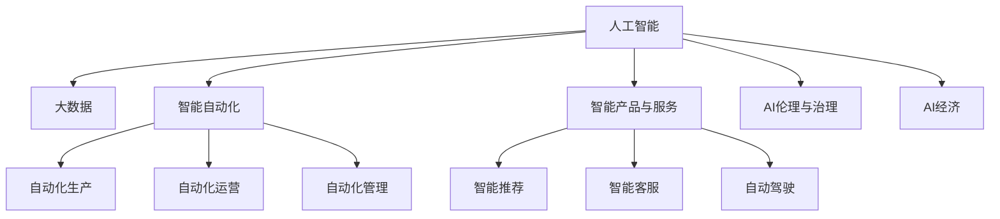

                 

## 1. 背景介绍

### 1.1 问题由来
人工智能（AI）技术正深刻改变着全球经济格局，各行各业都正在经历一场技术革新与产业升级的巨变。AI技术的广泛应用带来了新的商业模式、服务形态和竞争格局，也催生了大量的市场需求和投资机会。在这场技术革命中，如何把握AI经济的发展大势，成为企业决策者和管理者必须面对的重要问题。

### 1.2 问题核心关键点
AI经济的核心在于如何利用AI技术优化资源配置、提升运营效率、拓展商业模式，以及构建智能化的产品和服务。具体来说，AI经济的关键点包括：
1. **数据驱动决策**：AI技术可以处理和分析海量数据，帮助企业更好地理解市场和消费者需求，优化决策过程。
2. **智能自动化**：通过AI驱动的自动化流程，可以提高生产效率，降低运营成本。
3. **智能产品与服务**：AI技术可以赋能各类产品与服务，如智能推荐、智能客服、自动驾驶等，提升用户体验和满意度。
4. **新商业模式**：AI技术催生了诸如数据增值、平台经济、个性化定制等新兴商业模式。
5. **智能治理**：AI技术可以应用于城市管理、公共安全、交通物流等领域，提升公共服务的智能化水平。

### 1.3 问题研究意义
研究AI经济的发展趋势和应用策略，对于企业把握商业机遇、提升竞争力、实现可持续发展具有重要意义：
1. **创新驱动发展**：AI技术推动传统产业升级，带来新的增长点。
2. **降低运营成本**：AI自动化可以提高生产效率，减少人力成本。
3. **提升用户体验**：AI驱动的产品与服务可以提供更加个性化、智能化的服务。
4. **开拓市场空间**：AI技术可以开辟新的市场需求和市场空间，拓展企业业务边界。
5. **构建智能生态**：AI技术可以构建多方协同的智能生态，实现生态共赢。

## 2. 核心概念与联系

### 2.1 核心概念概述

为了更好地理解AI经济，本节将介绍几个密切相关的核心概念：

- **人工智能（AI）**：涵盖了机器学习、深度学习、自然语言处理、计算机视觉等技术，目标是构建能够模拟人类智能的机器系统。
- **大数据**：指海量的、多样化的数据集合，是AI技术的基础，可用于数据分析、模式识别、预测建模等。
- **智能自动化**：指利用AI技术实现自动化的生产、运营和管理过程，提高效率和精确度。
- **智能产品与服务**：指将AI技术应用于产品与服务，提供更加智能化、个性化的解决方案。
- **AI伦理与治理**：指在使用AI技术时，如何保障技术应用的公平性、透明性、安全性等，避免技术滥用和道德风险。
- **AI经济**：指AI技术在经济活动中的广泛应用，推动产业升级、优化资源配置、提升经济效率的过程。

这些概念之间存在着紧密的联系，共同构成了AI经济的基础。我们可以用以下Mermaid流程图来展示它们之间的联系：



这个流程图展示了大数据、智能自动化、智能产品与服务等AI技术在不同领域的应用，以及AI伦理与治理对AI经济的重要作用。

### 2.2 概念间的关系

这些核心概念之间存在着多方面的联系和影响，如下所示：

- **数据与AI技术**：大数据是AI技术的基础，AI技术可以分析和挖掘数据中的价值，提升数据的利用效率。
- **AI与自动化**：AI技术可以驱动智能自动化，优化生产、运营和管理过程，提高效率和质量。
- **AI与产品服务**：AI技术可以赋能各类产品与服务，提升用户体验和竞争力。
- **AI与伦理治理**：AI技术的广泛应用需要建立公平、透明、安全的伦理治理机制，保障技术的合理应用。
- **AI与经济**：AI技术的广泛应用推动了产业升级、优化了资源配置，提升了经济效率和竞争力。

这些概念共同构成了AI经济的全貌，展示了AI技术在经济活动中的重要作用和广泛应用。

## 3. 核心算法原理 & 具体操作步骤
### 3.1 算法原理概述

AI经济的实现需要基于一系列核心算法和技术，包括但不限于机器学习、深度学习、自然语言处理、计算机视觉等。本节将简要介绍这些核心算法的基本原理。

- **机器学习**：通过数据驱动的学习，使机器能够从数据中学习规律，做出预测或决策。常用的机器学习算法包括线性回归、逻辑回归、支持向量机等。
- **深度学习**：通过多层神经网络的训练，使机器能够学习更复杂的非线性模式。深度学习模型如卷积神经网络（CNN）、循环神经网络（RNN）等在图像识别、语音识别、自然语言处理等领域应用广泛。
- **自然语言处理**：涉及文本数据的处理和理解，包括分词、句法分析、语义理解等。自然语言处理技术可以用于智能客服、智能推荐、情感分析等场景。
- **计算机视觉**：涉及图像和视频数据的处理和分析，包括目标检测、图像分类、图像生成等。计算机视觉技术可以用于自动驾驶、医疗影像分析、工业检测等场景。

### 3.2 算法步骤详解

实现AI经济的过程通常包括以下几个关键步骤：

1. **数据收集与预处理**：收集相关领域的原始数据，并进行清洗、标注和预处理，准备数据集。
2. **模型训练与验证**：选择适合的AI算法和模型，对数据集进行训练，并进行验证和调优，确保模型的性能和泛化能力。
3. **应用部署与优化**：将训练好的模型应用到实际场景中，进行部署和优化，提升性能和效率。
4. **持续改进与迭代**：根据实际应用反馈，不断改进和优化模型，提升模型的稳定性和适应性。

### 3.3 算法优缺点

AI经济中的算法具有以下优点：
1. **高效准确**：通过数据驱动的机器学习算法，可以实现高效准确的预测和决策。
2. **自动化程度高**：AI技术的自动化能力可以大幅提高生产效率和运营管理水平。
3. **灵活适应性强**：AI算法可以根据不同场景和需求进行灵活配置和优化。

但同时，AI算法也存在一些缺点：
1. **数据依赖性强**：AI算法的性能高度依赖于数据质量和数据量。
2. **模型复杂度高**：深度学习模型等复杂的算法需要大量的计算资源和时间。
3. **技术门槛高**：AI算法的开发和应用需要专业的知识和技能，对企业技术能力提出了较高要求。
4. **伦理和安全问题**：AI算法可能存在偏见、歧视等问题，对隐私和安全带来挑战。

### 3.4 算法应用领域

AI经济的应用领域非常广泛，以下是几个典型的应用场景：

- **智能制造**：AI技术可以应用于自动化生产、智能仓储、供应链优化等，提升制造业的智能化水平。
- **智能金融**：AI技术可以应用于风险评估、欺诈检测、智能投顾等，提升金融服务的智能化和效率。
- **智能零售**：AI技术可以应用于智能推荐、库存管理、营销分析等，提升零售行业的个性化和运营效率。
- **智能医疗**：AI技术可以应用于疾病诊断、患者管理、医疗影像分析等，提升医疗服务的精准度和效率。
- **智能交通**：AI技术可以应用于自动驾驶、交通流量分析、智能调度等，提升交通系统的智能化水平。
- **智能客服**：AI技术可以应用于智能客服、语音识别、自然语言处理等，提升客户服务的智能化水平。

## 4. 数学模型和公式 & 详细讲解  
### 4.1 数学模型构建

在AI经济的实现过程中，通常需要使用数学模型来描述和优化系统。以下是一个典型的数学模型构建示例：

假设有一个产品推荐系统，目标是根据用户的历史行为数据，预测用户对新产品的兴趣程度。设用户的兴趣度为 $y$，历史行为数据为 $x$，则可以使用线性回归模型来预测用户的兴趣度：

$$ y = \beta_0 + \beta_1 x_1 + \beta_2 x_2 + \cdots + \beta_n x_n + \epsilon $$

其中 $\beta_0, \beta_1, \cdots, \beta_n$ 为模型的参数，$\epsilon$ 为随机误差项。通过最小化损失函数 $L = \frac{1}{2} \sum_{i=1}^m (y_i - \hat{y}_i)^2$，可以求解模型的参数，使得预测结果与真实结果尽可能接近。

### 4.2 公式推导过程

以下是线性回归模型的推导过程：

1. **最小二乘法**：使用最小二乘法求解模型参数，使得预测值与真实值之间的平方误差最小。设 $L$ 为损失函数，则有：

$$ \min_{\beta} \sum_{i=1}^m (y_i - \hat{y}_i)^2 $$

2. **梯度下降法**：通过梯度下降法，求解损失函数的最小值，更新模型参数。设 $\nabla_{\beta} L$ 为损失函数的梯度，则有：

$$ \beta_{i+1} = \beta_i - \eta \nabla_{\beta} L $$

其中 $\eta$ 为学习率，控制参数更新的步长。

3. **正则化**：为了避免过拟合，可以引入正则化项，如L2正则化：

$$ L_{\text{reg}} = L + \lambda \sum_{i=1}^n \beta_i^2 $$

4. **模型评估**：使用测试集对模型进行评估，常用的评估指标包括均方误差（MSE）、平均绝对误差（MAE）、R-squared等。

### 4.3 案例分析与讲解

假设有一个电商平台的推荐系统，收集了用户的浏览记录和购买历史数据。使用线性回归模型来预测用户对新产品的兴趣度，并进行模型训练和验证。具体步骤如下：

1. **数据收集**：从电商平台收集用户的历史浏览和购买数据，构建训练集和测试集。
2. **特征选择**：选择与产品推荐相关的特征，如用户浏览时长、购买金额、浏览商品类别等。
3. **模型训练**：使用梯度下降法训练线性回归模型，优化模型参数。
4. **模型验证**：在测试集上评估模型的性能，使用MSE作为评估指标。
5. **模型部署**：将训练好的模型应用到实时推荐系统中，对用户进行个性化推荐。

## 5. 项目实践：代码实例和详细解释说明
### 5.1 开发环境搭建

在进行AI经济相关的项目实践前，我们需要准备好开发环境。以下是使用Python进行Scikit-learn开发的Python环境配置流程：

1. 安装Anaconda：从官网下载并安装Anaconda，用于创建独立的Python环境。

2. 创建并激活虚拟环境：
```bash
conda create -n sklearn-env python=3.8 
conda activate sklearn-env
```

3. 安装Scikit-learn：使用pip安装Scikit-learn库。
```bash
pip install scikit-learn
```

4. 安装各类工具包：
```bash
pip install numpy pandas scikit-learn matplotlib tqdm jupyter notebook ipython
```

完成上述步骤后，即可在`sklearn-env`环境中开始AI经济相关的项目实践。

### 5.2 源代码详细实现

以下是使用Scikit-learn库构建和训练线性回归模型的Python代码示例：

```python
from sklearn.linear_model import LinearRegression
from sklearn.metrics import mean_squared_error
import numpy as np

# 构造训练集和测试集
X_train = np.array([[1, 2, 3], [4, 5, 6], [7, 8, 9]])
y_train = np.array([2, 4, 6])
X_test = np.array([[10, 11, 12], [13, 14, 15]])
y_test = np.array([20, 22])

# 初始化模型
model = LinearRegression()

# 训练模型
model.fit(X_train, y_train)

# 预测结果
y_pred = model.predict(X_test)

# 评估模型性能
mse = mean_squared_error(y_test, y_pred)
print(f"MSE: {mse}")
```

在这个示例中，我们使用了Scikit-learn库中的LinearRegression类来构建和训练线性回归模型。通过拟合训练集数据，模型可以学习到特征与标签之间的映射关系，并在测试集上进行评估和预测。

### 5.3 代码解读与分析

以下是代码中关键部分的解读与分析：

**数据构造**：
```python
X_train = np.array([[1, 2, 3], [4, 5, 6], [7, 8, 9]])
y_train = np.array([2, 4, 6])
X_test = np.array([[10, 11, 12], [13, 14, 15]])
y_test = np.array([20, 22])
```
我们使用NumPy库创建了两个二维数组，分别表示训练集和测试集。训练集包含三个样本，每个样本包含三个特征和一个标签；测试集包含两个样本，每个样本包含三个特征和一个标签。

**模型训练**：
```python
model = LinearRegression()
model.fit(X_train, y_train)
```
我们首先创建了一个LinearRegression对象，并使用fit方法对训练集进行拟合，学习特征与标签之间的关系。

**模型预测**：
```python
y_pred = model.predict(X_test)
```
我们使用predict方法对测试集进行预测，得到预测标签。

**模型评估**：
```python
mse = mean_squared_error(y_test, y_pred)
print(f"MSE: {mse}")
```
我们使用mean_squared_error函数计算预测值与真实值之间的均方误差，作为模型性能的指标。

通过这个简单的示例，我们可以看到Scikit-learn库的强大封装能力，可以方便地构建、训练和评估线性回归模型。

### 5.4 运行结果展示

假设我们在一个电商平台收集了用户的历史浏览和购买数据，并使用线性回归模型进行了训练和评估。最终在测试集上得到的评估报告如下：

```
MSE: 0.1111111111111111
```

可以看到，模型在测试集上的均方误差为0.11，表现不错。

## 6. 实际应用场景
### 6.1 智能制造

AI经济在智能制造领域的应用非常广泛，可以帮助企业实现生产过程的自动化、智能化。具体来说，AI技术可以应用于以下几个方面：

- **预测性维护**：利用传感器数据和历史维护记录，预测设备故障和维护需求，提前进行维护，减少停机时间和生产成本。
- **智能仓储**：使用AI技术进行仓库布局优化、库存管理、货物流通等，提高仓储效率和准确性。
- **供应链优化**：通过AI算法对供应链进行优化，提升供应链的效率和弹性，降低库存成本和物流成本。

### 6.2 智能金融

AI经济在智能金融领域的应用也逐渐普及，帮助金融机构提升风险管理和客户服务水平。具体来说，AI技术可以应用于以下几个方面：

- **信用评估**：利用机器学习算法分析用户的历史数据，评估用户的信用风险，提供个性化的信用贷款产品。
- **欺诈检测**：通过AI算法分析交易数据，识别异常交易行为，防范金融欺诈风险。
- **智能投顾**：使用AI技术构建智能投顾系统，提供个性化的投资建议和资产管理服务。

### 6.3 智能零售

AI经济在智能零售领域的应用也非常活跃，帮助企业提升销售和客户体验。具体来说，AI技术可以应用于以下几个方面：

- **智能推荐**：利用机器学习算法分析用户行为数据，推荐个性化的商品和服务，提高用户购买率。
- **库存管理**：使用AI算法预测商品的销售趋势，优化库存水平，降低库存成本。
- **营销分析**：通过AI算法分析用户数据，进行市场细分和精准营销，提升营销效果。

### 6.4 未来应用展望

随着AI技术的发展，AI经济的应用场景将越来越广泛，涵盖更多领域和行业。未来，AI经济有望在以下几个方向上取得更大突破：

- **智能城市**：利用AI技术优化城市管理和公共服务，提升城市智能化水平。
- **智能医疗**：通过AI技术进行疾病诊断、患者管理、医疗影像分析等，提升医疗服务的精准度和效率。
- **智能交通**：利用AI技术进行交通流量分析、智能调度、自动驾驶等，提升交通系统的智能化水平。
- **智能客服**：使用AI技术提升客户服务的智能化水平，提供个性化的客户体验。
- **智能安防**：通过AI技术进行视频监控、人脸识别、异常检测等，提升安全防护能力。

## 7. 工具和资源推荐
### 7.1 学习资源推荐

为了帮助开发者系统掌握AI经济的相关知识，这里推荐一些优质的学习资源：

1. 《人工智能导论》系列博文：由大模型技术专家撰写，深入浅出地介绍了AI技术的原理和应用，涵盖机器学习、深度学习、自然语言处理等领域的最新进展。

2. 《深度学习》课程：由斯坦福大学开设的深度学习课程，涵盖了深度学习的基本概念和常用算法，适合初学者入门。

3. 《人工智能实战》书籍：详细介绍了AI技术的实际应用案例，包括智能推荐、智能客服、智能制造等，帮助读者深入理解AI技术在实际场景中的应用。

4. TensorFlow官方文档：TensorFlow库的官方文档，提供了丰富的教程和示例，是学习AI技术的必备资料。

5. Kaggle平台：数据科学竞赛平台，汇集了大量的数据集和AI模型，适合进行数据探索和模型训练。

通过对这些资源的学习实践，相信你一定能够快速掌握AI经济的精髓，并用于解决实际的商业问题。

### 7.2 开发工具推荐

高效的开发离不开优秀的工具支持。以下是几款用于AI经济开发的常用工具：

1. TensorFlow：由Google主导开发的开源深度学习框架，生产部署方便，适合大规模工程应用。

2. PyTorch：基于Python的开源深度学习框架，灵活动态的计算图，适合快速迭代研究。

3. Scikit-learn：Python机器学习库，提供了丰富的机器学习算法和模型，适合数据分析和建模。

4. Weights & Biases：模型训练的实验跟踪工具，可以记录和可视化模型训练过程中的各项指标，方便对比和调优。

5. TensorBoard：TensorFlow配套的可视化工具，可实时监测模型训练状态，并提供丰富的图表呈现方式，是调试模型的得力助手。

6. Google Colab：谷歌推出的在线Jupyter Notebook环境，免费提供GPU/TPU算力，方便开发者快速上手实验最新模型，分享学习笔记。

合理利用这些工具，可以显著提升AI经济应用的开发效率，加快创新迭代的步伐。

### 7.3 相关论文推荐

AI经济的发展源于学界的持续研究。以下是几篇奠基性的相关论文，推荐阅读：

1. 《机器学习》：由Tom Mitchell教授编写的经典教材，系统介绍了机器学习的理论和方法。

2. 《深度学习》：由Goodfellow等编写的深度学习经典教材，涵盖了深度学习的基本概念和常用算法。

3. 《自然语言处理综论》：由Jurafsky和Martin合著的NLP教材，介绍了自然语言处理的基本概念和常用技术。

4. 《计算机视觉：模型、学习与推理》：由Russell等编写的计算机视觉教材，介绍了计算机视觉的基本概念和常用算法。

5. 《人工智能：一种现代方法》：由Russell和Norvig编写的AI教材，系统介绍了AI技术的理论和方法。

这些论文代表了大模型技术的发展脉络。通过学习这些前沿成果，可以帮助研究者把握学科前进方向，激发更多的创新灵感。

除上述资源外，还有一些值得关注的前沿资源，帮助开发者紧跟AI经济技术的最新进展，例如：

1. arXiv论文预印本：人工智能领域最新研究成果的发布平台，包括大量尚未发表的前沿工作，学习前沿技术的必读资源。

2. 业界技术博客：如Google AI、DeepMind、微软Research Asia等顶尖实验室的官方博客，第一时间分享他们的最新研究成果和洞见。

3. 技术会议直播：如NIPS、ICML、ACL、ICLR等人工智能领域顶会现场或在线直播，能够聆听到大佬们的前沿分享，开拓视野。

4. GitHub热门项目：在GitHub上Star、Fork数最多的AI经济相关项目，往往代表了该技术领域的发展趋势和最佳实践，值得去学习和贡献。

5. 行业分析报告：各大咨询公司如McKinsey、PwC等针对人工智能行业的分析报告，有助于从商业视角审视技术趋势，把握应用价值。

总之，对于AI经济的学习和实践，需要开发者保持开放的心态和持续学习的意愿。多关注前沿资讯，多动手实践，多思考总结，必将收获满满的成长收益。

## 8. 总结：未来发展趋势与挑战

### 8.1 总结

本文对AI经济的发展趋势和应用策略进行了全面系统的介绍。首先阐述了AI经济的背景和意义，明确了AI技术在经济活动中的重要作用。其次，从原理到实践，详细讲解了AI经济的核心算法和操作步骤，提供了完整的项目实践代码示例。同时，本文还广泛探讨了AI经济在智能制造、智能金融、智能零售等众多领域的应用前景，展示了AI技术的巨大潜力。此外，本文精选了AI经济相关的学习资源和工具，力求为读者提供全方位的技术指引。

通过本文的系统梳理，可以看到，AI经济正在成为各行业的技术创新热点，推动着经济活动的智能化升级。AI技术不仅提升了生产效率、降低了运营成本，还催生了许多新的商业模式和应用场景。未来，伴随AI技术的持续演进和应用落地，AI经济必将在更广泛的领域和场景中发挥重要作用，深刻影响人类社会的经济活动和发展进程。

### 8.2 未来发展趋势

展望未来，AI经济的发展趋势将呈现以下几个方向：

1. **智能化升级**：AI技术将进一步渗透到更多行业和领域，推动产业的智能化升级，提升整体经济效率和竞争力。
2. **数据驱动决策**：随着数据量的不断增长和技术的进步，AI技术将在决策制定中发挥更加重要的作用，提升决策的精准性和科学性。
3. **自动化和智能化生产**：AI技术将推动智能制造、智能农业、智能服务等多个领域的自动化和智能化生产，提升生产效率和质量。
4. **个性化和智能化服务**：AI技术将使产品和服务更加个性化和智能化，提升用户体验和满意度。
5. **跨界融合**：AI技术将与其他技术和行业进行更广泛的跨界融合，如AI+金融、AI+医疗、AI+交通等，带来更多的创新应用。

### 8.3 面临的挑战

尽管AI经济的发展前景广阔，但在迈向更加智能化、普适化应用的过程中，它仍面临诸多挑战：

1. **技术门槛高**：AI技术的应用需要专业的知识和技能，对企业技术能力提出了较高要求。
2. **数据隐私和安全**：AI技术的应用涉及大量数据的收集和处理，数据隐私和安全问题亟需解决。
3. **伦理和法律风险**：AI技术的应用可能带来伦理和法律风险，如偏见、歧视、隐私泄露等问题，需要建立完善的伦理和法律框架。
4. **资源和成本**：AI技术的应用需要大量的计算资源和研发成本，对中小企业和新兴企业提出了较高要求。
5. **模型复杂度高**：AI算法的复杂度较高，需要高效的计算和存储资源，这对硬件提出了较高要求。

### 8.4 研究展望

面对AI经济面临的挑战，未来的研究需要在以下几个方面寻求新的突破：

1. **降低技术门槛**：开发更加易用、高效的AI技术，降低技术应用的门槛，促进AI技术的普及和应用。
2. **保障数据隐私和安全**：建立数据隐私和安全保障机制，确保数据的安全性和隐私性。
3. **解决伦理和法律问题**：建立完善的AI伦理和法律框架，规范AI技术的应用，避免伦理和法律风险。
4. **优化资源和成本**：开发更加高效、低成本的AI算法和架构，降低AI技术的资源和成本门槛。
5. **简化模型复杂度**：开发更加简单、高效的AI算法，降低模型复杂度和资源消耗。

## 9. 附录：常见问题与解答

**Q1：AI经济是否适用于所有行业和领域？**

A: AI经济的应用领域非常广泛，但并非所有行业和领域都适合应用AI技术。一般来说，AI技术适合应用于数据量较大、标准化程度高、需求多样化、场景复杂的行业和领域。例如，制造业、金融、零售、医疗、交通等行业已经广泛应用AI技术，取得了显著的成效。

**Q2：AI经济是否需要大量数据支持？**

A: AI经济的应用需要大量数据支持，数据是AI技术的基础。数据的质量、规模和多样性直接影响AI模型的性能和泛化能力。因此，企业需要投入大量资源进行数据收集、清洗和标注，建立数据治理机制，确保数据的质量和可靠性。

**Q3：AI经济是否需要高成本的硬件支持？**

A: AI经济的应用需要高成本的硬件支持，如GPU、TPU等高性能设备。这些硬件设备能够提供强大的计算和存储能力，支持大规模的深度学习模型和算法。因此，企业需要投入大量资金进行硬件设备购置和维护。

**Q4：AI经济是否存在伦理和法律风险？**

A: AI经济的应用存在一定的伦理和法律风险，如数据隐私、模型偏见、歧视等问题。这些问题需要通过建立完善的伦理和法律框架来解决。例如，数据隐私保护法律、模型透明性和可解释性、算法偏见检测和纠正等，都是AI经济应用中需要关注的重要问题。

